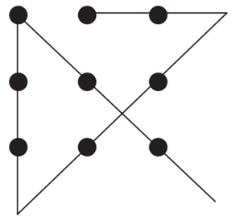

# Challenges for Game Designers: Глава 3. Дизайн головоломок

Перевод третьей главы сборника задач по гейм-дизайну [Challenges for Game Designers](http://wordpress.redirectingat.com/?id=725X1342&site=wordpress.com&xs=1&isjs=1&url=http%3A%2F%2Fwww.amazon.com%2Fgp%2Fproduct%2F158450580X%3Fie%3DUTF8%26tag%3Dgamedesiconc-20%26linkCode%3Das2%26camp%3D1789%26creative%3D9325%26creativeASIN%3D158450580X&xguid=623808d699e50273b1b5fc459196091f&xcreo=0&xed=0&sref=http%3A%2F%2Fgamedesignconcepts.wordpress.com%2F2009%2F04%2F&pref=http%3A%2F%2Fgamedesignconcepts.wordpress.com%2F2009%2F03%2F&xtz=-240) за авторство [Яна Шрайбера](http://www.gamasutra.com/view/authors/916452/Ian_Schreiber.php).

А что вообще такое головоломка?

Это слово слишком часто используется неоправданно, особенно в играх. Так называемые «игры-головомки» вроде _Тетриса_ или _Bejeweled_, на самом деле не имеют ничего общего с разгадыванием, особенно по сравнению с играми, где действительно есть конечный вариант решения, например, как в кроссворде (рис. 3.1) или судоку. А тем временем задачки, называемые «головоломками» прочно вошли в цифровые игры, причём в такие разные, как  _Zork, Zelda, MYST, Final Fantasy,_ и _Monkey Island_. Возьмём, к примеру, самый распространённый вариант такой «головоломки» из видеоигр: «найдите объект Х и поместите его в Y».

_Рис. 3.1 Шаблон для кроссворда_

Также распространены головоломки, часто называемые «мини-игры». Это игры, которые предлагают краткие интерлюдии или задачки, которые надо решить в рамках большой игры. Многие видеоигры используют мини-игры, чтобы разблокировать доступ к следующему разделу или уровню.

Dictionary.com предлагает не менее 12 разных определений слова «головоломка», и лишь одно подходит к играм: «1. Игрушка, проблема, или другое изобретение, созданное с целью развлечения посредством трудностей, которые разрешаются при помощи находчивости или настойчивых попыток».

В нашей книге, в соответствии с использованием этого слова в мире видеоигр, под головоломкой будет подразумеваться любое событие, не связанное с боем, или цепь таких событий, которые требуют от игрока выполнения задания или действия (или серии заданий или действий) для дальнейшего продвижения игры. Выполнение этих заданий может быть как обязательным, так и необязательным.

К сожалению, когда дело касается игрока, иногда нет разницы между головоломкой и знаком «стоп». В этой главе мы разберёмся, как и когда создавать головоломки и встраивать их в большую игру.

### Основные характеристики головоломок

Придумывать новый _тип_ головоломок – это почти то же, что придумывать игру. Есть «состояние» головоломки (схожее с состоянием игры), механика для изменения состояния, целевое состояние и условие победы. Как только вы определились с механикой, вы подстраиваете её, чтобы получить разную динамику. Кроме того, обычно есть тема. В игре _BioShock,_ например, есть мини-игра-«отмычка», при помощи которой игрок может открывать двери и получать контроль над электронными устройствами. Тема здесь – взлом компьютера, а механика включает в себя вращение труб с целью построения пути между входом и выходом на поле. Скриншот и подробное описание работы этой игры-отмычки можно найти [здесь](http://guides.gamepressure.com/bioshock/guide.asp?ID=3348).

Когда вы разрабатываете правила мини-игры, необходимы такие условия:

*   **Понятность**: в правилах и управлении можно легко разобраться
*   **Распознаваемость системы**: системы внутри головоломки должны быть понятными, чтобы игроки могли распознать серию возможных действий, необходимых для решения головоломки. Обычно используются цвета и формы, а также другие сферы общих знаний (правописание или простые функции вещей).
*   **Простота использования**: хороший интерфейс (UI).
*   **Поощряйте навык игрока**: Если игрок встречал головоломку много раз, он должен иметь возможность совершенствоваться в своём умении.

Когда вы разрабатываете правила для головоломки, чтобы встроить её в большую игру, учтите следующие дополнительные условия, которые сделают мини-игру занимательнее:

*   **Погружение**: плавный переход между основной игрой и мини-игрой (обычно это задача художников – сделать интерфейс мини-игры в том же стиле, что и у всей остальной игры, но дизайнер должен правильно подобрать головоломку к сюжету и вселенной игры).
*   **Значимые последствия в игре, за пределами головоломки**: Не просто «вы открыли дверь», но «вы получили всякие плюшки».

### Как сделать головоломки интересными?

Если цель дизайнера – сделать игру интересной, то включение головоломок должно сделать игру _еще интереснее_; то есть, они должны работать на основную цель игры. В некоторых играх головоломки вообще неуместны. В других дизайнер ограничен до нескольких видов головоломок. Например, большинство головоломок (особенно логических и ребусов) будут, скорее всего, неуместны в скоростном шутере, даже в игре-головоломке дизайнер должен ограничиться, главным образом, пространственными головоломками. Ну а если вы остановите сессию в _Тетрис,_ чтобы заставить игрока разгадать ребус или исследовать карту и найти предмет, это и вовсе убьёт суть игры.

А в целом, головоломки это самые настоящие препятствия, которые мешают игрокам достичь цели, пока они их не разгадают. Удовольствие от головоломки обычно вызвано радостью победы, чувством успеха в решении трудной задачи и ощущении контроля, которое предшествует успеху. В идеале, хорошая головоломка должна вызывать у игроков гордость за себя и за свои достижения.

Если головоломки сделаны плохо, это может испортить или вовсе отбить вкус к остальной игре, точно также как дорожная пробка портит впечатление от хорошей поездки. Если игрок не справляется с головоломкой, он не может играть дальше и это очень его раздражает, и головоломка, которая кажется ему навязанной и несправедливой, вызывает досаду на игру (и на её дизайнера).

### Типы головоломок

Есть великое множество разных головоломок. К счастью, их можно разбить на разные категории по общим признакам, таким, как дизайнерские приёмы.

*   **Загадки**

_Мои зубья длинны, мои зубья коротки, мои зубья заканчиваются раньше, чем обо мне заговорят. (Загадка из Beyond от Zork)._

Загадки – это вопросы с одним правильным ответом, но ответ неочевиден. Обычно в загадках используется игра слов, которая требует от игрока нестандартной  интерпретации.

Загадки сейчас гораздо реже встречаются в играх, чем лет двадцать назад. Отчасти, тому есть практическое объяснение: на то, чтобы сочинить загадку требуется немалое количество времени и сил, а игрок встречается с ней всего один раз. Ведь в загадку нельзя сыграть несколько раз – если игрок её отгадал, он просто вспоминает ответ, всякий раз, когда снова её видит. Это свойство загадок делает их весьма затратными, по сравнению с другим контентом.

К тому же, загадки не так уж интересны большинству игроков. Когда ответ становится известен, есть ощущение награды. Однако игрок либо догадывается сразу, либо нет. И если нет, то он либо застревает на этой загадке надолго, либо рыщет по интернету в поисках ответа (если решение, в конце концов, его не озарит). Не очень похоже на захватывающий геймплей.

И всё же, есть несколько хитростей, которые делают загадки не такими досадными для игроков, если уже дизайнер очень на них настаивает:

**Сделайте загадки необязательными.** В классической  RPG _Betrayal at Krondor,_ загадки были замками на сундуках с сокровищами.  Открыв сундук, игрок получал полезные, но не являющиеся необходимыми предметы.

**Предлагайте подсказки.** _Betrayal at Krondor_ не требовало от игрока просто напечатать ответ на загадку. Вместо этого игроку показывалось количество букв в ответе, а у каждой буквы было ограниченное количество возможных вариантов. Настойчивый игрок мог выписать все комбинации и найти подходящие слова, что превращало загадку в игру в слова вроде боггла. Кроме того, игрок мог выведать подсказки в разговорах с персонажами.

Предложите альтернативу. Например, игрок может разгадать загадку _или_ выполнить другое задание. В  _Dungeons & Dragons_ Сфинкс позволяет героям пройти, если они разгадывают загадку, но они также могут напасть на Сфинкса и одолеть его в схватке.

Чтобы придумать загадку, дизайнер обычно начинает с ответа и создаёт саму головоломку потом. Так, к ответу «машина» может быть загадка «Передвигается на четырех, а те, кто на двух, передвигаются внутри». Для любознательных: ответ на загадку из эпиграфа – «молния».

*   **Нестандартное мышление**

Как и загадки, головоломки-лабиринты – это задания с подвохом, на которые есть лишь один правильный ответ. Эти головоломки заданы так, что игрок делает ложное предположение, а для того, чтобы найти ответ, нужно усомниться в этом предположении. Вот классический пример:

Поместите карандаш на лист бумаги. Не отрывая карандаша, нарисуйте четыре прямые линии так, чтобы они соединяли все девять точек. Большинство людей исходят из предположения, что линии, которые мы чертим, не должны выходить за пределы квадрата, сформированного точками. Если отбросить это предположение и начертить линии, которые выходят _за_ его пределы, головоломка легко решается:

Анализ загадок также применим и здесь. Задачи на нестандартное мышление дорого создавать, они решаются всего один раз, они могут раздражать, если являются препятствием и игрок никак не может найти ответ. Как и другие головоломки, сделайте их необязательными, предложите альтернативные пути решения, дайте игрокам дополнительные подсказки, чтобы направить игрока, если ему долго не удаётся отыскать ответ.

*   **Пространственная логика**

Пространственные головоломки подразумевают манипуляции объектами, как в воображении, так и в игровом пространстве (смотри рис. 3.2). _Тетрис,_ по сути своей, является протяжённой во времени пространственной головоломкой на скорость. Серия _Adventures of Lolo_ и _Sokoban_ – примеры того, как серия пространственных головоломок может стать самостоятельной игрой. Другие игры (особенно RPG и приключения) часто используют пространственные головоломки как небольшие квесты в рамках большой игры. Вспомните огромное число головоломок с раздвижными решётками в ролевых играх для консолей и играх в стиле экшн.

_Рис. 3.2 Прототип игры Shift_

В игре _Shift_ использовались квадраты с различными соединительными линиями. Игроки могли поворачивать квадраты и менять направление целых рядов в зависимости от их ориентации. На рисунке представлен прототип игры _Shift_ авторства Уильяма Миллера, Раймонда Шампаньи, Клемми Мёрдок, Джона Йосикавы и Спайви Липси. Перепечатано с разрешения авторов.

Пространственная логика также часто используется в битвах с боссами, когда игроки должны использовать уровни или структуру самого существа, чтобы победить в бою. _Shadow of the Colossus_ отлично использовал это во всех битвах, превращая каждого из существ в многоуровневую игру.

*   **Распознавание образов**

Задачи на распознавание образов требуют от игрока найти и узнать какой-либо образ, опираясь на предоставленную информацию. Взлом кода – высший уровень такого рода головоломок. В электронных играх образы могут появляться перед игроком всё быстрее и быстрее, затрудняя распознавание, или делать различие очень незначительным, например, опускать один из компонентов на каждом пятом появлении образа. В спорте игроки часто изучают образцы поведения команд-противников, чтобы правильно построить свои защиту и нападение.

Битвы с боссами зачастую включают в себя распознавание в боссе образа и, основываясь на нём, – поиск уязвимых для атаки мест.

*   **Логика**

«У вас есть четыре шара, чёрного, синего, красного и жёлтого цвета. Вам необходимо разместить их на четырёх пьедесталах в правильном порядке. Чёрный слева. Красный рядом с синим. Жёлтый справа от красного».

Логические задачки для своего решения требуют от игрока вывести дополнительную информацию из информации, предоставленной в условиях. Такие задачки чаще всего встречаются в сборниках головоломок и приключенческих играх, но их можно использовать в качестве заданий и в других видах игр.

Как и в случае с загадками и задачками на нестандартное мышление, существует одно-единственное решение, которое необходимо найти игроку, поэтому использовать их следует осмотрительно. С другой стороны, логические задачки неприхотливы. В приведённом примере, если за неправильный ответ нет наказания, или оно незначительно, игрок может перебрать все возможные комбинации, пока, в конце концов, не найдёт правильного решения. Кроме того, можно устроить так, чтобы игра давала подсказки, показывая, насколько близко игрок к разгадке. В любом случае, игрок должен либо штрафоваться за неправильные предположения, либо вознаграждаться, если отгадывает сразу же, иначе головоломка кажется лишь надоедливым бессмысленным препятствием на пути к основной игре, и пустой тратой времени.

*   **Исследование**

Лабиринты, подземелья, карты мира…  Исследование пространства встречается во множестве игр. Примерами исследований может послужить поиски какого-то определённого человека в большом городе, поиски пути в запутанной сети коридоров, поиски всех сундуков с сокровищами на уровне. В шутерах от первого лица исследование и знание уровня уступает по важности для выживания разве что развитым навыкам. Приключенческие игры, такие как _The Legend of Zelda,_ известны своими головоломками, построенными на исследованиях, равно как и RPG. _Katamari Damacy_ повышал сложность уровня, заставляя игроков рассматривать уровни под новым углом – как подмножества большего уровня, которые можно посещать снова и снова в разных масштабах. В 2D и 3D платформерах исследование уровня зачастую _и есть_ головоломка. Как вам пройти от А до Б и до Я, чтобы завершить уровень? В этом случае, вы не сражаетесь с врагами, а пытаетесь просто _пройти_ уровень.

Для многих игроков исследование представляет интерес само по себе. Спуск в подземелье и составление карты ходов видится им цифровым аналогом спелеологии. На самом деле, на заре видеоигр, серия _Wizardry_ поставлялась с разлинованной бумагой, а позже включала функцию автокартографирования – но только после того, как игрок обнаружит набор для картографирования в игре. Сейчас автокарты – обычное явление, на многих даже отмечены особые пункты, где от игрока требуется найти какой-либо предмет, решить головоломку, выполнить задание для того, чтобы пройти дальше.

Но хотя исследование и является для многих особым удовольствием, и эстетикой, которую некоторые игры превратили в искусство, для кого-то это может стать препятствием, если он сталкивается с областью, в которую он не может войти или пересечь (большая яма или запертая дверь). Когда игроки заходят в тупик и не имеют запасного пути, это производит тот же эффект, что и плохая загадка – действует как знак «стоп» и раздражает игрока.

*   **Использование предметов**

Некоторые игры, а особенно графические приключенческие (вроде _Myst_) и ролевые, используют головоломки с применением объектов. Игрок должен выяснить, какие предметы и в каком порядке использовать для решения определённой задачи. Простым примером может послужить использование зажигалки, чтобы зажечь фитиль свечи, а затем, использование свечи как источника света, чтобы осмотреть тёмную комнату.

Головоломки с использованием предметов становятся труднее, если предметы надо комбинировать и использовать одновременно или их назначение неочевидно. Одна особенно сложная головоломка из _Maniac Mansion_ требовала тот игрока увлажнить почтовые марки, чтобы наклеить их на конверт, но в игре не было опции «лизнуть марку». Решением было наполнить пустую бутылку водой и поместить её вместе с марками в микроволновку.

Чтобы не досаждать игрокам, дизайнер может давать подсказки о неочевидном использовании предметов, например, ранее в игре может появляться персонаж, использующий этот предмет.

### Дизайн уровней и дизайн головоломок

Между дизайном уровней и дизайном головоломок много общего. При создании уровня вы используете существующую механику (монстры, стены, оружие, выключатели, двери и т. п.) и сводите всё это вместе, чтобы создать уникальный и захватывающий игровой опыт. С точки зрения механики нет разницы между тем, чтобы стрелять в пришельца в длинном узком коридоре или в него же – в тесной комнате. Но динамика при этом совершенно разная. Задача дизайнера уровней как раз и заключается в том, чтобы используя существующие кирпичики изменить динамику.

Похожим образом в дизайне головоломок – дизайнер использует существующую механику, например, раздвижные решётки и новые способы их соединения. В этом случае важно то, как именно вы разместите решётки. В кроссворде важно, как вы разместите слова. В судоку – цифры.

### Один за всех и все за одного

Головоломки – одна из самых трудных в разработке частей игры. То, что слишком сложно для одного игрока, для другого может быть слишком просто. Как найти то, что понравится всем?

Чтобы быть для игрока интересной, головоломка должна быть сложной настолько, чтобы заставить его напрячь усилия для решения, но не настолько, чтобы он махнул на неё рукой с досады или отправился за ответом в интернет. Это само по себе сложно, не говоря уже о том, что у разных игроков разные способности к разгадыванию головоломок и разный запас терпения и настойчивости. Чтобы ещё больше усложнить жизнь дизайнеру, оценка трудности вашей головоломки сама по себе невероятно тяжёлая задача, ведь вы-то уже знаете ответ. Ваши головоломки обычно на порядок сложнее, чем вам кажется. Единственный способ составить себе представление о действительном уровне их сложности – наблюдать, как их решают тестеры.

Многие головоломки становятся тупиками, из которых не найти выхода, если не решить головоломку. Если игрок заходит в тупик, у него есть пять вариантов действия: пробовать снова и снова, купить руководство к игре, спросить у друга, поискать в сети или сдаться. И все эти варианты предельно далеки от интересного.

Может встречаться и другая крайность: головоломки простые настолько, что голову-то ломать и не приходится. Когда игрок тут же видит решение, а потом пять минут возится с интерфейсом, чтобы привести его в исполнение, это уже какая-то пустая волокита.

Как только вы установили, что головоломка слишком проста или слишком сложна, существует несколько способов её уравновесить:

**Добавьте или уберите подсказки.** Как здесь уже упоминалось, если давать игроку последовательные намёки, решать головоломки проще.

**Отдалите или приблизьте подсказки.** Если подсказки расположены слишком близко к головоломке, игроки тут же находят между ними связь. Если они находятся на другом конце карты, игрок может не соотнести их друг с другом, что повышает сложность.

**Предусмотрите несколько правильных решений.** Это особенно актуально, если вы заметили, что несколько ваших тестеров пытаются применить какое-то одно неправильное решение. Вы можете либо изменить головоломку, чтобы сделать это решение правильным, либо дать дополнительные подсказки, чтобы ясно дать понять: это решение не подходит.

**Предложите динамическую помощь.** _Ratchet & Clank_ и _Portal,_ например, предлагают игроку дополнительную помощь, если первая попытка не удалась. Это служит для того, чтобы не дать игроку «застрять» на задании, но всё-таки не отнимать у него возможность решить головоломку самостоятельно и получить заслуженную награду.

**Используйте динамическую подстройку сложности (DDA).** C DDA игра сама делается проще или сложнее, в зависимости от успехов игрока, сохраняя необходимый уровень трудности. Эта система годами применялась в настольных ролевых играх: мало найдётся таких мастеров игры, которые не приврали бы пару раз о том, что выпало на костях, чтобы слабый персонаж мог выжить, или чтобы монстра было проще или сложнее одолеть, чем это изначально задумано. В цифровые игры DDA впервые попали в 1985 году в _Heart of Africa_ Дани Берри: игра перемещала ключевые локации, если игрок долго не мог их обнаружить.

**Уберите линейность.** Если один ход закрыт для игрока, у него должна быть возможность пойти другим путём или вообще найти другой выход из положения. У игроков всегда должна быть задача – цель, к которой они стремятся. Множество целей в нелинейном дизайне упрощают этот процесс.

**Добавьте временные рамки.** Относительно простая головоломка становится сложнее, если у игрока мало времени на решение.

**Добавьте или уберите обратную связь.** Некоторые из ранних текстовых и графических приключенческих игр не давали никаких указаний на то, что выбранное решение неверно, кроме «Вы не можете этого сделать» или «Это не сработало». При отсутствии обратной связи игрок должен продолжать попытки без какой-либо дополнительно информации. Но если игрокам дать указание на то, _почему_ их решение не сработало, они могут скорректировать свой подход. Например, если игрок не может войти в тёмную комнату без какого-либо источника света, игра может подсказать: «Там очень темно, а вы боитесь темноты» — вместо того, чтобы просто сказать: «Вы не можете сейчас туда войти».

**Тестируйте игру на разных игроках.** Зачастую самыми искусными игроками в видеоигры являются люди, которые тестировали их в самом начале. Некоторые гейм-дизайнеры совершают ошибку и продолжают использовать тех же самых тестеров как единственное мерило сложности своей игры, и как результат, их игры оказываются слишком сложными для среднестатистических пользователей. Ничто так не помогает обнаружить тупиковые места в игре, как регулярный набор свежих тестеров.

Есть также метод, который _нежелательно_ использовать, чтобы уравновесить сложность головоломок: не помещайте решения в официальное руководство к игре и не требуйте, чтобы игроки его приобретали.

## Джеб Хейвенс о дизайне головоломок

_Джеб Хейвенс гейм-дизайнер работающий с_ Maxis _и создатель множества цифровых и нецифровых игр, включая_ Spore _и_ Mother Sheep_._

Одна из самых важных вещей, делающих головоломку интересной, это моменты озарения. Это моменты, когда что-то вдруг встаёт на место, привнося новый смысл и понимание в то, что раньше казалось хаотичным и бессмысленным. Мозг человека устроен так, чтобы упорядочивать и придавать смысл и структуру огромному количеству информации, постоянно в него поступающей. Без этого инстинкта и способности классифицировать, делить на категории и разбивать на блоки, мы бы просто переутомились. Именно поэтому, когда мы сталкиваемся с хаосом головоломки, наш разум сразу же хочет в нём разобраться, чтобы с ним проще было иметь дело. Например, если вам нужно будет запомнить последовательность: НВЕВАРПРАЙЮНЮЛВГЕНКТОЯЕК – наверняка, это вызовет некоторые затруднения.

Попробуйте. Закройте глаза и попробуйте её воспроизвести. Нет, серьёзно, попробуйте, а потом продолжайте читать. Сколько вам удалось вспомнить? Возможно, вы различили в последовательности слова «вар», «рай», «ген» или «кто я» и использовали их как зацепки? Видите? Ваш мозг уже пытается разбить эту бессмыслицу на части, имеющие какое-то значение. А теперь, что если я скажу вам, что эта последовательность – не что иное как вторые и третьи буквы двенадцати месяцев года (яНВарь, фЕВраль, мАРт, аПРель и так далее)? Теперь уже и запоминать нечего, правда? Закройте глаза и попробуйте воспроизвести последовательность. Решение головоломки почти всегда означает, что вам необходимо разместить все её элементы в таком порядке, который придаёт им смысл. Это как способность абстрагироваться и посмотреть на всё со стороны, тогда многое становится понятным. А когда что-то понятно, мозгу с этим проще справиться. А эволюция позаботилась о том, чтобы вещи, облегчающие работу мозга, воспринимались как приятные. Отсюда и это приятное чувство озарения, когда получается свести все концы. Если мир вокруг становится понятнее, с ним проще иметь дело, и мы чувствуем себя сильнее, ведь гораздо легче контролировать вещи, которые вы понимаете на глубинном уровне. Разгадывание головоломок – интеллектуальный способ показать миру, кто здесь хозяин.

Итак, наш мозг любит находить решения, связывать разрозненные, не первый взгляд, вещи. Тем не менее, находить связи между разрозненными фактами трудно. Именно поэтому они и разрозненные. Поэтому, ваша задача как гейм-дизайнера – ненавязчиво вести игрока к пониманию. Это можно делать, например, зная и используя предыдущий игровой опыт вашего отгадчика. Если головоломка предусматривает использование знакомого предмета новым способом, игрок должен предварительно несколько раз использовать этот предмет и хорошенько понимать, как он работает в разных ситуациях, также он должен иметь возможность свободно экспериментировать с предметом. Очень важно, чтобы основные классы предметов в игре действовали последовательно (все враги, подобного вида убегали от громких звуков, все ящики разлетались на части, если по ним ударить, все панели управления становились неисправными от воды и т. п.).

Другой важный способ подведения отгадчика к правильному решению – позволить головоломке развиваться постепенно, через несколько последовательных озарений. На каждом шагу игрока поощряют, показывая, что он на правильном пути, или понял основной принцип решения. Сигнал может быть очень простым (звук «звоночка») или сложным (полная смена анимации персонажа, но тогда это должно быть совершенно недвусмысленной реакцией на действия игрока, а не просто проходным фоновым событием). Если что-то меняется, подсказывая игроку, что только что сделанный шаг ведёт в нужном направлении, даже самые сложные головоломки и логические переходы становятся вполне решаемыми. Кроме того, что игрок будет радоваться каждому маленькому шагу, он почувствует особое ликование в конце, когда оглянувшись назад, увидит, что это _его_ решение, пусть его и направляли немного.

### Задания

Несмотря на сложность – а придумывать головоломки действительно сложно – дизайнерам всё время приходится их создавать. К счастью, создание хорошей головоломки – само по себе отличная головоломка.

**Задание 1 – Это бомба!**

Как и в случае с играми, иногда при создании головоломки нужно подогнать механику под заданную тему.

На этот раз вам нужно разработать игру, взяв за основу старый сериал _McGyver,_ и часть сюжета требует от главного героя обезвредить бомбу. Вместо того чтобы вставлять неинтерактивную сцену, вы решили сделать из этого головоломку на время, где игра заканчивается если игрок принял неправильное решение или думал слишком долго. Что, если не _это,_ может заставить игрока поволноваться?

Подумайте над видами головоломок, которые мы здесь привели, отберите три подходящие для заданной темы. Затем выберите наиболее вам понравившийся и создайте рабочий прототип головоломки.

**Необходимые компоненты:**

*   Материалы для создания прототипа
*   Кухонный таймер, чтобы отсчитывать оставшееся время.

**Отчётность:**

*   Три параграфа с наброском, описывающие основную механику – для каждой головоломки.
*   Рабочий прототип одной из трёх головоломок.

**Предлагаемый порядок действий:**

1.  **Мозговой штурм.**

Подумайте, какими способами персонаж может обезвредить бомбу. Можно прикрепить бомбу к головоломке типа «пятнашки», но это будет как-то натянуто. Подумайте о механике, которая бы действительно подходила заданной теме. Какие виды головоломок (загадки, нестандартное мышление, пространственные, логические, исследование, использование предметов) хорошо лягут на вашу механику? Продолжайте искать, пока не подберёте, по крайней мере, три базовых типа механики, подходящие для головоломки про обезвреживание бомбы.

2.  **Выберите одну.**

Возьмите одну базовую механику и воплотите её. Доработайте механику. Определите главную цель. Затем выберите детали для вашей конкретной головоломки: начальное состояние, цель, правильные и неправильные решения.

3.  **Тестирование и прогон.**

Испытайте головоломку на друзьях. Удалось ли им её решить? Как быстро они с ней справились? Предвидели ли вы подход, который они использовали? Вернитесь в начало и внесите в головоломку изменения, если какие-то её аспекты были не ясны или она была слишком сложной (или слишком простой, хотя гейм-дизайнерам редко удаётся создать что-то слишком простое).

4.  **Создайте отчётный образец.**
5.  **Добавьте уровни сложности (по желанию).**

После того, как вы представили свой прототип, издатель настаивает на многоуровневой системе сложности и на том, чтобы на сложность можно было как-то повлиять. Придумайте хотя бы три способа, как это сделать, не меняя отведённого игроку времени. Опишите подробно.

**Задание 2 – Больше, чем просто лабиринт.**

Подумайте, как из лабиринта можно сделать головоломку с исследованием. Обыкновенный лабиринт с готовыми путями не очень привлекателен для игрока, который уже много раз имел дело с лабиринтами. Многие старые RPG требовали от игрока создавать карту целой серии лабиринтов. Сегодня многие любители игр посчитали бы это лишней вознёй и предпочли бы, чтобы карта составлялась автоматически. В этом задании мы попробуем сделать так, чтобы у игрока появился стимул создавать свою собственную карту.

Набросайте как можно больше идей о том, какую механику можно добавить в простой лабиринт, чтобы составление карты стало головоломкой само по себе. Нужны хотя бы три.

Примером (который вам нельзя использовать, как своё решение для этого задания) может послужить лабиринт из классической игры _Adventure_  для _Atari 2600._ В этой игре лабиринт «сворачивается», поэтому, повернув влево можно выйти на правой стороне лабиринта. Вы можете проходить рядом с одним и тем же местом несколько раз, находясь в совершенно разных частях лабиринта. Это сильно затрудняет создание карты и поиск пути, делая их головоломной задачей, несмотря на то, что сам лабиринт не так уж велик.

**Необходимые компоненты:**

*   Линованная бумага

**Отчётность:**

*   Краткое описание каждой механики, которую вы смогли придумать (от предложения до небольшого абзаца).
*   Образец лабиринта (нарисованный от руки), иллюстрирующий выбранную механику.

**Предлагаемый ход действий:**

1.  **Мозговой штурм.**

Велико искушение начать вспоминать игры, в которые вы играли, а не придумывать нестандартную механику. Между тем, так вы рискуете ограничить свой творческий процесс, ведь трудно додуматься до чего-то нового, если всё время перебирать идеи других людей. Сначала поищите свои собственные идеи, а уже потом проверьте, не использованы ли они уже в  существующих играх.

2.  **Создайте отчётный образец.**

**Задание 3 – Пароль?**

Человек заходит к себе домой и ловко набирает 4-5 цифр на щитке безопасности. На работе, дома, у банкомата – коды стали частью нашей жизни. Они также часто используются в видеоиграх, чтобы впустить одних и оградиться от других.

В этом задании ваша цель – разработать три разных головоломки на подбор пароля. Здесь есть три этапа:

*   Задать код (он не обязательно должен быть цифровой)
*   Задать то, как игрок будет этот код вводить
*   Задать, как именно игрок находит этот код

Существуют простые пути: сделать код из четырёх цифр, надо убить четырёх существ, каждое из которых «даст» одну цифру. Затем игроку остаётся только определить последовательность. И хотя так тоже можно сделать, думаю, это слишком очевидно. Подумайте, чего игрок не ожидает? Физические манипуляции объектами на уровне, выстраивающие их в нужном порядке или поиск особых предметов, которые подходят по заданным параметрам.  Вспомните множество уникальных «ключей», которые использовались, чтобы запереться от людей (или запереть людей) во времена Средневековья.

**Необходимые компоненты:**

*   не требуются

**Отчётность:**

*   Макеты отдельных головоломок
*   Описание того, как работает головоломка
*   Дизайн уровня на линованной бумаге (если есть необходимость).

**Предлагаемый ход действий:**

1.  **Исследование.**

В наши дни и в прошлом, какие использовались методы, чтобы защитить ценности от тех, кто не должен был иметь к ним доступа? Какие методы использовались для того, чтобы _предоставить_ доступ? Ваши головоломки должны быть правдоподобными. Конечно, вы можете сказать, что пароль от засекреченной зоны написан на стенах нескольких офисов в виде математической задачи, которую может решить каждый, владеющий основами алгебры, но разве так поступили бы в реальном мире? Если нет, то головоломка покажется надуманной и притянутой за уши.

2.  **Мозговой штурм.** Из различных методов запароливания, которые вам встречались, какие, на ваш взгляд, самые игровые? Подумайте, как можно переделать их в головоломки, встроенные в рамки большой игры.
3.  **Проработайте детали.**

Постарайтесь создать несколько головоломок, основываясь на своих идеях. Не обязательно разрабатывать всю игру, просто основные правила для головоломки.

4.  **Сделайте отчётный образец.**

**Задание 4 – Поразительная головоломка**

Электричество успешно применяется для головоломок в видеоиграх, ведь прокладыванием электрической цепи с одной стороны на другую можно логически объяснить выполнение какого-либо действия, если, конечно, цепь была собрана как надо. Цель этого задания – создание бумажного прототипа головоломки, в которой электрический ток проводится с одной стороны экрана в другую. Вы можете использовать любой интерфейс, если он требует от игрока применить пространственное мышление.

**Необходимые компоненты:**

*   Материалы для создания прототипа

**Отчётность:**

*   Прототип с прилагающимися правилами, в которых указано исходное состояние, задача и действия, которые может предпринимать игрок.

**Предлагаемый ход действий:**

1.  **Мозговой штурм.**

Как вы представите электрический ток, идущий с одного края экрана на другой? Как выглядит «успешный исход»? Есть ли «неудачи» или игрок просто делает попытку за попыткой, пока ему не удастся?

2.  **Придумайте механику.**

Определите, какие действия может предпринимать игрок. Какие последствия эти действия имеют на состояние головоломки?

3.  **Создайте образец головоломки.**

Используя свои правила, создайте головоломку. Обязательно запишите её решение. Если у вас есть время, сделайте две головоломки: одну – очень простую, чтобы показать новичку базовую механику, вторую – сложнее, раскрывающую всю сложность механики.

4.  **Прогоните игру несколько раз.**

Испытайте головоломку на друзьях, если нужно, поправьте правила и уровень сложности.

5.  **Создайте отчётный образец.**

**Задание 5 для железных дизайнеров – Сыграйте в _New_ _Eleusis_ (вживую).**

_New Eleusis_ – игра с двумя стандартными колодами карт, рассчитанная на 5-8 человек. Она была придумана Робертом Эбботом и опубликована в _Scientific American_ в 1977 году. Карты разыгрываются в определённом порядке. Один игрок берёт на себя роль бога и создаёт правило, какая карта может разыгрываться при каком условии (например, «всегда ходите красной картой после чёрной карты»). Другие игроки берут на себя роль учёных и разыгрывают свои карты, путём логической индукции пытаясь разгадать правило, созданное «богом». Роль бога передаётся от игрока к игроку, поэтому каждый имеет возможность создать правило. В конце каждого раунда игрокам начисляются очки; кто наберёт больше всего очков за игру – побеждает.

Система очков поощряет «бога» за создание правила достаточного сложного, но не настолько, что его невозможно разгадать. В частности, больше всего очков «бог» получает тогда, когда хотя бы один игрок разгадывает правило (спустя некоторое время), и ещё хотя бы один игрок совершенно неспособен понять, в чём же дело. Дизайнер предлагает следующее, для того, чтобы ваше правило набрало наибольшее количество очков:

*   Ваше правило почти всегда сложнее разгадать, чем вы думаете.
*   Если вы даёте подсказки, они не должны запутывать игроков. Правило сложно отгадать и так, без ваших активных попыток ввести игроков в заблуждение.
*   В любой момент примерно половина карт в колоде должна иметь возможность быть сыгранной по правилу. Если игроки почти всегда правы (или неправы), у них будет недостаточно информации, чтобы вывести ваше правило.

Хотя изначально эта игра была создана, чтобы обучать научному подходу, она ещё и учит гейм-дизайну. Когда игрок создаёт правило, по сути, он создаёт логическую задачу, которую другие игроки должны решить опытным путём. Система начисления очков вознаграждает игроков, которые создают адекватные по сложности правила, а также награждает других игроков за их решение. Поиграйте в эту игру с товарищами, которые тоже сочиняют головоломки. После игры обсудите каждое правило: что именно делало его слишком простым, слишком трудным или в самый раз подходящим.

**Необходимые компоненты:**

Две стандартные колоды игральных карт

Правила игры _New Eleusis_ доступны на просторах сети интернет (для этой публикации использовались правила [отсюда](http://matuszek.org/eleusis0.html):  но их можно найти где угодно, воспользовавшись поисковиком).

**Отчётность**

Не требуется

**Предлагаемый порядок действий:**

1.  **Сыграйте в игру.**

Сыграйте в эту игру с товарищами, которые тоже придумывают головоломки. После игры обсудите в группах каждое правило: что именно делало его слишком простым, слишком трудным или в самый раз подходящим.

2.  **Запишите извлечённые уроки (не обязательно).**

Улучшила ли игра ваш навык в создании головоломок? Как? Запишите свои наблюдения и поделитесь с коллегами, которые с вами не играли.

**Быстрые нецифровые задания**

Ниже приведены идеи для настольных, карточных и других игр, не содержащих никаких цифровых составляющих. Они идеальны для того, чтобы потренироваться в нецифровом дизайне.

1.  Создайте игру с выкладыванием плиток, которая симулирует исследование подземелья. В ней должны быть различные предметы, помогающие продвигаться вперёд.
2.  Создайте такую игру, где прийти к успеху можно только выкладывая плитки определённым способом. Разработайте динамику, рассчитанную как на одного, так и на нескольких игроков.
3.  Используя линованную бумагу и простую шестигранную кость, создайте карту, по которой игроки должны передвигаться, решая, как минимум две головоломки.
4.  Придумайте правила для игры с использованием следующих компонентов: паззл на 100 деталей (не собранный) в качестве игрового поля, которое собирается в ходе игры и фишки, представляющие каждого игрока. Можно использовать дополнительные компоненты по вашему желанию.
5.  Придумайте игру, в которую играют на поверхности Кубика Рубика. Предположительно, следует использовать магнитные фишки, представляющие игроков, которые можно прикреплять к боковым и нижним граням Кубика.
6.  Возьмите любую головоломку, которая обычно решается одним игроком (например, кроссворд или судоку) и переделайте правила так, чтобы это стало соревновательной игрой на двоих.
7.  Возьмите головоломку для нескольких игроков (например, настольная игра _Clue,_ головоломка _Mastermind,_ или карточная игра _Sleuth_) и переделайте правила так, чтобы она была рассчитана на одного игрока. Убедитесь, что у игрока достаточно информации для решения головоломки и что в неё можно играть без дополнительных подсказок от компьютера или другого человека.
8.  Используя распознавание образов, создайте игру, обучающую детей правописанию. Обратите внимание, что правильно написанное слово, по сути, и представляет собой распознанный образ.
9.  Создайте игру-викторину, для продвижения в которой задачки на эрудицию должны решаться в группе.
10.  Загляните на страницу с головоломками в любой из главных газет. Выберите головоломку и создайте её модификацию, в которой изменена тема и добавлена или изменена хотя бы одна из механик.

**ИСТОЧНИКИ**

**[“Designing the Puzzle” Bob Bates](http://www.scottkim.com/thinkinggames/GDC00/bates.html)**

[**2 puzzle. Dictionary.com. Dictionary.com Unabridged (v 1.1). Random House, Inc.**](http://dictionary.reference.com/browse/puzzle)

 _Перевод — Ю. Сергеева_