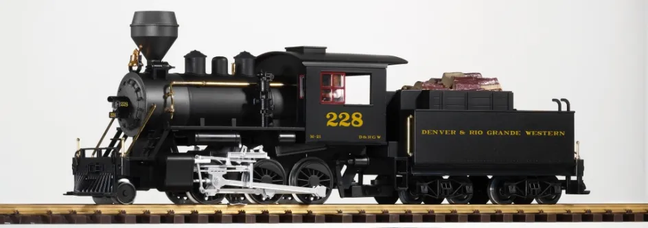

# Challenges for Game Designers: Глава 4. Преобразование цифрового в реальное

Перевод четвертой главы сборника задач по гейм-дизайну [Challenges for Game Designers](http://wordpress.redirectingat.com/?id=725X1342&site=wordpress.com&xs=1&isjs=1&url=http%3A%2F%2Fwww.amazon.com%2Fgp%2Fproduct%2F158450580X%3Fie%3DUTF8%26tag%3Dgamedesiconc-20%26linkCode%3Das2%26camp%3D1789%26creative%3D9325%26creativeASIN%3D158450580X&xguid=623808d699e50273b1b5fc459196091f&xcreo=0&xed=0&sref=http%3A%2F%2Fgamedesignconcepts.wordpress.com%2F2009%2F04%2F&pref=http%3A%2F%2Fgamedesignconcepts.wordpress.com%2F2009%2F03%2F&xtz=-240) за авторство [Яна Шрайбера](http://www.gamasutra.com/view/authors/916452/Ian_Schreiber.php).

Когда студенты впервые приходят на занятия по гейм-дизайну, они очень удивляются, если им дают задание, которое они воспринимают как «задание наоборот»: сделать настольную версию видеоигры. И хотя они могут ничего при этом не говорить, преподаватель всё равно читает в их глазах вопрос: «С чего бы мне это могло понадобиться?»

Причин множество. Хотя самой важной из всех, пожалуй, является эта: «Если вы не можете сделать нецифровую игру из цифровой, если не можете «сделать наоборот», вы не понимаете тонкостей чистого дизайна, скрытого за графикой и реализованного программированием».

Как вы уже могли заметить, нецифровой дизайн очень прозрачен, он сразу же обнаруживает плохую механику. Люди будут в вас верить, и вы сами будете верить в себя как в гейм-дизайнера, если преуспеете и в нецифровой сфере.

### Практическое применение

«Но ведь так не бывает».

Ещё как бывает. Всё на свете от _Halo_ до _Civilization_ Сида Майера и _World of Warcraft_ превратилось в нецифровые игры, а повальная популярность франшиз (таких как _Lord of the Rings, Dungeons & Dragons, Pokémon_) в совершенно разных сферах предлагают дизайнерам обширное поле для деятельности.

С той же лёгкостью, с какой удачные боевики превращаются в видеоигры, удачные видеоигры могут превращаться в нецифровые игры. В фильмы они тоже иногда превращаются, но, как правило, результат оказывается слабым.

Нецифровые версии популярных игр также пригодятся в портфолио и даже могут произвести хорошее впечатление при приёме на работу, если они основаны на играх потенциального работодателя.

### **Как начать**

Есть несколько способов подступиться к разработке нецифровой версии цифровой игры.

*   Буквальный перенос – попытка как можно точнее воспроизвести существующий игровой процесс в нецифровой среде, для чего она идеально приспособлена. _Super Mario Kart_ – блестящий пример игры, которую можно превратить в настольные «перегонки», почти ничего не меняя в структуре.
*   Тематический перенос – взять основную тему цифровой игры и воплотить её в традиционном стиле нецифровой игры. Например, можно переделать оригинальную _Super Mario Bros._ в традиционную ролевую игру, нечто похожее на _Dungeons&Dragons._ Мы можем взять от _Super Mario Bros._ сюжет, но едва ли – механику. Вместо этого мы можем броском костей задать персонажей (или взять готовых) и искать принцессу, спрятанную в замке.
*   Перенос механики – взять определённую механику цифровой игры и использовать её как основу для нецифровой игры.

Перенос должен происходить естественно. Обдумайте игру, представьте, как он могла бы выглядеть в нецифровом виде. Игры должны подходить друг другу, тогда перенос не будет казаться натянутым. В особо удачных случаях кажется, что иначе и быть не могло.

### **Задания**

Задания в этом разделе призваны проверить, как вы усвоили навыки анализа цифровых продуктов, как умеете определять их сильные и слабые стороны, учитывать нишу и целевую аудиторию при создании самых разнообразных игр.

Результатом каждого из заданий должна стать настольная игра, которая занимает как минимум 30 минут и не включает механику «бросок костей – ход вперёд».

#### **Задание 1 – Выбери игру. Любую.**

Для этого задания представьте, что к вам обратились из _Activision_ или _Blizzard_ и попросили сделать обзор продукции, вышедшей за последний год, а заодно создать настольный прототип одной из этих игр. Дело в том, что они планируют в будущем одновременно выпускать цифровые и нецифровые версии игр и хотят получить представление о том, как ваша группа сможет представить видеоигру в настольном варианте.

##### **Необходимые компоненты**

*   Соединение с Интернетом (для исследования)
*   Копия видеоигры, которую вы планируете превратить в настольную (необязательно)

#####  **Отчётность**

*   Проработанная, готовая к производству настольная игра со всеми компонентами
*   Прототип настольной игры со всеми компонентами
*   Полный набор записанных правил

##### **Предлагаемый порядок действий**

1.  **Выберите себе игру.**

Составьте список подходящих игр, которые у вас есть, или тех, в которые вы хотя бы играли. Это можно сделать двумя способами. Чтобы упростить себе задачу, выберите из вашего списка игру, которая, по-вашему, может стать интересной настольной игрой. Если вы опытный дизайнер (или в вас силён дух авантюризма), выберите игру, которая очень сильна своей цифровой стороной, поэтому прямой перенос в настольную игру просто невозможен.

2.  **Выберите метод.**

Буквальный, тематический перенос, перенос механики? Разработка настольной игры, начатая с какой-то одной базовой механики, очень отличается от разработки, в основу которой положено повествование. Подумайте, возможен ли в принципе буквальный перенос? В большинстве случаев – возможен, но не всегда это самый удачный выбор.

3.  **Определитесь, чего ждут игроки.**

Чего любители компьютерной игры будут ждать от вашей настольной версии? Как минимум – тех же знаков и символов, что в цифровой игре, знакомых персонажей, некоторых реминисценций игрового процесса. Составьте список таких ожиданий и затем определитесь, какие из них реально воплотить.

4.  **Используйте всё, что можете**

Создайте список элементов, которые вы можете взять из исходной игры сразу же. Так вам будет, с чего начать: либо с повествования, либо с базовой механики, либо с целого набора механик и динамик. Например, если в видеоигре надо присваивать землю, вы наверняка сделаете процесс присвоения земли и механику, с помощь которой он происходит, центральным пунктом своей настольной игры.

5.  **Заполните пробелы.**

Составьте список того, чего вам не хватает до полной игры. Возможно, вам понадобится разработать дополнительную механику, задачи игрока, повествование и парочку других вещей. Постепенно добавляйте по одному аспекту в игру, которая получилась у вас в пункте 4, наращивайте её, пока она не станет полной и достаточной для того, чтобы в неё можно было играть.

6.  **Создайте отчётный образец.**

Создайте прототип и тщательно проработанный набор правил. Используйте черновые материалы, чтобы легко было вносить изменения. А вносить изменения в исходный прототип придётся часто – гарантируем. Сыграйте в игру несколько раз и посмотрите, не столкнётесь ли вы с ситуацией, которая не предусмотрена правилами; дополните правила. Также обратите внимание на свои впечатления. Интересна ли игра? Принимают ли игроки занимательные решения? Является ли игра полным воплощением исходного материала?

##### **Вариант**

Если у вас есть несколько команд, вы можете сделать это Заданием для железного дизайнера! Пусть каждая команда выберет видеоигру любой компании, которая им кажется особенно трудной для воплощения в настольной версии, и задаст этот исходный продукт другой команде. Или выберите случайную видеоигру и пусть _все_ команды соревнуются в создании _лучшего_ настольного воплощения за два часа.

#### **Задание 2 – Массово двухпользовательская карточная оффлайн игра**

Популярная многопользовательская онлайн-игра хочет создать отдельную самостоятельную карточную игру, которая отражает тематическое содержание виртуального мира. Они не ждут буквальной интерпретации, но надеются, что вы сможете до некоторой степени включить сюжет в карточную игру и использовать, по крайней мере, одну локацию из игры. Вы делаете всё на своё усмотрение, но они хотят видеть, хотя бы, пятьдесят карт и пусть игра будет рассчитана на двух игроков.

##### **Необходимые компоненты**

*   Соединение с Интернетом (для исследования)
*   Опыт игры в ММО (обратите внимание – существует множество бесплатных ММО).

##### **Отчётность**

*   50 игральных карт, основанных на выбранной вами исходной игре
*   Одна страница правил

##### **Предлагаемый порядок действий**

1.  **Выберите подходящую ММО-игру.**

Разумеется, у этого задания будет больше смысла, если вы выберете ММО, которая ещё не существует в форме карточной игры. Если вы выберете ММО, с которой вы ещё не знакомы, это ещё и расширит ваш кругозор.

2.  **Сосредоточьтесь на одном аспекте игры.**

В большинстве ММО – огромное количество контента, сюжетных линий, миров, и вы никоим образом не сможете вместить всё это в колоду из 50 карт. Вместо этого попробуйте взять одну часть большой игры, которая, по-вашему, хорошо воплотиться новым выразительным средством.

3.  **Создайте цель.**

Как и в предыдущих заданиях, иногда полезно начать работу над игрой с формулировки цели игры. Она может естественным образом исходить из выбранного аспекта ММО, на котором вы решили сосредоточить внимание.

4.  **Создайте механику.**

Как игроки приходят к победе в вашей игре? Присвоив все карты? Забрав все очки здоровья у других игроков? Какие действия они могут предпринимать? Какие последствия у этих действий? Учитывая данную механику, подумайте, что должно быть изображено на картах. Если ваша игра основана на бое, на картах стоит указать боевые характеристики. Если игра основана на аукционах и обмене между игроками, картам следует представлять собой предметы с указанием стоимости. Продумайте все варианты использования карт в игре. Их можно перемешивать, формируя общую колоду, из которой затем тянут карты игроки. Они могут находиться на руках у игроков. Они могут лежать перед игроками (рубашкой или лицом вверх), чтобы показать, кому они принадлежат. Их можно разложить рядами, создав поле, где карты можно менять местами. Подумайте, как бы вы хотели использовать карты в своей игре и какая механика из этого вытекает.

5.  **Разработайте карты.**

Когда у вас есть общая идея того, как работает игра, создайте содержание отдельных карт. Скорее всего, эта часть отнимет у вас больше всего времени. Сначала пишите на картах карандашом, чтобы легко было вносить изменения, если какие-то карты окажутся слишком слабыми, слишком сильными или противоречивыми. Вам будет проще, если вы сначала напишите список карт на обычной бумаге или в динамической таблице, чтобы увидеть все карты рядом друг с другом и то, как они соотносятся.  Потом вы можете перенести их на бумагу вручную или распечатать.

6.  **Создайте отчётный образец.**

Обязательно протестируйте игру и убедитесь, что правила исчерпывающие.

##### **Вариант**

Когда вы представляете игру, над которой работаете, специалист по маркетингу добавляет, что было бы здорово, если бы карты можно было как-то использовать в оригинальной игре. Он бы хотел бы, чтобы вы изменили игру, если это необходимо, и быстрое набросали описание того, как именно её можно инкорпорировать в ММО.

#### **Задание 3 – Вторая мировая: настольная RPG**

Вашей группе дали задание создать ролевую настольную игру вроде _Dungeons&Dragons_ для новичков, основываясь на исторической видеоигре. Ваша игра будет использоваться для обучения старшеклассников. В этом проекте есть строгие ограничения:

1.  Всю игру можно пройти за час.
2.  Создание персонажа должно быть очень быстрым, но при этом некоторые характеристики можно задать и выбрать.
3.  Игра должна состоять из одной «кампании» для группы из 4-6 человек с одним судьёй (или мастером игры, он же МИ), который ведёт игру, толкует правила и разрешает споры. Кампания должна быть адекватным соответствием миссии или квеста в видеоигре.
4.  Игра должна содержать правила для разрешения ситуаций, в которые игроки могут попасть в ходе кампании. Итак, что делают игроки, и как вы определяете, насколько успешно они справились с заданиями?

##### **Необходимые компоненты**

*   Историческая видеоигра
*   Знакомство с традиционной системой RPG или желание её изучить

##### **Отчётность**

*   Система создания персонажей
*   Система конфликтов (если необходимо)
*   Другие системы (если необходимо)
*   Кампания
*   Правила для мастера

##### **Предлагаемый порядок действий**

1.  **Выберите видеоигру.**

Игры с сильной повествовательной составляющей легче преобразовать в ролевые, чем те, что сосредоточены на быстром бое. Более того, игры, позволяющие развивать персонажей (например, через обучение или рост характера) имеет больше шансов пережить преобразование и остаться при этом интересными.

2.  **Выберите дизайн персонажей и место действия вашей кампании.**

Какие есть персонажи игроков? Какие у них цели? Должны ли они сотрудничать или противостоять друг другу? Определитесь, какие характеристики нужны персонажам и зачем. Например, сила может задавать способность персонажа выбить запертую дверь. В этом задании рекомендуется не переусердствовать со сложностью – чем проще, тем лучше.

**Задайте шаблон для монстров (врагов), если нужно.**

Какие характеристики будут у врагов? Если персонаж и враг идут голова к голове, как вы разрешите ситуацию и решите, кто победил в жестокой схватке?

3.  **Создайте шаблон для предметов, если нужно.**

Какие характеристики будут у предметов? Они наносят урон, защищают или обладают особыми свойствами?

4.  **Создайте механику.**

Как вы думаете, какие действия игроки будут предпринимать в вашем игровой мире, чтобы достичь своих целей? Составьте список. Для каждого пункта укажите, есть ли какие-либо ограничения на это действие (например, вы решите, что игроки могут стрелять только тогда, когда у них есть боеприпасы). Для действий, которые могут не удаться (перепрыгнуть с крыши на крышу и не упасть) или которым можно противостоять (состязание в армрестлинге), решите как определяется успешность такого действия. Можно положиться на удачу (бросание костей) или характеристики персонажей, или же комбинировать эти подходы. Будут ли у персонажей уникальные способности, которых нет ни у кого из других игроков? Продумайте, какой персонаж какими способностями обладает и когда именно они активизируются.

5.  **Запишите подробности кампании.**

Возможно, каждому игроку потребуется карточка персонажа, как и комплект сведений о кампании и правила для МИ. Возможно, потребуются другие вещи, в зависимости от игры, которую вы выберете.

##### **Вариант**

Изначально учителя говорили о создании игры на группу из 5-7 человек (включая мастера), рассчитывая, что они будут делить свои классы на небольшие группы и проходить игру одновременно. Теперь они передумали и предпочли бы игру, в которую могут играть от 20 до 25 учеников в одной большой игре, с учителем в качестве единственного мастера.

Создать систему, подходящую для такого количества игроков сложно. Вы не хотите, чтобы кто-то из учеников заскучал, пока другие делают свой ход. Можете ли вы придумать такую механику, которая позволила бы ученикам делать свои ходы одновременно?

#### **Задание 4 – Настольная игра на скорость реакции?**

Если вы создаёте настольную версию пошаговой стратегии, само собой, это просто. А что если вы создаёте версию напряжённой скоростной игры в стиле «экшн»? Здесь дизайнеры-новички пожмут плечами и скажут, что это невозможно. Естественно, им трудно идти в противоположном направлении и создавать настольный прототип для игры-боевика.

Оказывается, превращать игры в реальном времени в игры с очерёдными ходами не так уж и трудно. Допустим, один «ход» состоит из, полсекунды реального времени (этого достаточно, чтобы продвинуться вперёд, развернуться или выстрелить). Ходы можно делать одновременно (все игроки тайно заявляют свои действия, а затем «отрываются» и разрешают ситуацию) чтобы добавить чувство неопределённости.

Что если у игры в реальном времени нет поля, но есть большая карта, не разбитая на клетки или соты? Всё, что нужно сделать – расчертить её самостоятельно. По причинам, которые тут же станут понятными, если вы сравните эти два варианта, большинство дизайнеров предпочитают поля, где ячейки представлены шестигранниками, а не клетками.

Несколько известных игр в реальном времени были превращены в коммерчески успешные (и интересные) настольные игры, такие как _Doom, Warcraft 3: Reign of Chaos_ и _World of Warcraft._ Так что это вполне осуществимо.

Для этого задания выберите любой шутер от первого лица, стратегию в реальном времени или многопользовательскую ролевую онлайн игру, у которой ещё нет официальной настольной версии. Разработайте буквальный перенос этой игры в настольную.

##### **Необходимые компоненты**

*   Соединение с интернетом для исследования
*   Материалы для создания прототипа настольной игры
*   Копия видеоигры, которую вы собрались эмулировать (по желанию, но рекомендуется).

##### **Отчётность**

*   Рабочий прототип
*   Полный набор записанных правил

##### **Предлагаемая последовательность действий**

1.  **Выберите игру.**

По возможности, вам стоит выбрать игру, в которую вы играли и с которой хорошо знакомы. Посмотрите на boardgamegeek.com, нет ли у неё настольной версии.

2.  **Выберите подходящую цель.**

Для настольной версии стратегии в реальном времени уничтожение других игроков – вполне логичная цель. Для шутера от первого лица обратите внимание на модификации (битва насмерть, захват флага и так далее) и выберите ту, на которой будете основывать свою настольную игру. Для многопользовательской ролевой игры выберите один аспект (одно подземелье или небольшая серия квестов, например) и сосредоточьтесь на своей настольной версии.

3.  **Набор механик.**

Составьте список всех подходящих механик из выбранной видеоигры. Если вы не слишком хорошо знакомы с игрой, вы можете _не знать_ всей механики. В этом случае, обратитесь к официальному руководству (если оно у вас есть), сыграйте в демо-версию, поищите FAQ в интернете.

4.  **Преобразования механик.**

Одну за другой переносите механики видеоигры в вашу настольную игру. В некоторых случаях оригинальная механика будет крайне сложной (в конце концов, её обеспечивают компьютеры) и вы захотите её упростить, убирая или комбинируя некоторые характеристики и сокращая числовые значения. Экспериментируйте, ведь это пойдёт на пользу игровому процессу и сделает его плавным.

5.  **Создайте прототип протестируйте и прогоните игру несколько раз.**

Сделайте простую настольную игру. Вы можете начать с обычного чистого листа или найти сетку из шестигранников в интернете и сделать распечатки. Для фигур вы можете использовать фишки и кости из других игр или порезать карты на небольшие квадраты. Если предпочтёте последний вариант, постарайтесь не чихать во время игры. Играйте и меняйте правила, если нужно. Ваша задача – создать рабочую, интересную игру и исчерпывающие правила к ней.

6.  **Создайте отчётный образец.**

#### **Задание железного дизайнера 5 – Подать вам с этим игру? (вживую)**

Успех игр _Burger King_ для _Xbox 360_ заставил и других производителей задуматься над таким способом рекламы своей продукции. Ваш заказчик уже сделал рекламную игру доступной онлайн на своем сайте, однако у него не хватает средств, чтобы финансировать дополнительную команду для поддержки ещё одной цифровой версии.

Для этого упражнения от вас ждут, что вы создадите настольную игру, которая будет раздаваться во всех точках продажи продукта. Так как её будут раздавать, она должна помещаться в конверты для документов размера 30х23,5 и не содержать ничего, кроме картона. Всё остальное – на ваше усмотрение. Однако они выразили надежду, что вы сможете использовать в своём проекте некоторые компоненты их цифровой игры.

Если вы соревнуетесь с другой командой, вы можете выбрать рекламную игру для них, а они выберут для вас.

##### **Необходимые компоненты**

*   Интернет (для исследования)
*   Несколько листов картона размером с конверт (любых по весу)
*   Конверт для документов

##### **Отчётность**

*   Настольная или карточная игра
*   Итоговая упаковка в конверте
*   Записанные правила

##### **Предлагаемый порядок действий**

1.  **Исследование.**

Если вы не встречались с рекламной игрой, которая вам досталась – поиграйте в неё. Обратите внимание на то, какие её аспекты хорошо перейдут в настольную или карточную версию.

2.  **Мозговой штурм.**

Набросайте разных идей. Попытаетесь ли вы осуществить буквальный перенос игры? Или есть несколько механик, которые вы хотите позаимствовать, а остальное придумаете самостоятельно? Или, возможно, вы полностью откажетесь от существующей механики, а сохраните только тему? Придумайте набор базовых механик, которые подходят для вашей задачи. Помните, что все компоненты вашей игры – картонные. Это ограничит ваши действия, но возможно, что вы найдёте остроумные способы обойти трудности (например, использовать маленькую колоду карточек с номерами, чтобы симулировать «бросок кости» если уж у вас нет кубика).

3.  **Создайте правила, прототип, протестируйте.**

Поработайте над компонентами и механикой, кратко набрасывая идеи на доске или листках для записей, пока у вас на руках не будет игры, которая кажется вам рабочей. Затем создайте прототип и прогоните игру несколько раз. Внесите изменения в компоненты и правила, если это необходимо.

4.  **Создайте отчётный образец.**

Так как ваш образец _и есть_ отчётный, это задание состоит в том, чтобы поместить его в конверт для документов и запечатать. Не забудьте записать правила и приложить их к комплекту.

### **Быстрые нецифровые задания**

Приведённый список содержит идеи для настольных игр, карточных игр или других игр, в которых отсутствует цифровая составляющая. Они побуждают вас к исследованию принципов динамики в нецифровом формате. Идеальны для того, чтобы потренироваться в нецифровом дизайне.

1.  Создайте настольную игру, которая симулирует производство подарков перед Рождеством.
2.  Создайте коллекционную карточную игру из 100 разных карт, разделённых в упаковки по 5, которая симулирует управление радиостанцией. Разработайте систему, которая позволяла бы бороться за слушателей и достигать заветного звания «станции № 1».
3.  Разработайте игру любыми выразительными средствами так, чтобы она содержала что-то исключительно оригинальное, например, вынуждала вас делать один ход в день или делать определённые шаги только в определённое время.
4.  Сделайте карточную игру, которая симулирует процесс создания видеоигры.
5.  Разработайте игру с выкладыванием плиток, которая содержит элемент реального времени. Например, игроки по очереди выкладывают плитки, но в игре есть событие, которое «включает» реальное время. По этому принципу работают игры вроде _Slap Jack._ Игроки по очереди переворачивают карты, пока не обнаружат валета. В этот момент они переходят в режим реального времени, и каждый пытается хлопнуть по карте первым.
6.  Создайте игру любыми выразительными средствами, которые позволят с самого начала добавлять сиквелы. То есть само выразительное средство должно позволять расширение и надстройку компонентов.
7.  Разработайте игру (и правила к ней), в которую можно было бы играть в общественном месте количеством игроков до 50 человек. Можно использовать командную версию.
8.  Выберите любую известную карточную игру и разработайте её настольную версию.
9.  Выберите любую известную, но невероятно скучную настольную игру и сделайте так, чтобы в неё можно было играть снова и снова, и чтобы она сделалась непредсказуемой, добавив выкладывание поля из плиток, а также внедрив или убрав какие-либо механики, если это необходимо.
10.  Любыми выразительными средствами создайте игру, которая симулирует спад и наплыв людей в часы пик. Цель игры и количество игроков полностью на ваше усмотрение.