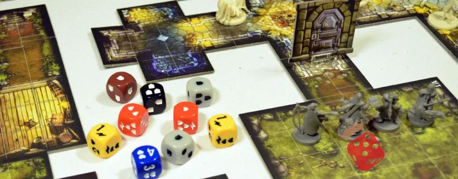
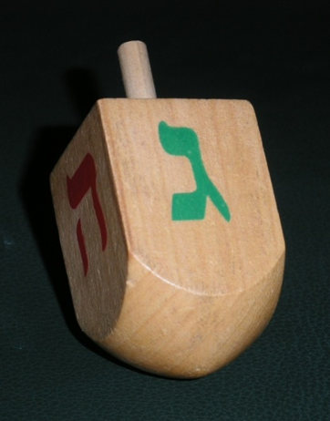

# Challenges for Game Designers: Глава 5. Элемент случайности

Перевод пятой главы сборника задач по гейм-дизайну [Challenges for Game Designers](http://wordpress.redirectingat.com/?id=725X1342&site=wordpress.com&xs=1&isjs=1&url=http%3A%2F%2Fwww.amazon.com%2Fgp%2Fproduct%2F158450580X%3Fie%3DUTF8%26tag%3Dgamedesiconc-20%26linkCode%3Das2%26camp%3D1789%26creative%3D9325%26creativeASIN%3D158450580X&xguid=623808d699e50273b1b5fc459196091f&xcreo=0&xed=0&sref=http%3A%2F%2Fgamedesignconcepts.wordpress.com%2F2009%2F04%2F&pref=http%3A%2F%2Fgamedesignconcepts.wordpress.com%2F2009%2F03%2F&xtz=-240) за авторство [Яна Шрайбера](http://www.gamasutra.com/view/authors/916452/Ian_Schreiber.php).

Такие игры, как _шахматы_ или _го_ – чисто стратегические. Вся информация доступна обоим игрокам, и одни и те же действия всегда имеют одни и те же последствия. Однако в большей части других игр дела обстоят иначе. В большинстве игр присутствует, по крайней мере, один случайный фактор или действие, которое невозможно повторить в другой партии. Например, многие карточные игры подразумевают случайный порядок карт в результате тасования. Бои в ролевых играх включают переменное значение наносимого урона. Игра _Камень-Ножницы-Бумага_ имеет совершенно случайную динамику без какой-либо вариативности механики. В этой главе мы рассмотрим элемент случайности в играх и то, как его можно использовать в дизайне.

**Неслучайная роль случайности в играх**

Почему так много игр включают в себя элемент случайности? Например, при создании игры для всей семьи, вам вряд ли подойдёт сложная классическая стратегия. К тому же, в играх, где есть элемент везения, большее количество игроков сможет принимать участие и выигрывать. В конце концов, причин множество, но каждая должна быть осознанным решением дизайнера для создания желаемой динамики.

**Отсрочить или предотвратить объяснимость**

Игра «объяснима» если всё поле вероятностей известно заранее и может быть использовано таким образом, что отдельно взятый игрок, правильно поступая, всегда может победить (или свести игру к ничьей). Отчасти именно поэтому _Крестики-нолики_ перестают быть интересными через некоторое время – они очень быстро объясняются. Как только игрок объясняет игру, она теряет часть того, что делает игру игрой: непредсказуемый результат, борьба за достижение цели.

Это не значит, что объяснимые игры по определению плохи. _Шахматы_ объяснимы, но поле вероятностей настолько обширно, что игра продолжает интриговать. Однако для игр, с достаточно небольшим полем вероятностей, которые может просчитать компьютер (а особенно человек) для поддержания интереса необходимо что-нибудь предпринять. Один их способов это сделать – добавить элемент случайности. Он не даёт нам изучить игру, потому что, принимая одни и те же решения, мы можем прийти к самым разным результатам.

**Сделать так, чтобы у всех игроков была возможность преуспеть**

В чисто стратегических играх, таких как _Шахматы,_ достаточно сильный игрок всегда одержит победу над более слабым игроком. Некоторые игроки достаточно амбициозны, чтобы им нравилось играть на таких условиях – ведь если они победят, тогда они целиком и полностью _заслужили_ эту победу. Точно так же, если они проиграют – они знают, что это от недостатка умения, или из-за мастерства оппонента, а не по вине случайно выпавших чисел или жребия.

Но хотя это вполне подходит одним игрокам, и для них игровой процесс будет увлекательным, не всегда можно рассчитывать, что два игрока с похожим уровнем мастерства окажутся в одном месте в одно и то же время, и будут открыты для игры. Если бы все игры были основаны на мастерстве игроков, то все партии родителей с детьми заканчивались бы со слезами, поражение за поражением, приводя, в конечном счёте, к скуке и досаде. Слабый игрок в таком случае просто встаёт и уходит, утвердившись в намерении никогда больше не играть в эту игру (по крайней мере, с этим противником).

Элемент случайности, периодически позволяющий менее опытному игроку выигрывать (или хотя бы получать преимущество) делает игру интересной на более длительное время сразу двумя способами. Во-первых, всегда есть шанс на победу. Во-вторых, поражение не так обидно, ведь игрок может всё свалить на своё невезение.

**Увеличить разнообразие**

Игры, в которых отсутствует элемент случайности, всегда начинаются одинаково, поэтому часто появляются определённые шаблоны (как традиционные дебюты в _Шахматах_). В результате, игроки будут получать очень похожие впечатления от игры к игре, и скоро окажется, что они всё время принимают одни и те же стратегические решения.

Когда появляется элемент случайности, игрокам приходится иметь дело с более широким полем вероятностей. Произвольное начало в _Settlers_ _of_ _Catan_ делает каждую игру непохожей на другую. Игры с плитками позволяют игрокам выкладывать поле десятками разных способов. Произвольные битвы в  играх _Risk_ или _Axis & Allies_ вынуждают игроков менять стратегию и зачастую играть нетрадиционно и искать новых путей, когда кость упала не той гранью, на которую они рассчитывали. Правильно распорядившись элементом случайности можно разнообразить игровой опыт, увеличив, таким образом, потенциал игры.

**Создать напряжение**

Когда игрок старательно разрабатывает стратегию, а потом вынужден отдаваться на волю случая, когда успех его плана зависит от того, как упадёт кость (или что там у вас) – такой момент истины может приятно пощекотать нервы. Ролевые игры, стратегии в реальном времени и целое множество настольных игр полагаются на подобную интригу. Успеет ли ваше заклинание исцелить вашего раненого товарища до того, как монстр нанесёт удар? Назначит вам компьютер одного или двух монстров для боя? Станет ли фишка соперника на клетку с только что построенным вами отелем или пройдёт мимо? Даже не имея никакой стратегии, просто наблюдать за случайными результатами игры может быть завораживающе интересно: посмотрите, например, какие страсти кипят за рулеткой или столом, где бросают кости. Уровень волнения и напряжения созданный неопределённостью возрастает прямо пропорционально тому, насколько вы зависите от результата.

**Повысить ценность принятия решений**

Суть многих игр заключается в решениях, которые принимаются игроками. В чистой стратегии у игроков есть вся информация, и они точно знают результат каждого хода, который делают. Когда все переменные известны, некоторые решения не особо интересно принимать; если у вас есть возможность просто так, без потерь, захватить ферзя вашего противника в _шахматах,_ это не очень занимательное решение, ведь вы точно знаете, что это «правильный» ответ.

Когда в игру входит элемент случайности, это уже не стратегия, где _всегда_ есть правильный ответ. Появляются ходы, на которых высок риск неудачи, но в тоже время, возрастает и возможная выгода, что делает ход рискованным; другие ходы безопасны, но и выигрыш невелик. Таким образом, игрок анализирует различные ходы, связанные с ними возможные риски и выгоды, взвешивает их, беря во внимание своё положение в игре. Раз есть неизвестные, решение становится более сложным, а значит – более увлекательным.

­**Механика удачи**

Возможность добавить случайность в игру есть всегда. Здесь я привожу несколько самых распространённых способов.

**Кость**

Игральная кость может быть всех форм и размеров. У стандартной шесть граней, но есть кости четырёх-, восьми-, десяти-, двенадцати-, двадцати-, тридцати- и даже стогранные. Бросок всего одной кости даёт случайный номер от одного до числа граней на кости, у всех чисел есть равная вероятность выпадения. При броске 1к10 (одной десятигранной кости) у вас есть равный шанс получить число от 1 до 10. Бросание одной кости даёт почти самый случайный результат из возможных.

Если вы бросаете несколько костей и складываете результат, он уже не будет таким случайным. «Средние» значения будут выпадать чаще, в то время как крайние – самые малые и самые большие – будут выпадать реже. Результаты бросков начинают напоминать гауссову кривую. Например, если вы бросаете 2к6 (две шестигранные кости), самое часто выпадающее значение будет равно 7, тогда как самыми редкими будут 2 и 12. Чем больше костей, тем больше результат стремится к середине (то есть, случайность уменьшается). Чем больше граней на каждой кости, тем больше интервал (случайность возрастает).

Кости – один из немногих генераторов случайных значений, где предыдущий результат не влияет на последующие. Независимо от того, сколько раз бросать 1к8, при следующем броске вероятный результат равно распределён между 1 и 8. Даже если 10 бросков подряд выпадало 5, вероятность того, что следующий тоже даст 5 – ровно 1 из 8, не больше и не меньше. Азартные игроки часто игнорируют этот факт, считая кость «горячей» или «холодной» — но гейм дизайнеры не могут позволить себе такого заблуждения. И хоть это может противоречить гауссовой кривой из предыдущего абзаца, не забывайте, что каждый бросок даёт определённый номер всего лишь _с вероятностью_ выпадения, а не наверняка. Предыдущие броски никак не влияют на предстоящие.

**Карты**

Карты – удивительно гибкий компонент игры. Их можно тасовать, делая их порядок ещё более случайным. Их можно разыгрывать вверх рубашкой, скрывая информацию от игроков. Их можно сдавать игрокам с тем, чтобы они видели только свои карты, и ничьи больше, делая каждого привилегированным обладателем какой-то части информации.

Карты могут быть ресурсом, который игроки держат в руке, в стопке или выкладывают на поле перед собой. Их можно использовать просто для отслеживания информации в игре, без добавления случайности. Бывало, их даже метали на стол, чтобы определить, с какой локации начнётся игра.

Так как в каждой игре есть ограниченный набор карт, открытие каждой из них влияет на вероятность выпадения следующих. Например, в азартной игре _Блэкджек_, чем больше фигурных карт лежит на столе, тем выгоднее игрокам, чем меньше фигурных карт, тем выгоднее дилеру. Соотношение фигурных карт к остальным картам меняется по мере сдачи карт из колоды. Если игрок получает 10 фигурных карт подряд, то вероятность получения ещё одной становится всё меньше (в отличие от игральной кости). Вероятности сбрасываются на исходные значения, когда карты собираются и перетасовываются заново. Некоторые карточные игры даже предписывают тут же после каждой открытой карты перетасовывать колоду – изменяя и без того случайный порядок карт! Обратите внимание: если вы тасуете колоду каждый раз, после открытия карты, то вытягивание карты из колоды в n карт равнозначно бросанию n-сторонней игральной кости.

**Генератор псевдослучайных чисел**

Для всех своих процессов компьютеры до сих пор используют неслучайные инструкции; компьютер просто неспособен сгенерировать действительно случайное число. Тем не менее, широко используется множество алгоритмов, позволяющих компьютерам выдавать то, что мудрёно названо «псевдослучайным числом» — число, которое технически не случайное, но достаточно близко к случайному для использования в большинстве игр.

Компьютеры могут генерировать любой тип случайного числа, какой только можно вообразить, что делает их применение в играх чрезвычайно гибким, особенно если дизайнер хочет задать определённое количество «случайного» в игре. Например, если вы хотите получить псевдослучайное число в _Microsoft_ _Exсel,_ вы вводите в ячейку =RAND()\*5+1 и форматируете её, чтобы она не показывала знаки после запятой. Результат будет симулировать бросок шестигранной кости. При этом надо позаботиться о том, чтобы выдаваемые числа действительно _были случайными_ в достаточной мере. Один из авторов этой книги работал как-то с карточной игрой онлайн и обнаружил, что при использованном в игре методе перетасовки карт, одни и те же карты оказывались на верху колоды чаще, чем другие.

**Скрытая информация**

Когда информация, не являющаяся случайной, скрыта от игроков, она всё равно случайна с их точки зрения. Например, в детской карточной игре _«Гуляй»,_ игрок пытается угадать, есть ли у другого на руках карты определённого типа. Не обладая какой-либо информацией, игрок делает случайное предположение, хотя карты на руках у противника не случайны с точки зрения самого противника – он-то точно знает, какие у него есть карты. Стратегии реального времени часто применяют «туман войны», который скрывает информацию о том, что в данный момент строит ваш соперник. Даже без какой-либо случайности, если вы не знаете, как отвечать на ещё не известную вам угрозу, это создаёт динамику случайности. Похожая динамика наблюдается в игре _Камень-Ножницы-Бумага,_ особенно, если вместо человека вашим соперником выступает генератор псевдослучайных чисел.

Когда скрытая информация ещё и случайна (например, оружие, которое наносит совершенно неизвестное количество произвольных повреждений), есть вероятность, что игрок будет сбит с толку и раздосадован. Игроки должны понимать последствия своих действий и иметь возможность разработать хоть какую-то стратегию, учитывающую элемент случайности в игре. Если от них скрыты все системы, то задача по пониманию игры сильно усложняется. При создании игры, особенно видеоигры, дизайнеры с большой осторожностью включают элемент случайности в механику, скрытую от игрока.

**И прочие игровые элементы**

Большинство других форм рандомизации являются видоизменениями описанных выше. Вертушки (которые часто можно найти в детских настольных играх), действуют точно так же, как кость. Орлянка, по сути – бросание двугранной кости. Дрейдл (рис. 5.1) даёт те же результаты, что четырёхгранная кость. Картонные плитки, которые вытягиваются из мешка (распространённые во многих европейских играх, таких как _Каркассон_ или _Тигр и Евфрат_) дают тот же случайный результат, что и колода карт.

Рис. 5.1

Дрейдл. Фото Рональда Шайхера.

Взято с Викисклада.

**Не все случайности созданы равными**

Подумайте над таким вопросом: _Покер –_ это игра, где всё зависит от удачи или от мастерства? Конечно, и то, и другое присутствует в игре, но что главное? Оказывается, всё зависит от количества сыгранных раздач.

Если сыграно небольшое количество игр, есть вероятность, что одному из игроков попадётся больше выигрышных комбинаций, чем другим, что даст ему преимущество, основанное на везении. Если игра продолжается и раздач всё больше, у каждого из игроков будет примерно одинаковое количество выигрышей, и тогда фокус игры переходит на то, кому удастся увеличить выигрыш, полученный в каждой раздаче. Игра всё та же, но главным становится мастерство.

Этот пример показывает разницу между игрой с чистой случайностью и тем, что мы называем «рассчитанной случайностью», когда природа случайных элементов известна и может быть спланирована игроками. Каждая отдельно взятая раздача (или бросок кости, или вращение колеса) может быть и случайно, но если их сделано достаточно большое количество, случайность уменьшается.

**Полностью случайные игры**

За небольшим исключением, большинство игр – даже тех, где победитель в первую очередь определяется везением – включают хотя бы небольшую долю мастерства. Как менять соотношение удачи и мастерства, рассказывается в главе 8 «Удача и мастерство: как их уравновесить». Но есть ли игры, которые совершенно произвольны и не включают вовсе никакого мастерства? Разумеется.

Есть две основные разновидности игр, основанных на чистой случайности: детские игры и азартные игры. Это не значит, что все до единой детские игры или все азартные игры не имеют никакого элемента мастерства – во многих из них присутствуют мастерство и навык. Но если вам встретится игра, основанная на чистой случайности, скорее всего, она будет относиться к одной из этих двух разновидностей.

**Детские игры**

Для детей младшего возраста, у которых когнитивный навык ещё не развит до такой степени, чтобы понимать сложный процесс принятия решений в стратегических играх, очень интересны игры, основанные на везении – они просто наблюдают, как сталкиваются случайные элементы. Самое смешное, что многие дети объясняют свой успех в таких играх своим «умением» правильно бросать кость или выбирать из колоды нужную карту. Примерами таких настольных игр могут послужить _Змеи и Лестницы_ и _Candy_ _Land_, карточных –  _Война (Пьяница)_ и _Ведьма,_ и игра в кости _Гроза_ (правила можно узнать в Главе 6 «Элементы стратегического мастерства», задание 1). В этих играх принятие решений весьма ограничено. Вы делаете то, что вам диктует игра, основываясь на случайных результатах.

Игры, основанные на удаче, нравятся детям потому, что создают напряженное ожидание, которое разрешается случайным результатом ожидаемого события, таким, как «бои» в _Войне,_ или более сложными бросками, когда костей становится меньше, в _Грозе._ В них также есть место для внезапного везения/невезения (особые ячейки в _Змеях и Лестницах,_ когда игрок может резко подняться вверх или сильно отстать, или когда игрок в вдруг достаёт опасную карту в _Ведьме_ и рискует остаться проигравшим). Наконец, эти игры дают возможность догнать соперников и всё же выиграть, поэтому результат никогда не бывает ясен заранее. Именно для этого и существует правило в _Змеях и Лестница,_ требующее от игроков встать именно на последнюю клетку; неважно насколько сильно игрок вырвался вперёд, всегда есть вероятность, что ему снова и снова будут выпадать слишком большое значение и остальные игроки успеют подтянуться и выиграть.

Сравните использование удачи в этих играх с использованием удачи в игре _Риск._ В _Риске_ три карты одного типа или три уникальные карты дают игроку возможность всё больше увеличивать количество своих войск. На первый взгляд, это кажется совершенно случайной механикой. Но хоть выпадение карты действительно случайно, использование этих карт игроком, или даже средства, которыми он старается их заполучить, сильно зависят от умений самого игрока.

**Азартные игры**

Определяющая механика для азартных игр состоит в том, что в ходе их приобретаются или теряются реальные деньги. Без денежной ставки игры, основанные на чистом везении, очень быстро теряют свою привлекательность. Азартными играми, в которых не требуется никакого навыка, являются _Рулетка, Кости_ и автоматы типа _«Однорукий бандит»._

Стоит отметить, что большинство азартных игр, даже тех, что основаны на чистой случайности, всё же предлагают сделать выбор. Игроки сами выбирают число, на которое поставят в _Рулетке,_ им предлагаются различные виды пари в игре в кости, а автоматы предлагают, на какое количество монет сыграть за раз (от одной до трёх или даже пяти). Игра может и совершенно случайна, но элементы выбора, предоставляемого игрокам, дают им _иллюзию_ контроля над ситуацией, ведь разный выбор приводит к разным последствиям.

А как же игры вроде _Покера_? Как уже отмечалось раньше, чем больше сыграно раздач, тем меньше случайности в игре. Мастерство в _Покере_ заключается не в том, какие игрок получает карты, а в том, что он с ними делает. Какие карты он придержит? Сколько на них поставит? Насколько хорошо умеет блефовать? Каждое их этих решений вкупе с решениями других игроков создают поле боя мастерства, которое накладывается на сферу везения.

**Задания**

Задания из этой главы позволят вам поработать над различными элементами случайности в играх. На этих заданиях испытайте свой навык в формировании случайности.

**Задание 1 – Крестик или нолик?**

Давайте начнём с простой игры, _Крестики-нолики._ Изначальная её версия полностью основана на мастерстве – вам решать, когда поставить Х или О. Добавим немного везения.

Измените эту игру, добавив одну или несколько механик, основанных на случайности. Вы можете добавить ещё одну механику, основанную на мастерстве, при условии, что игра по сути своей всё же будет напоминать _Крестики-нолики._ В то же время, вы должны сделать эту игру интересной для взрослой игровой аудитории – задача непростая, особенно если учесть, что взрослым эта игра, как правило, сильно приелась. Когда вы в последний раз слышали от кого-нибудь старше восьми лет: «А давай-ка в _Крестики-нолики_ сыграем!»?

Помните, что бросание десятигранной кости, чтобы решить, куда вы поставите Х или О, вряд ли поможет создать связный игровой процесс. Тем не менее, где-то там существует правильная комбинация механик, которая может снова сделать захватывающей старую игру.

**Необходимые компоненты**

*   Никаких

**Отчётность**

*   Новая игра
*   Записанные правила со всеми внесёнными изменениями
*   Анализ того, насколько ваши изменения улучшили или ухудшили исходную игру, и почему (необязательно).

**Предлагаемый ход действий**

1.  Мозговой штурм и тестирование.

Существует много способов добавить в эту игру элемент случайности. Бросок игральной кости. Выбор карты. Жребий. Выберите один и попробуйте сами. Обратите внимание, как привнесённая случайность влияет на игру. Также отметьте, какая разница получается между играми, в которых вы используете разные виды случайности.

2.  Создайте отчёт.

**Задание 2 – Коллекционные визитки**

На любой выставке, посвящённой игровой индустрии, особенно на конференции разработчиков, существует традиция обмена визитками. Совершенно незнакомый вам человек подходит к вам и даёт свою карточку, а вы даёте ему свою, и всё это совершенно нормально на конференции, но было бы очень странно и неловко, если бы кто-то сделал то же самое, просто подойдя к вам на улице вашего города.

Как бы то ни было, каждый увозит с собой целую стопку визиток, которые ему надавали. Большинство визиток стандартного размера (5х9 см, если вам это интересно), так что они прекрасно укладываются в колоду и тасуются. Самое время, чтобы кто-то придумал для всего этого игру. Этим кем-то можете быть вы.

В этом задании вам нужно придумать правила коллекционной карточной игры вроде _Magic: The Gathering._ Ваша игра должна соответствовать следующим требованиям:

*   Только два игрока.
*   Ваша игра должна поддерживать возможность «подобранной колоды». То есть, каждый игрок приносит свою собственную колоду визиток и ею играет.
*   В вашей игре может принять участие любая карточка стандартного размера. Таким образом, вы должны использовать информацию, которую обычно размещают на визитках (имена, телефоны, должности и т.п.). Например, вы не можете рассчитывать на то, что люди будут размещать на своих визитках особые символы и изображения только для того, чтобы уложиться в придуманные вами правила.
*   Раз это _коллекционная_ игра, карты должны отличаться одна от другой. То есть, должна быть причина, по которой вы предпочитаете включить в колоду именно эту карту, а не какую-то другую. То есть, должен быть принцип, по которому одни карты предпочитаются другим при составлении любой колоды. Формирование колоды должно быть стратегическим, а не случайным. Подумайте, как мы можете заставить кого-то в реальной ситуации сказать новому знакомому: «Ух-ты, классная карточка… а можно ещё одну для моей колоды?»

За исключением этих ограничений – можно всё.

**Необходимые компоненты**

Стопка разнообразных визиток для игрового тестирования (необязательно).

**Отчётность**

Полные правила в записанном виде.

**Предлагаемый ход работы**

1.  Найдите, с чего начать.

Для задачи с неопределённым конечным результатом может быть трудно решить, с чего начать. Отчасти это оттого, что начать можно сразу со многого. Выберите что-нибудь:

*   Подумайте, какую информацию обычно содержат визитки? Какими свойствами вы могли бы наделить каждую карточку?
*   Какова тема вашей игры? Что представляет собой каждая из карточек в игре?
*   Какова цель вашей игры? Что нужно для победы?
*   Как происходит подготовка к игре? Делают ли игроки что-нибудь особое перед началом игры (тасуют карточки, тянут их из колоды), что не повторяется потом?
*   Каков ход игры? Каков порядок событий в игре и чем всё разрешается?

Если вы до этого никогда не играли в коллекционные карточные игры, возможно, вам стоит узнать больше об этом жанре. Поиграйте в одну из таких игр, поищите информацию в интернете или расспросите друзей и знакомых, которые в них играли.

2.  Работайте над деталями.

На все вопросы, приведённые в предыдущем пункте, должны быть даны ответы. Когда вы начнёте с одного, двигайтесь дальше, пока не проработаете все.

3.  Проведите тестирование и прогон.

Попробуйте поиграть в свою игру с другом или сами с собой. Продолжайте подстраивать игру, пока у вас не получится нечто интересное.

4.  Создайте отчётный образец.

**Вариант**

Чтобы повысить сложность, создайте игру, которая подходит ещё и под эти рамки, в дополнение к перечисленным выше:

*   Раз игра должна играться во время (или непосредственно после) большой конференции, правила должны быть достаточно просты для того, чтобы вы могли за короткое время научить им другого гейм-дизайнера. Записанные правила должны занимать не больше страницы, а сами вы должны уметь объяснить эти правила устно, уложившись в две минуты. Правила вашей игры не должны повторять правила игры конференции разработчиков игр GameLab 2008 года, которая вышла тогда же, когда была начата работа над этой книгой.

Для максимальной сложности добавьте ещё и это ограничение:

*   Записанные правила должны быть настолько краткими, чтобы поместиться на обороте вашей собственной визитки (шрифтом, который можно прочесть – использовать 4 кегль, чтобы поместить туда целую страницу – нечестно).

**Задание 3 – Четвёртое колесо**

Когда на коробке с настольной игрой написано, что она «рассчитана на 2 – 4 человек», в большинстве случаев имеется в виду, что она предназначена для двух _или_ для четырёх человек. Игру на троих очень сложно создать из-за её динамики. Если игроки должны много взаимодействовать, и могут атаковать или помогать друг другу, то зачастую двое с лёгкостью объединяются против третьего. Если взаимодействия в игре мало, обычно один из игроков вырывается далеко вперёд и догнать его уже нет никакой возможности.

Видеоигры легко решают эту проблему: добавляется четвёртый персонаж, управляемый компьютером (тень). Создать правдоподобную тень вместо настоящего игрока для настольной игры уже не так просто. Давайте пойдём другим путём: добавим совершенно неправдоподобную, бессистемную тень.

Для этого задания возьмите нецифровую игру, которая рассчитана, самое меньшее, на двух, трёх, четырёх или более игроков. Примерами могут служить _Риск, Монополия и Блокус._ Создайте новые правила для игры на троих, в которой участвует четвёртый, случайным образом поступающий теневой игрок. Действия этого фальшивого игрока должны контролироваться набором случайно перетасованных карт, на него не должны влиять живые игроки. Так этот четвёртый игрок будет привносить элемент случайности в игру.

**Необходимые компоненты**

*   Экземпляр игры.
*   Карточки для записей, контролирующие действия четвёртого игрока.

**Отчётность**

*   Набор карточек «четвёртого игрока».
*   Записанные правила вашей видоизменённой игры на троих с использованием разработанных вами карточек.

**Предлагаемый ход действий**

1.  Выберите игру.

В соответствии с духом этой главы, выберите игру случайно. Поиграйте в неё или, хотя бы, прочтите правила, чтобы составить представление о механике и динамике (особенно о том, как выглядит игра с тремя игроками).

2.  Создайте карточки.

Что будет на этих карточках? Простые указания, на какого игрока нападать? Особые способности, дающие право нарушать правила в пользу четвёртого игрока? Случайные события, которые меняют правила _для всех_ игроков? Помните, что все решения, которые принимает четвёртый игрок, должны быть записаны на карточках, которые не выбираются живыми игроками.

3.  Создайте правила.

Как именно разыгрываются карты? Четвёртый игрок просто вытягивает карту из колоды и следует инструкциям на своём ходу? Колода одна или поделена на несколько стопок? При каких условиях колоды перетасовываются?

4.  Создайте отчётный образец.

**Задание 4 – Пришелец в пустыне**

Очень многие игры, основанные на случайности, ограничиваются использованием костей или карт (или вертушек и волчков, что с точки зрения механики – те же кости). Туман войны – явно недооценённая в нецифровых играх механика, хотя она часто бывает основной во множестве компьютерных игр. Если ваш персонаж не может чего-то видеть, не можете и вы. Именно этот принцип вы и внедрите в новую игру с выкладыванием плиток _Пришелец в пустыне._ Ваша игра должна использовать или позволять следующее:

*   Плитки вроде тех, что используются в _Каркассоне_ или _Settlers of Catan._
*   Название должно быть _Пришелец в пустыне._ Интерпретировать можете как угодно.
*   Туман войны.
*   Чтобы достичь необходимого эффекта и создать готовый к игре прототип, вы можете использовать любую механику и любые компоненты.

**Необходимые компоненты**

*   Плитки из бумаги или дерева.

**Отчётность**

*   Готовый к игре прототип.
*   Записанные правила.

**Предлагаемый ход работы**

1.  Мозговой штурм.

Вам предстоит ответить на множество вопросов. Что для вас значит название? Как вы воплотите механику тумана войны для нецифровой настольной игры? Как можно использовать плитки? Ну и потом, на всё те же стандартные вопросы, что и для любой другой нецифровой игры. Какова цель? Сколько игроков? Какие нужны компоненты? Какова основная механика?

2.  Тестирование и прогон.

Слепите что-нибудь и начинайте играть. Найдите, что не работает, и исправьте. Сделайте что-то рабочее, жизнеспособное, интересное. Как и с любой другой игрой, может случиться так, что вы несколько раз всё переделаете и начнёте с нуля, если вам покажется, что вы двигались не в том направлении.

3.  Создайте отчётный образец.

**Задание Железного  дизайнера 5 – Случайность с открытым финалом**

Разбейтесь на группы количеством от двух до четырёх человек. Каждой группе даются 100 пустых карточек для записей и ручка. Создайте игру, используя только эти компоненты, и сделайте её лучше, чем игра, которую создают в других группах. Игра должна включать элемент случайности, будь то случайный выбор карты, подбрасывание, тасование и тому подобное. При этом игра не должна содержать костей или чего бы то ни было помимо 100 карточек. Игрок может изменять карточки, как ему заблагорассудится.

**Необходимые компоненты**

*   Карточки для записей 8х13 см
*   Ручки

**Отчётность**

*   Демонстрация готовой игры

**Предлагаемый ход действий**

1.  Мозговой штурм.

Назад к основам. Тема. Цель игры. Подготовка. Ход игры. Решите, с чего вы начнёте, и оттуда двигайтесь дальше.

2.  Создайте отчётный образец.

Отсюда порядок действий как в задании 1.

**Вариант**

Вместо карточек используйте в качестве компонентов большой мешок игральных костей (с разным количеством граней).

**Быстрые нецифровые задания**

Ниже приведён список идей для настольных игры, карточных и других, поощряющих творческий процесс.

1.  Выберите классическую карточную игру, в которой акцент делается на мастерство (например, _Юкер_), и переделайте её так, чтобы она полностью зависела от случая.
2.  Переделайте классическую карточную игру _Война (Пьяница)_ так, чтобы в ней было ещё, по крайней мере, три разновидности случайностей, помимо тасования колоды.
3.  В игре _Риск,_ случайность используется для того, чтобы создать напряжённые моменты во время битв, для этого на поле бросаются кости. Переделайте эту игру так, чтобы напряжённые моменты появлялись на других стадиях игры, например, подкрепление или фортификация.
4.  Найдите что-либо, что происходит случайным образом (или очень сильно зависит от удачи) в реальной жизни. Подумайте о случайных встречах или о временах, когда люди говорят «Вот уж никак не ожидал(а)!» Создайте игру, чтобы воссоздать такие случаи.
5.  Создайте настольную ролевую игру, которая использует для случайности орлянку.
6.  Родители всего мира умоляют вас создать игру, которая бы включала как умение, так и везение. Умение – для них, везение – для их детей. Переделайте существующие детские игры или создайте свои собственные, чтобы они отвечали этим требованиям.
7.  Выберите игру, которую вы создали для задания (полного или быстрого нецифрового) к другой главе этой книги. Переделайте её так, чтобы она была либо полностью основана на случайности, либо абсолютно лишена случайного элемента.
8.  Создайте игру, основанную на случайности и использующую исключительно по одной кости каждого вида из перечисленных: шестигранная, восьмигранная, десятигранная, двенадцатигранная, двадцатигранная.
9.  Создайте игру, которая использует по одному из следующих механизмов случайности: перетасованная колода карт, плитки, которые раздают и подбрасывают, плитки, которые вслепую тянут из мешка.
10.  Используйте элементы известной детской игры (такой, как _Candy_ _Land_) чтобы создать азартную игру.