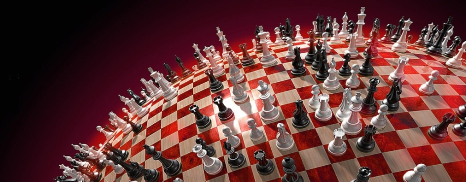

# Challenges for Game Designers: Глава 6. Элементы «стратегического» навыка

Перевод шестой главы сборника задач по гейм-дизайну [Challenges for Game Designers](http://wordpress.redirectingat.com/?id=725X1342&site=wordpress.com&xs=1&isjs=1&url=http%3A%2F%2Fwww.amazon.com%2Fgp%2Fproduct%2F158450580X%3Fie%3DUTF8%26tag%3Dgamedesiconc-20%26linkCode%3Das2%26camp%3D1789%26creative%3D9325%26creativeASIN%3D158450580X&xguid=623808d699e50273b1b5fc459196091f&xcreo=0&xed=0&sref=http%3A%2F%2Fgamedesignconcepts.wordpress.com%2F2009%2F04%2F&pref=http%3A%2F%2Fgamedesignconcepts.wordpress.com%2F2009%2F03%2F&xtz=-240) за авторство [Яна Шрайбера](http://www.gamasutra.com/view/authors/916452/Ian_Schreiber.php).

Стратегия очень притягательна для игроков. На самом деле, именно она и заставляет их снова и снова возвращаться к одним и тем же играм. Как отмечает Ральф Костер в своей замечательной книге A _Theory of Fun for Game Design,_ мы играем в игры и наслаждаемся процессом потому, что мы стремимся овладеть техникой игры. Пока мы овладеваем техникой, нам интересно. Мы также разрабатываем стратегию, основываясь на собственном понимании динамики игры. Эта техника, эта разработка стратегии – неслучайны. Всего этого добился (по крайней мере, добивался) дизайнер, создавая механику, которая в свою очередь сформировала стратегию и тактику.

Как отмечалось в предыдущей главе, в большинстве игр есть хотя бы небольшой элемент мастерства. Даже у игр, которые, казалось бы, полностью зависят от случайности (как _Камень-Ножницы-Бумага_) есть веб-сайты, посвящённые различным стратегиям.

Как же мы используем умение в играх?

**Роль навыка в играх**

В основе своей, хорошая игра – это цепь занимательных решений: направо или налево, создать оборонительный или атакующий юнит, выяснить, что он должен делать дальше. Насколько удачно решение – умственное ли, физическая ли реакция – определяет, насколько искусен игрок.

Хорошие игры заставляют игроков оттачивать свои навыки снова и снова, и вознаграждают их за успехи немедленно и очевидным образом. Играя, мы задаёмся вопросом, что делать дальше, после этого, и после этого, и после. И скоро попадаем в так называемый «волшебный круг» — когда проваливаемся через телемонитор в другой, игровой мир. Эффект примерно тот же, что и при просмотре кино или чтении особенной хорошей книги, но хорошие игры действуют гораздо сильней, потому что вовлекают в процесс игрока и решения, которые он принимает.

Когда игрок постоянно принимает решение за решением, он входит в состояние, которое психолог и известный исследователь Михай Чиксентмихайи назвал «потоком». Это состояние оптимально для игры, и дизайнеры усиленно работают над тем, чтобы вызвать его. Чиксентмихайи целую книгу посвятил этой теме – _«Поток: Психология оптимального опыта»._ Книга не ограничивается играми, и рассматривает это состояние со всех точек зрения.

**Типы решений**

Как сильно мастерство игрока влияет на исход игры? Всё зависит от решений, которые игра разрешает игрокам принимать, а также значимость этих решений. Степень, в которой действия игрока способны влиять на результат игры, названа «мастерством» в широком смысле слова (в противоположность факторам, находящимся вне досягаемости игрока, названным «случаем» или «удачей»). Игровой опыт во многом состоит из принятия решений, которые влияют на состояние игры. А, следовательно, гейм-дизайнер, стремящийся к созданию качественного игрового опыта, должен тщательно продумывать, что это будут за решения и как сделать их интересными, занимательными, увлекательными. Если вы делаете выбор, но на игру он не оказывает никакого влияния, какой в нём смысл?

В играх встречаются разнообразные решения. Некоторые из них занимательнее других, следовательно, обеспечивают более увлекательную игру.

**Очевидные решения**

Вот глупейшая игра для двоих, называется _Игра в большие числа._ Первый игрок загадывает число. Любое. А потом, _после_ того, как первый игрок называет своё число, второй должен выбрать своё.  Чьё число больше – тот и выиграл.

Для второго игрока принимаемое решение вовсе не занимательно. Большее побеждает, меньшее проигрывает. Совершенно очевидно, что нужно назвать, чтобы выиграть. Такие решения не увлекательны потому, что нет никакой причины делать какой-то иной выбор вместо оптимального.

Думаете, в _настоящих_ играх такого не бывает? Рассмотрим настольную игру _Талисман,_ где основная механика – бросок кости, а затем движение по полю на столько клеток, сколько выпало на кости, по или против часовой стрелки. Конечно, выбор направления – это решение, но в большинстве случаев, одна из ячеек вредит игроку, другая – помогает, поэтому решение очевидно. Или вспомните «рельсовые» RPG и шутеры, где игроку всё время подсказывают, в каком направлении двигаться. Игрок может принимать множество других решений, но куда идти дальше – решили за него. Эти игры могут быть интересны по многим причинам, но явно не из-за этих очевидных решений. Брось кость, остановись на «отеле» и заплати другу кучу денег. Именно на этой стадии игры в _Монополию_ многие начинают с нетерпением ждать, когда же она закончится.

В большинстве случаев, когда правильное решение бросается в глаза, дизайнер может просто убрать его и сделать автоматическим. Например, современные ролевые игры редко требуют от игроков, чтобы они отдыхали и ели для восполнения сил, но многие RPG 80-х и 90-х это делали. Вместо этого игры автоматически восполняют запас сил игрока со временем, а потребность в еде вообще отбросили. Некоторые шутеры от первого лица автоматически перезаряжают оружие, когда снаряды израсходованы. Когда очевидные, текущие решения автоматизированы, больше внимания уделяется занимательным.

Другой выход – взять очевидное решение и дать ограниченное количество времени, превращая стратегическое решение в проверку ловкости. Больше информации о такого рода «быстрых решениях» вы найдёте в главе 7 «Скорость реакции».

**Бессмысленные решения**

Единственное, что может раздражать ещё больше, чем выбор с очевидным правильным ответом, это выбор, где правильного или неправильного ответа и вовсе нет. Хоть на первый взгляд, выбор и присутствует, на игру это никакого влияния не оказывает. Этим славятся ранние RPG. «Будет ли воля твоя узреть короля?» спрашивал слуга и игроку давался выбор – ответить «да» или «нет». Если игрок отвечал «да» он шёл на аудиенцию к королю. Если он отвечал «нет», слуга говорил: «Но таков твой долг!» и игроку всё равно приходилось отправляться к королю. С игроком поступали одинаково, неважно, отвечал он «да» или «нет», следовательно, сам по себе выбор был бессмыслен.

Если занимательные решения интересны потому, что влияют на исход игры, то бессмысленные решения не интересны именно потому, что они никакого воздействия на исход не имеют. И опять-таки, такого рода решения следует полностью исключить из игры.

Однако есть кое-что, оправдывающее такие решения, и это – их восприятие игроком. Многие современные игры предлагают игрокам выбор повествования, который на самом деле, никак не влияет на общий итог игры. Однако игроку кажется, что его выбор значим, из-за того, как игра на его выбор реагирует. Только позже, проходя игру повторно, игрок выясняет, что путь, который он избрал в первый раз, путь, который, казалось, был сформирован принятыми решениями, вовсе от его действий не зависел. Тем не менее, когда игрок проходит игру впервые, ему _кажется_, что все его решения значимы, следовательно, они действительно значимы – для игрока.

**Решения вслепую**

В _Рулетке_ игрок действительно принимает решение, на какое число ему поставить. Решение не очевидно, раз заранее неизвестно, что выпадет. Решение не бессмысленно, ведь оно влияет на исход игры. Но оно и не занимательно, ведь у игрока нет никакой информации, на которую можно опираться при выборе. Одно число ничем не хуже другого. Но игра всё равно увлекает, ведь она предлагает твёрдую наличность в качестве вознаграждения; уберите деньги – и решения, как минимум, перестанут вас занимать.

Игры, содержащие стратегию, также могут неявно включать такие решения. Если игрок встречает NPC и может выбрать, как ему представиться (тайное рукопожатие, обычное приветствие, показать значок и т. д.) без какой-либо дополнительной информации выбор делается вслепую. Решение становится не только занимательным, но и приносящим внутренне удовлетворение, если игрок, например, слышал об этом NPC какие-то слухи, или NPC здоровается первым.

В целом же, решения вслепую можно превратить в другие типы решений, дав игроку достаточно сведений. Между тем, это не значит, что надо раскрыть всю информацию. Если у игрока есть, хоть какое-то знание, на котором можно обосновать свой выбор, решение уже не делается вслепую. На самом деле, некоторые решения делаются только интереснее, если с течением времени постепенно добавляется информация.

**Обмены**

Обмены происходят тогда, когда у игрока не хватает ресурсов для того, чтобы достичь всех поставленных целей. Золота хватить только та то, чтобы купить улучшенное оружие _или_ улучшенный доспех, _или_ новое заклинание. Преследовать спасающегося бегством злого мага _или_ спасать принцессу от дракона. Нанять армию пехотинцев _или_ построить инкубатор для грифонов и добавить в армию воздушные силы? Взять с собой снайперскую винтовку _или_ АК-47? Использовать взрывной жезл против босса в этой битве _или_ поберечь пока, вдруг следующая будет сложнее? Ни один из этих выборов не является очевидно верным или неверным, у каждого есть свои недостатки и преимущества. Решения вдруг кажутся действительно важными, настоящими.

Эти решения легко могут сделаться очевидными, если один выбор выгоднее другого. Игру называют _сбалансированной,_ если выбор уравновешен и нет одного метода всегда поступать наилучшим образом. Когда игры предлагают несколько различных путей к победе, а игроки должны выбирать между ними, основываясь на своём собственном стиле или на ситуации, сложившейся в игре, решения могут стать весьма занимательными.

**Дилеммы**

Дилемма в чём-то похожа на обмен, но бывает так, что _любой_ выбор невыгоден для игрока. Например, в игре _The Legend of Zelda,_ игрокам может встретиться комната, где они должны либо заплатить определённую сумму, либо навсегда понизить максимальный уровень здоровья.

Особый случай – дилемма узника, известная проблема из теории игр. В дилемме узника, два игрока независимо друг от друга должны сделать выбор: попытаться объединить усилия со вторым игроком или устроить измену (т. е. выдать его). Если оба игрока выбирают сотрудничество, каждый несёт незначительное наказание. Если оба игрока выдают друг друга, то оба получают гораздо более строгое наказание. Если один из игроков выдаёт другого, а другой выбирает сотрудничество, то выбравший сотрудничество получает максимальное наказание, а предатель не получает никакого. Причина, по которой это является дилеммой в том, что какой бы выбор ни сделал оппонент, игрок может уменьшить своё личное наказание, предав его. Тем не менее, следуя этой «оптимальной» стратегии, игроки в итоге оказываются в не самой лучшей ситуации, когда всем досталось, и которая хуже, чем если бы оба игрока объединили усилия. Отдельные моменты «дилеммы узника» можно встретить во множестве игр, особенно в стратегиях с последовательным порядком ходов. Например, в настольной игре _Дипломатия_ на поле есть несколько зон, которые дают большое стратегическое преимущество игроку, который их контролирует. Но располагаются они как раз посередине между двумя противостоящими игроками. Если оба игрока станут сотрудничать, они могут просто оставить эту зону и не тратить ресурсы, оспаривая право на неё друг у друга, но страх того, что оппонент просто так, без боя придёт и займёт заветную зону, становится достаточным стимулом для того, чтобы оба игрока ввязались в бессмысленную борьбу на всю первую половину игры.

У дилеммы узника множество вариантов. Если игрок встречает целую цепь таких решений вместо одного, динамика серьёзно меняется. Если увеличить число игроков (так, что небольшое число «предателей» получает преимущество, но слишком большое их число вредить всем), это тоже изменит многое, особенно, если игрок склонен искать возмездия против тех, кто его предал. Если игрок _не знает,_ кто сотрудничал, а кто предал, это тоже может всё изменить, привнеся немного паранойи.

**Обмены «риск против награды»**

Одна из разновидностей обмена, риск против награды, имеет место, когда игрок сталкивается с ситуацией, у которой могут быть различные исходы, но и уровень риска у них разный. Это уже не вопрос вроде «Какая из этих полезных вещей нужна мне больше», а, скорее, вопрос «Готов ли я получить огромную выгоду, рискуя жизнью?»

Например, в серии игр _Цивилизация_ игроки принимают много занимательных решений, при этом совершают много обменов. Будете ли вы стремиться к военной победе или к экономической? В какой-то момент игрок может решить напасть на соседнюю цивилизацию. Принимая решение, нападать или нет, игрок взвешивает риск этой миссии и потенциальную выгоду. Если он нападёт на Америку, получит ли он вожделенную технологию или нет?

Такие решения распространены в настольных играх с костями, картами и другими механиками, создающими случайность. Часто у игрока есть выбор между безопасным ходом и маленьким вознаграждением или рискованным шагом с бо´льшим вознаграждением в случае успеха (или наказанием в случае провала). Например, в _Нардах_ у вас есть выбор, оставлять ли фишку «открытой». Если оппонент удачно бросит кости, он может занять соседние ячейки, окружив и отрезав вашу фишку от других, но если оппоненту не повезёт, то у вас останется удачная позиция для следующего хода. Другим примером служат _Пики,_ где игроки могут поставить на ноль (то есть, попытаться не взять ни одной взятки). Эта ставка стоит много очков, если она удаётся, и большого штрафа, если не оправдывает себя. Кроме того, такую ставку очень сложно выполнить, а значит, её делают либо те игроки, у которых необычные карты на руках, либо те, кто уже очень отстал по очкам и вынужден идти на отчаянные меры и большой риск. В таких играх, обычно, именно отстающие игроки чаще идут на риск, чтобы догнать лидеров, а лидирующий игрок предпочитает делать безопасные ходы, чтобы сохранить свои позиции. Похожее поведение демонстрируют игроки телевизионного шоу _Jeopardy._ Эта взаимозависимость риска и награды может привести к невероятно напряжённой динамике.

Игроки также часто могут встретить противопоставление риска и вознаграждения в ролевых играх и MMO. «Если я попробую одолеть эту зверюгу, есть вероятность, что она меня по земле размажет, но с другой стороны, из неё же потрясный лут можно выбить».

**Частота или ожидание решений**

Создавая решения в играх, дизайнеры порой забывают, что частота, с которой игроки их принимают, имеет первостепенную важность. Качество игры очень страдает, если игрок принимает решение всего лишь каждые 20 минут, а не каждые 20 секунд (даже если эти двадцатиминутные решения очень важны). На самом начальном уровне, задача дизайнера заключается в том, чтобы всё время занимать игрока, чтобы его мозг постоянно выбирал среди разнообразных возможностей. Такие игры как _The Sims_ или _Civilization_ как раз предоставляют игроку непрерывную цепочку положительных решений. Какое из этих полезных действий я выполню сейчас? Конечно, игрок может сознательно выбирать варианты, не приводящие к качественному игровому процессу, но перед ним всегда должно быть несколько интересных путей.

Естественно, есть случаи, когда решения принимаются нечасто, но ожидание грядущего решения поддерживает в игроке мысли о том, что он _может_ предпринять, когда час решения, наконец, пробьёт. Шутеры от первого лица с лифтами и подъёмниками служат отличным примером таких ситуаций. Хотя игрок не может принимать решения, находясь в лифте, нарастающее волнение в ожидании предстоящей серии быстрых решений достаточно для того, чтобы полностью захватить всё его внимание. Точно так же тоннели, которые приводят к битвам с боссами, служат для того, чтобы усилить беспокойство и создать напряжение в повествовании, таким образом, поддерживая потоковое состояние.

**Стратегия и тактика**

Геймеры и разработчики позаимствовали термины «стратегия» и «тактика» из военного жаргона, хотя часто их используют неправильно. Например, многие, так называемые «стратегии в реальном времени» на самом деле, фокусируются на тактике, а не на стратегии.

Технически же, «большая стратегия» это комплексные меры для достижения конечной цели, какой-то долгосрочной и всеобъемлющей (например, победа в игре). Большая стратегия состоит из нескольких дополнительных стратегий, промежуточных целей, которых необходимо достичь в рамках одной большой стратегии (например, в большой войне есть выбор, вступить ли в ту или иную битву – это стратегический выбор). «Тактика» же – это низший уровень микрорешений, которые принимаются, чтобы осуществлять выбранную стратегию: манёвры пехоты, нужен ли удар с воздуха, когда открыть огонь – это тактические решения, которые принимаются в ходе боя. Иногда гейм-дизайнеры называют стратегические и тактические решения макро- и микро- выборами.

В повседневной жизни мы говорим о стратегических решениях, когда игрок планирует что-то на долгий срок («долгий» в рамках игры), и о тактических решениях, когда речь идёт о достижении краткосрочных целей.

Обмены приводят к интересным стратегическим и тактическим решениям. Быстрые решения (механика, рассчитанная на скорость реакции), ограничиваются тактикой. Это значит, что игры, внимание в которых сосредоточено на стратегии – обычно это очерёдные игры, такие как _шахматы_ или _го_ – хорошо подходят для решений, включающих обмен. Игры, сосредоточенные на тактике могут применять либо обмены, либо быстрые решения (либо и то, и другое сразу), от чего игровой процесс заметно меняется.  Примером тактической игры, которая использует главным образом обмены, является тактическая RPG, вошедшая в моду с появлением _Final Fantasy Tactics._ Большинство шутеров от первого лица и других «боевиков» являются примерами тактических игр, которые сосредоточены, главным образом, на быстрых инстинктивных решениях.

**Игры, полностью зависящие от мастерства**

Игры, сконцентрированные на стратегии и обменах, как правило, требуют хоть какого-то элемента случайности. Когда эти игры основаны исключительно на навыке (как _Крестики-нолики_ или большинство приключенческих игр) их можно просчитать, и тогда решения, которые были занимательными, становятся очевидными, и в конце концов, остаётся один-единственный «правильный» ответ. Если вы разрабатываете такую игру, необходимо создать необходимое разнообразие различных вариантов, чтобы игру нельзя было легко просчитать обычным людям… а желательно и компьютерам.

Большинство игр, полностью основанных на умении – это «боевики» (игры в стиле «экшн»), использующие физический навык. Возможно это потому, что, несмотря на решения-обмены, они сосредоточены не на том, чтобы поступить правильно, а на том, чтобы сделать это _как можно быстрее._ Скорость человеческой реакции способна с течением времени расти неограниченно, особенно в играх, где противниками выступают такие же люди.

**Механика мастерства**

До сих пор эта статья была немного абстрактной. Можно, конечно, долго распространяться о том, что решения-обмены включают ограниченные ресурсы, но ведь ресурсов в играх бывает огромное множество: свойства различных фишек, количество ходов, положение на поле, буквальные ресурсы – те же золото и древесина. Далее приведены примеры механик, приводящих к занимательным решениям.

**Механика обмена**

Обмен ставит игрока в ситуацию, где ему нужно выбрать только один из нескольких вариантов. Например, чтобы сберечь нужную сумму, он не может позволить себе доспех, который ему приглянулся. Дизайнеры используют разнообразнейшие механики, чтобы поставить игрока в подобное положение.

**Аукционы**

На аукционах игроки ставят какие-то ресурсы (обычно, деньги), с целью получить какой-либо предмет. Победитель аукциона платит свою ставку и забирает предмет.

Существует множество разновидностей аукционов:

*   «Открытый аукцион» — игроки в любой момент могут назвать свою ставку, перебивая предложения соперников до тех пор, пока все остальные не остановятся. Это как раз та форма, с которой знакомо большинство людей, она завершается словами: «Некая сумма раз, некая сумма два, продано!».
*   «Последовательный аукцион» — игроки делают ставки каждый в свою очередь. Существует множество разновидностей таких аукционов: один круг, или до бесконечности, игроки могут или не могут пропускать ставки, пропуск ставки лишает (или не лишает) игрока права сделать ставку на следующем круге (если такой предусмотрен). Последовательные аукционы часто встречаются в карточных играх, где игроки делают ставки на количество взяток, которые они смогут выиграть. Тот, кто делает самую высокую ставку должен потом доказать своё мастерство.
*   «Тихий аукцион» или «закрытый аукцион» — игроки делают каждый свою ставку, одновременно и тайно, а позже все ставки открываются.
*   В «аукционе с назначенной ценой» лот предлагается по названной цене, и первый игрок, который выразит готовность её заплатить, покупает лот. На eBay например, можно увидеть такие аукционы с предложением «Купить сейчас!».
*   «Голландский аукцион» предлагает лот по изначально высокой цене, но затем цена постепенно снижается; первый, кто соглашается купить по текущей цене, выигрывает аукцион.
*   В «аукционе наоборот» лотом является какой-либо ущерб или неблагоприятное событие, а игроки делают ставки, чтобы откупиться от него.

Дизайнеры могут варьировать механики аукционов. Вместо одного предмета лот может включать сразу несколько. Несколько аукционов могут проводиться одновременно, а игроки должны распределять свои ресурсы между ними. Все игроки могут расставаться со своими ставками (а не только победивший покупатель). Или игрок, ставка которого вторая по величине, получает второстепенный лот (или штраф, что делает высокие ставки очень рискованными). Вместо того чтобы выводить ресурсы из игры, победитель может заплатить свою ставку кому-то или всем проигравшим игрокам.

Среди игр, использующих аукционы: _питч_, _бридж_, _«Современное искусство»_ и _Монополия_ (хотя мало кто использует механику аукциона, играя в последнюю).

**Покупки**

Вместо того чтобы соперничать на аукционе, все игроки имеют возможность покупать предметы, способности или действия по фиксированной цене. Выбор в данном случае заключается в том, какой из предметов купить, при условии, что у игроков есть ограниченное количество наличности, а также времени, на совершение покупок, особенно если ресурс ограничен и есть вероятность, что игроки уже не смогут приобрести его в ходе игры.

**Особые способности с ограниченным использованием**

Особые способности дают игрокам возможность нарушить стандартные правила игры каким-то особым способом. Эта механика была изначально введена в оборот в настольной игре _Cosmic Encounter._

Если игроки могут получать какое-либо преимущество, но лишь раз за игру (или два, или на ваше усмотрение), то выбор _когда_ использовать способность становится увлекательным решением. Игрок знает, какое преимущество он получит, использовав способность прямо сейчас, но неизвестно, вдруг позже представится _лучшая_ возможность.

**Динамические особые способности с ограниченным использованием**

Варьируя силу особых способностей в зависимости от пространства, времени, места или других факторов, можно расширить стратегический потенциал решений. Например, чем дольше вы держите предмет (или чем дольше вы держите кнопку нажатой), тем большей силой он обладает. В таком случае альтернатива: использовать сейчас или приберечь на будущее – представляется игроку весьма занимательным решением. В игре _Риск_ игроки сталкиваются с этим решением, когда решают, в какой момент игры им использовать карту. Использованная карта даёт немедленное преимущество, но преимущество будет даже большим, если все оппоненты последовательно используют свои карты. Соотношение между немедленной пользой и возможной будущей выгодой не всегда очевидно, поэтому неочевидно и решение.

**Буквальный выбор**

Иногда игры предоставляют участниками выбор, открыто заявляя о последствиях любого из вариантов. Например, игрок вытягивает карточку, на которой значится «Выбери что-то одно: получи 10 золотых или восстанови 5 очков здоровья». Игрок должен взвесить относительную ценность обоих вариантов.

**Ограничение действий**

В играх, в которых у игрока есть один аватар, все действия осуществляются через него. Там, где у игроков несколько аватаров, выбрать, который из них сейчас осуществит действие, может быть непростым решением (при условии, что игрок не может давать указания всем аватарам одновременно). Это более характерно для настольных игр (вспомните игры, в которых участники имеют на поле много фишек и могут выбирать, какую из них двигать, например, _Нарды_), но и в видеоиграх может встречаться. В качестве примера можно привести _The Lost Vikings,_ где у игрока есть три персонажа, но контролировать одновременно можно только одного, в то время как другие два остаются уязвимыми).

**Обмен и торг**

Когда несколько игроков вместе работают над достижением общих целей, в игру вступает целая палитра социальных взаимодействий. Здесь сотрудничество смешивается с соперничеством. Создаются и распадаются союзы. Даются обещания и посулы всяких благ в будущем в обмен на сиюминутную помощь (в зависимости от игры, эти обещания необязательны либо обязательны для выполнения, вплоть до штрафов за невыполненные обещания). В социальных взаимодействиях следует учитывать также внеигровые факторы, то есть отношения между игроками за пределами игры; обычно с близкими друзьями люди играют в _Дипломатию_ иначе, чем с совершенно незнакомыми людьми.

**Стратегическая оценка**

Как гейм-дизайнеры оценивают успех стратегии и тактики, которые они надеялись создать? Можно собрать много полезной информации наблюдая за игрой или опрашивая игроков. Помните, что не каждому по душе _шахматы, го_ или _Риск._ Степень стратегической составляющей должна быть соизмерима с ожиданиями вашей целевой аудитории. Вот вопросы, которые вы можете задать.

**_Следит ли игрок  за действиями противников, когда наступает их черёд ходить?_**

Если у игры высокий уровень стратегического расчёта, игроки неохотно отвлекаются от поля, не говоря уже о том, чтобы покинуть комнату. Для примера, сами подумайте, насколько высока вероятность того, что вы оставите своих друзей одних, когда играете в _Монополию_ по сравнению с _Риском_?

Стратегическая игра требует от человека внимания к результатам ходов каждого из участников, ведь их действия влияют на его следующий ход. Состояние игры всё время переоценивается, после каждого действия, совершённого очередным игроком.

**_Строят ли игроки далеко идущие планы?_**

Стратегические игры побуждают игроков разрабатывать стратегии, которым они следовали бы на протяжении многих ходов. Если игроки очень ограничены правилами, или, наоборот, им позволено слишком многое, возможно, они не смогут последовательно проводить одну и ту же стратегию на протяжении множества ходов. Во время игры расспросите игроков, что они собираются делать дальше, как они собираются выиграть партию. Их ответы раскроют вам их стратегию, или отсутствие таковой.

**_Разные ли у них стратегии для разных игр?_**

В начале каждой игры, играющий должен иметь какое-то представление о том, как ему вести себя в игре. Чем больше стратегических возможностей, тем разнообразнее будут варианты. Например, в _Риске_ игрок может иметь буквально десятки различных стратегий для игры против разных игроков, или чтобы компенсировать невыгодные начальные состояния в разных партиях.

**Задания**

Задания из этой главы дадут вам возможность попрактиковаться в создании игр с элементами, требующими определённых навыков.

Попытайте счастья в создании мастерства…

**Задание 1 – Навык из ниоткуда**

Вот правила  традиционной немецкой игры для детей _Гроза_:

*   Выбирают, кто ходит первым, затем двигаются по часовой стрелке.
*   На первом ходу игрок бросает стандартные игральные кости (6 шестигранных).
*   Если на какой-то из костей выпала единица, такая кость откладывается, а оставшиеся кости передаются следующему игроку. Таким образом, следующие игроки бросают всё меньше костей.
*   Если игрок на своём ходу выбрасывает только единицы, все шесть костей переходят следующему игроку.
*   Если игроку не удаётся выбросить ни одной единицы, он штрафуется. Первые пять раз, когда ему этого не удаётся, линия за линией рисуется домик. На шестой раз в нарисованный домик «бьёт молния» (косая линия перечёркивает домик), и игрок выходит из игры.
*   Цель игры – продержаться до последнего и остаться единственным игроком. Когда из игры вышли все, кроме одного – он и является победителем.

В этой игре нет никаких решений – только удача. Этого достаточно для детской игры, но взрослым она быстро надоест.

Создайте вариант этой игры, в котором требовался бы какое-то умение. Ваша задача сделать эту игру более привлекательной для взрослых (например, для родителей тех детей, которым нравится изначальная простая версия), но в то же время, она должна остаться похожей на оригинальную игру, чтобы детям по-прежнему было интересно.

**Необходимые компоненты**

*   Шесть стандартных игральных костей, для тестирования.

**Отчётность**

*   Записанные правила изменённой новой игры
*   Готовая игра
*   Анализ того, стала ли игра благодаря вашим изменениям лучше или хуже (и почему – необязательно).

**Предлагаемый ход работы**

1.  Мозговой штурм и тестирование.

Подумайте, какими способами можно добавить в игру элементы навыка. Можно ли добавить аукцион? Возможность делать ставки на результат? Что ещё? Набросайте разных идей, неважно насколько странными они могут казаться на первый взгляд и испытайте на себе.  Обратите внимание, как введённый навык повлиял на игру. Также отметьте, как меняется игра в зависимости от того, какую из разных механик вы использовали.

2.  Создайте отчётные материалы.

**Вариант**

Создайте вариант другой основанной на случайности игры, например азартной игры _Крепс_ или детской настольной игры _Candy Land._

**Задание 2 – Игровая система**

«Игровая система» — это набор компонентов, которые можно использовать в разных играх, а не только в одной. Самая известная игровая система – стандартная колода игральных карт, которую можно использовать для сотен самых различных игр.

Сайт [www.piecepack.org](http://www.piecepack.org/) – открытый домен с игровой системой Piecepack, которую можно использовать для создания настольных игр. Piecepack содержит:

*   24 плитки: каждая обладает уникальным сочетанием цвета (из 4 возможных) и номера (от 0 до 5) с одной стороны, но у всех одинаковая чёрная рубашка с крестом (это значит, что плитки можно разрезать на четыре части).
*   24 маленькие круглые фишки: у каждой уникальное сочетание цвета и числа – с одной стороны число, с другой – рубашка определённого цвета. Фишки помещаются на одном из четырёх квадратов на обороте плиток, и на лицевой, и на оборотной стороне у них есть стрелочка, отмечающая направление/положение.
*   4 пешки: каждая имеет свой цвет, каждая может поместиться на одном из квадратиков на обороте плитки, на каждой есть стрелочка, обозначающая направление/положение.
*   4 шестигранные кости, с гранями, пронумерованными от 0 до 5, каждая кость соответствует определённому цвету.

Для этого задания создайте настольную игру немецкого стиля, которая использовала бы только детали из набора Piecepack. Подробнее об играх немецкого (или европейского) стиля вы можете прочесть в главе 11, «Определение рыночной ниши». Для этого задания вам необходимо знать об играх немецкого стиля следующее:

*   Игра длится приблизительно час-полтора.
*   Подготовка к игре быстрая.
*   Правила простые, игре можно сразу научиться.
*   Есть стратегические решения, а также заданная степень случайности (как описано в предыдущей главе).
*   Минимальное время бездействия каждого игрока.

Создавая эту игру, вы не обязаны использовать все детали, включённые в Piecepack, также нет необходимости использовать все возможности тех компонентов, которые вы взяли для игры, единственное ограничение – не использовать ничего _кроме_ деталей, содержащихся в Piecepack.

**Необходимые компоненты**

*   Распечатанный набор Piecepack.

**Отчётность**

*   Полные правила, в записанном виде.

**Предлагаемый ход действий**

1.  Подумайте, с чего начать.

Из перечисленных выше условий выберите то, что на ваш взгляд сильнее прочих связывает руки. С него и начните, набросайте идей для базовой механики, что-то, вокруг чего можно начать строить игру. Выберите механику, которая кажется вам удачной. Или зайдите с другой стороны: обдумайте сами детали из набора Piecepack, они ведь очень многофункциональны. Плитки можно выкладывать лицом вниз, чтобы сделать импровизированное поле, или их можно использовать как колоду карт. Фишки могут стать игровыми пешками на поле, или их можно выкладывать рубашкой вверх, скрывая номера (или наоборот), чтобы часть информации была тайной, их можно подбрасывать как монетки в орлянке. Кости можно использовать для отслеживания счёта или других переменных в игре, их можно использовать в качестве пешек или бросать их, чтобы получать случайные числа. Каждый из компонентов может служить одной или нескольким целям сразу.

2.  От этого двигайтесь дальше.

Разрабатывайте подробности. Создавайте правила, с которыми можно играть в эту игру.

3.  Тестируйте и прогоняйте игру.

Попробуйте сыграть в игру, сами с собой или с другом. Восполните пробелы в правилах, которые вы выявите в ходе игры. Продолжайте подстраивать игру, пока у вас не получится что-то интересное.

4.  Проверка на соответствие условиям.

Проверьте, отвечает ли игра всем перечисленным выше условиям. Если нет – подумайте, как вы можете изменить свою механику? Обратите внимание, вы должны сделать это только _после_ того, как игра вам понравится и будет интересной; гораздо проще добавить ограничение в интересную игру, чем ограниченную со всех сторон игру делать интересной.

5.  Создайте отчётный образец.

**Вариант**

Используйте другую игровую систему. Вот некоторые предложения:

*   Набор Icehouse (от Looney Labs, сайт: [looneylabs.com](http://www.looneylabs.com/)). Он состоит из пяти маленьких, пяти средних и пяти больших пирамид. Они полые внутри, что позволяет складывать их столбиком одна на другой, при этом меньшие полностью скрываются в бо´льших. Они могут стоять как на основании, так и на и одной из граней. Каждый комплект пирамид (маленькая, средняя, большая) имеет свой цвет, соответствующий игроку.
*   Набор Stonehenge (от Paizo Publishing, сайт: [paizo.com](http://www.paizo.com/)). Позиционируется как «антология настольных игр», игровая система на тему Стоунхенджа, состоящая из доски, колоды карт и огромного количества пластиковых деталей.
*   Любая видоизменённая колода карт. Отбросьте несколько карт каждой масти, или добавьте новые, сочетайте несколько колод, добавьте несколько особых карт, которые не входят ни в одну из мастей (кроме джокеров). Вы можете сами создать колоду, приобретя несколько колод с одной и той же рубашкой и видоизменяя карты необходимым образом, или же вы можете поискать изданные карточные игры с нестандартными колодами.

**Задание 3 – Стратегия на скорую руку**

Создайте игру, у которой, подобно игре немецкого стиля (описанной в предыдущем задании), небольшое время подготовки к игре, простые правила, минимальное время бездействия игроков, присутствует стратегия и занимательные решения. Вы можете использовать любой набор игровых деталей по своему усмотрению.

Время игры должно быть не больше 15 минут.

Так как игра короткая, от вас ожидается, что вы тщательно проработаете её и доведёте до очень высокого качества.

**Необходимые компоненты**

*   Набор игровых деталей

**Отчётность**

*   Прототип со всеми деталями игры.
*   Записанные правила.

**Предлагаемых ход действий**

1.  Поищите европейские игры, которые рассчитаны на короткие сессии.

О чем эти игры? _Dragon Parade,_ например, о том, где разместить своих лоточников с напитками, лакомствами и сувенирами по маршруту праздничного шествия. _Hey, That’s My Fish –_ о том, на какую плитку встать на следующем ходу. Небольшая экскурсия в местный магазин настольных игр поможет вам лучше разобраться в теме.

2.  Выберите решение.

Короткие игры обычно включают ограниченное число механик, снова и снова повторяемых игроками. В более продолжительной игре предпочтительнее разнообразить механики, чтобы игрокам они не надоели, но для короткой игры – чем проще, тем лучше. Простые правила также имеют преимущество – они сокращают время на обучение и подготовку к игре. Подумайте над различными решениями, которые могли бы приниматься в ходе игры – возьмите перечисленные в этой главе, или вспомните какие-то другие; выберите одно, которое вы положите в основу игры.

3.  Создайте механику.

Основываясь на решениях, которые будут принимать ваши игроки, создайте базовую механику, чтобы обеспечить их. Подумайте, что будет, если игроки станут принимать одно и то же решение несколько раз подряд. Опираясь на это, добавьте недостающие детали, которые требуются для полной игры: правила, подготовка к игре, ход игры, условия победы/завершения игры.

4.  Тестирование и прогон.

Такую короткую игру вы можете прогнать много раз за небольшое количество времени. Каждый раз старайтесь внести небольшое изменение и наблюдайте, как оно влияет на игровой процесс. Прогоните игру хотя бы двадцать раз (пять часов тестирования).

5.  Создайте отчётный образец.

**Вариант**

Чтобы не создавать игру с нуля, возьмите ту, что вы разработали для задания 2 и сократите время игры до 15 минут (или ещё короче). Внесите необходимые изменения в механику.

**Задание 4 – Целое новое измерение**

Вы уже совсем было приготовились сыграть в _шашки_, но вместо обычной доски у вас есть только доска 12х12 квадратов. Можно просто не брать в расчёт четыре лишних клетки с каждой стороны – но это скучно, согласитесь. Вместо этого разработайте вариант игры, которая использует большую доску. Вы можете вносить какие угодно изменения для того, чтобы большая доска вписалась в игру. Как это влияет на игровой процесс?

**Необходимые компоненты:**

*   Доска 12х12 и набор шашек или фишек. Видимо, придётся сделать всё своими руками, потому что такой вариант игры в _шашки_ едва ли найдётся в магазине.
*   Компьютер с выходом в Интернет, на случай, если вы забыли, как играть в _шашки_ (не удивляйтесь, не так уж редко такое бывает).

**Отчётный образец**

*   Записанные изменения в правилах, которые вы применили, и ваш анализ того, как они повлияли на игровой процесс.

**Предлагаемый ход действий**

1.  Придумайте игру.

Создайте её компоненты. Это может быть что-то совершенно простое, например монетки или детали, вырезанные из обычного листа бумаги.

2.  Сыграйте в игру.

Сами с собой или с другом, поиграйте в получившуюся игру. В ходе игры, делайте заметки о том, что поменялось. Решения, которые вы теперь принимаете более или менее увлекательны, чем в оригинальной игре? Как поменялись решения игроков просто из-за размера доски?

3.  Создайте отчётный образец.

**Вариант**

Используйте доску 6х6. Чем игра с меньшей доской отличается от игры со стандартной доской? С большей доской 12х12? Появляются ли какие-то закономерности, связанные с увеличением или уменьшением доски, или каждый размер имеет свои уникальные, непредсказуемые качества?

**Вариант**

Используйте доску 7х7 или 9х9. Теперь доска симметрична, что должно сильно повлиять на динамику игры. Какие изменения произошли теперь? Вписываются ли они в те закономерности, которые вы обнаружили в предыдущем варианте задания, или доски со сторонами в чётное и нечётное количество клеток дают совершенно разный игровой опыт?

**Вариант**

Вместо _шашек,_ используйте другую игру с полями-квадратами, например, _шахматы._

**Задание Железного дизайнера 5 – Чёрная пятница: настольная игра**

Разбейтесь на группы от двух до четырёх человек. Каждая из групп называет регулярно происходящее событие. Можно использовать этот список:

*   «Чёрная пятница» (день скидок и покупок, следующий за Днём благодарения в Соединённых Штатах).
*   Стодневка.
*   Конференция гейм дизайнеров.
*   Чистка зубов.
*   Вручение премии «Оскар».
*   Тойота-марафон (выставка-продажа автомобилей марки «Тойота»).

Каждой команде даётся по событию (или для всех выбирается одно случайным образом). Сделайте настольную или карточную игру, основанную на этом событии. В игре должен быть сильный стратегический элемент, а также занимательные решения для игроков (в то же время, некоторый элемент случайности допустим).

**Необходимые компоненты**

*   Детали игры

**Отчётность**

*   Демонстрация готовой игры

**Предлагаемый порядок действий**

1.  Выберите точку зрения.

Тема уже задана, но на любую тему можно посмотреть под разными углами. Кто ваши игроки? Если тема – стодневка, то аватары представляют собой выпускников (то есть, цель – впечатлить бывших одноклассников или просто повеселиться), или членов организационного комитета (и тогда цель – сделать так, что бы _все_ хорошо повеселились), или техничек (цель которых – быстрее всех убрать на своей территории)?

2.  Выберите механику.

Имея тему и цель, решите, какова базовая механика, благодаря которой игроки будут достигать своей цели. Какие решения они будут принимать, как эти решения будут влиять на состояние игры?

3.  Создайте отчётный образец.

**Быстрые нецифровые задания**

Бросьте десятигранную кость и подумайте над созданием одной из нижеперечисленных игр.

1.  Создайте игру с выкладыванием плиток, которая происходит в несколько раундов или сетов, что должно облегчить долгосрочное планирование.
2.  Выберите простую игру, основанную на навыке (те же _шашки_) и создайте «скоростную» версию, требующую от игроков принимать решения в жёстких временных рамках.
3.  Создайте карточную игру, которая в качестве основной механики использует дилемму узника.
4.  Разработайте игру с выкладыванием плиток, где каждый игрок заранее расписывает свою большую стратегию, и побеждает, только при условии, что поставленная цель достигнута.
5.  Разработайте карточную игру, в которой игроки могут покупать право принимать решения за других игроков.
6.  Создайте настольные «перегонки», где игрокам надо раскрыть тайную цель игры путём покупки или аукциона.
7.  Переделайте _Монополию_ так, чтобы каждая из фишек-аватаров (авто, утюг, собака, корабль и т. д.) имела особую, ограниченную в использовании способность.
8.  Переделайте классическую игру с механикой «бросок кости – ход по полю» (например, _Парчиси_) так, чтобы она включала обмен и торги.
9.  Переделайте игру, полностью зависящую от удачи (_Крепс_) так, чтобы в ней было хотя бы три механики, основанные на мастерстве.
10.  Создайте игру, которая в качестве навыка фокусируется на гейм-дизайне и требует от игроков придумывать правдоподобные (хотя, вероятнее всего, смешные) идеи для игры за короткий промежуток времени.