# Challenges for Game Designers: Глава 1. Основы

Перевод первой главы сборника задач по гейм-дизайну [Challenges for Game Designers](http://wordpress.redirectingat.com/?id=725X1342&site=wordpress.com&xs=1&isjs=1&url=http%3A%2F%2Fwww.amazon.com%2Fgp%2Fproduct%2F158450580X%3Fie%3DUTF8%26tag%3Dgamedesiconc-20%26linkCode%3Das2%26camp%3D1789%26creative%3D9325%26creativeASIN%3D158450580X&xguid=623808d699e50273b1b5fc459196091f&xcreo=0&xed=0&sref=http%3A%2F%2Fgamedesignconcepts.wordpress.com%2F2009%2F04%2F&pref=http%3A%2F%2Fgamedesignconcepts.wordpress.com%2F2009%2F03%2F&xtz=-240) за авторство [Яна Шрайбера](http://www.gamasutra.com/view/authors/916452/Ian_Schreiber.php).

Гейм-дизайн — форма искусства, и, зачастую, мы растем в профессиональном плане именно тогда, когда бросаем себе вызов. Некоторым повезло, и они занимаются дизайном профессионально. Другие же занимаются дизайном игр в рамках обучения или ради собственного удовольствия (и надежды на признание).

Эта книга написана профессиональными гейм-дизайнерами. Это значит, что некоторые используемые в книге термины будут даваться без объяснения, а от читателя будет ожидаться понимание этих терминов “по умолчанию”. Тем не менее, авторы понимают, что не каждый читатель обладает опытом в игровой индустрии. Если бы мы не дали им определение или не предложили обзор самых основ гейм-дизайна, мы бы не справились с задачей понять аудиторию и удовлетворить ее ожидания. То есть совершили один из смертных грехов гейм-дизайна.

Эта глава служит своеобразным “обучающим уровнем” или введением во всю книгу. Если для вас поле гейм-дизайна в новинку — эта глава для вас.

##### Что такое Гейм-Дизайн?

Гейм-дизайн — процесс создания игрового контента и правил. _Хороший_ гейм-дизайн — процесс создания целей, которые игрок захочет достигнуть, и правил, которым игрок будет следовать в процессе принятия значимых решений на пути к достижению этих целей.

##### Не стоит забывать и об игроке

Хороший гейм-дизайн акцентирован на игроке. Это значит, что превыше всего остального в расчет берется игрок и его желания. Вместо того чтобы направлять действия игрока посредством правил, хороший гейм-дизайн мотивирует игрока двигаться в определенном дизайнером направлении. Поставить перед игроками задачу добраться до противоположного края игрового поля или повысить свой уровень — лишь часть задачи. Если у них не будет причины или желания к этому действию, игра станет пыткой.

В процессе создания игры дизайнеры пытаются увидеть проект глазами игрока:

*   О чем эта игра?
*   Как я играю?
*   Как я побеждаю?
*   Почему я хочу играть?
*   Что мне нужно делать в игре?

##### Значимый выбор

Приведенный к самой своей сути, гейм-дизайн — процесс создания для игрока возможностей сделать значимый выбор, который повлияет на исход игры. Представьте игру как матч по боксу. Огромное множество решений лежит на пути к финальной победе. Как долго мне тренироваться? Блокировать или уклоняться? Что сейчас сделает мой противник? Где его слабое место? Ударить левой или правой? Эти несколько простых вопросов даже близко не приближаются к тому миллиарду решений, принимаемых спортсменом в течение матча.

С точки зрения мышления игры чем-то похожи. Игры типа Тетриса и Шахмат занимают вам разум, заставляя просчитывать следующие возможные шаги. Мы знаем, что совершая их, можем как продолжить игру, так и проиграть с разгромом. Игры типа Sims или серии Sid Meyer’s Civilization заставляют игрока принимать десятки решений в минуту. Лишь малая часть этих решений прямолинейна по типу “Пойти на восток или на запад?”, но каждое, сколь угодно малое решение влияет на игровой процесс.

Agribusiness (рисунок 1.1) предоставляет игроку ограниченное количество решений. Куда игрок положит следующую карточку с кукурузой? Если это — дешевая кукуруза, будет ли он использовать свое ограниченное место под посадку, или положит эту карточку на поле своего оппонента? Возможно, он хочет выкопать дешевую кукурузу, чтобы посадить на ее место более дорогую? Решения других игроков, к примеру, о помещении камней вокруг водоемов игрока, влияют на возможности игрока получить больше земли и, тем самым, больше кукурузы.

**[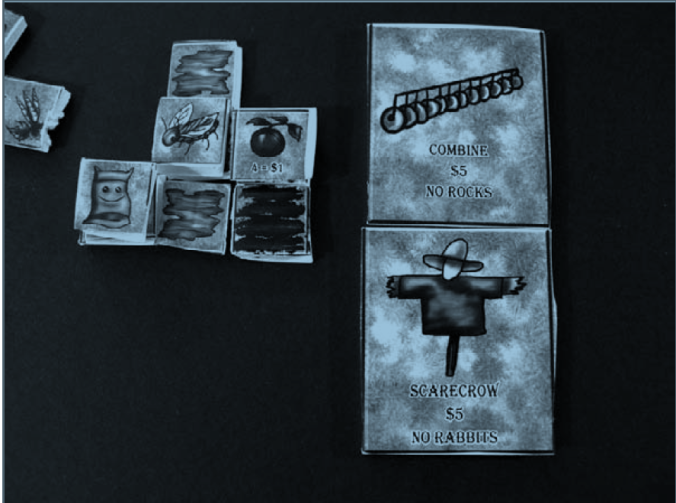](media/855e212e2eeac9c0edd0a677c8b33e16.png)**

_Рисунок 1. 1 Agribusiness (aka Farmer) — прототип 2_

Вы все еще не уверены, что игры — лишь набор значимых решений? Вспомните последнюю игру, в которую вы играли и проиграли. Ставлю на то, что вы можете предельно точно назвать тот момент, когда что-то пошло не так. Некоторые решения или серии решений в результате привели к вашему проигрышу. Мы понимаем подобные вещи задним умом, и чем больше мы играем, тем меньше мы совершаем такие ошибки. Но что если вы не можете назвать момент, в который что-то пошло не так? Ставлю на то, что вы не полностью понимаете правила этой игры, и сам игровой процесс вам этого понимания не добавил. Когда игроки не понимают правила, они не понимают ни причины, ни цели их существования. Иногда даже они проигрывают всухую и не понимают, почему.

Каждый из нижеперечисленных пунктов — пример значимого игрового решения:

*   Расположение войск в пошаговых (TBS) стратегиях или стратегиях реального времени (RTS).
*   Распределение очков при повышении уровня в ролевых играх (RPG).
*   Выбор фигуры для хода в _Шахматах_.
*   Прицеливание и стрельба в шутерах (FPS)
*   Нажимание нужной кнопки в нужное время в _Guitar Hero_.

Там, где игрок ощущает возможность совершить выбор, и этот выбор влияет на исход игры, дизайнер создает _значимость_. Для того чтобы создать выбор, нужно создать альтернативный вариант, также имеющий значение.

Тем не менее, иногда у игрока нет никакого выбора. Вспомните _Монополию_. После того, как вся собственность скуплена, какой выбор остается у игрока помимо “кидать игральные кости  и ходить”?

Напоминаю вам, “кидать дайсы и ходить” — не выбор, так как у этого действия нет альтернативы. Если участники игры не озаботились какими-то личными модификациями к правилам для того, чтобы решить эту проблему, в игре больше нечего делать, в ней не осталось значимых решений. Игрок полностью понимает правила _Монополии_, и исход каждой отдельной игры в этой ситуации становится предсказуем. Вот почему _Монополия_ с легкостью может вызывать скуку уже спустя несколько игр.

##### Чем гейм-дизайн не является

Термин “гейм-дизайн” зачастую используется в неверном значении. Кто-то, кто стремится учиться гейм-дизайну, в результате изучает игровой арт. Другие — чистое программирование. В то время как и программирование, и арт являются важными направлениями работы и вдвойне важными для цифровых игр, гейм-дизайн является самодостаточным видом искусства, берущим свое начало задолго до компьютеров, полигонов и даже открытия электричества.

Вот эти самые базовые принципы гейм-дизайна мы и рассматриваем в этой книге — саму эссенцию дизайна. Неудивительно, что многие величайшие гейм-дизайнеры современности начинали с не-цифровых игр, а некоторые и по сей день используют прототипирование на бумаге для современных проектов.

Думая о гейм-дизайне, подумайте о настольной игре _Го_, китайской игре с тысячелетней историей.

[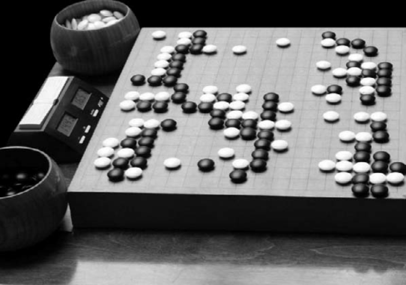](media/62280f5f75159752364f24b972c9b94e.png)

_Рисунок 1. 2 Игровая доска для игры в Го_

##### Типы дизайна

Есть много типов игр, и точно так же есть много типов гейм-дизайна.

*   **Дизайн мира** — создание общей истории, сеттинга и темы игры. Хотя эти задачи в основном решаются ведущим или единственным дизайнером, они зачастую определяют масштаб задач, перечисленных ниже.
*   **Системный дизайн** — создание правил и сопутствующих расчетов для игры. Это — единственная задача из области гейм-дизайна, актуальная для любой игры, потому что правила есть у всех игр. Поэтому большая часть заданий в этой книге затрагивает системный дизайн. Если конкретнее, то Главы 2, 5, 6, 7 и 8 могут послужить хорошей отправной точкой для системных дизайнеров.
*   **Контент-дизайн** — создание персонажей, предметов, загадок и миссий. Хотя он и более распространен в видео-играх, ролевые и коллекционные карточные игры также задействуют значительное количество контента. Глава 3 представляет широкий простор для практических занятий по созданию загадок, в то время как Главы 9, 10, 19 и 20 затрагивают вопрос использования в играх особенного контента.
*   **Игровые тексты** — это написание внутриигровых диалогов, текстов и историй. Глава 9 рассматривает вопрос историй в игре.
*   **Дизайн уровней** — создание уровней игры, включающей ландшафт карты и расположение на этой карте объектов. Хотя дизайн уровней и является широко распространенным — мастера в настольных ролевых играх составляют карты подземелий начиная с 1970-х — говоря “дизайнер уровней”, чаще всего имеют в виду дизайнера уровней для видео-игры.
*   **Дизайн интерфейсов (UI)** — состоит из двух элементов: как игрок взаимодействует с игрой и как игрок получает информацию и реакцию на свои действия от игры. Главы 18 и 19 включают множество задач по UI дизайну. В играх любого типа есть UI, даже в не-цифровых. Поля для настольных игр проектируются так, чтобы помещаться на среднестатистический стол, а карты — чтобы помещаться в руку среднего размера. Игровые компоненты должны содержать информацию, легкую для понимая, использования и интерпретации игроком.

Помимо этих конкретных типов дизайна, каждому дизайнеру для разработки игры или какой-то части игры необходимо серьезное знакомство с выбранным медиа-истоничком, будь то настольные игры, консольные игры или даже телевизионные игровые программы.

##### Что Такое Игра?

Есть множество определений слова “игра”, ни одно из которых не является общепризнанным в смысле определения границ гейм-дизайна. Один из авторов этой книги использует следующее определение: “Деятельность с правилами. Форма забавы, зачастую, но не всегда, включающая в себя конфликт либо с другими игроками, либо с самой игровой системой, либо с случайностью\\удачей\\судьбой. Большая часть игр имеет цель, хотя и есть исключения (The Sims или Sim City). Большая часть игр имеет определенные начало и конец, но есть и исключения (к примеру, World of Warcraft и Dungeon & Dragons). Большая часть игр требует от игроков принятия решений, но есть и исключения (к примеру, Candy Land и Chutes and Ladders). Видео-игра — это игра (в соответствии с определением выше), различным образом использующая цифровой видео-экран того или иного вида.

В этой книге и в нашей работе, когда мы говорим об игре, мы говорим об игре в общем — от древнего _Го_ до нового _Madden_. Цифровая или нет, любая игра в равной мере основана на основополагающих принципах гейм-дизайна. Несмотря на развитие технологий, сегодня дизайнеры видео-игр по сути используют те же навыки, что были использованы для дизайна игр на бумаге.

##### Ядро Игры

“Ядро” или “Базовая Динамика” игры — та единственная вещь, вокруг которой построен игровой процесс — то самое ощущение от игры, которое дизайнер хочет вызвать. К примеру, игры серии Ratchet&Clank — про креативное и забавное устройство бедлама. Risk, Carcassonne и Go — про захват территории. Ядро чаще всего связанно с “Базовой Механикой”, будь то убийство противников, переворачивание карточек на своем ходу или продажа юнитов другим игрокам. Эта базовая механика, в свою очередь, ведет к “базовой динамике” — краткому алгоритму игрового процесса. В игровой индустрии, говоря “ядро”, чаще всего имеют в виду именно “базовую динамику”. “Базовые постулаты” (иногда называемые “вИдением” игры) обычно пишутся командой разработчиков для отражения базовой механики или базовой механики и подытоживания сути игры в одном предложении.

*   “Эта игра о …”
*   “Эта игра позволяет почувствовать себя …”
*   “Эта игра учит …”
*   “Эта игра моделирует ощущения от …”

Как хорошо известно любому, кто пытался продать свою игру издателю, если вы не можете описать свою игру двумя предложениями, у вас нет игры.

Следующие базовые динамики появляются в играх снова и снова:

*   **Захват территории:** Это ядро характерно ограниченным ресурсом, который вполне может исчезнуть. Также реализуется через контроль части территории (к примеру, в FPS). Игры наподобие _Risk_, _Carcassonne_ и многие пошаговые стратегии используют именно эту базовую механику.
*   **Предсказание:** Великое множество игр основано на необходимости сделать нужное действие или оказаться в нужном месте в нужное время. Чаще всего это — детские игры, но множество игр для вечеринок также используют эту базовую динамику. Все индивидуальные механики игры направлены на то, чтобы игрок смог предсказать событие, и награждают его за правильное предсказание, после чего наступает следующий ход. В большинстве случаев предсказания игроков завязаны на удаче или расчете вероятностей. Игры типа _Roulette_ или _Камень-Ножницы-Бумага_ как раз из этой когорты.
*   **Пространственное мышление:** Реализованные в качестве видео-игр игры-загадки зачастую задействуют навыки пространственного мышления. Игры наподобие Tetris заставляют игрока думать не только о той фигуре, что доступна ему в данный момент, но и об уже установленных фигурах и о тех фигурах, которые ну очень бы хотелось получить прямо сейчас, чтобы не проиграть. Многие настольные игры наподобие _Крестиков-Ноликов_, _Connect Four_ или _Pente_ так же ориентированы на пространственное мышление. Прототип игры All Systems Down! (рис. 1.3) демонстрирует использование пространственного мышления в этой игре.

[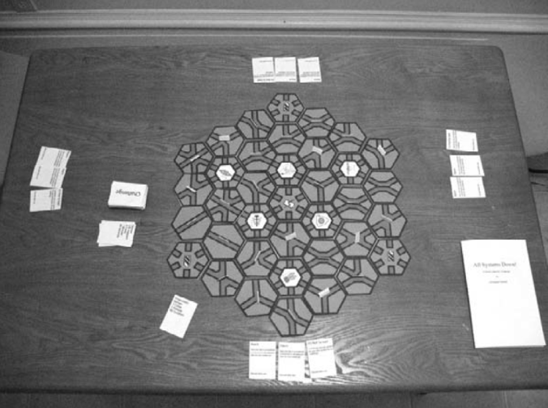](media/0a1243ac941d2e4c8cd10acf9d0cdbd5.png)

_Рисунок 1.3 All systems Down! — второй прототип_

*   **Выживание:** Люди самим естеством стремятся к выживанию и благополучию, и в игровом пространстве этот принцип не перестает действовать. Мы будем защищать сами себя на голых инстинктах еще до того, как нам объяснят цель игры. Выживание — базовая динамика многих игр. Тем не менее, важно не путать базовую механику с условиями проигрыша в игре. Во множестве видео-игр вы можете умереть, и если это произойдет, игра закончится. В то же время многие из этих игр не используют борьбу за выживание в качестве основной игровой активности. Если игрок сосредоточен на накоплении силы, убийстве врагов или поиске выхода, выживание оказывается вторичной активностью, которая лишь поддерживает основную динамику игры (типа строительства или разрушения).
*   **Разрушение:** противоположность динамике “выживание”, или даже компаньон, если речь идет о посвященной противоборству игроков игре (PVP), динамика “уничтожь-все-что-увидишь”. Каждый FPS делает акцент на этой базовой механике, но не менее часто она встречается и в настольных, и в карточных играх на военную тематику, вроде _Nuclear War_, _Plague and Pestilience_ и _Car Wars_.
*   **Созидание:** не менее сильно, чем стремление к выживанию, в людях проявляется стремление к созиданию, даже тогда, когда это не ставится целью процесса. Не удивительно, что созидание — основная динамика многих жанров. Во множестве RPG основная динамика строится вокруг развития персонажа — созидания его сил и способностей. Видео-игры жанра “city-builder” наподобие серий _Sim City_ и _Caesar_ используют основную механику сотворения и вовсе напрямую. В некоторых настольных играх, к примеру — в _Settlers of Catan_, игроки тратят большую часть времени на развитие собственных ресурсов.
*   **Собирательство:** Мы — люди, и сопоставление — один из наших естественных навыков. Мы — люди, и сопоставление — один из наших естественных навыков. Вы только что заметили, что два этих предложения одинаковы и неосознанно сопоставили их. Это в природе людей. Мы инстинктивно сопоставляем похожие объекты. Собирательство является основой коллекционных карточных игр (очевидно), казуальных игр (три-в-ряд), платформеров (собирай кольца, снаряды или золотые монеты) или игр, где преимущество в ресурсе определяет победителя.
*   **Погоня или бегство:** В древности людям приходилось много бегать как для того, чтобы поймать добычу, так и для того, чтобы спастись от хищников. Неудивительно, что эта базовая механика лежит в основе множества игр. Она превалирует в контактном спорте и видео-играх типа _Pac-Man_ и настольных играх типа _Scotland Yard_.
*   **Торговля:** Не каждая игра обязательно должна быть соревновательной. Во многих играх игроки сотрудничают друг с другом (даже тогда, когда являются оппонентами). В тех играх, где присутствует несколько видов ресурсов, принадлежащих разным игрокам, взаимодействие и торговля между этими игроками — обыденное дело. Торговля — основная динамика множества не-цифровых игр, таких как _Pit_ и _Settlers of Catan_. В коллекционных карточных играх эта же динамика проявляется за рамками игрового процесса. Даже видео-игры типа _Animal Crossing_ и _Pokemon_ используют элемент обмена между игроками.
*   **Гонка до победного:** Первым преодолеть улицу, пересечь финишную черту, изобрести конкретную технологию — все это распространенные вариации игрового процесса с использованием базовой динамики “гонка до победного” (рис. 1.4). Точно так же, как и в случае с выживанием, сотворением и собирательством, люди интуитивно стараются делать вещи максимально быстро, по большей части из-за того, что наш мозг говорит нам “быстрее = лучше!” и потому, что скорость — один из критериев уровня владения определенным навыком. Игры, использующие эту механику, обычно легки в разработке и игре. Эта механика часто используется в детских играх.

[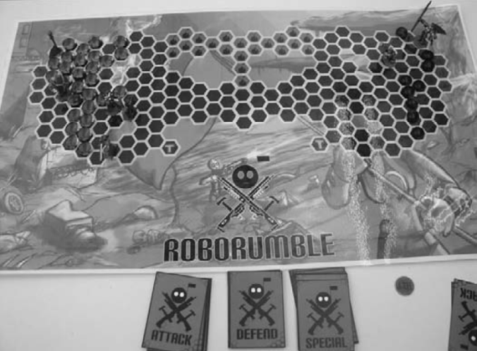](media/4d8ef35947fddbbfb921cddae30dea14.png)

_Рисунок 1.4 Прототип игры “гонка до победного”. Прототип Robo Rumble от Balke Harris, Nata Berna, Erika Scipione, AJ Rebecchi и Keli Washington_

Определяя основные фичи для конкретного ядра, дизайнеры стараются увязать каждую фичу с базовой динамикой (или набором динамик) таким образом, чтобы сделать игру лучше.

Тем не менее, разработка и внедрение набора фич, неразрывно связанных с базовой динамикой — отдельный вопрос, представляющий собой подлинное мастерство гейм-дизайнера. Наборы фич описывают именно отдельные фичи проекта. В этом списке дизайнеры обычно стараются совместить инновации, улучшения и ожидания. Гейм-дизайнеры обычно включают в набор игровых фич стандартные ожидания игроков, описываемые термином “жанр”, но также стараются в том или ином виде добавить что-то новое по сравнению с уже вышедшими играми того же жанра или темы, если таковые вообще имеются.

Цифровые игры по сравнению с аналоговыми серьезно расширяют доступный гейм-дизайнеру ассортимент базовых динамик. Вспомните все разнообразие этих игр — от высокобюджетных брендов до серьезных игр — и список получится воистину ужасающим.

##### Откуда черпать вдохновение?

Все — вообще все — может быть превращено в игру. От выращивания бобов то выпаса овец, вязания — гейм-дизайнер может превратить в игру что угодно. Тем не менее, каждый профессиональный гейм-дизайнер постоянно сталкивается с вопросом “Откуда ты черпаешь вдохновение?”.

Есть несколько ответов:

Играю во множество игр. Посредством изучения игр вы разрабатываете необходимый багаж механик и динамик, являющихся теми самыми жизненно необходимыми “кирпичиками” успешного гейм-дизайна. Важно играть в самые разные игры, а не только в те, с которыми у вас сложилось. Представьте, что вы — архитектор, который большую часть жизни провел в частном пригороде, после чего получил заказ на дизайн нового дома. Скорее всего этот дом будет похож на те, которые вам лучше всего знакомы. Представьте по аналогии дизайнера уровней, выросшего (по какой-то странной причине) в аудитории. Все его уровни будут так или иначе отражать тот мир, в котором он вырос. В то время как после ознакомления с множеством разных игр ваш дизайн или дизайн вашей команды станет богаче (рис. 1.5). Изучайте множество новых типов игр для развития собственных кругозора и навыка. Читайте документацию. Встретив что-то заинтересовавшее вас, изучайте подробнее.

Общайтесь с другими дизайнерами. Два дизайнера, профессионально обсуждающих нюансы дизайна — надежный способ сделать игру. Помните, что это может быть и плохая игра, поэтому обращаться за фидбеком важно к квалифицированным профессионалам. Тем не менее, все дизайнеры используют одну и ту же методику, поэтому даже простое общение мотивирует их к более глубокому осмыслению.

Везде. Ищите идеи для игры во всем, что вы делаете, и заставляйте себя делать игру или думать о том, как сделать игру, посвященную чему-то новому, хотя бы раз в день. Прямо сейчас вас окружают приглушенные звуки: шорох страниц, звук собственного дыхания, возможно, музыка или телевизор на фоне. Гейм-дизайн точно так же может быть приглушенным или громким. Если вы будете постоянно искать идеи, вы будете находить их повсюду.

[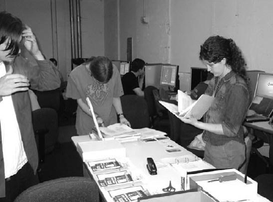](media/820c34759ef196d47d1814a337aa70f2.png)

_Рисунок 1.5 Группа студентов гейм-дизайнеров работает над настольной RPG с боевой системой и мастером (GM). Финальный дизайн оказался под влиянием самого широкого круга игр. Прототип You Are Dead от Michelle Menard, Chris Schmidt, Darren Malley и Jeff McNab_

##### Изучение Гейм-Дизайна

Гейм-дизайн — та область, которой нужно заниматься, чтобы ее изучать. Честно, нет никакой альтернативы разработке игр. В процессе вы узнаете так много, что вам, скорее всего, даже не придется ничего читать о разработке игр. К счастью, в процессе изучения этой книги это — именно то, чем вы будете заниматься большую часть времени.

В этом смысле гейм-дизайн похож на кулинарию. Представьте себе шеф-повара, который ни разу не заходил на кухню, не пытался ничего приготовить, но прочитал великое множество кулинарных книг. Бьюсь об заклад, что его первый кулинарный шедевр будет совершенно неаппетитным. Или представьте себе художника, который никогда не брал в руки кисть. За пределами вводного изучения базовых концептов лучший способ лучше рисовать — это рисовать как можно больше.

Точно так же, создание и игра в собственный дизайн — лучший способ изучения работы и сбоя конкретных механик в самых различных ситуациях. Не забывайте также, что динамика возникает лишь в процессе игры, и некоторые ее проявления могут вас удивить.

В прототипе на рисунке 1.6 один из авторов книги пробует смоделировать положение вещей для инсталяции, которая должна стать частью выставки. В процессе игры геймплей развился в две непредвиденные дизайнером динамики.

[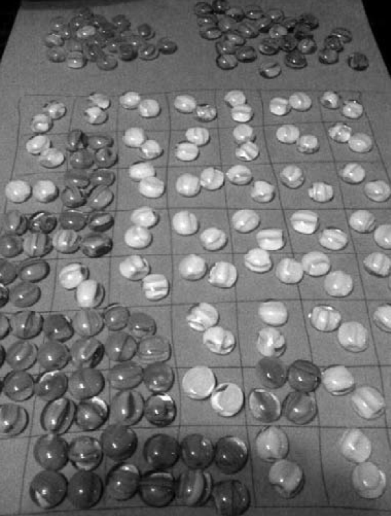](media/c918ead811638090af32bdd4c31a0dfe.png)

_Рисунок 1.6 первый прототип Where My People Come From_

Первая непредвиденная динамика — изменение ритма игры по мере того, как фишки одного игрока зажимали фишки другого игрока на все более и более мелких участках территории. Появились интересные стратегии “выживания”, в которых игроки разрешили сдвигать свои фишки более одного раза для того, чтобы достичь оптимальной дистанции между своими фишками и фишками противника.

Второй непредвиденной динамикой оказалась проявившаяся во время игры явная фазовость. Фазы ожидаются в подобных играх — Risk обладает ярко выраженными фазами — но дизайнер был удивлен тем, насколько явно определились фазы.

Эти динамики никогда бы не проявились от чтения книги или написания документации. Для того чтобы заниматься дизайном, им нужно заниматься на практике, и вы сами должны играть в то, что проектируете. Никак иначе это не работает.

##### Общие термины Гейм-Дизайна

Как и в любой другой индустрии, индустрия игр имеет свою терминологию, которую используют для определения особых событий, понятий и отправных точек в проекте либо понятий, связанных с играми в общем. Хотя, конечно же, ни одно из этих понятий не выгравировано в камне на веки вечные. Для каждого термина, используемого в индустрии игр, возможно, существует пять различных определений в зависимости от компании, личности или дисциплины, о которой идет речь. На протяжении этой книги свободно используются следующие термины:

**Список фич**: Список, в котором детализированы ключевые фичи и основные поинты игры. В опубликованных и изданных играх такие данные можно найти обычно на задней стороне коробки (упаковки).

**Брейншторм**: Процесс генерации идей, обычно проводимый группой лиц. Обычно те, кто участвует в брейншторме, получают инструкции озвучивать любые приходящие на ум идеи, неважно какими глупыми, странными или сумасшедшими они при этом являются. Один из участников записывает все эти идеи в общевидимом месте. Участники могут прорабатывать или проигрывать идеи коллег, но критицизм или отвержение идей не допускается до тех пор, пока процес не будет остановлен.

**Прототип:** Прототипом называют раннюю играбельную версию игры или часть игры, созданную дизайнером для улучшения понимания и повышения опыта игрока. Прототип может быть выполнен в программном виде (“цифровой прототип”) или с помощью физических материалов как настольная игра (“физический” или “бумажный” прототип).

**Баланс:** Термин, используемый для описания состояния систем игры как либо “сбалансированные” либо “не сбалансированные”.  Когда игра не сбалансирована, она слишком проста или слишком сложна либо же подходит только какому-то слишком ограниченному кругу игроков. Когда игра сбалансирована, она обеспечивает стабильный челлендж для своей целевой аудитории. Для конкурентоспособных многопользовательских игр это понятие также означает, что нет такой уникальной  стратегии, которая была бы явно лучше других, а также нет такого игрового подвига, который бы позволил игроку нивелировать челлендж игры. Мы также иногда называем отдельные элементы игры “сбалансированными” друг с другом, имея в виду, что цена их достижения пропорциональна эффекту, получаемому при этом, так, как, например, в случае с картами в CCG или оружием в FPS или RPG.

**Механика:** Правила игры. Общие нецифровые механики включают бросание кубиков, ходы, игровые раунды и действия по очереди. Примеры механики из видео игр — бег, прыжки, стрельба. Механики подробно описаны в разделе 2.

**Динамика:** Как изложено в модели MDA (Robin Hunicke, Marc LeBlanc and Robert Zubek), то есть “механика-динамика-эстетика”, три динамичных результата получаются, когда правила применяются в движении. Правила, которые позволяют игрокам атаковать друг друга, могут являться механикой, но если игроки обычно используют эти правила для того, чтобы объединяться против лидирующего игрока, —  это динамика. В некоторых шутерах от первого лица игрок всегда начинает в определенной локации (точка спауна), что есть механика; а вот стоять рядом с точкой спауна и систематически убивать тех, кто спаунится (спаун-кемпинг) — это динамика. В шахматах передвижение фигурок по правилам — это механика, а вот “книгочтение” (то есть применение хорошо известных комбинаций с начала игры) — это динамика.

**Системы:** Совокупность игровых механик, ответственная за формирование определенного результата в игре, такого, как создание персонажа, бой или наложение заклинания (см. рис. 1.7.)

**Аватар:** Прямое представление (представитель)  игрока в игре. В Monopoly аватарами выступают фишки, перемещаемые по полю (туфля, собака и т. д.). В Игре Tomb Raider аватар — это главная героиня Lara Croft. В нецифровых играх это еще называют фишками (талоны, знаки, токены).

**Плейтест** (тестирование): Систематическое тестирование геймплея, систем, баланса и интерфейса с целью поиска ошибок, несоответствий и проблем с последующим рапортом дизайн-команде.

**Нижеследующие термины обычно используются в цифровом гейм-дизайне:**

**Платформа**: Консоль, устройство или система, на которой будет вестись игра.

**Концепт-документ**: Документ размером 1-3 страницы, в котором изложен высокоуровневый обзор предлагаемой игры. Обычно состоит из следующих секций: вводный параграф, объясняющий основную тему игры; демографическое распределение, включающее определение целевой аудитории, жанр, целевые платформы; очень краткий список фич, также прилагаемый к нему определитель, в котором каждая фича более детализирована. Пример такого концепт-дока можно найти на веб-сайте этой книги [http://designgames.wordpress.com](http://designgames.wordpress.com/).

**Концепт-предложение:** 5-20 страничный документ, содержащий более глубокое видение потенциальной игры по сравнению с концепт-документом. Как и концепт-документ, обычно предложение содержит вводный параграф, демографическое распределение, обзор геймплея, список фич и его детализированный вариант. Также документ содержит оценки бюджета и времени, сравнительный анализ (как игра будет выдерживать соревнование с другими), планы по экспансии (например, созданию сиквелов) вне пределов начального релиза продукта. Также типично наличие экранного макета или концепт-арта. Схема концепт-предложения также выложена на вебсайте книги по адресу http://designgames.wordpress.com.

[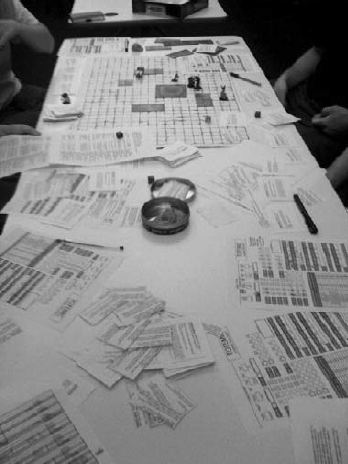](media/557c6f588f984ba5386a6fb45234acc0.png)

_Рисунок 1.7 Бумажный прототип  нескольких систем в ролевой игре. Тотемный прототип авторства  Clay Kisko, Ben Rodgers, Szymon Marciniak и Jarrod Morrison_

**Питч:** Короткая “лифтовая речь”, адресованная издателю игры или инвестору-капиталисту и запрашивающая спонсирование проекта. Лифтовые речи получили свое название от отрезка времени, отведенного на презентацию какой-либо идеи — время, которое вы проводите вместе с нужным человеком в лифте до тех пор, пока он  (она) не выходит.

**Дизайн-документ**: “Живущий” документ, постоянно претерпевающий ревизии, он содержит полное дизайнерское видение игры. Он может размещаться в файле документа или в Вики. Некоторые команды используют Agile (быструю, подвижную) разработку и не используют дизайн-документ в принципе. Больше информации о Подвижной Agile-разработке можно найти на AgileManifesto.org. ГеймДизайнДокументы (ГДД) обычно отделены от технических дизайн-документов (ТДД) для программистов и руководств по арт-стилю для арт-команды.

**Баги:** Ошибки в геймдизайне, коде, арте, звуке или тексте.

**Движок:** Программа-ядро, которая управляет игрой. Unreal и Gamebryo — популярные движки, используемые в гейм-индустрии. Разработчики наслаивают дополнительные технологии на движок для того, чтобы достичь необходимого количества дизайнерских спецификаций в продукте.

**Альфа (Альфа-версия):** Этап, на котором все системы имплементированы и весь код теоретически завершен. Обычно на этом этапе есть множество багов и не слишком ужасный баланс. Некоторые компании требуют, чтобы на этапе альфа-версии также был имплементирован еще и весь контент — арт, звук, нарратив. Таким образом, Альфа-версия — это завершенный контент и код.

**Бета (Бета-версия):** Этап, на котором все системы и весь контент уже внедрены в игру. Этот этап намного стабильнее, чем альфа, большинство багов учтены, баланс более просчитан.

**Золото (Золотая версия):** Окончательная версия игры, которая и отдается в релиз.

**Гейм-джем:** Ограниченный во времени период, в течение которого группа личностей пытается создать цельную игру и с этой целью работает день и ночь.Такой процесс обычно длится 1-3 дня.

**Этап (веха):** Точка, придя к которой в процессе, разработчик должен предоставить определенный контент. Это может быть документ, комплект художественных ассетов или цельная игра.

**Нецифровые игры также имеют некоторые общие термины:**

**Игровые Части:** Неформальное название для разнообразных предметов, прилагаемых к игре, например костяшки, доска, фигуры, карты (см. Рисунок 1.8). Более формально все это называется “компонентами” или “игровыми объектами”.

**Карточная игра:** Игра, в которой используются игральные карты. Например, стандартная карточная колода.

**Настольная игра:** Игра с игральной доской (поверхностью), служащей полем для игры.

**Игры на основе узора и плиток (tile-game):** Тип игры, в которой игровая поверхность (доска) выполнена из плиток, обычно квадратных или гексагональных (см. рисунок 1.9). Эти плитки могут быть размещены в определенной конфигурации (как в играх Settlers, Catan of Hey, That’s MY Fish) или же размещаться уже в процессе игры (как в Carcassonne).

**Игра с игральными костями:** Игра, в которой в качестве основной игровой части используется игральная кость (кости); обычно не нуждающиеся в доске, картах или плитках.

[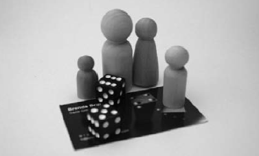](media/c2dde7143f496c0067ed4e6827f3e8a3.png)

_Рисунок 1.8. Пример игровых частей. Это неокрашенные, твердые деревянные игровые фишки вместе с игральными костями на фоне пластиковой  бизнес-карты для сравнительной демонстрации размеров (бизнес-карта обычно не используется как игровая часть, однако в нужной игре можно ее и применить)._

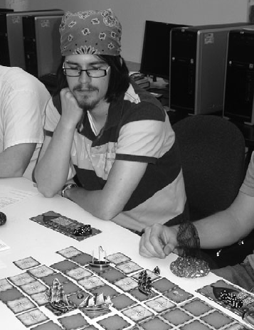

Рисунок 1.9. Типичный расклад игры с плиткой. Игровая доска сформирована из свободно лежащих плиток, которые сопоставляются для формирования игрового пространства. Прототип Age of Discovery, авторы Tom Whitener, Josh Markham, Sam Paley и Kevin Pollard.

##### Подход к Гейм-Дизайну

У разных дизайнеров разный подход к гейм-дизайну — в зависимости от ситуации и среды, в которой происходит дизайн. В списке, который приведен ниже, определенные варианты были нами именованы, иными словами, мы придумали названия для процессов, которые мы регулярно испытываем и о которых много слышим.

**Синее-небо:** Чистый сине-небесный дизайн позволяет дизайнерам рассматривать множество возможностей и идей с редкими исключениями, обусловленными временем, финансами, интересом или и тем, и другим, и третьим вместе. Гейм-дизайн в таком случае напоминает поиск сокровищ без карты. Дизайнеры всегда находятся в поиске новых идей, так как процесс создания игры прямо из идеи как таковой всегда приятен для самого дизайнера. Фактически для большинства дизайнеров игра сосредоточена в самом создании игры. Обычно большую часть времени профессиональный дизайнер работает в условиях определенного ограничения — влияющего извне препятствия по отношению к свободе дизайна. Но сине-небесный дизайн не предусматривает никаких ограничений помимо воображения самого дизайнера.

**Медленное кипение:** Когда определены тема и сеттинг — скажем, Ирландцы, 1880-е, Бостон — гейм-дизайнеры начинают совершать то, что можно описать как массивную исследовательскую миссию, причем такую, которая зачастую малоуправляема в отношении данной темы. Как заметил один гейм-дизайнер: “Я набиваю себе голову всем, чему могу относительно данной темы, а затем — жду. Дизайн сам появится”. К счастью для большинства дизайнеров, они универсальные эксперты с любовью к обучению и естественным любопытством, способным продвигать их в нужном направлении. Иногда такой дизайн занимает несколько дней, иногда — недели, месяцы и даже годы. Гейм-дизайнер Reiner Knizia регулярно работает над не менее чем 30 дизайнами одновременно и отмечает, что предпочитает прорабатывать игры в уме, повторно проигрывая их умственно перед тем, как отправлять на стадию прототипа (см. рисунок 1.10). Дизайнеры-новички совершают одну общую ошибку — слишком быстро проталкивают игру вперед, не давая ей достаточно времени на рост и развитие. Периодическая фиксация идей в чьей-либо голове может помочь пришпорить иные идеи, особенно если эти идеи принимают форму потенциального дизайн-документа или комплекса правил.

**Механика:** Управляемый механикой гейм-дизайн является более всеобщим, чем может показаться. Рассмотрим класическую игру Super Mario Bros. Mario прыгает через разные  штуки, на штуки и в штуки. Сила этой игры состоит в чистой силе именно этой механики — и почти все игры в этом жанре следовали принципу этой игры с давних времен. Другие, более новые игры, как, например, из серии  игр Katamari Damacy, применяют механику, в которой липкий мячик катается по чему-либо и собирает это. Опять-таки аналогичная механика применяется снова и снова с большим эффектом. Возможно, в наибольшей степени управляемые механикой игры — это игры, в которых даже в названии жанра есть механика: шутеры от первого лица. Механика стрельбы из пушки, из палочки или чего-либо еще, очевидно, никогда не устареет. Даже Mario может стрелять файрболами.

**МДА (МДЭ):** Используя модель гейм-девелопмента “Механика-динамика-эстетика”, дизайнеры создают эстетичные модели для различных типов геймплея. Эстетичность относится не к внешности игры, но скорее к эмоциональному ответу, который дизайнеры и разработчики надеются вызвать в игроках на протяжении игровой динамики. Если механика — это правила, а динамика — это непосредственно игра, то эстетика  — удовольствие (или недостаток такового) в процессе игры, испытываемое играющим. Дизайнеры спрашивают себя, какой эстетики они хотели бы достичь, определяют динамику, которая должна привести к этому ощущению, и затем создают механику, которая бы произвела нужную динамику. Больше информации о модели МДА можно найти на домашней странице Марка [Mahk 8kindsoffun](http://mahk.8kindsoffun.com/).

**ИС:** Что означает “Интеллектуальная собственность”. Игры, основанные на ИС, очень распространены в гейм-индустрии, и большинство дизайнеров рано или поздно в своей карьере обнаруживают, что работают над игрой на основе изначально существующей ИС.  Термин ИС используется для обозначения кого угодно или чего угодно, под подобие которого построена игра. Примеры ИС-игр — Spiderman, Halo, The Sims, а также персоналии, такие как John Madden. Даже нецифровые игры бывают основаны на ИС. Большинство популярных телевизионных шоу издает настольные версии в виде игр, а популярные видео игры часто преображаются в карточные или настольные версии. Pokemon и World of Warcraft — это только два примера ИС-игр, которые “вышли из системы”. Издатели игр любят использовать ИС, так как она смягчает риск. Чем больше людей, знающих и любящих что-либо, тем шире потенциальный рынок, базирующийся только лишь на лицензии, что означает для издателя меньше риска финансового неуспеха игры.

В качестве примера силы ИС, рассмотрим NFL football. Теперь подумайте о еще одной профессиональной футбольной лиге. Хотя некоторые из них действительно пытались состояться как в реальном мире, так и в мире видео игр, никому не удалось приблизиться в силе к настоящей NFL.

[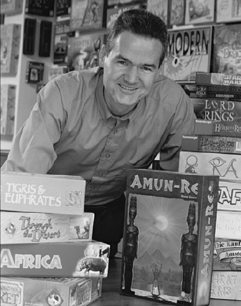](media/ae861f6ce27a4e5d8fe42b09003ea2de.png)

_Рисунок 1.10 Reiner Knizia, выдающийся дизайнер нецифровых игр. За время написания этой книги было издано более 200 его игр._

**История:** Разработка игры, основанной на определенной истории, — это тоже достаточно распространенный подход, причем он больше относится к видео играм и в меньшей степени — к нецифровым играм. Обычно это сопряжено с Интеллектуальной собственностью, в случае когда обладатель лицензии хочет, чтобы разработчики придерживались сюжета книги, телевизионного шоу или фильма. История также может отображать хронологическую последовательность какой-либо личности или компании. Автор Tom Clancy предоставил многие из своих книг для создания игр на их основе, а эпичный The Lord of the Rings был превращен в широко известную настольную игру дизайнером Reiner Knizia. Достаточно часто в нецифровых играх дизайнеры применяют тематическое приближение так же, как сделал Knizia.

**Исследование:** В последнее время игры часто используются для исследования разнообразных тем или как тема для исследования как такового. Для своих МФА-тезисов студентка Саваннского колледжа Искусства и Дизайна Michelle Menard создала настольную игру производственного класса, систему документации, а также составила исследовательский отчет, в котором анализировалась идея использования эмоций для созданий игровой механики. Таким же образом, Jenova Chen из USC создала flOw для исследования концепции потоковости и настройки сложности в играх.

[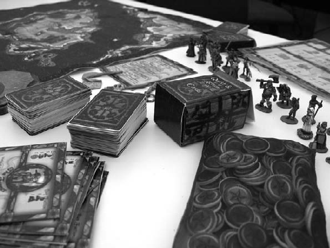](media/bd00f10374341b1b0b090ab90de14a6e.png)

_Рисунок 1.11 Mesuline. Выпускная тезисная работа Michelle Menard МФА, Саваннский колледж Искусства и Дизайна ([www.artemic.com](http://www.artemic.com/))._

##### Итеративный дизайн

Гейм-дизайн, как и много других форм дизайна, это итеративный (то есть циклический, повторяющийся) процесс. Это означает, что игра быстро становится прототипом, затем в нее играют и улучшают — снова и снова до тех пор, пока она не приобретет финальный вид. Это требует понимания того, что никто не достигнет идеальной цели с первого раза, даже самый суперквалифицированный дизайнер; и самые великие и наиболее успешные игры достигли высот только после большого количества повторяющихся ошибок на пути. Любой модерируемый игровой комплекс или игровая система внутри игры обычно требуют много итераций (повторений) перед тем, как считаться завершенными.

Типичная итерация включает следующие компоненты:

1.  **Быстрый прототип:** дизайнеры фокусируются на игре, пренебрегая графикой. Представьте на минуту как кто-то бы прототипировал видео игру Mario Kart в формате настольной игры.  Использовалась бы динамика “гонка до конца”, значки или фишки обозначали бы машины, и игрокам были бы разрешены определенные действия в зависимости от их положения на игровой доске. Исходя из этого, могли бы быть построены и другие игровые механики для дальнейшего совершенствования нецифрового игрового формата. Ключевой поинт прототипирования — это быстрота. Чем больше итераций игра пройдет, тем более высокое качество она приобретет, таким образом, потратить три месяца на обсуждение проблем одного-единственного прототипа — это просто трата времени. Иногда с помощью прототипа дизайнеры намереваются ответить на особенные вопросы (“Будет ли включение в игру оружия из голубой раковины слишком большим по силе”), в других случаях они надеются оценить общее ощущение от игры. Существует большая тенденция среди дизайнеров устраивать дебаты по поводу итогов чего-либо, что могло бы быть решено в два раза быстрее, если бы только было прототипировано.

[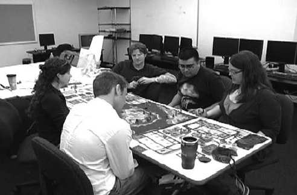](media/bf5d888a785ee3e4ed8fea33a4b41b5b.png)

_Рисунок  1.12 Mesuline. Плейтест, в котором Michelle Menard собирает информацию о реакции игроков на геймплей._

1.  **Плейтест:** это полный или частичный игровой процесс, призванный выявить сильные и слабые стороны дизайна.
2.  **Ревизия:** изменения, вносимые в дизайн для того, чтобы исправить слабости и укрепить сильные стороны. В одних случаях раз за разом изменяются небольшие детали, в других случаях  дизайнеры сталкиваются с неожиданной динамикой, которая вынуждает игру двигаться по совершенно иному направлению.
3.  **Повторение:** возвращаемся к прототипу и начинаем следующую итерацию.

В прототипировании игр есть еще пара общих правил, которым следуют авторы этой книги:

*   Не записывайте правила до тех пор, пока вам не понадобится записывать правила. Если вы как дизайнер не можете удержать правила в собственной голове, то как же вы можете ожидать этого от игроков? С другой стороны если ваши игроки должны в процессе игры иметь перед собой список монстров, то и у вас он должен быть. Хотя если записывание является частью процесса брейншторма, или вы можете забыть элементы игры из-за длительного времени между периодами дизайна, тогда не следуйте этому правилу.

*   когда выявляете проблему в игре, избегайте накладывать пластырь на верхушку проблемы, но при этом оставлять саму проблему в игре. Иногда дизайнеры лепят эти пластыри один поверх другого, но не устраняют плохую механику, которая инициирует проблему. Когда вы все время пытаетесь исправить что-то, что не стоит того, возможно, лучше будет просто это удалить из игры. Если ничего другое не помогает, возьмите таймаут — это может повысить перспективы и дать вам новый взгляд на возможное решение.

#### Ограничения в Гейм-Дизайне

Ограничения — это границы, внутри которых дизайнеры строят игру. Думайте об ограничениях как о ящике, который вы не можете переделать. Например, представьте такую игру, которую вы должны создать, имея для этого 20$ вместе 200000$.

##### **Ограничения видео-игр**

В видео играх дизайнеры чаще всего начинают процесс дизайна с ограничений, таких как:

*   какой приблизительный бюджет игры?
*   какие временные рамки для завершения дизайна?
*   какая желательная платформа для игры (например, консоли, мультиконсоли, смартфоны, настольные компьютеры, ARG)?

Эти три вопроса влияют на весь курс дизайна. Фактически эти разнообразные по сути ограничения вполне могут конфликтовать друг с другом. Это не редкость для людей, новых в игровой индустрии (например, корпорация, надеющаяся создать тренировочную игру), когда средняя стоимость гейм-разработки совершенно недооценивается. Когда обсуждается игра (происходит питч) с потенциальным издателем, возможно, издатель будет открыт к переговорам и способен предложить вам различные варианты.

Помимо трех ключевых вопросов, есть также другие вопросы, которые задают гейм-дизайнеры:

*   какой желаемый рейтинг для игры? (Хотя игра не будет оцениваться ESRB (Комитетом рейтингов программного обеспечения) до практически окончательного завершения, издатели могут иметь в представлении какой-либо идеальный рейтинг и направлять разработку на соответствие ему).

*   принадлежит ли в вашем представлении будущая игра определенному жанру или категории игр?

*   есть ли какие-либо фичи, которые вы хотите видеть в игре?

Некоторые разработчики также спрашивают потенциальных клиентов об эпитетах и свойствах, которыми они хотели бы наделить создаваемую игру. Это говорит разработчику многое об общем стиле игры. Если кто-то говорит “резкая и реалистичная”, это направит питч в совершенно другую тональность, чем “легкая и мультяшная”.

Для нелицензированных игр, в которых разработчик трудится в надежде создать свою собственную ИС (интеллектуальную собственность), встают обычно те же самые вопросы. Однако так как разработчик является непосредственно держателем ИС, то времени на ответы на эти вопросы существенно больше.

**Издание (публикация) вашей игры**

На современном рынке абсолютно невозможно продать идею даже суперклассной видеоигры издателю, если только у вас нет уже организованных гейм-дизайнеров с комплектом бестселлинговых заголовков за пазухой. Даже и в таком случае это довольно непросто. Если вы только начинающий, пусть и с прекрасной идеей, вы можете разве что  рассчитывать на рынок инди-игр или найти работу в геймдев-компании, где вам придется пахать годами до тех пор, пока вы займете должность, в которой увидите нужный эффект.

##### **Нецифровые ограничения**

В нецифровом гейм-дизайне дизайнеры часто заканчивают ограничениями. Сперва идет сам дизайн — механика, тема, игровой опыт — и потом, на основании ответа издателя, вносятся изменения. Наиболее общие ограничения состоят в следующем:

*   **Цена производства одного экземпляра.** Целесообразно ли использование деревянных плиток или простые пластиковые тоже хорошо сработают? Смогут ли более легкие компоненты снизить цену доставки? Для определенного типа игр существует целевая точка стоимости. Сложные тяжелые стратегические игры могут стоить больше, чем легкие казуальные семейные игры.

*   **Физические размеры.** На практике когда люди играют, они имеют ограниченное место на столе или на полу, таким образом, игра (если таковая имеется) и другие компоненты должны умещаться на относительно маленькой области. Для игр, в которые играют маленькие дети, элементы должны быть легкими для манипуляции маленькими ручками. Также особенно важна оценка тактильного восприятия (на ощупь) частей игры игроками.

*   **Издатель.** В индустрии настольных игр не все издатели одинаковы. Многие специализируются на определенных жанрах. Компания, которая специализируется на семейных играх, вряд ли издаст вашу игру на тему исторических войн, независимо от того, насколько она гениальная. Некоторые издатели вообще не соглашаются на внешние предложения. Выбор издателя разработчиком нецифровых игр будет лимитирован природой игры, которую он создал.

*   **Нужное время.** Если аналогичная игра была только что выпущена, издатели предпочтут подождать до следующего года перед тем, как выпускать еще одну такую же игру. Некоторые результаты нецифрового дизайна вынуждены ждать годами перед тем, как они увидят свет.

В случаях когда издатель нецифровых игр подходит к отдельному дизайнеру ради особенной игры, ограничения могут быть подобны таковым в видео играх. Издатель может захотеть, чтобы дизайнер сосредоточился на специфическом объекте ИС, чтобы игра была издана в определенное время с определенной стоимостью, рассчитанной на определенную возрастную группу и имела плейтайм в рамках определенного размера.

В противоположность цифровому гейм-дизайну, физические ограничения игры (создание игры, основанной на плитке и доске или же картах) часто становятся результатом самого дизайна, а не существуют изначально. Например, после обдумывания идеи и создания нескольких прототипов, дизайнер может решить что будет лучше сделать игру на основе плиток. А когда дизайн завершен, выясняется, что стоимость материалов такова, что лучше переделать и передумать. Однако на этапе начального дизайна, нецифровой дизайнер имеет много компонентов и сред  для выбора. Это контрастирует с цифровым гейм-дизайном, в котором дизайнер почти всегда начинает с ограничений, даваемых средой (таких как платформа и жанр).

#### Преодоление дизайнерского блока

Даже самые лучшие гейм-дизайнеры иногда сталкиваются с барьерами. Следующие приемы иногда задействуются для того, чтобы стимулировать массивные изменения в динамике текущего гейм-дизайна, когда вы чувствуете себя застрявшими и не знаете, как нужно продолжать (примерно тот же случай, когда писатель преодолевает т. н. “писательский блок”). Хотя дизайн, который могут обеспечить эти приемы, вряд ли приведет к суперпродаваемым немедленно результатам, но он заставит вас играть с радикально другой динамикой, адресует другой комплекс проблем и, возможно, даст идеи вашему мозгу, как укрепить ваш текущий дизайн.

##### Сделайте ресурсы ограниченными (или неограниченными)

Когда ресурсы — деньги, земля, медицинские аптечки — ограничены или отсутствуют (использованы), дизайнеры говорят, что эти ресурсы “ограничены”. Есть только определенное число чего-либо, которое можно использовать, и когда один игрок берет что-то, это означает, что другие игроки потеряют возможность взять именно это. Например, если всего 20 мед. аптечек на уровне, и один игрок берет 12 из них, другой игрок сможет взять только 8. Такие медаптечки будут считаться лимитированным ресурсом.

В Monopoly собственность, дома и отели ограничены, в то время как деньги — неограниченны. Вы можете взять столько денег, сколько вам позволяет шанс.

Чтобы эффективно использовать этот прием, составьте список всех ресурсов в вашей игре и отметьте, ограничены они или нет. Затем по одному измените какие-то ресурсы с ограниченного на неограниченный формат — и снова проиграйте игру. Задумайтесь на мгновение, как бы вы играли в FPS, если бы знали, что пули на уровне были бы ограниченными вместо неограниченных. Подумайте, как бы игралось в Monopoly, если бы вы могли набирать столько собственности, сколько пожелаете.

Когда ресурсы ограничены, это стимулирует применение ресурсо-собирательной и ресурсо-управляемой стратегии игроками. Когда же ресурсы неограниченны, такая стратегия будет менее важна, но как вы можете сказать на примере Monopoly, могут быть выявлены новые интересные игровые динамики.

##### Взаимодействие с вашими друзьями

В то время как выигрывать в игре всегда приятно, бывает не менее приятно препятствовать делать это кому-либо другому либо наоборот подыгрывать. Понаблюдайте за действиями игроков в игре. Спросите себя: “Как не позволить кому-то это совершить или наоборот ускорить совершение?” Можно даже пойти на шаг дальше и спросить себя, как игроки могут защищать себя от агрессивных ходов или же запрашивать помощь прямо от своих оппонентов.

Позволять игрокам влиять на игру других игроков  — это хорошее средство привнесения некоторой неопределенности даже в самые светские игры. Это также стимулирует развитие некоторой стратегичности в игроках, которые начинают задумываться, как им быть готовым к атаке или как войти в союз с другим игроком. Коллективные карточные игры прекрасно показывают этот пример в действии.

##### Запутывайте игровой подрядок

Многие из игр имеют определенный игровой порядок — брать очереди против часовой стрелки, например. Рассмотрите возможность нарушать последовательность событий в вашей игре. Например, в Magic: The Gathering игроку позволено сделать ход, если даже его очередь не наступила. Такие механики, как “ходи снова” или “ пропусти очередь” в настольных играх также очень распространены. Такие игры, как Fluxx, великолепны в плане запутывания игрового порядка, правил и всего, что есть в игре.

##### Убейте правило

Несмотря на то что порой это поражает дизайнера подобно святотатству, убийство правил обычно бывает весьма полезным на этапе прототипа. На этом этапе для авторов типично иметь очень много правил, чтобы справиться с недостатком доверия игрока или доверия к игре как таковой. “Что если игрок не сделает Х?” — как-то сказал один дизайнер. Другой ответил: “Давай составим правило, чтобы они все это делали”. И вскоре правила игры становятся громоздкими. Идентифицируйте ядро игры и начните с уничтожения каждого правила, которое не влияет напрямую на ядро игры (просто  говорить “оно не работает” ничего не означает).

##### Используйте «Правило Двух»

Если что-то не так, но вы не понимаете что или не уверены, возьмите одно из игровых значений и либо умножьте, либо разделите на два. Применение такого резкого изменения даст вам глубокое видение того, как игровые значения влияют и взаимодействуют друг с другом, какой эффект они оказывают на игру, и зачастую вы сможете осознать вещи, которые никогда бы не осознали, применяя небольшие инкрементальные изменения.

#### Использованные ресурсы

1.  [“Types of Game Designers,” Applied Game Design, Brenda Brathwaite](http://bbrathwaite.wordpress.com/2007/11/20/types-of-gamedesigners)

2.  [IGDA Curriculum Framework](http://www.igda.org/wiki/images/e/ee/Igda2008cf.pdf)

3.  [MDA Framework, by LeBlanc et al](http://www.cs.north-western.edu/~hunicke/MDA.pdf)