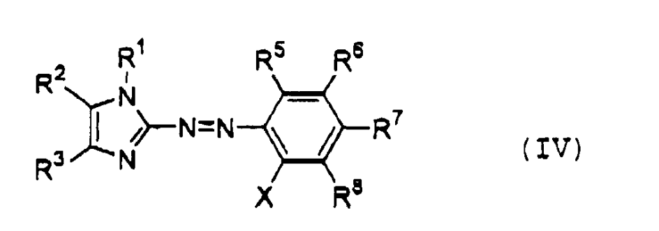
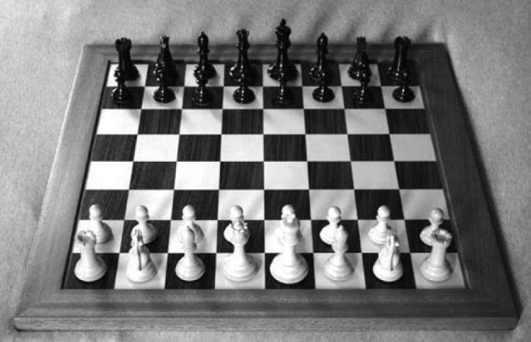
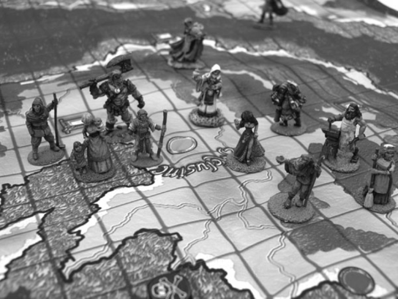
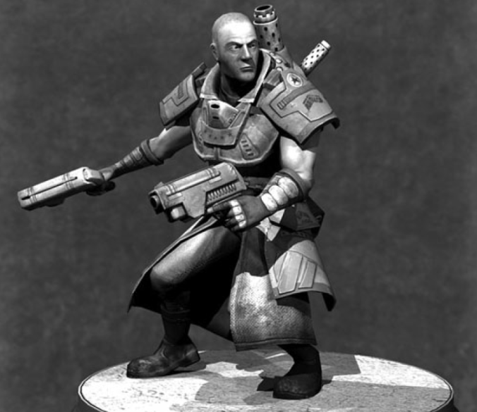
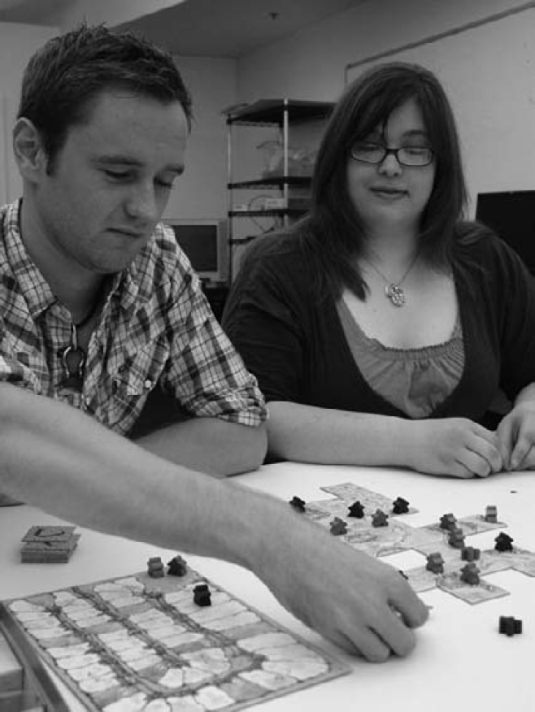
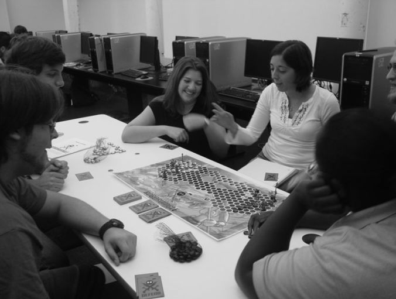
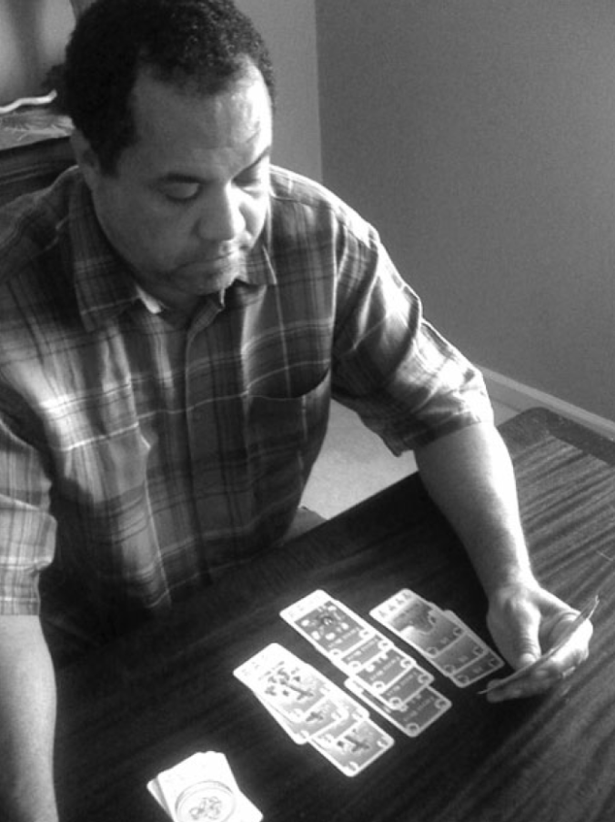
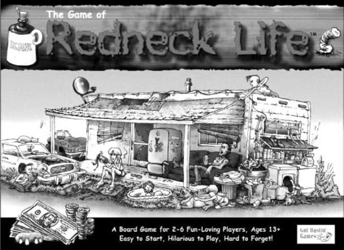
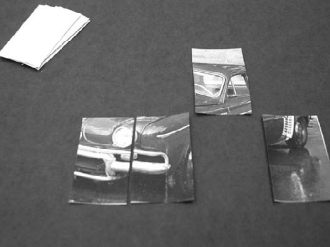

# Challenges for Game Designers: Глава 2. Атомы гейм-дизайна

Перевод второй главы сборника задач по гейм-дизайну [Challenges for Game Designers](http://wordpress.redirectingat.com/?id=725X1342&site=wordpress.com&xs=1&isjs=1&url=http%3A%2F%2Fwww.amazon.com%2Fgp%2Fproduct%2F158450580X%3Fie%3DUTF8%26tag%3Dgamedesiconc-20%26linkCode%3Das2%26camp%3D1789%26creative%3D9325%26creativeASIN%3D158450580X&xguid=623808d699e50273b1b5fc459196091f&xcreo=0&xed=0&sref=http%3A%2F%2Fgamedesignconcepts.wordpress.com%2F2009%2F04%2F&pref=http%3A%2F%2Fgamedesignconcepts.wordpress.com%2F2009%2F03%2F&xtz=-240) за авторство [Яна Шрайбера](http://www.gamasutra.com/view/authors/916452/Ian_Schreiber.php).

Химики и физики уже в течение целых веков работают над тем, что пытаются определить мельчайшие из определяемых частиц веществ и то, как эти частицы взаимодействуют друг с другом. гейм-дизайн — гораздо более молодая сфера, однако, дизайнеры точно таким же образом пытаются определить мельчайшие определяемые составляющие игры. Дизайном каждой составляющей игры можно заниматься индивидуально, и понимание того, что такое эти составляющие и как они взаимодействуют, необходимо для разработки или анализа завершенной игры. Составляющие игр, “атомы” гейм-дизайна — вот о чем вся данная глава.

Разрабатывая игру, многие дизайнеры-новички понятия не имеют, с чего начать. Готовая игра вроде _World of Warcraft_ такая огромная и обширная, что начать разработку целостной вещи с наброска представляется невыполнимой задачей. Даже в случае с относительно простой игрой вроде _Monopoly_ не совсем ясно, с какого места начинается дизайн: он начинается с фигурок игроков, с карточек Шанс или с карточек Объединенного Благотворительного Фонда, с игрового поля, с правил или с чего-то еще? При рассмотрении игры как совокупности атомов процесс ее разработки становится понятнее.

Как предупреждение — разработчики и ученые подбирают массы разных определений слова “игра”, а еще больше — вариантов понимания того, из чего составлена игра. Нижеследующее — один из способов категоризации игр, но не единственный. Дизайнеры, которые сочтут эти дискуссии интересными, призываются к тому, чтобы расширить данные определения.

### Игровое состояние и поле обозрения

Чтобы понимать игры, полезно сперва взглянуть на всю картину целиком. На мгновение нарисуйте у себя в воображении игру, в которую вы недавно играли. Рассмотрите все, что происходит в игре или может в ней измениться, если кто-нибудь совершит действие или выйдет из меню Паузы. Мы называем эту картину игровым состоянием — набором всей релевантной виртуальной информации, которая может изменяться в течение игры.

В _Шахматах_ (см. Рисунок 2.1) игровое состояние включает в себя набор фигур, их позиции на доске и точную информацию, основанную на уже совершенных ходах (к примеру, кто из игроков имеет право сделать рокировку, какие пешки можно взять на проходе, чья очередь ходить).

В _Покере_ игровое состояние включает в себя: руку каждого игрока и его фишки; размер пота; чья очередь делать ставку; кто скинул карты на текущей руке; какие в колоде остались карты и в каком порядке и так далее. В видеоиграх игровое состояние может быть невероятно сложным по составу; в последней игре _Madden_, к примеру, игровое состояние содержит информацию о каждом игроке, о каждом возможном действии и о каждом из уже совершенных в течение всей игры действий.

**РИСУНОК 2.1**

Шахматная доска.

_Изображение взято в Wikimedia Commons._

Благодаря приведенным примерам ясно: игроки не всегда осведомлены обо всем игровом состоянии в целом. Сегмент игрового состояния, который игрок может видеть, мы определим здесь как _поле обозрения_. В _Шахматах_ поле обозрения включает все игровое состояние, потому что в этой игре нет скрытой информации. В риал-тайм стратегии (RTS) есть туман войны, и у каждого игрока — собственное поле обозрения, которое может расшириться за счет еще не разведанных владений и территорий. В ММО игрок в принципе не может знать, что происходит в доброй половине виртуального мира за пределами его поля обозрения.

Таким образом мы пришли к _игровому пространству_, полной игровой области. Это может быть доска, на которой играют в игру, громадная ММО или отдельный уровень в кампании в шутере от первого лица (FPS). В игре с альтернативной или расширенной реальностью (ARG) это может быть город игрока, Интернет, обычное местожительство игрока или целый мир.

### Игроки, Аватары и Игровые Частицы

Игровое пространство может быть каким угодно маленьким или большим, однако, без игроков игры не получится. У всех игр по определению должны быть игроки, потому что игроки — это те, кто на ходу устанавливает правила.

В цифровых мирах игрок часто олицетворен в игре аватаром. В нецифровых играх игроки тоже олицетворены, но в данном случае нет единого термина, он варьируется от игры к игре (“символ” или “пешка” — такие слова часто фигурируют в описании правил игры). В данной книге мы будем рассматривать нечто, олицетворяющее игрока в игровом мире, как аватар. Это то, чем игроки обозначают свое расположение в поле обозрения. В _Monopoly_ аватары: наперсток, автомобиль, маленькая собачка. В _Trivial Pursuit_ — пирог. В _Шахматах_ — король (остальные фигуры здесь для того, чтобы защищать короля). В типичных FPS — солдат или часть оружия на экране. Во многих 3D видеоиграх вы видите спину вашего аватара, в то время как он исследует мир (см. Рисунок 2.2).

**РИСУНОК 2.2**

Аватар в _Melusine_. В _Melusine_ используются аватары, раскрашенные вручную.

_© 2008 Мишель Менард. Перепечатно после получения согласия_

В некоторых играх аватара в игровом пространстве нет. Вместо этого игрок олицетворяет самого себя или саму себя. Это справедливо для _Покера_, _Risk_ и видеоигры _Civilization Revolution_. В последней — маленькие солдатики и артиллерийские орудия защищают игрока — правителя. Также и многие видеоигры в жанре RTS не имеют аватаров. Аватар отличен от того, что дизайнеры настольных игр неофициально называют “игровыми частицами”, которые представляют из себя материальные предметы, необходимые для того, чтобы в игру можно было играть. К частицам относятся такие вещи, как карточки собственности, кубик, пластмассовые военные фигурки в _Risk_, карточки действия и маны, ювелирные изделия в _Pretty Pretty Princess_. В видеоиграх мы часто определяем эти игровые частицы как “арт ассеты”, когда обсуждаем иконки, спрайты и модели, а также как “объекты”, когда говорим об их репрезентации в программном коде. Сами по себе эти частицы представляют собой вещи, названия которых для вас наверняка привычны: НПЦ, предметы, монстры, враги и так далее. _Стимпанк_ стрелок на Рисунке 2.3 — один из таких персонажей, созданный игровым художником и дизайнером Бенджамином Роджерсом.

Текущая совокупность всех аватаров и частиц (и игроков, если речь об играх вроде _Twister_, напрямую связанных с физической ловкостью) — это компонент игрового состояния во всеобщем игровом пространстве.

**РИСУНОК 2.3**

_Стимпанк стрелок_. Этот персонаж может быть аватаром, НПЦ или свирепым противником.

_© 2008 Бенджамин Роджерс. Перепечатано после получения согласия._

### Механика

Игровая механика — вот что делает игровое пространство действительно очень интересным. “Игровая механика” — это другое определение для того, что многие обычно называют “правилами”. Однако между тем в индустрии термин “механика” является общим местом. Механика — это то, как что-то работает. Если ты делаешь X, то произойдет Y. Если X верно, то ты можешь сделать Y. В _Monopoly_ если ты походил на собственность, то ты можешь ее купить. Если ты выбрасываешь наибольшее число, ты ходишь первым. Все это простые механики.

Для гейм-дизайнеров игровые механики — поразительно классные штуки. Вообразите повара, у которого есть пряности, или плотника с деревянным бруском. Механика заставляет каждого гейм-дизайнера задавать себе вопрос: “Что я могу с этим сделать?” Механика ассоциируется с набором возможностей. Такой созидательный процесс для многих дизайнеров представляется как игра по созданию этой самой игры.

Иными словами, механика — это правила, которые затрагивают игроков, аватары, игровые частицы, игровое состояние, поле обозрения и описывают все способы изменения игрового состояния.

Механики — ингредиенты гейм-дизайна. Их понимание крайне необходимо для всех гейм-дизайнеров. Фактически вы даже можете поискать настольные игры по их механикам на [BoardGameGeek.com](http://www.boardgamegeek.com/browser.php?itemtype=game&sortby=mechanic).

Вот некоторые общие категории механик, которые обычно можно найти в играх:

**Установка.** Всегда должно наличествовать хотя бы одно правило, описывающее то, как игра начинается.

**Условия победы.** Всегда должно наличествовать хотя бы одно правило, описывающее то, как выиграть в игре. Некоторые игры вроде неограниченных ролевых игр (RPG) не содержат условий победы. Поэтому некоторые дизайнеры не рассматривают таковые в качестве игр. Другие считают, что выполнение особенной задачи — это победа, потому что после этого игрок переключается на следующую задачу.

**Ход игры.** Кто ходит первым и как (см. Рисунок 2.4)? Игра пошаговая или риал-тайм? Если пошаговая, то она начинается с определенного игрока, а потом все ходят по часовой стрелке или игроки выставляют ресурсы на аукцион для борьбы за право ходить первым в каждом раунде, или согласно какому-то другому методу? Если игра риал-тайм и два игрока пытаются делать что-то в одно и то же время, то как это разрешается?

**РИСУНОК 2.4**

Два игрока наслаждаются игрой в _Carcassonne_. Игра начинается с исходного тайла и движется по часовой стрелке. Каждый игрок совершает ход, кладя тайл и притязая на владение фермой, дорогой, замком или монастырем, которые располагаются на этом тайле.

**Действия игрока.** Иногда определяются как “команды”, некоторые из наиболее важных механик, характеризующие то, что игроки могут делать и какой эффект эти действия оказывают на игровое состояние.

**Определения поля(-ей) обозрения.** Механика точно определяет, какой информацией игрок может обладать в любой отдельный момент времени. Отметим, что некоторые механики могут изменять поле обозрения, как пример — частично рассеивающийся при определенных условиях туман войны в RTS.

Некоторые комбинации механик по сравнению с другими таковыми людям усвоить гораздо проще. Например, в настольной игре _Scotland Yard_ Mr. X скитается по окрестностям Лондона, пытаясь избежать поимки. Он проявляется только на каждый третий ход, а все остальное время остается скрытым. Игра основана исключительно на стратегии. И в нее людям играть не так легко, как, скажем, в _Sorry!_ В полной мере принцип стратегии и удачи в механике рассматривается в Главах 5-8.

### Динамика

“Игровая динамика” — это модель игры, проистекающая из механики, после того как игроки привели ее в движение. К примеру, в течение этой книги мы ссылаемся на некоторые самые распространенные динамики, такие как “гонка до конца” и “завладение территорией”. Завладение территорией само по себе — это только один из видов большей совокупности динамик (и, по умолчанию, продолжительного их использования).

Следующие игры среди других динамик включают в себя и завладение территорией:

_Civilization_

_Starcraft_

_Risk_

_Axis & Allies_

_Diplomacy_

_Go_

А все эти игры основаны на гонке до конца:

_Mario Kart_

_Candyland_

_The Game of Life_

_Chutes & Ladders_

Хоть эти игры и объединяет общая динамика, однако, механики, используемые в них для достижения такой динамики, — в каждой игре различные.

Стоит обратить внимание, что динамики — это компоненты игрового опыта, но не все они детально определяются или подкрепляются механиками — к примеру, взаимодействия между игроками, возникающие за пределами игрового состояния (это принято называть “метагейм”). Некоторые из примеров метагейм динамик: переговоры между игроками, обсуждения, их объединения, онлайн чат, хвастливые или оскорбительные высказывания (см. Рисунок 2.5).

**РИСУНОК 2.5**

Игровая сессия в _Melusine_, в которой неумелый игрок проигрывает и выслушивает массу стебных высказываний.

### Задачи

И поверх всех уже описанных штук отдельным слоем — игровые задачи. Окончательная игровая задача — это, конечно же, достижение победы. Иногда игровые задачи называют “миссиями” или “квестами”.

За выполнение задач, как правило, выдаются награды, которые мотивируют игроков сокрушать существ, искать сокровища, экипироваться во все лучшую и лучшую броню и состязаться со своими друзьями. В FPS задача часто заключается в убийстве врага, захвате флага или вызволении заложников. В _The Age of Discovery_ (см. Рисунок 2.6) одна из задач игроков — изведать новые приморские земли.

**РИСУНОК 2.6**

_The Age of Discovery._

_© 2008 Томас Уайтенер, Сэм Пэйли, Кевин Прулкс, Кевин Пауэлл и Джон Маркэм. На изображении — Коннер Скотт._

### Тема

_Bohnanza_ — игра о выращивании бобов. _Super Mario Bros._ — игра о водопроводчике, прочесывающем Грибное Королевство в целях спасения принцессы. _Katamari Damacy_ — игра о принце, который обязан воссоздать на небе звезды, случайно уничтоженные Королем Всего Мироздания. Однако все игры под таким углом рассмотреть нельзя; _Тетрис_ не есть игра о чем-то.

Ничто из описанного выше не является строго необходимым для геймплея. Легендой может выступать хоть поиск потерянной варежки, хоть родственной души, с точки зрения механики это будет одно и то же. И в то же время какой-нибудь мотив преследования убийцы сделает игру более притягательной.

Существует масса наименований концепта, смысл которого в том, что игра “о чем-то”. Его определяют как тему, как колорит, как историю или нарратив и многими другими терминами. В этой книге мы используем термин “тема”, для того чтобы описать аспект игр, который хоть и расположен вне механики, но все же каким-то образом, если хорошо подобран, делает так, что механика воспринимается более естественно.

### Что в первую очередь?

Игровое состояние, аватары, механика, динамика, тема… с чего начинает дизайнер?

С точки зрения игрового разработчика очередность может быть любой. Скажем, вы хотите создать игру, основанную на сборе ресурсов. С динамикой определились, теперь нужно выбрать соответствующую механику. Какой конкретно ей следует быть для достижения динамики сбора ресурсов? Также возникает вопрос темы. Что именно будем собирать, что будет мотивировать игрока к собиранию?

Дизайнер может начать с темы. Тема настольной игры _Redneck Life_ (см. Рисунок 2.7) проработана в такой мере, что складывается ощущение, будто дизайнер сперва создал тему, а уже потом придумал, какой игрой ее заполнить.

**РИСУНОК 2.7**

_Redneck Life_ — образец игры, тема которой в огромной степени обусловливает ее дизайн.

Определенная механика также может быть использована как основа игры. В случае с _Katamari Damacy_ механика прокатывания по объекту и подбирания его таким образом формирует основу для всего остального в этой игре, и, вероятно, именно механика была разработана в первую очередь. То же и с бесчисленными FPS: все начинается с механики стрельбы, а уже затем что-то наслаивается сверху.

### Сопоставление результатов

Как пример, представим, что вы занимаетесь дизайном физической карточной игры, тема для которой — производство автомобилей (см. Рисунок 2.8). Желаемая динамика — гонка до победного конца, которая предусматривает, чтобы игрок построил автомобиль быстрее соперника. Механики, которые позволят это осуществить, таковы:

*   Вытянуть карту
*   Сыграть картой (или разместить ее или отбросить)

Игровыми частицами были бы:

*   Карты (каждая карта изображает компонент автомобиля, и для того чтобы построить авто целиком, нужно собрать 10 карт).

Игрок сам олицетворяет себя, так что аватар здесь не нужен.

В этих составляющих самих по себе на этом этапе есть мало что от игры. У всех игр на этом этапе мало что от игры. Суть в том, чтобы взять что-то основное, базовую игру — и затем сделать ее более интересной для игрока путем добавления элементов стратегии, случайности, добавления или удаления механик, способствуя тем самым усилению играбельности. Это описано подробно в главе 14 “Добавление и изъятие механик”, но в данном случае в качестве иллюстрации мы можем добавить  нижеследующие механику и игровые частицы:

*   Производственная система снабжения
*   Производственное ценообразование, которое будет вынуждать игроков выделять рабочих, запчасти и тому подобное для того, чтобы добиться оптимального результата производства
*   Саботаж, позволяющий одному игроку мешать работе системы снабжения другого игрока
*   Рандомные карты, которые вносят элемент удачи путем вызывания провалов в производстве, падения цен, благоприятные отзывы в прессе и т. д.

**Рисунок 2.8**

_Прототип игры об автомобилях. В первой итерации игры необходимо собрать 10 карт, чтобы построить авто, однако, игра  пока что не особенно-то и увлекательная._

В зависимости от карт и избранной стратегии эта игра вполне может стать увлекательной. Для многих дизайнеров создание игр — это не только отточка мастерства, но также и возможность здорово поразвлекаться в процессе работы.

Научитесь экспериментировать и наслаждаться своим дизайном и процессом дизайна. Помните, что вы можете создать игру о чем угодно. Если процесс поначалу обескураживает и пугает — это нормально. Ирония в том, что некоторые геймеры чувствуют себя комфортнее, создавая уровни для шутеров в цифровом редакторе, чем создавая настольные игры. Однако две эти среды для разработки игр предусматривают использование одних и тех же строительных блоков.

Займитесь дизайном игры — и “попадитесь на крючок”.

### **Челленджи**

Вызовы, описываемые  в этой главе, становятся все более сложными; их цель — выработать у вас ощущение комфорта в процессе гейм-дизайна в нецифровом формате. В оставшихся главах процесс будет построен на основании, изложенном здесь. Предлагаемые варианты позволят вам продвигаться по одному из дальнейших путей:

#### **Челлендж 1— Путь**

Для разработки этой игры вы должны будете углубиться в геймплей типа “гонка до конца” и динамику, которую мы обсуждали выше.

Игра должна позволять игрокам (в количестве от 2 до 4) продвигаться по пути, по которому нужно пройти от пункта А до пункта Б. Первый игрок, оказавшийся в пункте Б, побеждает.

Вам как гейм-дизайнеру предстоит определить тему, игровые частицы и механики.

Необходимые компоненты:

*   Материалы для создания прототипа

Получаемые результаты:

*   Настольный прототип или
*   Карточный прототип или
*   Плиточный прототип или
*   Написанный на одной странице текст с детализацией потенциального гейм-дизайна.

Предлагаемый процесс:

*   Определите тему и цель

Куда должны идти игроки и почему они должны туда идти? Выберите тему, которая включает какое-либо взаимодействие между участниками для того, чтобы игра стала интереснее.

*   Определите механики

Начните с простого. Представьте себе путь от начала до конца, причем путь этот разбит на несколько разных секторов. Это может быть 100 промежутков или плиток или карт, которые в итоге формируют путь, по которому игроки должны будут “идти наперегонки”. Теперь подумайте о механике, которая будет продвигать ваших игроков по этому пути. Простейший способ — это бросать игральный кубик (кости). Теперь подумайте над тем, как сделать игру более интересной. Например, вы можете ввести какое-либо действие, благодаря которому игрок замедляет или ускоряет своего оппонента.

Предполагает ли нарратив какую-либо очевидную механику? Например, если ваша игра посвящена беговой эстафете, то вам понадобится способ передачи эстафетной палочки (возможно, большая скорость бега предусматривает больший шанс уронить палочку при передаче). Чтобы добавить взаимодействия между игроками в пешей гонке, возможно, вам придется скорректировать тему, например, сделав бегунов роботами с лазерами, которые могут стрелять друг в друга, что предполагает введение механики стрельбы и уклонения.

*   Определите конфликт между игроками

Как игрок может повредить прогрессу другого игрока или поспособствовать собственному прогрессу? Какие могут быть компромиссы?

*   Плейтест

Каждый раз когда вы добавляете в игру механику, тестируйте ее. Делает ли это игру более интересной или скучной? Поддерживает ли она ядро игры? Работает ли она именно так, как вы изначально предполагали?

*   Создайте получаемые результаты

Варианты:

Попробуйте пройти этот процесс еще раз и создать иную игру. На этот раз начните с механик (шаг 2 выше) и только после этого создайте подходящую тему (шаг 1 выше). Вы заметите, что оба эти пути позволят вам создать идеально хорошую игру, однако ваш мыслительный процесс при этом будет очень различаться.

#### **Челлендж 2 — Это мое!**

В этом челлендже вы будете углубляться в динамику территориального захвата. Если вы еще это не отметили, эта динамики присутствует в абсолютном большинтсве настольных игр, создаваемых в наши дни. Как и в предыдущем примере, эта игра предназначена для игроков в количестве от 2 до 4. Игра, очевидно, должна иметь какую-то игровую территорию, которую можно захватывать. Вы можете выбрать из двух условий для выигрыша:

*   Выигрывает тот, кто захватит всю территорию.
*   Либо выигрывает тот, кто после Х ходов захватит больше территории.

Вам как гейм-дизайнеру предстоит определить тему, игровые частицы и механики.

Необходимые компоненты:

*   Материалы для создания прототипа

Получаемые результаты

*   Настольный прототип или
*   Карточный прототип или
*   Плиточный прототип

Предполагаемый процесс:

*   Определите тему, если желаете.

Если точнее — что игроки пытаются завоевать? Болото? Торфяник? Может быть, это банда диких мартышек, которые собираются захватить зоопарк в ночное время? Запомните, что тема не обязательна, но если она есть, то она помогает гейм-дизайнерам, особенно новеньким, идентифицировать потенциальную динамику.

*   Продолжайте, используя те же самые шаги, как в Челлендже 1.

#### **Челлендж 3 — Когда я тебя найду…**

Мы говорили о двух всеобщих игровых динамиках в этой главе — гонка до конца и захват территории. Однако же это только две из целого набора возможных динамик. Еще одна всеобщая динамика включает исследование и проработку территории вокруг, всей, доступной обзору. Для этого упражнения сфокусируйтесь на динамике исследования. Сперва посмотрите, как это используется в ММО, приключенческих играх и RPG. В некоторых приключенческих играх самой сутью игры является динамика “исследуй каждую локацию”. Также посмотрите, как это обыграно в настольных играх, таких как Clue.

Вам предстоит создать игру, в которую играют 2-4 человека. Так как игра включает исследование, необходимо какое-то пространство, доступное для исследования, даже если это пространство не физическое. Можете использовать эту динамику в соединении с другой.

От вас будет зависеть разработка темы, механики, компонентов и дополнительных материалов.

Необходимые компоненты:

*   Материалы для создания прототипа

Получаемые результаты:

*   Настольный прототип или
*   Карточный прототип или
*   Плиточный прототип

Предполагаемый процесс:

*   Определите тему, если желаете.

Что будут исследовать игроки? Все что угодно от гаража-паркинга до деревни на вершинах деревьев, центра Чикаго или фантастического мира в небесах. Поразмыслите также и о том, о чем может подумать игрок в процессе исследования. Эти динамики дадут почву для развития необходимых вам механик.

*   Продолжайте в соответствии с теми же шагами, что изложены в Челлендже 1.

#### **Челлендж 4 — Собери это**

 Пройти по какому-то объекту для того, чтобы его поднять (собрать) это феноменально широко используемая механика в видеоиграх, она ведет к динамике собирания (коллекционирования). Есть, конечно, и другие пути что-либо собирать. Подумайте о том, как в игру введено собирание в играх _Mario_, _Poker_ и  _Bejeweled_. В этом упражнении вы возьмете какую-то механику и на ее основе сделаете игру. Это несколько более сложный челлендж, чем строить игру на динамике, что предполагает и начало, и конец.

Вы должны создать игру для 2-4 игроков, в которой игроки проходят по объектам и “собирают” их. Что игрокам нужно собирать (три одинаковых объекта, одноцветных объекта и т. д.) и как много нужно собирать — это решение зависит от вас как от дизайнера. Допускаются также модифицирующие механики. Например, вы можете обязать игроков собирать что-то, только когда они приземляются на это что-то, или же использовать тачку, которую сперва нужно получить, прежде чем начать что-то с ее помощью собирать. Вы можете выбрать тему, компоненты и символы, если это применимо. Также, если понадобится, вы можете использовать дополнительные механики. Важно уделить внимание нарративу. Здесь вам может помочь брейншторм. Подумайте об этой игре сперва как о садоводческой игре, затем о гангстерской игре, затем о гоночной игре. Каждая из тем привнесет новые возможности в игру.

Необходимые компоненты:

*   Материалы для создания прототипа

Получаемые результаты:

*   Настольный прототип или
*   Карточный прототип или
*   Плиточный прототип

Предполагаемый процесс:

*   Объект игры (основная цель) — это…

Если вы не можете придумать, как начать, есть один путь — начать с именования цели или задания, выполнение которого закончит игру. Это поможет оформить дополнительные механики и динамику для вас.

Например, если объект игры — обладание наибольшим количеством очков к истечению времени, то это уже ставит перед вами два важных вопроса: как игроки получают очки и как идет управление игровым временем в игре?

Объект игры может быть связан с темой, в таком случае для вас будет проще разработать основную цель (объект игры) и нарратив одновременно или сперва создать тему, а затем — объект игры. Например, если вы — гангстер, возвращающийся после ограбления банка, тогда основная цель — сохранить как можно больше денег для себя и суметь скрыться до того, как прибудут копы.

*   Идентифицируйте механику и динамику

Имея тему и основную цель, вы скорее всего уже будете располагать множеством идей для механики и динамики для поддержания основанных на ядре игры действий. Если ничего не приходит на ум, придумайте новую тему и основную цель — и попробуйте снова.

*   Плейтест.
*   Введите конфликт между игроками.
*   Создайте предоставляемые результаты.

Варианты:

Подумайте об еще одной всеобщей игровой механике — стрельбе по мишеням, избегании столкновений с врагами, повышению уровня своего персонажа. Переработайте этот челлендж, используя эту механику вместо механики “собирания”.

#### **Челлендж для суровых дизайнеров — Война без фронтов**

В играх с динамикой территориального захвата, особенно в играх на военную тему, территории редко захватывают с помощью комичной пешей гонки. Обычно захват идет посредством насилия и смерти (игровой части другого игрока), независимо от того, насколько это абстрактно подается. В результате этой смерти одержавший верх игрок забирает территорию другого. Кто захватил территорию, выигрывает войну. Еще одна всеобщая динамика — “уничтожь противостоящего тебе противника” — используется для игр, в которых нет территорий. В данном упражнении, однако, вы выйдете за эти традиционные рамки. Сделайте симулятор битвы в Гражданской войне без территориального захвата и без уничтожения всей силы противника в качестве основной игровой динамики.

Разделитесь на команды по 2-4 человека. Каждая из команд должна придумать наилучшую игру, укладывающуюся в вышеприведенные критерии. Для более крутого челленджа пусть каждая из команд выберет дополнительную механику или динамику, которую не будет позволено использовать другой команде.

Необходимые компоненты:

*   Материалы для создания прототипа

Получаемые результаты:

*   Настольный прототип или
*   Карточный прототип или
*   Плиточный прототип

Предполагаемый процесс:

*   Определите тему.

Какую битву будет олицетворять ваша игра?

*   Определите механики.

Без захвата территории имеет ли вообще смысл предоставлять территорию? Возможно, да, а возможно, и нет. Подумайте, как еще может игрок выиграть помимо захвата всей территории. Что может являться целью кроме территории? Какие механики могут быть задействованы игроком для достижения этой цели?

*   Введите конфликт между игроками.
*   Плейтест.

Каждый раз, когда вводите новую механику — тестируйте.

*   Создайте предоставляемые результаты.

Варианты:

Вместо гражданской войны выберите какой-либо другой конфликт. Первая и Вторая Мировые войны — наиболее очевидный выбор. Вы можете также выбрать что-то другое, например, войну корпораций, вражду между соседями, конкуренцию торговых сетей.

### Источники

*   [I Have No Words, and I Must Design](u-menya-ne-hvataet-slov-ya-dolzhen-dizayn.md), Greg Costikyan
*   [Formal Abstract Design Tools](formal_nye-abstraktnye-instrumenty.md), Doug Church

_Перевод — Н. Прохоров. П. Славин_