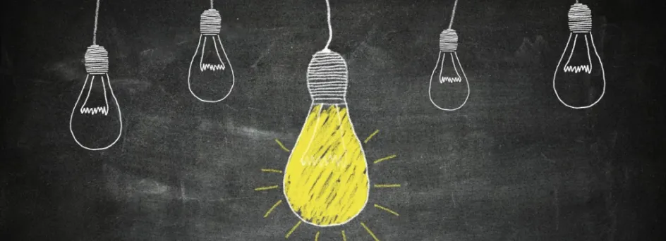
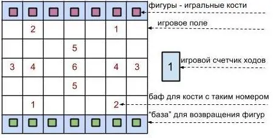
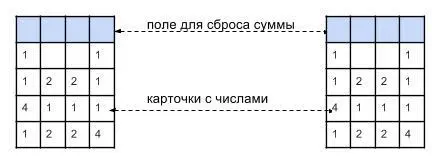
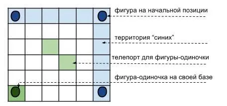

# Домашнее задание из “Уровень 11: Обзор вашего проекта”

Цель домашнего задания [11 главы «Принципов гейм-дизайна» от Яна Шрайбера](uroven-11-obzor-vashego-proekta.md) – придумать интересную идею игры, пользуясь полученным в ходе курса опытом и навыками. Ниже — результаты выполнения этого домашнего задания моими коллегами. 

Текст задания

### Генерация идей

Вспомните 4 лекцию: есть много способов находить идеи. Начните работу с основной эстетики или с базовой механики. Начните с материалов из других источников. Или с повествования. И так далее.

Сегодня набросайте несколько идей. Оглянитесь кругом. Какие вы видите системы, из которых можно было бы сделать игры? Ближайшие несколько дней берите с собой блокнот, куда бы вы ни шли, и записывайте все идеи, которые приходят в голову, пусть даже они кажутся вам глупыми.

Чем больше идей вы генерируете, тем проще становится это делать.

### Ограничения по проекту

Я мог бы предоставить вам полную свободу в работе над проектом, но чтобы вам было легче, я всё же задам несколько ограничений. Помните, ограничения – ваши союзники.

**Если до нашего курса вы никогда не создавали завершённой игры, подчинитесь следующим ограничениям.** Создайте настольную, карточную игру или игру с плитками (то есть, используйте игровое поле, карты или плитки в качестве физических компонентов). Не обязательно ограничиваться только одним из этих компонентов, можно сочетать их, добавить что-то ещё (игральные кости, фишки). Вы можете выбрать любую тему, главное, чтобы она была новой (не используйте существующую интеллектуальную собственность). Вкратце: если ваша работа нарушит чьи-то права на торговую марку или интеллектуальную собственность – не принимайтесь за неё. За вашу карьеру вам неоднократно придётся работать с чужой интеллектуальной собственностью; сейчас используйте эту возможность, чтобы поработать со _своей._

Чтобы помочь вам, я добавлю ещё два ограничения. Во-первых, **нельзя** делать викторину или любую другую игру, которая опирается на большое количество контента (такие как «_[Trivial Pursuit](http://en.wikipedia.org/wiki/Trivial_Pursuit)_», «_Pictionary_», «_Apples to Apples_» или «_Cranium_»). Это ограничение имеет своей целью оградить вас от лишней работы; к тому же, если вам нужно будет создать 250 уникальных карт с вопросами для викторины, у вас останется гораздо меньше времени на тестирование игровой механики. К этой же категории я бы отнёс и коллекционные карточные игры (такие как «_Magic: The Gathering_» или «_Pokemon TCG_»), так как создание уникальных карт тоже требует много времени.

Во-вторых, **нельзя** использовать механику «бросок кости – ход» ни в каком виде. Нельзя бросать кости и просто двигаться по полю, нельзя использовать вертушки и волчки, вытягивание карт или любой другой генератор случайных чисел, чтобы определять действия игрока на его ходу. Для такого запрета есть несколько причин. Во-первых, это избитая механика, поэтому практически невозможно создать новую игру, которая при этом не была бы клоном «_Монополии», «Змей и лестниц», «Trouble», «Sorry!»_ или другой из несметного множества подобных игр, опирающихся на данную механику как на базовую. Во-вторых, механика сама принимает ключевые решения за игрока, поэтому интересными решениями занимается не _игрок_, а _игра_. Разводя намерения игрока и результат, вы получаете на выходе игру, в которую не так уж интересно играть (как бы ни было интересно её создавать).

**Если раньше вам приходилось доводить до конца работу над игрой (одной или несколькими), но вы не считаете себя сильным профессиональным дизайнером, подчинитесь следующим ограничениям.** Выполните все ограничения, перечисленные под зелёным кружком, кроме этого добавьте одно из приведённых ниже. Свой выбор можете основывать исключительно на личных предпочтениях в сфере гейм-дизайна.

— Разработайте игру, с сильным заложенным сюжетом, который содержит в себе элемент интерактивности. Вам придётся подумать над тем, как выразить повествование через действия игрока в настольной игре и как объединить сюжет и механику. Если вы в первую очередь заинтересованы в ролевых играх или других повествовательных формах, советую выбрать это ограничение.

— Создайте чисто кооперативную настольную игру, для двух или более игроков, где все либо побеждают, либо проигрывают одной командой. Это сложно по нескольким причинам. Игра со всеми своими системами должна представлять собой противника, раз все игроки заодно и не противостоят друг другу. У большинства кооперативных игр есть общая проблема: один опытный игрок может направлять остальных (в конце концов, надо же сотрудничать), что приводит к эстетике (в понимании МДЭ), когда большинству игроков скучно, потому что им всё время говорят, что делать. Если вас интересует взаимодействие между игроками, выберите это ограничение.

— сделайте игру-противостояние для двух игроков с _асимметрией_: игроки начинают с неравным количеством ресурсов, способностей, стартуют с разных позиций и тому подобное… но в то же время, их неравенство уравновешено чем-то. Для этих игр совсем нетрудно разработать основные правила, но их очень сложно уравновесить. Если вам интересна техническая и математическая сторона гейм-дизайна, а также игровой баланс, попробуйте это ограничение.

— создайте игру по любому материалу, который изучается в старших классах. Вы можете выбрать что угодно: обширную тему или отдельный факт. Сложность здесь, конечно, заключается в том, чтобы не дать образовательной функции заслонить собой интересную игру. Если вы интересуетесь «серьёзными играми» (которые имеют не только развлекательную функцию), выберите это для  своего проекта.

**Если вы профессионально разработали много игр и считаете себя опытным специалистом, следуйте этим ограничениям.** Указанные выше ограничения вас не касаются. Вы должны создать настольную игру с механикой «бросок кости – движение по полю» в качестве основной игровой деятельности. **Но она должны быть классной.**

Эта механика истёрта до дыр. Кроме того, она отделяет игрока и его решения от действий, которые ему приходится предпринимать на поле. Поэтому крайне сложно создать игру, которая использует эту механику, и при этом нова, оригинальна и увлекательна. Но я уверен, раз вы уже имеете такой опыт в своём деле, это задание вам по плечу.

## Выполненные задания

Андрей Муренко

##### (1-й уровень сложности)

На игровом поле размером 10х10 ячеек выставлены шашечки противостоящих друг-другу игроков. Задача каждого из них, передвигая за один ход одну фишку, “съесть” фишки противника, окружая их своими фишками. Каждый игрок начинает игру с 20-ю фишками. Для окружения фишки противника, нужно окружить её с с 4 сторон установкой своих фишек на соседних клетках.Дополнительно — достигнув стартовой зоны оппонента (противоположной стороны доски) фишка игрока превращается в “дамку”, получая возможность передвигаться на неограниченное кол-во клеток по прямой.

##### (2-й уровень сложности + сеттинг)

Карточная RPG-игра в высокотехнологичном сеттинге, где карты выполняют роль устройств-экипировки с разными свойствами и эффектами. Игрок — робот трансформер, собирающий себя по частям. Основа боевой системы — камень/ножницы/бумага. Основа геймплея — кооператив и гриффинг.

##### (2-й уровень сложности + асимметрия)

Игроки используют свои личные наборные колоды для сессионного противостояния. Для победы игроки должны собрать определенный “сет” из 3 карт или “уничтожить” карты противника. На руках можно держать до 5 карт, если карт меньше — они добираются из колоды. При этом игроки в начале своего хода обязательно должны положить карту на стол (походить).

Александр Атаманчук

##### **“Гексагоновое путешествие”** (1-й уровень сложности)

Перемещая по гексам фишку (или фишки), игрокам необходимо достигнуть

противоположного края игрового поля, стараясь при этом выбить с поля фишки

противника.

##### **“Запереть демона”** (2-й уровень сложности, кооперативная игра, без “кубик-ход”)

Карточно-тайловая игра в мистическом сеттинге, с командным

прохождением генерируемых комнат (подземелий).

##### **В погоне за артефактом** (3-й уровень сложности, основная механика кубик-ход)

Перегонки между героями с миньонами по игровому полю. Ходы и соперничество

на поле определяется сочетанием броска кубиков, способностей героя и свойств

игрового поля.

Александр Мальков

##### **“Пропаганда”** (2-й уровень сложности)

Происходит конфликт 2 сторон, за которым наблюдает весь мир. Игроки — журналисты, принадлежащие к одной из сторон. Их цель — выставить свою сторону в позитивном свете и очернить противников, чтобы заслужить расположение наблюдающих стран. Игрокам предстоит всячески манипулировать информацией, лгать, расследовать ложь противников.

##### **“Аквариум”** (1-й уровень сложности)

Игроки — аквариумные рыбки, которые конкурируют за территорию. Цель каждой рыбки — заполонить аквариум себе подобными. Рыбки быстро умирают от старости, но игрок продолжает играть за потомков. Друг-друга они поедать не могут, но вот икру друг-друга — запросто.

##### **“Геймдев”** (2-й уровень сложности)

Игроки представляют из себя различные отделы девелоперской компании. Цель общая — выпустить проект в срок (ограничение по количеству задач). Есть ряд задач, которые необходимо выполнить. Игроки разбивают эти задачи на составные части и по-очереди “выполняют” их, на манер конвейера. Игрокам необходимо кооперироваться так, чтобы самим успевать, и не подставлять коллег, заставляя их переделывать свою работу.

Денис Гурбик

##### **Вирус** (2-й уровень сложности, второй пункт)

Кооперативное достижение поставленных целей в генерируемом зале, при помощи взаимодействия различных типов персонажей (разный набор способностей). У игроков будет менять вид геймплея по ходу игры (после “смерти”).

Наталья Мельничук

##### **Шестиход** (1-й уровень сложности)

Игра, в которой игроки ходят шестигранными костями, переворачивая их под счетчик. Основная задача игрока — “побить” все фигуры соперника. Основные ограничения: пока счетчик отсчитывает ходы от одного до шести и обратно, игрок должен успеть вернуть все свои фигуры на свою базу, иначе эти фигуры выйдут из игры. Дополнение: клетки с номерами на игровом поле дают какой-то одноразовый скил фигуре игрока, если количество точек на ее открытой грани совпало с номером клетки.

##### **Четверка (1-й уровень сложности)**

Игра, в которой игрок, делая ход в свою пользу на своем поле, может затем сделать ход на поле соперника не в его пользу. Основная задача игрока — собирая и убирая с поля карточки с числами, дающих в сумме четыре, освободить свое поле от карточек раньше соперника. Основное ограничение: на поле игрока соперник может перемещать любую карточку, кроме последней использованной игроком, в любое пустое место поля.

##### **Одиночка (1-й уровень сложности)**

Игра в которой, одна фигура игрока “убегает” от трех фигур соперника, стремясь занять клетку на принадлежащей им территории. Основная задача соперника — перекрыть движение фигуре-одиночке, чтобы та не заняла принадлежащую им территорию. Ограничение: на доске есть зоны телепортации, благодаря которым одиночка может спрятаться от преследователей.

Павел Славин

##### **Команда креативных клонов (2-й уровень сложности, кооператив)**

Командная игра, в которой все без исключения игроки должны за ограниченное время достичь центра круга; при этом каждый игрок имеет уникальный скилл и продвигается по отдельному сектору, где нужно выполнять характерные только для этого сектора игровые задачи. Кооперативное взаимодействие достигается  благодаря возможности тратить ход на обмен местами с другим игроком и переключение на задачи другого сектора. Количество и частота произвольных обменов ограничены.

##### **Мажор и Чика (2-й уровень сложности, асимметрия)**

Игра для двух игроков с очень разными по свойствам абилками. Один игрок — безмерно богатый и наглый мажор, второй игрок — милая провинциальная красавица-чика. Выиграет тот, кто завоюет голоса большинства граждан и станет президентом страны, достигнув Белого Дома. Страна — сетчатое игровое поле, в узлах сетки стоят граждане, с каждым гражданином Мажор и Чика могут взаимодействовать, изменяя проходимость игрового поля.

##### **Сингулярность (2-й уровень сложности, кооператив)**

Кооперативная игра, основная механика — стрельба на меткость по бомбам в условиях сферического искривления пространства. Количество игроков — 3-4. Игровое поле — неглубокая широкая круглая чаша, в центре — черная дыра. На орбите ( слабо прикреплены в разных местах на чаше) — множество бомб. Игроки передвигают свои “ космические корабли” по краю чаши и поочередно стреляют по бомбам  либо ставят ловушки для бомб. Если бомба или снаряд упал в черную дыру, все взрывается, все проиграли. Цель — уничтожить все бомбы.

Сергей Дикун

##### “Граница” (1-й уровень сложности)

Военное противостояние двух сторон при помощи игровых карточек с изображением различных боевых единиц. Игроки делятся на защитника и нападающего.  
— Механика — “камень, ножницы, бумага”.  
— Количество игроков — 2.

##### “Хозяин стихий” (1-й уровень сложности)

Карточная игра содержащая 4 вида карточек соответствующих одной из стихий. Задача каждого игрока опередив своих оппонентов собрать 4 элемента у себя на руках. Игроки по очереди обмениваясь друг с другом карточками стараются собрать все элементы раньше оппонентов. При передаче хода от одного игрока другому условия обмена карточками меняются.

##### “Орудия смерти” (1-й уровень сложности)

Карточная игра в которой игроки выступают в роли ученных разрабатывающих ОМП (оружие массового поражения). Игровая колода состоит из карт которые делятся на детали для различных видов оружия (биологическое, ядерное, химическое, климатическое и аннигиляционное) и чертежи. Игроки меняют свои ресурсы на пул из колоды пытаясь собрать наиболее эффективное оружие путем комбинирования наиболее сочетаемых элементов.