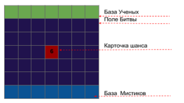
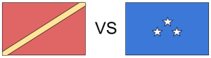
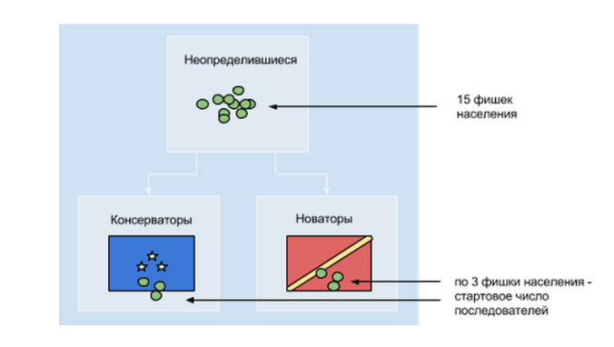
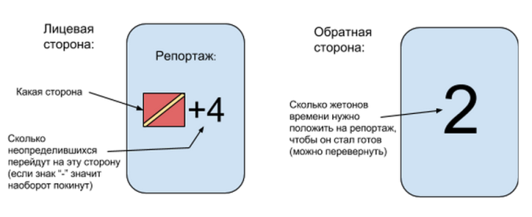
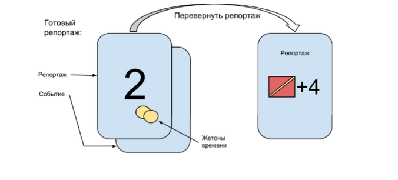
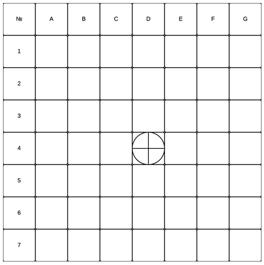

# Домашнее задание из “Уровень 15: Тестирование вслепую”

Все прошедшее с [предыдущего домашнего задания](domashnee-zadanie-iz-uroven-11-obzor-v.md) время мои коллеги работали над своими прототипами — играли и с гейм-дизанерами, и с друзьями, и с посторонними, и, наконец, провели тестирование вслепую, как того требовал [пятнадцатый уровень «Основ гейм-дизайна»](uroven-15-testirovanie-vslepuyu.md). В их игры играли посторонние люди, руководствуясь исключительно игровыми правилами, и рядом не было никого, кто мог бы подсказать\\объяснить\\поправить. Что из этого получилось? Читайте ниже. 

### «30 дней до лета» Никиты Прохорова

  

Как начать играть 

### **Что вообще делать, как начать играть**

**_Базовое игровое действие — планировать свой маршрут на день и выкладывать карточки локаций рубашками вверх. А затем вскрываться и смотреть, кто куда пошел. При столкновениях в одной локации — взаимодействовать._**

5 игроков случайным образом или намеренно распределяют роли: 1) Луи, 2) Дядюшка Джереми, 3) Ловкий Денис, 4) Полина, 5) Паша.

У каждого игрока есть одна большая карта персонажа, а также для игры используются маленькие карточки. Есть следующие наборы (все разложены по отдельным пакетикам):

*   карты маршрутов (светлые; Библитека, Ресторан, Падик и др.; выдаются всем игрокам сразу, у каждого игрока их по 9 (плюс карту Пляж каждый получает перед 26 днем)).
*   связоньки (светлые, цвет точно такой же, как у карт маршрутов; накопив, к примеру, 4 очка победы в рамсах в Библиотеке, игрок может потратить их на связоньку Библиотеки (еще есть связоньки только комп. клуба и спорт.площадки, связонек других локаций нет);
*   бутылки (оранжевые) и 0огнеметы (оранжевые)
*   айтемы (фиолетовые; колода кладется на столе рубашкой вверх; когда игрок покупает айтем, он берет верхнюю карту из колоды)
*   карты действий Паши (синие; используются только этим персонажем)
*   карты текущей мощи Полины (три простые бумажки)

*   **карты победы в рамсах (простые бумажки)**

*   карты-счетчик дней (простые бумажки с числами от 1 до 30)

Еще для игры используются шестигранники и скрепочки. Скрепочки закреплены на каждой большой карте персонажа на стартовом уровне КГ (у Полины — вверху карты персонажа вместо шкалы КГ — шкала $, стартовая позиция — 0).

После этого нужно расставить шестигранники на стартовые позиции на статах (в этих полях написано start; и в данном случае значение, которое показывает кубик, может быть любым — используется просто как фишка).

Где-нибудь в кучу посреди стола можно свалить все оставшиеся шестигранники — игроки их берут, когда ставят себе очки побед рамсов (Полина — когда ставит очки пойманных; подробнее в разделе “добавка КГ от Полины”).

### **Как совершать ход**

Есть две фазы

*   **__Перед днем_ и _2) День__**

В каждую фазу можно делать набор свой набор действий.

#### **Луи**

У персонажа есть на старте 2 бутылки против Полины (отмечены черными точечками — нужно взять 2 оранжевые карточки с бутылками и положить себе).

**_Перед днем_**

1.  Добавить себе 1$.
2.  выбрать свой маршрут — беловатые карточки (Дискотека, Ресторан, Спорт.площадка, Падик, Базарчик и т. п.)
3.  поболтать с другими игроками, предложить на обмен бутылки, огнеметы, айтемы и так далее.
4.  потратить очки победы в рамсах на карточки победы в рамсах или на связоньки, если хочет.

**_День_**

1.  Перевернуть карту первой локацию. Если игрок там оказался один — получает статы или совершает покупку. Если с кем-то — рамсы, война с Полиной и Пашей и так далее — смотреть в соответствующих Полезных разделах.

Одержав победу в рамсах, игрок ставит на соответствующую локацию кубик с 1 очком. После следующей победы — кубик переворачивается на 2 очка и так далее.

Если игрок победил в рамсах, но потом оказался пойман Полиной или проиграл Паше, очко победы в рамсах он не получает.

1.  Аналогично перевернуть карты второй и третьей локаций и дальше проделать то же самое.

Не забывать менять значение В, С, $ и КГ. Перейти к следующему раунду.

#### **Дядюшка Джереми** и **Ловкий Денис** совершают абсолютно аналогичные действия.

У Ловкого Дениса на старте есть 1 Бутылка. У Дядюшки Джереми — ничего. Но каждый раз, когда Дядюшка Джереми пришел один на Дискотеку или оказался в ней победителем — Джереми с 50% шансом получает 1$.

#### **Полина**

**_Перед днем_**

1.  выбрать свой маршрут — беловатые карточки (Дискотека, Ресторан, Спорт.площадка, Падик, Базарчик и т. п.)
2.  поболтать с другими игроками, предложить на обмен бутылки, огнеметы, айтемы и так далее.
3.  если есть 5 бутылок, можно обменять их на 15$ (бутылки уходят в отбой).
4.  потратить деньги на апгрейд мощи закармливания, если есть желание.

**_День_**

1.  Перевернуть карту первой локацию. Если совпал с каким-то игроком, который пришел в локацию один либо оказался там победителем в рамсах, то игрок считается один раз пойманным (если не использовал против Полины бутылку).

Если против Полины используется бутылка, Полина получает Прогулочку. (Стартует с 0 прогулочек, после 1 бутылки — ставит фишку на 1 прогулочку; после 2 бутылки — на 2 прогулочку и так далее. На 4 — получает 10$, на 8 прогулочке 15$).

Полина также может ходить на базарчик, в магазин и ресторан и тратить там деньги. Но имеет право тратить деньги, если не пересеклась там с другими игроками (кроме Паши, с Пашей пересекаться можно).

1.  Аналогично перевернуть карты второй и третьей локаций и дальше проделать то же самое.

#### **Паша**

**_Перед днем_**

1.  выбрать свой маршрут — беловатые карточки (Дискотека, Ресторан, Спорт.площадка, Падик, Базарчик и т. п.)
2.  Поверх карты маршрута положить карту действия — синие карточки (в начале игры у Паши их всего 3, базовые — Ниче не знаю, уборка; Вот молочко покушай; Ах же ты молокосос).
3.  потратить Очки Воли на покупку новых карт или апгрейд имеющихся, если есть желание.

**_День_**

1.  Перевернуть карту первой локацию. Если совпал с каким-то игроком, который пришел в локацию один либо оказался там победителем в рамсах, то с игроком происходит действие синей карты — конкретное действие описано на карте персонажа Паши.

Если против Паши игрок использует огнемет, Паша получает Очко Воли. (Стартует с 0 ОВ, после 1 огнемета — ставит фишку на 1 ОВ; после 2 огнемета — на 2 ОВ и так далее).

  

Правила игры

### **Чем играть**

Для подсчета очков побед в рамсах и пойманных Полиной — предлагаю использовать шестигранники. Для передвижения по полям статов, полю ОВ у Паши, полю прогулочек у Полины — тоже шестигранники.

Для определения текущего состояния КГ — закрепить наверху страницы скрепку (есть в наборе) и передвигать ее как индикатор. (Скрепка закрепляется так, что ее половинка остается позади страницы, а другая половинка, как стрелка, указывает на деление шкалы КГ).

### **Как совершать ход**

Перед началом каждого дня игроки добавляют себе по 1$. (Полина не добавляет).

Перед началом дня игроки выкладывают по три карточки локации. Затем сравнивают, кто куда пошел. В начале отдельно — 1 локация, затем отдельно — 2 локация, затем отдельно — 3 локация. Если они не пересеклись, игрок просто изменяет статы согласно локации. Либо совершает действие (покупка в магазике, на базарчике и т. п.)

Если пересеклись, происходят рамсы. И затем победитель — изменяет статы согласно локации. Либо совершает действие (покупка в магазике, на базарчике и т. п.)

Карточка локации «Пляж» становится доступной для всех игроков на 26-30 днях. Там нет рамсов, поэтому Полина или Паша выбирают самостоятельно, кого они ловят, если пересеклись сразу с несколькими игроками.

### **Как проходят рамсы**

Игрок получает очко за победу в рамсах, если он одолел кого-нить в локации. Если он пришел на ход в локу один, он просто изменяет статы — без очка победы в рамсах.

Без использования доп. айтемов рамсы проходят простым сравнением уровня силы (отмечен на картах персов одной стрелкой (средний), двумя стрелками (сильный), зачеркнутым кругом (слабый). Сильный побеждает среднего и слабого. Средний побеждает слабого.

Переломить ход рамсов можно только спец. айтемом — шлакоблоком. Слабый может использовать шлакоблок и победить так сильного. Шлакоблоком можно отбить шлакоблок. Против двух шлакоблоков надо отбиваться так же двумя шлакоблоками. И так далее.

### **— 1 ЭП**

У игрока по различным условиям может быть отнят 1 ЭП. Если отнят 1 ЭП, игрок в день идет только в 1 и 2 локации. Если отняты 2 ЭП, игрок идет только в 1 локацию. Если отняты 3 ЭП, игрок за день не изменит никаких статов (только изменятся кг, если сытость на минус кг).

Если у игрока “— 3 ЭП”, то каждый день автоматически восстанавливается 1 пункт Веселости. В итоге игрок постепенно станет с “— 2 ЭП” и сможет ходить хотя бы в 1 локацию.

### **Как юзать айтемы**

**Шлакоблок** может быть использован для изменения результата рамсов. Так же игрок перед началом дня может использовать его на себя и лишить себя 1 ЭП.

**Гематогенка** юзается перед началом дня на другого игрока или на себя.

**Бластер** юзается перед началом дня на другого игрока или на себя.

**Побрякушка** сохраняется до конца игры и плюсует игроку очки при финальном подсчете.

### **Когда сражаться с Полиной и Пашей**

Если игрок пришел в локу один и встретил там Полину или Пашу, то он начинает взаимодействие с ними (в зависимости от того, какой ход совершили Полина или Паша).

Если игроков в локе несколько — СПЕРВА выявляется победитель в рамсах. Затем победитель вступает во взаимодействие с Полиной или Пашей.

Отменить эффект Полины можно бутылкой (игрок получает за локацию то, что должен был получить, Полина как будто не приходила).

Отменить эффект Полины можно огнеметом (игрок получает за локацию то, что должен был получить, Паша как будто не приходила).

После использования бутылки и огнеметы уходят в отбой и больше не используются. Всего их по 10 штук.

### **Как кооперируются Полина и Паша**

Если Полина и Паша пришли в локу одновременно и встретили там игрока (одинокого или победителя в рамсах), то они решают, кто из них вступает во взаимодействие. Сразу с ними двумя одновременно игрок не взаимодействует, только с какой-то одной.

Поэтому им можно коопиться и перед началом дня по-тихому выбирать, кто из них куда пойдет, какую карту применит и т. д.

### **Стоимость связоньки. Как их использовать**

Связонька стоит 4 очка победы в рамсах. Забирается из конкретной локации. (Библиотека; комп. клуб; спортплощадка).

На самой карте связоньки написано, куда ее можно класть. Она того же цвета, что и карта маршрута. Используется как карта маршрута. Полина и Паша не могут поймать игрока в тот ход, когда он использует связоньку как локацию.

### **Изменение статов**

Изменение статов происходит сразу после хода.

Изменение кг — сразу после хода. Кроме

1) особых КГ от Полины — см. раздел “Добавка кг от Полины”

2) КГ, которые снимаются по стату Сытость по итогам дня (это -4, -3, -2 или -1 КГ).

### **Победа в игре**

Побеждает один из трех игроков либо фракция Полина+Паша.

Если у всех трех игроков после 30 дней меньше 15 очков у каждого, то победила фракция Полина+Паша.

Если у игрока больше 15 очков и больше, чем у других игроков, то он победил.

Источники очков — статы (макс 24; 8+8+8), айтемы (35; 5\*7), КГ (25), карты победы в рамсах.

### **Апгрейд Полины и Паши**

Когда против них применяют бутылки (против Полины) или огнеметы (против Паши), Полина зарабатывает прогулочки (1 бутылка — 1 прогулочка), которые потом обменивает на деньги, которые может потратить либо на айтемы (покупает так же, как и игрок, но только если пришла в эту локацию вообще одна или вдвоем с Пашей), либо на апгрейд до следующего уровня.

Паша за использованные против нее огнеметы зарабатывает Очки Воли (1 огнемет — 1 Очко Воли), которые может потратить на покупку новых карт или апгрейд имеющихся. Обмен ОВ на нов. карту или на апгрейд происходит перед началом дня.

### **Добавка КГ от Полины**

Полина каждый день переворачивает каунтер дней. Полина должна поймать игрока пять раз в течение 5 ходов, чтобы тому добавились килограммы (при начале каждого шестого хода этот счетчик сбрасывается; например, Полина поймала 4 раза игрока на 1-5 днях. Наступил 6 день. Счетчик обнулился, Полине снова надо ловить этого игрока все 5 раз, чтобы начислить ему кг).

Сытость от Полины добавляется игроку сразу же, как только он пойман.

Игровые компоненты

[Ссылка на лежащий на гуглодиске RAR-архив](https://drive.google.com/file/d/0B7QNX3XMVC4FdHJNaEdick9GbEk/view?usp=sharing)

  

Отчет по слепому тестированию

По окончании плейтеста ощущения были двоякие: не очень приятное (в целом плейтест провальный) совместилось с пониманием, насколько информативным и полезным для меня оказался этот игровой вечер.

Вообще это уже вторая итерация игры, в которой я поменял многое, после того как было несколько плейтестов первой итерации. Если коротко, я добавил еще одного персонажа (всего их 5, играют 5 человек), добавил локации (места, куда игроки “ходят”, и если их локации совпали, происходят разные взаимодействия), добавил новому и старым персонажам новые функции.

Добавил слишком много всего, все это я-то держу в голове, конечно. И если бы сели играть 5 меня, то мы поиграли бы как-нибудь. Но люди, которые ничего не знают о моей игре, взять и играть в нее не смогли. Слепое тестирование не удалось. Я разложил на столе все компоненты, карточки, отдал одному из игроков правила.

Но никто не мог понять, как начать игру.

Если бы я не помог, тестирование на этом бы и закончилось. Однако даже после того, как правила были объяснены устно, как несколько ходов были сделаны под моим контролем, было понятно, что ребята не хотят в это играть.

Своей игрой я пытался заставить людей следить сразу за несколькими индикаторами; совершать выбор, опираясь на большое количество вариантов, при этом они не особо понимают отличие вариантов друг от друга; у меня получились слишком замученные и сложные правила, с кучей нюансов. И честно говоря, я не верю, что люди будут в это играть вот так вот просто, собравшись, желая повеселиться. Может быть, может быть, если одна и та же компания соберется именно за этой итерацией раз 5, отлично усвоит правила и так далее, может быть, тогда эта компания сможет получить цельное удовольствие от игровой сессии. Но это слишком требовательное условие.

Что касается полезности плейтеста — я смог понаблюдать и зафиксировать, в какие именно моменты, совершая какие именно действия, ребята получали удовольствие. По большей части — это моменты простых и понятных взаимодействий, когда простые решения приводят к простому взаимодействию с понятным исходом. Механики, позволяющие добиться этого, в моей игре (даже в нынешней ее итерации) — есть. Но они спрятаны глубоко под слоем сложных индикаторов, статов, айтемов, локаций — и до веселья добраться сложновато.

Следующую итерацию я вижу совершенно другой и сильно надеюсь, что на следующий плейтест мне удастся принести простую и приятную игру. Именно такой я сейчас ее и перепиливаю.

  

### «Поле битвы» Натальи Мельничук

  

Правила

**Ученые** и **Мистики** — вам не ужиться в этом мире. Перед вами — Поле Битвы. Именно оно определит, достанется ли победа **одному из вас** или же не достанется **никому**.

Поединок продлится всего **семь дней и ночей**. Семь дней войны и семь ночей страха — ведь именно **ночью** беспощадно **уничтожаются все**, **кто остался на Поле Битвы**. Каждую ночь **часть поля разрушается**, оставляя все меньше пространства для маневров и делая борьбу еще более напряженной.

Используйте свои **достижения** для того, чтобы добиться победы, не упускайте **шансов** навредить сопернику и помните о **случайностях**.

**Игроки:**

2 (один против другого и против системы).

**Оборудование:**

*   Игровое поле — разделено на три части: Поле Битвы (фиолетовое), База Ученых (зеленая), База Мистиков (синяя).

*   Шестигранные кубики — по 7 штук двух цветов (зеленые для Ученых, синие для Мистиков). Перед началом игры кубики расставляются на свои базы.
*   Двенадцатигранный кубик — счетчик ходов (раунд состоит из 12 ходов).
*   Карточки:
    *   карточки шансов — 10 карточек красного цвета, (по две карточки с числами от одного до пяти). Карточки шансов делятся между игроками поровну и расставляются ими на поле битвы перед каждым новым раундом игры.
    *   карточки достижений — по четыре зеленые и синие карточки (для ученых, и для мистиков). Вытягиваются случайным образом перед началом игры.
    *   карточки случайностей — 12 карточек белого цвета. Игрок тянет карточку случайности всякий раз, когда кубик соперника заходит на его базу.

**Перед началом игры:**

1.  Игроки броском кубика определяют, кто из них принадлежит лагерю Мистиков, а кто — Ученых и кто будет ходить первым (право первого хода меняется в каждом раунде).
2.  Игроки тянут по одной карточке достижений из своей колоды (соответствующего цвета), не показывая ее сопернику.
3.  Игроки расставляют свои кубики на Базы соответствующего цвета — по одному в клетку, вверх гранью с шестью точками.
4.  Каждый игрок берет себе пять карточек шансов (от 1-го до 5-ти).

**Цель игры:  
**Уничтожить или способствовать уничтожению всех боевых фигур соперника и оставить в безопасной зоне хотя бы одну свою фигуру.

**Ход игры**

Игра состоит не более чем из семи раундов.

Каждый раунд состоит из подготовки (**ночь**) и битвы (**день**).

**Ночь:**

1.  С Поля Битвы удаляются все фигуры (кроме тех, что располагаются — на карточках шансов с числом 4). Остаются только кубики на Базах.
2.  Каждую ночь, кроме первой, разрушается (перестает использоваться) одна полоска поля — поочередно слева направо. Кубики, располагавшиеся на этой полосе, выходят из игры.
3.  Игроки расставляют свои карточки шансов — не более двух на одну клетку.

**День:**

1.  Счетчик ходов (двенадцатигранный кубик) отсчитывает первый час дня (кубик поворачивается так, чтобы верхняя грань была на единице).
2.  Совершает ход первый игрок, затем второй, после чего счетчик отсчитывает второй час (кубик переворачивается двойкой вверх) и процесс повторяется до того момента, пока кубик не станет на 12 и игроки не сделают последний ход — это значит, что день окончен, началась ночь и вместе с ней следующий раунд.

Все ходы и сопровождающие ходы события происходят по определенным правилам, которые приведены ниже.

**Правила:**

*   Ккубики не могут перемещаться внутри по клеткам базы, но могут выходить за ее пределы и входить в любом удобном игроку месте, если клетка не занята.
*   Перемещаться по полю битвы можно в любом направлении (горизонталь, вертикаль, диагональ), но только на одну клетку.
*   Каждый ход кубик, совершающий ход, переворачивается на следующую по счету грань (с одной точки на две, с двух на три и т.д.)
*   Каждый новый раунд кубик начинает с того числа ьточек на его грани, на которой остановился.
*   Фигуры игроков могут бить фигуры соперников, находящихся в соседней клетке, только по прямой — не по диагонали.
*   Карточки шансов, расставленные на поле, ограниченно меняют вышеописанные правила в случае, если число на грани кубика, вставшего на карту, совпадает с числом на карточке шансов.
*   Карточку шанса можно использовать сразу, как на нее встал кубик (т.е. не нужно ждать своего следующего хода).
*   Числа карточек шансов имеют следующие значения:
    *   1 — позволяет один раз уменьшить или увеличить на единицу число на верхней грани любого кубика на игровом поле;
    *   2 — позволяет один раз пойти/побить прямо через одну или две клетки;
    *   3 — позволяет один раз пойти/побить по диагонали на одну или две клетки;
    *   4 — зона безопасности, позволяет остаться на поле битвы ночью без риска удаления фигуры;
    *   5 — позволяет один раз пойти/побить буквой Г.
    *   6  — (всегда стоит в центре) позволяет переместиться по диагонали в любую угловую клетку базы, вытеснив оттуда по диагонали к центру кубик, если он там стоял.
*   Фигуры игрока могут заходить на базу соперника.
*   Игрок берет карточку случайности всякий раз, когда на территорию его базы заходит фигура  соперника, использовать эту карточку он может один раз в любой момент текущего раунда.
*   Игрок может использовать (или не использовать) карточку достижения — выполнив описанные в ней условия, игрок получит игровой бонус.
*   Игрок должен предъявить сопернику карточку достижения только в момент ее использования для получения бонуса.
*   Все фигуры, оставшиеся на ночь на Поле Битвы будут уничтожены (кроме тех, что остались в зонах безопасности  — на карточке шанса с числом 4).

  

Отчет по слепому тестированию

По результатам тестирования выявлены следующие недостатки:

1.  Слишком длинные правила, детали которых быстро забываются.
2.  Неэффективно каждому раздавать правила — нужно разработать краткие памятки.
3.  Не использовались карты достижений. Так как игра проходит достаточно динамично, особенно в начале, игроки просто не успевают выполнить поставленные в карточке условия. Нужно либо упростить условия, либо создать такие, которые было бы возможно реализовывать, переходя из раунда в раунд.
4.  Для наглядности и упрощения восприятия нужно схематично обозначить действия карточек шансов прямо на карточках.
5.  Не разобрались какая часть поля и когда исчезает, поэтому не использовали это правило вообще, из-за чего игра прошла на контрасте — сначала очень динамично, а потом три кубика ходили по всему полю оставшиеся четыре раунда и игра перестала быть интересной.
6.  Не разобрались в каких случаях можно бить через одну клетку, а в каких через две (т.е. как использовать карточки шансов с числами 2 и 3).
7.  Карточки шансов на 4 оставили стоять на поле неизменно для всех раундов.

  

### «За золотом наперегонки» Татьяны Шкуро

  

Правила игры

### Идея игры:

Игра для 2-4 игроков, каждый из которых станет представителем одного из народов, населяющих приморские земли. Задача — первым добраться на корабле до острова с сокровищами, всплывающего из морской пучины раз в 50 лет.

Добраться до острова мореплавателям будут мешать различные препятствия (карточки событий) и оппоненты, и только опытные капитаны, от решений которых зависит экспедиция, смогут с достоинством их преодолеть.

### Игра состоит из:

*   карт событий (40 штук, поле — 4х10 карт)
*   специальных карт, которые выдаются каждому игроку в начале игры (3 шт. на каждого)
*   игровых фишек

### Описание и правила игры:

Игровое поле полностью состоит из карточек событий. Игроки могут ходить вперед или назад, вправо или влево (НЕ по диагонали).

Игроки стартуют из одного места, становясь на любую карточку из первой линии. Очередность определяется при помощи кубиков-шестигранников (либо же в этом вам поможет “камень-ножницы-бумага”).

Каждый игрок совершает один ход, становясь на карточку событий. Он может сыграть это событие, а может оставить карту у себя, если событие ему невыгодно или если он хочет оставить хорошее событие на потом. При этом на руках у каждого игрока не может быть более 3-х карт событий одновременно.

Игроки могут озвучивать вслух только события, которые собираются сыграть. Остальное нужно держать в тайне — соперники не должны знать, какие карты у вас на руках — то ли это плохие карты, то ли, наоборот, вы собираете хорошие, чтобы воспользоваться правом сыграть три карты подряд.

Сыграв карту событий, игрок передвигается на нужное количество ходов, но не берет карту событий, оказавшуюся под ним. Ждет следующего хода, делает шаг вперед и уже тогда играет событие, выпавшее на этом ходу. _Таким образом каждый игрок может делать не более двух ходов за раз (ход и ход по карте событий)._

Сыгранные карты уходят в отбой.

Если игрок не играет карту событий, он остается на месте до следующего хода.

Если у игрока на руках уже есть три карты и он берет четвертую, он обязан ее сыграть, либо другую из тех, что у него есть на руках.

Если, делая ход, игрок попадает на пустую клетку (кто-то уже забрал карту событий), он берет карту из колоды.

Один раз за игру игрок может сыграть сразу три оказавшихся на руках карты (например, если он специально собирает выгодные карты, чтобы значительно вырваться вперед).

Если вам выпала карта “Сбросьте все карты в колоду”, но у вас пока нет карт, оставьте ее себе.

Игрок имеет право поменять карту, находящуюся на руках, на карту из колоды, но при этом он теряет ход.

Игроки могут мешать друг другу, используя специальные карты, которые им _выдаются в начале игры (3 штуки)_. Это:

*   карта “Отдать любую карту сопернику на выбор” (при следующем своем ходе соперник, которому отдана карта, обязан ее сыграть, пропустив нужное количество ходов или передвинувшись на нужное количество клеток/миль. Событие, на которое он становится, не вскрывается — то есть карточка не берется);
*   карта “Подать сигнал бедствия” (отдается любому сопернику, вырвавшемуся вперед — он обязан отступить 2 шага назад в вашу сторону);
*   карта “Поменяться всеми картами с любым соперником” (например, если игрок подозревает, что его соперник собирает только хорошие события, или карты у него на руках настолько плохи, что он рискует забрать карты соперника)

Этими тремя картами можно воспользоваться один раз за игру — сыгранные уходят в отбой.

Побеждает тот, кто первый достигает острова сокровищ (это может быть специальная условная карточка либо любой, например, сладкий приз).  
P.S. Данные правила уже переработаны с учетом **пожеланий участников** слепого тестирования.

  

Отчет по слепому тестированию

*   указать, что игроки могут озвучивать вслух только события, которые собираются сыграть. Остальное нужно держать в тайне — соперники не должны знать, какие карты у вас на руках — то ли это плохие карты, то ли, наоборот, вы собираете хорошие, чтобы воспользоваться правом сыграть три карты подряд.
*   указать, что сыгранные карты уходят в отбой
*   указать лимит ходов, которые игрок может совершить за свой ход и последующие события
*   сократить количество карт, которые могут накоплены игроком, с 4-х до 3-х
*   добавить больше взаимодействия между игроками, чтобы они могли устраивать друг другу “подлянки”. Ввести дополнительные карты, которые будут выдаваться игроку в начале игры, чтобы они однократно могли ими воспользоваться за игру.

  

### «Пропаганда» Александра Малькова

  

Правила игры

### Предыстория

В стране происходит конфликт между Новаторами и Консерваторами. Игроки — журналисты, принадлежащие к одной из этих сторон. Их задача — выставить свою сторону в хорошем свете и очернять противников. Всё, чтобы перетянуть на свою сторону как можно больше последователей.

### Правила

#### **Общее описание**

**Задача** — перетянуть на свою сторону больше неопределившихся, чем команда противника. Игроки ходят по-очереди по часовой стрелке.

**Чтобы победить, надо:**

*   делать репортажи — чтобы увеличить число своих последователей или уменьшить число последователей противника.
*   мешать противникам делать репортажи — проводить расследования.
*   понять кто с тобой в команде — изначально игроки не знают кто за какую сторону выступает. Как это сделать? В ходе игры вы сам догадаетесь! 🙂

**Перед началом игры:**

Определение кто за какую сторону играет — для этого игроки тянут вслепую карточки ролей. Важно — никому не говорить за какую стороны вы играете.

Каждый берет по 2 карты из колоды и по 3 фишки времени.

Подготовка поля: перемешать колоду; положить на стол карточку баланса сил и положить на неё фишки населения как показано на картинке:

**Игра завершается** — когда на карточке баланса сил не остается неопределившихся (в этом разделе закончатся фишки населения). Побеждает сторона, набравшая больше последователей (фишек населения).

### **Ход игрока**

Каждый игрок должен сделать следующие действия в такой же последовательности:

1.  Открытие готовых репортажей — если у игрока есть готовые репортажи — они открываются (см. Открытие готовых репортажей).
2.  Затем игрок берет 2 карты и 1 фишку времени. После этого он может выполнять сколько угодно любых действий (делать новые репортажи, разоблачения, сбрасывать ненужные карты и т.п). _\*Когда карты в колоде заканчиваются — перемешивается отбой и используется как колода; количество жетонов времени — безгранично._
3.  Передача хода следующему игроку. Если в конце хода у игрока более 5 карт на руках — он сбрасывает все лишние.

### Действия игрока

#### **Создание репортажей**

Создание репортажей — основной путь к победе. Для этого есть карточки репортажей — на её лицевой стороне написано сколько неопределившихся примкнет/покинет ту или иную сторону когда репортаж будет готов:

Но репортаж не может быть написан на пустом месте — должно произойти какое-то событие. Так что чтобы начать готовить репортаж надо положить на стол карточку события, а сверху карточку репортажа (обе лицом вниз).

Итак репортаж готовится. Чтобы подготовить его к выпуску (и получить пользу) надо чтобы чтобы на нем лежало столько жетонов времени, сколько написано на обратной стороне. Любой игрок в свой ход может класть жетоны времени на любые готовящиеся репортажи в игре, таки образом готовя свои и помогая товарищам. _\*Не более 1 жетона на репортаж в ход._

#### **Открытие готовых репортажей**

Когда репортаж готов (число жетонов времени на нем = цифре на рубашке) — в начале хода своего хозяина он раскрывается: переворачивается карточка репортажа и выполняется действие, описанное на ней.

После раскрытия репортажа — репортаж, событие и жетоны времени идут в отбой. _\*Карточка события не переворачивается — никто не должен знать что там было._

#### **Утечка информации**

Специальная карта “Утечка” позволяет игроку посмотреть один из готовящихся репортажей (только репортаж, не событие) — что там готовит ваш оппонент? После применения — карта “Утечка” идет в отбой.

#### **Разоблачение**

Разоблачение — это репортаж о репортаже другого журналиста. Отличная возможность раскрыть его мотивы перед общественностью, и тем самым помешать.

Для чтобы сделать это — надо сыграть карточку разоблачения и заплатить 3 очка времени: перевернуть карточки репортажа и события выбранного готовящегося репортажа. В зависимости от того, какая карточка события — происходит следующее действие:

*   ##### **“Ложь о событии”:**
    

— происходит действие, описанное в репортаже, но с другой стороной (если в репортаже было “Консерваторы + х последователей”, то произойдет “Новаторы + х последователей”), причем с количеством последователей = числу жетонов времени \*2 (на репортаже);

— владелец репортажа берет число карт  = числу жетонов времени (на репортаже).

*   ##### **“Правда о событии”:**
    

— владелец репортажа берет число жетонов времени  = числу жетонов времени (на репортаже);

— владелец репортажа берет число карт  = числу жетонов времени (на репортаже);

— количество последователей остается неизменным (действие в репортаже не работает);

*   ##### **“Подсадная утка”:**
    

— всё равно происходит действие, описанное в репортаже, но с количеством последователей = числу жетонов времени \*2 (на репортаже). _\*”Подсадная утка” — это журналист знает что его будут разоблачать и готовит такой материал, чтобы при разоблачении выставить разоблачителей перед общественностью дураками и всё равно перетянуть на свою сторону часть неопределившихся._

После любого разоблачения все карточки (репортаж, событие, разоблачение) и жетоны времени идут в отбой.

#### **Сброс ненужной карты**

Если у игрока на руках есть ненужная карта — он может её скинуть в отбой. За каждую сброшенную таким образом карту он получает 1 жетон времени.

  

Отчет по слепому тестированию

*   Комментарии по самим правилам:
    *   в правилах слишком поздно описываются события — надо бы хотя бы намекнуть о их существовании раньше;
    *   хорошо бы где-то в начале правил дать краткий список всех карт и краткое описание;
    *   недостаточно подробно описан выбор действий игрока в своем ходу (возникают мелкие вопросы);
    *   в содержании не указаны номера пунктов и страницы;
    *   недостаточно подробно объяснено кто имеет доступ к информации при расследовании (может ли игрок только сам посмотреть?);
    *   “Правда о событии” — не написано что происходит с последователями;
    *   “Подсадная утка” — непонятно что эта карта делает по легенде игры. Добавить пример использования;
    *   нигде не написано что общий банк жетонов времени бесконечный.
*   Игра статична, недостаточно интриги. Предложение — каждый ход неожиданные события.
*   У игроков нету особой необходимости кооперироваться, искать друг-друга. Надо как-то мотивировать людей общаться.
*   Расследования дают что-то полезное только в 1 случае из 3, что делает их мало эффективными.
*   Игра не увлекает.
*   Дисбаланс карточек.
*   Игра во многом зависит от того, какие карты тебе придут.
*   Плохой сеттинг — явные отсылки к текущей ситуации, “попытка заработать на горячих событиях и горе людей”.

  

### «Вирус» Дениса Гурбика

  

Правила игры

Количество игроков: 4+

Кооперативное достижение целей — игроки совместными усилиями должны достичь поставленной цели, а игра им должна всячески препятствовать.

**Важно!** Игра “на честность”.

### Игровые частицы

*   Игровое поле
*   Шестигранные кубик (x2)
*   Cтакан (для скрытия броска кубиков)
*   Фишки персонажей
*   Карточки персонажей
*   Игровые токены
*   Колода комнат

### Подготовка к игре

#### **Игровое поле**

Сетка с из квадратов на которой все строки и столбцы имеют свои обозначения. В каждой клетке расположена одна из комнат (4 ее копии) (**см. колода комнат**). Ячейки поля заполняются случайным образом.

**Заполнение ячеек поля (всего 49)**

*   Место старта x1
*   Выход х3
*   Разворот х5
*   Коридор с двумя монстрами х11
*   Коридор с одним монстром х11
*   Комната с двумя монстрами х11
*   Комната х7

#### **Игровые токены и кубики**

Каждый игрок получает фишку персонажа и набор токенов говорящих о действиях которые они совершают. Так же каждый игрок получает по 2-а кубика и стакан (для бросков в закрытую).

#### **Выбор персонажа**

Персонаж определяется случайным образом из списка ниже:

| **Прозвище** | **Количество здоровья** | **Особенность** |
| --- | --- | --- |
| Здоровяк | 6 ХП | При сражении с монстром 1 на 1 не теряет ХП. В групповых схватках данный бонус не учитывается.При сражении с большим монстров 1 на 1 теряет 2 ХП. |
| Шустрило | 3 ХП | Может перемещаться на одно поле дальше при совершении движенияИмеет дополнительное действие перемещения |
| Ворюга | 4 ХП | 1 раз за ход может провести обыск или поиск медикаментов не тратя очков действия |
| Грузчик | 4 ХП | Может нести сразу два пака припасовПри побеге не теряет паки припасов. |
| Доктор | 3 ХП | Способен Восстанавливает игрока из нокаута не тратя медикаменты.Излечивает игрока монстра за 1 медикамент.Изначально имеет 3 медикамента.Применяя медикамент бросает кубик, на 5+ не расходует медикамент. |

#### Примечание

_Если доктор не выпал никому, случайным образом выберите одного из игроков, после чего он сможет заменить своего персонажа на доктора, если захочет._ **_Играть без доктора намного сложнее._**

**Ход игры**
------------

### **Место старта**

Все игроки начинают в центре локации (ячейка D4).

### **Порядок хода**

Игроки ходят одновременно.

### **Фазы хода**

### **Совершение действий**

Как только игра началась, все игроки выбирают одно из доступных им действий (**см. действия персонажей**) и записывают его на листе бумаги, после чего совершают его.

#### Порядок действий

1.  Сначала игроки совершающие перемещение показывают на листике ячейку в которую они перемещаются, после чего перемещают туда фишку своего персонажа.
2.  Затем игроки которые находятся в одной и той же комнате показывают друг другу действия которые они совершают.
3.  После совершения действий игроки попавшие в новые ячейки берут из них карточки комнат, после чего все игроки заполняют поля (такие как: лут, раны, медикаменты и др.) на своих карточках, если были совершены соответствующие действия.

**_Важно_**_: Другие игроки не знают о комнатах открытых другими игроками, о том что находится в тех комнатах, в каком состоянии находится другие игроки и каким набором лута они обладают. Для получения данной информации нужно либо встретится и обленятся информацией (см._ **_действия персонажей_**_) либо совершать звонки по рации (подробнее ниже)._

#### Примечания

*   __Игроки которые не перемещаются и не находятся в комнате с другими игроками — не показывают свои действия другим игрокам.__

*   _Если игрок не покидает комнату в течении двух ходов (заканчивает 2-ой ход в одной и той же комнате), он кидает кубики на появление монстра._

*   _При побеге от монстров игрок должен спрашивать нет ли у кого комнаты в которую перемещаются монстры, если у игроков есть такие комнаты он показывает сколько монстров переместилось туда._

*   _Если игрок не записывает в какой клетке он потерял припасы — они считаются утраченными._

*   _Для совершения действий игроки могут использовать токены с описанием действий._

#### **Появление монстра**

Когда игрок заходит в ячейку в которой уже побывал другой игрок (даже если это был он сам), он обязан кидать кубик на появление монстра. При выпадении 1 или 2 хотя бы на 1 кубике — появляется монстр; если 1 и 2 выпали вместе, или выпал дубль одного из этих значений — появляется 2 монстра.

#### Примечания

*   __Если в комнату одновременно зашли два персонажа, оба кидают на появление монстра.__

*   _Если 3-й и/или 4-й игрок входит в комнату в которой уже находится 2-а игрока — Кубики на появление монстров не бросаются. Вместо этого количество монстров в комнате становится равно количеству игроков (если их было меньше), если монстров было больше туда добавляется еще один монстр за каждого вошедшего игрока._

#### **Звонок по рации**

**_Важно_**_: Данная фаза не является обязательной!_

Поделится полученной информацией с другим игроком или всеми игроками сразу. Игрок может сообщить только об одной из комнат в которых он уже побывал, или только об одном персонаже, о себе или любом другом которого он встречал. Данное действие можно совершить 6 раз, после каждого звонка нужно бросить кубики на появление монстра (**см. появление монстра**).

Игрок получивший новые берет карту комнаты (если нужно) и сразу отмечает у себя на карточках полученную информацию

#### Примечание

_Игрок может сразу поделится инфой с требуемым количеством игроков после чего бросить кубики требуемое количество раз._

### Цель игры

Отыскать 10 ящиков с припасами и отнести их к любым выходам, затем собраться всей командой у одного выхода.

#### Примечание

_Как только последний игрок наступает на клетку с выходом, игра заканчивается, при условии что собрано 10 ящиков с припасами и нет игрока-монстра._

### Пояснения

#### **Колода комнат**

*   **Место старта** — здесь нельзя искать припасы или медикаменты.
*   **Разворот —** откидывает игрока на предыдущую клетку. Если за игроком гнались монстры и он при отступлении вынужден вернутся в ячейку в которую переместились монстры — он попадает в нокаут.
*   **Коридор с двумя монстрами**— в этом коридоре находится 2-а монстра, так же здесь можно искать медикаменты.

*   **Коридор с одним монстром— в этом коридоре находится 1 монстр, так же здесь можно искать медикаменты.**

*   **Комната с 2-я монстрами** — в этой комнате находится 2-а монстра, так же здесь можно искать припасы или медикаменты.

*   **Комната** — здесь можно искать припасы или медикаменты.

*   **Выход** — сюда нужно сносить припасы.

#### **Действия персонажей**

Каждый персонаж может выполнить одно из предоставленных ему действий за один ход (если нет исключений).

*   **Перемещение** — переместить персонажа на 1-2 квадрата в любом направлении (нельзя перемещаться по диагонали).
*   **Сбежать** — в отличии от передвижения игрок должен переместится на две клетки, и если у него был лут — он должен сбросить его в ячейку из которой совершает побег.
*   **Лечение** — восстановить 1 ХП (себе или другому игроку) или поднять игрока из нокаута. Тратит 1 медикамент. Нужно находится в одной и той же комнате.
*   **Сразится** — вступить в поединок с монстром или игроком-монстром. Последствия см. в **сражение и преследования**.
*   **Восстановится от нокаута** — игрок бросает кубик, при выпадении 3+ игрок успешно восстанавливается от действия нокаута, если выпало меньше —  игрок сможет попробовать вновь в следующем ходу.
*   **Поиск припасов** — игрок бросает кубики, при выпадении 4+ хотя бы на одном из кубиков — игрок успешно находит припасы, при выпадении меньшего значения —  ничего не происходит.
    *   На дублях единиц или двоек — появляется монстр.
    *   Искать припасы можно только в комнатах.
*   **Нападение** — сразится с другим игроком или монстром. **_Примечание_**: _Доступно только монстру. Монстр обязан выбрать это действие если находится с другим игроком в одной комнате (если у него есть на это очки действия). При сражении 1 на 1 — монстр всегда побеждает. 1 на 1 с другим монстром — автоматически получает победу._
*   **Подбор** — персонаж автоматически подбирает найденный груз, если хочет. При одновременном входе нескольких игроков в комнату с грузом, игроки сами решают кто заберет груз.
*   **Поиск медикаментов** — игрок бросает кубики, при выпадении 5+ хотя бы на одном из кубиков — игрок успешно находит медикаменты.
    *   На дублях единиц или двоек — появляется монстр.
    *   Можно совершить в любой локации кроме стартовой и выхода.
*   **Обмен** — встретившись два игрока могут обменяться информацией (по 1 инфе за раз) или медикаментами (1 медикамент за раз). Достаточно что бы это действие выполнил хотя бы один игрок в комнате, тогда все игроки находящиеся в той же комнате могут выдать каждому из присутствующих в комнате игрокв по одной информации.
*   **Увести монстра** — доступно только игроку-монстру, взять одного монстра и увести его в другую комнату.

#### Примечание

_При бросках кубиков на появление монстров, поиск лута, поиск медикаментов — выпадение дублей (кроме единиц и двоек) дает одно дополнительное действие. После окончания хода игрок может совершить дополнительный ход в приоритете над всеми._

### **Сражение и преследование**

Когда игрок впервые натыкается на монстров (находит их в комнате), они не сразу на него нападают, а только на следующий ход.

При сражении с монстром 1 на 1 игрок теряет 1 ХП (если нет исключений).

Если монстров двое или больше, игрок не сможет победить их в одиночку (выбор сражения в данном случае — приведет к нокауту). Но при сражении 1 против 2-х или более монстров, игрок может бросить кубики — выпадение дублей (кроме единиц и двоек) дает игроку возможность избежать участи, монстры ничего не сделали игроку и игрок ожидает своего следующего хода, но если выпали дубли единиц или двоек, или двойка и единица — игрок сразу становится игроком-монстром).

Если игрок бежит от монстров — они будут преследовать игрока, переместятся в первый квадрат через который пробежал игрок.

Если предпринять любые действия кроме сразится или убежать — игрок попадает в нокаут.

При сражении с игроком-монстром, если людей два или больше монстр не наносит урона людям и теряет ХП равное количеству нападающих людей, после чего отбегает в соседнюю комнату.

Игрок-монстр всегда побеждает игрока человека 1 на 1 (если нет исключений).

### **Монстры**

Если игрок был однажды повержен монстрами и попал в состояния нокаут, каждый последующий ход псоле освобождения от нокаута — он должен делать бросок на превращение в монстра по тем же правилам что и появление монстра (только числа призывающие монстра превращают игрока в игрока-монстра).

После того как игрок становится монстром, у него начинает каждый ход теряться по 1 ХП, а его максимальное количество ХП становится равно 5-и. Так же он не может общаться по рации, проводить обыски и поиски медикаментов, лечить, восстанавливать от нокаута, производить подбор лута и устраивать обмен, но ходит он может перемещаться на 1 квадрат дальше. Игрок-монстр по прежнему может открывать новые комнаты, и получает данные от других игроков по поводу комнат в которых они побывали.

Что бы восстановить ХП, нужно нападать на других игроков (людей), стычка (нахождение в одной комнате) приводит к восполнению 1 ХП монстра и потере 1 ХП человека, после чего человек попадает в нокаут. Игрок-монстр может продолжить находится в комнате с поверженным игроком но он не получит хп пока тот не восстановится от нокаута. Игрок монстр так же делает бросок на появление монстра если находится в одной комнате 2-а хода.

Что бы излечить игрока-монстра нужно довести его до 2-х или менее ХП и применить на него медикаменты (обычный персонаж должен применить 2-а, доктор лишь 1).

Игрока монстра нельзя вылечить сразу, нужно что бы он перешел во вторую стадию.

Вторая стадия монстра наступает когда он получает 5 побед (достигаются путем получения ХП с других игроков или когда он выгоняет других монстров с поля).

Если игрок-монстр теряет свое последнее ХП, он умирает не сразу, на каждый свой последующий ход, он кидает кубик -при выпадении 2+ он продолжает игру не теряя последнее ХП. С каждым последующим ходом надо выкидывать большее значение, это значения не обновляются если монстр восстановит ХП.

### Примечания

*   Когда число монстров в комнате становится равным 3-м и туда попадает еще 1 монстр (кроме игрока-монстра), там появляется огромный монстр и убивает всех остальных монстров. Огромного монстра может победить только здоровяк, либо пати из 3-х и более персонажей. Если в одной комнате два и более больших монстра их только можно уводить в разворот (или еще не разведанную ячейку) или отводить игроку монстру.
*   Заведя монстров в разворот — они исчезнут. Так же если завести монстров в еще не расследованную комнату — они исчезнут.
*   Если игрок монстр находится 1 на 1 с другим игроком в комнате они бросают кубик, у кого число больше — тот действует первым, но если игроков больше они действуют первыми.
*   Если игроку монстру позвонят по рации, то игрок позвонивший сразу узнает что тот кому он звонит монстр.
*   В групповом сражении с монстрами игрок-монстр считается обычным монстром.
*   Если два игрока монстра зайдут в одну комнату — они оба потеряют по 1 хп и разбегутся в ближайшие комнаты (на выбор игроков).
*   Если из одной и той же комнаты убегают два игрока, монстры погонятся за тем который выкинет на кубиках меньшее значение.

  

Отчет по слепому тестированию

Что было не понятно:

*   Как раскладывать карточки комнат в ячейки
*   Сколько каждой из комнат должно быть на поле
*   Что один игрок не может победить двух монстров
*   В какой последовательности производить действия
*   Что монстры нападают не сразу, а только на следующий ход
*   Нюансы кто действует первым в разных ситуациях
*   Как оглашать свои действия
*   Что три монстра превращаются в большого монстра, только когда число монстров в комнате становится больше трех

  

Игровые компоненты

[Ссылка на RAR-архив в гуглодоке](https://drive.google.com/file/d/0B7QNX3XMVC4FVHJsbHoza2g1TEU/view?usp=sharing)

  

### «Печать Харона» Александра Атаманчука

  

Правила игры

**Краткая концепция игры**
--------------------------

Игроки оказываются в замкнутом комплексе, состоящем из множества комнат, и им необходимо оттуда выбраться. При этом на них нападают монстры, которые реагируют на шум, с ними необходимо сражаться, применяя для этого разнообразные предметы, которые будут находится по ходу игры.

Игроков: от 2 до 6

**Персонажи**
-------------

Каждый игрок управляет своим персонажем, который имеет ряд характеристику и свойств.

Перед партией каждый генерирует себе персонажа, обладающего определенным набором характеристик:

Базовые характеристики — стартовый набор характеристик, которые имеют все

персонажи:

*   Очки действия — 3ОД (количество действия, которые игрок может совершить в свой ход). _Примечание: Все тратить не обязательно_.
*   Количество жизней — 20ХП (во время боя с монстром, если последний наносит удар по персонажу, то отнимается соответственное его способностям количество жизней.
*   Стойкость —  8СТ (параметр, применяемый во время боя с мобом (см. раздел Бой))
*   Сила атаки — 2А (параметр, применяемый во время боя с мобом —  (см. раздел Бой))
*   Урон — 2У (параметр, применяемый во время боя с мобом —  (см. раздел Бой))

Дополнительные характеристики — каждый игрок определяет индивидуальные

особенности своего персонажа, вытягивая по одной карточке из двух колод

дополнительных характеристик (\*сейчас см. таблицу особенностей и

таблицу способностей):

*   Особенности — значения, которые прибавляются/отнимаются к базовым характеристикам персонажа (см. таблицу особенностей)
    *   Положительные
    *   Отрицательные

*   Способности — дополнительные качества персонажей (см. таблицу способностей)
    *   Положительные:
    *   Отрицательные

**Игровое поле, перемещение и комнаты**
---------------------------------------

Игровое поле эмитирует комплекс из множества комнат, по которым передвигаются персонажи.

### **Комнаты и обстановка**

Комнаты представляют помещения, которые игроки могут исследовать и где происходят все игровые события. Комнаты разделяются на:

*   темные или освещенные (это накладывает дополнительные условия действий в них)
*   по размеру — количеству клеток: 1, 4, 6 (игрок перемещается по одной клетке за 1ОД)

В каждой комнате есть 4 двери, каждая из которых может быть открытой или закрытой.

Также внутри комнаты на каждой клетке может быть мебель — объекты обстановки, которые игрок может исследовать и в зависимости от определенных условий (см. таблицу мебели) находить в них различные полезные предметы (см. таблицу предметов).

Игроки перемещаются по комнатам — совершают определенные действия и исследуют (генерируют) комнаты.

### **Действия игроков**

Игроки перемещаются по клеткам комнат — совершают определенные действия и исследуют (генерируют) комнаты.

Перемещение и действия игрока

Игрок за свой ход, в зависимости от количества у него очков действий (ОД) может совершить несколько действий:

*   переместится на 1 клетку;
*   проверить дверь (заперта или не заперта);
*   открыть или закрыть незапертую дверь;
*   обшарить мебель (если не заперта);
*   ударить моба (если он находится на одной с игроком клетке).

_Примечание: все действия стоят 1ОД, кроме отдельных случаев (см. далее по тексту)._

Двери

Все двери в комнатах , кроме стартовой комнаты, необходимо проверять на запертость, и, в случае, если она заперта, открывать тем или иным способом:

*   Когда игрок стоит на клетке перед дверью, он кидает кубик для проверки ее запертости:
    *   чет — не заперта;
    *   нечет — заперта.

*   Проверка стоит 1ОД.
*   Если дверь не заперта, то она автоматически открывается (на том же ходе, за тот же 1ОД).
*   Запертую дверь можно открыть несколькими способами:
    *   открыть предметом — ключ (см. таблицу предметов);
    *   взломать отмычкой/способностью (см. таблицу предметов);
    *   взломать силой (см. раздел Боя);

*   Открытую дверь, если она не была взломана силой, можно снова запереть (стоит 1ОД)

Генерация комнаты

После того, как игрок открывает дверь, прежде чем войти комнату, он должен сгенерировать ее. Бросается по очереди 3 кубика — один на определение освещенности комнаты, второй на количество клеток в комнате, третий на наличие в комнате монстра:

*   кубик1: чет/нечет — освещенная/темная;
*   кубик2: 1 — комната на шесть клеток, 2-4 — комната на четыре клетки, 5-6 — комната на одну клетка. _Примечание: после определения размерности клетки нужно взять соответствующий тайл комнаты и выставить его на поле в место входа в нее_;
*   кубик3: определение, находится ли уже в комнате монстр (см. таблицу общего уровня тревоги). \[в таблице надо расписать алгоритм определения монстра по кубикам, зависящий от общего уровня тревоги — возможно, такой же, как при достижении уровня тревоги в комнате\]

Важно!: В темной комнате каждое действие требует на 1ОД больше. При этом, если на какое-либо действие игрока не хватает ОД, то это действие можно перенести на следующий ход (например, если для перемещения требуется 2ОД, а есть только 1ОД, то можно переместиться со следующего ходя, потратив 1ОД в текущем ходу и 1ОД в следующем).

Обследование комнаты (мебель)

Обследование комнаты происходит на каждой новой клетке — как только игрок становится на клетку, он кидает 2 кубика и определяет, какой предмет мебели находится на этой клетке (см. мебели таблицу).

Далее игрок может действовать уже в зависимости от того, какой предмет мебели сгенерировался на этой клетке:

*   если ничего нет, то клетка остается пустой
*   если там оказывается предмет мебели, до его можно или обшарить (если он не заперт) или попытаться открыть и потом обшарить (???) и найти там какой-нибудь полезный предмет (см. далее).

Предметы (колода предметов)

В мебели игроки могут находить разные полезные предметы обладающие теми или иными свойствами берутся из колоды предметов (см. таблицу предметов).

В каждой единице мебели может лежать до 3-х предметов.

Обшаренная мебель больше не может быть обшарена (то есть, если придти в эту клетку еще раз, то предметов там больше не будет).

**Уровни тревоги, боевка и монстры**
------------------------------------

### **Уровни тревоги**

Каждое действие игроков, в зависимости от разных условий, производят шум, поднимая уровень тревоги игрового поля.

Существуют два разных показателя тревоги:

*   Общий уровень тревоги — глобальный игровой параметр, зависящий от количества ходов игроков (не действий!)
*   Уровень тревоги в комнате — отдельный уровень тревоги для каждой комнаты, зависящий от действий игроков в этой комнате.

Общий уровень тревоги:

*   каждый ход (не действие!) каждого игрока, если он совершает хоть одно действие, поднимает общий уровень тревоги на 1 единицу;
*   достижение общего уровня тревоги определенных значений влияет на то, как и какие монстры появляются в комнатах (см. таблицу общего уровня тревоги);
*   общий уровень тревоги не уменьшается.

Уровень тревоги в комнате:

*   каждое действие игрока в комнате поднимает в ней уровень тревоги комнаты (УТ);
*   независимо от того, был ли в комнате при ее открытии сгенерен монстр, при достижении в комнате определенного уровня тревоги (УТ) может появиться монстр — идет бросок кубика на его появление моба и, если он был сгенерен (см. таблицу уровня тревоги комнаты), то вытаскивается из соответствующей колоды монстров карточка моба (см. таблицу общего уровня тревоги)
*   если монстр генерируется, то определяется, на какой клетке в комнате он появляется:
    *   для комнаты с 1й клеткой не нужно определять (капитан, капитан…)
    *   для комнаты с 4я клетками: 1- клетка 1 (противоположная от входа игрока в комнату), 2-3 — клетка 2 (слева от входа), 4-5 — клетка 3 (справа от входа), 6 — клетка 4 (клетка перед входом).
    *   для комнаты с 6ю клетками: в соответствии с выпавшим числом (клетки нумеруются начиная с верхней правой, как в стандартных девяти номерных клавиатурах\*).

*   уровень тревоги в комнате понижается, как только все игроки выходят из нее — каждый ход на 3УТ.

### Бой

*   Моб двигается в пределах комнаты к ближайшему персонажу;
*   Моб нападает на персонажа на своем ходе, если стоит с ним в одной клетке.
*   Ход боя:
    *   первый бьет нападающий — кидается 2 кубика (за моба кидает любой другой игрок);
    *   по результату броска определяется пробитие удара: выпавшая сумма чисел на кубиках суммируется с параметром “сила атаки” атакующего и сравнивается с параметром “стойкости” атакуемого (прошел или не прошел удар) — для пробития сумма чисел должна быть равна или больше “стойкости” атакуемого;
    *   если удар проходит, то из параметра “ХП” атакуемого вычитается значение параметра “урон” атакующего (или урон от оружия);
    *   при достижение параметра “ХП” ноль атакуемый впадает в кому.
    *   в зависимости от состояний жизни (ХП) игрока, он может получать различные негативные эффекты (см. таблицу состояний игрока)

### Монстры

Монстры, это существа, которые генерируются в комнатах в зависимости от определенных условий и нападают на игрока:

*   монстр генерируется определенным образом, в зависимости от уровня тревоги в комнате
*   в зависимости от общего уровня тревоги монстр вытаскивается из определенной колы монстров (см. таблицу общего уровня тревоги)

*   сгенерированный в комнате монстр нападает на ближайшего игрока
*   монстр обладает определенными характеристиками и действует согласно им (см. [таблицу монстров](https://docs.google.com/document/d/1AacGq7TBHDw1hxN_u3DMHKTg1GEoBMH7z8ONhU7nzlA/edit) и раздел [Боя](https://docs.google.com/document/d/1AacGq7TBHDw1hxN_u3DMHKTg1GEoBMH7z8ONhU7nzlA/edit)).

### **Цель игроков и победа**

Победа:

*   Игрокам необходимо обнаружить все печати (их количество равно количеству игроков);
*   Найти все ключи от печатей (количество ключей равняется количеству печатей);
*   Одновременно задействовать все ключи на печатях — все игроки, каждый со своим ключом, должны одновременно встать на печати (имеется ввиду не в одно действие, а просто должны стоять на печатях с ключами);
*   После этого необходимо всем дойти до стартовой комнаты, где открывается главный выход (победный финиш игры)

Проигрыш:

*   Если в ходе игры погибает хоть один игрок, то партия считается проигранной.

**Дополнительные материалы**
----------------------------

**Таблица особенностей**

| **Значение** | **Название способности** | **Описание положительной особенности** |
| --- | --- | --- |
| 1 | Нет | Нет |
| 2 | Ловкач | +1ОД |
| 3 | Живучий | +10ХП |
| 4 | Выносливый | +10ХП |
| 5 | Вышибала | +2СА |
| 6 | Силач | +2СА |
| 7 | Нет | Нет |
| 8 | Тормоз | \-1ОД |
| 9 | Дистрофик | \-5ХП |
| 10 | Хрупкий | \-10ХП |
| 11 | Нежный | \-2СА |
| 12 | Слабак: | \-2СА |

Для определение особенности игрок бросает два кубика и присваивает своему игроку соответствующее выпавшему числу на кубике значение из таблицы

**Таблица способностей**

| **Значение броска** | **Название способности** | **Описание способности** |
| --- | --- | --- |
| 1 | Нет |  |
| 2 | Взлом |  |
| 3 | Чутье |  |
| 4 | Двойной удар |  |
| 5 | Везение |  |
| 6 | Лечение |  |
| 7 | Нет |  |
| 8 | Кривые руки |  |
| 9 | Косолапость |  |
| 10 | Трясучка |  |
| 11 | Невезение |  |
| 12 | Слабая печень |  |

Для определение особенности игрок бросает два кубика и присваивает своему игроку соответствующее выпавшему числу на кубике значение из таблицы

**Таблица предметов**

| **Название** | **Свойства** |
| --- | --- |
| Дробовик | 2 патрона, сила атаки — 5, урон — 4, уровень тревоги — 3,100% взлом дверей и мебели; |
| Фомка | сила атаки +2 к базовой, урон — 3, уровень тревоги — 2,50% взлом дверей и столов (чет/нечет) |
| Нож | сила атаки +1 к базовой, урона — 3 |
| Патроны-1 | 2 патрона |
| Патроны-2 | 4 патрона |
| Патроны-3 | 6 патронов |
| Бинт | Восстанавливает 1ХП |
| Малая аптечка | Восстанавливает 5ХП |
| Большая аптечка | Восстанавливает 10ХП |
| Бутылка водки | На 3 хода: +2 к силе атаки,+2 к стойкости, -1ОД |
| Укол адреналина | На 3 хода +2ОД, +2СА, -2СТ |
| Одноразовый универсальный ключ | Один раз открывает любой замок (кроме сейфа), не поднимает уровня тревоги. |
| Одноразовый ключ от дверей | Один раз открывает любую дверь, не поднимает уровня тревоги. |
| Отмычка | Многоразовая, может открыть любой замок кроме сейфаДля проверки действия кидается кубик: чет/нечет — открыл/не открыл. |
| Фонарик | Позволяет не тратить дополнительные ОД в темных комнатах (также не увеличивается уровень тревоги в комнате). |
| Код от сейфа | Открывает один любой сейф. |
| Карточка-шумиха | Поднимают уровень тревоги в комнате на 1 единицу (УТ). |
| Карточка-пустышки | Ничего не найдено. |

**Таблица монстров**

| **Названиемонстра** | **Количество очков (ОД)** | **Количество жизней (ХП)** | **Стойкость (СТ)** | **Сила атаки(А)** | **Урон (У)** | **Дополнительная способность** |
| --- | --- | --- | --- | --- | --- | --- |
| Миньон | 2 | 4 | 6 | 1 | 1 |  |
| Шустряк | 3 | 4 | 6 | 1 | 1 |  |
| Толстяк | 2 | 6 | 8 | 2 | 1 |  |
| Броневой | 2 | 6 | 1 | 2 | 1 |  |
| Опасный | 2 | 6 | 8 | 4 | 2 | Открывает запертые двери и преследует атаковавшего игрока до упора (своей смерти или игрока). |
| Мини-босс | 2 | 10 | 10 | 4 | 3 |  |
| Босс | 3 | 16 | 12 | 6 | 4 | Открывает запертые двери и преследует атаковавшего игрока до упора (своей смерти или игрока). |

**Таблица мебели**

| **Бросок кубиков** | **Название** | **Свойства** |
| --- | --- | --- |
| 1-2 | Ничего | Ничего не найдено |
| 3-4 | Ящик | Закрыт, можно только поломать (смотри в разделе бой).Может содержать 1 предмет (1 карточка из колоды предметов). |
| 5-6 | Стол | Всегда открыт.Может содежержать 1 предмет (1 карточка из колоды предметов). |
| 7-8 | Тумбочка | Либо закрыта, либо открыта: для определения игрок бросает кубик (чет/нечет — открыто/закрыто),Закрытую тумбочку можно взломать силой (смотри в разделе бой), а также отмычкой/умением, универсальным ключом или оружиемМожет содержать 2 предмета (игрок тянет 2 карточки); |
| 9-10 | Железный шкафчик | Всегда заперт, открыть можно только взломав отмычкой/умением, универсальным ключом или оружием (смотри в разделе бой)Может содержать 3 предмета (3 карточки). |
| 11 | Сейф | Можно открыть только при помощи предмета “Код от сейфа”В каждом сейфе лежит один “Ключ от Печати” |
| 12 | “Печать” | Место, где нужно применить один “Ключ от печати” |

**Таблица состояний игрока**

| 50% от ХП — усталость | \-1ОД в ход, -1 стойкость от базовой (СТ) |
| --- | --- |
| 30% от ХП — израненность | \-1ОД в ход, -1 сила атаки (СА), -2 стойкость от базовой (СТ) |
| 20% от ХП — предшоковое состояние | \-1ОД в ход, -2 сила атаки (СА),;-2 стойкость от базовой (СТ), -2 урон (У) |
| 0% от ХП — кома | 6 ходов еще можно оживить игрока, если применить на нем аптечку или бинт, или медецинскую способность. |

**Таблица общего уровня тревоги**

| Номер уровня | Значение, при котором уровень активируется | Состояние |
| --- | --- | --- |
| Уровень 1 | 10\*количество игроков | Подбор монстров из колоды монстров №1 |
| Уровень 2 | 20\*количество игроков | Подбор монстров из колоды монстров №2; |
| Уровень 3 | 40\*количество игроков | Каждый ход в каждой комнате, где присутствует игрок генерируется 1 монстр (броском кубика определяется из какой колоды №1: 1-2, №2: 3-4, №3: 5-6).Подбор монстров из колоды монстров №3; |

_\*значения уровней зависят от количества игроков в партии и равняется Х1=8\*К (где К — количество игроков), Х2=16\*К и Х3=24\*К_

_\*колоды формируются следующим образом:_

*   колода №1: большинство базовые, плюс несколько резких, толстых и бронированных;
*   колода №2: базовые, бронированные, резкие, толстые, опасные в равных пропорциях и один-два мини-босса;
*   колода №3: все в равных пропорциях и босс.

\[в конечном варианте необходимо сформировать три разные колоды с соответствующими наборами мобов в них\]

**Таблица уровней тревоги комнаты**

| Номер уровня | Значение, при котором уровень активируется | Состояние |
| --- | --- | --- |
| УТ-1 | 6 единиц | Для генерации монстра кидается 2 кубика:  *   6 или дубль — монстр генерируется (кубики бросаются каждый ход, пока уровень не станет меньше 6);   |
| УТ-2 | 12 единиц | Для генерации монстра кидается один кубик:  *   чет/нечет — нечет монстр генерируется (кубики бросаются каждый ход, пока уровень не станет меньше 12);   |
| УТ-3 | 20 единиц | Монстр генерируется каждый ход ( пока уровень не станет меньше 20); |
| УТ-4 | 26 единиц | Предел, выше которого уровень тревоги не поднимается. |

  

Отчет по слепому тестированию

*   Слишком сложные, объемные и неправильно поданные правила. Для неопытных игроков было вообще сложно освоить, опытным помогло только знание множества принципов и механик ранее известных игр.
*   Не хватает множества дополнительных игровых материалов, приходится много информации по ходу игры записывать или держать в уме — нужны карточки, токены, фишки, метки и т.д.
*   Слишком много действий, зависящих сугубо от рендома, причем, влияния на этот рендом у игроков практически нет — много элементов сводится к простому бросанию кубиков. Необходимо расширять диапазоны вероятностей, на которые игрок бы смог влиять или которые бы, в зависимости от его действий как-то изменялись в ходе игры.
*   Нет сеттинга, нужно добавить атмосферы и смысла в происходящее (хоть какое-то, чтобы добавить интереса).
*   Статичные персонажи, практически не меняющиеся в течение игры — возможно стоит изменять их параметры в зависимости от каких-либо игровых условий.
*   Не сбалансировано (а, в соединении с тотальным рендомом, игра может пойти по разным крайним путям — случается, когда условия игры складываются таким образом, что очень быстро партия заканчивается ввиду невозможности преодоления этих препятствий, или же, наоборот, нет совершенно никаких трудностей и партия становится пустой и интересной).
*   Все монстры и персонажи статичны и одинаковы, между игроками нет никакой разницы.

  

### «Запуск реактора» Павла Славина

Правила игры

## Тревога! Тревога! В наш космический корабль врезался крупный астероид! Главный реактор отключился! Мы все застряли в неизведанной зоне Галактики — здесь очень холодно, вокруг снуют  враги, полно ядовитой слизи, а взять себя в руки и что-то починить мешает проклятая лень…
## 
## Нужно действовать! Реактор можно запустить, но для этого нужно вставить в него четыре ключа-активатора. Обитатели корабля — люди, мутанты, роботы-военные и роботы-энергетики — должны договориться и работать сообща! Иначе проиграют все!

**Количество игроков**
----------------------

4 игрока.

\-один игрок играет за Людей

\-один игрок играет за Мутантов

\-один игрок играет за Роботов-энергетиков

\-один игрок играет за Роботов-военных

**Условие победы:**
-------------------

Люди, мутанты, оружейники и энергетики должны дойти до реактора и разблокировать его с четырех сторон до тех пор, пока не разрушится система жизнеобеспечения реактора.

**Игровое оборудование:**
-------------------------

1.  Карточка-реактор с четырьмя секторами для активации.
2.  Четыре крупные стрелы с делениями, по которым игроки будут продвигаться к реактору.
3.  Фишки игроков (человечек, мутант, пушка и генератор)
4.  Непрозрачная банка с карточками напастей (20 карточек “холод”, 20 карточек “лень”, 20 карточек “враг”, 20 карточек “слизь”, 10 карточек-бонусов “обменный жетон”)
5.  Карты умений:

у людей — четыре Мозга первого уровня;

три Мозга второго уровня ( каждое умение 2 уровня в два раза сильнее умения 1 уровня);

два Мозга третьего уровня  ( каждое умение 3 уровня в 3 раза сильнее умения 1 уровня).

у мутантов — четыре Мутагена первого уровня;

три Мутагена второго уровня;

два Мутагена третьего уровня.

у роботов-военных — четыре Оружия первого уровня;

три Оружия второго уровня;

два Оружия третьего уровня.

у роботов-энергетиков — четыре Заряда первого уровня;

три Заряда второго уровня;

два Заряда третьего уровня.

6.  Таблица соотношения сил напастей и умений.
7.  Жетоны обмена (20 штук всего, раздаются в количестве по 5 каждому игроку).
8.  Корзина для общего буфера жетонов обмена.
9.  Корзина для голосования за уничтожение.
10.  Корзина для отбоя.
11.  Шкала состояния жизнеобеспечения корабля из 20 делений.
12.  Таймер, отсчитывающий по 30 секунд.

**Подготовка к игре:**
----------------------

Игроки располагаются по кругу и размещают свои стрелы вокруг реактора, ставят свои фишки у основания каждой стрелы. Каждому игроку выдается полный набор уникальных умений (в соответствии с пунктом 5 раздела “игровое оборудование”). Каждому игроку выделяется по пять карточек обмена. На всеобщее обозрение выкладывается таблица соотношения сил и шкала жизнеобеспечения корабля, установленная на полную мощность (деление 20), пустая корзина буфера общих жетонов и пустая корзина голосования на уничтожение, а также корзина отбоя. Путем жребия или произвольно определяется игрок, который сделает первый ход. В банке с напастями вслепую перемешиваются карточки. Таймер включается и устанавливается на ноль.

**Ходы и действия.**

Игроки ходят поочередно. Когда игрок начинает ход, он обязан:

\-запустить таймер, начав тридцатисекундный отсчет.

\-уменьшить шкалу жизнеобеспечения реактора на одно деление (это правило действует при любом выборе игрока за ход, даже если игрок принимает решение бездействовать).

\-вытащить из банки напастей четыре карточки и развернуть их так, чтобы видели все игроки, назвать развернутые напасти (к примеру: “У меня — два “врага”, одна “слизь” и одна “лень”).

\-принять решение о действии за ход и громко объявить о своем решении (к примеру: “Я буду бить напасти” или “ я передаю ход Мутантам”.

\-выполнить действие. Во время выполнения действия, если оно еще не завершено и если не истек тридцатисекундный отсчет таймера, можно один раз переменить решение и начать новое действие.

\-игрокам разрешается и даже поощряется давать друг другу советы во время действий и принятия решения.

**Варианты основных действий за ход:**

1.  игрок может сказать “Я пас”, при этом карточки напастей сворачиваются и вбрасываются обратно в банку, а ход переходит к другому игроку по часовой стрелке.
2.  игрок может решить попытаться побить напасти с помощью имеющихся в его распоряжении умений и жетонов обмена (жетон обмена имеет силу для уничтожения одной любой напасти). При этом лучше всего если игрок успеет рассчитать наиболее выгодный и малозатратный способ уничтожения всех четырех напастей.

пример:

игроку, играющему за Людей,  выпали две “лени”, один “холод” и одна “слизь”. Игрок принимает решение бить напасти. Быстро посмотрев на таблицу соотношения сил, игрок понимает, что умение Людей — Мозг — эффективнее всего убивает напасть “лень” (1 Мозг 1 уровня может убить 3 “лени” либо 2 “врага”, либо 1 “холод”, при этом вообще не может убить “слизь”). Игрок решает, что наиболее выгодно использовать 1 карту Мозг 2 уровня — так как она одновременно может убить 2 лени и 1 холод; а оставшуюся напасть “слизь” можно уничтожить, использовав 1 жетон обмена. При побитии напастей игрок также имеет право использовать любое количество жетонов обмена, лежащих в корзине буфера общих жетонов обмена.

Если игрок сумел побить все четыре напасти, то только тогда он передвигает свою игровую фишку по своей стрелке на одно деление ближе к реактору. После этого таймер останавливается, использованные для побития напасти карты умений и жетоны обмена выкидывается в отбой и более не могут быть использованы. Карточки напастей сворачиваются и вбрасываются обратно в банку.

Если время вышло, а игрок не успел побить все четыре напасти, то фишка остается на месте — игрок не справился, Карты умений и жетоны обмена остаются при игроке в том же количестве, что до начала хода. Карточки напастей сворачиваются и вбрасываются обратно в банку.

3) игрок может решить передать ход любому другому игроку (не обязательно соседнему). Для этого игрок использует один имеющийся у него жетон обмена (либо взять жетон обмена из корзины общего буфера). Если у игрока нет жетонов обмена и корзина общего буфера пуста, это действие невозможно.

Если игрок передает ход другому игроку, использованный для этого жетон обмена выкидывается в отбой и более не может быть использован.

пример:

игроку, играющему за Мутантов, выпали три “врага” и один “холод”. Игрок, сверившись с таблицей соотношения сил, понимает, что его умение — Мутаген — вообще не может убить ни одного “врага”, и чтобы побить все четыре напасти ему придется потратить слишком много ценных жетонов обмена. Игрок решает, что выгоднее всего будет использовать один жетон обмена и передать ход игроку, играющему за Военных роботов, так как умение того игрока — Оружие — с легкостью побьет трех врагов, что будет полезнее для общего дела, ведь выиграть должны все вместе, и каждый должен думать об общей эффективности.

игрок, которому передали ход, обязан обновить таймер и заново начать тридцатисекундный отсчет, затем так же, как и при обычном ходе, объявить о своем решении и выполнить действие.

**Дополнительные действия (то есть действия, которые возможно выполнять во время отсчета таймера параллельно с одним из трех вышеперечисленных действий):**

1.  игрок может обменять три умения первого уровня (либо одно первого уровня плюс  одно второго уровня либо одно умение третьего уровня) на один обменный жетон
2.  игрок может потратить один обменный жетон на то, чтобы на одно деление повысить шкалу жизнеобеспечения реактора. Это действие можно повторять не более двух раз за ход. Потраченный жетон уходит в отбой.
3.  Игрок может обменять один обменный жетон на одно умение третьего уровня (только то умение, которое свойственно данному игроку, то есть Люди могу взять только Мозг, Мутанты — только Мутаген и т. д.), но только в том случае, если такое умение есть в отбое.
4.  игрок может положить любое доступное ему количество обменных жетонов в корзину общего буфера жетонов обмена.
5.  Если шкала жизнеобеспечения реактора показывает меньше 7 — игрок может положить одно умение (любого уровня) в корзину для голосования по уничтожению. Забирать это умение нельзя. Если в корзине уже лежит умение данного игрока, больше класть в эту корзину данный игрок ничего не может.

**Прогресс игры:**

Когда какой-либо игрок достигает последнего шага на стреле, он соединяет свою стрелку с реактором — он достиг реактора и активировал свой ключ, после чего он больше не может ходить, а его имущество (умения и жетоны) уходит в отбой.

Если в корзине голосования за уничтожение скапливается три умения разных игроков — то тот игрок, чьего умения в корзине голосования нет, подвергается уничтожению — все его имущество (умения и жетоны) уходит в отбой, а его стрелка соединяется с реактором, его ключ активирован.

Если уровень шкалы жизнеобеспечения реактора достиг нуля. а еще не все игроки дошли до конца своих стрелок — игра окончена, команда корабля проиграла, реактор взорвался.

Если уровень шкалы жизнеобеспечения реактора больше нуля, а все четыре стрелки уже соединены с реактором — Команда победила, реактор запущен, теперь корабль может лететь на безопасную уютную базу.

Отчет по слепому тестированию

Слепое тестирование проводилось дважды  — один раз с людьми, которые хорошо меня знали (двое были моими близкими родственниками), второй раз — с посторонними людьми, часто играющими в разные настольные игры в компании. Во время первого тестирования я присутствовал при игре, но не делал комментариев и разъяснений, во время второго тестирования я отсутствовал и получил устные фиды.

Каждому игроку выдавался распечатанный документ с правилами на четырех страницах, каждому игроку выражалась просьба ознакомиться с правилами перед тем, как играть.

**Были получены следующие результаты тестирования:**

\-Во время первого тестинга команда проиграла в то время, когда два из четырех игрока не дошли до реактора.

Во время второго тестинга команда выиграла когда шкала реактора была на отметке 2, при этом игроки “уничтожили” Мутантов, игравший за Мутантов человек продвинулся только на один пункт по своей стреле. В итоге “уничтоженный” игрок остался самым недовольным и сказал, что игра “почти нечестная”.

\-Семь игроков сказали, что игра “интересная”, однако правила сложные, требуют вдумчивого изучения.

\-Ровно половина игроков сказали, что правила слишком заумно написаны и хорошо бы упростить язык и добавить иллюстрации.

\-по одному игроку в каждой из игровых сессий сказали, что правила очень трудные, им было непонятно как именно принимать решения, поэтому они играли наугад, слушая с разных сторон советы во время отсчета таймера и в итоге  испортили игру всей команде.

\-во время принятия решения и выполнения действия хода игроки много спорили и дискутировали о том, сколько напастей может убить тот или иной скилл, в результате чего у части игроков появились сомнения в честности некоторых ходов.

\-В первом тестировании игроки не возвращали карточки напастей в банку после ходов, в результате чего игра сильно обеднела в разнообразии во второй половине игровой сессии.

**Наиболее интересным аспектом игры игроки называли:**

\-ощущение нехватки времени и необходимость быстрого принятия логического решения о выгодном ходе.

\-возможность коллективно решать как надо ходить тому или иному игроку, быстро спорить и находить консенсус.

**Мной были сделаны следующие выводы:**

\-распечатываемые правила по возможности упростить в языке и снабдить иллюстрациями

\-подумать над ужесточением критериев для “уничтожения” игроков.

\-подумать над усилением наглядности и интуитивной доходчивости игровых частиц.