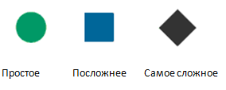

# Домашнее задание из «Уровень 3: Формальные компоненты игр»

[В третьей своей лекции](uroven-3-formal_nye-komponenty-igr.md) автор курса [«Основы гейм-дизайна»](http://gamedesignconcepts.wordpress.com/) [Ян Шрайбер](http://www.gamasutra.com/view/authors/916452/Ian_Schreiber.php) предложил начинающим свой путь в гейм-дизайне сделать что-то практическое. Что именно и как с этим справились мои коллеги — смотрите ниже.

А теперь, вот упражнение, которое, я надеюсь, вы найдёте интересным. Оно основано на [Challenges 2-5 из текста _Challenges For Game Designers_](challenges-of-game-designers-glava-2-atomy-geym-dizayna.md), с небольшими изменениями, чтобы была какая-то интрига.

Вот в чём суть. Сначала, выберите уровень сложности, основываясь на вашем предыдущем опыте в создании игр. Кто из вас катался на лыжах, поймёт:

А вот вам задача:

Большинство игр о войне имеют целью либо контроль территории, либо захват/уничтожение (как было описано выше). Для этого задания вам придётся выйти за рамки этих привычных категорий. Вам нужно будет разработать нецифровую игру, включающую следующее:

Тема должна быть связана с **Первой мировой войной.** Главной задачей не должен быть контроль территории, а также захват/уничтожение.

Нельзя использовать контроль и захват/уничтожение в динамике игры. То есть, ваша игра не должна содержать даже понятия территории и смерти в любой форме.

Все перечисленные условия, плюс игроки не должны вступать в прямой конфликт. Только опосредованный.

Ян Шрайбер

'Фабрика Войны' от П. Славина

### Синопсис игры:

Идет мировая война! 1916 год! В разгаре военная индустриализация!! победа зависит от военной промышленности. Кто сможет быстрее произвести эффективное оружие — за тем и победа!

### Общее описание:

Количество игрроков: — от 2 до 5.

Цель игры — собрать единицу вооружения из карточек по принципу паззла. Выигрывает тот, кто собирает свое оружие первым. Каждое оружие состоит из восьми пазл-частей. В общем мешке с деталями присутствует по четыре полных комплекта деталей для сборки каждого из оружий, а также 15 символов бракованной детали (красная карточка).

Игроки случайным образом выбирают свое оружие:

\-цеппелин

\-бронепоезд

\-крейсер

\-самолет

\-танк

Также игроку предоставляется изначально 1 работник и 3 золотых слитка.

Первый ход каждого игрока — вытащить из мешка три детали. После чего игроки поочередно вытаскивают из мешка детали, у них собирается х своих деталей, из которых собирают оружие, и  у чужих деталей, которые можно сдать в металлолом (4 деталей в обмен на 1злт), получив взамен золотой слиток. Золотые слитки можно обменять либо на дополнительных работников, либо на западные детали либо компенсировать золотом карточку брака.

Игрокам запрещается обмениваться деталями друг с другом.

### Игровые частицы:

\-непрозрачный мешок с деталями

\-карточка-завод с изображением оружия (у каждого игрока своя)

\-детали (элементы паззлов, из которых собирается оружие)

\-запасные детали (элементы паззлов, однократно обмениваемые на золото).

\-золотые слитки ( валюта, с помощью которой можно купить запасные детали или работников)

\-деталь брака (деталь, которую необходимо обменять на имеющуюся у игрока любую деталь своего оружия или работника либо один золотой слиток). После вытягивания из мешка, деталь брака выкидывается и не возвращается в мешок.

\-работник — средство, позволяющее вытаскивать одну деталь. Сколько работников, столько деталей за раз можно вытащить.

### Игровой процесс:

Игроки поочередно ходят.

Ход можно потратить на:

\-вытянуть “Деталь” из непрозрачного мешка в количестве, соответствующем текущему количеству работников.

\-обменять 4 металлолом на золотой слиток (лишние детали вбрасываются в мешок)

\-обменять 3 золотых слитков  на экстра деталь

\-обменять 3 золотых слитков на дополнительного  работника.

'36' от Н. Мельничук

**Игроки:** 4

Принцип: каждый сам за себя.

Взаимодействие: предусмотрена возможность взаимодействия путем обмена карточками.

**Логлайн:** подвергшийся поражению фосгеном, солдат первой мировой войны должен добраться до места дислокации своих войск и доказать, что он не шпион.

**Предыстория:** во время газовой атаки один из солдат кавалеристов потерял лошадь, снаряжение и сам подвергся отравлению, однако ветер быстро развеял облака газа и солдат выжил. Теперь ему необходимо добраться до места расположения своей разбитой части, но это не так просто как может показаться.

Путь не так близок, как хотелось бы, а солдат надышался газом и очень плохо себя чувствует. Он голоден и испытывает мучительную жажду. На улице глубокая осень, а он — в насквозь промокшей под ливнем одеждой. Солдату нужно найти сухую одежду и развести костер. Но и это еще не все — солдат знает, что в расположение части он попадет только если скажет правильный пароль, который совершенно выветрился из его памяти…

Солдат решается идти, но обнаруживает, что неподалеку бредут такие же как и он, другие солдаты — это значит, что ему нужно не зевать: у него из-под носа могут увести и еду, и лекарства, если их, конечно удастся найти в аптечках и сухпайках их не столь удачливых подвергшихся газовой атаке сотоварищей.

В довершение ко всему, солдат осознает, что его разбитая часть скорее всего спешно передислоцируется и шансов успеть прийти вовремя очень мало…

**Задача:** первым достичь места расположения своей части и предъявить правильный пароль.

### **Оборудование:**

*   Игровое поле, разбитое на 36 горизонтальных столбцов, по 4 ячейки в каждом.

36 столбцов разделены на 6 тематических зон:

1.  Лекарства.
2.  Еда.
3.  Ручей.
4.  Одежда.
5.  Костер.
6.  Оружие.

*   Набор карточек четырех типов:

1 тип — карточка-вещь (карточка, обозначающая какую-то вещь из соответствующего тематического раздела): 72 шт. (по 12 карточек для каждого раздела) основных и столько же резервных.

2 тип — карточка-буква (для составления слов пароля): несколько азбучных наборов.

3 тип — карточки пропуска хода: 72 шт.

4 тип — карточки-загадки (72 шт).

*   4 фишки.

### **Подготовка:**

*   Раскладываем игровое поле.
*   В каждую ячейку столбца помещаем по два предмета одного типа (карточки располагаются рубашкой вверх). В столбце должны присутствовать предметы всех четырех типов. Таким образом, в любых двух ячейках столбца не могут находиться предметы одного типа. Типы предметов располагаются в столбцах в произвольном порядке.

Например так:

| 2 вещи | 2 пропуска хода | 2 вещи | 2 вопроса |
| --- | --- | --- | --- |
| 2 пропуска хода | 2 вопроса | 2 вопроса | 2 буквы А |
| 2 вопроса | 2 буквы А | 2 буквы Ш | 2 вещи |
| 2 буквы М | 2 вещи | 2 пропуска хода | 2 пропуска хода |

*   Карточки-буквы в столбцах должны располагаться в определенной последовательности — в зависимости от порядка букв в загаданном осмысленном варианте пароля.
*   Выкладываем фишки перед первым столбцом с ячейками игрового поля.

### **Процесс игры:**

Ведущий зачитывает предысторию (если нужно) и ставит задачу.

Каждый игрок выбирает, на какую ячейку первого столбца он пойдет (каждый следующий ход игроки также выбирают, на какую ячейку следующего, текущего или предыдущего столбца пойдут).

### **Правила:**

*   Ходить можно не более чем на одну ячейку в любую сторону или по диагонали.
*   Став на ячейку, игрок получает одну карточку, содержащуюся в ней.
*   Если на одну ячейку стали более двух фишек, то игроки по-очереди бросают кубик, а решение, кому достанутся карточки в ячейке, принимается по величине выпавших очков — у кого больше, тот получает.
*   Карточки с вещами пополняют инвентарь игрока-солдата.
*   Карточки с буквами дают ключ к разгадке пароля.
*   Карточки с пропуском хода заставляют пропустить ход.
*   Карточки с вопросами заставляют решить некую головоломку или ответить на какой-то вопрос. В случае, если ответ правильный, игрок получает (на свой выбор) карточку-вещь или карточку-букву; если ответ неверный, игрок пропускает ход.
*   Если осуществив три хода в данной тематической зоне игрок не получил ни одной карточки-вещи, он пропускает ход.
*   Если дойдя до конца тематического участка игрок не получил ни одной карточки-вещи, он не может выйти за пределы тематической зоны. Однако он может отправиться назад на поиски карточки.
*   6 собранных вещей-карточек в одной тематической зоне дают возможность игроку заменить ею одно из слов пароля.
*   Каждые два хода игроки могут по желанию обмениваться карточками — каждый игрок может при этом поменять только одну карточку.

### **Завершение игры:**

*   Выигравшим считается тот, кто пришел первым к финишу и передал правильный пароль.
*   Если пришедший первым игрок разгадал пароль неверно, он считается проигравшим и тогда соревнование за выигрыш ведут оставшиеся три игрока.

'Воины-нЕлюди' от Т. Дудко

**Вид игры:** карточная игра

**Тема:** использование животных во время Первой мировой войны

Количество игроков: 2 или 4 игрока.

В Первой мировой войне в качестве “воинов” использовались и животные.

_Собак_ использовали как посыльных (они переносили приказы на линию фронта (даже прокладывали телеграфные провода), а также как спасателей.

_Дельфинов_ (тюленей и морских львов) — для обнаружения подводных мин или обезвреживания аквалангистов-диверсантов.

_Голуби_ доставляли корреспонденцию, их также успешно тренировали для аэрофотосъемки (шпионаж по сути).

_Кошек_ держали в окопах, чтобы они заранее предупреждали о газовой атаке.

Невольными “участниками” войны были и _волки_: зимой 1916—1917 годов на восточном фронте в районе Литвы и Белоруссии голодающие волки сильно увеличились в численности около городов и стоянок армий и начали атаковать небольшие группы солдат. Командование русской и немецкой армий договорилось о временном перемирии и направило силы на истребление волков. После того, как было убито несколько сотен зверей, и угроза с их стороны миновала, военные действия возобновились.

**Цель игры** — с помощью старших карт выиграть битву, то есть отбить атаку соперников младшими картами. То есть игрок, первым избавившийся от всех карт, одерживает победу в сражении.

**Правила игры:**

В игре используется колода из 34-х карт.

16 старших карт — по четыре Дельфина, Собаки, Кошки и Голубя.

16 младших карт — Аквалангист, Глубинная бомба, Раненые, Депеша, Кавалерия, Флот, Хлор, Фосген — по две карты каждого наименования

2 “волчьих” карты — это карты Перемирия (сброс всех карт, находящихся на руках у игроков, в колоду)

Карта Дельфина бьет карты Аквалангиста (2 шт. в колоде) и Глубинной бомбы (2 шт. в колоде)

Карта Собаки бьет карты Раненых (2 штуки, изображен красный крест) и карты Депеша (2 штуки, изображен конверт)

Карта Голубя бьет карты Кавалерия (2 штуки, изображен всадник на коне) и карты Флот (2 штуки, изображен корабль)

Карта Кошки бьет карты ГАЗ (2 штуки, на которых написано слово Хлор, 2 карты, на которых написано слово Фосген)

В игре есть элемент неожиданности — “волчьи” карты (карты временного перемирия). Игрок, которому выпала такая карта, может по желанию использовать ее, если:

*   ему нечем биться, и он не хочет брать карты
*   если его не устраивают карты, оказавшиеся у него на руках (плохой расклад)

Если “волчья” карта выкидывается на стол, все игроки обязаны скинуть свои карты вновь в колоду. Она тасуется и сдается.

**В целом игра проходит так:**

Колода тасуется, игрокам раздается по 4 карты. Колода рубашкой вверх кладется на стол.

Ходит тот, кто раздавал (первый выбирается жребием, остальные поочередно по кругу раздают; ходят тоже по кругу — по часовой стрелке).

Сдающий делает ход младшей картой. Игрок, на которого делается ход, должен отбить старшей картой соответствующего вида, либо, если не может отбиться, кинуть на стол “волчью”. “Волчья” идет в отбой, остальные карты — в колоду. Сдается заново (перемирие, перераспределение сил).

Подкидывать отбивающему карту может только ходящий.

Если у отбивающего нет старшей карты, соответствующей младшей, которой на него походили, он забирает ее. Ходит следующий игрок.

Если у ходящего на руках только старшие карты, он ходит любой из них (лучше избавляться от дублирующей — например, если на руках два дельфина, одним из них походить). Отбивающий не может побить старшую карту (исключений нет), он ее забирает. Ходящий, с одной стороны, теряет старшую карту, с другой — у него есть шанс взять из колоды старшую карту, которая может стать победной.

Если у какого-либо игрока оказывается на руках 4 старших карты разного вида — он автоматически становится победителем.

'Трибунал' от Н. Прохорова

**Сеттинг**
-----------

Международное гуманитарное право предполагает наказания за военные преступления. Среди самых известных договоров в этой сфере — Гаагская конвенция 1907 года и Правила к ней, а также четыре Женевские конвенции 1949 года и Протоколы к ним от 1977 года. Международный уголовный суд Статьей 8 Римского статута наделен правом выносить обвинительные приговоры лицам, совершившим военные преступления в ходе международных либо внутренних военных конфликтов.

Участникам “Трибунала” предлагается поиграть в судебный процесс, в рамках которого обвиняемому в совершении преступления выносится оправдательный или обвинительный приговор.

**В наборе**
------------

*   **__Карточки персонажей (6):__**

1.  Судья;
2.  Обвинитель;
3.  Защитник;
4.  Подсудимый;
5.  Помощник судьи;
6.  Помощник судьи.

*   **__20 сетов по конкретным преступлениям. В составе каждого сета:__**

1.  Карточка “Виновен” с описанием совершенного преступления и соответствующего наказания;
2.  Карточка “Невиновен”;
3.  21 карточка с “кусочками” сюжета, в ходе которого произошло или не произошло военное преступление.

*   **__Список, состоящий из 20 позиций: в каждой_ _—_ _наименование преступления и указание соответствующего наказания.__**

**Правила и геймплей**
----------------------

Игра рассчитана минимум на 4 игрока и максимум — на 6.

Участникам рандомно раздаются карты персонажей. Если участников всего 4, то раздаются только карты с номерами от 1 до 4. Если 5 или 6 игроков, то, соответственно, с номерами от 1 до 5 или от 1 до 6.

Так, обязательно должны играть персонажи: судья, обвинитель, защитник и подсудимый. Наличие одного или двух помощников судьи — опционально.

Когда игроки получили свои роли, перед подсудимым кладется один из 20 сетов с конкретным преступлением. В этом сете — 23 карты. 2 из них с одним типом рубашки, и 21 — с другим типом рубашки.

Вначале подсудимый наудачу выбирает одну из 2 карт первого типа. И в итоге обретает статус “виновен” либо “невиновен”. Но о выпавшем статусе знает только он один.

Затем подсудимый просматривает 21 карточку с описанием события, в ходе которого произошло или не произошло преступление.

*   7 карточек о том, что преступление скорее всего было совершено

*   7 карточек намекают на невиновность подсудимого, предступления скорее всего не было

*   7 карточек о скорее нейтральных сторонах сюжета, чем о намекающих на невиновность либо виновность

Подсудимый распределяет по 7 любых карточек для защитника, для обвинителя и для судьи. Ни защитник, ни обвинитель, ни судья не знают, виновен ли подсудимый на самом деле.

Задача защитника — доказать, что подсудимый невиновен. Обвинителя — что виновен. Ни один из троих, разумеется, не знает, какие из оказавшихся у них на руках карточек в большей мере соответствуют статусу подсудимого.

Проанализировав карточки, судья, защитник и обвинитель выбирают по три любые карточки (из 7) и на основании написанного в них задают подсудимому 1 вопрос по каждой карточке. В своих ответах на вопросы подсудимый может “врать” или “говорить правду”, но он должен помнить, что его задача — добиться оправдательного приговора.

Вначале вопросы задает судья, затем — обвинитель, третьим — защитник.

Выслушав все ответы, обвинитель и защитник добавляют к выбранным ранее трем карточкам еще по две и, используя “кусочки”, написанные в них, составляют свою версию произошедшего и рассказывают ее судье, вначале обвинитель, затем — защитник.

Задача судьи — выслушав ответы на все вопросы (в итоге — 9), а также выслушав позицию защиты и позицию обвинения, вынести оправдательный либо обвинительный приговор по конкретному преступлению с конкретным наказанием.

Во время игры список преступлений и наказаний из 20 позиций на руках у судьи.

**Возможные результаты завершения игровой сессии**
--------------------------------------------------

*   Подсудимый, защитник и судья проигрывают, если приговор обвинительный и неверный.

*   Подсудимый и защитник проигрывают, если приговор обвинительный и верный.

*   Обвинитель и судья проигрывают, если приговор оправдательный и неверный.

*   Обвинитель проигрывает, если приговор оправдательный и верный.

**Список возможных преступлений для сетов:**
--------------------------------------------

*   Убийство некомбатантов без военной надобности (расстрел);

*   Посягательство на человеческое достоинство (6 лет колонии);

*   Вынесение пленному смертного приговора и приведение его в исполнение вне судебного разбирательства (расстрел);

*   Умышленное уничтожение зданий, предназначенных для целей религии, образования, искусства, медицины, науки и т. д., при условии, что они не являлись военными целями (5-10 лет колонии);

*   Вербовка детей до 15 лет в вооруженные силы и использование их для активного участия в боевых действиях (от 10 лет до расстрела).

**Список возможных “кусочков” сюжета для преступления “Вынесение пленному смертного приговора и приведение его в исполнение вне судебного разбирательства”:**
-------------------------------------------------------------------------------------------------------------------------------------------------------------

1.  Во время раздачи пищи военнопленный, принужденный к работе поваром, случайно опрокинул тарелку с жирным супом на мундир подсудимого.
2.  Военнопленный был намного симпатичнее подсудимого и вызывал у него зависть.
3.  Медсестра, с которой безуспешно хотел переспать подсудимый, оказывала повышенное внимание военнопленному.
4.  Военнопленный отлично играл в шахматы, в то время как подсудимый не особенно любит эту игру.
5.  Подсудимый прилюдно оскорблял, унижал военнопленного и угрожал ему расправой.
6.  Подсудимый часто приказывал не выдавать еду военнопленному.
7.  Подсудимый провоцировал конфликты между пленными, одаряя одних ценными вещами за то, чтобы они избивали военнопленного.
8.  Младший по чину солдат получил от подсудимого приказ “разобраться с военнопленным”.
9.  Военнопленный, когда удавалось, тайком читал книги, но подсудимый, заметив это, всякий раз яростно их отбирал и разрывал на части.
10.  Военнопленный — старый знакомый подсудимого, эмигрант, который в далеком детстве был соседом подсудимого и часто его колотил как более сильный мальчик.
11.  Подсудимый был знаком далеко не со всеми военнопленными и имел с ними дело довольно редко.
12.  Время от времени подсудимый разрешал военнопленному кататься на своем личном велосипеде.
13.  Пленные были благодарны подсудимому, за то что он, когда мог, доставал для них мыло.
14.  На тренировках по боксу подсудимый изредка выходил из себя и мог потерять контроль происходящего.
15.  Иногда военнопленому с музыкальными способностями с подачи подсудимого дозволялось играть для офицеров, и его тайно угощали хорошей говядиной.
16.  Подсудимый, бывало, наказывал младших офицеров за жестокое обращение с пленными.
17.  Подсудимый иногда просил военнопленного дать ему короткий урок иностранного языка.
18.  Невзирая на опасность, подсудимый хоть и крайне редко, но любил посмотреть, как военнопленный мастерски метает нож, который подсудимый давал ему на несколько минут.
19.  Однажды подсудимый проиграл военнопленному в карты краюху хлеба, которую пленный побоялся забрать, но подсудимый настоял, что все должно быть по-честному.
20.  Военнопленный разбирался в растениях и грибах и порой сопровождал подсудимого при их сборе в окрестном лесу.
21.  Как-то раз подсудимый долго с улыбкой смотрел на карточку с изображением дочек военнопленного.

**Общие примечания**
--------------------

Рубашки всех 420 карт с “кусочками” сюжетов — одинаковые. Рубашки 40 карт со статусами (виновен/невиновен) — одинаковые, но отличаются от тех, что с “кусочками”.

Игроки ни в коем случае не имеют право обмениваться скрытой информацией. Если судья каким-то образом случайно и наверняка узнает, виновен ли подсудимый, то смысл играть дальше исчезает.

Время игровой сессии — 7-10 минут.

'Связисты' от Е. Вербицкой

Описание
--------

Вы играете за военного связиста, который пробираясь по опасной местности, должен протянуть провод связи. Он не видит всех трудностей и преград сразу, так как поле открывается поступательно. Преграды это болота, мины которые замедляют, газ который сбивает с пути и просто непроходимый лес.

### Игра состоит из:

Поле 14 х 14 хексогонов (шестиугольников)

Четыре фишки игрока

Карточки полевой почты

Хексогоны 196 штук.

Четыре точки старта

Правила
-------

Играть могут от двух до четырех игроков.В игру можно играть каждый за себя и в команде два на два.

Хексогоны как кары с одной стороны рубашка, с другой событие ил предмет. Делятся на такие типы как бонусы, минусы и простые преграды. Карты перед каждой игрой тасуют и выклвдывают на поле, так чтоб все хексогоны были закрыты, но четыре хексогона по углам остаються свободны — это места старта.

И так в игре друг против друга игроки занимаю места на стартах, каждый на свою сторону — на углах квадрата (Двое трое, не важно). Цель варианта игры “каждый за себя” — добраться в центр квадрата первым — в центре дополнительная  клетка база — финиш. Целью игры в команде является дойти до друг друга “соединить провода” — только при этом игроки одной команды обязаны поставить свои фишки на старта противоположных по диагонали — это обязательное условие. При этом база — отсутствует.

Ход игры
--------

Все карточки хексагоны перетасовываются и выкладываются на поле рубашкой вверх.

Все карточки почты тоже перетасовывают.

Игроки занимают место  на стартах (каких завист от того какой тип игры они выбрали) и совершают ходы по очереди по часовой стрелке или против неё. Двигаясь по карте они поднимают хексагоны и выполняют условия указанные на нём. У каждого игрока на один ход есть одно действие  и право выбора куда ему идти, на какой из ближайших клеток.

На самих карточках есть 25% удачных событий, 25% неудачных, 25% — это почта с отдельными заданиями и 25% это преграды — деревья, скалы — мы просто не можем через них пройти, если нету никаких бустов. Бусты — верёвка, сапоги, топор, . По одному бусту выдаётся каждому игроку в начале игры. Верёвка поможет одолеть скалы, топор лес, а сапоги болота.

Игроки не захватывают территорию, если они открыли клетку,  на неё может походить и другой игрок и свойства карты не пропадают, просто теперь видно что на ней. Игроки могут стоять вместе на одной карт.

### Хексагоны удачные

Вы нашли бинокль можете открыть любые две клетки на карте

Вы нашли сапоги — одно болото вам не страшно

Вам повезло, вы нашли одноразовый топорик

Вы нашли сух паёк и подкрепились можете совершить 2 шага за один ход — теперь есть силы!

На дереве была верёвка — берите пригодится.

Это универсальный карманный нож! Им можно что-то починить.

О! Противогаз!

### Негативные

Вы провалились в трясину -пропустите один ход

Газовая атака помешала вам — вы вернулись на начало пути. (если есть противогаз не нужно возвращаться)

у вас порвался провод вернитесь на предыдущую клетку и пропустите ход. (если есть нож не нужно пропускать ход)

газ затуманил вам рассудок вы сбились с пути и следующий ход сдели вправо (от того места где игрок стоит)

### Пассивные

скала — не можете перейти на эту клетку стоите на той, на которой были до этого хода — нужно обходить на следующем ходе, можно использовать верёвку чтоб не обходить

деревья  непроходимый лес — не можете прейти на эту клетку стоите на предыдущей — нужно обходить на следующем ходе —  можно вырубить топором

болото-не можете перейти на эту клетку стоите на предыдущей — нужно обходить на следующем ходе, можно использовать сапоги

*   все бусты единоразовые
*   бусты нельзя предавать напарнику.

почта:

\-предыдущий игрок совершает ещё один ход

\-вы добрый солдат и поделились своими запасами с зелёным (вот в этот момент это может быть и напарник) игроком. (нужно перетасовать свои бусты если они есть, перевернуть рубашкой и предложить выбрать из них один) Игрок на выбор тянет один буст.

И вся почта в таком духе, в основном её цель увеличить опосредованное взаимодействие с другими игроками.

'Побеги Войны' от С. Смородина

**Окружение:** 1915 год, деревня, находящаяся на линии фронта, группа фермеров пытается выжить и немного подзаработать на нуждах фронта

**Игроки:** от 2-х человек до 6-ти играют против друг друга.

**Задача:** одержать победу над остальными игроками, вырастив на своем поле как можно более нужные фронту овощи.

**Игровые частицы**
-------------------

*   2 шестигранных кубика
*   игровое поле 6х6

**Игровой процесс**
-------------------

Игроки ходят по очереди по часовой стрелке.

### **Первая часть хода (определение воздействия)**

Бросаются сразу два кубика и воздействие определяется по максимальному количеству очков, выпавшему на одном кубике.

Типы воздействия (максимальные очки на одном из кубиков):

**2** — репа (в клетку записывается 2 очка)

**3** — снаряд (клетка воздействия очищается)

**4** — картофель (в клетку записывается 4 очка)

**5** — мина (в клетку ставится буква М)

**6** — пшеница (в клетку ставится 6 очков)

Если выпадает дубль, то воздействие на поле производится не в одной клетке, а на 5 клеток, расположенных крестом от точки воздействия.

Существуют особенные комбинации:

**1-1** > пропуск хода (ходит следующий по часовой стрелке игрок)

**1-6** > воздействие на чужое поле

### **Вторая часть хода (определение координат)**

Снова бросаются два кубика, которые определяют координаты воздействия. Игрок сам выбирает какой кубик определяет координату по горизонтали, а какой — по вертикали.

### **Третья часть хода (запись результатов)**

Выпавшее воздействие записывается в клетку с выпавшими координатами.

Если координаты воздействия выпадают на уже заполненную клетку, то:

*   если содержимое клетки это очки — то они перезаписываются новыми выпавшими очками (в случае выпадения на этапе определения воздействия 2,4 или 6), клетка очищается в случае выпадения 3, и ставится буква М в случае выпадения 5;
*   если содержимое клетки это М (мина) — то она взрывается.

**Особые игровые ситуации**
---------------------------

### **Выпадение дубля**

При выпадении дубля воздействие производится вертикальным “крестом” размером 3х3 клетки, центр которого находится в координатах, выпавших во второй части хода.

_Пример записи выпавшего дубля 5-5 в первой части хода, с координатами 3-3  
(во второй части хода выпал дубль 3-3)._

### **Воздействие на чужое поле**

При выпадении комбинации 1-6 перед игроком ставится выбор — записать себе 6 очков в клетку, координаты которой выпадут во второй части хода или произвести воздействие на поле любого из игроков.

Если игрок выбирает воздействие на чужое игровое поле, то он тратит свой ход на него.

Ход воздействия на чужое поле идентичен ходу на своем поле, за исключением того, что в первой части хода (определение воздействия) он бросает один кубик.

Если выпадает:

**1** — переход хода;

**2** — репа (в клетку записывается 2 очка);

**3** — снаряд (клетка воздействия очищается);

**4** — картофель (в клетку записывается 4 очка);

**5** — мина (в клетку ставится буква М);

**6** — пшеница (в клетку ставится 6 очков).

### **Взрыв мины**

Происходит в том случае, если игрок во второй части хода попадает на клетку, в которой стоит мина (буква М).

При взрыве мины игрок бросает один кубик, если выпадает число:

*   от 1 до 3 — то очищаются все клетки, которые находятся в одном столбце с миной;
*   от 4 до 6 — очищаются все клетки, которые находятся в одной строке с миной;

Если при очищении задевается еще мины, то для них тоже бросается один кубик.

**Результат игры**
------------------

По истечении заданного количества ходов — 18 или 36, игроки суммируют количество очков, записанное в клетках игрового поля.

Выигрывает тот игрок, который набрал большее количество очков.

'Морская торговля' от А. Малькова

**Общее описание**
------------------

Идет 1 мировая война. Опасное время для морской торговли, но и выгодное! Товары на полках не залеживаются — сторона, пополнившая свои ресурсы, выиграет в этой затянувшейся войне. Отличная возможность для всех торговцев попытаться сорвать куш!

Каждый игрок является капитаном маленького торгового парохода.

Цель игры: заработать максимальное количество очков репутации у одной из тоговых фирм. Для этого игрокам надо плавать из порта в порт и зарабатывать репутацию заключая и выполняя сделки.

**Подготовка к игре**
---------------------

На игровой стол кладется карта моря, расчерченная на клетки. _\*Размер карты может зависеть от количества игроков._ На карте выбираются несколько портов. _\*Выбираются из конкретных позиций, или рандомные точки на побережье — можно попробовать сделать и так и так. Количество портов зависит от количества игроков._

Перемешивается колода карточек случайных событий и кладется рубашкой вверх на игровой стол.

Колода карточек сделок делится поровну между портами: каждая её часть перемешивается и кладется возле соответствующего порта рубашкой вверх. На рубашке каждой карты нарисован логотип торговой фирмы, к которой он относится. Таким образом все игроки видят в каких портах и с какими фирмами можно закючить сделки.

Игроки случайно расставляют стартовые фишки кораблей в порты и определяют очередность ходов (лбюым возможным методом).

**Процесс игры**
----------------

Игроки ходят по-очереди начиная с первого.

Каждый игрок в свой ход может сделать следующие действия (в любом порядке):

*   перемещаться по карте;
*   закючить сделку  (надо находится в порту);
*   покупать корабль (надо находится в порту);

### **Перемещение**

Для перемещения по карте игрок выкидывает кубик d6 — на столько клеток он может переместить фишку корабля в любом направлении. _\*Исключение — в море нельзя находитья в одной клетке с другим игроком._

Если квадрат, в котором остановился игрок пуст (не порт, нету карт событий), то игрок берет верхнюю карту случайного события из колоды и кладет её в тот квадрат. Затем игрок выполняет инструкции, указанные на карте: это может быть просто пустая карта, может быть потеря текущего контракта (“чтобы удрать от вражеского патруля вы выросили груз”), ускорение в седующем ходу (“можете следовать за военным конвоем”), особенная сделка (“помощь потерпевшему крушение”), замедление в следующем ходу, и т.п.

### **Сделки**

Находясь в порту можно заключить сделку — взять верхню карту из колоды сделок данного порта. На карте сделки описны действия, которые дожен выпонить игрок: проседовать в порт Х, попасть в сучайное соытие У, и т.п. _\*Провалить сдеку неьзя. Её дожен впонить взявший её корабь._

Когда сделка выпонена — игрок поучает 3 очка репутации той фирмы, которой она была, и по 1 очку репутации от двух других фирм (опредеяется роском куика). Карточка сделки ложится в “отбой”. Когда все карточки сделок попадут туда, они делятся по городам и опять перемешиваются (как и на старте игры).

### **Покупка корабя**

Игрок может иметь несколько корабей.

Чтобы купить корабль, надо зайти в любой порт и заплатить 9 очков репутации одной фирмы. _\*Карабь появится в этом же порту на этом же ходу и им можно ходить._

Этим корабем он может выпонять все те же действия, что и основным корабем.

### **Завершение хода**

После хода игрока все карты событий остаются на столе: ими могут пользоваться и другие игроки. После того как все игроки походили — одна из карт случайных событий уирается с карты и вмешивается в колоду. _\*Какая именно — выирается рандомно._

**Предполагаемый геймплей**
---------------------------

Игрокам выгодно заключать сделки с одной и той же фирмой, чтобы получать больше очков.

Все игроки между собой соперники — видя что кто-то вырывается вперед, они будут мешать, забирая сделки необходимой ему фирмы.

'Разведчики' от А. Атаманчука

# Окружение

Первая мировая война, фронт утвердился, войска завязли в позиционной борьбе. Перед очередными боевыми действиями противники взяли паузу, чтобы собраться с силами, подвести боеприпасы, обновить силы и, конечно же, получше разведать обстановку перед следующим наступлением.

Игроки выступают в роли разведчиков, которых послали разведать предстоящий театр военных действий, и принести как можно больше полезных данных.

# Игроки

От 2х до 4х, каждый играет сам за себя.

# Цель игры

Собрать как можно больше ценных разведданных.

# Игровые компоненты

*   Игровое поле (театр военных действий) 10х10 клеток: на каждой клетке указаны числа (от 1го, до 4х чисел) — 1, 2,3,4,5 и 6.

*   Один игровой кубик (стандартный шестигранник).

*   Колода карточек событий — 100 штук.

*   4 разноцветные фишки, обозначающие игроков-разведчиков

# Игровой процесс

Игроки по очереди кидают кубик —  сколько на кубике выпало, на столько клеточек игрок может походить в любом направлении, кроме диагонали (стартовать можно с любой крайней клетки игрового поля). Встав на клетку, игрок сверяет указанные там числа с числом совершенного хода:

*   Если число ходов не совпадает ни с одним числом на клетке, то ничего не происходит, игрок ждет своего следующего хода. А далее ходит следующий по очереди игрок.

*   Если  хоть одно число совпадает с числом хода, то игрок берет карточку событий из колоды.

**Карточки событий**

*   успешные действий:

*   “Вы получили разведданные”: карточки с разведданными разной важности (разным номиналом — 1,2,5,10). Игрок забирает карточку себе. (35 карточек)
*   “Подробная карта местности”: игрок на свой следующий ход может походить куда угодна на любое количество ходов — от 1 до 6 и взять карточку. Карточка уходит в “отбой”. (10 карточек).
*   “Маневр”: нейтрализация любой карточки безуспешного действия. Игрок забирает карточку себе и применяет при надобности (после чего карточка уходит в “отбой”). (5 карточек)

*   безуспешные действия:

*   “Полезных сведений нет”: игрок оставляет эту карточку на данной клетке, поле чего на нее никто больше не может встать до конца игры. (30 карточек)
*   “Патруль солдат противника”: игрок пропускает свой следующий ход (должен затаится). Карточка оставляется на данной клетке, поле чего на нее никто больше не может встать до конца игры.(10 карточек).
*   “Плен”: на своем следующем ходу игрок кидает три раза кубик — необходимо выкинуть один раз первое указанное на клетке число — если получилось, то игрок делает свой ход (кидает кубик, чтобы походить), если нет — ждет своего следующего хода на месте и снова старается “вырваться из плена”.  Карточка оставляется на данной клетке, поле чего на нее никто больше не может встать до конца игры.(5 карточек)
*   “Потеря разведданных”: любой другой игрок вытаскивает из собранных разведданных вытащившего карточку игрока и возвращает ее в средину колоды. Если карточек разведданных не было, то ничего не происходит. Карточка оставляется на данной клетке. (5 карточек)

Игрок не может стать на клетку, где уже стоит другой игрок.

# Завершение игры

*   Игра заканчивается, когда заканчивается колода карточек событий.

*   Победителем становится игрок, собравший наибольшее количество разведданных (сумма номиналов всех полученных карточек).