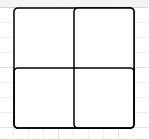
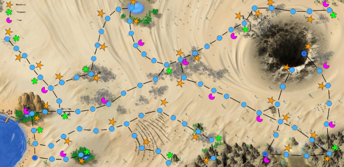

# Домашнее задание из «Уровень 4: Ранние стадии дизайна»

В [четвертой лекции](uroven-4-rannie-stadii-dizayna.md) автор курса [«Основы гейм-дизайна»](http://gamedesignconcepts.wordpress.com/) [Ян Шрайбер](http://www.gamasutra.com/view/authors/916452/Ian_Schreiber.php) предложил гейм-дизайнерам создать бумажный прототип известной компьютерной игры. Что из этого получилось — смотрите ниже.

Выполните [задания 4-1 из текста](challenges-for-game-designers-glava-4-preobrazovanie-tsifrovog.md) _[Challenges](challenges-for-game-designers-glava-4-preobrazovanie-tsifrovog.md)._ Это не обязательно должна быть игра от Blizzard  или Activision, но это должна быть игра, ещё не имеющая настольной версии (проверьте на [BoardGameGeek](http://www.boardgamegeek.com/) если сомневаетесь).

Разработайте настольную адаптацию любой видеоигры. Разместите свод её правил на форуме. Включите в список все необходимые компоненты. Проект должен быть готов и пригоден к игре, чтобы игрокам ничего не пришлось додумывать!

Как в предыдущем задании, плюс: как только вы завершите свой замысел, сделайте пригодный к игре прототип не более, чем за час. На форуме опубликуйте полный список использованных материалов.

Всё вышеперечисленное, плюс: ваша игра должна быть адаптацией одной их игр для [Atari 2600](https://www.atari2600.com/). И сделайте её интересней оригинала!

И на этот раз я попрошу вас **оставаться в рамках своего уровня сложности.** Например, если до этого курса у вас не было никакого опыта в гейм-дизайне, сделайте простое задание, даже если вы можете выполнить остальные, и опубликуйте его на форуме с зелёным кругом. Конечно же, вы можете преодолеть и более сложные ограничения, но я бы хотел посмотреть на отзывы ваших более опытных коллег на ваши работы. Спасибо за помощь и понимание!

Ян Шрайбер

'Скан-миссия' из EVE Online от Н. Мельничук

**За основу взята:** механика позиционирования в исследовательском направлении ММОG “Eve-online”.

**Игроки:** от 4 до 2

**Взаимодействие между игроками:** каждый сам за себя, по желанию игроков возможно взаимодействие, связанное с покупкой/продажей/обменом оборудования.

**Игровая динамика:** коллекционирование.

**Предыстория:**

Четыре новичка, работающих на могущественную корпорацию расы Калдари, проходят стажировку по исследовательской деятельности у Агента ресерчера. Для этих целей работодатель выделил каждому обучающемуся стандартную для текущих расценок сумму — 50 тыс. исков.

Стажер должен потратить деньги с максимальной пользой для своего обучения и учесть, что ему в любой момент может понадобиться дополнительное оборудование или ремонт корабля. Дело осложняется тем, что работодателю нужен только один — самый талантливый работник, поэтому новичкам придется постараться и превзойти конкурентов.

После краткого курса обучения Агент выдает стажерам 5 скан-проб (пробок) (а также за умеренную плату предоставляет дополнительные элементы, такие как моды к скан-пробам, проб-лаунчеры и т.д. — их стажеры могут приобретать по мере необходимости) и отправляет их в неисследованную область космоса для проведения экзаменационного сканирования.

Добытые в ходе сканирования ресурсы и определят, кто же из стажеров достоин стать частью могущественной корпорации.

**Задача:** собрать ресурсов, больше чем соперники.

**Оборудование:**

*   Карта космоса с бортиками, разделенная на зоны сканирования с объектами сканирования, зону потерь и стажерскую базу.
*   Набор “пробок” (по 10 пробок 4 цветов; цвет определяет принадлежность игроку).
*   Набор карточек объектов сканирования (по 5 карточек 4 цветов, цвет определяет принадлежность объекта сканирования к одному из четырех видов).
*   Набор карточек событий 4 цветов (по 10 карточек каждого цвета — цвет определяет принадлежность к одному из четырех видов объектов сканирования).
*   Игровые фишки — фрегаты (4 фишки 4 цветов для 4 игроков — соответствуют цветам пробок).
*   Деньги — 20 банкнот по 1 тыс. исков.
*   Карточки модификаций по 5 шт. каждого вида, всего
*   Вспомогательное оборудование: листок, ручка, игральный кубик.

**Принцип построения карты космоса:**

Игра -Скан-миссия-

1 — база для четырех фишек игроков

2 — объект сканирования (газовые комплексы, гравиметриксы, вормхолы, магнетометриксы) или точка остановки

3 — путь для варп-прыжка

4 — области позиционирования

5 — граница области исследования

**Принцип построения карточек событий:**

Игра -Скан-миссия- (1)

**Подготовка к игре:**

*   Разложить карту космоса.
*   Разложить карточки областей по соответствующим объектам сканирования.
*   Установить фишки игроков на начальные позиции (на базу).
*   Раздать игрокам деньги (по 5 тыс. исков каждому).
*   Зачитать предысторию и правила, если игроки еще не знакомы с ними.
*   Раздать игрокам пробки (по 5 штук одного цвета).
*   Распределить карточки событий в стопки по цветам, рубашкой вверх.

**Ход игры:**

*   Игроки выдвигают фишки на начальные позиции и по-очереди выбрасывают пробки.
*   Затем, по-очереди осуществляют позиционирование пробок, в ходе которого точно определяется область исследования.
*   Пошагово осуществляют варп-прыжок к объекту исследования.
*   Сканируют объект исследования, участвуют в событии объекта и забирают результаты исследования.
*   Затем вновь выбрасывают пробки и повторяют процесс, но уже по отношению к другому объекту.
*   В ходе игры игрок может возвращаться на базу (пошаговым варп-прыжком), чтобы приобрести необходимое оборудование, либо приобретать необходимое оборудование путем совершения сделок с другими игроками.

**Завершение игры:**

*   Игра считается завершенной, когда исследованы все объекты космоса. П завершении игры проводится подсчет ресурсов у игроков и определяется победитель.

**Правила игры**:

_Общие:_

Каждый игрок играет за одну фишку (фрегат).

На руки игроку выдаются 50 тыс. исков.

Игрок может тратить деньги на свое усмотрение:

*   покупать карточки модификаций на базе;
*   покупать или обменивать карточки модификаций у игроков;
*   покупать дополнительные скан-пробы на базе;
*   покупать или обменивать дополнительные скан-пробы у игроков;
*   покупать или обменивать добытые ресурсы у игроков;
*   ремонтировать свой корабль на базе;
*   откупаться от пиратов.

На базе каждая карточка модификации стоит 10 тыс. исков.

На базе каждая скан-проба стоит 10 тыс. исков.

Единоразовый ремонт корабля стоит 10 тыс. исков и осуществляется только на базе.

Игрок при продаже своей карточки модификации, скан-пробы или единицы ресурса вправе сам назначать за них цену или обменный эквивалент.

Свое предложение о продаже или покупке игрок имеет право высказать только во время своего хода.

Торговаться не запрещено.

Виды карточек модификации:  
1\. Мод к скан-пробам (+1 к силе сканирования) — позволяет сдвинуть одну пробку на одну линию точности сканирования.

2.  Проб-лаунчер (+1 к скорости варп-прыжка) — позволяет пропустить последний пункт остановки перед объектом сканирования.
3.  “Пылесос” для добычи ресурсов газовых комплексов. Отсутствие его позволяет собрать только половину ресурсов комплекса.

_Правила позиционирования:_

Процесс позиционирования для осуществления сканирования объекта представляет собой поочередные броски скан-проб игроками. При этом одни пробки оказываются дальше, другие — ближе к какому-либо объекту сканирования.

Игрок сам выбирает, по отношению к какому объект сканирования он будет позиционировать “пробки”, при этом игрок учитывает, что вормхолы и магнетометриксы дают больше ресурсов, но находятся в более слабой позиции доступности и предполагают выполнение более сложных заданий в карточках событий.

Чем ближе пробка к объекту сканирования, тем выше точность сканирования. Для того, чтобы осуществить варп-прыжок к объекту необходима стопроцентная точность сканирования.

Каждый объект сканирования окружен четырьмя голубыми линиями, определяющими точность сканирования:

*   при попадании пробки в саму область сканирования точность сканирования составит 100%;
*   при попадании пробки между областью сканирования и первой линией точность сканирования составляет 80%;
*   при попадании пробки между первой и второй линией точность сканирования составляет 60%
*   при попадании пробки между второй и третьей точность сканирования составляет 40%,
*   при попадании пробки между третьей и четвертой точность сканирования составляет 20%,
*   при попадании пробки за пределы четвертой линии точность сканирования составляет 0%.

Каждый игрок имеет право на два дополнительных суммирующих броска пробок, и он сам решает, воспользоваться ли ему этим правом. При этом часть пробок (одна или более) остаются на поле, а остальные игрок бросает заново для суммирования результата.

Если за три броска игрок не смог позиционировать пробки до стопроцентной точности, ход переходит другому игроку.

В случае, если пробки попадают за границу области исследования, они “теряются в межзвездном пространстве” (изымаются у игрока и передаются в магазин базы).

_Правила перемещения:_

Перемещение к любому объекту сканирования возможно в любой момент, когда игроку принадлежит очередность хода, однако просканировать тот или иной объект (кроме базы), к которому переместился игрок, возможно только после позиционирования скан-проб по отношению к этому объекту до стопроцентной точности.

Перемещение осуществляется последовательными ходами к объекту исследования по специально обозначенным на карте путям.

При перемещении (варп-прыжке) объекты сканирования, стоящие на пересечении путей, является точками остановки и перехода хода другому игроку. Соответственно, один ход — это путь от одного объекта сканирования к другому ближайшему. Миновать такую точку остановки можно только при наличии у игрока карточки мода проб-лаунчера, если данная точка остановки является последней стоящей перед объектом сканирования, определенного со стопроцентной точностью.

Порядок следования к объекту игрок определяет сам для себя.

Две фишки не могут стоять одновременно на одном объекте сканирования (точке остановки).

_Правила сканирования:_

Когда фрегат игрока добирается до объекта сканирования, игрок наугад выбирает карточку события, соответствующую типу объекта сканирования (она обозначена таким же цветом).

Игрок по своему желанию может реализовать карточку события, либо отказаться от ее реализации. В случае успешной реализации карточки события игрок записывает на свой счет ресурсы карточки события и снимает с объекта сканирования карточку — это значит, что объект теперь непригоден для сканирования.

В случае отказа от реализации, игрок своим следующим ходом начинает процесс позиционирования проб заново, а карточка события резервируется для данного объекта сканирования — это значит, что игрок, который попытается сканировать этот объект, вынужден будет использовать именно эту зарезервированную карточку события.

**Условия победы:**

Собрать наибольшее количество ресурсов к моменту завершения исследования всех объектов сканирования.

'Тук-тук' от Д. Гурбика

Противостояние двух сторон: светлой и темной.

Количество игроков: 2+

**Игровые частицы:**
--------------------

*   Игровое поле
*   Счетчик рассвета
*   Счетчик безумия
*   Шестигранный кубик
*   Лист действий

**Подготовка к игре**
---------------------

### **Игровое поле**

**Игроки составляют карту локации при помощи комнат. Комната — это квадрат разделенный на 4 части. (Рисуют на бумаге или самостоятельно изготавливают из бумаги комнаты)**

Каждый квадрат должен соприкасаться хотя бы с одним другим, хотя бы одним делением.

Так же все квадраты необходимо пронумеровать или как нибудь назвать (рекомендуется использовать названия комнат).

Игроки сами решают какой размер (сколько комнат) использовать.

После того как выбранное количество квадратов нарисовано — игроки помечают три любые крайние комнаты (это точки старта).

### **Выбор стороны**

Игроки сами решают кто за какую сторону будет играть.

### **Место старта**

Каждый игрок бросает кубик (другой игрок не должен видеть выпавший результат). Выпавший результат определяет ту комнату в которой начнет игрок (место старта): 1-2 — первая точка старта; 3-4 — вторая точка старта; 5-6 — третья точка старта.

При большом количестве игроков точек старта можно делать больше и переназначать значение на кубике для соответствующей комнаты. **Игроки не знают где кто начинает.**

### **Счетчик безумия**

Имеет 10+ делений, заполняется при удачно совершенных действиях темной стороны. Игроки могут сами выбирают количество делений (это влияет на длину игровой сессии).

### **Счетчик рассвета**

Имеет 10+ делений, заполняется при удачно совершенных действиях светлой стороны. Игроки могут сами выбирают количество делений (это влияет на длину игровой сессии).

**Ход игры:**
-------------

Делиться на три фазы:

**Фаза первая** — совершение доступных действий.

Игроки совершают доступные им действия одновременно — каждый записывает совершенные им действия на листе действий.

**Фаза вторая** — оглашение действий.

В конце хода происходят совершенные персонажами действия.

**Фаза три** — смещение счетчиков.

Игроки заполняют свои счетчики если были произведены удачные действия способствующие этому.

**Цель игры**
-------------

**Светлый** — заполнить счетчик рассвета

**Темный** — заполнить счетчик безумия

**Действия персонажей**
-----------------------

Каждый персонаж может выполнить до 2-х предоставленных ему действий.

### **Светлый**

*   **Перемещение** — переместить персонажа на расстояние до 3-х комнат (из одной комнаты можно переместиться в другую только если эти комнаты соприкасаться хотя бы одним делением).
*   **Зажечь свет** — в комнате включается свет (если этому действию ничего не противоречит), если действие удачно — счетчик рассвета получает одно деление.
*   **Изгнание кошмаров** — персонаж проводит в комнате ритуал (в той в которой находиться на данный момент), если после оглашения действий в комнате в которой был проведен ритуал появляется кошмар — он изгоняется и ни как не влияет на игрока, а счетчик рассвета получает одно деление.
*   **Спугнуть темного** — персонаж проводит в комнате ритуал (в той в которой находиться на данный момент), если после оглашения действий в комнате в которой был проведен ритуал есть темный — он перемещается в одну из комнат (место старта — по тем же правилам), а счетчик рассвета получает два деление.

**Ближе к безумию** — если светлые игроки два хода не зажигают свет, то на третий счетчик безумия получит одно деление. Если и после этого они не зажгут свет — на следующий ход счетчик безумия снова получит одно деление. Так будет продолжаться до тех пор пока светлые игроки не зажгут свет, после чего опять будет действовать правило двух ходов.

### **Темный**

*   **Перемещение** — переместить персонажа на расстояние до 3-х комнат (из одной комнаты можно переместиться в другую только если эти комнаты соприкасаться хотя бы одним делением).
*   **Погасить свет** — выключить свет в комнате, удачное совершение этого действия заполнит шкалу безумия на одно деление.
*   **Создать кошмар** — призывает кошмар в любой комнате, во время оглашения действий темный должен показать одну из комнат прилегающих к той в которой он призвал кошмара (можно указывать ту саму комнату, игроку решать как запутать оппонента).
*   **Напугать светлого** — если темный находиться в комнате в которой светлый включает свет, при оглашении действия — светлый будет перемещен в одну из комнат (место старта — по тем же правилам), а счетчик безумия получит два деление.

**Боязнь света** — если одновременно зажжено два и более света и темные не гасят свет в течении двух ходов, то на третий счетчик рассвета получит одно деление. Если и после этого продолжает гореть свет (два и более) — на следующий ход счетчик рассвета снова получит одно деление. Так будет продолжаться до тех пор пока темные игроки не потушат свет (до одного источника или меньше), после чего опять будет действовать правило двух ходов.

**Примечания**
--------------

**_Активация кошмара_**_: Темный может не активировать монстра если не хочет, он останется там где был. Активировать его можно в любой другой момент._

**_Одновременный испуг_**_: Если оба игрока находятся в одной и той же комнате и пугают друг друга — они оба будут перемещены в комнаты (место старта), и оба счетчика сдвинуться._

**Важно!** Игра “на честность”. Но все же любой игрок может затребовать подтверждение на удачное исполнение того или иного действия.

NES'овский 'Battle City' от Н. Прохорова

**В наборе**
------------

*   Игровое поле 13×13 клеток

*   “Танк-защитник1”, “Танк-защитник2”, “Танк-защитник3”, “Танк-защитник4” — по 4 фигурки

*   “Знамя” — 2 фигурки

*   “Танк-агрессор1”, “Танк-агрессор2, “Танк-агрессор3”, “Танк-агрессор4” — по 10 фигурок

*   Кубик с 6 гранями

*   Деталь ландшафта “Кирпичная стена” (разбирается на 4 части) — 100 шт.

*   Деталь ландшафта “Бронированная стена” (разбирается на 4 части) — 100 шт.

*   Деталь ландшафта “Вода” — 100 шт.

*   Деталь ландшафта “Лед” — 100 шт.

*   Деталь ландшафта “Трава” — 100 шт.

*   Деталь ландшафта “Знамя” — 2 шт.

*   Ядро — 50 шт.

*   Карточки “Бомба”, “Время”, “Танк”, “Звезда”, “Лопата”, “Каска” — по 1 шт.

*   Карточки ходов с различными, всевозможными схемами передвижений танков — 500 шт.

*   Карандаш — 4 шт.

*   Ластик

*   Интервальный таймер

*   Набор шаблонов локаций

**Режимы игры**
---------------

*   1 защитник против 1 агрессора (1 игрок управляет танком защитника; 1 игрок управляет 1-2 танками агрессора). **Основной режим.**

_Модификации:_

*   2 защитника против 1 агрессора (2 игрока управляют двумя танками защитника (каждый — своим танком; 1 игрок управляет 1-2 танками агрессора)

*   2 защитника против 2 агрессоров (2 игрока управляют двумя танками защитника (каждый — своим танком); 2 игрока управляют двумя танками агрессора (каждый — своим танком (то есть для каждого в итоге заспавнится максимум по 5 танков))

*   1 защитник против 2 агрессоров (1 игрок управляет танком защитника; 2 игрока управляют двумя танками агрессора (каждый — своим танком (то есть для каждого в итоге заспавнится максимум по 5 танков))

*   1 защитник против 1 защитника (1 игрок управляет танком защитника; 1 игрок управляет танком защитника. Знамя с обеих сторон. Задача — уничтожить его либо довести до нуля жизни противника)

*   2 защитника против 2 защитников (2 игрока управляют двумя танками защитника (каждый — своим танком); 2 игрока управляют двумя танками защитника (каждый — своим танком). Знамя с обеих сторон. Задача — уничтожить его либо довести до нуля жизни противника)

**Старт игры и карточки**
-------------------------

Локация составляется по шаблону из набора, поставляемого в коробке, либо самостоятельно игроками.

Выбирается режим игры. К примеру, игроки выбирают основной режим — сценарий “1 защитник против 1 агрессора”.

Из 500 карточек хода произвольно отбирается 100. Из этих 100 игрокам раздается по 10. Игроки имеют право смотреть на содержание карточек только во время ходов (которые длятся по 20 секунд). В остальное время — карточки лежат на столе рубашкой вверх.

Когда запускается таймер хода, игроки быстро просматривают карточки, выбирают наиболее, по их мнению, подходящую, рисуют на ней карандашом (чтобы можно было стереть ластиком и использовать карточку еще раз) выстрел. Показывают карточки друг другу и вносят изменения в текущее игровое состояние.

Каждый второй ход у агрессора на ближайшей к нему линии (в ее центре, в крайней правой точке или в крайней левой точке — агрессор выбирает сам) спавнится новый танк. Бросок кости определяет тип танка. Если у агрессора на поле уже есть два танка, то новые не спавнятся, до тех пор пока защитник не уничтожит один из них (или оба, использовав бонус “Бомба”).

Когда у агрессора на поле два танка, то он записывает ход сразу на две карточки, для каждого танка — отдельная карточка.

Игроки бесплатно набирают 10 (или 9) новых карточек, когда у них на руках осталось 0 (или 1) карточка хода. Если игрок хочет набрать новые карточки раньше, он тратит на это действие ход.

Если 100 карточек закончились, но никто из игроков еще не победил, из общей колоды берутся еще 100.

**_Иной вариант игры_**: игроки самостоятельно делают карточки хода (поле 7х7 клеток) и каждый ход самостоятельно рисуют на пустой карточке и передвижение танка, и его выстрел.

**Геймплей (для основого режима)**
----------------------------------

Игрок может быть либо защитником, либо агрессором. (Определяется по желанию игроков либо броском кости: первый, выбросивший чет, играет защитником).

*   **_Задача защитника_** — оберегать знамя и уничтожить 10 танков агрессора.

*   **_Задача агрессора_** — уничтожить знамя либо уничтожить три танка защитника.

Защитник управляет одним танком и использует бонусы, которые получает на 5, 15, 25, 35, 45 и 50 ходу. (Бонусы описаны ниже в соответствующем разделе).

Агрессор управляет сразу двумя танками, но время на ход у него такое же, как и у защитника — 20 секунд.

По старту таймера игроки в течение хода должны записать на карточку передвижения танка его выстрел (либо два выстрела, если танк может стрелять два раза за ход).

По окончании 20 секунд игроки показывают друг другу записанное на карточке хода и совершают этот ход: переставляют фигурки на поле, вносят необходимые изменения в игровое состояние и кладут карточку рубашкой вверх. После следующего хода — на нее так же кладут следующую карту и т. д. (потом можно посмотреть всю партию).

**_Пример игрового уровня (основной режим):_**

Пример карточки хода, на которую игрок вносит выстрел (просто рисует в клеточке, из которой стреляет, стрелочку с направлением выстрела):

**Бонусы и танки**
------------------

_Бонусы:_

“Часы” — обездвиживают и лишают танки агрессора возможности стрелять на 6 ходов

“Танчик” — дополнительная жизнь

“Каска” — танк неуязвим 7 ходов

“Звезда” — прокачка танка на 1 уровень

“Лопата” — знамя получает бронированную окантовку

“Бомба” — уничтожает все (1 или 2, соответственно) танки агрессора

Для определения бонуса перед началом 5, 15, 25, 35, 45 и 50 хода защитник бросает кость. 1 — “Бомба”, 2 — “Часы”, 3 — “Танчик”, 4 -— “Звезда”, 5 — “Лопата”, 6 — “Каска”.

_Танки_

Защитник начинает игру с танка первого уровня. Такой танк может стрелять только 1 пулей, которая летит на 9 клеток (по завершении хода, если пуля не столкнулась с другой пулей, не врезалась в танк или препятствие, то она “замерзает” и заканчивает свой путь на следующем ходу).

Защитный танк второго уровня также стреляет 1 пулей, но на 12 клеток.

Защитный танк третьего уровня стреляет 2 пулями на 12 клеток. (Пули могут быть выпущены в разных направлениях, минимальный интервал между выстрелами — половинка одной клетки).

Защитный танк четвертого уровня стреляет 2 пулями на 12 клеток и способен проламывать как кирпичи, так и бетон: одной пулей он сносит одну клетку (все остальные танки 1 пулей сносят только кирпичи и только половину преграды в клетке (или ее четверть, если выстрел был произведен на пересечении клеток).

Танки агрессора

Перед спавном танка агрессора игрок кидает кость.

1-3 — базовый танк (идентичен защитному танку первого уровня)

4 — быстрый танк (отличается от базового тем, что агрессор уже после завершения хода и внесения изменения в игровое состояние может “спасти” танк, переместив его максимум на 2 клетки)

5 — танк-стрелок (отличается от базового тем, что стреляет на 12 клеток)

6 — осадный танк (отличается от базового тем, что погибает не от 1, а от 2 попаданий).

**Ландшафт**
------------

**_Кирпичи_**

При таком полете пули сносится половинка преграды (если пулю выпустил максимально прокачанный танк защитника, то сносится вся преграда):

При таком полете пули сносится четверть преграды (если пулю выпустил максимально прокачанный танк защитника, то сносится половинка преграды):

**_Бетон_**

Сносить бетон способен только максимально прокачанный танк защитника.

При таком полете пули — всю преграду:

При таком — половинку преграды:

**_Вода_**

Зона непроходимости. Пули над ней пролетать могут.

**_Трава_**

Когда танк заезжает в траву, его фигурка убирается с поля. Игроки должны взаимодействовать с этой фигуркой по памяти до тех пор, пока танк не покинет зону травы.

**_Лед_**

Когда ход танка завершается на льду, он прокатывается еще на одну клетку (либо на полклетки, если по завершении хода только половинка или четверть танка оказалась на льду).

**_Знамя_**

Объект, который оберегает игрок-защитник. Уничтожается с 1 попадания.

**_Пустая клетка_**

Над такой клеткой свободно пролетают пули, по ней можно свободно перемещаться.

**Нюансы**

*   Проехать сквозь танк (хоть союзнический, хоть вражеский) нельзя. Однако если танк защитника стоит в точке спавна танка агрессора, и игрок решает заспавнить очередной агрессорский танк именно здесь, то это допустимо. Танки будут стоять “друг на друге” до следующего хода, когда один из них не отъедет.

*   Если полное передвижение, указанное на карточке хода, совершить невозможно (мешает преграда, другой танк), то танк передвигается до последней доступной точки.

*   Танки защитника спавнятся на горизонтальной линии Знамени — в клетке, соприкасающейся с ограждением Знамени (справа или слева — решает игрок).

*   Танк не может стрелять, пока его пуля (или две пули, если он максимально прокачан) не долетела до цели/преграды/другой пули. Прокачивать можно только танки защитника.

*   Игроку на ход дается 20 секунд. Если до сигнала таймера игрок не выбрал карточку, то за него любую карточку из его рук вытягивает противник (противник при этом видит только рубашки). Если выстрел не записан, то танк не стреляет в этом ходу.

*   Если сталкиваются две пули, они нейтрализуют друг друга.

'Pocket Tanks' от П. Славина

**Поставляемые игровые частицы**:

\-Террэйн-одеяло  которое располагается на столе и произвольно формирует ландшафт, одеяло должно снабжаться граунд-материалом (подкладкой), который может формировать подъема и впадины ландшафта.

\-Набор разноцветных танков размером 5см.

\-две торцевые границы игрового поля (ленты длиной 60см  с нанесенными делениями по 5см )

\-набор подписанных с названиями снарядов

\-инструкции к игре

**Подготовка к игре**:

С помощью террейн-одеяла, а также любых других произвольно подбираемых материалов формируется игровое поле в виде прямоугольника, минимум 100 на 60 см. Танчики размещаются на торцевых частях поля (посередине узкой стороны), количество игроков 2.

Изначально танки размещаются прямо напротив друг друга посередине торцов одеяла. Затем каждый игрок два раза бросает кубик, определяя смещение своего танчика в сторону (вправо вдоль торцевой границы) и в глубь поля. Количество очков на кубике равно количеству см смещения\*5.

Перед началом игры проводится выбор снарядов произвольно (поочередно) или рандомно (наугад) из бочки со снарядами.

**Ход игры**:

У каждого по десять выстрелов и по три произвольн смещения в любом направлении в пределах поля.

Стрелять нужно, подкидывая ладонью снаряд, непременное условие — чтобы бросающая рука не отдалилась при броске более чем на 10-15 см от танка (длина дула танка).

Успешные выстрелы приносят стрелку очки в зависимости от точности и вида снаряда.

Побеждает тот, кто получит больше очков после 10 выстрелов.

Цель игры: набрать наибольшее количество очков после 10 выстрелов.

**Снаряды**:

**нюк**. —  50 очков при прямом попадании, 20 очков если танк противника оказался в радиусе 20см от точки попадания,  5 очков в радиусе от 20 до 30 очков, делает яму глубиной 20 см и шириной 20 см, красная ракетка которую неудобно кидать

**Маунтэйн мувер** — 0 очков,  яма глубиной дотащенной поверхности (стола или пола) и шириной 30 см, синий многоугольный камешек

**Дерт** — 0 очков,сложенная в комок коричневая тряпка, в месте попадания формирует защитный грязевой купол, который можно устранить только маунтайн мувером или нюком либо пронзить червем; сверху накидывается тряпка высотой 20 см.

**Напалм** — сложенная в комок красная тряпку, при попадании 35 очков.

**Самонаводящийся** — маленькая ракетка, если упала в радиусе 20 см то считается что попала, 10 очков

**Червь** — прошьет через грязь, но надо точно попасть в проекции вертикально (мин расхожд 3см), 15 очков

**Роллер** тяжелый -, обычный мячик, 20 очков при попадании или радиусе 10 см.

**Гамма-бластер** — снаряд не надо кидать, очки обратно пропорц расстоянию по формуле 100/х см

**Картечь** -горсть гроздей, каждый гвоздь при попадании 5 очков

**Клей** — сложенная в комок желтая тряпка — 0 очков, в месте попадания оказавшийся танк не может сдвинуться

**Стена** —  0 очков, зеленый огрызок карандаша, в месте попадания строится башня-преграда высотой 20 см

**Снайпер рифл** — маленький тяжелый винтик, 100 при прямом попадании, 0 очков в любом другом случае

'Mortal Kombat' от А. Атаманчука

**Вводные:**

*   Игра на 2х игроков.
*   У каждого игрока ХП бар по 15 ХП в каждом.
*   Игровое поле 1х8 клеток (линия) — арена, где происходит схватка (игроки начинают на 3-их клетках от своих концов поля).
*   Колода боевых карт (86шт)

**Колода и механика боя:**

*   Игроки получают на руки по 8 карт
*   Определяют любым способом, кто ходит первым (кидают кубик, монетку)
*   Далее, игроки по очереди выкидывают карты и производят в соответствии с ними действия своими бойцами. Карточек можно выкинуть несколько — в зависимости от комбинации удара

Действия:

для совершения действия кидается либо одна карта, либо комбинация карт:

*   движения:
    *   для передвижения в любую сторону на 1-у клетку нужно скинуть любую карточку;
    *   отойти от удара нельзя, но можно увернуться карточкой подскока, прыжка или приседа);

*   удары:
    *   карточки ударов наносят урон если игроки находятся вплотную (или если удар предполагает дистанционную атаку).
    *   урон наносится исходя из карточки удара или комбинации карт;
    *   избежать урона можно только блоком, ударом с контр эффектом или соответствующим уворотом

*   блоки и увороты
    *   определенные карточки движений позволяют уворачиваться от определенных ударов
    *   карточкой блока можно отбить удар противника — блокировать можно полностью или частично — в зависимости от силы удара и количества карточек блока (одна карточка блока защищает от 1го хита);

*   комбо-удар проводится:
    *   если у атакующего на руках есть определенная комбинация из нескольких карточек;
    *   каждая комбинация наносит определенное количество хитов и совершает определенное действие;
    *   первый удар (именно удар) не может быть комбо-ударом или суперударом, даже если у игрока есть нужная комбинация.

*   Суперудар — комбинация из нескольких карт, одна из которых обязательно специальная (суперкарта)

*   В любой свой ход, вместо удара или движения можно добрать карточек (до восьми).

Колода боевых карт

Состоит из карточек простых базовых ударов и движений, комбинируя которые можно получать удары мощнее и хитрее, а, также суперудары. То есть все построить на комбинации простых карт:

*   удар рукой — 1ХП (15шт) — удар в упор
*   удар ногой — 2ХП (15шт) — удар в упор
*   блок — 1ХП (20шт) — блок в упор (занимает ход, одна карточка блокирует 1ХП, можно скидывать сколько угодно карточек — сколько скинул, столько ХП заблокировал)

*   прыжок (10шт) — спасает от удара ногой и подсечки
*   присед (10шт) — спасает от ударов рукой
*   подскок (8) — перемещение на 2 клетки, можно из-под удара

*   суперкарта: (8шт)
    *   заменяет любую карту в калоде (по желанию)
    *   используется в комбинации суперудара
    *   делает фаталити (если игрок сохранил ее в конце последнего раунда, то он совершает фаталити — моральное унижение противника)

Комбо:

*   “слайд ногой” — удар с движением — **(нога+нога+прыжек)** — 3ХП на 2 КЛ, отодвигает на 1 клетку, если в упор (если возле стены, то +1ХП)
*   бросок (контр-атака) — **(блок+рука+рука)** — 2ХП, блокировать нельзя, переводит на другую сторону игрока, если в стену, то отбрасывает назад с еще 1ХП
*   подсечка (сбитие удара противника) — **(присед+нога+блок)** — 1ХП, противник пропускает ход, блокировать нельзя, но можно подпрыгнуть
*   апперкот — **(присед+блок+рука)** — 3ХП, отбрасывает на одну клетку
*   сальто (с ударом) — перемещение от 2х до 3х клеток **(прыжок+прыжек+рука)** — 3ХП, нельзя блокировать, можно использовать как передвижение

Суперудары — от супер-удара невозможно увернуться:

*   Лю-Кэнг — удар ногами через все поле 5 хитов **(нога+нога+суперкарточка)** — минимум на расстоянии 3х клеток
*   Саб-Зиро — заморозка (1-3 клетки): наносит 3 хит, замораживает на 2 хода, наноси(противник пропускает 2 хода) **(рука+присед+суперкарточка)** — только в упор
*   Скорпион — притягивает с ударом и отталкиванием (через все поле, удар 3 хита, отталкивание на 1 клетку от атакующего) **(рука+рука+суперкарточка)** — минимум на расстоянии 3х клеток
*   Рэйдэн — удар молниями: 5 хитов через все поле (не увернутся никак) **(рука+нога+суперкарточка)** — минимум на расстоянии 3х клеток

*   __\*от суперудара спасает только сальто__

**Окончание игры и выявление победителя:**

*   игра длится 2-3 раунда — до 2х побед одного игрока
*   один раунд заканчивается, если у одного игрока выбиты все ХП (он считается проигравшим в раунде), или если колода закончилась — в этом случае проигравший тот, у кого осталось меньше ХП.

'Diablo' от А. Муренко

# Описание

Герой — искатель приключений, отправившийся в Санктуарий в поисках геройской славы и несметных сокровищ. На пути к цели ему встретятся опаснейшие твари преисподней, злобные демоны и поднятые темной магией из могил скелеты. Начав путешествие вернуться уже нельзя, нужно идти до самого конца.

# Логлайн

Над Санктуарием снова сгустилась тьма. Жестокий повелитель преисподней снова вырвался на свободу. Жрецы и храмовники призывают на помощь всех кто сможет оказать сопротивление и защитить мирных жителей.

# Игра состоит из

*   Карты игрового мира
*   Карта поля боя
*   Фишек игроков
*   Блокнота для записей
*   Колоды монстров
*   Колоды сокровищ
*   Шестигранные кубики D6

# Правила

**Общее**
---------

Играть могут от одного до 4-х игроков. Каждый игрок сам выбирает, играть ему в кооперативе с другими игроками, командой или каждый сам за себя. Игра длится до тех пор, пока один из игроков (или любое их сочетание) не победят финального босса находящегося на противоположной от точки старта стороне карты (а сила босса расчитана таким образом чтобы с ним справились 4 игрока низкого уровня, 2 среднего или 1 высокого). Когда игрок встречает монстров, за победу получает количество опыта равное уровню монстра и указанное на карте монстра количество карт сокровищ.  В  случае смерти персонаж возвращается на точку старта.

**Перемещение**
---------------

Игрок бросает кубик 6D и ходит вперед на 1-6 шагов, перемещая фишку своего персонажа по отметкам на карте. Игрок может ходить только вперед или назад на выпавшее кол-во шагов (нельзя ходить взад-вперед по соседним отметкам, фактически оставаясь на месте). Если играет несколько человек, ходы делают по очереди.

**Игровой процесс**
-------------------

Перемещаясь по карте игрок ставит свою фишку на отметки, на которых может встретить 3 типа контента (иногда все 3 одновременно):

Монстры — на игрока нападают монстры.

Сокровища — игрок берет карту из колоды сокровищ.

Ловушка — на игрока накладывается заклятие (бросает кубик):

*   1-2 — замедление, в течение 3-х ходов игрок перемещается на 2 меньше (но не меньше 1)
*   3-4 — ослабление, в течение 3-х ходов сила игрока будет снижена на 50%

**Подготовка к игре**
---------------------

Перед игроками на игровом столе выкладываются две колоды рубашками вверх. Рубашки с чертиком — карты монстров, рубашки с сундуком — сокровища. Колоды должны быть тщательно перетасованы. Игроки выкладывают перед собой карту персонажа (если она есть, или когда появится), вокруг карты персонажа (или просто перед собой) инвентарь игрока — то что на него экипировано. Карты заклинаний, призыва монстров и не нужной экипировки игроки держат в руках и не раскрывают оппонентам.

В начале хода игрок бросает кубик и перемещает своего персонажа по карте, после чего, если выпал монстр, переносит фишку на карту поля боя, где занимает стартовую позицию на свое усмотрение. На противоположной стороне поля боя выставляются фишки противников.

**Персонаж:**
-------------

Изначально начинает игру персонажем “Человек” 1 уровня, без принадлежности к классу и имеет 5 очков атаки и 10 очков жизней.

В процессе игры получает класс описанный на карте, полученной из колоды. Может выбрать лишь один:

**Варвар** — может носить тяжелые доспехи снижающие урон. Может носить 2 двуручных оружия.

**Крестоносец** — может носить тяжелые доспехи и щит. Может нести одно двуручное оружие в руке.

**Монах** — может носить легкие доспехи дающие шанс увернуться от атаки. Может нести 2 одноручных оружия.

**Чародей** — может носить магические доспехи (тряпки), может пользоваться заклинаниями.

Для персонажа доступны следующие слоты, в которые может быть экипировано оружие и доспехи:

**Голова** — шлемы, шапки и пр.

**Тело** — доспехи, мантии и др.

**Ноги** — сапоги, обувь.

**Рука** — оружие, щит, посох и т.д.

_Карты соответствующие экипировке выкладываются на стол перед игроком, а их параметры предметов суммируются с характеристиками персонажа._

### **Бой**

Поле боя выглядит как площадка с клетками разделенная на 2 части (враги и союзники) размерами 12х12 (3 клетки первый ряд, 4 клетки второй, 5 клеток задний ряд). На один ход у игрока есть одно движение (1 клетка) и одна атака). Обычной атакой можно атаковать только ближайшие цели (в соседних клетках), заклинаниями любых.

В игре используется кубик с 10-ю гранями. В случае если у игрока есть эффект имеющий шанс срабатывания (уклонение, блок), игрок должен выбросить на кубике число больше числа своего суммарного эффекта, тогда считается что он сработал (уклонение 5, игрок выбросил 4 — не сработало).

**Атака** производится посредством применения заклинания (используется карта заклинания, одна карта один раз за бой), или простой атакой (игрок бьет оружием). Заклинания могут быть применены к любой цели, а атака только на врагов стоящих перед персонажем.

Бой поэтапно выглядит таким образом:

1.  Игроки расставляют свои фишки на поле боя (строго по ходам)
2.  Игроки или ведущий выставляет на бой монстров
3.  Игрок получивший право хода выбирает карту заклинания или атакует врага в ближнем бою. Использованная карта заклинания откладывается в сторону и не может быть использована в этом же бою. Атака ближнего боя производится только по прилегающей ячейке.
4.  Игроки и монстры обмениваются ударами. Если у игрока под контролем несколько существ, они все могут атаковать в один ход, аналогично и с монстрами. Монстр атакует только того игрока, который ходит в данный момент.
5.  В случае победы игроки делят опыт поровну, а награду по договоренности.

### **Повышение уровня**

Игрок повышает уровни убивая монстров и заполняя свою шкалу опыта равную 10-ти очкам. Количество опыта равно уровню поверженного монстра поделенному на кол-во участников (все получают поровну). По достижению 10-ти очков опыта игрок получает уровень и добавляет по 1 очку к своим атаке и жизням.

**Активные и пассивные умения**
-------------------------------

_\*Одновременно на персонаже может быть задействовано только 2 пассивных умения._

### **Варвар**

Пассивные

*   Показатель брони повышен на 50%
*   Если на поле боя есть 3 противника, урон увеличивается на 20%
*   Каждый удар восстанавливает Х здоровья
*   Весь магический урон снижается на 20%

Активные

*   Рассекающий удар — наносит 4 урона всем противникам
*   Копье древних — пронзает цель, нанося урон в размере 5 ед. и блокирует передвижение на 1 ход
*   Топот — оглушает всех противников на 2 хода
*   Отмщение — наносит 6 урона и восполняет хп в размере Х
*   Воинственный клич — повышает показатель брони всех союзников на 20%
*   Зов Древних — призывает 3 союзников силой +2/+2 (танкуют)

### **Крестоносец**

Пассивные

*   Бдительность — весь получаемый урон снижается на 20%
*   Непробиваемая броня — при получении летального урона крестоносец не погибает, восстанавливает 30% хп и увеличивает свой урон на 50%
*   Урон от оружия увеличивается на 1
*   При блокировании урона восполняет Х хп

Активные

*   Правосудие — бросает в цель молот, нанося 4 урона
*   Освященный щит — бросает в противников щит, поражающий 3 цели, наносящий 2 урона и оглушающий врагов (при наличии щита).
*   Сияющий щит — ослепляет противников на 2 хода, вынуждая их атаковать случайные цели (при наличии щита).
*   Удар щитом — атакует противника щитом, нанося 3 урона и оглушающий цель на 1 ход.
*   Принцип справедливости — повышает сопротивление крестоносца и его союзников магическим атакам на Х единиц.
*   Поборник Акарата — урон увеличивается на 30%, защита на 20% на 3 хода.

### **Монах**

Пассивные

*   Решимость — нанося противнику урон, монах уменьшает его атаку на 20% на 1 следующий ход
*   Путь стража — если монах экипирован двумя одноручными оружиями, его вероятность уклонения повышается на 30%
*   Урон монаха увеличивается на Х за каждого противника на поле боя
*   За каждого союзника находящегося под действием мантр, монах увеличивает свой урон на +1

Активные

*   Волна увечий — наносит 3 урона всем целям перед собой
*   Хвост дракона — наносит цели удар силой 7 ед.
*   Покой — окружает монаха защитным полем поглощающим весь урон в течение 1 хода
*   Взрывное касание — монах вызывает у цели кровотечение наносящее 1 урона оружием в течение 5 ходов
*   Таинственный союзник — в течение 3 ходов на стороне монаха сражается союзник +3/+3
*   Мантра исцеления — окружает монаха и его союзников щитом, поглощающим 10 урона (суммарно)

### **Чародей**

Пассивные

*   Расплывчатый силуэт — уменьшает весь входящий урон на 15%
*   Хрупкий разрушитель — увеличивает исходящий урон на 15%, а защиту снижает на 10%
*   Хладнокровие — замороженные цели получают на 10% больше урона
*   Паралич — урон от молнии с вероятностью 20% оглушает цель на 1 ход

Активные

*   Электрошок — поражает до 3-х противников, нанося 3 ед. урона
*   Магический поток — наносит всем противникам по 5 единиц урона
*   Кольцо льда — замораживает все цели на 2 хода
*   Гидра — призывает гидру +3/+5
*   Магическое оружие — урон увеличен на +1
*   Зеркальное отражение — создает две копии +1/+1 атакующие ближайших противников

заморозка (замораживает все цели на 1 ход)

контроль разума (берет существо под контроль на 3 хода)

яд (наносит 2 урона за ход в течение 3 ходов)

магический щит (поглощает 2 урона с каждой атаки)

Любые карты различаются по редкости, ценность карты определяется по её цветовой схеме (окантовка или доминирующий цвет):

белый — обычная

синий — зачарованная

желтый — редкая

коричневый — легендарная

Чем более ценная карта попадается игроку, тем выше её параметры.

**Колоды**
----------

Стартовый набор состоит из двух колод:

1.  Монстры — из этой колоды выбираются случайные существа для сражений на карте
2.  Сокровища — из этой колоды игроки берут свою награду и в итоге экипируют героя.

### **Колода монстров**

*   Огненный элементаль (атака 3, жизни 5)
*   Каменный голем (атака 3, жизни 3)
*   Злобный дух (атака 5, жизни 1)
*   Огромный слизень (атака 1, жизни 3)
*   Двухголовый огр (атака 5, жизни 5)
*   Гидра (атака 2, жизни 4)
*   Евжорий (атака 1, жизни 8)
*   Лоскутное поганище (атака 4, жизни 7)
*   Скелет (атака 2, жизни 2)
*   Скелет-маг (атака 3, жизни 2)
*   Злобный карлик (атака 3, жизни 1)
*   Лавовый голем (атака 6, жизни 4)
*   Дриада (атака 1, жизни 5)
*   Дух земли (атака 4, жизни 4)
*   Зомби (атака 2, жизни 4)
*   Аус Беспощадный (босс) (атака 10, жизни 90)
    *   Скиллы:
    *   Предупреждение — цель теряет силу воли, атака снижается на 2 ед.
    *   Бан — цель не может атаковать в течение 1 хода
    *   Все сюда! — стягивает все цели на минимальное расстояние
    *   Ересь — призывает на помощь случайного Хаосита

### **Колода сокровищ**

*   Латный нагрудник (защита 2)
*   Кожанный нагрудник (уклонение 3)
*   Шлем наблюдательности (защита 1, шанс обезвреживания ловушек +1)
*   Сапоги долгой дороги (дальность хода +1)
*   Шит ответного удара (защита 2, возвращает атакующему 20% урона)
*   Меч Ледяной Скорби (атака 3, поглощает души)
*   Меч Тысячи Истин (атака 3, выжигает ману)
*   Алебарда живучести (атака 5, хп +5)
*   Цеп отчаяния (атака 3, может деморализовать противника)
*   Кристаллический нож (атака 2)
*   Зелье скорости (+3 к передвижению на 2 хода)
*   Зелье жизни (восстанавливает 100% хп)
*   Призыв элементаля (призывает элементаля +2/+2)
*   Призыв каменных псов (призывает двух псов +1/+2)
*   Заморозка (замораживает противников, они пропускают ход)
*   Морок (вынуждает противника атаковать своих союзников)
*   Затуманивание разума (указанный противник переходит под контроль заклинателя на 1 ход)
*   Ослепление (выбранный персонаж атакует случайную цель)
*   Телепортация (телепортирует персонажа в указанную точку, работает на карте локации)
*   заморозка (замораживает все цели на 1 ход)
*   контроль разума (берет существо под контроль на 3 хода)
*   яд (наносит 2 урона за ход в течение 3 ходов)
*   магический щит (поглощает 2 урона с каждой атаки)
*   \*карты каждого активного и пассивного умения классов\*

'Bushido blade' от И. Гейкина

# Общее описание.

Игра представляет собой симулятор боя с использованием холодного оружия, основанный на измененной системе “камень-ножницы-бумага”. В игре отсутствуют индикаторы здоровья, т.е. игрока может убить единственный удар.

Основная цель: победить противника

# Игровые частицы.

Игровое поле 10х10 гексагонов (см. “Игровое поле”).

Фишки игроков — 2 штуки.

Карточки действий — 27 у каждого игрока (см. “Количество карт в колоде”).

Игральная кость — 1 штука.

# Процесс игры.

**Общее описание.**
-------------------

Игроки заранее выбирают действия, которые они будут совершать, и потом одновременно их осуществляют. Эти действия представлены в виде карточек, т.е. игроки их одновременно открывают и смотрят, что получилось.

**Подготовка к игре.**
----------------------

У каждого игрока своя колода карточек действий. Карты внутри колоды расположены в случайном порядке.

Игроки начинают игру с 8 картами на руках (2 “атаки”, 2 “блока”, 1 “бросок ножа”, 1 “уворот”, 2 “перемещения”).

Игроки выбирают размещение персонажей на игровом поле. Разместить можно где угодно. Игроки сами договариваются где разместить фишки. Если не могут — на игровом поле есть отметки для “честного боя” (см. карту игрового поля в конце).

**Ход игры.**
-------------

Сначала игроки выбирают с руки карты действий, которые они будут использовать.

Затем игроки выкладывают их рубашками вверх в последовательности (слева направо) в какой они хотят действовать. Каждый игрок сам решает, сколько карт он пустит в действие, но не больше 3х за раз. Менять карты и их расположение — нельзя.

_Пример: игрок расположил слева на права карты “блок”, “удар”, “уворот” — это значит, что действовать он будет именно в таком порядке._

Следующий шаг — игроки одновременно открывают первые карты (т.е. самую левую карту) и действуют исходя из результата (см. Комбинации карт). Потом открывают свои вторые карты и т.д.

Затем после использования всех трех (или меньше) карт каждый игрок кладет их в свой “отбой” и каждый игрок тянет из своей колоды действий 1 карту.

_Примечание: карты “Перемещение” возвращаются в руку игроку._

Круг повторяется т.е. игроки опять выбирают и выкладывают карты. Действия повторяются до тех пор пока один из игроков не проиграет.

Если у игрока закончилась колода (т.е. ему нечего тянуть) — он перемешивает свой “отбой” и ставит его как новую колоду.

# Доступные действия.

**“Удар”** — основной инструмент для победы в игре.

**“Блок”** — карта блокирует карту ”Удар”, “Бросок ножа”.

**“Уворот”** — карта нейтрализует действие карт “Удар и “Бросок ножа”, так же игрок, применивший её, может перейти на любую соседнюю клетку или остаться на месте.

**“Перемещение”** — перемещает игрока на любую соседнюю клетку.

**“Бросок ножа”** — является дистанционной атакой. Максимальная дистанция пятая клетка, минимальная дистанция через клетку, т.е. она не может быть использована на соседнюю клетку. Может быть блокирована, от нее можно увернуться, или нейтрализована картой “Бросок ножа” оппонента.

# Количество карт в колоде.

“Удар” — 10 в колоде и 2 в “стартовой руке” на старте. Всего 12.

“Блок” — 6 в колоде и 2 в “стартовой руке” на старте. Всего 8.

“Уворот” — 3 в колоде и 1 в “стартовой руке” на старте. Всего 4.

“Перемещение” — 2 в “стартовой руке” на старте. Всего 2.

“Бросок ножа” — 1 в “стартовой руке” на старте. Всего 1.

# Взаимодействие карт.

_Хронология._

“Блок” и “Уворот” — самые быстрые действия. Они всегда первые и непреодолимые.

“Удар” — следующее по скорости действие.

“Бросок ножа” — почти самое времязатратное действие.

“Перемещение” — самое медленное действие.

**Комбинации карт.**
--------------------

**“Удар” — “Удар”** — в такой ситуации игроки бросают игральную кость. Цель броска — выбросить наименьшее значение. При разнице результатов больше или равно 4 побеждает игрок выбросивший меньшее значение.

_Например: игрок “а” выбросил 6, а игрок “б” выбросил 2 — побеждает игрок “б”. При разнице результатов меньше или равно 3 — игрок выбросивший большее значение получает “ранение”. Второе “ранение” “убивает” игрока. Если игроки выбросили одинаковые значения — никто из них не пострадал и они продолжают ходить._

**“Удар”/”Бросок ножа” — “Блок”/”Уворот”** — не требует бросания игральной кости. Удар нейтрализован.

**“Удар”/”Бросок ножа” — “Перемещение”** — не требует бросания игральной кости. Игрок, выбравший “Перемещение” — проигрывает.

**“Удар” — “Бросок ножа”** — не требует бросания игральной кости. Побеждает игрок, выбравший “Бросок ножа”.

**“Перемещение” — “Перемещение”/”Уворот”** — игроки перемещаются на выбранные клетки. Они указывают на клетку на которую хотят переместиться,но после того, как открыли карты. При выборе одинаковой клетки игроки кидают игральную кость, клетку занимает игрок, выбросивший наименьшее количество, так же он “толкает” фишку оппонента в другую клетку. Эта клетка может быть, или любая соседняя, или клетка “через одну”. Если игроки выбросили одинаковое значение они бросают игральную кость повторно.

**“Перемещение”/”Уворот” — “Блок”** — если игрок, выбравший “Перемещение”/”Уворот”, претендует на клетку где находится игрок, выбравший “Блок”, то игроки кидают игральную кость. Клетку занимает игрок, выбросивший наименьшее количество, так же он “толкает” фишку оппонента в другую клетку. Эта клетка может быть, или любая соседняя, или клетка “через одну”. Если игроки выбросили одинаковое значение они бросают игральную кость повторно.

**“Блок” — “Блок”** — ничего не происходит — игроки держали оборону.

**“Бросок ножа”** — **“Бросок ножа”** — игроки нейтрализуют действие карт друг друга.

**Игровое поле**

