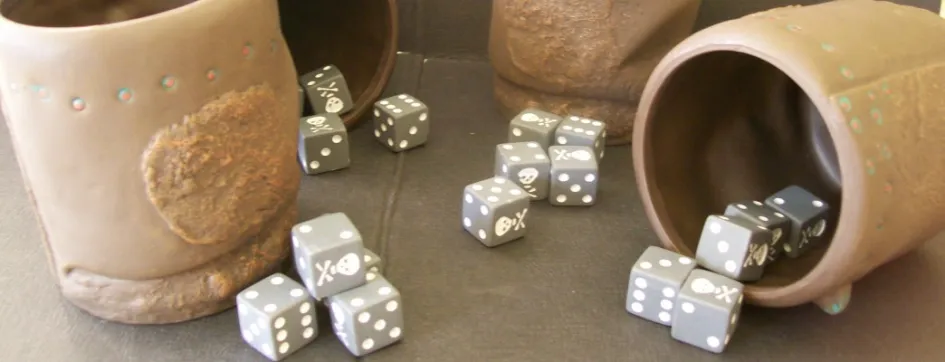

# Домашнее задание из «Уровень 5: Механика и Динамика»

В [пятой лекции](uroven-5-mehanika-i-dinamika.md) автор курса [«Основы гейм-дизайна»](http://gamedesignconcepts.wordpress.com/) [Ян Шрайбер](http://www.gamasutra.com/view/authors/916452/Ian_Schreiber.php) предложил гейм-дизайнерам поиграть с правилами «той самой странной игры на костях из Пиратов Карибского Моря» и на себе прочувствовать влияние механики на изменение ощущений от игры. Что из этого получилось — смотрите ниже.

**Базовые правила игры:**

Вот правила упрощённого варианта игры в кости под названием «Блеф» (также известной как «Лжец», но которая для большинства людей – «та странная игра с кубиками, в которую играли во вторых «Пиратах Карибского моря»):

– Игроки: 2 или более, лучше всего 4-6.

– Задача: стать последним игроком, у которого останутся игральные кости.

— Подготовка к игре: все игроки берут по 5 шестигранных костей. Хорошо, если у каждого игрока будет что-то, чем можно эти кости прикрыть, например, непрозрачная чашка, но игроки могут просто заслонять кости рукой. Все игроки бросают кости так, что каждый видит только свои, но не видит кости других игроков. Выбирают игрока, который ходит первым. Этот игрок должен сделать ставку:

– Ставки: «ставка» – это догадка игрока, о том, какие значения кости показывают _у всех игроков._ Кость, показывающая 1, считается «дикой» и может быть любым другим номером. Вы не можете делать ставку на единицы, только на двойки и выше до шести. Например, три «четвёрки» значит, что среди костей, выпавших у всех игроков, по крайней мере, три показывают 4 (или единицу).

– Повышение ставки: чтобы поднять ставку, новая должна быть выше предыдущей. Повышение числа костей всегда большая ставка, независимо от выпавшего числа (девять «двоек» – ставка большая, чем восемь «шестёрок»). Повышение выпавшего числа – большая ставка, при условии, что число костей остаётся прежним, либо больше прежней ставки (восемь «шестёрок» – ставка большая, чем восемь «пятёрок», обе выше, чем восемь «четвёрок»).

– Ход игры: на своём ходу игрок может поднять текущую ставку, или, если он думает, что предыдущая неправильная, он может поставить её под сомнение. Если он поднимает ставку, ход переходит к следующему игроку по часовой стрелке. Если ставка под сомнением, тур заканчивается, все игроки отрывают свои кости, определяется результат.

– Окончание тура: если в ставке засомневались, а она оказалась верной (например, если ставка – девять «пятёрок», а у игроков одиннадцать единиц и пятёрок в общей сложности, их действительно, есть хотя бы девять), игрок, поставивший ставку под сомнение, проигрывает и теряет одну из игральных костей. В последующих турах он будет бросать меньше костей. Если в ставке засомневались справедливо (например, если ставка была – девять «пятёрок», а на самом деле есть только восемь пятёрок с единицами), игрок, сделавший неверную ставку, проигрывает и лишается одной из своих игральных костей. Затем все игроки снова бросают свои кости, и игра продолжается с новой ставкой, начиная с игрока, выигравшего предыдущий раунд.

– Завершение игры: когда игрок проигрывает все кости, он выбывает из игры. Когда все игроки (кроме одного) проигрывают все кости, последний оставшийся – победитель.

**Новые правила:**

*   **Единица не “дикая”**

Для упрощения расчетов возможных комбинаций, игровая сессия становится короче, игроки принимают решение быстрее.

Пришли к неигровой ситуации в конце игры, когда у одного игрока один куб, у другого игрока — 4. Тому, у кого 4, выиграть **значительно** проще. С одним кубом шансов на победу не остается (при адекватном принятии решений обоими игроками).

*   **Общий пул кубов**

Для того чтобы в конце игры не получалось неигровой ситуации. Мы ввели общий пул из 5 кубов, который выбрасывался каждый ход в центре стола. И теперь игроки ориентировались не только на свои кубы, но еще и на общий пул.

В целом играть стало интереснее, но ситуация в конце, когда игроку с большим количеством кубов принимать решения значительно проще, осталась.

*   **Общий пул кубов (количество кубов равно количеству игроков)**

В центр стола теперь нужно выбрасывать не 5 кубов, а столько, сколько игроков в игре. При выбывании игрока один куб из пула убирается. Так, в конце в пуле остаются два куба. Это значительно повышает шансы на победу любого из двух игроков, оставшихся в конце.

*   **“Верю” по кругу**

Играть не на интерес, а со ставками. После заявления ставки и прогноза количества и значения кубов начинается круг торгов, когда каждый может сказать свое “верю” или “не верю”. В случае если все “верят”, следующий по кругу заявляют свою ставку (либо пасует) и так далее.

*   **Отъедание (только в совокупности с правилом “”Верю по кругу””)**

Выигрывающий раунд забирает себе кубик проигрывающего. Так, если играют четверо, то в конце оказывается, что игрок с 19 кубами играет против игрока с 1 кубом.

*   **Помощь**

У игроков есть возможность при желании делиться своими кубиками с другими игроками.

Правило “Отъедание” мы рекомендуем использовать только вместе с правилом “Верю по кругу”. Все остальные правила, внедряемые по одиночке, призваны улучшить динамику игры и нейтрализовать позитивную петлю, приводящую к тому, что проигрывающий два-три раунда подряд уже вряд ли окажется в итоге победителем.

И в принципе эти правила можно использовать в разных комбинациях друг с другом. За исключением правил “общий пул” и “общий пул, равный количеству игроков” – их совместить не получится.