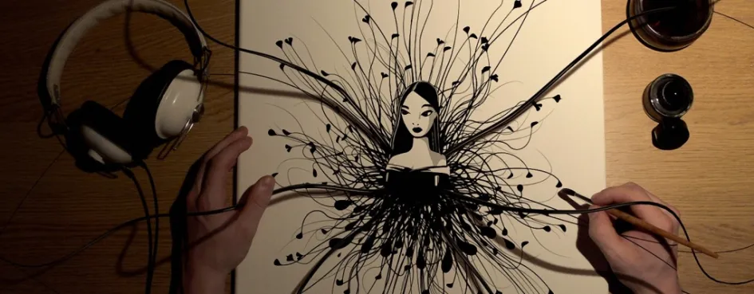
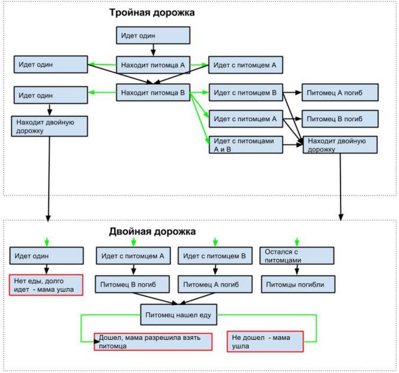
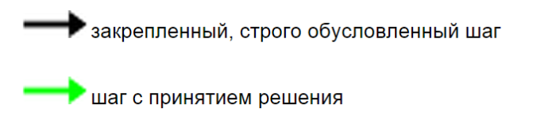

# Домашнее задание из “Уровень 6: Игры и искусство”

В [шестой лекции](uroven-6-igry-i-iskusstvo.md) автор курса [«Основы гейм-дизайна»](http://gamedesignconcepts.wordpress.com/) [Ян Шрайбер](http://www.gamasutra.com/view/authors/916452/Ian_Schreiber.php) предложил гейм-дизайнерам на практике познакомиться с играми, построенными не вокруг конкретной механики, а вокруг ощущения, мысли или идеи. Что из этого получилось — смотрите ниже.

Сегодня я предлагаю вам несколько вариантов, основываясь не на уровне вашего опыта (должен признать, что в этой сфере все мы новички, даже если мы опытные гейм-дизайнеры), а на сфере интересов. Вот четыре варианта, все основанные на «быстрых нецифровых заданиях», приведённых в конце главы в Challenges: Вариант 1 (Создание эмоций): Разработайте нецифровую игру, которая знакомит детей с идеей горя. Опубликуйте правила и необходимые компоненты. Если есть желание, можно также прикрепить комментарии о том, как вы решили эту проблему и почему, как вам кажется, ваша игра удалась (или не удалась). Вариант 2 (Убеждение): Измените настольную игру «Риск», чтобы она ратовала за мир во всём мире. Опубликуйте ваши изменения в оригинальных правилах. Если желаете, можете включить комментарии о том, чего вы хотели добиться, удалось ли вам это, и почему. Вариант 3 (Исследование границ выразительности игр): Придумайте игру, у которой будут преднамеренно неполные правила, требующие соавторства игрока в ходе игры, чтобы игра могла продолжаться. Опубликуйте свои (неполные) правила. Вариант 4 (Исследование природы игры): Выберите цифровую игру, которая кажется вам художественной и вдохновляющей. Создайте правила для нецифровой версии. Обратите внимание на то, как разница в среде влияет на игровой опыт; подумайте, какие художественные идеи лучше всего могут быть выражены в цифровой и нецифровой форме. Опубликуйте ваши правила, плюс комментарии.Домашнее задание из 'Уровень 6: Игры и искусство'

**Humans vs Nature** от Дениса Гурбика (вариант 3)

Противостояние двух сторон: человечество против сил природы.

Количество игроков: 2

**Игровые частицы**
-------------------

*   Счетчик исследований
*   Счетчик конца
*   Шестигранный кубик/монета
*   Листы действий

Введение
--------

Люди отправляют исследователей на неизведанные планеты при помощи специального портала. Их цель — найти новые планеты, пригодные для жизни людей. Для этих исследований был разработан экзоскелет, рассчитанный на приспособление человека практически к любой ситуации. У людей не так много времени, ведь планета Земля практически исчерпала свои ресурсы.

Подготовка к игре
-----------------

#### **Выбор стороны**

Игроки сами решают, кто за какую сторону будет играть. Это можно сделать при помощи кубика, монетки или любым другим удобным для игроков способом.

#### **Счетчики**

**Счетчик исследований** — имеет 5+ делений, заполняется при удачно совершенных действиях человечества. Игроки могут сами выбирать количество делений (это влияет на длину игровой сессии).

**Счетчик конца** — количество его делений равно количеству делений счетчика исследований, заполняется при удачно совершенных действиях сил природы.

#### **Противостояние**

Чтобы удачно провести исследование, человечеству нужно правильно настроить свой экзоскелет, силам природы же нужно “воспрепятствовать” исследованию и напустить страшные катаклизмы на вторженца.

**Подготовка экзоскелета** — игрок (человечество) придумывает Х (к примеру, 2) характеристик своему костюму, которые смогут помочь преодолеть все испытания со стороны сил природы.

**Подготовка препятствий** — игрок (силы природы) придумывает Х (такое же количество, как и у человечества) препятствий, которые будут мешать исследованиям.

**_Пример_**_: Игрок 1 (человечество) подготовился к отправке — у его экзоскелета есть крылья для преодоления обрывов и оврагов (или любых других целесообразных действий) и быстрые рефлексы (уклонения). Игрок 2 (силы природы) придумал планету с извергающимися вулканами — по земле течет лава, а воздух сильно заполнен серой (что делает его непригодным для дыхания)._

_Результат — Игрок 1 (человечество) удачно избежал текущей по земле лавы при помощи полета. Но его экзоскелет не смог противостоять воздуху, заполненному серой (рефлексы оказались бесполезными). Игрок 2 (сил природы) сдвигает счетчик конца._

#### Ход игры

Делится на три фазы:

**Фаза первая** — подготовка.

Игроки придумывают, как они будут противостоять друг другу, после чего записывают свои соображения на листы действий. Фаза длится 1 минуту (можно задать любое время).

**Фаза вторая** — противодействие.

Игрок 2 (силы природы) — оглашает препятствия (одно за другим, в любом порядке), которые обрушиваются на игрока 1 (человечество), тот должен удачно их избежать, используя свойства своего экзоскелета (одно за другим, в любом порядке).

**Фаза три** — смещение счетчиков.

Выигравший раунд игрок — заполняет свой счетчик.

Ходы длятся до тех пор, пока один из счетчиков не будет заполнен на 100%.

#### **Цель игры**

**Человечество** — заполнить счетчик исследований.

**Силы природы** — заполнить счетчик конца.

### Примечания

 _Нельзя повторно использовать характеристики экзоскелета и препятствия со стороны сил природы._

_В препятствиях со стороны сил природы должны присутствовать логические обоснования (в связи с чем образуется то или иное препятствие)._

**Хэппи энд** от Павла Славина (вариант 3)

**Игровая цель:** Достичь состояния счастья

**Условия победы:** побеждает тот, кто первым достигает состояния счастья (или таких может быть несколько человек).

**Количество игроков:** от 3 до 5.

**Подготовка к игре и игровые частицы**
---------------------------------------

### **Каждому из игроков предоставляется**

*   шкала собственной самооценки (1 шт.), на которой в начале игры отметка стоит посередине, метка сдвигается либо вверх (крайняя точка — счастье), либо вниз (крайняя точка — несчастье).

*   шкала отношений, направленная на одного из других игроков (по количеству других игроков), отметка стоит на середине, верхняя грань — любовь, нижняя — ненависть.

*   шкала инициативности, распределенная на три равные части (в начале игры установлена на высшей отметке).

*   1 непрозрачная банка для камней.

*   6 уникальных камней одобрения.

*   6 уникальных камней равнодушия.

*   6 уникальных камней неодобрения.

*   пистолет с двумя патронами

*   1 непрозрачный мешок, куда складывают камни другие игроки

### **Правила игры**

Игра распределена на циклы, в каждом цикле игроки должны совершить по нескольку ходов по часовой стрелке (количество ходов определяется показаниями шкалы инициативности: верхняя треть — 2 хода, средняя — 1 ход, нижняя — нет ходов).

В начале каждого цикла каждый из игроков обязан:

*   озвучить одно запретное действие, которое другие игроки не могут совершать по отношению к нему на протяжение этого цикла.
*   озвучить одно обязательное действие, которое какой-то один из игроков  обязан совершить по отношению к любому другому игроку на протяжение этого цикла.

Первенство хода определяется путем простого жребия.

Игрок сам выбирает, по отношению к какому игроку ему ходить, но нельзя по отношению к одному и тому же игроку ходить два раза подряд.

Ход представляет собой:

*   игрок совершает любое действие по отношению к другому игроку (включая выстрел).
*   игрок дает другому игроку обязательную для выполнения команду.

Игрок, по отношению к которому выполняется ход, может уклониться от выполнения команды только если выстрелит либо в того, кто на него ходит, либо в себя; в таком случае его инициативность снижается до нижней трети, и он в этом цикле больше не ходит; если он выстреливает в того, кто в него ходит, то у этого человека на пять очков снижается отношение к стреляющему. Если же игрок стреляет в себя, то у него на пять очков снижается самоощущение.

Игрок, в которого выстрелили два раза, выбывает из игры.

После совершения хода игрок, по отношению к которому был совершен ход, обязан на два деления сдвинуть свою шкалу отношения к ходящему — либо в сторону любви, либо в сторону ненависти. А все остальные игроки должны так же сдвинуть свое отношение к ходившему, но на одно деление.

После совершения каждого хода каждый из игроков, включая и самого ходившего, обязаны положить в мешок ходившего максимум два камня по собственному выбору.

После завершения каждого цикла игроки высыпают из мешков камни и считают их.

По результатам подсчета:

*   если все камни  в мешке — одобрение, то самоощущение сдвигается на два к счастью.
*   если все камни в мешке — неодобрение, то самоощущение сдвигается на три к несчастью.
*   если большинство камней в мешке — одобрение, то самоощущение сдвигается на один к счастью.
*   если большинство камней в мешке — неодобрение, то самоощущение сдвигается на два к несчастью.
*   если все камни в мешке — равнодушие, то самоощущение сдвигается на один к несчастью.

Если большинство камней одобрения у игрока в конце цикла — от какого-то одного другого игрока, то из благодарности у данного игрока сдвигается отношение к добродетелю на один к любви.

Если большинство камней неодобрения у игрока в конце цикла — от какого-то одного другого игрока, то из мести у данного игрока сдвигается отношение к добродетелю на один к ненависти.

Если в конце цикла у игрока есть с кем-то взаимная любовь, то его самоощущение сдвигается на два к счастью, но при этом у всех остальных игроков из-за зависти сдвигается отношение к одному из влюбленных на один к ненависти, плюс у обоих влюбленных на одну треть падает инициативность. Также до тех пор, пока существует взаимная любовь, каждый влюбленный должен один ход (если он возможен) в цикле посвятить своему любимому.

Если игрока кто-то ненавидит, то у него самоощущение сдвигается на один к несчастью, но на треть повышается инициативность.

**Большая потеря** от Натальи Мельничук (вариант 1)

Игроки: 1

Предыстория: Ребенок идет по дорожке — он потерялся. Мама ждет ребенка в конце пути. Ребенок устал, но ему нужно спешить, так как до наступления темноты осталось совсем немного. Если он не успеет до ночи, мама не увидит его в темноте и он потеряется навсегда.

Участники: ребенок (делает ходы и принимает решения), ведущий (описывает положение дел, озвучивает персонажей).

Материалы, оборудование:

*   Карта, на которой нарисована дорожка между деревьями на 20 ходов (клеточек, каждая из которых разделена тонкой пунктирной линией). Дорожка сначала (первые 10 ходов) имеет три клеточки в ширину, затем — две.
*   Фишка игрока (розовая или белая перламутровая пуговица).
*   Фигурки персонажей (котенка и щенка) — выполнены максимально реалистично и привлекательно.
*   Единицы еды — фишки/горошины, печеньки и т. п.

Правила:

*   У ребенка ограниченное количество шагов (25), если он за эти шаги не дойдет до мамы, то стемнеет — и он не найдет маму (проиграет).
*   Ребенку нужна еда — если он не ест, то делает только полхода за один шаг, а значит — тратит больше шагов.
*   У ребенка в запасе 14 единиц еды, каждый шаг он тратит единицу еды на себя. Если с ним идет кто-то еще, то также единицу еды на каждого из спутников.
*   Ребенок может взять с собой столько спутников, сколько свободных клеточек на дорожке, по которой он идет (на дорожке из трех клеточек — двух спутников, на дорожке из двух клеточек — одного спутника).
*   Ребенок может ходить вперед или назад (т. е. он по желанию может вернуться за спутником).
*   Ребенок может брать с собой спутника.
*   Ребенок может оставить спутника в любой момент.
*   Если спутника не кормить 4 хода, он умирает. Каждый ход ведущий описывает ухудшающееся состояние спутника.
*   Второй запас еды (еще 26 единиц) может обнаружить только спутник ребенка.

Цель: дойти до конца карты не более чем за 25 ходов, сохранив жизнь питомцу.

Алгоритм развития событий в игре:

**А-ля Тамагочи** от Татьяны Дудко (вариант 1)

**Необходимые компоненты:**

*   игровое поле (расчерченная “дорожкой” на квадраты карта)
*   кубик-шестигранник
*   пять таблеток (витаминки, чтобы ребенок даже если съест, не причинил себе вреда)
*   три фигурки: щенок, щенок-подросток, взрослая собака (или фигурки разной величины — маленькая, средняя, большая; любые животные)

**Правила:**

Изначально ребенку дается щенок (котенок, хомячок, крысик) — это его домашнее животное. Бросая кубик, малыш ходит фигуркой на то количество шагов, какое выпадает на кубике. Все квадраты маркированы: еда (косточка, молоко и т.д.), туалет (например, унитаз), постелька (сон), игра (бабочка, мячик), прогулка (поводок) и т. д.

Ходя шаг за шагом, ребенок растит своего питомца, ухаживает за ним. Пройдя треть игрового поля, маленькая фигурка заменяется на среднюю (питомец подрос), две трети — большая фигурка (питомец вырос, стал взрослым).

Периодически на поле встречается квадратик “болезнь”. Ребенок использует таблетку, чтобы вылечить любимца. Если использованы все пять таблеток, питомец умирает. Малыш испытывает чувство утраты, горе.

Если ребенок впечатлителен, собачку лучше заменить на фигурку кота и объяснить, что по легенде у кошек 9 жизней.

Игру можно начать сначала (если ребенок хочет).

Если таблетки не использованы до конца игрового поля, родитель хвалит ребенка за то, что он хорошо заботился о своем любимце и объясняет, что могло бы случиться с щенком/котенком/хомячком, если бы таблетки закончились.

**Настольный вариант Madrid** от Никиты Прохорова (вариант 4)

По условию задачи, необходимо было выбрать цифровую игру, которая представляется художественной и вдохновляющей. И создать правила для нецифровой версии. Выбор пал на игру Гонзало Фраски _Madrid_.

#### **Описание цифровой игры**

В цифровой игре Madrid необходимо как можно быстрее кликать мышью по гаснущему пламени свечей, которые держат в руках люди, одетые в футболки с принтами “I love … (название города или штата)”. При этом отчетливо слышно дуновение ветра. И пламя гаснет очень быстро. Невзирая на наличие в левом нижнем углу экрана полоски, заполняемой желтым цветом при нажатии на огоньки свечек (и опустошаемой при бездействии), я считаю, что выиграть в _Madrid_ невозможно. Идея передается через геймплей. Пока игрок действует и готов поддерживать пламя, что-то происходит. Когда игрок перестает это делать, все заканчивается.

#### **Правила для настольной версии**

Количество игроков — 2. И сколько угодно зрителей.

На стол выкладывается игровое поле с 20 изображениями людей, держащих в руках свечи. (Значение игрового поля — символическое). На футболке каждого из них написано только “I love…”.

Один из игроков начинает писать на небольших листках произвольные понятия, которые можно любить. Что угодно. “Жить”, “собака”, “писатели”, “люди”, “физика” и т. д. И раскладывает эти карточки на картинки с людьми со свечами.

Второй игрок поднимает карточку и читает понятие. Ему дается не более 10 секунд на размышление, и он должен в нескольких предложениях объяснить, почему он любит то, что прочитал на карточке. Даже если он это не любит. Если игрок отказывается от этих действий, не хочет “любить”, то игра заканчивается. Если игрок тратит больше 10 секунд и понимает, что ему нечего сказать — “пламя гаснет”, игра заканчивается.

Если игрок объяснил, почему он любит, карточка удаляется с поля, и больше это понятие в данной игровой сессии не должно повторяться.

Тем временем первый игрок продолжает выкладывать карточки. Если он устал придумывать понятия, игра заканчивается (когда второй игрок объяснил свою любовь к последнему лежащему на поле понятию).

#### **Комментарий**

В цифровой игре игрок может взаимодействовать с системой (пусть и примитивной), и она каким-то образом реагирует, из чего и складывается геймплей, через который передана идея.

В нецифровой же игре я предлагаю вместо взаимодействия с системой включить взаимодействие игроков друг с другом. Но при этом идея также будет передана через непрерываемый геймплей, который заканчивается сразу, как только кто-то из игроков “устал” и отказывается продолжать “поддерживать пламя”.

Как и в цифровой вариант игры, который можно перезапускать бесчисленно много раз, заново начинать играть в настольную версию можно бесконечно. При этом будет неплохо, если игроки перед началом новой сессии уберут с поля все карточки, поменяются ролями, и один из них тут же начнет выкладывать неиспользованные листки, а также писать новые.

Если в процессе игры получится так, что игроки и зрители станут весело смеяться над тем, что вслух говорит один из них, то это, на мой взгляд, вполне неплохое развитие событий.

**ММОРПГ** от Вячеслава Золотовского (вариант 3)

#### **Поле и объекты:**

*   Поле 20х20 с 4 замками по краям.
*   Фишки разных цветов.
*   Карточки, с одинаковой рубашкой:

*   Пустые карточки, на которых можно рисовать — может быть любой карточкой, монстром, ресурсом или объектом. Определяется игроками заранее.
*   Синие — карточки, дающие ману.
*   Желтые — карточки, дающие золото.
*   Черные — карточки, дающие руду.
*   Красные — положительный или отрицательный эффект определяется игроками.
*   Зеленые — положительный или отрицательный эффект определяется игроками.
*   Карточка с надписью “М” — сражение с монстром.
*   Карточки монстров — название, арт и сила монстра.
*   Карточки предметов и магии — карточки с указанием предметов, их характеристик и стоимости.

#### **Начало игры**

В начале игры игроки должны договориться о правилах победы. Примеры: собрать Х ресурсов, убить конкретного монстра, захватить Х объектов.

Затем каждый игрок выбирает себе фракцию.  
Доступные фракции: Эльфы, Гномы, Орки, Люди.  
Каждая фракция обладает своими плюсами и минусам, которые определяет игрок, плюсов может быть не больше одного. Если плюсов больше, то должны быть наложены и соответствующие минусы. Примеры плюсов: герой ходит на 1 клеточку больше, но имеет минус 1 к атаке; гномы получают на 10 больше золото при нахождении желтой карты.

После чего берутся все карточки, доступные в игре, перемешиваются и выкладываются на поле рубашкой вверх.

Далее определяется, кто первый ходит. По броску кубика — кто выбросит больше. В случае если два или более игрока выкинули одинаковое наибольшее число — происходит переброс кубика между этими игроками.

#### **Ход**

В свой ход игрок может:

*   Передвинуть фигурку своего героя на одну клеточку.
*   Улучшать строения в своем замке или покупать/создавать предметы.

Наступая на клеточку с закрытой картой, игрок обязан перевернуть ее рубашкой вверх и получить то, что на ней находится.

Синие, Желтые, Черные — получить ресурсы. Ресурсы хранятся на фишке персонажа, до тех пор пока не будут отнесены в замок — убивший эту фишку получает все ресурсы, которые она несла.

Карта “М” — игрок вытягивает карточку монстра из колоды монстров и сражается с ним. За победу или поражение получает награду или наказание.

#### **Строения**

В своем замке игрок может строить здания: кузня, башня магов и таверна.

В кузне игрок может производить доспехи и оружие, дающее плюсы к атаке.

Башня магов — позволяет создавать заклинания, которые можно использовать в бою или вне боя, в зависимости от заклинания.

Таверна — позволяет нанимать большее количество героев.

Каждое здание стоит ресурсы.

Кузня стоит — 100 камня и 100 золота.

Башня магов — 50 камня, 100 золота, 50 маны.

Таверна — 100 камня и 150 золота.

Здания можно улучшать, каждое улучшение стоит в 2 раза дороже предыдущего.

Улучшение зданий позволяет:  
кузня — каждый уровень кузни позволяет создавать предметы, дающие модификаторы, равные уровню здания;

башня магов — позволяет создавать заклинания, равные уровню башни;

таверна — позволяет нанимать дополнительных героев, максимально доступное количество дополнительных героев равно уровню таверны

#### **Передвижение**

Игрок может передвигать своего героя по умолчанию на одну клеточку в ход, если нет заклинаний или предметов, увеличивающих их количество.

На одной клетке может находиться только одна фишка игрока.

Если один игрок наступает своей фишкой на фишку противника — начинается бой.

#### **Бой**

Бой происходит посредством броска кубика участниками сражения. У кого будет наибольший результат с учетом всех модификаторов, тот является победителем.

Использование заклинаний в бою — в любой момент боя, до броска или после броска кубика, игроки могут использовать заклинания, на которые тратят ману.

Победивший игрок занимает клеточку проигравшего, а фишка проигравшего переносится в свой замок.

Победивший получает все ресурсы и одну случайную вещь проигравшего.

#### **Победа**

Как только выполняются заранее оговоренные условия победы, игра заканчивается.  
Игрок, выполнивший условия победы, выигрывает.

**Испытание** от Андрея Муренко (вариант 1)

#### **Критерии**

Целевая аудитория — дети в возрасте от 4 до 7 лет;

Основные жизненные ценности ребенка — наличие родителей, сытость, тепло, сухость, игрушки (игры);

Основные способы восприятия ребенка — картинки, образы и слова (чтение текста вслух);

#### **Правила**

Игровое поле — настольная игровая карта в виде города (аналогичная этой [http://img-fotki.yandex.ru/get/5407/geekblog.2/0\_5a90e\_63e76242\_L.jpg](http://img-fotki.yandex.ru/get/5407/geekblog.2/0_5a90e_63e76242_L.jpg)). Во время игры ведущий достает карточки, каждая из которых описывает ситуации, возникающие когда ребенок не слушается родителей, делая по-своему, что в итоге приводит к печальным последствиям. Длина хода определяется броском 6-гранного кубика (если игроков несколько, игроки ходят по очереди). В случае если игрок правильно ответил на вопрос в карточке, он продвигается дальше; в случае если ответ был неправильным, возвращается в точку старта.

Цель игры — научить ребенка слушаться родителей и поступать правильно. В процессе игры родитель создаст у ребенка четкую причинно-следственную связь между поступком и результатом.

Ход игры — взрослый зачитывает описание ситуации и показывает ребенку иллюстрацию. Ребенку предлагается выбрать один из вариантов действий, после чего взрослый в зависимости от выбранного ответа зачитывает текст о соответствующем развитии ситуации.

Атрибуты — карточки с текстом и картинкой, моделирующие ситуации, в которых может оказаться ребенок в случае, когда предпринимает неправильные действия. Ситуации акцентируют внимание на тех моментах, которые могут действительно напугать или расстроить ребенка, при этом не травмируя его психику.

#### **Примеры ситуаций**

Вариант 1:

Мама с ребенком находятся на вокзальной площади в большом скоплении людей, мама покупает билеты в кассе и теряет ребенка из вида, в толкучке ребенок и родитель оказываются вне видимости друг друга.

Предлагаемые действия:

1.  Стоять на месте, громко кричать и звать маму, привлекая внимание;
2.  Пойти искать маму;
3.  Взять за руку первого попавшегося взрослого и пойти за ним.

Последствия выбора:

1.  Мама услышит ребенка и найдет его по слуху (в крайнем случае подойдет полицейский, после чего дадут объявление по громкой связи);
2.  Ребенок потеряется, заблудится и не сможет найти свою маму. Вплоть до того что окажется совершенно один в незнакомом городе;
3.  Ребенок попадет в совершенно незнакомую семью к злым людям и вообще никогда не увидит свою маму (как вариант — попадет в интернат к другим бесхозным детям).

Вариант 2:

Во время прогулки к ребенку подходит взрослый и предлагает прокатиться на его классной машине, взрослый также предлагает ребенку конфету.

Предлагаемые действия:

1.  Отказаться от конфеты и пойти по своим делам/домой;
2.  Взять конфету, но отказаться идти со взрослым;
3.  Взять конфету и идти кататься со взрослым.

Последствия:

1.  Правильный ответ, данная ситуация не несет негативного подтекста.
2.  Ребенок съест конфету со снотворным и окажется в руках похитителя. Его будут держать в плену, требуя от родителей выкуп.
3.  Аналогично пункту 2. Возможен вариант со смертью ребенка от рук маньяка-детоубийцы.

Данная игра может показаться достаточно жесткой по отношению к ребенку, однако, она должна донести до ребенка мысль, что мир не добрый и пушистый и что от действий ребенка зависят его личное благополоучие и благополучие всей семьи.

**Модификация** от Александра Малькова (вариант 4)

Как можно позволить игрокам додумывать правила, но чтобы игра при этом осталась игрой?

1.  Правила должны быть чем-то ограничены. Должно быть какое-то прописанное правило, препятствующее созданию хаоса.

2.  Каждое правило (в т. ч. и новое, придуманное) должно быть применимо ко всем игрокам.

Мой вариант — это не игра, а модификация любой соревновательной игры. Пускай при определенных условиях (секреты, игровые достижения) игроку выпадает “Сфера Создателя”. Подобрав её, он активирует “запись событий” — все события, которые произойдут с данным игроком (получение урона, получение денег, использование умений, получение эффектов от примененных к нему умений и т. п.) за Х секунд (кроме перемещений). После окончания “записи” игрок может привязать их к одной из кнопок своего управления.

Таким образом, получено новое правило — что произойдет с игроком при нажатии соответствующей кнопки. Также это правило должно распространяться на всех игроков.

На примере DOTA:

При убийстве Рошана команде выпадает “Сфера Создателя”. Игрок её подбирает и выполняет цепочку действий: кастует все скилы; его бафают союзники; умирает и т. п. Затем игрок привязывает эту “запись” к кнопке любого скила. Теперь у всех игроков в игре при нажатии скила в соответствующем слоте проиграется эта цепочка действий.