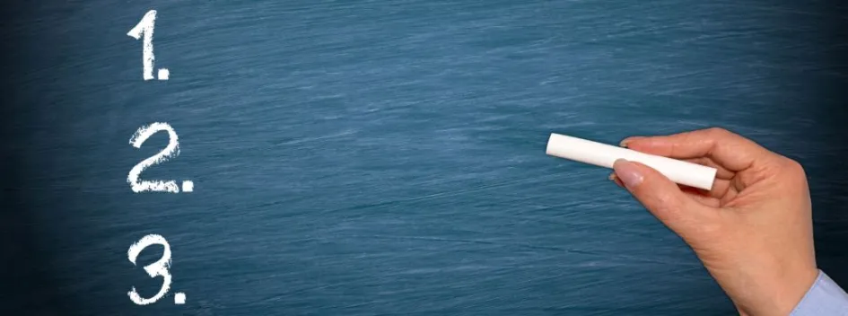

# Домашнее задание из “Уровень 7: Процесс принятия решений и теория потокового состояния”

В [седьмой лекции](uroven-7-protsess-prinyatiya-resheniy-i-te.md) автор курса [«Основы гейм-дизайна»](http://gamedesignconcepts.wordpress.com/) [Ян Шрайбер](http://www.gamasutra.com/view/authors/916452/Ian_Schreiber.php) предложил гейм-дизайнерам поэкспериментировать с влиянием правил на значимость принимаемых игроком решений. 

Андрей Муренко

Изменение правил игры:

1.  Игроки ходят по очереди, правило первого хода определяется броском монетки или по договоренности.
2.  Каждый раунд между игроками происходит «Война», где игроки выкладывают 3 карты по одной. Обороняющийся игрок может прервать раунд, сказав «пас», тогда атакующий перестает выкладывать карты и ему засчитывается победа.
3.  Каждый игрок за победу получает очки, равные сумме победивших карт (ценность карт аналогична ценности в игре в «очко»).
4.  Для победы игрок должен либо оставить соперника без карт, либо набрать определенное количество очков. При этом, в игре существует «мертвая зона» и перебор. В случае с мертвой зоной — это определенное кол-во очков, набрав которые игрок сбрасывает свой счет в ноль. Перебор дает игроку штраф в размере х10 от полученных за победу очков.

Денис Гурбик

Изменение правил игры:

1.  На стадии “война” — проигравший сражение игрок имеет право “повысить ставку”. Он может выбрать одну из 3-х его карт лежащих лицом вниз в качестве замены его проигравшей карты. В случае победы он получает все карты, в случае поражения он отдает еще 3-и карты противнику.
2.  В дополнение к первому “Давид и Голиаф” — двойка способна победить туза, тройка способна победить короля, четверка способна победить даму, пятерка способна победить валета.

Александр Атаманчук

*   Каждый ход игроки сначала берут каждый из своей колоды по одной карте на руки (не показывая противнику, но открывая для себя). Карты с ходом игры можно накапливать без ограничения.
*   Далее, игроки выкладывают из своих колод по одной открытой карте на стол и карты играются (как в описанных классических правилах).
*   Игрок с проигрышной картой может попробовать перебить карту соперника из карт на руках. Противник, соответственно, может сделать то же самое в ответ на новую выброшенную карту (если есть чем). И так, до тех пор, пока у кого-то не будет более высоких карт или если игрок не захочет перебивать.
*   Так же можно не перебивать карту более высокой, а выкинуть равнозначную карту и тогда начнется война — по классическим правилам, с той лишь разницей, что карты также можно перебивать из набранного пула на руках.
*   В момент, когда у одного игрока заканчивается отбой, но есть еще карты на руках, при следующем ходе соперник вытягивает у него с рук рэндомную карту и играется она (далее все по вышеописанному алгоритму).
*   Проигрывает тот, у кого не осталось на руках карт (все забрал игрок или не хватает карт, чтобы выложить на стол во время войны).
*   Важно: каждый раз, как отбой становится колодой — он тасуется.

Никита Прохоров

У игроков появляется возможности использовать следующие скилы:

**“Угадывание”**

Перед ходом игрок может заявить о желании угадать значение карты противника (без угадывания масти). Если не угадывает, то бесплатно отдает свою карту. Также тот, чью карту угадали, может ответить: попытаться угадать карту угадавшего. Если ему это удается, он сохраняет свою карту. Если не удается, то он должен отдать две карты.

Если каждый из игроков желает в ход угадывать карту противника первым, то бросается дайс.

**“Сбор иммунитета”**

Игрок может принять решение собрать 4 карты всех мастей. Собирать в этот пул можно только с отбоя. Если игроку удается собрать пул, то он получает иммунитет на 5 ходов. Это означает, что при обычных ходах, а также при “Угадывании” и при “Понижении”, игрок 5 раз может (если хочет) не потерять свою карту в тех случаях, когда должен был потерять. Когда 5 “иммунитетных” ходов потрачены, игрок продолжает игру так же, как играл до сбора пула из 4 мастей.

Собранный четырехкарточный пул остается лежать отдельно до конца игры, не попадая ни в чью колоду.

Игрок не может собирать одновременно сразу несколько пулов иммунитета. Если он начал собирать, например, восьмерки, но решил вдруг собирать королей, то должен передать собранные восьмерки противнику. Передавать карту из пула можно не больше одной за ход и только в том случае, если игрок в этом ходу и так уже отдает свою карту (карта из пула идет в довесок).

**“Честный обмен”**

5 раз за игру игрок перед ходом может предложить обмен карт. При этом если карта предлагающего на три значения меньше, чем карта противника, то предлагающий отдаст свою карту бесплатно.

Если каждый из игроков хочет быть в этом ходу предлагающим обмен, бросается дайс.

**“Понижение”**

За всю сессию игрок может по одному разу понизить значение карты противника (до того, как увидит ее, то есть перед открытием) на 1, на 2, на 3, на 4 и на 5.

Наталья Мельничук

*   **Игра с планированием.** Делим колоду на две равные части и раздаем части игрокам. Перед началом игры участники имеют возможность перераспределить карты в своей части колоды наиболее удобным для себя способом. Затем игра проходит в рамках своих обычных правил.
*   **Игра-подстава.** Вариация предыдущего правила: делим колоду на две равные части и раздаем части игрокам. перед началом игры участники имеют возможность перераспределить карты в колоде, но затем они обязаны обменяться колодами. Затем игра проходит в рамках своих обычных правил.
*   **Игра с решением каждый ход.** К обычным правилам игры добавляется возможность каждый ход перед тем, как выложить карту на “поле боя” посмотреть на нее и решить, будешь ли ты ее выкладывать или возьмешь следующую.
*   **Игра с “таблетками”.** К обычным правилам игры добавляется следующее: игрок, проигравший три раза подряд, получает “таблетку” в виде возможности один раз понизить карту соперника. Игрок самостоятельно решает, когда ему применить “таблетку”. “Таблетки” могут накапливаться. Игрок может применить в один ход сразу несколько таблеток.

Александр Мальков

*   **“Второй шанс”.** Игроки ходят по-очереди. Они всё так же одновременно открывают верхние карты, но тот игрок, чей ход идет, может принять решение открыть ещё одну верхнюю карту (карта “второго шанса”). В этом случае новая карта “сражается” вместо той, что была открыта в начале хода. Победившая сторона забирает себе в отбой все эти 3 карты. В случае “спорной” ситуации это правило не действует.
*   **“Выбор за победителем”.** В конце каждого раунда, победитель, вместо того чтобы забрать “воевавшие” карты себе в отбой, решает кто их заберет.

Павел Славин

1.  Когда у игрока появляется отбой, он может строить из карт отбоя крепость. В зависимости от того, сколько этажей в крепости, столько очков добавляется к значимости карты при каждой битве.
2.  Игрок может строить несколько крепостей
3.  если игрок построит трехэтажную крепость из карт только одной масти, то эта масть становится козырной (только для данного игрока), при выпадении у данного игрока карты этой масти, она бьет все другие масти
4.  Если у обоих игроков есть козырные крепости, то козырной считается крепость, которая выше в этажех или при равной этажности содержит больше карт.
5.  карты отбоя, которые не задействованы в строительстве крепости, можно наугад выбирать карту-камикадзе после перемешивания свободного отбоя. порядок использования карты-камикадзе — после того, как игроки в битве вскрыли свои карты, проигрывающий игрок может выбросить камикадзе — и если после ее вскрытия, она оказывается сильнее, чем карта соперника (с учетом крепости соперника), то соперник закрывает ее и перемещает в конец своей колоды, карта проигравшего идет в его отбой, а камикадзе выкидывается в т.н. отбой героев.
6.  если игроки выбрасывают одинаковые карты, очки крепости не учитываются
7.  после того, как у игрока заканчиваются карты (ли не хватает для войны), то карты и для проигрывающего, и для выигрывающего игрока берутся из отбоя героев.