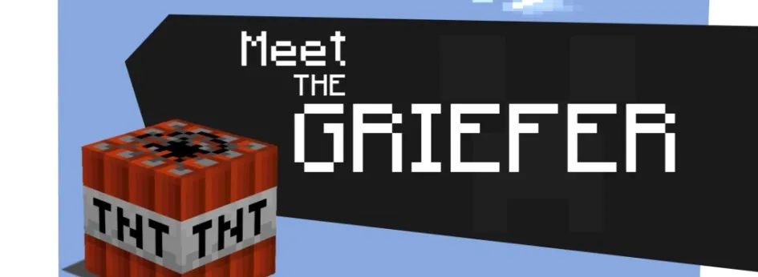

# Домашнее задание из “Уровень 8: Виды интересного, виды игроков”

В рамках [изучения разных видов «интересного»](uroven-8-vidy-interesnogo-vidy-igroko.md), Шрайбер предлагает задуматься над игрой, сам концепт которой будет привлекателен для гриферов. 

Давайте попрактикуемся в поисках механики, которая возбуждает определённый вид интереса. А рассматривать мы будем **гриферство** (то есть, получение удовольствия от того, что ты портишь его другим).

Создайте идею игры, которая специально построена так, чтобы привлечь гриферов (то есть тип «убийцы» из классификации Бартла). Разместите на форуме. **Вам не надо создавать правил для этой игры.** Просто концепт, который содержит информацию достаточную для того, чтобы представить себе игровой процесс.

Ваша публикация должна содержать следующее:

— Для какой среды, для какой платформы. Игра для ПК? Для консоли? Настольная, карточная? Ролевая?

— Число игроков

— Один-два параграфа с описанием вашей идеи

— Ещё один параграф, описывающий, почему этот концепт заинтересует целевую аудиторию.

Поместите на форуме, который больше всего подходит по описанию к вашим навыкам и опыту в области дизайна:

Начинающий, мало или совсем нет опыта дизайна до этого курса.

Средний, исполнение заданий в ходе курса и небольшой опыт гейм-дизайна, но мало или совсем нет опыта профессионального дизайна.

Продвинутый, по крайней мере, небольшой опыт профессионального дизайна (есть изданные работы).

### Результаты

А. Атаманчук

**Для какой среды, для какой платформы**: Игра для ПК, многопользовательская.

**Число игроков:** не ограничено (разве что мощностями серверов).

**Идея игры:** Игроки строят свои города, начиная с маленькой деревушки, стремясь развить огромный мегаполис. При этом у каждого игрока есть возможность помогать или пакостить другим игрокам. Пакостить можно несколькими способами: заслать поджигателя, инфицировать вирусом жителей, генетически вывести Годзилу и послать его разрушать город, и т.п.

**Чем заинтересует:** Предполагаемая игра заинтересует целевую аудиторию потому, что смотреть, как разрушается сложная структура другого человека, на которую он потратил много сил и времени, для гриферов — сплошное удовольствие. Особенно, если это большая Годзила, смачно крушащая все вокруг. Основные инстинкты, задействованные в игре: собирательство, организация пространства, соперничество, злорадство и чувство превосходства.

Т. Дудко

**Для какой среды, для какой платформы**: для ПК, он-лайн игра

**Число игроков**: бесконечное множество

Виды интересного, помимо гриферства: вызов (соревнование), организация пространства, развитие

**Идея игры:** Игра по типу “ферма”, только с возможностью разрушать имения соседей.

В играх такого типа ты развиваешь свою ферму в том числе за счет друзей, участников сообщества: просишь у них ресурсы, собираешь их урожай/кормишь животных, получая опыт/монеты/определенный ресурс.

Эта игра трансформирована таким образом, чтобы возможно было разорять огороды/сады соседей, ломать коровники/кошары/пекарни и т.д. Цель — не дать соседу развиваться и достигать следующих уровней как можно медленнее.

В то же время, чтобы подобное не происходило на вашем участке (так как соседи могут напакостить и вам), в игре можно ставить ловушки, нанимать охрану, подключать к зданиям сигнализацию, обрабатывать растения химикатами, расставлять электрошокеры, добавлять в воду животным противоядие и т.д. (все это покупается за внутриигровую валюту).

То же самое, естественно, будут делать и соседи, поэтому разоряя чужие огороды, можно попасть впросак.

**Чем заинтересует:** игра построена на основных инстинктах:

*   собирательство
*   выживание
*   соперничество
*   жадность и зависть (что и заставляет людей пакостить другим — гриферство)
*   обретение **шаденфрюде** (нем. “Schadenfreude”) – чувство злорадства, когда твоему сопернику что-то не удаётся.

Игра, скорее всего, привлечет не только “убийц” (гриферов), но и такой тип игроков, как “целеустремленные”. Вполне вероятно, что они не воспользуются возможностью грабить и разорять имения других, но поставят цель — во что бы то ни стало создать идеальную ферму, несмотря на козни соседей (обезопасив себя ловушками и другими средствами).

Д. Гурбик

**Для какой среды, для какой платформы**: для ПК (многопользовательская)

**Число игроков:** Максимально поддерживаемое сервером

**Идея игры:** Симулятор жизни человека (без ограничений). Игрок начинает младенцем (перемещается по комнате и играет в мини игры, получая за это опыт), затем он продолжает расти от накопленного опыта. В зависимости от возраста, может изменятся геймплей — у игрока будут появляться новые механики взаимодействия с миром в зависимости от его возраста и степени развития.

**Чем заинтересует:** Игроки смогут досаждать другим игрокам любыми понравившимися методами (грабить, убивать, мешать развиваться и т.д.), данная игра даст огромный простор для гриферства, ибо у них здесь будет весьма мало ограничений.

С. Смородин

**Для какой среды, для какой платформы**: для ПК, ММО-экономика

**Количество игроков:** от 4-х до бесконечности

**Идея:** Экономическая игра, цель которой состоит в объединении в альянсы и кооперативном сооружении так называемых Бастионов, которые сражаются между собой. Для сооружения Бастионов лидеры Альянсов должны собрать у себя большое количество ресурсов, которое невозможно нафармить самостоятельно. Для сбора необходимого количества ресурсов участники альянса отправляют караваны с ресурсами (каждый игрок отвечает за свой ресурс/ресурсы) к лидеру альянса.

Любой игрок, не состоящий в каком-либо Альянсе, может инкогнито перехватить Альянс и сжечь его, затратив при этом на перехват количество ресурсов равное количеству ресурсов в караване+10%.

**Чем заинтересует:** Игра заинтересует игроков-исследователей и игроков-собирателей. Также игра будет интересна игрокам-стратегам(руководителям / менеджерам проектов), который будут заниматься своим любимым делом — распределением задач между игроками Альянса.

Гриферов эта игра может заинтересовать по причине того, что не вступая в альянсы, они могут выступать в роли разбойников только из любви к разбойничьему делу (**ГРАБИТЬ КОРОВАНЫ!**), так как уничтожение каравана не принесет им никакого профита.

В. Золотовский

**Платформа:** ПК, ММО

**Число игроков:** от 5+

**Идея:** Дарк фентезийная ммо с мрачными сюжетными квестами, брутальными образами монстров и персонажей, открытым миром с ограниченным количеством аутдор боссов, в котором каждый игрок потенциально твой враг или конкурент.

В данной игре точки конфликтов и грифинга будут создаваться за счет ограниченности ресурса — боссов и монстров, которые будут нужны для выполнения квестов. Игроки должны будут сбиваться в группы, что бы противостоять гриферами или конкурирующим за монстра группам. Чем больше народу будет играть в данную игру, тем ценнее будет ресурс в виде боссов.

**Чем заинтересует:** Игра заинтересует общительных людей, т.к. из за того что боссы будут ограничены, а без них дальнейшая прокачка или оптимизация персонажа невозможна, им придется объединяться в группы.  
Игра привлечет целеустремленных игроков, которые захотят добиться цели стать лучшим игроком или группой игроков на сервере, потому что чем больше людей будет играть на сервере — тем эта цель будет труднее. Стать лучшим в чем-то, в такой игре превращается в достойный и сложный вызов.

Игра привлечет гриферов, т.к. в игре можно будет блокировать убийство босса/монстра другим персонажам, более низкого уровня.

А. Мальков

**Среда, платформа**: для ПК, онлайн игра

**Количество игроков:** от 4-х до бесконечности

**Идея:** MMORPG, на манер WOW, но со свободным PvP (все могут сражаться со всеми), которое, к тому же, награждается. Глобальная смерть персонажа (сброс всех достижений). Возможность маскироваться под мобов или предметы окружения (деревья сундуки и пр.), на манер мимка.

**Чем заинтересует:** Игроки могут мешать друг другу развиваться, устраивать разнообразные подлые ситуации.

А. Муренко

**Платформа:** ПК

**Число игроков:** 10 (5х5)

**Идея:** 3D шутер. Идея заключается в том, что в игре есть прокачиваемые очки кармы (героизма), открывающие доступ к новому оружию, скинам и прочее.. Для получения очков, игрокам нужно будет выполнять мини-квесты и достижения, доступные один раз за игровую сессию. Другие игроки могут мешать игроку выполнять задания, посредством убийства спасаемых заложников, прерывания уроном каста установки бомб, разрушения защищаемых объектов и т.д. Таким образом, потратив своё время и игровые ресурсы (патроны, мины, деньги) игрок-гриффер может полностью обломать команде союзника выполнение достижения или квеста.

**Чем заинтересует:** Игрок может с помощью стандартных игровых механик полностью блокировать другим игрокам выполнение заданий, вызывая тонны ненависти в свой адрес. Такие действия сводят на нет старания других людей и обесценивает потраченное ими на игровую сессию время (что является для пострадавших игроков вполне реальной ценностью), не давая получить ощущение «**фьеро» и**, в свою очередь испытывая чувство **шаденфрюде.**

Н. Прохоров

**Для какой среды, для какой платформы**: ПК, консоли, планшеты.

**Число игроков:** 2-4.

**Идея игры:** На экране игрок видит классическое матч-3 поле. В эту игру можно играть соло, но если есть желание, то можно и вместе с 2-3 другими людьми. Тогда экран делится на соответствующее количество частей (для удобства возможны варианты с масштабируемостью величины экранов других игроков). Все стартуют в один момент, у всех один и тот же уровень с одинаковым рандомизатором.

Это не соревнование, у каждого из игроков — своя задача (накопить определенное число элементов, спустить детали вниз, разбить все блоки и т. п.). Но при этом на поле время от времени выпадают гриферские блоки, собирание которых в 3, в 5, в Т- и L-образные формы портит жизнь игроку на другом экране (блокирует треть поля, смешивает цвета, делает определенный цвет “каменным” и т. д.). Если кто-то из игроков не завершает партию, то из оставшихся выбирается активировавший наибольшее количество гриферских блоков, и ему начисляется очко доминатора.

**Чем заинтересует:** При наличии в данной игре рейтингов, системы уровней игроков и прокачки, открывающей доступ к бонусам; при наличии доната, за который можно купить те же бонусы, с помощью которых проще достигать завершения уровня, альтернативная цель — насолить другим игрокам — в определенный момент может заинтересовать огромное количество людей, которым становится скучно соединять по три в ряд в одиночку.

П. Славин

**“Зов Богини”**

**Для какой среды, для какой платформы**: для ПК, возможен перенос на мобильную платформу.

**Число игроков:** многопользовательская, неограниченное количество (ограничено производственными возможностями сервера)

**Идея игры:** уровень представляет собой скалистую крутую гору конической формы. На вершине стоит (лежит, сидит) сексуальная прекрасная богиня и манит игрока к себе. Цель уровня — добраться на вершину горы и встретиться с богиней, которая предоставит что-то очень приятное (поцелуй, благодать и т д). Игрок взбирается на гору, при этом со всех сторон горы к этой же богине взбирается множество остальных игроков. Все игроки имеют возможность нападать друг на друга и сбрасывать друг друга со склона, при этом воспроизводятся зрелищные анимации падения, качения, травм.

**Чем заинтересует:** Возможностью вредить конкурентным довольно агрессивным и показательным способом, возможностью наблюдать как другие катятся вниз в результате действий игрока, при этом он сам продолжает восхождение к цели.

Н. Мельничук

1.  **_Веселый цветник_**

**Для какой среды, для какой платформы**: игра для ПК

**Число игроков:** ограничено — 5-8 человек;

**Описание идеи:** участники, имея ограниченное число ресурсов, выращивают свои супер-цветники. Помимо возможности тратить свои ресурсы непосредственно на супер-цветник, они также могут инкогнито тратить их на “мелкие пакости” по отношению к другим игрокам.

Более полно идея гриферства и возможность получения приятных эмоций от гриферства в игре будет реализована при наличии чата, а также если указанный выше игровой элемент будет не постоянным, а временным: например, в игре объявляется конкурс на лучший цветник для выставки и одновременно для участников открываются дополнительные возможности.

**Чем заинтересует:** ЦА — домохозяйки. Причины, по которым может заинтересовать**:** возможность не выдавая себя осуществить типичное нереализованное желание принизить достоинства соперницы.

2.  **_Гадкие казаки-разбойники_**

**Для какой среды, для какой платформы**: дворовая игра

**Число игроков:** 10-20

**Описание идеи:** Общая часть — участники делятся на две команды — казаки и разбойники. Разбойники убегают и прячут “награбленное”, оставляя каждые _x_ метров (по договренности) “метки” (подсказки направления), казаки выжидают условленное время (по договоренности — 10-20 минут) и идут искать спрятанный предмет.

Гриферская добавка — в отличие от типичных правил, где “метки” оставляются в виде стрелок, нарисованных мелом на стенах и асфальте, здесь команде разбойников разрешается по желанию закладывать “метки” в самые неприятные места: помойная яма, лужа и т.п.

**Чем заинтересует:** ЦА — дворовая пацанва. Причины, по которым может заинтересовать: более яркие эмоции при делении на команды, возможность гриферства не только от команды разбойников к команде казаков, но и внутри команды казаков к отдельным ее участникам.