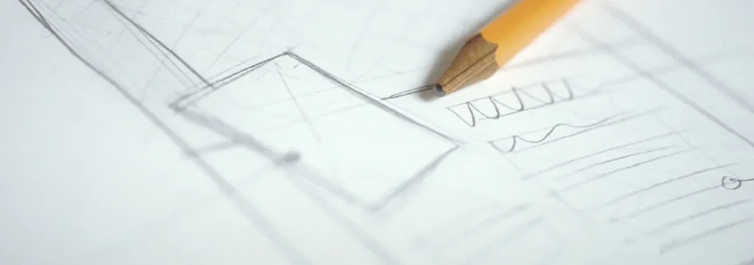

# Формальные абстрактные инструменты дизайна

Перевод хрестоматийной статьи по гейм-дизайну за авторством [Дага Чёрча](http://en.wikipedia.org/wiki/Doug_Church), на которую так или иначе ссылается каждый посвященный гейм-дизайну учебный курс. Не смотря на то, что датируется статья 1999 годом, актуальности они не теряет и по сей день. 

Из чего сделаны современные компьютеры? Они являются сплавом технической базы и визуальных компонентов, направленных на создание переживаний у играющего. Всё вместе (дизайн, графика, звук, уровни, код и так далее) работает на создание этого синтеза.

В большинстве сфер технический прогресс очевиден: компьютеры, на которых мы играем, становятся всё мощнее, у экранов лучше разрешение и больше цветов, инструменты для рисования и моделирования стали изощрённее, обработка аудио сделалась быстрее, звуковые карты имеют гораздо больше возможностей. Решаются технические задачи, для которых десять лет назад даже слов ещё не придумали, а исследования продолжаются и будут продолжаться. Техническая база, на которую опирается игра (код и инструменты создания контента), развивается.

Во всех жанрах, во всех компаниях, опираясь на свои идеи и идеи наших предшественников, мы вместе трудимся над тем, чтобы расширить технические рамки и найти новые возможности. За очень редким исключением, ни одна компания, ни одна команда, не добилась бы ничего, если бы вынуждена была работать в изоляции.

Дизайн же при этом остаётся самым неизведанным этапом создания компьютерных игр. Он воплощает визуальные компоненты, он сводит воедино графику, код, уровни, звук, создавая переживание игры игроком с точностью до минуты. Продуманный код, красивая графика, захватывающие уровни – всё это никого не порадует, если они никогда не сойдутся вместе. Задачи дизайна – определить цели игрока и его темп. Дизайн – это и есть игра, без него у вас был бы CD набитый данными, но никаких впечатлений.

К сожалению, дизайн не только самый важный, но и самый трудно развиваемый компонент. Ещё недостаточно сделано для того, чтобы надстраивать новое, опираясь на открытия прошлого, делиться принципами, которые легли в основу успеха, применять опыт, полученный в какой-то одной области, к другим жанрам. Внутри жанров (и, безусловно, внутри конкретных дизайнерских коллективов) отдельные аспекты значительно эволюционировали. Но развитие дизайна вообще тащится в хвосте за остальными игровыми технологиями.

### Как мы говорим об играх?

Изначально эволюция дизайна замедляется отсутствием общего словаря. Большинство профессиональных дисциплин имеют неплохо развитый язык для дискуссий. Спортсмены знают язык своего вида спорта и физической культуры в целом, инженеры знают профессиональный жаргон своей специальности, врачи знают, как назвать все части тела по латыни и как выписать неразборчивый рецепт. Дизайнеры же могут обсудить всё на уровне «интересно» или «не интересно» и очень часто на этом анализ и прекращается. Решить, интересна игра или нет – это хорошее начало для понимания, но наша работа как дизайнеров требует большей проницательности.

Мы должны уметь, поиграв в двухмерных шутер на Game Boy, понять, чем он крут, и применить эту идею в 3D-симуляторе, который мы разрабатываем. Или взять игру, которая всем была бы хороша, если бы не одна досадная деталь, понять, почему эта деталь нас раздражает и не повторять эту ошибку в своих играх. Если мы достигнем такого уровня понимания, межжанровая эволюция дизайна ускорится. Но понимание значит, что дизайнеры должны уметь общаться друг с другом точно и эффективно. Короче говоря, нам нужен общий язык гейм-дизайна.

### Язык без границ

Наша индустрия производит огромное количество наименований игр для множества платформ для не менее многочисленной аудитории. Язык, который мы развиваем, должен учитывать это разнообразие и находить общие элементы, скрытые в несопоставимых на первый взгляд жанрах и продуктах. Мы должны уметь изложить наш опыт, наши инновации, наши ошибки в такой форме, которая будет доступна для понимания, и – помните об этом – для использования всеми.

Словарь дизайна позволил бы нам это сделать, так как мы смогли бы говорить о глубинных компонентах игры. Вместо того, чтобы просто говорить «Было интересно» или «Ну, не знаю, как-то не очень» мы могли бы рассечь игру на компоненты и попытаться понять, как эти вещи уравновешивают друг друга и взаимодействуют. Точный словарь улучшил бы наше понимание и облегчил бы процесс создания игр.

Всё это уже стало естественным для технических инноваций, так как их гораздо легче обнаружить в составе готового продукта и применить в другом проекте. Технологии применения текстур или система захвата движения гораздо проще вычленяются из целого. Когда все в офисе собираются посмотреть на только что выпущенную игру, общая техническая «оценка» даётся в течение первых пяти минут: «Ух ты, классные текстуры!» или «Фигуры зашибись!» или «Текстуры без субпиксельной маски? Они что, ненормальные?» или «Слушай, надо передрать у них этот спецэффект». Но когда толпа расходится, оказывается, что почти никаких замечаний не было сделано о том, какие находки в дизайне бросились в глаза, и самое главное – сработали ли они?

Дизайн трудно увидеть прямо на экране. Из-за этого его эволюционный путь часто застопоривается. В рамках определённого жанра эволюция происходит посредством постепенной шлифовки. Стратегические игры реального времени, которые вышли в этом году, совершенно очевидно основаны на стратегиях реального времени прошлого года. И так оно и будет продолжаться, потому что словарь дизайна на сегодня в существенной мере узок и специфичен для каждой игры и каждого жанра. Можно говорить о балансе стоимости юнитов разных рас,  или о соотношении силы и количества юнитов. Но едва ли можно найти много примеров того, как инновации в стратегиях помогли ролевым играм стать лучше. На самом деле, нам пришлось бы очень туго, если бы нас заставили описать, что вообще есть общего и чем можно поделиться.

Все эти трудности приводят нас к пониманию, что общий словарь дизайна очень бы пригодился. Основная цель «Формальных Абстрактных Инструментов Дизайна» (или ФАИД, как они будут далее именоваться) состоит в том, чтобы разработать концепцию такого словаря и способы его создания.

Если мы рассмотрим эту фразу подробнее, то увидим: «формальные», подразумевает точность определений и их способность объяснить смысл кому угодно; «абстрактные», подчёркивает фокус на идеях, а не на компонентах какого-то конкретного жанра, «инструменты» — так как они будут формировать общий словарь, который мы хотим создать; и «дизайна» — ну, мы же с вами дизайнеры всё-таки.

«Дизайн» и «инструменты» в общем и целом, слова, объясняющие себя сами. Тем не менее, «формальные» и «абстрактные» не помешало бы разъяснить на примерах. Например, нельзя сказать, что выражение «крутая вещь» может быть записано в ФАИД, ведь это противоречило бы требованию формальности, так как «крутой» — не является точным словом, которому можно дать конкретное значение – разные люди описали бы его очень по-разному. С другой стороны «награда игрока» хорошо поддаётся определению и объяснению, следовательно, подходит. Точно также «плюс второй гигантский разящий меч» в RPG не абстрактен, но относится к элементам конкретной игры. Он не подходит под критерии ФАИД, так как не абстрактен. Однако общая концепция, проявлением которой является магический меч – механика, позволяющая игроку получать более мощное снаряжение – хороший пример ФАИД, поэтому выражение «бонусная кривая игрока» подходит к приведённому выше определению.

### Так давайте составим словарь дизайна – в чём проблема-то?

Прежде, чем мы приступим к подробному рассмотрению инструментов на конкретных примерах, всего несколько предупредительных слов. Абстрактные инструменты – это не кирпичики из которых можно построить игру. Нельзя построить дом из инструментов, дом строится при помощи инструментов. С играми то же самое. Если у вас отличная «бонусная кривая игрока» — это ещё не отличная игра. ФАИД – это не волшебные ингредиенты, которые вы добавляете для вкуса. Нельзя предлагать новый товар, говоря «эта игра с отличными бонусными кривыми». Как дизайнер вы всё равно должны выяснить, что такое «интересно», о чём ваша игра, какие цели вы хотите в неё хотите привнести, какой вы её видите.

Но словарь дизайна – это наш ящик с инструментами, которые мы используем, чтобы разбирать игры на составные части, брать те из них, которые нам подходят, чтобы реализовать своё собственное видение игры, или усовершенствовать нашу игру. Как только вы придумали игру, вы можете проверить, заложен ли в ней уже какой-то конкретный инструмент. Если да, правильно ли вы его используете или он кажется чужеродным? Если не используется, стоит ли его использовать или он не подходит для вашей игры? Не при каждом строительстве нужна дисковая пила (как ни грустно), и не каждой игре нужны все инструменты. Если использовать правильные инструменты, это даст вам нужную форму, нужную прочность и подходящий стиль.

Кроме того, инструменты не всегда хорошо сочетаются – иногда они вступают в конфликт. Цель не в том, чтобы использовать все инструменты в каждой игре. Можно постоянно пользоваться одним и тем же инструментом на все лады, а какой-то другой будет просто лежать в ящике и ждать своего часа. Вы, дизайнеры, должны орудовать инструментами, чтобы делать всё по своему желанию – не позволяйте инструментам управлять вами.

### Инструменты – штука полезная. Где их искать?

Итак, нам нужен словарь дизайна, набор инструментов, который стоит за процессом создания игр. Нет правильного или официального метода для их обнаружения. Простой способ начать их поиск – взять хорошую игру и описать конкретно, что в ней удалось. Затем, из конкретных примеров компонентов игр, мы можем извлечь несколько абстрактных формализованных ключевых аспектов и, возможно, это даст нам пару новых инструментов.

Здесь недостаточно места, чтобы дать исчерпывающий анализ каждого инструмента, моя цель – дать обзор идей, которые стоят за ФАИД и то, как их можно применять, а не развёрнутое представление обо всём. Помня об этом, мы с вами начнём краткий экскурс по некоторым играм, инструментам и идеям. Так как мы ищем примеры хорошего гейм-дизайна, мы начнём с анализа _Mario 64._ Когда мы закончим рассмотрение нескольких конкретных аспектов самой игры, мы с вами вернёмся назад к поиску вещей, которые можно абстрагировать и формализовать, а затем применить к другим жанрам и играм.

### Игровой процесс Mario 64

_Mario 64_ совмещает (и это очевидно) исследование с открытым финалом и продолжительное прямое следование по выбранному пути. Игрокам всегда есть что делать, но им даётся широкий выбор того, над какими частями мира им работать и какие дополнительные звёзды добывать. Игра также избегает обычного для прямолинейных, двухмерных игр напряжённого ожидания «что же там на меня надвигается?» и дает игроку ощущение контроля над игрой. В _Mario_ игроки проводят почти всё время, пытаясь решить, что они хотят сделать дальше, а не пытаясь высвободиться откуда-то или найти себе занятие.

Главное решение, которое было привнесено в дизайн – множественность целей в каждом из миров. Когда игрок впервые попадает в мир, он, в первую очередь, исследует возможные пути и направления. Очень часто первая звезда (как правило, самая простая в каждом мире) даётся для того, чтобы поощрить игроков исследовать побольше пространства. Таким образом, пока игрок зарабатывает первую звезду, зачастую он видит вещи, которые ему пригодятся в дальнейшем. Он замечает недоступные пока красные монеты, шляпные коробки, странные приспособления и так далее, пока исследует мир на ранних этапах. Когда он вернётся в этот мир, чтобы выполнить другие цели, он уже будет хорошо ориентироваться, иметь какое-то представление о том, как этих целей достичь, так как он уже посещал этот мир и видел многие из его элементов.

Миры в _Mario_ относительно последовательны и предсказуемы (даже если иногда и немного странны). Игроку даётся небольшой и простой набор рычагов воздействия, которые работают всегда. Но хоть они и просты – зато очень выразительны, обеспечивая интенсивное взаимодействие с игрой через элементарные движения и небольшой набор прыжков. Рычаги воздействия работают всегда (в том смысле, что вы можете использовать их в любой момент), и игроки знают, чего ожидать (например, за тройной прыжок всегда проходится определённая дистанция, ударом с ноги можно сокрушить противника). Бонусы даются постепенно и применяются в соответствии с ситуацией (например, металлический Марио может ходить под водой).

Эти простые, последовательные рычаги воздействия в сочетании с очень предсказуемой физикой (довольно точной для мира _Mario_), позволяют игрокам легко догадываться, что произойдёт, если они попробуют сделать то-то и то-то. Сложность монстров и окружающей среды возрастает, но новые необычные элементы вводятся постепенно и обычно построены по принципу цикличности. Это делает игровые ситуации распознаваемыми – так игроку проще планировать действия. Если игрок видит высокий выступ, или встречного монстра, или сундук под водой, он начинает думать, как можно к нему подобраться.

Это вовлекает игроков в довольно сложный процесс планирования. Им показывают (как правило, непрямо) как этот мир устроен, как они могут двигаться и взаимодействовать с ним, какие препятствия они должны преодолевать. И затем, часто не отдавая себе в этом отчёта, они разрабатывают план, как им добиться того, чего они хотят. В процессе планирования, у игрока созревают тысячи маленьких планов, некоторые из которых работают, а некоторые нет. Ключевой момент здесь в том, что если план не работает – игрок понимает почему. Мир настолько последователен, что тут же становится понятно, отчего именно не сработал план. Пропасть требует тройного прыжка, а не обычного прыжка; возможно, льда было больше, чем ожидал игрок; возможно, монстр движется слишком быстро. Но игроку надо придумать план, испробовать его, и увидеть результаты и то, как отвечает игра. А так как этот ответ понятен, игрок может разработать новый план, используя информацию, полученную благодаря первой попытке.

Это вовлекает в игру, потому что игроки управляют тем, что они хотят сделать и как именно. Игроки почти никогда не чувствуют себя обманутыми как, например, в случае, когда они хотят сделать что-то, чего не поддерживает игра. Предоставляя очень ограниченный набор действий, но полностью поддерживая их использование в любой ситуации, игровой мир делается реальным для игроков. Никто из игравших в _Mario_ не жаловался, что он хотел выдолбить пещеру, развести огонь и приготовить рыбу, но не смог. Игра очень проста и последовательна. Если в мире что-то существует, вы это увидите.

### Отлично! Но я же не пишу Mario 64. Его же уже написали.

Итак, в _Mario_ есть некоторые замечательные дизайнерские решения. В контексте самой игры _Mario,_ мы кратко рассмотрели, как они взаимодействуют, как они отражаются на переживании игры игроком и как все эти дизайнерские решения в целом подталкивают игрока к более глубокому погружению в игровой мир. Но если вы создаёте гоночную игру, нельзя просто добавить удар с ноги и надеяться, что сработает так же, как в _Mario._ Итак, пришло время абстрагировать некоторые инструменты и дать им определение, достаточное для применения в других играх.

Возвращаясь к игре _Mario,_ какие инструменты мы можем извлечь из наших наблюдений? Во-первых, мы видим, что игрока разными способами поощряют к формированию своих собственных целей и их достижения. Главное здесь, что игрок знает, чего ждать от мира и поэтому он чувствует, что контролирует мир игры. Цели и рычаги контроля могут предоставляться в разных масштабах: от быстрых, несложных целей, таких как «перебраться через мост» до долгосрочных, сложных целей, таких как «собрать все красные монеты в мире». Зачастую игрок работает над несколькими целями сразу – разного уровня сложности и времени исполнения.

Этот процесс генерирования целей, понимания мира, составления плана и действия в согласии с ним – мощное средство вовлечения игрока в игру. Мы назовём это «намерением», так как по сути своей всё перечисленное – это разрешение и поощрение игроков к продуманным, намеренным поступкам. Намерение может проявляться на каждом уровне: от быстрого плана перебраться через реку до многоступенчатого плана раскрыть запутанную тайну. Вот наш первый ФАИД.

**НАМЕРЕНИЕ**: _создание своего собственного применимого плана в ответ на текущую ситуацию в игровом мире и на собственное понимание вариантов игрового сценария._

Простота и единообразие мира _Mario_ заставляет игроков испытывать большую соотнесённость с персонажем, большую ответственность за свои действия. В частности, если игрок пытается что-то сделать, а попытка не удается, он, вероятно, поймёт, что пошло не так. Это приводит нас ко второму инструменту «ощутимые последствия». Главное здесь в том, чтобы игра не только отреагировала на действия игрока – её реакция должна быть очевидной. Когда я прыгаю – это или срабатывает или нет. _Mario_ широко использует этот приём на нижних уровнях (пересечь реку, убежать от катящейся глыбы и так далее). Любое действие, которое предпринимает игрок, влечёт за собой видимую ответную реакцию.

**ОЩУТИМЫЕ ПОСЛЕДСТВИЯ**: _ясная реакция от игрового мира на действия игрока._

Мы рассмотрели идеи, стоящие за некоторыми компонентами _Mario_ и абстрагировали два потенциальных инструмента дизайна. Обратите внимание также на то, как _Mario_ использует эти инструменты в связке; в то время как игрок разрабатывает и приводит в исполнение план, он видит результаты этого плана и знает (или интуитивно догадывается) почему результаты таковы. Элементы, которые мы обсудили, конечно же, не единственные классные вещи в _Mario,_ и даже не единственные инструменты, которые _Mario_ использует, но я надеюсь, что их обсуждение наглядно показало, как это делается. Позднее мы с вами вернёмся к рассмотрению того, как множество инструментов взаимодействуют друг с другом. Но сначала, давайте рассмотрим, как намерение и ощутимые последствия можно применить к другим играм.

### Те же инструменты, но в других играх

Ощутимые последствия – инструмент, часто используемый в ролевых играх, где сюжет или характер персонажа, как правило, развивается. Иногда случается даже такой сценарий, когда игра (через персонажей или повествование) выступает вперёд и говорит «Из-за X случился Y». Совершенно очевидно, что это ощутимое последствие в чистом виде.

Однако часто RPG не так прямо высказываются о последствиях. Например, игрок может принять решение заночевать в трактире, а на следующее утро на него устроена засада. Возможно, дизайнеры включили это в код или дизайн игры («Мы не хотим, чтобы игроки много ночевали в трактире, если они начинают оставаться в нём слишком часто, давайте устраивать им засаду»). Однако эта причинно-следственная связь не воспринимается игроком. В то время как это может быть действительно последствием, игроку оно покажется случайным событием.

Ещё бывают случаи, когда последствие ощутимо, но всё равно кажется, что что-то не так. Например, на дороге есть развилка и игроки должны выбирать направление. Когда игрок идёт по выбранному пути, он встречает разбойников, и их главарь заявляет: «Ты вторгся в нашу долину – тебя ждёт расправа!» Это последствие, совершенно ясно, но не решения, который принимал игрок. Игроки жалуются на ситуации, в которых они вынуждены переживать последствия по воле дизайнеров, где они играют себе в игру, и вдруг им говорят: «Ты, конечно, не мог знать, но твоё решение Х привело к ужасному событию Z».

Здесь мы видим, как _Mario_ использует инструмент ощутимого последствия для того, чтобы подсказать игрокам, как же им быть, но без разочарований. В _Mario_ последствия обычно являются прямым следствием решений игрока. Очень редко игроки оказываются в ситуации, когда они следуют каким-то путём в игре, и вдруг она им говорит: «Ха-ха, ты, конечно, не мог знать об этом, но надо было свернуть влево» или «Тупик! Ты разбился». Вместо этого игроки видят, что могут попробовать или опасный прыжок, или длинную обходную дорогу, или, может быть, принять бой. Если что-то не сработает, они знают, почему.

Поэтому неудивительно, что в ролевых играх, лучше всего срабатывают последствия, связанные с преднамеренными действиями. Если есть выбор – выполнить приказание злого мага или противостоять и принять последствия своего решения – это как раз сочетание намерения и последствия. И когда задействованы оба инструмента, игроки чувствуют, что они контролируют ситуацию и ответственны за происходящее. Однако когда дизайнер им говорит: «А теперь вы должны выполнить приказание злого мага», а потом «Так как вы выполнили приказание злого мага, произошло ужасное событие» – это гораздо меньше  способствует вовлечённости игрока в игру. Поэтому, хоть оба примера имеют ощутимые последствия, они вызывают у игрока разные реакции.

### Та же игра, другие инструменты

Конечно же, есть причины, по которым ролевые игры часто бросают игрока в заданную ситуацию, даже ценой ограничений и лишая его чувства контроля над игрой.  Обычно причиной является желание дизайнера контролировать повествовательную нить игры. Совершенно ясно, что «сюжет» является ещё одним абстрактным инструментом, используемым разными способами и во всех жанрах нашей индустрии. Но всё же, нельзя забывать, что хоть книги и имеют сюжет, когда мы говорим «сюжет», имея в виду абстрактный инструмент гейм-дизайна, мы вовсе не имеем в виду описательный, заранее приготовленный текст. В нашей сфере «сюжет» относится к любой повествовательной линии, которая проходит через всю игру.

Самыми наглядными примерами использования сюжета в компьютерных и видеоиграх служат сюжетные линии в приключенческих играх. В этой категории игр сюжет был заранее написан дизайнерами, а игроки отрывают его для себя через взаимодействие с персонажами, объектами и миром. И хотя часто мы стараемся устроить всё так, чтобы игрок чувствовал контроль над ситуацией, все игроки проходят через один и тот же сюжет.

Но ведь игры NBA Live тоже имеют сюжет. Здесь сюжет – это то, что случилось за игру. Возможно, она закончится на последней секунде овертайма трёхочковым броском звёздного игрока, у которого до этого забить не получалось; может быть, игра начнётся полным разгромом, пока игрок не введёт в игру одного из запасных и это будет его минутой славы. В любом случае, действия игрока во время игры создают сюжет. Конечно же, сюжет в баскетболе не такой, как в ролевых играх, но зато он находится в руках игрока, а не дизайнера. А когда в спортивные игры добавляются франшизовые и сезонные модификации, а также соперничество между командами, и начинается долгая борьба на много игровых сессий, роль сюжета в таких играх возрастает.

**СЮЖЕТ:** _Повествовательная нить, созданная дизайнером или игроком, которая связывает события воедино и заставляет игрока двигаться вперёд к завершению игры._

### Использование нескольких инструментов: взаимодействие, конфликт, смешение

В приключенческих играх очень мало намерения или ощутимых последствий. Игроки знают, что они должны будут бродить повсюду, подбирать всё подряд и со всеми разговаривать, пытаться скомбинировать всё со всем и так выяснять, чего же хотел дизайнер. На самом начальном уровне есть подспудное намерение: «Наверняка этот объект – то, что мне нужно» и последствия говорящие «Сработало – сюжет продвигается». Но здесь почти полностью отсутствует целеполагание и выражение желаний игрока. Когда игрок что-то делает, совершенно очевидно, что есть очень мало возможных вариантов, которые сработают (только те, что предусмотрел дизайнер), поэтому все игроки должны выбрать один из этих вариантов, иначе их ждёт неудача.

Но как мы видели, небольшие потери в последствиях и почти всего намерения идут на пользу сюжету. Забирая у игрока контроль над некоторыми событиями, дизайнер получает свободу и может создавать мир, полный поворотных моментов, когда дизайнер пишет, что именно должно произойти. Это приводит к моментам, которые сильно воздействуют на игроков (моменты, которые зачастую вовлекают игрока в игру так же, если не сильнее, чем события, вызванные действиями игрока). И здесь мы видим, как инструменты вступают в конфликт, как намерение и сюжет противопоставлены друг другу: чем больше мы как дизайнеры хотим создать определённые ситуации, тем меньше контроля мы можем отдать игроку.

Повторюсь: выбирать инструменты следует исходя из задания. Зная, что за игру вы хотите разработать, вы можете выбирать инструменты и соответственно их использовать. Нельзя просто брать и добавлять понемногу каждого инструмента и ожидать, что так получится игра.

### Конкретные примеры использования нескольких инструментов

Интересные примеры конфликта между намерением и сюжетом можно найти в традиционных ролевых играх для консоли SquareSoft (например, _Final Fantasy_ или _ChronoTrigger)._ В этих играх у каждого инструмента своё место в игре и своя сфера влияния. Сюжет обычно линеен, с несколькими незначительными ответвлениями. Между тем, персонаж и статистика битв представляют собой произвольно формирующуюся сложную систему, в которой множество объектов, показателей и комбо-эффектов контролируются игроком. Игроку необходимо изучить эти системы, а затем распоряжаться объектами и членами группы, чтобы создавать и развивать свою группу.

В ходе исследования игрового мира, сюжет разворачивается перед игроком. Дизайнер создаёт захватывающие моменты, которые показываются игроку в ходе игры, но они не зависят от игрока. Несмотря на то, что в развитии действия намерение играет незначительную роль, игроку дается определённый контроль над тем, как продвигается исследование. Между тем, во время исследования обнаруживаются предметы и персонажи. Эти находки влияют на схватки в игре. Схватка полностью во власти игрока, так как он решает, что делать каждому из персонажей, какие способности и предметы использовать и распоряжается другими вещами. Таким образом, игрок исследует сюжет, а в битвах содержится намерение и последствие.

Игры от SquareSoft, по сути своей, книги с историями. Но чтобы перевернуть страницу, вы должны одержать победу в битве. А чтобы победить, вы должны использовать персонажей и предметы, которые появляются в ходе истории. Поэтому последовательность событий, будучи полностью предопределённой и идентичной для всех игроков, предстаёт перед ними непосредственно после преднамеренных действий в битве. Сюжет заставляет вас идти и сражаться с вашим бывшим союзником, но сама битва полностью в ваших руках.

Вместо того чтобы использовать все три инструмента сразу, дизайнеры используют намерение и последствия в системе боя, и сюжет с последствием для, собственно, развёртывания истории. Таким образом, дизайнеры используют все инструменты, какие хотели и связывают их в игре. Тем не менее, они делают так, что все инструменты обязательно могут использоваться, когда они нужны. Они не пытаются поместить инструменты там, где они вряд ли могли бы эффективно функционировать.

С небольшой натяжкой можно сказать, что игры о спорте и единоборствах смешивают все три инструмента воедино. Сюжет в игре _NHL 99_ – это либо забитые шайбы, либо пропущенные, либо броски пенальти. Хоть сюжет и простоват, он полностью находится в руках игрока. Каждый игрок принимает свои собственные решения на пути к победе – например, убрать ли вратаря, чтобы получить дополнительного игрока на льду. И, что самое главное, решение и его последствие либо результативно, либо нет, что приводит игру к итогу, полностью зависящему от игрока. В отличие от приключенческих игр, здесь не надо пытаться угадать, что имел в виду дизайнер, или по 20 раз сохранять и перезагружать игру, пока ты не найдёшь нужный предмет. Ты заходишь, играешь в игру, она заканчивается.

Точно так же, в играх о единоборствах, любое действие игрока совершенно последовательно и наглядно представлено персонажем на экране. В игре _Tekken_, когда Эдди Гордо наносит удар «с колеса», вы знаете, что будет. Когда игрок изучит удары, такая предсказуемость позволит ему планировать – это намерение, – а последовательная реакция мира на его действие обеспечит ощутимые последствия. Если я наблюдаю за чьей-то игрой, я вижу, в чём и почему этот кто-то лучше меня, хотя все игроки начинают игру наравне. Кривая обучения состоит в обнаружении рычагов контроля (и поэтому только процесс обучения игрока определяет навыки и способности в игре). Это происходит благодаря полностью реализованному намерению и последствиям.

В спортивных играх вы направляете игроков, выбираете действие и смотрите, как оно приводит к определённым событиям – это даёт вам обратную связь с тем, чего вы пытались добиться. Игрок направляет действие – пропускает толчок клюшкой – удар по шайбе отражён – пас не удался – для удачного удара не хватило всего ничего. Когда мы наблюдаем за событиями на экране, мы всё видим, но не всегда уверены, почему они происходят. Всё потому, что большинство спортивных игр имеют статистическую подложку, поэтому одни и те же действия игрока могут приводить к разным результатам. Если вы комбинируете рейтинги игрока с «бросанием костей», законы вероятности уместны, но это неочевидно для игрока. Намерение по-прежнему в силе, а вот ощутимые последствия уже не следуют непосредственно за действием. Подобная замена прямого контроля (и вообще прямого действия) на статистические вероятности, которые игрок чувствует, но не может увидеть прямо, часто присутствует и в битвах RPG-игр.  Поэтому, в _Tekken_ мне не приходится говорть: «Вот блин, не повезло, надо было лучше кости бросать» или «Ага, теперь я ниндзя десятого уровня, поэтому я могу сделать вот такой ход», а в _NBA Live_ и ролевой игре – приходится, и довольно часто.

### Инструментальный анализ

У игрока-борца простой сюжет («У меня оставалось только одно серебряное здоровье, но я сделал ложный выпад, а затем тройной комбо – и почти его прикончил») – но это его собственный сюжет. Совсем не похоже на «Блин, как я мог пропустить этот удар?» или «И зачем я это сделал?» или «Ну почему же не сработало?» Простой сюжет, подкреплённый исполненным намерением в игре, которая отзывается ясными последствиями, оказывает очень сильное впечатление на игрока. Поэтому и игры о единоборствах, и, хоть и с несколько запутанными последствиями, спортивные игры пытаются смешать намерение и последствия и поэтому позволяют игроку создавать сюжет своими действиями. Полный контроль над бойцовской игрой делаёт её более реальной для игрока, но больший размах игр спортивных даёт лучший сюжет. А может быть, прямой контроль в бойцовской игре делает сюжет более личным, в то время как размах спортивной игры даёт более эпичный сюжет. В любом случае, ни подход  бойцовских игр, ни подход спортивных симуляторов к сюжету и намерению не является правильным или неправильным. Каждый просто вызывает разные реакции игрока. Будучи дизайнером, вы должны понимать, каким разнообразным может быть применение одного и того же инструмента, если вы хотите создать желаемые переживания у игрока.

### Мммм… ну и что?

Такие инструменты как аналитический словарь дают возможность сосредоточиться на впечатлении игрока, которое хочет создать дизайнер. В этом развёрнутом введении в ФАИД, основное внимание я посвятил намерению и ощутимым последствиям, и чуть меньше – сюжету. Да и то, почти все виды сюжетов, которые я здесь привёл, задаются игроком. Это не потому, что названные инструменты – единственные или лучшие из многих. Однако когда мы приступаем к анализу своего дизайна и впечатлений игрока, вызванных инструментами, которые мы использовали, нам необходимо понять, что может наша индустрия, чем она хороша.

Игры – не книги. Игры – не кино. Инструменты, которые используются в последних (положение камеры, монтаж, крупный план, музыка, смена рассказчика и так далее), применяются с тем, чтобы манипулировать зрителями или читателями, заставить их чувствовать и реагировать именно так, как хочет режиссёр или автор. Мне кажется, что самое трудное и самое замечательное в гейм-дизайне – это то, что самыми важными нашими инструментами являются те, которые дают игроку возможность и поощряют его принимать свои собственные решения. Так мы даём игроку возможность познать себя, — и только наша индустрия имеет возможность это сделать.

Итак, я ищу инструменты, которые помогут мне понять этот аспект гейм-дизайна и вызвать у игрока чувство максимальной соотнесённости с игрой. Потому что именно такую игру я хочу создать. Каждый дизайнер должен определиться с игрой, которую он хочет создать, и использовать имеющиеся инструменты, чтобы сформировать необходимое впечатление.

Надеюсь, что я привёл достаточно примеров инструментов и инструментального анализа, чтобы сделать этот обзор полезным. Конечно, я упомянул всего несколько инструментов, но, как я уже говорил раньше, эта статья не претендует на то, чтобы быть всеобъемлющей и исчерпывающей. Это лишь обоснование того, что нам нужно составить словарь. А чтобы он действительно был полезен, необходимо включиться в обсуждение и анализ, чтобы вычленить инструменты, которые нам нравятся, и оттачивать их до тех пор, пока они не станут совершенно понятными. И тогда мы сможем приступить к более точному анализу того, что нам нравится или не нравится в имеющихся играх и работе над тем, чтобы сделать наши будущие игры лучше. И мы сможем говорить об инновациях в дизайне, а не только в технике.

Нам придётся потратить много времени, если мы хотим составить полный список инструментов, которые мы используем (или должны использовать) в своей работе. Это и экономика ресурсов, и обучение, и бонусные кривые, наказания/награды и много-много другого. И о каждом инструменте можно написать отдельную статью – как его использовали в разное время, в каких играх он применялся хорошо, а в каких – неудачно, и различные его аспекты. Аналогичным образом, было бы здорово взять игру вроде _Mario_ или _Warcraft_ и разобрать их по косточкам, провести самый полный анализ, какой только возможен, и посмотреть, будет ли это полезно. А эта статья – всего лишь пособие для начинающих, едва задевшее поверхность и предоставившее пример таких процессов.

Я вовсе не предполагаю, что инструменты непременно полезны. Многим людям всё это покажется излишним педантизмом. И конечно же, есть риск, что люди начнут использовать слова «намерение» и «последствие» так же бессмысленно, как они уже используют «нелинейность», «бесконечное многообразие» или «сотни часов игрового процесса». Мне бы этого, понятное дело, не хотелось.

ФАИД предлагают потенциальную возможность для развития дискуссии о дизайне – не больше и не меньше. Это не панацея, но есть надежда, что эта структура станет полезной и будет способствовать совместному анализу и развитию практики гейм-дизайна, и это сотрудничество приведёт к лучшему дизайну, более интересным продуктам и довольным игрокам. Если эта структура в чём-то неверна, нам следует понять, где именно, и задать другую, верную структуру. А затем вместе работать над её развитием.

**Дуг Чёрч невероятно благодарен тестерам. После бета-теста этой статьи, он узнал, что половина тестеров нашли первые две страницы монотонными. Если вы относитесь к этой половине, просто проскочите их и начните с третьей, прочтите до конца и уже потом вернитесь ко вступлению. Ух-ты! А статья-то получилась интерактивная и нелинейная.**

_Перевод — Ю. Сергеева, оригинал — [здесь](http://www.gamasutra.com/view/feature/3357/formal_abstract_design_tools.php)._