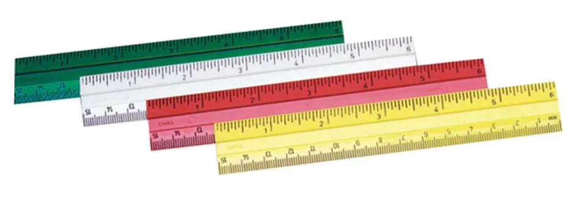
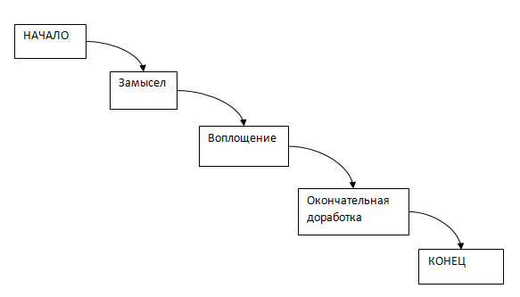
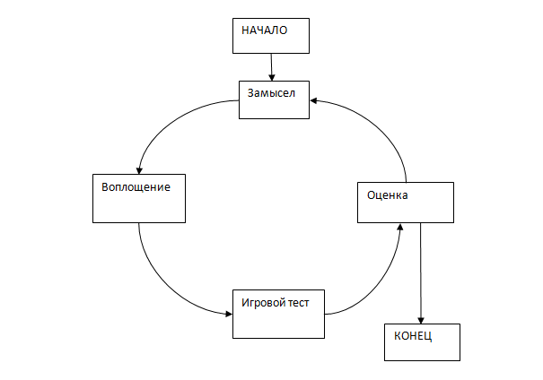
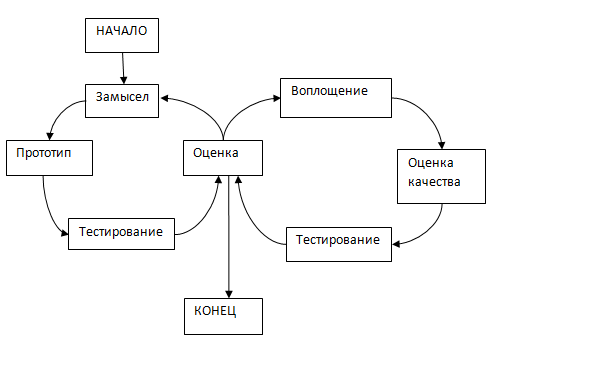

# Уровень 2: Гейм-дизайн/ Итеративность и прототипирование

Данный пост — перевод второй статьи из [курса лекций «Принципы гейм-дизайна»](http://gamedesignconcepts.wordpress.com/) за авторством профессионала и преподавателя [Яна Шрайбера](http://www.gamasutra.com/view/authors/916452/Ian_Schreiber.php). Перевод вводной статьи «Уровень 1: Введение/Что такое игра?» вы можете посмотреть [здесь](printsipy-geym-dizayna-yana-shraybera-l.md).  

В прошлый раз мы задались вопросом: что такое игра? Сегодня мы рассмотрим другой вопрос, тесно связанный с первым: что же именно представляет собой гейм-дизайн? В прошлый раз мы создали простую игру. Сегодня мы рассмотрим процесс создания игр в целом. Тогда как игру из разряда «доберись до конца первым» мы можем сделать за 15 минут, на то, чтобы создать следующую _Settlers of Catan_ или _World of Warcraft,_ вам потребуется побольше времени.

_Объявление_

Некоторые организационные вопросы, возникшие с прошлого понедельника:

— Во-первых, я бы хотел извиниться перед зарегистрировавшимися за скверное поведение вики-ресурса. Он каждый час рассылал уведомления об обновлениях… А их было много! Я попытался отключить обновления в надежде, что вы больше не будете получать этот вики-спам, но если вы всё равно его получаете, вы можете отключить всё это вручную, зайдя в свои настройки и во вкладке «Уведомления» отметить «Никогда».

— на 5 часов утра по Гринвичу, форумы, посвященные обсуждению, исправно работают. Я с нетерпением жду оживлённых дискуссий. Было немало спамботов, которые пытались зарегистрироваться, так что мне пришлось сверять каждый аккаунт на форуме с подпиской на этот курс. Если вам пришло письмо о том, что ваш аккаунт был отклонён, это значит, что я не смог связать его с регистрацией на курсах; попробуйте ещё раз, пожалуйста. Если вы ещё не создали учётную запись на форуме, будет лучше, если вы используете для форумов тот же электронный адрес, что и при регистрации на курсе… если по какой-либо причине вы не хотите этого делать, по крайней мере, добавьте хоть какую-то информацию для идентификации – ваше имя или откуда вы, чтобы я мог найти вас в списках. Спасибо.

— и наконец, для тех, из вас, кто прислал запрос на регистрацию после того, как курс стартовал (то есть, если в графе «оправлено» вашего письма стоит время после полудня понедельника по Гринвичу), извините за то, что не смог добавить вас после. Запросы на регистрацию занимали много моего времени до начала курса, и если я продолжу принимать запоздавшие регистрации, у меня просто не будет времени на дела, связанные с самим курсом. Зарегистрированы вы или нет – этот блог находится в свободном доступе для всех (как и мой Твиттер), поэтому я надеюсь, что вы следите за обновлениями и обогащаетесь опытом.

_Гейм-дизайн_

В ходе этого курса мы будем использовать слово «дизайн» много раз, и так как, к большому сожалению, этот термин употребляется слишком часто, я проясню, что я имею в виду. Как говорится в _Challenges,_ гейм-дизайн – это создание правил и содержания игры. Дизайн **не включает в себя** программирование, графику и анимацию, маркетинг и ещё миллион других задач, которые необходимо решить при создании игры. Все эти задачи, взятые вместе, можно назвать «разработкой игр».

К сожалению, мне приходилось видеть слово «дизайн» в применении (особенно в учебных программах колледжей) к различным аспектам разработки. Когда же мы говорим об индустрии видеоигр (или настольных игр), «гейм-дизайн» имеет очень узкое значение, именно это значение мы и будем использовать в этом курсе.

_Различные типы гейм-дизайна_

Как уже упоминалось в Challenges, существует много заданий, связанных с гейм-дизайном: системный дизайн, дизайн уровней, дизайн контента, дизайн интерфейса, разработка мира, написание истории. Любой из этих аспектов мог бы заполнить собой несколько десятинедельных курсов, но эти летние курсы _не будут_ охватывать в полной мере все весь спектр проблем гейм-дизайна. Мы лишь соприкоснёмся с интерфейсом, написанием истории, и контентом, когда это будет нас интересовать, но большая часть курса сосредоточена на **системном дизайне** (называемом иногда «дизайном систем» и «дизайном базовых систем»).

Системный дизайн занимается разработкой основных правил игры. Из чего всё состоит? Как можно всё это контролировать? Какие шаги вы можете предпринять на своём ходу (и есть ли вообще «ходы»)? Что происходит, если вы производите определённые действия и как это влияет на состояние игры? В общем и целом, системный дизайн это создание трёх вещей:

— правила для начала. Как начинается игра?

— правила для развития действия. Когда игра началась, что могут делать игроки, и что происходит, когда они это делают?

— правила для завершения. Что приводит игру к концу (и есть ли вообще конец)? Если у игры есть исход (победа или поражение), что предопределяет этот исход?

Если вы вспомните «Три из пятнадцати» из предыдущего занятия, то заметите, что нехитрые правила это игры, содержат все названные элементы. Создание этих правил и есть системный дизайн, и этим мы будем заниматься большую часть нашего времени.

_Кто такой гейм-дизайнер?_

Как вы могли заметить, гейм-дизайн – весьма обширная сфера. Те из нас, кто является профессиональными дизайнерами, иногда затрудняются объяснить семье и друзьям, чем мы занимаемся. Отчасти это потому, что мы занимаемся кучей всяких вещей. Вот несколько аналогий, которые я встречал при попытках объяснить, что такое быть гейм-дизайнером:

— Гейм-дизайнер занимается **искусством.** Термин «искусство» так же трудно поддаётся определению, как и слово «игра»… Но если игры можно рассматривать как вид искусства (по крайней мере, как в определении Костикяна), тогда они действительно занимаются искусством.

— гейм-дизайнеры – это **архитекторы**. Архитекторы не возводят реальные здания, они создают чертежи. Дизайнеры видеоигр также создают «чертежи», которые называются «проектной документацией». Дизайнеры настольных игр также создают «чертежи» — в виде прототипов, которые потом массово производят издатели.

— гейм-дизайнеры – это **организаторы вечеринок.** Будучи дизайнерами, мы приглашаем игроков в своё пространство и всеми силами пытаемся их развлечь.

— гейм-дизайнеры – это **боги.** Мы создаём миры, мы создаём физические правила и управляем этими мирами.

— гейм-дизайнеры – это **законодатели.** Мы создаём свод правил, которым другие должны подчиняться.

— гейм-дизайнеры – это **педагоги.** Как мы увидим позже, когда приступим к чтению _Theory of Fun,_ развлечение и обучение тесно связаны, а игры – это весело (по крайней мере, иногда) ещё и потому, что во время игры мы приобретаем новые навыки.

Если гейм-дизайн охватывает всё это сразу, то где его место в учебной программе? Его можно было бы найти и в педагогическом колледже, и в художественной школе, и в архитектурной, и в теологической, и в школе туризма, и в юридической, и в инженерной, и в школе прикладных наук и ещё в полудюжине других.

Действительно ли гейм-дизайнер – всё это вместе? Или ничто из перечисленного? Этот вопрос открыт для обсуждения, но я думаю, что гейм-дизайн имеет в себе элементы всех этих областей, оставаясь при этом самостоятельной областью знания. И областью весьма обширной! Возможно, когда-нибудь эта отрасль разовьётся до такой степени, что «гейм-дизайн» будет звучать слишком общё, вроде как «естественные науки», в которых студентам приходится выбирать специализацию (химия, биология, физика), а не просто «учиться естественным наукам».

_Кстати, о науке…_

Как создаются игры? Есть много методов.

Исторически, первым методом был так называемый метод **водопада:** сначала вы разрабатываете всю игру на бумаге, затем воплощаете её в жизнь (используя программирование для видеоигр или создание доски и фишек для нецифровых игр), затем вы тестируете игру, чтобы убедиться в том, что правила действительно работают, добавляете немного лоска, чтобы она хорошо смотрелась, и выпускаете в мир.

Метод назван «водопадом», потому что подобно воде в водопаде, вы можете двигаться только в одном направлении. Если находитесь на последнем этапе разработки графики, и вдруг вам в голову приходит, что правила нужно изменить, очень жаль, но этот метод не предусматривает возврата к уже завершённому этапу разработки.

И вот однажды кто-то додумался, что было бы неплохо хотя бы иметь возможность вернуться назад к более ранним этапам, и создал то, что иногда называют **циклическим** методом. Как и с водопадом, сначала вы придумываете игру, затем воплощаете её, затем убеждаетесь, что она работает. Но затем вы добавляете ещё один шаг для оценки игры. Играете в неё, решаете что удалось, а что неплохо бы доработать. А затем, принимаете решение: всё готово, или стоит вернуться назад к первоначальному замыслу и внести изменения? Если вы решаете, что игра хороша, то вот и всё. Если вы решили, что нужны изменения, вам надо вернуться назад на этап замысла, находите пути решения обнаруженных проблем, воплощаете эти решения, и затем снова оцениваете. И продолжаете так до тех пор, пока игра не будет готова.

Если вам кажется, что это звучит знакомо, это потому, что такой метод более или менее научен:

1.  Вы наблюдаете («Мой игровой опыт/опыт создания игр показал мне, что некоторые типы механики – это интересно»).
2.  Вы выдвигаете гипотезу («Я думаю, что набор правил, которые я сейчас пишу, станет интересной игрой»).
3.  Разрабатываете эксперимент чтобы доказать или опровергнуть свою гипотезу («Давайте поиграем в эту игру и посмотрим, будет ли она интересной»).
4.  Проводите эксперимент («Играем!»)
5.  Анализируете результаты эксперимента, приобретая новый опыт. Возвращаетесь к первому шагу.

С нецифровыми играми (карточными и настольными) эта схема работает замечательно, потому что всё это можно сделать быстро. Но с видеоиграми всё же есть одна проблема: воплощение (то есть программирование и поиск неисправностей) дорого обходится и отнимает много времени. На то, чтобы просто написать игру уходит полтора года, а если у вас на всё про всё – два года, то у вас не останется много времени на тесты и внесение изменений.

Но в целом, чем **больше раз вы пройдёте по этому кругу, тем лучше в итоге будет игра**.

Следовательно, процесс создания любой игры должен включать многократный прогон (то есть, полный цикл замысла, воплощения и оценки), причём, чем больше раз вы пройдёте по этому кругу, тем лучше, и всё, что бы вы ни делали, чтобы проходить этот цикл быстрее, обычно идёт игре на пользу и делает её лучше. Именно поэтому создатели видеоигр часто воплощают свою идею на бумаге, и только потом подключают к делу программистов, когда они уже полностью уверены в том, что базовые правила интересны. Мы называем это **быстрым созданием опытных образцов.**

**Итерации и риски**

С играми связаны всевозможные группы рисков. Есть риск, связанный с **замыслом –** риск, что игра не будет интересной и не понравится людям. Есть риск, связанный с **воплощением** – возможность того, что команда разработчиков не сможет создать игру, даже если правила работают. Есть риск, связанный с **выходом на рынок –** вероятность того, что игра получится замечательная, но её всё равно никто не купит. И так далее.

Цель итераций – снижение риска, связанного с замыслом. Чем больше итераций вы пройдёте, тем больше ваша уверенность в том, что правила вашей игры эффективны.

Здесь всё сводится к одному важному пункту: чему выше риск, связанный с замыслом вашей игры (когда правила непроверенны), тем настоятельней необходимость очередной прогон. Этот метод не имеет такого большого значения для игр, механика которых в основе своей позаимствована у другой успешной игры; сиквелы и дополнения к популярным играм являются примерами ситуаций, где отлично можно применить метод водопада.

Однако  большинство гейм-дизайнеров надеются на создание новых, революционных, ни на что не похожих игр.

_Почему это «нецифровой» курс…_

Кто-то из вас и так хочет делать настольные игры, так что вам нет дела до того, как создаются видеоигры. Но те, кто предпочёл бы делать видеоигры, могут задаваться вопросом, почему в ходе этого курса мы будем посвящать столько времени созданию настольных и карточных игр. Теперь вы знаете: оттого, что итерация с картонкой гораздо быстрей и куда дешевле обходится. Помните прошлое занятие? Настольную игру можно сделать за 15 минут. Написать код для игры – гораздо дольше. Когда это возможно, используйте сначала бумажный прототип, и тогда всего один час тестовой игры может сберечь вам месяцы работы по программированию.

Далее в этом курсе мы обсудим в подробностях методы создания прототипов в бумаге, как для традиционных настольных игр, так и для различных видеоигр.

Есть ещё одна причина, по которой мы с вами будем заниматься, главным образом, нецифровыми играми, особенно карточными и настольными. Это курс по **системному дизайну**, то есть по созданию правил игры. В настольных играх правила лежат перед вами – они ничем не скрыты.  Конечно, могут быть какие-то материальные компоненты, но сам ход игры почти полностью зависит от правил и взаимодействия игроков. Если сами правила не могут вас заинтриговать, игра интересной не будет, так что, работая в этой среде, мы сможем ясно увидеть связь правил и  качества игрового опыта.

Это не так очевидно для видеоигр. Многие видеоигры обладают впечатляющими технологиями (например, реалистичной проработкой физики), графикой и звуком, так что всё это маскирует слабый сценарий. Кроме того, видеоигры очень долго создаются, поэтому выбирать их в качестве темы десятинедельного курса, как минимум, непрактично.

Связь между правилами и впечатлением от игры также может быть затуманена в настольных ролевых играх. Я понимаю, что многие из вас заинтересовались в первую очередь созданием RPG, и вам мои слова покажутся странными. Тем не менее, помните, что ролевые игры по сути своей являются совместным упражнением в сочинении историй, где система правил задаёт границы для того, что может, а чего не может произойти. И тогда чудесная система может быть загублена игроками, которые не имеют рассказывать и импровизировать, а слабая система может быть спасена искусными игроками. Поэтому мы пока оставим в стороне эти игровые жанры, по крайней мере, на начальных стадиях.

_А теперь попробуйте_

Возьмите ту игру, которую вы придумали в прошлый раз и поиграйте в неё, если ещё не поиграли. И пока играете, спросите себя: это интереснее, так же интересно, или не так интересно, как ваши любимые «фирменные» игры? И почему? Что можно сделать, чтобы ваша игра стала лучше? Вам не обязательно играть в неё до конца, только до момента, когда станет ясно, насколько интересно играть.

После того, как вы сыграли раз, внесите хотя бы одно изменение. Вы можете поменять правила хода, или добавить новые способы взаимодействия между игроками. Может быть, вы измените какие-то из полей на доске. Что бы вы ни делали, по какой бы то ни было причине, — поменяйте что-нибудь и сыграйте снова. Есть ли разница? Улучшилась ли игра или стала хуже? Может быть, одно изменение повлечёт за собой другие. Если игра стала хуже, вы просто вернёте всё, как было, или снова поменяете правило, но уже по-другому?

Мы подробно рассмотрим процесс игрового тестирования в ходе этого курса. А пока я просто хочу, чтобы все вы переступили через свой страх: «а что, если я поиграю, и окажется, что моя игра – полный отстой?» С той игрой, что вы сделали в понедельник, вероятность этого очень высока (а вы что, серьёзно надеялись создать следующую _Gears of War за пятнадцать минут?). Только это ни в коей мере не делает вас плохим дизайнером – просто учит вас тому, что чем дольше вы будете работать над своей игрой, чем больше итераций совершите, тем лучше она станет._

_Чему мы научились?_

Главное, что вы должны вынести из этого занятия: чем больше итераций – тем лучше игра. Классные дизайнеры не придумывают классные игры. Обычно, они придумывают _очень плохие игры, а потом прогоняют их до тех пор, пока они не станут классными._

_Из этого следуют две вещи:_

_— вы должны стремиться к созданию пригодного к игре прототипа, и чем скорее, тем лучше. Чем раньше вы сможете проверить свои идеи в игре, тем больше времени у вас будет на то, чтобы внести изменения._

_— за одно и то же количество времени, более короткая, простая игра даст вам больше опыта, чем длинная и сложная. Игру, одна сессия которой занимает 10 часов, вы сможете прогнать гораздо меньшее количество раз, чем игру, в которую можно сыграть за пять минут. Когда мы приступим к разработке проекта далее в этом курсе – не забывайте об этом._

_Домашняя забава_

До следующего понедельника, прочтите следующее. Я буду ссылаться на эти тексты в понедельник, когда мы будем говорить о формальных компонентах игр:

— [_Challenges for Game Designers,_ глава 2 (Атомы)](challenges-of-game-designers-glava-2-atomy-geym-dizayna.md).  Это послужит вам мостом между прошлым занятием, на котором мы говорили о критическом словаре, и следующим, где мы начнём разбивать понятие «игра» на компоненты.

— [_Formal Abstract Design Tools_](http://www.gamasutra.com/features/19990716/design_tools_01.htm)_,_ [_Даг_ _Чёрч_](http://www.gamasutra.com/view/authors/131190/Doug_Church.php) (перевод этой статьи можно прочитать [здесь](formal_nye-abstraktnye-instrumenty.md))_. Эта статья строится на [I Have No Words](http://www.rpg.net/oracle/essays/nowords.html) [Костикяна](http://en.wikipedia.org/wiki/Greg_Costikyan) (перевод которой можно прочитать [здесь](u-menya-ne-hvataet-slov-ya-dolzhen-dizayn.md)) и предлагает некоторые дополнительные инструменты, при помощи которых мы можем анализировать и создавать игры. Хоть он и использует множество примеров из видеоигр, думайте о ключевых понятиях, и тогда статья применима ко всем остальным видам игр._

— [Дизайнер игр: модель для сборки](http://habrahabr.ru/company/mailru/blog/237669/). Эта статья нашего соотечественника — креативного директора [Allods Team](http://allodsteam.ru/) на проекте [Skyforge](http://sf.my.com/us) Александра Мишулина — не значится в оригинальной лекции Яна Шрайбера, но является прекрасным примером осмысления поднятых в лекции вопросов. Потому и добавлена.

_Перевод — Ю. Сергеева._