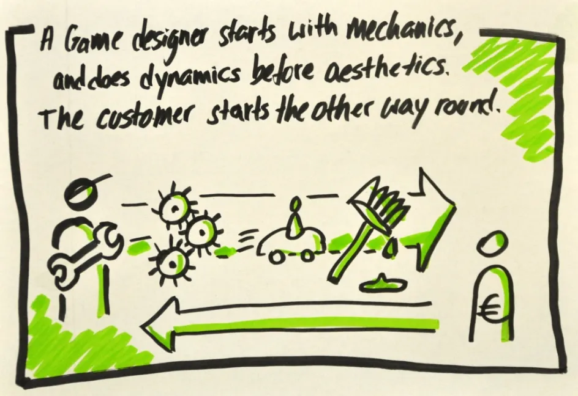
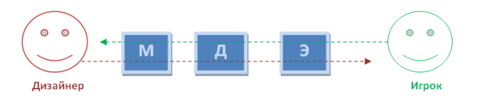
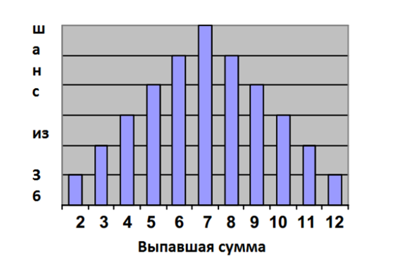
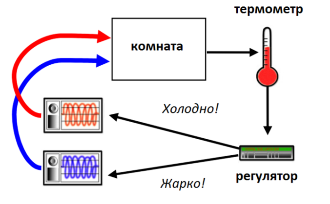
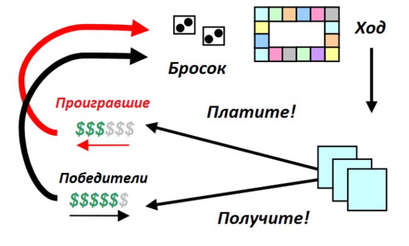

# МДЭ: Формальный подход к гейм-дизайну и изучению игр

Данный пост — перевод лежащей в основе современного понимания игр публикации Робина Ханика, Марка ЛеБланка и Роберта Зубека.

### Аннотация

В этой статье мы предлагаем вашему вниманию структуру МДЭ (Механика, Динамика, Эстетика) разработанную как часть тренинга по гейм-дизайу для Конференции гейм-дизайнеров в Сан-Хосе 2001-2004 годов.

МДЭ – формальный подход к изучению игры, пытающийся преодолеть пропасть между гейм-дизайном с одной стороны и разработкой, критикой и техническим развитием игр – с другой. Мы надеемся, что эта методика прояснит и укрепит взаимосвязь итеративных процессов разработчиков, учёных и исследователей, и упростит им их общие задачи по разложению на компоненты, изучению и созданию множества новых игровых дизайнов и артефактов.

### Вступление

Все артефакты были созданы в рамках какой-либо методологии дизайна. Чем бы мы ни занимались – конструированием прототипа, созданием программного обеспечения для пользовательского интерфейса, сочинением диалога или проведением серии контролируемых экспериментов – методология дизайна управляет творческим процессом и обеспечивает качество работы.

В частности, итеративный, качественный и количественный анализы очень помогают дизайнерам. Во-первых, они помогают им оценить _конечный результат_ и отточить реализацию, а во-вторых, оценить _реализацию,_ чтобы усовершенствовать конечный результат. Подходя к этому процессу с двух сторон, они могут продумать широкий ряд возможностей и взаимосвязей.

Это особенно важно при работе с компьютерными и видеоиграми, где взаимодействие между кодированными подсистемами создаёт сложное, динамическое (зачастую – непредсказуемое) поведение. Дизайнеры и исследователи должны тщательно продумывать все взаимосвязи, прежде чем вносить любые изменения, а учёные должны распознавать эти взаимосвязи, прежде чем делать выводы о природе полученного игрового опыта.

В этой статье мы предлагаем вашему вниманию структуру МДЭ (Механика, Динамика, Эстетика) разработанную как часть тренинга по гейм-дизайу для Конференции гейм-дизайнеров в Сан-Хосе 2001-2004 годов. МДЭ – формальный подход к изучению игры, пытающийся преодолеть пропасть между гейм-дизайном с одной стороны и разработкой, критикой и техническим развитием игр – с другой. Мы надеемся, что эта методика прояснит и укрепит взаимосвязь итеративных процессов разработчиков, учёных и исследователей, и упростит им их общие задачи по разложению на компоненты, изучению и созданию множества новых игровых дизайнов и артефактов.

### На пути к понятной структуре

Гейм-дизайн и авторское творчество происходят на многих уровнях, в сферах исследования и разработки игр работают люди с разным творческим опытом и специализацией. И хотя часто при этом необходимо сосредоточиваться на каком-то одном аспекте игры, все, независимо от сферы деятельности, в определённый момент сталкиваются с необходимостью обдумывать вещи, лежащие вне этого аспекта: базовые механизмы игровых систем, важнейшие цели дизайна, результаты, ожидаемые от игрового процесса.

Ни программисты, ни исследователи не являются исключением. Решения о данных, их выражении, алгоритмах, инструментах, словаре и методологии, которые, на первый взгляд, не влекут за собой особых последствий, обязательно ещё отзовутся в конечном результате – игровом процессе. Точно также, всё, что пользователь должен пережить в процессе игры, должно быть заложено где-то внутри кода. Так как игры продолжают создавать всё более сложные системы агентов, объектов и системы с поведением, программирование и дизайн сливаются воедино.

Система становится стройной и взаимосвязанной, если удовлетворены все противоречивые требования и любая из частей игры, опираясь на другие, создаёт с ними единое целое. Для того чтобы разлагать эту взаимосвязь на составляющие, понимать её, создавать её, необходимо путешествовать по всем уровням абстракции – мгновенно перемещаясь от систем и кодов к контенту и игровому процессу, и обратно.

Мы предлагаем структуру МДЭ как инструмент, который поможет дизайнерам, исследователям и учёным выполнять эти действия.

### **МДЭ**

Игры создаются дизайнерами/командами разработчиков, а потребляются игроками. Их покупают, используют, и, в конечном итоге, избавляются от них, как и от большинства товаров потребления.

Производство и потребление игр.

Разница между играми и другими продуктами сферы развлечений (книги, музыка, фильмы, пьесы) в том, что их потребление относительно _непредсказуемо_. Цепь событий в ходе игрового процесса и исход этих событий неизвестны даже тогда, когда создание продукта завершено.

Структура МДЭ формализует потребление игр, разбивая его на три отдельных компонента:

… и определяя их соответствия на уровне дизайна:

**Механика** описывает отдельные компоненты игры на уровне данных и алгоритмов.

**Динамика** описывает поведение механики в действии, когда та отвечает на действия игрока и любые других вмешательства с течением времени.

**Эстетика** описывает желаемую эмоциональную реакцию игрока при его взаимодействии с игровой системой.

Основанием этой структуры послужила идея о том, что игры – это _скорее артефакты,_ чем выразительное средство. Под этим понимается, что содержанием игры является её поведение, а не выразительное средство, которое доносит его до игрока.

Если мы будем рассматривать игры как разработанные дизайнерами артефакты, это поможет структурировать их в качестве систем, которые строят своё поведение на взаимодействии. Это способствует более осознанным дизайнерским решениям и точному анализу на всех уровнях изучения и разработки.

### **МДЭ в деталях**

#### **МДЭ как линза**

Каждый компонент структуры МДЭ может быть представлен в виде «линзы» или «перспективы» игры – отдельный, но связанный с другими.

С точки зрения дизайнера механика задаёт динамическое поведение системы, что приводит к определённому эстетическому восприятию. С точки зрения игрока тон задаёт эстетика, она рождается из наблюдаемой динамики и, в конечном счёте, действующей механики.

Разные точки зрения дизайнера и игрока.

Работая с играми, полезно учитывать обе точки зрения: как дизайнера, так и игрока. Это помогает нам увидеть, как малейшие изменения на одном уровне приводят к целому ряду других. Кроме того, если думать в первую очередь об игроке, это заставляет идти в дизайне от впечатлений, которые мы хотим вызвать у игрока, а не от нововведений, которые хотим внедрить.

Таким образом, мы начинаем наше исследование с дискуссии об эстетике, продолжаем динамикой и заканчиваем стоящей за всем этим механикой.

#### **Эстетика**

Что делает игру интересной? Как нам отличить один вид интересного от другого? Разговор об игре усложняется тем, что наш словарный запас в этой области весьма ограничен.

Описывая эстетику игры, мы бы хотели избегать слов «интересно» и «игровой процесс» и вместо этого использовать более конкретные слова. Например, такие (это неполный список):

1.  **Ощущение** _Игра как удовольствие от ощущений_

2.  **Фантазия** _Игра как стимул воображения_

3.  **Повествование** _Игра как драма_

4.  **Преодоление вызова** _Игра как полоса препятствий_

5.  **Единение** _Игра как социальная структура_

6.  **Открытие** _Игра как неисследованная территория_

7.  **Выражение** _Игра как средство самопознания_

8.  **Подчинение** _Игра как хобби_

Например, подумайте о таких играх как _шарады_, _Quake, The Sims_ или _Final Fantasy_.  Каждая из них по-своему интересна, но более содержательным было бы описание эстетических компонентов, которые формируют впечатление игрока от каждой из игр:

**Шарады:** единение, выражение, преодоление вызова.

**Quake**: преодоление вызова, ощущение, соревнование, фантазия.

**The Sims:** открытие, фантазия, выражение, повествование.

**Final Fantasy:** фантазия, повествование, выражение, открытие, преодоление вызова, подчинение.

Здесь мы видим, что каждая игра преследует сразу несколько эстетических целей, каждую – в разной степени. _Шарады_ акцентируют внимание на единении, оставляя в тени преодоление вызова; _Quake_ же ставит преодоление вызова во главу игрового процесса. И хотя пока не существует единой великой теории игр или формулы, которая определяет состав и пропорции элементов, которые составляют «интересную» игру, эта таксономия помогает описать игры и проливает свет на то, почему разные игры привлекают разных игроков, или тех же игроков, но в разное время.

#### Эстетические модели

Используя в качестве ориентира эстетический словарь, мы можем определить модели игрового процесса. Эти модели помогают нам описывать динамику и механику игрового процесса.

Например: и _шарады_ и _Quake_ – игры соревновательные. Они успешны лишь в том случае, когда команды игроков сильно заинтересованы в победе друг над другом. Значит, необходимо, чтобы у игроков был противник (в _шарадах_ – команда противников, в _Quake_ – виртуальный противник) и все стремились к победе.

Не составляет труда заметить, что противопоставление игроку противника и предоставление чёткой информации о том, кто выигрывает, являются сутью соревновательных игр. Если игрок не видит чётких условий победы, или ему кажется, что он вряд ли сумеет победить, игра становится гораздо менее интересной.

#### Динамические модели

Динамика работает над созданием эстетического переживания. Например, _вызов_ создаётся ограничением во времени или действиями противника. _Единение_ поощряется при необходимости делиться информацией с другими участниками игровой сессии (командой) или когда условия победы трудно выполнить в одиночку (например, захват вражеской базы).

_Выражение_ построено на динамике, которая поощряет каждого из игроков оставить свой след: системы покупки, комбинирования и получения объектов для разработки, создания и изменения уровней или миров, а также для создания уникальных персонажей. _Драматический эффект_ происходит, когда динамика провоцирует нарастающее напряжение, кульминацию и развязку.

Как и в случае с эстетикой, мы хотим, чтобы наша дискуссия оставалась как можно более конкретной. Разработав модели, которые предсказывают и описывают динамику игровых процессов, мы можем избежать самых распространённых ошибок дизайна.

_Распределение вероятностей случайной переменной 2 D6._

Например, модель двух шестигранных игральных костей поможет установить среднее время, необходимое игроку на то, чтобы пройти круг по доске в _«Монополии»,_ если нам будет известна вероятность выпадения различных комбинаций.

_Термостат, работающий по принципу обратной связи_

Похожим образом мы можем находить системы обратной связи в рамках игрового процесса, чтобы определить, как каждое из состояний или изменений влияет на общее состояние игры. В _«Монополии»,_ когда лидер или лидеры становятся всё богаче, они могут взыскивать деньги с игроков с возрастающей эффективностью. Бедные игроки всё быстрее беднеют.

_Система обратной связи в «Монополии»_

С увеличением разницы лишь немногие (а иногда всего один) из игроков получают прибыль. Из игры уходит напряжение и способность как-то повлиять на события.

Понимая эстетику и динамику, мы можем найти способы исправить эти недостатки _«Монополии» —_ либо вознаграждая бедных игроков, не давая им слишком отставать, либо затрудняя дальнейшее продвижение для богатых игроков. Конечно же, это повлияет на способность игры воссоздавать реальность монополизации, но ведь реальность далеко не всегда интересна.

#### Механика

Механика – это различные действия, поведение и механизмы контроля, которые предоставляются игроку в игровом контексте. Вместе с контентом игры (уровни, ресурсы и тому подобное) механика обеспечивает динамику игрового процесса.

Например, механика карточных игр включает в себя тасование, взятки и ставки – из чего возникла динамика блефа. Механика шутеров включает в себя оружие, боеприпасы и точки респауна, что иногда порождает динамику кемперства или снайперства. Механика гольфа включает шары, клюшки, песочные ловушки и водные препятствия, что иногда приводит к сломанным или утопленным клюшкам.

Налаживая механику, мы можем подстраивать общую динамику игры. Возьмём наш пример с _«Монополией»_ . Механика, которая могла бы помочь отстающим игрокам – бонусы или «субсидии» для бедных игроков и штрафы или «налоги» для богатых игроков, применяемые, например, при повторном пересечении стартовой клетки, выходе из тюрьмы, или при достижении монополии в количестве отраслей, превышающем установленные лимиты. Внедрив эти изменения в основополагающие правила игры, мы могли бы более длительное время поддерживать в отстающих игроках соревновательный азарт.

Другим средством оживления затянутых партий в _«Монополию»_ могли бы стать временные рамки, подгоняющие игровой процесс. Например, постепенное истощение ресурсов фиксированным уровнем налога (чтобы игроки быстрее тратили деньги), удвоение выплат по монополизированным секторам (чтобы игроки быстрее разделились на богатых и бедных), или случайное распределение недорогих объектов между игроками.

#### Подстройка

Последним пунктом нашего анализа _«Монополии»_ является тестирование и подстройка. Путём многократного прогона мы можем точно установить необходимый размер штрафов, налогов и лимитов на вознаграждения и наказания, и таким образом отточить до совершенства и сбалансировать игровой процесс _«Монополии»._

Во время этой подстройки, эстетические модели и разработанный словарь помогают нам правильно формулировать цели дизайна, обсуждать недостатки, измерять успех внесённых изменений. Если в нашей _«Монополии»_ расчёт налога требует сложных вычислений, мы можем отбить у игроков вкус к инвестированию, ведь им будет трудно проследить размер своей прибыли, а значит, и своё продвижение и расстановку сил в игре.

Похожим образом, динамические модели помогают нам обнаружить возможный источник проблемы. Используя модель D6, мы можем рассчитать возможные изменения размера игрового поля или его композицию, установив, как изменения могут удлинить или сократить игру.

### **МДЭ в действии**

А теперь давайте представим, что мы разрабатываем или улучшаем программное обеспечение игры. Иногда велик соблазн идеализации программного обеспечения, представление его в виде чёрного ящика с механизмами, которые, теоретически, можно применить во множестве самых разных проектов с относительной лёгкостью. Но как показывает наша структура, компоненты игры невозможно оценить в вакууме, в отрыве от их воздействия на поведение системы и переживаний игрока.

#### **Первый шаг**

Представьте для примера игру _«Няня»_. Ваш начальник решил, что будет полезно создать простой прототип программы для такой игры. Ваш игрок будет «няней», которая должна найти и уложить спать ребёнка. Демо-версия разрабатывается с тем, чтобы она могла отображать простых, вызывающих эмоции персонажей (таких, как младенец) в играх для детей в возрасте 3-7 лет.

Каковы эстетические цели дизайна? Исследование и открытие, вероятно, будут важнее, чем преодоление вызова. Раз так, то динамика здесь направлена не на «победу» или «соревнование», а на то, чтобы «младенец» продемонстрировал эмоции: удивление, опасение, предчувствие.

Тайники можно отметить вручную, пути между ними жёстко запрограммировать; большая часть игровой логики будет посвящена тому, как обнаружить младенца и вызвать у него характерные эмоциональные реакции. Механика игрового процесса должна включать обращения к ребёнку («Я тебя вижу!» или «У-у-у!»), погоню за ребёнком (с помощью аватара или просто мыши), подкрадывание, салки и тому подобное.

#### **Второй шаг**

Теперь представьте вариант той же игры, но построенный на франшизе, например _«Ох уж эти детки!»_ от _Nickelodeon,_ целевой аудиторией которой являются дети в возрасте от 7 до 12 лет. Эстетически эта игра должна предоставлять больший вызов – возможно, следует включить туда повествование (значит, потребуются несколько «уровней», каждый будет предоставлять новый фрагмент истории и связанные с ним задания).

Говоря языком динамики, герою теперь нужно отслеживать и взаимодействовать с несколькими персонажами сразу. Можно добавить механику временных ограничений (например, уложить их всех спать до девяти вечера), добавить параметр «беспорядок» и отслеживание эмоций персонажей (из-за грязного подгузника ребёнок плачет, из-за плача игрок теряет очки) и так далее.

Для такого дизайна статичные пути уже не подходят – и, наверное, стоит дать персонажам возможность самим выбирать, где прятаться. Будут ли у каждого ребёнка свои собственные характеристики, способности, трудности? Если да, как эти различия будут показаны игроку? Как отслеживать внутреннее состояние, судить о мире, персонажах, игроке? Какие задания и действия будут предоставлены игроку?

#### **Третий ход**        

Наконец, ту же самую игру в салки можно представить в виде полнофункциональной стратегической симуляции в стиле милитари – наподобие _Splinter  Cell_ или _Thief._ Теперь нашей целевой аудиторией являются люди от 14 до 35 лет. Эстетические цели расширяются  и включают элемент фантазии (вхождение в роль элитного разведчика или мародёра) и преодоление вызова должно, пожалуй, граничить с подчинением. Вдобавок к сюжету, полному интриг и напряжения, игрок будет ожидать координированных действий со стороны оппонентов – но, пожалуй, меньше эмоциональных реакций. Если уж на то пошло, то они должны проявлять страх и ненависть при первом же намёке на появление игрока.

Динамика должна включать способность зарабатывать и покупать мощное оружие и шпионское оборудование, а также развивать новые тактики и техники бесшумного и незаметного передвижения, обманных манёвров, уклонения и побега. Механика должна включать разветвлённое технологическое древо и древо навыков, разнообразие вражеских юнитов, уровни местности с различной степенью трудности прохождения, видимости, поля зрения и так далее.

В этом пространстве агенты, вдобавок к координированным движениям и атакам, должны оперировать широким спектром сенсорных данных. Суждения о положении игрока и его намерениях должны определять вызов, но в то же время, способствовать общему прогрессу игрока. Будут ли враги преодолевать сложные препятствия и прокладывать маршрут через сложный ландшафт, или они будут «срезать путь»? Будет ли звук распространяться «реалистично» или достаточно простых вычислений, основанных на расстоянии до источника?

#### **Краткие выводы**

Мы увидели, что простые изменения в требованиях к эстетике приводят к изменениям в механике на всех уровнях программного обеспечения, зачастую требуя разработки совершенно новых систем навигации, новой логики, и решения стратегических проблем.

В то же время, мы убедились, что сама по себе механика не обладает «искусственным интеллектом», внутренняя стройность и «интеллект» возникают из взаимодействия логики программного обеспечения с логикой игрового процесса. При помощи структуры МДЭ мы можем ясно и понятно рассуждать об эстетических целях и в соответствии с ними выбирать диапазон механик.

#### **Заключение**

МДЭ способствует формальному итеративному подходу к дизайну и его регулировке. Он позволяет нам ясно рассуждать о конкретных целях дизайна и предвидеть, как изменения в них повлияют на каждый из аспектов этой структуры, включая конечный дизайн/реализацию.

Двигаясь между уровнями абстракции МДЭ, мы можем представить себе динамическое поведение игровых систем. Рассматривая игры в качестве динамических систем, мы можем разработать техники итеративного дизайна и усовершенствования – контролируя нежелательные последствия и добиваясь желаемого поведения.

Кроме того, понимая, каким образом формальные изменения в игровом процессе повлияют на переживания игрока, мы можем анализировать эти переживания и использовать результаты для разработок нового дизайна, для изучения и критики.

_Перевод — Ю. Сергеева._