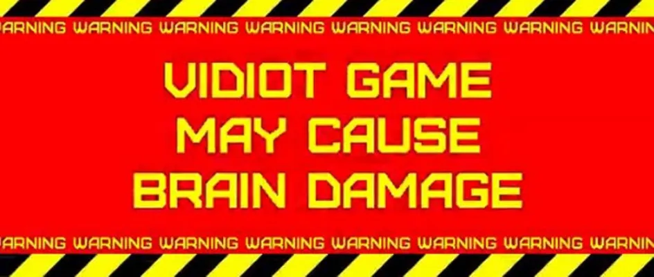

# Не будь видиотом, или Чему дизайнер компьютерных игр может научиться у игр неэлектронных (по Грегу Костикяну)

Если посмотреть со стороны на нашу отрасль, то трудно не озаботиться обилием скучных, однообразных названий и скудостью инноваций в сфере, когда-то славившейся оригинальностью и креативностью. Инновации всё чаще происходят за счёт развития технологий, а не за счёт творчества дизайнеров – как будто трёхмерные приключения как-то качественно отличаются от двухмерных.

Игры ведь невероятно пластичное выразительное средство – есть целое сонмище игр, целая вселенная странных и чудесных игровых стилей. Есть люди, считающие, что распределение всех компьютерных игр по нескольким узнаваемым жанрам является признаком зрелости индустрии, дескать, мы, наконец, выяснили, в какие виды игр людям нравится играть. Мне очень трудно поверить, что это так. Эта отрасль всего-то двадцать лет существует. Возможности техники, с которой мы работаем, год за годом продвигаются вперёд семимильными шагами. Если такая старая художественная форма, как роман, продолжает каждый год дарить миру творческие открытия, то нам ещё рановато говорить о том, что мы изучили базовые разновидности компьютерных игр.

**Если рынок так поощряет инновации, что же тогда заставляет нас снова и снова направлять все усилия на то, чтобы повторять базовые мотивы? Что не так с нашей индустрией, почему всё так скучно?**

Одной из причин, безусловно, является консерватизм издателей. Скажем, вы продюсер в _GT Interactive_, или в _ЕА_, или в _Eidos_, и вы дали добро на производство очередного клона с _Command & Conquer_, а он не очень-то хорошо продаётся – ну что ж, никто не может упрекнуть вас в провале. Издаётся множество клонов с _Command & Conquer._ Что-то продаётся очень здорово. Просто ваша версия не совсем в яблочко попала. Вряд ли вас уволят. Если же вы дали добро на что-то действительно нестандартное, и оно провалилось, то вы – просто псих. О чём вы думали? Ваша работа под угрозой.

Том Диш, выдающийся писатель-фантаст, который с тех пор сделал блестящую карьеру модного автора, настаивает, что писатель, который хочет овладеть этим искусством в полной мере, должен много читать – произведения разных эпох, разных жанров. Думаю, то же относится и к разработчикам игр. Если ваш опыт основан исключительно на аркадных играх, ваш технический арсенал, ваше представление о возможностях игр будет ограниченным. Вы будете, уж простите мне выражение, **видиотом – человеком, который свое представление об играх черпает исключительно из видеоигр.**

Если же вы, напротив, исследуете странную и изменчивую вещь, которую мы называем игрой, во всех её проявлениях, вы увидите, что этот мир велик, число техник огромно, что это действительно невероятно пластичная среда. Чтобы вкратце продемонстрировать, как важно не быть видиотом и изучать неэлектронные игры, вот пара тезисов. Неэлектронные игры существовали задолго до электронных, и в неэлектронной среде было разработано гораздо больше стилей, хотя бы по той простой причине, что неэлектронную игру вы можете разработать с бюджетом в пару баксов на картон, бумагу и чернила.

В 1824 году лейтенант прусской армии фон Райссвиц разработал игру на основе реалистичных военных карт масштаба 1:8000. Он показал её главе штаба прусской армии, который воскликнул: «Это же не игра, это учения!»

Массовая индустрия как таковая, состоит большей частью из старых известных марок, которые продаются потому, что название знают все, всякой шелухи, основанной на фильмах и ТВ, и детских игр, которые по сути – тупые. Самые интересные вещи обычно создаются для взрослой аудитории.

Эстетика немецких настольных игр
--------------------------------

*   На самом деле – не такие уж сложные
*   Подавляющее большинство игр рассчитано на несколько игроков
*   Обычно чётко ограничены по времени, два часа – не больше
*   Ходы очерёдные, но каждый ход занимает всего пару минут, и часто другие игроки могут воздействовать на вас на вашем ходу, поэтому они не сидят без дела и не ждут попусту.
*   Обычно у вас есть всевозможные ресурсы, которыми вы в ходе игры манипулируете – карты в руках, фишки на поле и тому подобное.
*   Вы сталкиваетесь с небольшим количеством решений, но это, как правило, сложные решения.

Игры типа Дипломатии
--------------------

Обычно ходы записываются, а затем открываются и совершаются одновременно, так что вы никогда не знаете, что делают другие игроки, пока вы пишите свой ход. Ключевым в игре является распоряжение по обеспечению боевых действий, которое даёт вашим юнитам возможность поддерживать ходы других игроков. Это относительно стройная стратегическая игра, но главная инновация в ней заключается в том, что она полностью зависит от переговоров и дипломатии. Все силы приблизительно равны, единственный шанс превзойти противника – найти себе союзников. Но из-за того, что вы не знаете действий других игроков, вы не можете полностью доверять своим союзникам. Подлянки очень заразительны. Игра часто заканчивается слезами. Это злая, замечательная, захватывающая игра.

Такие игры стоит изучить дизайнерам сетевых игр; они способствуют общению и напряжённым дебатам, а общение и является альфой и омегой сетевых игрушек.

Миниатюрные игры
----------------

Вы сразу же поймёте, в чём прелесть миниатюрных игр, если когда-нибудь вам доведётся увидеть разложенный стол. Ярко раскрашенные фигурки маршируют через поле плотными рядами. Зрительный эффект очень впечатляющий, а поклонники миниатюр любят демонстрировать свои работы. Игра привлекательна примерно тем же, что и настольная военная стратегия – тактика, планирование, много времени на то, чтобы обдумывать ходы. Есть, конечно, и что-то от прелестей коллекционирования: например, как же вы будете использовать крошечную катапульту, если у вас нет для неё соответствующей фигурки? Именно фигуры, которые у вас есть, задают тон всей вашей армии. А нас миниатюрные игры могут вот чему научить:

*   Продавать нужно не игру, продавать нужно фигурки
*   Фанаты миниатюрных игр большую часть времени проводят за раскрашиванием фигурок, а не за игрой. Им эта задача кажется интересной и приятной, так же, как и коллекционерам различных моделей. В каком-то смысле, это и есть моделирование, особенно для тех, кто потом начинает нападки на готовые наборы. Здесь опять-таки есть о чём подумать, особенно создателям сетевых игр.

Варгеймы
--------

Сложность правил не обязательно влечёт за собой сложность стратегии. Весь интерес варгейма в том, чтобы овладеть сложной системой, а среди трудных и хитроумных тактических решений, которые вам придётся принимать – как именно вам разместить свои фишки, чтобы произвести атаку с максимальной эффективностью.

Военные стратегии – просто кладовая идей системного дизайна. Любители этих игр придают большое значение новшествам и усовершенствованиям с целью создания точного и непыльного воссоздания военных действий. И это понятно, ведь в этой индустрии всегда были уверены: их аудитория хочет инноваций в дизайне, а не в технологиях.

Между тем, правда и то, что эти системы симулируют исключительно военные конфликты и у них ограниченный набор физических компонентов. И всё же, дизайнерам, а в особенности – дизайнерам стратегий в реальном времени, нужно изучать настольные военные стратегии, чтобы увидеть, как можно подчеркнуть великое множество разных аспектов конфликта в разных играх. Можно подчеркнуть линии поставок, «туман войны», различные соединения в армиях, манёвры, развёртывание в боевой порядок, уровень командиров, важность артиллерии или воздушных сил, боевой дух, производство в тылу, даже желание или нежелание гражданского населения поддерживать войну. Просто для каждого нового акцента нужна ещё одна система.

Ролевые игры
------------

Ролевые игры начались в 1973 году, когда вышло первое издание _Dungeons&Dragons. D&D_ были опубликованы _Tactical Studio Rules._ Те самые первые правила из оригинальной «коричневой коробки» были одними из самых плохо написанных правил, которые мне приходилось читать; они изобиловали сбивающими с толку указаниями, которые можно было очень по-разному толковать. Одним словом, это было слабая реализация невероятно оригинальной и важной идеи, и, несмотря на не самый удачный дизайн, она быстро игра стала массовым хитом и превратилась в культ.

Это была история, в которой можно участвовать. А открытый финал игры тоже будоражил. Случиться может что угодно – перед тобой целый мир. Неважнецкие правила тоже, в извращённом виде, побуждали к творчеству. По сути, вам надо было придумывать свои правила, используя оригинальные как основу, потому что написаны они были бестолково.

Сначала первым порывом игроков было играть так, как написано: рубилово с исследованием подземелий. Но сама природа ролевой игры привела к более утончённым стилям и захватывающим сюжетам, в которых очень важным стало взаимодействие персонажей – и многие стали играть именно так.

Коллекционные карточные игры
----------------------------

Индустрия коллекционных карточных игр началась в 1993 году с публикации Ричардом Гарфилдом набора _Magic: The Gathering_ от компании _Wizards of the Coast. Magic_ относится к так называемым «играм с исключениями». Другой пример подобной игры – _Cosmic Encounter_. У игр с исключениями очень простой, лаконичный набор правил, но на некоторых картах напечатаны дополнительные правила, которые вносят изменения, преобразуют или нарушают основные правила. В результате, всё это взятое вместе может представлять собой весьма сложную систему, но в самом начале всё очень просто и быстро усваивается.

**Вы играете против других людей, у которых собраны свои собственные колоды. В результате вы никогда не знаете заранее, с чем вам придётся столкнуться: из тысяч возможных карт ваш соперник выбрал 60 для поединка с вами. Часть очарования игры в её вариативности, в том, что вам никогда не известно заранее, с чем вы будете бороться.**

Как продвинутый игрок в _Magic,_ могу сказать, что в этой игре самое интересное: вы можете провести сто часов за подбором своей колоды, используя самые продвинутые техники (проверка маны, временные и постоянные преимущества карт, превосходство одних над другими) а потом проиграть соперникам с очень простой колодой только потому, что вы не знали или просто не поняли их стратегии.

Хотя, пожалуй, самое важное в _Magic –_ это метаигра. Сама игра, разумеется, – это вы, ваша колода, ваш соперник со своей колодой и то, что происходит между вами за столом. Метаигра – это то, что происходит до игры: покупка карт, подбор колоды таким образом, чтобы карты поддерживали друг друга и затейливо взаимодействовали (это не совсем так: часто бывает, что карты запрещаются, потому что игроки превосходят тестеров в создании мощных комбинаций, которые те просто не смогли предвидеть).

_Magic_ ещё и замечательный маркетинговый проект, хотя бы по двум причинам:

*   Коллекционные игры, а особенно ролевые, зачастую продаются в отделах, содержащих прочие коллекционные предметы из мира комиксов и поп-культуры. Как следствие, карты стали продуктом, о котором было известно заранее, как его размещать и продавать, они вошли в настежь распахнутую дверь.
*   Желание всегда иметь самую сильную и самую новую колоду и обставить всех друзей приводит к тому, что алчные игроки всё время покупают новые карты, надеясь, что им попадётся что-то нереально крутое. Это роднит _Magic_ с _Warhammer’ом._

Ролевые игры живого действия
----------------------------

Это не индустрия, и, пожалуй, никогда ею не станет. Всё делается энтузиастами для энтузиастов и не предусматривает никакой материальной выгоды. «Живые» ролевые игры (или LARP) многим отличаются от настольных RPG:

*   Игроки не сидят за столом, они ходят и вступают друг с другом в беседы;
*   В большинстве LARP действия производятся путём действительного, физического действия в игровом пространстве.
*   Большинство живых игр задействуют десятки, а то и сотни игроков и множество мастеров.
*   Основные правила для живых игр обычно куда проще, чем для настольных RPG: ведь множество игроков должны их быстро усвоить и тут же приступить к игре.

LARP’ы делятся на три основных подвида: «приключенческие» или «линейные»; «интерактивные» или «произвольные», и коммерческие, являющиеся, по сути, категорией произвольных.

**Приключенческие LARP** обычно происходят под открытым небом: ведь гораздо проще задействовать поляну в лесу, чем оборудовать подземелье в подвале. Обычно они представляют собой последовательность препятствий, которые участникам предстоит преодолеть – битвы, физические испытания, интеллектуальные задачи или же чистый отыгрыш своей роли. Стычки бывают с врагами, монстрами и другими персонажами, которых также играют люди, но организованные для участников мастером. Приключенческие живые игры обычно разыгрываются группой одних и тех же людей, которые часто собираются вместе, поэтому вы можете согласиться побыть за монстра на этой неделе, а на следующей – самому пуститься в приключение.

В **произвольных играх**  каждому из десятков или сотен игроков выдаётся персонаж, заранее разработанный и написанный гейм-дизайнером. То есть, вы не играете за обычного персонажа, а исполняете особо отведённую вам роль в заранее установленном сценарии. Каждый персонаж имеет свои собственные цели и задачи в игре; дизайнеры разрабатывают их так, чтобы занять персонажей и заставить их говорить друг с другом. Игрокам выдаются брошюрки с разъяснениями. Затем они вольны играть друг с другом: беседовать, устраивать сговоры, красть, предавать и так далее. Как правило, всегда есть штаб с мастерами, куда игроки обращаются за наставлениями; часто некоторые из мастеров обходят территорию и наблюдают за игрой. Бывает и так, что мастера объявляют какое-нибудь особое событие, чтобы подстегнуть игру.

Последняя категория, которую я хочу обсудить, вовсе и не категория, а точнее, никто, кроме меня её с этой точки зрения не рассматривает. Это игра с разветвляющейся сюжетной линией. Самая интересная черта таких игр это то, что их можно воплотить почти в любой сфере. В сфере компьютерных игр они называются приключенческими играми. Серия ролевых книг-игр _Fighting Fantasy_ предлагала выбор куда более разнообразный, чем просто свернуть туда/свернуть сюда. Они содержали зачатки игровой системы и требовали от игрока сражаться с монстрами, взламывать замки, разгадывать загадки и так далее, и выбор страницы предопределял успех или неудачу. Другими словами, они были, по сути своей, индивидуальными ролевыми приключениями, и довольно интересными. То есть, это, конечно, не великое искусство, но за пару баксов, которые вы за них платили, вы получали стоящее этих затрат развлечение.

_Перевод — Ю. Сергеева_