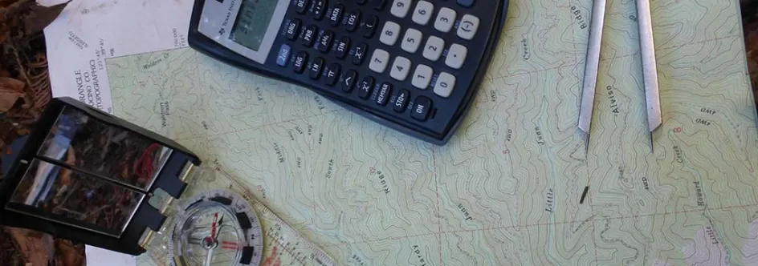

# Уровень 1: Введение/Что такое игра?

Данный пост — перевод вводной статьи из курса лекций «Принципы гейм-дизайна» за авторством профессионала и преподавателя [Яна Шрайбера](http://www.gamasutra.com/view/authors/916452/Ian_Schreiber.php). [Весь курс](http://gamedesignconcepts.wordpress.com/) рассчитан на 20 лекций и предполагает большое количество самостоятельной практической работы. Вместе со своими коллегами я собираюсь пройти этот курс. В качестве рабочей платформы мы будем использовать не указанные автором ресурсы, а этот сайт. Точно так же мы собираемся отойти от предложенных автором временных указаний и работать по собственному графику. Надеюсь, и промежуточные, и итоговые результаты будут вам интересны. 

Уровень 1: Введение/Что такое игра?
-----------------------------------

Добро пожаловать в Принципы гейм-дизайна! Меня зовут Ян Шрайбер, и я буду вашим проводником в этом эксперименте. Я слышал много воодушевлённых откликов несколько последних месяцев, пока шла регистрация, и уверяю вас, я так же воодушевлён (и смущён) всем происходящим, как и любой из вас. Так что позвольте мне выразить вам признательность за ваше время – я сделаю всё, от меня зависящее, чтобы оно не было потрачено зря.

_Описание курса:_

Прежде, чем начать, я бы хотел сразу расправиться с несколькими организационными вопросами:

— регистрация. Пока я пишу это, продолжает копиться огромное количество непрочитанных запросов на регистрацию, отправленных в последнюю минуту. Поэтому, если вы написали мне, но не получили ответа, просто проверяйте свои входящие ближайшие пару дней. Если до среды ответ всё ещё не придёт, это значит, что я не получил вашего письма, поэтому вам стоит найти его и переслать ещё раз. Ещё раз проверьте электронный адрес: [gamedesignconcepts@yahoo.com](mailto://gamedesignconcepts@yahoo.com)

— ещё на эту тему: примите во внимание, что в проекте участвуют свыше тысячи людей. Я очень ценю все ваши отзывы и предложения, но если вы прислали письмо лично мне, помните, что я могу получить множество таких писем и мне требуется некоторое время, чтобы добраться до вашего.

— у этого курса будет два ресурса: вики и блог.

— вики-ресурс находится на  [http://gamedesignconcepts.pbworks.com](http://gamedesignconcepts.pbworks.com/) и у него двойное назначение: для работы в группах (если вы проходите этот курс с друзьями) и в качестве площадки для людей, которые пожелают опубликовать переводы этого блога на другие языки (как некоторые из вас предложили). Если вы придумаете, как иначе использовать этот ресурс – добро пожаловать! На данный момент это закрытый ресурс, требующий для входа адрес и пароль. Если вы зарегистрированы, ожидайте письма, которое придёт в течение ближайших дней и будет содержать данные, необходимые для входа.

— место для обсуждения находится на [http://gamedesignconcepts.aceboard.com](http://gamedesignconcepts.aceboard.com/)  – это начальное место для интерактивной дискуссии. Я создал отдельные площадки для обсуждения, разделив их по интересам (для студентов колледжа, для профессиональных преподавателей, для гейм-дизайнеров и так далее). Скоро я создам форумы по географическому принципу, чтобы вы могли найти кого-то, с кем сможете встретиться лично, если захотите. Так же вы сможете публиковать работы, которые вы готовите в рамках этого курса, обмениваться профессиональными мнениями (эта возможность появиться, когда будут даны соответствующие задания). Кроме того, наверху вы найдёте ссылку на форум Meta Discussion, который является обсуждением самого курса – что удается, а что – не очень, в то время как блог, вики-ресурс и форум будут использоваться для общения. **Вам нужно будет создать аккаунт и подождать, пока модератор вас добавит. Это может занять несколько дней, поэтому прошу вас проявить терпение.**

— в твиттере используйте хэштег [#GDCU](https://twitter.com/) для всех твитов, имеющих отношение к курсу.

— если вам есть, что сказать о содержании курса, оставляйте комментарии [здесь, в этом блоге](http://gamedesignconcepts.wordpress.com/).

Ну и теперь, когда мы разобрались со всем этим, давайте поговорим о гейм-дизайне!

_Обзор курса_

Большинство областей знания изучаются уже тысячи лет. Гейм-дизайн же изучается самое большее лет десять. У нас нет обширных исследований, на которые мы могли бы опираться, как это делают в других науках.

С другой стороны, нам повезло. В ходе последних нескольких лет мы достигли того, что мне кажется критической массой концептуальных и аналитических работ, а также теоретического и практического опыта, достаточного для создания учебной программы колледжа… или, по крайней мере, десятинедельного курса, как в нашем случае.

Ладно, допустим, это не совсем так. На самом деле по гейм-дизайну полно материала, множество книг (и ещё больше издается с пугающей скоростью). Но подавляющее большинство либо совершенно бесполезны, либо читаются так тяжело, что никто из работающих в этой сфере не удосуживается их осилить. То, что вам придётся прочесть в рамках этого курса, по разным причинам, зарекомендовало себя в гейм-индустрии – большинство профессиональных дизайнеров уже знакомо с этими книгами.

Курс поделён на две части. Первая часть будет сосредоточена на теориях и концептах гейм-дизайна. Мы разберёмся, что такое игра, как разбить концепт игры на элементарные составляющие, и что делает одну игру лучше или хуже другой. Вторая половина курса будет посвящена, главным образом, практическому аспекту создания хорошей игры из ничего, и процессам с которыми вам придётся иметь дело при создании собственных игр (ничего цифрового и никакого программирования), так что вы сможете увидеть, как теория работает на практике.

Что такое игра?

Те из вас, кто немного заглядывал в текст Challenges могут подумать, что ответ очевиден. Моё любимое определение: это **деятельность**, имеющая **правила** и включающая **конфликт**. Но вопрос «что есть игра?» на самом деле, гораздо более сложный.

— для начала, это моё определение. Конечно, оно было взято на вооружение институтом повышения квалификации Международной ассоциации разработчиков игр (главным образом потому, что никто не захотел со мной спорить). Между тем, есть множество определений, которые противоречат моему. И многие из них даны людьми с большим опытом в гейм-дизайне, чем у меня. Так что можете принять это определение (и что угодно ещё) на веру просто потому, что Я Так Сказал.

— во-вторых, это определение не говорит нам ничего о создании игр, поэтому мы поговорим о том, что есть игра с точки зрения её составляющих: правил, ресурсов, действий, истории и так далее. Я называю эти вещи формальными элементами игры (почему именно – обсудим позже).

К тому же, очень важно уметь разграничить разные игры. Рассмотрим игру «От трёх до пятнадцати». Наверняка, большинство из вас о ней даже не слышали. Её правила очень просты:

— два игрока

— цель: собрать три числа, которые в сумме дают 15.

— начало: напишите на листке бумаги цифры от 1 до 9; решите, кому ходить первым.

— ход игры: когда настанет ваш черёд, выберите число, которое ещё не было выбрано до этого никем из игроков. Вычеркните его из списка и запишите со своей стороны листка, показывая, что оно ваше.

— завершение: если кому-либо из игроков удастся собрать 3 числа, которые в сумме дают 15, игра заканчивается и этот игрок становится победителем. Если выбраны все 9 цифр, и никто из игроков не победил, игра закончилась вничью.

Попробуйте поиграть в эту игру сами с собой или против кого-нибудь. Узнаёте?

Числа от 1 до 9, которые нужно расставить в сетке 3х3, известной как «магический квадрат», где каждый ряд, колонка и диагональ даёт в сумме 15:

| 6 |   7   | 2 |
| --- | --- | --- |
| 1 | 5 | 9 |
| 8 | 3 | 4 |

Теперь вы точно узнали её. Это игра **Tic-tac-toe** (или Крестики-нолики или, ещё что-нибудь: название зависит от того, где вы живёте). Итак, «Крестики-нолики» и «От трёх до пятнадцати» — это одна и та же игра или разные игры? (правильный ответ: всё зависит от того, что вы понимаете под… вот именно! Поэтому так важно разобраться, что же такое «игра»!)

_Работа над созданием критического словаря терминов_

Когда я говорю «словарь терминов» я имею в виду набор слов, при помощи которых мы с вами сможем говорить об играх. Слово «критический» в данном случае не значит, что мы собираемся критиковать (например, выискивать в играх недостатки), но скорее значит, что мы можем критически оценивать игру (то есть, способны проанализировать её, внимательно рассмотрев все её составляющие и их взаимодействие, и заметить при этом как хорошее, так и плохое).

Словарь, возможно, не так интересен как игра, которую вы хотите создать – со стреляющими лазерами роботами-ниндзя, но он очень важен, так как даёт нам инструменты для обсуждения. Иначе мы будем топтаться на месте, отчаянно жестикулируя и рыча, а если мы не сможем нормально общаться, научиться чему-нибудь будет очень сложно.

Один из самых распространённых способов обсуждения игр, это описывать их посредством других игр. «Это как _Grand Theft Auto+Sims+World of Warcraft в_ _одном». Но такой способ имеет два ограничения. Во-первых, если я не играл в World_ _of_ _Warcraft, то я не пойму, о чём вы говорите. Во-вторых, такой способ бесполезен, если игра совершенно иная, не такая, как другие. Как вы опишите_ [_Katamari Damacy_](http://en.wikipedia.org/wiki/Katamari_Damacy) _при помощи других игр?_

_Другой способ, который часто предпочитают люди, составляющие учебники по дизайну – придумать необходимую терминологию, и затем последовательно применять её в тексте. Я бы мог поступить так, и тогда мы были бы в состоянии, по крайней мере, общаться на тему фундаментальных принципов гейм-дизайна. Проблемы бы начались после этого курса. Жаргон этого курса был бы непригоден для разговора с другими людьми. Я не могу приказать, не могу заставить всю гейм-индустрию говорить на своем языке._

_Вы можете задать вопрос: если словарь для обсуждения игр так важен, почему же его до сих пор не составили? Почему игровая индустрия не озаботилась созданием списка терминов? Дело в том, что он создается, но это очень долгий процесс. Мы можем увидеть, как некоторые термины появляются в текстах для чтения, и мы вернёмся к этому вопросу ещё не единожды в ходе первой половины этого курса._

_Игры и забавы_

_Есть множество разных забав: пинать мяч, воображать себя кем-то и, конечно, играть. То есть, можно представить себе игру как своего рода забаву._

_Игры состоят из разных элементов: правила, сюжет, физические компоненты и так далее. Забава – лишь один из аспектов игры. Таким образом, можно также воспринимать забаву как часть игры._

_Как две вещи могут включать друг друга? Это своего рода парадокс, и я приглашаю вас подумать над этим самостоятельно. Для нашей же цели это не суть важно, главное – что игры и забавы взаимосвязаны._

_Так что же такое игра?_

Вы, наверное, заметили, что я так и не ответил на ранее заданный вопрос, что такое игра. Это потому, что само понятие очень сложно поддаётся определению, по крайней мере, такому, которое не очерчивало бы слишком узкий круг, оставляя за его пределами вещи, которые очевидно являются играми, или слишком широкий круг, принимая в него вещи, совершенно очевидно играми не являющиеся. А иногда грешащее и тем, и другим.

Вот несколько определений из разных источников:

— игра имеет свои «цели и средства»: задача, результат, и набор правил для их достижения (Дэвид Парлетт)

— игра – это деятельность, включающая решения игрока, который стремится к заданной цели в рамках «ограничивающего контекста» (например, правил). (Кларк К. Абт)

— у игры есть шесть свойств: свобода (всегда есть выбор – играть или не играть), ограниченность (во времени, пространстве, в своем развитии), непредсказуемость результата, непродуктивность (в плане производства материальных благ (заметьте: ставки лишь перемещают блага между игроками, но не создают их), подчинённость правилам и воображаемость (сопровождается сознанием того, что игра – это не «настоящая жизнь», но в то же время, нечто вроде общей для игроков реальности). (Роже Каллуа)

— игра – это добровольные усилия по преодолению необязательных препятствий. Это любимое определение моих студентов. Оно звучит отлично от других, но включает в себя множество элементов из приведённых выше определений: игра добровольна, у неё есть правила и цель. Пассаж о «необязательных препятствиях» подразумевает неэффективность правил в качестве препятствий на пути к цели. Например, в «крестиках-ноликах» цель – написать подряд три символа: по вертикали, по горизонтали или по диагонали. Самый простой способ сделать это – просто написать три символа подряд на первом же своём ходу, не отдавая бумагу сопернику. Но вы этого не делаете – правила запрещают. Из правил-то и происходит игра. (Бернард Суитс)

— у игр четыре приоритета. Это «закрытая, формальная система» (вычурная фраза, которая означает, что у игр есть правила; «формальная» в этом случае значит, что систему можно задать, а не то, что надо  быть в пиджаке и галстуке); в них обязательно есть взаимодействие; в них есть конфликт; они дают безопасность… по крайней мере, по сравнению с тем, что они представляют (например, американский футбол уж точно никто бы не назвал совершенно безопасным – травмы там обычное дело – но в как игра он представляет собой абстрактную репрезентацию войны, а это уж точно безопаснее, чем быть солдатом в разгар боя). (Крис Кроуфорд)

— Игры представляют собой форму искусства, в котором участники, то есть игроки, принимают решения о распоряжении ресурсами посредством игровых символов для достижения цели». Это определение включает ряд концепций, не встречавшихся в других определениях ранее: игры как искусство, они включают в себя принятие решений и управление ресурсами, они обладают символами (объектами внутри игры). Ну и конечно, есть уже знакомое нам понятие цели (Грег Костикян).

— Игры это – «системы, в которых игроки вовлечены в искусственных конфликт, заданный правилами и заканчивающийся измеримым результатом» («измеримый» здесь значит всего лишь, что результатом может быть, к примеру, либо «победа», либо «поражение»). Это определение взято из книги «Правила игры» Кейти Сейлен и Эрика Зиммермана.  Эта книга также приводит определения, которые я уже перечислил, и я очень благодарен авторам за то, что они собрали их все в одном месте для удобного цитирования.

Изучив эти определения, мы имеем отправную точку для наших дискуссий об играх. Некоторые из упомянутых элементов, характерны для многих (если не всех) игр, а именно:

— игры – это **деятельность**.

— у игры есть **правила.**

— у игр есть **конфликт.**

— игры включают в себя **процесс принятия решений.**

**—** игры **искусственны,** они **безопасны,** они находятся **за пределами обычной жизни.** Иногда об этом говорят, что игроки входят в «волшебный круг» или разделяют «игровое мировоззрение».

— игры **не приносят** игрокам **материальной выгоды.**

**—** игры **добровольны.** Если вас держат на мушке и заставляют делать нечто, что в обычных обстоятельствах считается игрой, то можно сказать, что _для вас_ это уже не игра. (Информация к размышлению: если принять эту точку зрения, то окажется, что деятельность, которая для одних участников является добровольной, а для других принудительной, может и быть игрой, и не быть ею – в зависимости от того, с какой стороны посмотреть).

— результат **непредсказуем.**

**—** игры – это **репрезентация** или **имитация** чего-то настоящего, но сами они всегда «**понарошку**».

— игры **неэффективны.** Правила мешают игроку достичь цели самым доступным и эффективным путём.

— у игр есть **система.** Обычно, это **закрытая** система, то есть между игрой и внешним миром отсутствует обмен ресурсами и информацией.

— игры – это вид **искусства.**

_Недостатки определений._

Которое из приведённых определений верно?

Ни одно из них не идеально. Если вы попытаетесь дать своё определение, скорее всего, оно также будет неидеальным. Вот несколько пограничных случаев, которые мешают дать чёткое определение:

— **головоломки** – такие, как кроссворды, судоку, кубик Рубика, логические задачки. Это игры? Всё зависит от определения. Сейлен и Зиммерман говорят, что они являются _подразрядом_ игр, в которых есть правильный ответ. Костикян говорит, это не игры, хотя они могут включаться в игру.

— **ролевые игры –** такие, как _Dungeons & Dragons. У них слово «игра» есть прямо в названии, хотя очень часто их не считают играми (например, потому, что часто они не заканчиваются определённым результатом, в них не всегда есть «победа» и «поражение»)._

**_— интерактивные_ _книги (серия_ Choose-your-own-adventure).** Обычно о них не думают как об играх; вы ведь скажете, что читаете книгу, а не «играете книгу», а между тем, они подходят под рамки большинства определений игры. Чтобы ещё больше всё запутать: вставьте в книгу карточку персонажа с числовыми характеристиками, добавьте на некоторые страницы, где необходимо бросать кости «проверку умений», назовите это «модулем приключений» вместо книги «выбери себе приключение» и мы уже назовём это игрой!

**— истории.** Игры – это истории? С одной стороны, большинство историй линейно, в то время как игры обычно динамичны. С другой стороны, большинство игры обязательно включают в себя подобие истории или повествования; ведь существуют даже профессиональные авторы, которые работают над созданием историй для многомиллионных проектов видеоигр. И даже помимо этого: игрок может рассказывать истории о своём игровом опыте («Хотите, расскажу вам, как я вчера в шахматы играл? Это было нечто!»). Пока что просто запомните, что понятия **истории** и **игры** во многом связаны между собой, в ходе нашего курса мы более тщательно изучим этот аспект.

_Давайте придумаем игру_

Вы, наверное, думаете: как всё это поможет мне создать игру? Непосредственно – никак. Но нам необходимо, по крайней мере, сделать первые шаги на пути к созданию общего словаря, чтобы мы могли содержательно говорить об играх.

Вот кое-что ещё об играх. Студенты часто говорят мне: «Я боюсь, что не смогу придумать игру. Мне недостаёт выдумки (или навыков, или ещё чего-нибудь)». Это чепуха, и самое время с этим разобраться.

Если вы ещё ни разу не выдумали ни одной игры, самое время преодолеть этот страх. Вы её выдумаете сейчас. Возьмите бумагу и карандаш (или запустите графический редактор вроде Microsoft Paint). Это займёт всего 15 минут, будет весело и совсем не больно, обещаю.

Я серьёзно – приготовьтесь. Готовы?

Сейчас мы придумаем то, что называется настольной игрой формата «кто быстрее дойдёт до конца». Наверняка вы во много таких играли. Цель – довести свою фишку с одного поля доски на другое. Самые типичные примеры – «Кендиленд», «Змеи и лестницы» («Лила»), «Парчиси». Это самый простой тип игр, его проще всего разработать, сейчас мы этим как раз и займёмся.

Первым делом, нарисуйте что-то вроде дорожки. Неважно, прямая она или извилистая. Теперь поделите дорожку на отрезки. Вы справились с первым шагом из четырёх. Это было просто, правда ведь?

Во-вторых, задайте какую-нибудь тему или цель. Игрокам нужно добраться с одного конца на другой. Зачем? Они либо **бегут к чему-то,** либо **убегают от чего-то.** Что представляют собой игроки в этой игре? К чему они стремятся? В разработке множества игр иногда бывает очень полезно начать с вопроса: какова главная цель? Тогда многие правила установятся сами собой. Вам обязательно удастся придумать хоть что-то (пусть даже совершенную глупость) в течение нескольких минут. Это уже полдела!

В-третьих, вам нужны правила, по которым игроки передвигаются с одного поля на другое. Каков принцип движения? Самый простой способ, с которым вы наверняка знакомы, – это бросать кости и передвигаться на столько полей вперёд, сколько выпадет. Ещё вам нужно решить, как именно заканчивается игра: необходимо обязательно встать на последнее поле или игра заканчивается, как только игрок либо достиг его, либо прошёл дальше?

Теперь у вас уже есть кое-что, включающее все элементы игры, однако одной важной вещи, характерной для многих игр, не хватает: конфликта. Игры становятся гораздо интереснее, если мы можем влиять на наших соперников – помогать им или вредить. Подумайте о взаимодействии с соперниками. Происходит ли что-то, если вы становитесь на одно поле с ними? Есть ли специальные клетки, становясь на которые можно влиять на соперников, например, передвигать их вперёд или назад? Можно ли двигать соперников каким-то другим способом (например, выбросим определённое число на кубиках)? Добавьте хотя бы один из способов воздействия на соперника на своём ходу.

Поздравляю! Вы только что создали игру. Может быть, это очень хорошая игра (с этим мы разберёмся позже в ходе нашего курса), но она функционирует, в неё можно играть, и вы придумали её всего за пару минут, пользуясь только бумагой и карандашом.

За это упражнение я хочу поблагодарить своего друга и соавтора – [Бренду Бресуэйт](http://bbrathwaite.wordpress.com/2008/07/09/the-easiest-game-design-exercise-ever-really/), которая заметила, что для многих людей существует [невидимый барьер](http://bbrathwaite.wordpress.com/2008/07/07/fear-of-the-game/) на пути к созданию игр, и придумала это простое упражнение, чтобы её студенты могли побороть свой страх и сомнения в своих способностях что-либо создать.

_Что мы узнали?_

Что ещё нам дала эта небольшая практика? Обратите внимание: вы можете создать жизнеспособную игру за минуты. Не нужно навыков программирования. Не нужно особой изобретательности. Не нужны деньги, ресурсы, какие-то специальные материалы. На это не уходят месяцы или долгие годы. Чтобы создать _хорошую игру_, возможно, нужно задействовать что-то из всего перечисленного, но чтобы начать с простой идеи достаточно совсем небольшого отрезка времени и всего лишь нескольких листков бумаги.

Помните об этом в течение всего нашего курса. Когда мы подходим к прогонам и созданию опытных образцов, многие боятся приступить к дизайну, боятся воплотить свою идею. Они боятся, что это будет слишком долго, что их идея окажется не такой замечательной, какой она им представляется в мыслях. На определённом этапе вам придётся избавляться от слабых идей и улучшать хорошие, уже по-настоящему создавая игру и играя в неё. Чем быстрее вы поставите свою игру на ноги, тем больше раз вы сыграете в неё и тем лучше сможете её сделать. Если для того, чтобы сделать первый прототип вашей идеи, вам требуется больше нескольких минут – вы затягиваете.

_Домашняя забава_

Некоторые курсы предполагают «домашнюю работу с проблемой». Я даже не знаю, что здесь звучит хуже: работать дома или иметь проблемы. Так что я назову это «домашней забавой», потому что мне хочется, чтобы вам было легко и интересно.

До следующего четверга, прочтите, пожалуйста, следующее:

— _[Challenges for Game Designers](http://wordpress.redirectingat.com/?id=725X1342&site=wordpress.com&xs=1&isjs=1&url=http%3A%2F%2Fwww.amazon.com%2Fgp%2Fproduct%2F158450580X%3Fie%3DUTF8%26tag%3Dgamedesiconc-20%26linkCode%3Das2%26camp%3D1789%26creative%3D9325%26creativeASIN%3D158450580X&xguid=623808d699e50273b1b5fc459196091f&xcreo=0&xed=0&sref=http%3A%2F%2Fgamedesignconcepts.wordpress.com%2F2009%2F04%2F&pref=http%3A%2F%2Fgamedesignconcepts.wordpress.com%2F2009%2F03%2F&xtz=-240), Глава 1: Основы (перевод этой главы можно прочитать [здесь](challenges-of-game-designers-glava-1-osnovy.md)). Это всего лишь краткое вступление к книге._

_—_ [_I Have No Words and I Must Design_](http://www.rpg.net/oracle/essays/nowords.html) [_Грега_ _Костикяна_](http://en.wikipedia.org/wiki/Greg_Costikyan) _(перевод этой главы можно прочитать [здесь](u-menya-ne-hvataet-slov-ya-dolzhen-dizayn.md)). Для меня (и я уверен, многие со мной не согласятся) – это эссе является той вехой, с которой гейм-дизайн стал самостоятельной дисциплиной. Так как всё началось с этого исследования, по крайней мере, для меня, — то более, чем уместно начать наш курс именно с него. Здесь есть более новая версия_ \[[PDF](http://www.costik.com/nowords2002.pdf)\], но мне больше нравится оригинальная вещь (она имеет историческую важность).

_—_ [_Understanding Games 1_](http://www.kongregate.com/games/pixelate/understanding-games-episode-1)_,_ [_Understanding Games 2_](http://www.kongregate.com/games/pixelate/understanding-games-episode-2)_,_ [_Understanding Games 3_](http://www.kongregate.com/games/pixelate/understanding-games-episode-3)_,_ [_Understanding Games 4_](http://www.kongregate.com/games/pixelate/understanding-games-episode-4). Это не для чтения, а для забавы. Здесь серия маленьких флеш-игр, созданных, чтобы объяснить базовые понятия игры в форме игр. Название отсылает нас к _Understanding Comics_ – книге-комиксу, рассказывающей о комиксах. На каждую из них у вас уйдёт около пяти минут.