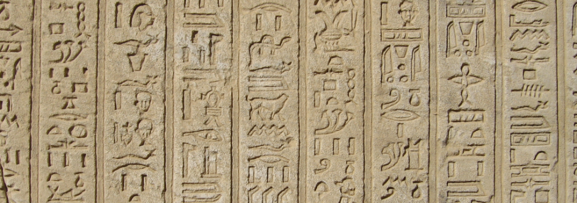

# У меня не хватает слов & Я должен дизайнить

Перевод хрестоматийной статьи по гейм-дизайну аж из 1994 года за авторством [Грега Костикяна](http://en.wikipedia.org/wiki/Greg_Costikyan). 

**Примечание:** впервые эта статья опубликована в номере #2 издания Interactive Fantasy, а также — на сайте [автора](http://www.rpg.net/oracle/authors/gregc.html).

_(Примечание #2: в сносках — комментарии, заметки переводчика)._

Существует множество различных видов игр. Их чертовски много. Игры на картриджах, компьютерные, игры на CD-ROM, сетевые, аркадные, PBM, PBEM, масс-маркет игр для взрослых, военные игры, карточные игры, настольные RPG, LARP игры, свободноформатные игры. И, черт, не забывайте про пейнтбол, виртуальную реальность, спорт, скачки. Все это игры.

Но есть ли у всех этих вещей что-то общее? Что такое игра? И как определить, что эта игра хорошая, а вот эта — плохая?

Хорошо, всем нам нетрудно давать оценки типа “неплохая игра, Джо”, произнося это после того, как перепрыгнули ловушку. Или уложили в коробку фишки. Или неохотно сдали карту с Земным Элементалем. Или поделили сокровища. Однако это то же, чем сказать “Хорошая книга”, после того как перевернешь ее последнюю страницу. Может быть, это действительно так, но это никак не поможет вам написать книгу лучше.

Нам, геймдизайнерам, нужна методология анализа игр, необходимо, чтобы мы пытались понять игры — что именно в них работает, что делает их интересными.

Нам следует говорить на языке критики. И невзирая на то, что сфера, которую мы обсуждаем, показывает громадный рост и ошеломляющее многообразие, язык критики этой сферы — по существу новая категория, которую нам необходимо изобрести.

Как бы то ни было. Что есть игра?

#### Игра не головоломка

В работе “The Art of Computer Game Design” Крис Кроуфорд разделяет понятия “игры” и “головоломки”. Головоломки статичны; они предлагают “игроку” с помощью подсказок решить задачку с логической структурой. “Игры”, в отличие от головоломок, не статичны, они изменяются, реагируя на действия игрока.

Некоторые головоломки, без сомнения, полностью статичны; никто не назовет кроссворд “игрой”. Однако, согласно Кроуфорду, некоторые “игры” — действительно просто головоломки: к примеру, “Zork” Бланка и Леблинга. Единственная задача в этой игре — решать головоломки: находить объекты и особым образом их использовать, чтобы достичь изменений, желаемых при текущем состоянии игры. Здесь нет ни сопротивления, ни ролевой игры, ни ресурсов, которые нужно грамотно расходовать; победа — это только лишь итог решения головоломки.

Для верности стоит отметить, что Zork все же не всецело статичен; персонаж переходит от одного типа окружения к другому, допустимые действия варьируются в зависимости от окружения, при действиях происходят изменения в инвентаре. При этом мы, скорее, думаем о непрерывности, невариативной последовательности, чем о наличии какой-то возможности выбора; если кроссворд — это головоломка на 100%, то Zork — 90% головоломки и 10% игры.

Фактически каждая игра в некоторой степени включает в себя решение головоломок; даже военная стратегия требует от игроков решения головоломок, например, в тот момент, когда необходимо наилучшим образом организовать атаку в конкретной точке, используя конкретных юнитов. Полностью исключена необходимость решать головоломки только в таких играх, которые всецело состоят из исследования: хорошим примером будет Just Grandma and Me, CD-ромный интерактивный сборник рассказов с игроподобными элементами принятия решений и эксплоринга. Кликание по объектам на экране приводит к запуску забавных анимаций и звуков, но здесь нечего “решать”, никакой стратегии не требуется.

Головоломка статична. Игра интерактивна.

#### Игра не игрушка

По мнению Уилла Райта, его “Sim City” — вовсе не игра, а игрушка. Для разъяснения такой позиции Райт сравнивает “Sim City” с мячиком: программа предлагает множество интересных режимов, характеристик, которые вы можете исследовать. Как и мячик, который можно набивать, закручивать, бросать, вести. И если пожелаете, вы можете использовать его для игры: футбол, баскетбол и еще куча вариантов. Но игра при этом не является встроенным в игрушку функционалом; она создается из набора определяемых игроком задач, привязываемых лично им к игрушке.

То же касается и “Sim City”. Как и многие компьютерные игры, она позволяет создать мир, который игрок может контролировать, но в отличие от настоящей игры “Sim City” не ставит перед игроком никаких задач. О, да вы сами можете придумать себе какую-нибудь задачу: что-то вроде “посмотрим, смогу ли я выстроить город без трущоб”. Но сама по себе “Sim City” не предполагает ни наличия каких-либо условий победы в игре, ни целей; это программа-игрушка.

Игрушка интерактивна. В игре есть цели.

#### Игра не повествование

Снова и снова мы слышим о повествовании. Интерактивная литература. Создание сюжета посредством ролевой игры. Мысль о том, что игры имеют отношение к повествованию, настолько завладела воображением геймдизанеров, что, вероятно, не может просто взять и оказаться вычеркнутой. Она заслуживает как минимум того, чтобы быть оспоренной.

Повествования по существу линейны. Как ни мучительно персонажам дается обдумывание принимаемых ими решений, каждый раз, когда мы перечитываем рассказ, они принимают все те же решения и конечный результат всегда один и тот же. Безусловно, это сильная сторона повествования; автор производит жесткий отбор и останавливается на конкретных персонажах, конкретных событиях, конкретных решениях и на строго определенном исходе, именно потому что только так он может создать достойное повествование. Если бы персонажи делали что-то еще, то рассказ не был бы таким интересным.

Игры же по своему существу нелинейны. Они зависят от принимаемых решений. Решения должны открывать настоящие, убедительные альтернативные варианты, иначе это пустые решения. Должны быть реальные причины для принятия игроком одного решения сейчас, и совсем другого — в следующей игре. Насколько больше вы делаете игру похожей на повествование — линейной, с меньшим количеством опций выбора — именно настолько меньше от игры в ней остается.

Представьте: вы покупаете книгу или смотрите кино, потому что в них заключены шикарные истории. Но как вы отреагируете, если во время игры ваш ведущий вдруг заявит: “Я не хочу, чтобы игроки так поступали, это разрушит сюжет”? В игре такая позиция совершенно некстати. Игры НЕ о рассказывании историй.

Считается, что игры часто и плодотворно заимствуют элементы художественной литературы. Ролевые игры опираются на характеры персонажей; компьютерные адвенчуры и LARP нередко динамичны благодаря сюжету. Принцип нарастающего нарративного напряжения — полезная штука, если в течение всей игры мы четко движемся к явно определенному завершению. Но слишком усердное стремление быть верным в первую очередь основной сюжетной линии — это ограничение свободы действий игроков, ограничение их возможности принимать значимые решения.

Гипертекстовая художественная литература — интересное явление. Гипертекст по своему существу нелинеен, и поэтому традиционное повествование совершенно неуместно в гипертекстовых работах. Писатели, создающие гипертекстовые художественные произведения, так же, как это делают авторы традиционных историй, пытаются исследовать природу человеческого бытия, однако, используют методологию, предполагающую множественность точек зрения, скачки во времени, конструирование читателем уникального опыта прочтения. Что-то из этого — и больше, чем известно гипертекстовым писателям — имеет точки соприкосновения с геймдизайном, а что-то — с традиционным повествованием; но если когда-нибудь гипертекстовая литература станет успешной с художественной точки зрения (ничего из того, что я читал, таковым не является), то это приведет к созданию новой литературной формы, которую трудно будет назвать “повестовованием”.

Повествование линейно. Игры — нет.

#### Игра требует участия

Традиционные искусства предполагают пассивную аудиторию. Когда вы изучаете картину, вы можете представлять себе что-то свое, вы можете видеть в ней какие-то вещи, которых художник в нее заложить не намеревался, однако, ваша роль в построении художественного восприятия невелика: писал картину художник. А вы только смотрите. Вы пассивны.

Когда вы идете в кино, смотрите ТВ, посещаете театр, вы сидите, смотрите и слушаете. Да, вы по-своему интерпретируете увиденное, услышанное; но вы — аудитория. Вы пассивны. Произведение создано кем-то другим.

Когда вы читаете книгу, все, что в ней происходит, происходит у вас в голове, а не на страницах. И все же. Вы воспринимаете слова, которые написал автор. Вы пассивны.

Все это чересчур, слишком самодержавно: мощнейший художник снисходит до того, чтобы поделиться своей гениальностью с простыми смертными. Как так вышло, что через двести лет после Революции у нас все еще господствуют такие самодержавные формы? Нам, без всякого сомнения, необходимы формы в духе нашего времени; формы, которые позволяют обычному человеку сотворить его собственный художественный опыт.

Вступите в игру. Игры предоставляют набор правил; но игроки, опираясь на них, приходят к изобретению своих собственных умозаключений, достижению собственных результатов. Это похоже на музыку Джона Кейджа: он писал темы, а от других музыкантов ожидалось, что они будут брать их за основу и импровизировать. Таковы и игры; геймдизайнер создает тему, игроки — музыку.

Веку демократии — демократичные искусства.

Традиционные искусства работают на пассивную аудиторию. Игры требуют активного участия.

### Так что же есть игра?

Игра — вид искусства, предполагающий наличие участников — игроков, которые в процессе достижения игровой цели принимают решения и контролируют ресурсы, принадлежащие их игровым олицетворениям.

#### Принятие решений

Я предлагаю такое определение, чтобы нейтрализовать бессмысленное, очень назойливое и надувательское слово “интерактивный”. Мы говорим, что будущее интерактивно. С таким же успехом можно сказать: “Будущее — фнурглевитз”. Это слово все объясняет ничуть не хуже.

Выключатель интерактивен. Нажимаешь один раз, загорается свет. Нажимаешь еще раз, свет гаснет. Это интеракция. Но это не особо весело.

Все игры интерактивны: состояние игры изменяется вслед за действиями игроков. Если состояние не меняется, перед вами не игра: перед вами головоломка.

Но сама по себе интеракция ничего не значит. Интеракция должна содержать замысел.

Представим, что у нас в руках оказался интерактивный продукт. В какой-то момент нас ставят перед выбором: вы можете либо совершить действие А, либо совершить действие Б.

Но из-за чего А лучше, чем Б? Или Б лучше, чем А, только в какие-то определенные моменты, а в другие — нет? Какие факторы влияют на принятие решения? Какие ресурсы должны быть грамотно распределены? Какова конечная цель?

Ага! Вот сейчас мы говорим не об “интеракции”. Сейчас мы говорим о принятии решений.

Необходимость принимать решения — вот что делает игры играми. Посмотрите на Шахматы: у этой игры мало аспектов, делающих другие игры привлекательными, — ни элементов физического моделирования, ни ролевой игры и, черт возьми, мало цветов. Необходимость принимать решения — вот что в ней есть. Правила строго определенные, задачи крайне четкие, для достижения победы требуется продумывать действия на несколько ходов вперед. Превосходство в принятии решений приносит победу.

Что игрок делает в любой игре? Какие-то его действия зависят от игровой среды. В некоторых играх он бросает кубик. В некоторых — болтает с друзьями. В каких-то играх он яростно стучит по клавишам. Но в любой из них он принимает решения.

В любой игре он рассматривает, оценивает игровое состояние. В некоторых случаях для этого нужно проанализировать информацию на экране. В других — выслушать то, что говорит ведущий. Еще вариант — изучить расположение фигур на доске. Затем игрок обдумывает и рассматривает свои задачи, свои игровые олицетворения и доступные им ресурсы. А еще он оценивает противника — те силы, с которыми он должен сражаться. И старается принять решение, которое повлечет за собой наилучшую для него цепочку действий.

И он принимает решение.

Какие ключевые факторы влияют на это? Задачи. Соперничество. Управление ресурсами. Информация. Мы поговорим о них буквально через минуту.

Какие решения игроки принимают в этой игре?

#### Цели

В “Sim City” нет целей. Это не игра?

Нет, и ее создатель сам охотно об этом заявляет. Это игрушка.

И единственный способ сохранять к ней интерес в течение длительного времени — это превратить ее в игру, установив цели, определив для себя задачи. Выстроить максимально громадный мегалополис; сделать так, чтобы вас любило предельно много ваших людей; построить город, который полагается исключительно на общественный транспорт. Какие бы цели вы ни выбрали — вы превратили “Sim Sity” в игру.

Но даже если и так, сама по себе программа не поддерживает ваши цели. Она была разработана без учета задач, которые вам вдруг придут в голову. Поэтому страшно разочаровывающими могут оказаться попытки достичь целей, когда используешь вроде как соответствующие им сегменты программы, но при этом в них не был заложен весь необходимый функционал.

Поскольку в ней нет целей, “Sim City” быстро приедается. Для сравнения — в “Civilization” Сида Мейера и Брюса Шелли, продукте очевидно производном, вторичном, есть четко поставленные цели — отчего игра гораздо более увлекательная и захватывающая.

“Но что насчет ролевых игр?” — можете сказать вы. “В них нет условий победы”.

Условий победы нет, верно. Но, конечно же, в них есть задачи; множество задач, и вы можете выбирать. Нарубить старых добрых очков опыта. Или выполнить квест, который дружественный ГМ на вас только что возложил. Или перестроить Империум и предотвратить окончательную гибель цивилизации. Или стремиться к духовному совершенству. Да что угодно.

Если по какой-то причине у персонажей ваших игроков нет задач, то они сами найдут таковые очень быстро. Или же им не останется ничего лучше, чем столпиться у таверны и брюзжать на тему того, как скучна игра. И так до тех пор, пока вы в отчаянии не приведете откуда-то пачку орков, которые попытаются снести им черепушки.

Хей, теперь у них есть цель. Спасение себя самого, выживание — хорошая цель. Одна из лучших.

Если у вас нет цели, ваши решения бессмысленны. Выбор действия А будет ровно тем же, что и выбор действия Б; выбери карту, любую карту. Кому какое дело? Какой вообще в этом смысл?

Вам необходимо нечто, к чему надо стремиться, чтобы появился смысл, чтобы игра была полна значимости. Вам нужны цели.

Каковы цели игроков? Способна ли игра поддерживать множество разнообразных целей? Какие в игре существуют условия, позволяющие игрокам стремиться к достижению различных целей?

#### Соперничество

О, поговорим о политкорректности. Эти скверные, неприглядные игры. В них столько соперничества! Почему же у нас не может быть кооперативных игр?

В целом “кооперативные игры” представляются вариациями на тему “а давайте покидаем друг другу мячик”. О, черт возьми, как это захватывает, да держу пари, что я по такому случаю брошу ради них играть в Mortal Kombat.

Но в самом ли деле мы говорим о соперничестве?

Да и нет; многие игроки приходят в экстаз, когда одерживают над другими победу, используя только лишь свой мозг, разум — и это, как минимум, уже лучше, чем побеждать с помощью кулаков. Шахматисты в этом смысле особенно несносны. Но настоящий интерес при этом заключает в себе борьба на пути к достижению цели.

Самое важное слово в этом предложении: борьба.

Есть одна игра. Она называется “Plucky Little England”, в ней воспроизводится ситуация, в которой оказалось Объединенное Королевство после того, как во время Второй мировой войны была оккупирована Франция. Ваши задачи: оберегать свободу и демократию и нанести поражение силам тьмы и угнетателям. У вас есть выбор: А. Сдаться. Б. Плюнуть Гитлеру в лицо! Британия правит! Англия никогда никогда никогда не будет рабыней!

Вы выбираете Б? Поздравляем! Вы выиграли!

Итак, разве вы не удовлетворены? Ах, трепет, радость победы…

Никакой радости победы, конечно, здесь нет; все было слишком легко, не так ли? Никакой борьбы не было.

В игре на двоих, где сражаешься один на один, сопротивление обеспечивает ваш оппонент, именно с ним вы боретесь; игра — прямое соперничество. И это первоклассный способ обеспечения сопротивления, борьбы. Никакой другой оппонент не является таким коварным и с трудом побеждаемым, как полный решимости человек. Однако прямое соперничество не единственный способ обеспечить сопротивление.

Вспомните беллетристику. Всякая эмм-история, Обычная Повествовательная Модель, работает примерно так: у персонажа А есть задача. Он натыкается на препятствия Б, В, Г и Д. Преодолевая каждое из них по очереди, персонаж растет как личность. В конце концов он расправляется и с последним, величайшим препятствием.

Каждое ли из этих препятствий должно быть воплощено в виде Злодея, Плохого Парня, Оппонента, Недоброжелателя? Вовсе нет, невзирая на то, что злодей представляется первоклассным препятствием. Силы природы, придирчивая теща, полетевший жесткий диск, собственное чувство неполноценности героя — каждый из этих пунктов так же хорошо подходит на роль препятствия.

То же и в играх.

Во множестве RPG “сопротивление” состоит из неигровых персонажей, а от вас ожидается кооперация с игроками вашей группы. Во многих компьютерных играх “сопротивление” состоит из головоломок, которые вы должны решить. В LARP играх “сопротивление” зачастую выражается в высокой степени сложности нахождения игрока, у которого нужная вам подсказка, приспособление или специальная сила. В большинстве игр-пасьянсов “сопротивление” — это их по-настоящему рандомный элемент или же набор полурандомных алгоритмов, которым вы и противостоите.

Какие бы задачи перед вашими игроками вы ни ставили, вы должны заставить игроков работать, для того чтобы добиться выполнения этих задач. Сталкивать их друг с другом — один из способов решения данной проблемы, но этот способ не единственный. И даже если у игрока есть оппонент, добавление других препятствий в игру может сделать ее гораздо богаче и эмоционально привлекательнее.

Хотеть “кооперативных игр” означает хотеть окончания соревнования, борьбы. Но в игре такого быть не может. Жизнь — борьба за выживание и развитие. Окончания борьбы быть не может, только не на этом свете. Игра без борьбы — это игра, которая умерла.

Что обеспечивает сопротивление? Что привносит в игру борьбу?

#### Управление ресурсами

Тривиальные решения ни капли не интересны. Вспомните “Plucky Little England”.

Там ведь не было никаких настоящих решений, не так ли?

Или представьте “Talisman” Роберта Харриса. Для выполнения хода вы бросаете кубик. Вам выпадает, на какое число клеток можно походить. Вы можете двигаться влево, вправо, вокруг дорожки.

Конечно, это немного лучше, чем традиционные настольные игры с дорожкой; у меня есть выбор, куда идти. Однако в 99 случаях из 100 либо нет никакой разницы между двумя клеточками, либо одна из них очевидно лучше, чем другая. Выбор фальшивый.

Чтобы придать выбору действительную значимость, игрокам нужно дать ресурсы, которыми они должны управлять. “Ресурсами” может быть что угодно: бронетанковые дивизии; пункты снабжения; карточки; очки опыта; знание заклинаний; поместья в собственности; любовь хорошей женщины; покровительство со стороны босса; добрые намерения НПЦ. Деньги. Еда. Секс. Слава. Информация.

Если в игре есть больше одного типа “ресурсов”, решения резко становятся более трудными. Если я так поступлю, то получу деньги и опыт, но будет ли после этого Лиза по-прежнему меня любить? Если я украду еду, то смогу наесться, однако, я рискую оказаться пойманным, мне могут отрубить руку. Если я выступлю против Валуа, Эдвард Плантагенет пожалует мне Герцогство Гасконь, но Папа может отлучить меня от церкви, подвергая опасности мою бессмертную душу.

И это не просто трудные решения, это интересные решения. Интересные решения — составляющая интересных игр.

Ресурсы, о которых тут идет речь, должны иметь определенную игровую значимость; если у вашей “бессмертной души” нет никакой ценности, то бессмысленным является и отлучение от церкви. (Если только оно не приводит к снижению уровня лояльности ваших крестьян или не усложняет набор рекрутов в армию, или… вот это имеет игровую значимость, не так ли?) В конечном счете “управление ресурсами” означает управление игровыми элементами в процессе выполнения ваших задач. “Ресурсы”, не обладающие игровой значимостью, никоим образом не могут поспособствовать ни успеху, ни поражению — они совершенно пустые.

Какими ресурсами управляет игрок? Достаточно ли они многообразны и разнородны для того, чтобы игрок перебирал значимые варианты при принятии решений? Становятся ли решения интересными благодаря этим ресурсам?

#### Игровые олицетворения

В игре вы производите действия посредством ваших игровых олицетворений. Игровое олицетворение — это любая сущность, которой вы можете напрямую манипулировать.

В настольной игре — это ваши фишки. В карточной игре — карты. В ролевой игре — ваш персонаж. В спортивной игре — вы сам.

В чем разница между “ресурсами” и “олицетворениями”? Ресурсы — предметы, которые вы должны рационально расходовать, чтобы выполнить поставленные перед вами задачи; олицетворения — это ваши средства управления ресурсами. В военной настолке боевая мощь — это ресурс; ваши фишки — олицетворения. В ролевой игре деньги — ресурс; вы используете их посредством вашего персонажа.

Почему это важно? Потому что если у вас нет игровых олицетворений, то вы придете к такой системе, которая функционирует практически без вкладываемых игроком усилий. “Sim Earth” Уилла Райта и Фреда Хэслэма — хороший пример. В “Sim Earth” вы настраиваете несколько параметров, а затем можете расслабиться и наблюдать, как игра сама в себя играет. В этой игре вы мало что можете сделать, у вас нет ни олицетворений, которыми нужно манипулировать, ни ресурсов, которыми нужно управлять. Только лишь малое число параметров, с которыми вы и можете поиграть. Это чуточку интересненько, но никак не очень интересно.

Чтобы подарить игроку ощущение, что он действительно играет в игру, что его судьба в его руках, вам нужны игровые олицетворения. И чем меньше олицетворений, тем более обстоятельными они должны быть; и совсем не случайно, что ролевые игры, предоставляющие игроку только одно олицетворение, дают к тому же и чрезвычайно детально описанные правила, что и как с этим олицетворением можно делать.

Каковы же олицетворения игроков? Какие у этих олицетворений способности? Какие они используют ресурсы? Что делает их интересными?

#### Информация

Далеко не раз я беседовал с геймдизайнерами компьютерных игр, рассказывавшими мне о невероятных, захватывающих штуках, которые могут происходить в их играх, — а я сидел и отвечал им: “Серьезно? Вот как, оказывается. А до меня не дошло, что так можно”.

Предположим, у вас есть военная компьютерная игра, в которой погода влияет на передвижение и защиту. Что в этом хорошего, если вы не сообщаете игроку о том, что погода обладает таким эффектом? Ведь она никак не повлияет на поведение игрока; она не повлияет на принимаемые им решения.

Или, возможно, вы и сообщили игроку, что погода обладает эффектом, однако, ему не объясняется, что происходит в данный момент времени — идет дождь или это снег или еще что-то? И снова — что в этом хорошего?

Или, может быть, и это игроку объясняется, он знает, какая погода, но понятия не имеет, какое воздействие эта погода оказывает, — то ли она вдвое укорачивает максимальную дистанцию передвижения; то ли она замедляет скорость передвижения по полям, где нужно ползти, но никак не влияет на юнитов, идущих по дорогам. Это уже лучше, но еще не хорошо в целом.

Интерфейс должен предоставлять игроку релевантную информацию. И игрок в итоге должен обладать достаточным для принятия значимых решений количеством информации.

Но это не означает, что игрок должен знать все; сокрытие информации может оказаться и очень полезным. Вполне допустимо сообщить: “Вы не узнаете, насколько сильны ваши юниты, пока они не вступили в бой”, — но в таком случае у игрока должно быть какое-то представление об общем спектре способностей. Допустимо сказать: “Вы не знаете, какую конкретно карту вы вытащите, когда хотите дособрать стрит”, — но только если игрок хотя бы примерно может оценить вероятности. Если ситуация такова, что я могу вытащить и Даму Червей, и Смерть, и Броненосца Потемкина, то мне совершенно не на что опираться при принятии решения.

Более того, интерфейс не должен предоставлять слишком много информации, особенно в сильно зависящих от времени играх. Если на мое решение должны повлиять погода, запас продовольствия, расположение духа военачальников, степень усталости войска, речь Токийской Розы прошлой ночью, и это решение нужно принять в течение пяти секунд, при этом на поиск всей необходимой информации, прыжки по менюшкам и просматр экранов, мне потребуется пять минут, то вся эта информация — бесполезна. Доступ к информации у меня есть, но рационально ее использовать и действовать я все еще не могу.

Или давайте обсудим компьютерные игры-приключения; они нередко демонстрируют неудачные примеры информирования. “О, чтобы пройти через Врата Танатоса, вам нужно вскрыть замок булавкой. Булавку вы найдете на полу в Библиотеке. Булавочка эта примерно три на два пикселя, если у вас хорошее зрение, вы заметите ее где-то между двенадцатой и тринадцатой половицей, ориентировочно в трех дюймах от верха экрана. Что, вы не заметили булавку?”

Да, я ее не заметил. В приключениях нахождение необходимого предмета не должно быть абсурдно сложным, как и победа в таких играх не должна вдруг оказываться недостижимой, потому что три часа и 38 поворотных сюжетных точек назад вы приняли какое-то неверное решение. Так и способы решения головоломок не должны быть основаны на случайности, не должны быть абсурдными.

Или рассмотрим свободноформатные игры. В свободноформатных играх перед игроком зачастую поставлена задача, выполнение которой требует от него выяснения нескольких вещей — назовем их Фактами А, Б и В. И неплохо бы, чтобы геймдизайнер свободноформатной игры на все сто, черт возьми, процента был уверен в том, что А, Б и В действительно реально выяснить — о них известно другим игрокам, о них написано на карточке, которая циркулирует внутри игры — да каким угодно образом, но эти Факты должны тут быть. В ином случае у игрока нет ни единого шанса выполнить поставленную задачу, а это совсем не весело.

От игроков требуется принимать решения, какая информация им для этого понадобится? Предоставляет ли игра информацию в такое время и таким образом, когда это нужно и удобно для игрока? Будут ли благоразумные игроки способны понять, какая информация им нужна и как ее отыскать?

### Что еще добавит игре сильных сторон

#### Дипломатия

Выполнение задач не имеет значения, если не требует приложения усилий, если нет сопротивления; но это не означает, что все решения должны быть с нулевым исходом. Когда в игру вовлечено несколько игроков, она становится интереснее, если допускается и поощряется дипломатия.

В игре существует дипломатия, если игроки могут поддерживать друг друга — возможно, напрямую, возможно, объединяясь против общего врага. Не все мультиплеерные игры такое позволяют; в “Monopoly” Чарльза Б. Дэрроу, к примеру, нет эффективного способа ни помогать другим игрокам, ни препятствовать им. Бессмысленно говорить “давайте все нападем на Джо” или “эй, ты, новичок, я помогу тебе, но потом когда-нибудь и ты прикроешь меня”, потому что нет возможности все это осуществить.

Есть игры, в которых дипломатия допускается, но в не особо крупных размерах. В “Axis & Allies” Лоуренса Харриса игроки могут помогать друг другу в ограниченных масштабах, однако, каждый из них обязательно либо на стороне Axis, либо Allied, так что дипломатия в этой игре никогда не станет ключевым элементом.

Один из способов поощрения дипломатии — внедрение неисключительных задач. Если вы ищете Ковчег завета, а я хочу перебить нацистов, и Ковчег завета при этом в руках нацистов, думаю, мы с вами можем сработаться. Может быть, наш союз развалится, как только Движение Сопротивления захватит Ковчег, и мы в итоге окажемся в противоборствующих лагерях, но фактически подобные перипетии — и есть то, что делает игры интересными.

Но игры также могут поощрять дипломатию даже тогда, когда игроки выступают прямыми оппонентами друг другу. В полном смысле слова игрой о дипломатии является, конечно же, “Diplomacy” Колхаммера, в ней чаще всего победу одерживает именно лучший дипломат, а не лучший стратег. Ключевой момент в данной игре — система Поддержки, которая позволяет игроку отправить свою армию на помощь армии другого игрока, поощряя таким образом игровые объединения.

Такие объединения, безусловно, не живут вечно; Россия и Австрия могут образовать союз, чтобы разгромить Турцию, но все равно в итоге победит только одна страна. Она в конце концов обязательно нанесет предательский удар.

Прекрасно. Необходимо искать союзников, удерживать их, подстрекать врагов переметнуться — и все для того, чтобы быть уверенным, что вы всегда будете продолжать переговоры. Если союз застыл и в отношениях союзников нет динамики — дипломатии приходит конец.

Почти все компьютерные игры по своему существу предназначены для соло игры, и то, в какой мере в них допускаются дипломатические взаимоотношения с НПЦ ботами, в большинстве случаев не делает их интересными. Сетевые же игры являются (или должны являться) по природе своей содержащими функционал дипломатии; и чем более широко распространенными становятся сетевые игры, тем от большего числа разработчиков, входящих в сообщество компьютерных геймдизайнеров, мы ожидаем, что они совершенно упустят этот важный момент. Как пример, когда проектировщики интерактивных ТВ сетей говорят об играх, фактически они говорят исключительно о возможности загрузки картриджных игр (Нинтендо, Сега) посредством кабеля. Такая позиция обусловлена интересами бизнеса: люди ежегодно тратят на картриджные игры миллиарды, и многим от этих сумм хочется урвать свою долю. Но они, похоже, не осознают, что сеть позволяет реализовать совершенно другие игровые возможности, которые и сами смогут приносить миллиарды — вот это как раз и есть реальный шанс для бизнеса.

Каким образом игроки могут помогать либо препятствовать друг другу? Какие у них при этом должны быть стимулы? Какими ресурсами они могут обмениваться?

#### Колорит

“Monopoly” — это игра о расширении недвижимости. Верно?

Хорошо, нет, очевидно, что нет. Специалист в сфере недвижимости посмеялся бы над такой точкой зрения. Игра о расширении и развитии недвижимости должна обладать правилами, описывающими, что такое строительный кредит и предпринимательский фонд недвижимости, правилами функционирования профсоюзов и подкупа муниципальных инспекторов. “Monopoly” к сфере недвижимости никакого отношения не имеет. Можно оставить имеющиеся правила, но при этом заменить доску, фишки и карточки и превратить это дело, скажем, в игру об исследовании космоса. Однако наша новая игра будет иметь точно такое же отношение к исследованию космоса, какое отношение к недвижимости имеет “Monopoly”.

“Monopoly” вообще не игра о чем-то. И все же ей присущ колорит игры о недвижимости: объекты недвижимости с названиями, маленькие пластмассовые домики и отели, игровые деньги. И во всем этом заключена большая часть ее очарования.

Колорит имеет большое значение: если оценивать “Axis & Allies” Лоуренса Харриса как симулятор Второй мировой войны, то вышла не более чем трогательная попытка. Ах, но ее колорит! Миллионы маленьких пластмассовых самолетов, кораблей и танков! Гремящий кубик! Война во всем мире! Игра работает и заинтересовывает, по большому счету, исключительно благодаря своему колориту.

Или же посмотрим на “Space: 1889” Чадвика. Ее правила не имеют никакого отношения ни к чему из описанного в сеттинге: ни к пробуждению Барроузовых чудес, ни к волнению от захватывающих действий, ни к Киплинговскому викторианскому очарованию. Несмотря на понятную систему и детальный мир, игра необычайно бесцветна и страдает от этого.

Зрелищность, детали и ощущение места способны внести значительный вклад в эмоциональную привлекательность игры.

Это почти не имеет отношения к самой по себе игре как таковой; оригинальная версия игры “Axis & Allies” от Nova по существу идентична той, которую издали в Milton Bradley. За тем исключением, что она поставляется с ужасной, безвкусной бумажной картой, с самыми уродливыми фигурками, которые я когда-либо видел, и в поистине дилетантской коробке. Я однажды посмотрел на нее, убрал и больше никогда не доставал.

В то время как в изданную в Milton Bradley версию со всеми ее маленькими пластмассовыми фигурками я все еще играю и буду играть снова и снова… Та же самая игра. Но гораздо более колоритная.

Как игра может передать дух, атмосферу и великолепие ее сеттинга? Что вы можете сделать, чтобы игра стала более колоритной?

#### Моделирование

Во многих играх ничего не моделируется. В восточной народной игре “Го”, например; маленькие камушки на сетке. Она безупречно абстрактна. Или “Life” Джона Хортона Конвея; невзирая на ее вызывающее определенные чувства название, эта игра представляет из себя не более чем исследование математического пространства.

Что ж, в этом нет ничего плохого. Но…

Но колорит добавляет игре очарования. А моделирование — это тропинка, путь к колоритности.

Предположим, у меня есть основания полагать, что игра о Ватерлоо будет крайне успешна с коммерческой точки зрения. И если бы я захотел, я бы мог взять “Monopoly”, заменить “Парк-Плейс” на “Катр-Бра”, а отели — на пластмассовых солдатиков, и назвать получившееся “Waterloo”. Это бы сработало.

Но не лучше ли смоделировать сражение? Чтобы были маленькие батальоны, маневрирующие по полю битвы? Чтобы был слышен грохот орудий?

Или возьмите “Star Wars: The Roleplaying Game”, которую сделал я. Я мог бы взять “Dungeons & Dragons” Гигакса и Арнесона и видоизменить ее, назвав мечи бластерами и так далее в таком же ключе. Но вместо этого я решил смоделировать происходившее в кино, чтобы поощрить игроков проделывать чудные кинематографические трюки, чтобы использовать саму игровую систему для воспроизведения вещей, связанных с атмосферой и духом фильма.

Ценность моделирования заключается и кое в чем еще. К примеру, оно совершенствует процесс идентификации персонажа. “Waterloo”, основанная на механике “Monopoly”, никоим образом не будет связана с тем, чтобы заставить игрока думать, как Веллингтон или Наполеон; “Napoleon’s Last Battles” Кевина Зукера в этом смысле гораздо лучше — игра вынуждает игроков размышлять о стратегических задачах, с которыми сталкивались исторические личности.

Игра может погрузить игрока в ситуацию в такой мере, в какой обычное повествование не способно. Она позволяет игроку изучить различные возможные исходы — в режиме программы-игрушки — и таким образом прийти к инстинктивному пониманию объекта моделирования. Поиграв как минимум в дюжину разных игр о Ватерлоо, я осознал эту битву и почему все произошло именно так, как произошло, я осознал сущность Наполеоновских приемов ведения войны — и такое осознание намного лучше чем то, которое могло бы прийти после прочтения дюжины книг на данную тему.

Моделирование чего-либо — это, как правило, нечто гораздо более сложное, чем простая эксплуатация какой-то темы ради колоритности. И по этой причине моделирование подходит не для всех игр. Однако если этот метод все же используется, то он может оказаться крайне мощным.

Каким образом элементы моделирования могут добавить игре сильные стороны?

#### Многообразие энкаунтеров

“Тебе просто повезло”.

Слова, брошенные с презрением; мол, ты победил только лишь по воле случая. Игра, допускающая такое, очевидно, более низкосортна по сравнению с той, в которой побеждают действительно скилованные, умные и сильные. Ведь так?

Необязательно.

“Случайные элементы” в игре никогда не случайны абсолютно. Их случайность ограничивается определенными рамками возможностей. Когда в военной настолке я произвожу атаку, я могу посмотреть в Таблицу Результатов Сражений. Мне известны возможные итоги атаки, мне известно, каковы мои шансы на достижение запланированного. Я иду на обдуманный риск. И в течение всей игры я бросаю кубик дюжины, сотни раз; это вроде как говорит о высокой степени зависимости от случайности, но на деле “случайный элемент” близок к ничтожному. За исключением редких случаев все мои победы и поражения обсуловлены тем, насколько хороший из меня стратег, а не тем, насколько удачно я бросаю кубик.

Случайность может оказаться полезной. Это один из способов получить многообразие энкаунтеров.

И что же это значит?

Это значит, что одна и та же старая штука, повторяющаяся из раза в раз, — это охренительно скучно. Это значит, что игрокам нравится сталкиваться с неожиданным. Это значит, что игра должна позволять случаться очень разным вещам, чтобы у игроков всегда был шанс столкнуться с чем-то немного отличающимся от того, что уже было.

В играх вроде Шахмат что-то “немного отличающееся” — это непрерывно изменяющиеся расположения и позиции фигур. В играх вроде “Magic: The Gathering” Ричарда Гарфилда — шикарное многообразие карточек и случайный порядок их вытаскивания, а также интересные возможности их комбинирования. В “Dungeons & Dragons” Арнесона и Гигакса — ошеломляющее многообразие монстров, заклинаний и т. д. и т. п., сопряженное с изобретательностью гейммастера погружать игроков в новые ситуации.

Если в игре недостаточно разнообразия, то она быстро приедается. Вот почему никто не проходит графические приключения больше одного раза; в них достаточно разнообразия для единичного прохождения, но в следующий раз, когда вы будете играть, вы снова столкнетесь именно с тем, с чем уже сталкивались. Вот почему пасьянс, карточная игра для одного человека, очень быстро начинает наводить скуку; вы делаете одно и то же, снова и снова, и перетасовки карт недостаточно для того, чтобы через время вновь разжечь в вас интерес к этой игре.

С какими вещами игроки сталкиваются в игре? В ней достаточно такого, что игроки могли бы исследовать и изучить? Из чего складывается многообразие? Каким образом мы можем увеличить многообразие энкаунтеров?

#### Определение позиции

“Отождествление с персонажем” — это обычный для художественной литературы прием. Писатели хотят, чтобы главный герой нравился читателям, чтобы им было не все равно, что случится с героем. Отождествление с персонажем наделяет историю эмоциональной силой.

То же подходит и для игр. В той мере, в какой вы поощряете игроков заботиться о своем положении, о своей роли в игре, об определении ими собственной позиции, вы повышаете уровень эмоционального импульса игры.

Вариант предельно выраженный — спорт; в спорте ваша “позиция” — это вы. Когда вы находитесь на бейсбольном поле, для вас крайне важно, победите вы или проиграете, вы очень глубоко переживаете и волнуетесь, когда выбиваете в аут или когда вышибаете мяч за пределы площадки. Для вас это важно.

Настолько важно, что потасовки и грубые реплики стали обычным делом для любого вида спорта. Настолько важно, что мы даже изобрели целую культурную традицию “поведения, достойного настоящего спортсмена”, пытаясь предупредить у победителей любые не очень приятные ощущения, возникающие в процессе продвижения вперед.

Ролевые игры в этом смысле лишь чуть более отвлеченные; ваш персонаж — это не вы, однако, вы вкладываете в него массу сил и времени. Это лично ваше игровое олицетворение, суммарный итог вашего позиционирования в игре. Так что грубые реплики и рукоприкладство также практикуются среди ролевщиков, хотя и встречаются гораздо реже, чем в спортивных играх.

Заставить игрока по-настоящему определять и ценить собственную игровую позицию проще, когда у него есть только одно игровое олицетворение; и сложнее — если у игрока их несколько. Немногие в самом деле и по-серьезному расстраиваются, когда теряют коня в Шахматах или пехотную дивизию в военной игре. Но даже и в этих случаях эмоциональная составляющая игры может быть усилена, если удастся заставить игрока чувствовать связь с его игровыми олицетворениями как со “своими”.

Один из способов добиться этого — сделать так, чтобы у игрока была внятная, отчетливая точка зрения. Неразбериха в плане точки зрения — распространенный просчет среди дизайнеров настолок. К примеру, “Campaigns for North Africa” Ричарда Берга позиционируется как необыкновенно реалистичное моделирование Североафриканской кампании оси Берлин-Рим. И в это же время вы как игрок проводите кучу времени, беспокоясь о дислокации отдельно взятых пилотов и о том, сколько воды в наличии у отдельно взятых батальонов. Подчиненные Роммеля наверняка занимались такими вещами, но, несомненно, не сам Роммель. Так кто вы в этой игре в таком случае? Тщательность моделирования не предусмотрена, из-за степени детализации оно оказывается в каком-то смысле расшатанным.

Что вы можете предпринять для того, чтобы игроку было дело до его игровой позиции? Присутствует ли среди всех игровых олицетворений одно наиболее важное для игрока, и что может быть сделано для усиления эффекта отождествления с этим олицетворением? Если нет самого важного олицетворения, то насколько привлекательна позиция игрока в целом и что можно сделать для усиления этой привлекательности? Кем в игре “становится” игрок? Какая у него точка зрения?

#### Ролевая составляющая

“HeroQuest” определяют как “настольную ролевую игру”. В ней, как и в любой ролевой игре, каждый игрок управляет только одним персонажем, который в “HeroQuest” представлен в виде пластмассовой фигурки на доске. Если вы берете только одного персонажа, разве вы не “играете роль”? И разве нельзя в таком случае обоснованно охарактеризовать эту игру как “ролевую”?

На оба вопроса ответ — “нет”.

Данный вопрос отражает путаницу в понятиях “определение позиции” и “ролевая составляющая”. Я могу основательно отождествлять себя с моим игровым олицетворением, но не ощущать при этом, что я играю какую-то роль.

Ролевая составляющая возникает тогда, когда вы в некотором смысле надеваете маску, соответствующую вашей позиции. Разные игроки в разных играх могут делать это разными способами: можно, например, стараться разговаривать в той же манере и в том же ритме, которые свойственны вашему персонажу. Можно разговаривать так, будто вы пропускаете через себя эмоции, с которыми говорит ваш персонаж. Можно разговаривать так, как вы обычно и разговариваете, но при этом тщательно размышлять на тему “как в этой ситуации поступил бы мой персонаж”, а не о том “что бы мне хотелось делать дальше”.

Ролевая составляющая чаще всего присутствует, как того и следовало ожидать, в ролевых играх. Но с тем же успехом она может присутствовать и в других игровых сферах; например, я точно не могу поиграть в “Junta” Винсента Цао без того, чтобы в некоторые моменты не поболтать с фальшивым испанским акцентом. Я получаю от этой игры достаточно, чтобы мыслить, как важная шишка в коррумпированной банановой республике, поэтому я и начинаю играть эту роль.

Ролевая составляющая — это сильнейший элемент сразу по многим причинам. Она здорово помогает в определении позиции; если вы думаете, как ваш персонаж, вы основательно себя с ним отождествляете. Она обогащает колорит игры, потому что игроки становятся отчасти ответственными за поддержание игрового недоверия, провоцирующего волнение и напряжение, за поддержание ощущения, что этот игровой мир — живой, насыщенный и целостный. А еще это превосходный инструмент социализации.

Более того, связь с социализацией в данном случае — ключевая: ролевая игра — это вид представления, спектакля. Играя в такие игры, люди принимают участие в представлении, чтобы развлекать своих друзей и доставлять им удовольствие. Если все это не для друзей, то во всем этом нет никакого смысла.

Именно поэтому так называемые “компьютерные ролевые игры” никакие не ролевые. Они связаны с ролевыми играми в той же мере, в какой с ними связана “HeroQuest”. Да, действительно у них есть атрибуты ролевых игр: персонажи, снаряжение, истории. Но в них нет механики, с помощью которой игроки по-настоящему могли бы во все это играть, могли бы своими действиями раскрывать характер своего персонажа — на самом деле исполнять содержательную, осмысленную роль.

Все это так, потому что именно такова технология. Компьютерные игры рассчитаны на одного человека; у одиночных геймеров по определению нет аудитории. Вследствие чего в компьютерные игры и не может быть включена ролевая составляющая.

Однако используйте сеть — и у вас получатся ролевые игры. Поэтому-то MUD и пользуются такой популярностью.

Как игроки стимулировать игроков для присоединения к ролевой игре? Какие роли поддерживаются игровой системой или поощряются ей?

#### Социализация

Исторически игры большей частью нужны были именно для социализации. Для режущихся в Покер, Бридж или Шарады важность самой игры вторична по сравнению с общением, которое происходит во время игры.

Один из парадоксов нашего времени в том, что большинство коммерчески успешных игр по своему существу предназначены для одного игрока: картриджные игры, компьютерные игры на дискетах, CD-ромные игры. Когда-то давно в нашем представлении геймерами были люди, расположившиеся за столом с игральными картами в руках; теперь же геймер — это подросток, который в одиночестве сидит перед мерцающим экраном и судорожно сжимает джойстик.

Хотя в то же время сегодня мы наблюдаем и развитие ролевых игр, как настольных, так и “живых”, а это состоит в тесной связи с социализацией. И можно заметить, что наиболее успешные представители массового рынка настолок — игры вроде “Trivial Pursuit” и “Pictionary” — практически исключительно предназначены для игры в компании.

И я вынужден верить, что соло природа большинства компьютерных игр — лишь временное отклонение, издержка технологий, что с развитием сетей и их пропускных способностей историческая норма сама себя восстановит.

При разработке любой игры для получения хорошего результата настоятельно рекомендуется продумывать социальный аспект взаимодействия с игрой, а также то, каким образом закладываемая игровая система поощряет социализацию либо препятствует ей. К примеру, в сети есть онлайн версии многих классических игр вроде Покера и Бриджа. И практически ни одна из них не смогла привлечь большого количества пользователей.

Исключение — “America Online”, в этой системе предусмотрен игровой риал-тайм чат. Их версия сетевого Бриджа позволяет игрокам “болтать за столом”. И она очень популярна.

Или другой пример — во множестве настольных ролевых игр слишком много усилий, внимания уделено “реализму” игры и крайне мало тому, как же игроки в нее будут играть. Для чего разрабатывать умопомрачительно реалистичную боевую систему, если отыгрыш одного сражения длится пятнадцать минут, а всей войны — четыре часа? Так, время игроков оказывается посвященным не социализации, дружеским беседам и выжиманию максимума удовольствия из этих вещей; все время уходит на бросание кубика и изучение карт, таблиц, графиков. Какой в этом смысл?

Каким образом игра может лучше поощрять социализацию?

#### Нарративное напряжение

Пэт Мёрфи, обладательница премии “Небьюла”, считает, что ключевой элемент структуры художественного произведения — “нарастающее напряжение”. Это означает, что пока длится история, она должна становиться все более увлекательной — и так до тех пор, пока не достигнет предельной, наивысшей точки, развязки.

Представьте, что вы фанат Янки. Разумеется, вам хочется видеть, как Янки побеждают. Но когда вы идете на стадион, подумайте, разве вам хочется увидеть, как ваша команда набирает 7 очков в первом иннинге и торжествует, выиграв 21 — 2? Да, вы хотите, чтобы они победили, но если они победят таким образом, то это не сыграет на руку интересности игры. Что действительно заставит вас в волнении и радостном изумлении вскочить с места — так это то, как на последних секундах команда вырывается вперед после смачного хоум-рана и попадения в дом. Напряжение в играх делает их классными и захватывающими.

В иделе игра должна быть напряженной в течение всего игрового времени, а особенно — в конце. Наиболее жесткие проблемы, величайшие препятствия следует оставить на конец. Но нельзя быть уверенным в том, что именно так должно быть всегда, особенно в играх с прямым соперничеством: шахматная партия между гроссмейстером и новичком вряд ли будет очень напряженной. И все же, особенно в компьютерных соло играх, вы должны найти возможность убедиться в том, что игра на каждой стадии включает в себя набор испытаний и что свою работу игрок по-настоящему завершит только в самом конце.

Фактически одной из самых распространенных проблем в играх является спад напряжения. Этап максимального напряжения не предшествует развязке, а почему-то воткнут куда-то в середину игры. После чего либо игровое сопротивление куда-то пропадает, либо на действия игрока уже ничего не влияет. В большинстве случаев так происходит потому, что дизайнер никогда не задумывался о необходимости нарративного напряжения.

Что можно сделать, чтобы привнести в игру напряжение?

С кубиком все они похожи. Или с подсветкой. Или что там у вас есть.

Теперь мы готовы ответить на вопрос, который я задал в начале данной статьи.

Есть ли у массы видов игр что-то общее? Без сомнения. Все они содержат принятие решений, управление ресурсами во время выполнения задач; так и есть, о чем бы мы ни говорили — Шахматы, “Seventh Guest”, “Mario Brothers” или “Vampire”, Рулетка или “Magic: The Gathering”. Это универсальные вещи, которые определяют игру.

На основании чего вы можете сказать, что одна игра хороша, а другая — плоха? Проверка происходит во время того, как мы играем; и теперь у нас в распоряжении есть несколько категорий, которые мы можем использовать для анализа привлекательности, очарования игры. В Шахматах нужно принимать сложные, комплексные решения; в “Magic” есть огромное многообразие энкаунтеров; в Рулетке — чрезвычайно важная задача (заработать деньги — настоящие). Провести более детальный анализ, конечно же, возможно, и читатели в качестве упражнения могут им заняться.

Можно ли считать представленную мной аналитическую теорию герметичной и завершенной? Со всей уверенностью — нет; существуют игры, которые игнорируют многие — если не все — ее умозаключения (например, “Candyland”, в которой вообще не нужно принимать решения). Также, без сомнения, есть такие аспекты, свойственные играм и их привлекательности, которые теория упустила из виду.

Данная работа должна быть рассмотрена как незавершенная: это первая попытка утвердить категорию профессионального анализа искусства геймдизайна. В других, в следующих в этой сфере работах приветствуется — и даже с нетерпением от них ожидается — развитие описанной мной структуры; или же представление на обсуждение альтернативных теорий, созданных в противовес моей.

Если мы создаем вещи, которые хотим причислять к “искусству”, мы обязаны начать думать над тем, что нам следует делать, чтобы это действительно было так, обязаны ставить перед собой задачи выше и важнее, чем просто коммерческие. Ведь мы творим процесс революционных преобразований: демократическая трансформация искусств. Наше творение может оказаться великолепным, важнейшим для нашей цивилизации; но если мы все сделаем плохо, неверно, то создадим просто-напросто очередную посредственность эпохи ТВ, очередной вид, полностью лишенный интеллектуальных достоинств.

_Автор хотел бы признать вклад Криса Кроуфорда, Уилла Райта, Эрика Голдберга, Кена Ролстона, Дага Кауфмана, Джима Даннигана, Тэппана Кинга, Сэнди Питерсон и Уолта Фрейтэга, чьи идеи были похищены автором в обильных количествах._

_Заметка об орфографии:_ Обычно наименования традиционных игр, к примеру, Шахматы, го, покер, пишутся с маленькой буквы, как и большинство существительных. Названия игр, у которых есть создатель/владелец, пишутся с Прописной Буквы. Такое правило противоречит тезису, что игры — форма искусства, что каждая игра вне зависимости от ее истока должна рассматриваться как произведение. Поэтому все названия игр в статье — с большой буквы.

Мы пишем “Beowulf” с прописной буквы, несмотря на то что это в большей мере продукт народного творчества, чем конкретного автора, так же как мы пишем с большой буквы “One Hundred Years of Solitude”. По этому же принципу я пишу с прописной буквы Шахматы, хоть это и больше продукт народного творчества, а не отдельного дизайнера, и “Dungeons & Dragons” я тоже пишу с большой буквы. Может быть, на первый взгляд, это и странно — писать Шахматы с заглавной буквы и рассматривать это как наименование — но я объяснил причины, по которым так поступаю.

Я старался приводить имя гейм-дизайнера создателя, когда впервые упоминал в статье какую-либо игру. Если имя не названо, значит, оно мне неизвестно.

_Перевод — Н. Прохоров, оригинал —_ [_здесь_](http://www.rpg.net/oracle/essays/nowords.html)