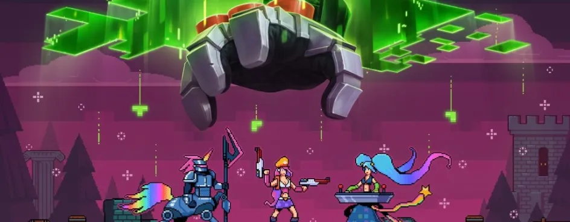

# Уровень 10: Финальный босс

Данный пост — перевод последней десятой статьи из [курса лекций «Принципы игрового баланса»](https://gamebalanceconcepts.wordpress.com/) за авторством профессионала и преподавателя [Яна Шрайбера](http://www.gamasutra.com/view/authors/916452/Ian_Schreiber.php). Переводы предыдущих лекций вы можете посмотреть по [ссылке](index.md).

### **На этой неделе**

Добро пожаловать! Это последняя лекция в этом сезоне. На этот раз я не знал заранее, о чем говорить, так что специально оставил в программе лекцию на свободную тему, чтобы осветить все интересное, что могло встретиться на протяжении этого лета. В итоге я решил, что сегодня мы рассмотрим четыре темы. Это будет самый длинный пост из всего цикла, так что, если у вас немного времени, предлагаю сохранить его в закладках и вернуться позже.

Для начала я хотел бы поговорить об экономических системах в играх и о том, как балансировать систему, если ее контролируют игроки, торгуя и самостоятельно создавая свое богатство. Затем — обсудить некоторые типичные проблемы баланса в играх с мультиплеером, которым не нашлось места в предыдущих девяти лекциях. После этого можно немного углубиться в технические детали и поделиться новыми трюками и полезными советами по работе с Excel. И последний пункт в повестке дня – это возвращение к лекциям прошлого лета и всей концепции «интереса». Мы поговорим о том, как тема игрового баланса умещается в глобальной картине гейм-дизайна, потому что, несмотря на то, в какие дебри мы иногда вдавались, иногда эта тема все равно кажется немного узкой.

### **Экономические системы**

#### _Что такое «экономическая система»?_

Итак, мы очень часто произносим слово «экономика», даже в повседневных разговорах, так что я хотел бы дать четкое определение этого понятия, чтобы у нас не возникло недопонимания. В игровой тематике я буду использовать слово «экономика» для обозначения любых внутриигровых ресурсов. Это термин с широким значением; например, вы можете понять его так, что шахматные фигуры представляют собой «экономику фигур», но я возражу: да, о них можно думать и в таком ключе, но это не самый интересный пример, потому что эти ресурсы нельзя создать, уничтожить или передать каким-либо значимым для игры образом. В большинстве же экономик, которых мы, собственно, экономиками считаем, присутствует одна или несколько этих механик:

— Создание ресурсов, которые игроки сами добывают или же получают их со временем;

— Уничтожение ресурсов, что подразумевает либо их сожжение ради какой-то игровой цели, либо их конвертацию из одного типа в другой;

— Торговля ресурсами, при которой игроки ими обмениваются (обычно включает в себя переговоры или торги);

— Ограниченные ресурсы с нулевой суммой; в этом случае игрок, создавший ресурс для себя, ограничивает количество ресурсов для остальных.

Тем не менее, какой-то из этих элементов может вовсе отсутствовать, и мы все равно будем считать это экономикой.

Создание экономической системы в вашей игре – это деятельность третьего порядка в гейм-дизайне, равно как и создание инструментов дизайна уровня, настольных РПГ или количественных показателей. Именно поэтому это довольно-таки трудное занятие. Вы не просто создаете систему, в которой взаимодействуют игроки; вы создаете систему, которая влияет на их поведение, но затем сами игроки создают социальную систему внутри вашей экономической, и именно в этой комбинации они в итоге взаимодействуют. К примеру, в _«Поселенцах Катана»_ игроки регулярно обмениваются ресурсами друг с другом, но относительная цена каждого ресурса всегда колеблется в зависимости от того, что конкретному игроку нужно в конкретный момент (и обычно всем игрокам нужны разные ресурсы; в зависимости от того, насколько остро игрок нуждается в каком-то ресурсе, колеблется и сумма, которую он готов и может заплатить). Хорошая новость в том, что при помощи экономики можно как минимум предсказать многие варианты поведения игрока. Еще одна хорошая новость заключается в том, что во внутриигровых экономиках существует множество «опций дизайна», и мы, дизайнеры, можем их менять, чтобы добиться разнообразия в игре, так что у нас есть много разных вариантов. Сегодня мы их и рассмотрим.

#### _Спрос и предложение_

Итак, первый краткий урок экономики для начинающих, который нам нужно держать в голове, это закон спроса и предложения; некоторые из нас, наверное, о нем слышали. Рассмотрим самый простой из всех возможных вариантов: экономика с одним ресурсом, очень много людей, которые производят этот ресурс и хотят его продать, и такое же количество людей, которые этот ресурс потребляют и хотят купить. Также ради нашего удобства предположим, что одна единица ресурса полностью идентична другой, так что покупателям не нужно выбирать между разными «брендами».

Все продавцы устанавливают минимальную цену, за которую они готовы расстаться со своим товаром. Может быть, у кого-то расходы на производство меньше, а у кого-то – прожиточный минимум, так что он может снизить цену на свой товар и остаться на плаву. Может быть, кому-то дороже обходится содержание магазина, или он просто жадный, так что этот продавец повышает минимальную цену. В любом случае, мы можем нарисовать _кривую предложения_ на графике, и увидим, что при любой заданной цене (на оси x) существует определенный процент или количество продавцов, желающих продать товар по этой цене (ось y). Так что, возможно, за 1 доллар всего лишь два продавца могли бы продать свой товар, но уже за 5 долларов таких продавцов нашлось бы десять. 20 долларов – тысяча продавцов, и, постепенно увеличивая цену до 100 долларов, вы обнаружите, что любой продавец в мире согласен на эту цену. В принципе, единственное, что вам нужно знать о кривых предложения: как только повышается цена, повышается предложение. Если десять продавцов согласны на цену в 5 долларов, то, повысив ее до 5 долларов и 1 цента, вы будете знать, что _как минимум_ эти десять продавцов все еще согласны (если они продавали товар за 5 долларов, то, _разумеется_, они согласятся и на 5,1), и, вероятно, появятся еще несколько продавцов – мол, так и быть, еще за один цент мы согласны.

Итак, с другой стороны это работает так же, но наоборот. У покупателей есть _максимальная_ цена, которую они готовы и могут (неважно, по какой причине) заплатить. Мы можем начертить на том же графике _кривую спроса_, которая покажет количество людей, согласных _купить_ товар за любую определенную цену. И, в отличие от кривой предложения, кривая спроса всегда _снижается_; если десять человек _купят_ ваш товар за 5 долларов, то при цене в 5,1 вы, может быть, и сохраните всех десятерых покупателей, если повезет, хоть некоторые из них и могут сказать, что это слишком дорого _для них_, но вы абсолютно точно не найдете никого, кто _не купил бы_ товар за низшую цену, но _купил бы_ за высшую.

Разумеется, в реальном мире эти предположения не всегда верны. Большинство подростков скорее бы купили кроссовки за 50 долларов, чем за 20, потому что от цены обуви, которую они могут себе позволить, зависит их социальный статус. А некоторые продавцы не хотят продавать свой товар по заоблачно высоким ценам, поскольку считают это неэтичным, и они предпочтут продавать его дешевле (или вообще выйти из бизнеса), нежели так наживаться на своих покупателях. Но давайте для удобства предположим, что в наших играх большую часть времени кривые предложения будут расти, а кривые потребления – падать по мере возрастания цен. Вот в чем хорошая новость: то место, где кривые пересекутся, обозначит рыночную цену, на которую согласятся все игроки. Даже если игрокам _неизвестны_ показания кривых, рыночная цена станет такой будто бы по волшебству. Это произойдет не _мгновенно_, если у игроков неполная информация, но достаточно быстро, потому что игроки, продающие товар по цене ниже рыночной, увидят, что кто-то продает тот же товар по более высокой цене (потому что так _приходится_), и скажут «Эй, если _они_ продают дороже, то и _я_ тоже смогу!». И, более того, если покупатель платит за что-то высокую цену, а потом видит, что сосед купил _то же самое_ в два раза дешевле, этот покупатель будет требовать меньшей цены в следующий раз.

Следующий пункт может представлять интерес, если в рассматриваемых онлайн-играх есть рынок ресурсов. Если вы играете в онлайн-игру, где игроки торгуют или обмениваются внутриигровыми предметами за внутриигровые деньги, обратите внимание на то, кто поддерживает исторически сложившийся список цен (чем-то похожий на биржевой код на фондовом рынке): разработчик или фан-база? Вы заметите, что со временем цены немного меняются. Так что вы можете задуматься, в чем тут дело, и почему цены колеблются? Ответ таков: потому, что со временем немного меняется баланс спроса и предложения. Предложение меняется по мере того, как игроки создают предметы и выставляют их на продажу; спрос _также_ меняется, потому что в любое данное время разные игроки будут покупать онлайн любой данный предмет. Вы можете увидеть это на примере других игр, в которых есть любой вид покупаемого и продаваемого ресурса. И, поскольку игроков не бесконечное количество, это все не особо эффективно, так как вы будете получать неравные количества каждого произведенного и купленного предмета.

Итак, это указывает нам на еще одну интересную особенность экономики: чем меньше игроков, тем очевиднее для нас колебание цен, потому что один игрок контролирует все больше и больше потребления или производства. Именно поэтому цены на Глину в _Поселенцах_ меняются от игры к игре (или даже внутри одной и той же игры) в сравнении с ценой на какой-нибудь эпический лут в _World of Warcraft_.

Так вот, экономика – не из тех вещей, которые вы можете прямо контролировать как гейм-дизайнер, но, по крайней мере, вы можете предсказывать, как события будут развиваться в дальнейшем. Это также значит, что, если вы разрабатываете настольную игру с торговлей, рассчитанную на количество игроков от 3 до 6, вы можете ожидать, что увидите больше резких колебаний цен при меньшем количестве игроков. Вы, может быть, решите добавить несколько дополнительных правил для партий с малым количеством игроков, если для функционирования вашей игры принципиален стабильный рынок.

#### _Множественные ресурсы_

Все становится намного интереснее, когда у нас появляется сразу несколько видов ресурсов, потому что кривые спроса могут влиять друг на друга. К примеру, предположим, у вас два вида ресурса, и один можно заменить другим – может быть, один дает вам +50 здоровья, а другой — +5 маны, которую вы можете потратить на то, чтобы исцелиться и получить +50 здоровья. Если один из этих ресурсов очень дорогой, а другой – дешевый, вы можете просто купить дешевый. Даже если они _не полностью_ взаимозаменяемы, игроки вполне могут принять _несовершенную_ замену, если цена этой замены существенно ниже, нежели рыночная цена того предмета, который им действительно нужен. Разница между той ценой, которую люди заплатят за товар, и той, которую они заплатят за замену, покажет вам, насколько эта замена эффективна (иными словами, насколько хорошо она «заменяет» оригинал).

С другой стороны, у вас также может быть тот случай, когда при нескольких видов ресурсов спрос на один _повышает_ спрос на другой, потому что лучше всего эти ресурсы работают, если покупать их комплектом (в какой-то мере эта ситуация противоположна ситуации с заменой). Например, в тех играх, где собранный комплект предметов дает бонус к статусу, или где вы можете отдать по одной единице ресурса, чтобы получить бонус, острая потребность в одном виде ресурса повышает потребность во всех остальных… и, как только игрок соберет несколько нужных ресурсов из набора, его потребность в остальных возрастет _еще больше_, ведь полдела уже сделано!

Создавая полностью или частично взаимозаменяемые ресурсы, или несколько ресурсов, которые идут в комплекте друг с другом, вы можете изменять спрос (таким образом, и рыночную цену) на эти ресурсы.

#### _Предельное ценообразование_

Мы уже как-то обсуждали этот вопрос в контексте числовых систем: иногда спрос – это показатель того, сколько товара у вас уже имеется. Если у вас вообще нет какого-то определенного ресурса, добыть первую единицу кажется чем-то из ряда вон выходящим, но, когда у вас тысяча единиц этого ресурса, одна кажется уже чем-то несущественным, так что кривая спроса может падать, в зависимости от того, сколько единиц какого-то ресурса у вас уже есть. Или, может быть, вы можете использовать множество ресурсов для того, чтобы получить более крупные бонусы, и в таком случае ваша потребность в одном виде ресурса возрастет. То же самое верно для стороны предложения, где _производство_ одного ресурса в крупных масштабах может быть более или менее дорогим, если производить его поштучно, а не в малых количествах. Так что вы можете добавить все эти механики для того, чтобы повлиять на цену. Например, если вы даете все возрастающие бонусы за каждый ресурс игрока, со временем вы увидите, что игроки монополизируют отдельные ресурсы, поскольку, как только игрок приобретает большинство единиц какого-то ресурса, он хочет купить все оставшиеся единицы. Например, если вы даете все меньше бонусов за приобретение товара, будет разумным добавить снижающуюся цену за _производство_ этого товара, если вы хотите, чтобы цена этого товара была более или менее стабильной.

#### _Дефицит_

Наверное, вам можно об этом не напоминать, но если общее количество ресурсов ограничено, это повышает спрос. Пример все время у вас перед глазами – в маркетинге, когда компания хочет заставить вас поверить, что у нее ограниченное количество какого-то товара, и вы покупаете этот товар даже по завышенной цене, потому что не хотите упустить свой шанс. Так что вы легко можете изменить отношение к ресурсам в игре, всего лишь сделав их бесконечными или ограниченными.

В качестве примера давайте рассмотрим шутер от первого лица, в котором у вас есть ограниченное количество оружия. Во-первых, представьте, что оно _строго_ ограничено: что найдете – ваше, но на этом все. Такая игра будет казаться скорее хоррором на выживание, в которой игрок расходует патроны предельно осторожно, ведь неизвестно, когда они кончатся и когда можно будет найти еще. Сравните эту игру с игрой, в которой враги восстанавливаются на каждом шагу, постоянно выпадают случайные предметы, а еще там есть магазины, где можно продать эти случайные предметы и купить столько патронов, сколько будет нужно. В такой игре пользователь будет намного более охотно экспериментировать с оружием, потому что будет знать, что всегда может забрать свое оружие в ближайшем оружейном магазине, и из-за этого игра будет гораздо больше похожа на обычный шутер от первого лица. А теперь сравните _эту_ игру с такой, где у вас будет _совершенно неограниченный_ запас боеприпасов, так что это будет уже выходить за рамки ресурсов или экономики; вы можете ожидать, что игрок будет стрелять относительно часто, как, например, в недавно вышедших шутерах, ориентированных на экшн. Ни один из этих методов не является «верным» или «неверным», они все дают возможность получить совершенно разные впечатления от игры, так что я пытаюсь сказать следующее: чем больше вы повышаете спрос на товар (и уменьшаете желание использовать его сейчас, ведь он может понадобиться в дальнейшем), тем более он ограничен.

Если именно от ресурсов в конечном итоге зависит победа игрока, ограничить ресурсы – отличный выход, если вы хотите контролировать время игры. Например, в большинстве стратегий в реальном времени на доске есть ограниченное количество мест, где игроки могут добыть ограниченное количество ресурсов, которые они могут потратить на создание юнитов и различных структур на карте. Поскольку основные ресурсы нельзя добывать бесконечно, рано или поздно они кончатся, и игроки больше не смогут создавать никаких юнитов, таким образом, игра естественным образом подойдет к концу. Регулируя количество ресурсов на карте, вы можете установить точный момент, когда это произойдет; если игроки исчерпают все ресурсы за 5 минут, игра получится довольно-таки короткой… Но если даже для того, чтобы добыть все ресурсы возле стартовой локации, требуется час, то игроки скорее прибегнут к помощи военных сил, прежде чем встанет вопрос о том, что кончаются ресурсы. То, что у них вообще ограничены ресурсы, просто поможет избежать бесконечного тупика и установит лимит на максимальную продолжительность игры.  
Если вы разрабатываете игры с множеством игроков с закрытым типом экономики, вам нужно иметь в виду строго ограниченные товары, потому что иногда имеется вероятность того, что один игрок соберет весь имеющийся ресурс и тем самым лишит всех остальных доступа к нему. Вам, как дизайнеру, предстоит решить, возможно и нужно ли это. Если вам кажется, что этот вариант развития событий неприемлем, нужно понять, как его избежать. К примеру, если ресурсы никак не задействованы, пока игрок их не использует (и, использовав, кладет обратно в общий котел), это, вероятно, не будет проблемой, потому что у игрока, который получает монополию на ресурс, есть стимул использовать его, что, в свою очередь, лишает его монополии.

#### _Открытая и закрытая экономика_

В контексте систем мы говорим, что система открыта, если на нее могут влиять какие-либо факторы извне, и называем закрытой такую систему, которая полностью автономна. Экономика – это тоже система, и к открытой экономике предоставляются отличные от закрытой проектные требования.

Большинство игровых экономик представляют собой закрытые системы. Можно зарабатывать и тратить деньги внутри игры, но на этом все. Многим игрокам станет откровенно не по себе, если вы сделаете экономику открытой. В следующий раз, играя в Монополию, попробуйте предложить одному из противников настоящий доллар в обмен на 500 внутриигровых, и посмотрите, что произойдет – как минимум один игрок не поймет юмора!

С точки зрения дизайна закрытыми системами гораздо легче управлять, ведь мы контролируем всю систему, мы знаем, как она работает, и можем предсказать, как те или иные изменения повлияют на игру. Открытые же на порядок сложнее в управлении, потому что совсем не факт, что у нас есть контроль над всей системой.

Простой пример открытой экономики в игре — это _Покер_, если в нем допускаются дополнительные покупки игроком. Если позволить игрокам ставить столько денег, сколько у них имеется, у более богатых игроков будет очевидное и несправедливое преимущество; если игроки одинаково искусны, богатые могут просто покупать и покупать фишки, пока им не улыбнется удача. Чтобы решить эту проблему баланса, обычно организаторы турниров запрещают или ограничивают дополнительные покупки.

Также такая проблема может возникать в ККИ: если игрок тратит больше денег, он может покупать больше карт и собрать большую колоду. В идеале, если мы хотим сбалансированную игру, игрокам с большими колодами следует дать больше _вариантов_, а не игровой _мощи_. Именно поэтому я считаю, что редкость карты не должна приниматься во внимание в кривой стоимости, если вы хотите, чтобы в вашу игру играло как можно больше людей. Если богатство гарантирует победу, вам следует так продумать экономику в игре, чтобы денег тратилось как можно меньше. В реальном мире у нас также есть кривые спроса и потребления, и, чем больше денег требуется потратить изначально, тем меньше у вас будет игроков – кто захочет так дорого платить за игру?

Есть и другие игры, в которых можно покупать внутриигровые предметы за реальную валюту; это обычное дело для бесплатных ММО и игр на Фейсбуке; разработчикам следует разграничивать те вещи, которые игрок может купить, и те, которые не может.             Если в продаже имеется какой-то предмет, который может дать серьезное преимущество (особенно это относится к играм, которые по сути предполагают соревнование между игроками), игра очень быстро может потерять баланс. В играх же, подобных _FarmVille_, это не самая большая проблема, так как игроки между собой особо не соревнуются.

Некоторые дизайнеры таким образом _намеренно_ вносят в игру дисбаланс, предполагая, что, если они создадут финансовый стимул, благодаря которому можно будет получить преимущество в игре, люди будут играть охотнее. Если честно, в некоторых случаях так и выходит, и, если игра сама по себе не очень захватывающа, тогда, чтобы получить деньги, остается только прибегнуть к этому варианту; но если вы вводите этот элемент с самого начала, то, как по мне, это пример ленивого дизайна. Куда лучше создать игру, в которую будет интересно играть всем, а затем предложить обменивать деньги на время (так, например, вы можете открыть какой-то предмет или локацию через несколько часов, и, в принципе, играть достаточно интересно, так что вы не чувствуете, что вас принуждают играть… но, если хотите немного промотать время вперед, заплатив пару баксов, почему бы и нет?). В этом случае деньги не дают никакого автоматического преимущества, они просто ускоряют процесс, который и так бы завершился.

И последний пример открытой экономики – это любая игра, преимущественно ММО, в которой игроки могут торговать ресурсами или «дарить» их, потому что в любом из этих случаев вы можете быть уверены, что вторичная экономика появится, как только игроки начнут менять реальные деньги на виртуальные вещи. Просто погуглите «World of Warcraft» и, вероятно, найдете несколько сотен веб-сайтов, где можно либо купить Золото за реальные деньги, либо продать его и получить ту же реальную валюту. Вот несколько вариантов, которые вы можете рассмотреть, если разрабатываете онлайн-игру с подобными торговыми механиками:

— Можно просто сказать, что обмен ресурсов на реальные деньги идет вразрез с вашими Правилами предоставления сервиса, и что аккаунт любого игрока, замеченного в подобных действиях, будет заблокирован. Это будет проблемой и головной болью отдела техподдержки: огромное количество игроков будет жаловаться на баны, и отправка им всем формальных писем с пользовательским соглашением будет занимать много времени. В некоторых случаях, например, в Diablo, где внутриигровой механизм обмена/торговли в принципе отсутствует, а игроки просто бросают предметы, а затем поднимают их, отслеживание подобного также может быть трудной задачей. Если же легко отследить это (ведь торговля где-то сосредоточена) и если вы _очень_ не хотите, чтобы люди покупали за наличные деньги игровые предметы, то спросите себя, почему игра, которую _вы же и спроектировали_, это допускает.

— Можно сказать, что вы не против открытой экономики, хоть и не поддерживаете ее, так что, если кто-то взял деньги игрока и не отдал товар, это проблемы игрока, а не разработчика. К сожалению, это _все равно_ проблема разработчика, потому что вы _все равно_ будете получать письма от игроков, в которых те будут жаловаться, что стали жертвами мошенников. Вне зависимости от того, будете ли вы что-то делать по этому поводу или нет, писем все равно будет множество. Если вы собираетесь игнорировать мошенничество, будьте готовы к тому, что некоторые игроки уйдут, а о вас пойдет дурная слава. Если же вы будете пытаться как-то с ним бороться, пользователи начнут воспринимать вас как подстраховку, следовательно, вероятность того, что они попадутся на удочку мошенников, увеличится. Почему? Потому что, игроки, зная, что в случае чего они могут просто отправить разработчикам письмо и те разберутся, станут больше доверять незнакомцам. Если вы попытаетесь принять какие-либо меры против мошенников, очень скоро вам начнет казаться, что вы играете в «стукни крота», настолько это неблагодарное дело.

— Вы можете узаконить внутриигровую торговлю, и вместе с ней – возможность принимать денежные выплаты. Хорошая новость в том, что у игроков не будет _никаких_ отговорок; насколько я понял, когда Sony Online сделали это с некоторыми своими играми, они крупно выиграли, ведь расходы на поддержку клиентов снизились на 40%, а для масштабной игры это весьма значительно. Плохая новость: вам придется связаться с адвокатом по этому вопросу, чтобы убедиться, что ваша внутриигровая политика не идет вразрез с какими-нибудь национальными банковскими законами, поскольку вы храните в игре деньги игроков.

Также вам следует решить, позволить ли игрокам _полностью_ продавать персонаж, пароль к аккаунту и все остальное. Для Фейсбук-игр это не такая уж проблема, потому что аккаунт в Фейсбуке синхронизируется со _всеми_ играми, и пользователю не так-то легко передать его. Однако в ММО, где все аккаунты сами по себе и ни с чем не связаны, подобное неизбежно. Вам нужно решить, что вы будете предпринимать по этому поводу. Зато, по крайней мере, продажа всего персонажа не вносит дисбаланс в игру.

Как бы то ни было, вам нужно убедиться в том, что внутриигровая торговля не нарушает баланс, если игрок покупает за реальные деньги много игровых предметов. Зачастую, чтобы избежать проблем, дизайнеры прибегают к следующему: они ставят ограничения на предметы, то есть, к примеру, разрешается купить очень крутой доспех в любое время, но носить его можно будет только по достижении 25 уровня.

#### _Инфляция_

Итак, как вы помните, кривая спроса основывается на желании каждого игрока платить какую-либо максимальную сумму за некий ресурс. Обычно мы воспринимаем кривую спроса как фиксированную величину, может быть, лишь слегка колеблющуюся при разных игроках или ситуациях, но выравнивающуюся со временем. Но вот несколько ситуаций, которые могут сдвинуть эту кривую в том или ином направлении и задержать ее там. Для нас самой важной является та, когда максимальная сумма, которую предлагает игрок, повышается.

С чего бы вам вообще хотеть заплатить больше? В основном – из-за того, что вы можете. Скажем, если бы я взял и вдвое увеличил ваш доход, но при этом кофе в Старбаксе подорожал бы с 5 долларов до 6, вы все равно бы покупали этот кофе (если, конечно, он вам нравится), ведь вы можете себе это позволить.

Как это применимо к играм? Представьте себе игру с экономикой с положительной суммой: то есть я могу получать деньги и предметы, и при этом другой игрок их не теряет. Валютная экономика в _Монополии_ действует приблизительно по такому же принципу – мы уже обсуждали это ранее; то же самое справедливо для ресурсной экономики _Поселенцев Катана_ и для экономики с золотом, которая используется во всех остальных ММО. Иными словами, со временем игрок богатеет. Если в экономике все больше и больше денег в целом (и, в особенности, _на каждого игрока_ в среднем приходится большая и большая сумма), мы наблюдаем то, что называется инфляцией: кривая спроса сдвигается вправо по мере того, как больше игроков соглашается платить больше за какие-либо ресурсы. Это приводит к тому, что рыночная цена товаров повышается, чтобы хоть как-то это компенсировать.

В _Поселенцах_ это на баланс игры особого влияния не имело. Представим, что вы играете уже достаточно долго и далеко продвинулись. Вы хотите обменять огромное количество ресурсов на то, что вам нужно, но вы уже настолько близки к победе, что никто не хочет с вами торговать. В _Монополии_ же главная проблема, которую я уже упоминал выше, такова: экономика с позитивной суммой, но цель игры – обанкротить противников; здесь мы видим, что для того, чтобы решить эту проблему, нужно изменить правила игры: побеждает, скажем, «первый, кто зарабатывает 2500 долларов», ну, или что-то в этом духе. В ММО инфляция – не проблема для бывалых игроков, ведь, в конце концов, они _сами_ хотят платить больше; тем не менее, это источник неприятностей для _новых_ игроков, которые начинают играть и понимают, что они зарабатывают одну единицу золота за пять часов в игре, а все мало-мальски хорошие предметы стоят миллионы! Новичкам просто не удается справиться с этим, ведь по мере того, как они зарабатывают золото, инфляция продолжается. Так что, если вы разрабатываете ММО, которую можно бесплатно начать и бесплатно же бросить, инфляция станет для вас масштабной проблемой, требующей решения. Есть два варианта: убрать позитивную сумму из экономики, или же добавить элементы с негативной суммой для противодействия позитивным.

Такие элементы с негативной суммой иногда называются «деньгостоки». Это некие механизмы, которые постоянно изымают деньги из экономики игрока. Хитрость в том, чтобы сбалансировать оба вида элементов таким образом, чтобы они нейтрализовали друг друга. Это можно сделать, измерив количественные показатели общей суммы денег в игре и средней суммы денег у среднего игрока и проследив, уменьшаются или увеличиваются эти показатели со временем. Эти деньгостоки могут выглядеть по-разному:  
— Деньги, которые игрок платит неигровым персонажам-владельцам магазинов, _особенно_ в том случае, если это деньги за предмет, который исчезает после использования.

— Деньги, которые игрок платит за обслуживание и содержание; например, периодические расходы на починку доспехов и оружия.

— Потеря денег (или предметов, статистики и т.д. – то есть тех вещей, за восстановление которых нужно платить) при смерти в игре.

— Предложения с ограниченным количеством высокостатусных предметов, особенно, если эти предметы не дают какого-либо преимущества в игре, а служат просто для украшения. В таких случаях из экономики исчезает значительная сумма денег, даже если эти предметы покупают всего несколько игроков.

— Хоть я и не знаю игр, в которых осуществлен этот прием, он вполне жизнеспособен: рассмотрим так называемый «налог на приключения», то есть некоторый процент от состояния, который всем игрокам время от времени приходится платить. Он не только дает стимул больше тратить, то и служит своеобразным наказанием для игроков, которые больше всего виноваты в инфляции. Альтернативным решением может быть _перераспределение_ богатства, т.е. вместо простого изымания денег из экономики можно брать некоторые суммы у богатых игроков и распределять их между бедными; сам по себе этот вариант – просто игра с нулевой суммой, которая вовсе не обязательно может решить проблему инфляции, но хотя бы даст новым игрокам шанс нагнать старожилов и со временем увеличить собственное состояние.

Уменьшить позитивную сумму экономики немного сложнее, потому что игроки привыкли к вылазкам, на которых они убивают монстров и собирают трофеи. Если вы ограничите количество монстров (т.е. они перестанут воскресать), тогда они очень быстро вымрут в мире игры. Если не давать никакого вознаграждения за убийство монстров, тогда игроки задумаются, а зачем вообще их убивать. Теоретически можно сделать как-то так:  
— Из монстров выбиваются трофеи, а не золото, и игроки не могут обменять или продать эти трофеи; можно всего лишь улучшить снаряжение игрока, но не более.

— Игроки получают золото за выполнение квестов, но только тогда, когда выполняют данный квест впервые; таким образом, в любой конкретный момент в игре количество золота у них ограничено. Золотом обмениваться и торговать нельзя.

— Игроки могут покупать особые предметы за золото в магазинах, так что, по сути, все сводится к тому, что они выбирают, какие преимущества приобрести для своего персонажа.

И еще один, последний, вариант решения задачи: периодическая перезагрузка сервера со сбросом всего имущества – игрокам придется приобретать все с нуля. Это _не решит_ проблему инфляции – у нового игрока, который появился к концу цикла, нет шанса нагнать олдфагов – но, по крайней мере, это означает, что, если этот игрок подождет до перезагрузки, у него будут равные со всеми остальными шансы.

#### _Торговля_

В некоторых играх широко используются механики торговли и обмена в экономике. Механика торговли может быть крайне интересна, если у игроков есть причина торговать; обычно эта причина в том, что имеется множество товаров, каждый из которых чем-то ценен разным игрокам. К примеру, в _Поселенцах Катана_ овцы практически бесполезны, если вы хотите строить города, и незаменимы, если вам нужны поселения. В _Монополии_ одна собственность одного цвета – пустяк, но, если вы приобретете еще несколько собственностей той же цветовой группы, это уже другое дело. В _World of Warcraft_ единственный предмет экипировки, который нельзя надеть на персонажа, вам не нужен вне зависимости от того, насколько велики бонусы к характеристикам для игрока другого класса. Давая всем игрокам предметы, которые для кого-то представляют большую ценность, нежели для этих игроков, вы даете игрокам причину торговать этими ресурсами.

Механика торговли обычно служит петлей отрицательной обратной связи, особенно в закрытой экономике. Игроки склонны предлагать выгодные сделки менее успешным игрокам, тогда как от более успешных они планируют получить сумму крупнее (или предпочитают вообще не вести с ними торговлю).

Существует множество способов внедрить торговлю в игру. Но для этого недостаточно просто сказать «игроки могут торговать», зато, применив торговлю, вы как разработчик сможете лучше контролировать впечатления игроков. Подумайте над следующими вариантами:  
— Могут ли игроки обговаривать действия в будущем как часть сделки («я дам тебе Х сейчас за то, что ты дашь мне Y сейчас и Z позже»)? Если это так, неразрывны ли подобные сделки и может ли игрок потом передумать?  
— Если запретить торговлю со сделками на будущее, весь механизм упростится; думая о будущем, игроки смогут покупать «в кредит», если можно так выразиться, и это очень усложнит процесс торговли. С другой стороны, игроки смогут заключать более интересные сделки.

— Если сделки с прицелом на будущее можно отменять, игроки будут заключать их с гораздо большей осторожностью. Подумайте, чего вы хотите: чтобы игроки были недоверчивыми параноиками, или чтобы у них были все стимулы для сотрудничества?

— Игроки могут торговать всеми ресурсами или только какими-то определенными? Например, в _Поселенцах_ можно торговать только картами ресурсов, но не очками выигрыша и не картами прогресса; в _Монополии_ можно торговать всем, кроме прокачанной собственности; в других играх можно продать и купить вообще все, что угодно.  
— Продаваемые ресурсы в целом более изменчивы, чем остальные. Многие ресурсы могут быть настолько мощными (например, Очки Победы), что никто в здравом уме не согласился бы их ни на что менять, так что достаточно просто сделать их не подлежащими торговле, чтобы игроки не портили себе игру неудачными сделками.

— Могут ли игроки торговать только в какое-то определенное время? В _Поселенцах_ торговать с активными игроками можно только до того момента, как они начнут строительство; в _Бонанза_ у каждого игрока во время его хода есть возможность продать какие-либо ресурсы; в _Монополии_ можно торговать чем угодно, с кем угодно и когда угодно.

— Если у игроков есть возможность торговать в любое время, подумайте над тем, могут ли они торговать «мгновенно», откликаясь на событие в игре, потому что иногда возможность реагировать на внутриигровые события может вносить дисбаланс. Например, в _Монополии_ теоретически возможно избежать выплаты подоходного налога, продав все свое имущество другому игроку, а затем выкупив его, обосновавшись на поле, а еще можно предложить другому игроку меньший налог (скажем, 5%) в обмен на услугу предоставления налогового убежища. Короче говоря, _ясно_ дайте понять, чем игроки _могут_ торговать, а чем – _не могут_.

— Если торговля в игре происходит не постоянно (скажем, торговать можно только раз в несколько ходов), учтите, что ход с торговлей будет занимать больше времени: если у игроков было время на то, чтобы накопить ресурсы, подлежащие торговле, они дольше будут заключать сделки.

— Если для вас это проблема, то, возможно, стоит добавить таймер, который отводит игрок строго определенное время на заключение сделок.

— Требуют ли правила игры равных условий сделок (т.е. карта за карту) или же неравный обмен допустим (в Поселенцах неравное количество карт, но требуется как минимум одна от каждой стороны; в других играх допускается возможность «подарить ресурс»)?

— Если допустимы только равные условия, это ограничивает возможности игроков и количество заключаемых сделок, но это также ускоряет время торговли, поскольку спорить нет смысла; кроме этого, у слабого игрока меньше шансов заключить плохую сделку и окончательно проиграть.

— Я даже могу представить себе игру, где _неравные_ сделки обязательны: если вы вообще торгуетесь, кого-то должны надуть.

— Ограничено ли количество заключаемых сделок? Здесь у нас особая проблема, сравнимая по потенциалу с проблемой кингмейкинга, в которой один игрок понимает, что он не может победить, но есть два кандидата на победу; во власти этого игрока отдать все имущество одному из этих двоих и, таким образом, позволить ему победить. Иногда людям делать что-то такое мешает социальное давление, но вам нужно быть _крайне_ осторожным в ситуациях с турнирами и другими «официальными» играми, в которых экономические стимулы-призы здоров подогревают спортивный азарт (я как-то раз участвовал в игре, в которой за первое место 20 долларов, за второе – 10, а я был как раз кингмейкером, так что просто продал свои ресурсы наиболее вероятному претенденту).

— Сделки прямые или нет? Обычно процесс таков: я даю тебе Х, а ты мне – Y. Также возможно ввести некий «налог на торговлю», при котором, скажем, 10% дара или товара на продажу изымается и отдается банку, например, для того, чтобы ограничить торговлю. Это кажется странным: зачем вообще вводить механику торговли, если вы не собираетесь ее поощрять? Дело в том, что в некоторых играх торговля может быть _настолько_ мощным инструментом (например, если два игрока объединятся для взаимовыгоды и обойдут всех остальных), что вам придется ввести ограничения на торговлю, чтобы избежать доминирования.

— Существует ли способ навязать игроку сделку с другим игроком против воли? Обычно условия торговли требуют того, чтобы оба игрока были согласны с ними, но вы можете включить в игру механизмы, которые позволят игроку – при определенных условиях – навязывать другому игроку сделку. Например, в ККИ вы можете позволить игроку один раз за игру обменять более слабый предмет на более сильный.

#### _Аукционы_

Механизмы аукционов – это особый вид торговли, при котором один игрок продает с молотка свое имущество другим игрокам, или банк создает предмет из ничего и продает его тому игроку, который предложит больше всех. Аукционы часто служат самобалансирующейся механикой, поскольку игроки окончательно сходятся во мнении касательно цены того или иного предмета, так что, если вы не знаете, во сколько оценить какой-то предмет, вы можете просто выставить его на аукцион и позволить игрокам решить за вас. (и все же это пример ленивой разработки; аукционы проходят лучше всего, когда фактическая стоимость является переменной, меняется от игрока к игроку и по ситуации, так что понимание того, сколько стоит этот предмет, меняется от партии к партии, и игроки иногда принимают довольно-таки интересные решения. Поскольку какой-то предмет никогда не становится дороже, чем он есть, такие аукционы становятся бессмысленными, как только игроки понимают реальную стоимость предмета; кто-то просто платит ее и все расходятся.)

Аукционы – это прямо-таки суть понятия «готовность платить», потому что каждый игрок должен решить, сколько он готов заплатить, чтобы предложить соответствующую цену. Часто возникают метасоображения: не просто “насколько я хочу этот предмет», но и «насколько я _не_ хочу, чтобы этот предмет получил один из моих противников, потому что тогда у него будет слишком много мощи», или даже «мне этот предмет вообще не нужен, но я не хочу, чтобы его получил мой противник, так что я предложу большую сумму и буду надеяться, что мне его не продадут».

В аукционах интересно то, что обычно предмет получает предложивший больше всех, то есть тот, кто хочет заплатить наибольшую сумму – а именно это и нужно тому, кто выставил предмет на торги: получить как можно больше денег. Но на самом деле реальная стоимость предмета колеблется где-то между наивысшей и следующей за ней наивысшей суммами, и, как правило, она ближе ко второй, хоть это и зависит от типа аукциона: иногда предмет и вовсе уходит с молотка задешево.

Сколько типов торговли, столько и типов аукционов. Вот лишь несколько примеров:  
— Открытые торги. Именно о них сразу вспоминают люди, услышав слово «аукцион». Любой игрок в любое время предлагает цену, и, когда никто не называет суммы больше, говорят «раз, два, _продано_». Если никто не хочет делать ставки выше своей платежеспособности, человек, который хочет заплатить больше всех, купит лот за стоимость, превышающую всего на 1 единицу ту цену, которую предложил игрок перед ним. В таком случае аукцион неэффективен (в том смысле, что в идеале вы _хотите_, чтобы предмет был продан за наивысшую цену), но позже мы увидим, что эта проблема свойственна всем аукционам.

— Аукционы с фиксированной ценой. Каждому игроку по очереди предоставляется возможность купить лот или отказаться. Так продолжается, пока кто-то не согласится на данную цену, или пока все не откажутся. Этот вид дает преимущество первому игроку – он может купить лот прежде всех остальных – и, если предмет дешевле, чем сумма, которую мог бы предложить этот игрок, он может оставить разницу себе. Таким образом, эффективность аукциона зависит от того, насколько удачно выбрана первоначальная цена.

— Аукцион по кругу. Каждому участнику по очереди предоставляется возможность сделать ставку или отказаться. Когда очередь доходит до последнего участника, тот решает, предложить ли новую цену (выше «второй цены») или позволить купить лот другому. Этот тип аукциона дает преимущество _последнему_ участнику, поскольку _для него_ это – аукцион с фиксированной ценой, следовательно, не надо волноваться, что кто-то может поднять ставку. То есть последний участник может предложить цену ниже той, которую он готов заплатить.

— Немой аукцион. Все участники тайно и одновременно делают ставки, затем одновременно же оглашают их; побеждает участник с самой высокой ставкой. Вам понадобится добавить какой-нибудь механизм, помогающий решить проблему с одинаковыми ставками, ведь иногда два или более участника будут предлагать одинаково высокую цену. В этом есть что-то непереходное, поскольку игроки не только пытаются определить их _собственную_ максимальную готовность платить, но и готовность _других игроков_.  Если лот представляет большую ценность для вас, чем для других, вы можете предложить низкую (для вас) ставку, ведь вы ожидаете, что ставки других игроков будут еще ниже; таким образом, вы можете предложить немного и все равно получить этот лот.

— Голландский аукцион. В США проводится редко, так как для его проведения требуется особое оборудование. Итак, у вас есть лот, торги начинаются с высокой ставки, и есть некий таймер, отсчитывающий понижение цены на какой-то определенный процент (скажем, за секунду цена падает на один доллар). Первый участник, который принимает цену в данный момент, побеждает. Теоретически это значит, что, как только ставка будет равна готовности платить какого-либо участника, лот нужно покупать, но на практике появляется любопытное напряжение, если он хочет подождать, пока ставка еще немного понизится (рискуя упустить лот). Если у участников есть возможность «читать» по лицам друг друга в реальном времени, пытаясь вычислить самого заинтересованного, они вполне могут блефовать.

Когда вы определились с форматом аукциона, вам предстоит разобраться с несколькими видами того, как именно можно выставлять лот на аукцион.

— Самый распространенный: на аукцион выставляется один лот за раз; его покупает тот, кто предложит наибольшую цену, остальные участники не получают ничего.

— Иногда на аукцион в форме драфта выставляется сразу несколько предметов одновременно: первый предмет получает участник, предложивший наивысшую цену, второй – предложивший «вторую цену», и так далее. Тот, кто предложил меньше всех, получает самый последний предмет… или вообще ничего, если вы хотите дать игрокам стимул делать бОльшие ставки. Другими словами, даже если игроку _не нужен_ ни один из этих предметов, он может захотеть заплатить небольшую сумму, чтобы не остаться _вообще ни с чем._ И наоборот, если вы хотите, чтобы игрок поберег свои деньги, сделав нулевую ставку, можно сделать это, «подарив» ему последний предмет – но, конечно, если такую ставку сделает сразу несколько участников, вам нужно будет придумать, как разбираться с ничьей.

— Если вам нужна отрицательная обратная связь для того, чтобы один и тот же игрок не выигрывал в нескольких аукционах подряд, можно давать бонус, который позволит выиграть _в следующий раз_, тем, кто ничего не выиграл (или же просто тому, кто предложил наименьшую цену).

— Некоторые аукционы называются _аукционами наоборот_, потому что таков принцип их работы: обычно что-то хорошее происходит с участником, сделавшим наивысшую ставку, а здесь что-то _плохое_ происходит с тем, кто предложил _меньше_ всех. В этом случае игроки делают ставки для того, чтобы избежать этой участи. Можно совместить это с другими типами аукционов: если сделавший наивысшую ставку забирает что-то у участника с самой низкой ставкой, это дает игрокам стимул делать высокие ставки, даже если им этот лот не нужен. В игре с аукционом _Fist of Dragonstones_ был очень интересный вариант: предложивший наивысшую цену забирает что-то у игрока, предложившего «вторую цену», таким образом, если вы делаете ставки, вам нужно точно знать, что вы выиграете, а не займете второе место! С другой стороны, если ставку делает _только один человек_, тогда на втором месте оказываются _все остальные_, то есть игрок может выбрать, у кого из противников что-то забрать, таким образом, если вы _вообще не делаете ставок_, это тоже иногда может выйти вам боком.

Как только вы определитесь с тем, кто что получает, вам нужно подумать, кто оплачивает ставки. Есть несколько вариантов:

— Самый распространенный: на аукционе с одним лотом игрок с самой высокой ставкой платит, все остальные – не платят ничего.

— Если два игрока – с самой высокой ставкой и со второй ценой (но первый получает лот, а второй – ничего) – платят, то делать низкие или средние ставки – опасно; аукцион превращается в непереходную механику, где вам нужно либо сделать ставку выше, чем у всех остальных, либо настолько низкую, чтобы не платить. Наиболее распространен этот вариант в немом аукционе, в котором участники никогда не могут быть уверены в сумме, которую ставят их противники. Если сделать что-то подобное с _открытым_ аукционом, вы рискуете очень быстро потерять контроль над происходящим. Оба главных претендента на победу лучше заплатят предельную стоимость и превзойдут противника, чем потеряют ту сумму, которую уже поставили – например, если вы выставляете на аукцион банкноту в один доллар и (скажем) самая высокая ставка – 99 центов, а вторая по величине – 98, у второго участника есть стимул предложить доллар (пусть лучше так, чем впустую потерять 98 центов), и это, в свою очередь, дает первому участнику парадоксальный стимул поставить доллар и цент (поскольку в такой ситуации им проще потерять 1 цент, чем 99)! Если оба участника будут следовать этой логике, они могут продолжать повышать ставки вечно!

— Игрок с самой высокой ставкой может выиграть и заплатить сумму, равную второй цене. Как подсказывает нам теория игр (при помощи некоторых математических вычислений, которые я не буду здесь приводить), что на немом аукционе лучшая стратегия – ставить сумму, равную твоей максимальной готовности платить.

— Иногда, особенно в тех случаях, где все участники что-то получают, а тот, кто поставил наибольшую сумму, просто выбирает первым, вам будет нужно, чтобы _все_ участники выплатили свои ставки. Если все хорошее достается первому участнику, опасно делать ставки, не надеясь выиграть. Тем не менее, в серии таких аукционов участник может либо поставить все на одном-двух аукционах, чтобы уж точно победить, или же поставить мало и попытаться получить кучу предметов задешево там, где никто не будет делать ставок.

— Если платят только участники с самой высокой и самой низкой ставками, у участников опять же есть стимул делать более высокие ставки, потому что выиграть – хорошо, а ничего не потерять – еще лучше. Возможно, стоит заставить игроков делать определенные минимальные ставки, чтобы всегда существовал шанс что-то потерять (иначе можно просто поставить ноль и не платить ничего)… хотя, если нулевые ставки возможны, то минимальные ставки начинают _казаться_ безопасными, ведь всегда существует шанс, что вы не потеряете свою ставку, если кто-то защитит вас, поставив ноль.

— Если платят все, кроме участника, сделавшего самую низкую ставку, то у участников появляется реальный стимул делать очень высокие или очень низкие ставки.

Вы разобрались с тем, кто что платит? Теперь нужно решить, куда пойдут средства, вырученные на аукционе:  
— Обычно все просто уходит «в банк» — то есть вся сумма изымается из экономики, что ведет к дефляции.

— Можно убрать эту сумму в некое хранилище, в котором находятся все аукционные деньги, а затем распределить между игроками или отдать кому-то одному, когда возникнет такая необходимость.

— Также можно распределить деньги, выплаченные победителем, между игроками или отдать другому игроку, то есть превратить этот аукцион в аукцион с нулевой суммой. Это можно сделать несколькими способами. Может быть, можно поделить эту ставку поровну между всеми остальными участниками.  В настольной игре _Lascaux_ была интересная механика ставок: каждый участник по очереди отдает камень, чтобы остаться в аукционе, и, когда подходит очередь игрока, он решает, заплатить или выйти, прихватив с собой все камни, которые внесли до этого. Во втором случае аукцион продолжается с оставшимися участниками; таким образом, на каждом круге игрок должен решить, стоит ли покидать аукцион в данный момент с этим количеством камней, которые помогут выиграть в следующем аукционе, или же остаться на еще один круг (надеясь, что останутся все остальные и тем самым увеличат выигрыш, когда игрок все-таки решит уйти), или вообще оставаться до конца и надеяться выиграть в аукционе.

И последнее. Вне зависимости от того, каков тип аукциона, вам нужно решить, что происходит, если ни один участник не делает ставки:  
— Возможно, лот бесплатно или за бесценок достается одному из игроков. Если этот игрок известен всем заранее, это дает остальным игрокам стимул делать ставки только с той целью, чтобы лот никому не достался бесплатно. Когда игроки знают, что один из них по дефолту получит бонус, у них зачастую появляется стимул открыть торги. Если игроки не знают, кто это (допустим, лот получает _случайный_ игрок), тогда, скорее всего, они вообще не будут делать ставки, ведь шансы у всех равны.

— Альтернативный вариант: в аукцион могут быть включены дополнительные стимулы, которые потом будут повторяться. Если в аукционе участвует один ресурс, и он никому не нужен, можно добавить второй ресурс и попытаться продать их как набор… и, если и теперь эти ресурсы всем без надобности, добавляется третий, и так до победного конца.

— Или же (такое случается гораздо чаще), от предмета избавляются, его никто не получает, и игра продолжается, как будто никакого аукциона и не было.

Нет нужды упоминать, сколько всяких вопросов нужно решить, создавая внутриигровую экономику! Как и во всем остальном, правильных или неправильных решений не существует, но, надеюсь, я хотя бы дал вам пищу для размышлений и некоторые полезные советы.

### **Решаем типичные для мультиплеера проблемы**

Этот раздел нельзя было подвести ни к одной теме из тех, которые мы рассматривали в этом курсе, так что я решил поместить его сюда (и, если вам будет казаться, что он тут не к месту, так оно и есть). В общедоступных мультиплеерных играх с конкретным победителем, есть несколько довольно часто возникающих проблем. В зависимости от конкретной игры они могут относиться к балансу или не относиться, но, в любом случае, они вызывают недовольство игроков, так что нужно относиться к ним очень внимательно.

#### _Огораживание_

Первая проблема, особенно часто встречающаяся в варгеймах или в любых других разновидностях игр, где игроки прямо атакуют друг друга, такова: когда вы сражаетесь с другим игроком, даже если вы победили, вы с противником все равно становитесь слишком слабы по сравнению с другими игроками. Мудрые игроки делают все возможное, лишь бы не вступать в схватку. Вместо этого они улучшают оборону, что делает их менее привлекательными противниками, а затем, когда все остальные игроки уже сразились друг с другом, они «налетают» и собирают добычу, пока все остальные временно недееспособны.  Проблема в том, что система, по сути, вознаграждает игроков за невзаимодействие друг с другом; а ведь взаимодействие – важная часть игры, и, надеюсь, вы понимаете, что с этим нужно что-то делать.

Проблема игрового баланса заключается в том, что атаковать — то есть, собственно, _играть_ – это не самая оптимальная стратегия. Самым прямым решением тут было бы вознаграждение или стимулирование агрессии. Простой пример: настольная игра _Риск_. И атакующий, и защищающийся теряют свои войска; обычно вы бы просто не захотели атаковать, но в игре есть хитрость, которая не дает вам просто огородиться: вам дается стимул идти в атаку. Чем больше территорий вы контролируете, тем больше солдат вы получаете в следующем раунде, если вам удастся сохранить эти территории, то же самое справедливо для бонуса с континентами, и давайте не будем забывать о картах, в обмен на которые вы можете получить войска; но вы получаете карту только в том случае, если идете в атаку.

Еще один вариант решения: повернуть ситуацию так, что _не атаковать_ станет невозможно. Например, _Plague and Pestilence_ и _Family Business_ – это простые карточные игры, в которых берете одну карту и ходите тоже одной. Лишь _некоторые_ карты по натуре своей оборонительны, но большинство создано для того, чтобы атаковать. Вы _обязаны_ сыграть одной такой картой за раунд (и более того, придется выбрать конкретного противника), так что очень скоро вам просто придется _атаковать_ – избежать вражды невозможно.

#### _Поражение лидера и прикрытие_

Это распространенная проблема в тех играх, где игроки могут атаковать друг друга напрямую, особенно, если лидер очевиден. Она заключается в том, что все по умолчанию стремятся напасть именно на лидера. С одной стороны, это может служить петлей отрицательной обратной связи; вы можете быть уверены, что никто не вырвется вперед. С другой – игроки слишком стараются (таким образом, лидера не просто _сдерживают_, его _полностью уничтожают_), так что в итоге выходит, что быть лидером – себе дороже.

В качестве варианта решения этой проблемы можно применить новую динамику, которая называется _прикрытием_. Суть состоит в том, что, если быть лидером – слишком опасно, то стоит быть, скажем так, на втором месте. Если игрок достаточно хорош, чтобы стать лидером, он _нарочно_ будет играть не в полную силу, чтобы не стать мишенью. Проблема здесь, как и в случае с огораживанием, что люди не играют в созданную вами игру, а обходят ее правила.

Хорошая новость в том, что для того, чтобы это стало проблемой, должно произойти очень много вещей, и вы, чтобы все исправить, сможете сломать эту цепочку в любом месте.

— Игрокам нужен механизм для объединения сил и групповой атаки на одного игрока; если сделать так, что сформировать коалиции или скоординировать стратегии игрокам будет сложно, атака лидера станет непосильной задачей. В кооперативных играх без прямого противостояния игроки не могут прямо атаковать друг друга, так что стратегии «убей лидера» места, как и в марафонах, не найдется. В мультиплеерах-десматчах от первого лица игроки друг друга атаковать могут, но все происходит так быстро, что игрокам сложно скооперироваться (и вообще делать что-то помимо стрельбы в того, кто пробегает ближе всех).

— Или же, даже если игроки _могут_ объединяться, им все равно нужно понимать, кто лидер. Даже если в вашей игре используется скрытую систему счета, или конечной цели можно достигнуть по-разному, так что, кто крайний, непонятно, игроки не будут знать, на кого нападать. Не зря во многих еврогеймах очки игрока за победу скрываются.

— Или, даже если игроки могут координировать свои действия _и_ знают, кого атаковать, им не нужно это делать, если в игре уже есть возможность нагнать других игроков. В некоторых еврогеймах есть строго определенные периоды, за которые игроки могут набрать очки, и каждый раз они набирают больше очков, чем за предыдущий период. Таким образом, в середине раунда не совсем понятно, кто же лидер… и игроки знают, что, даже у игрока, набравшего максимальное количество очков в первом раунде, будет сравнительно небольшое преимущество, когда они доберутся до финального раунда.

— Или, даже если игроки могут координировать свои действия _и_ знают, кого атаковать, внутриигровая система может сделать эту стратегию нежелательной или предложить другие стратегии. Например, стоит ли всем атаковать лидера в _RISK_ – весьма спорный вопрос… но, с другой стороны, игра еще и мотивирует атаковать более слабых игроков, ведь, если устранить противника, вы получаете все его карты, что дает бонус в виде большей армии.

— Или же, поскольку стратегия «убей лидера» — это петля негативной обратной связи, можно решить задачу «как по учебнику» и добавить компенсирующая петля позитивной обратной связи, который поможет лидеру защититься от атак. Если вам нужна динамика, где в начале игры все на равных, но затем один игрок играет против многих, возможно, вам подойдет такой вариант.

Если вы решите _убрать_ отрицательную обратную связь стратегии «убей лидера», нужно иметь в виду, что, если ранее вы полагались на эту обратную связь для баланса игры, то теперь она может стать несбалансированной петлей положительной обратной связи, которая естественным образом _поможет_ лидеру. Так, может быть, стоит добавить _еще одну_ форму негативной обратной связи, чтобы компенсировать отсутствие предыдущей.

#### _Кингмейкинг_

Существует также схожая с предыдущей проблема: игрок весьма далек от победы, но он может решать, кто из двух _других_ игроков выиграет. Иногда это происходит прямо: в игре с торговлей и переговорами отстающий игрок может просто заключить несколько сделок с одним из лидирующих игроков в пользу последнего и тем самым передать ему козыри для победы. Иногда это происходит не так очевидно: например, отстающий игрок должен сделать один из двух ходов, и очевидно, какой из двух игроков выиграет в зависимости от какого хода.

Кингмейкинга лучше избегать, так как он разочаровывает игроков: ведь победитель стал победителем не из-за того, что он хорошо играет, а из-за того, что кому-то из _проигрывающих_ он больше понравился. В игре, где основной упор делается на дипломатию (например, в _Дипломатии_) это, может быть, было бы уместно; в конце концов, вся _суть_ игры в том, чтобы убедить других людей делать то, что вам нужно. Но в большинстве игр у победителей остается такое чувство, будто победа была незаслуженной, так что гейм-дизайнеры обычно пытаются избежать таких ситуаций.

Как и в случае с «убей лидера», должно произойти очень много вещей, чтобы кингмейкинг стал проблемой, и вам под силу справиться с любой из них:

— Проблема: игроки четко знают свои позиции. Возможное решение: если никто не знает, кто выигрывает, кто проигрывает, и что нужно предпринять для победы, тогда у игроков не будет причины помогать кому-то конкретному.

— Проблема: самый отстающий игрок знает, что ему не выиграть, и ему только и остается, что помочь выиграть кому-то другому. Возможное решение: если каждый игрок будет думать, что у него есть шанс на победу, тогда у него не будет мотива передавать этот шанс противнику.

— Или же можно уменьшить или полностью исключить способы воздействия игроков друг на друга. Если у последнего игрока нет механизма, который бы позволил ему помочь другим, кингмейкинг невозможен.

#### _Устранение игроков_

Суть многих игр с двумя игроками заключается в устранении противника, и вполне естественно, что игры-мультиплееры опираются на тот же принцип. Проблема в том, что, когда игрока убивают, а все остальные продолжают играть, проигравший ждет окончания игры, и, согласитесь, просто сидеть, а не играть — не очень-то весело.

Если игра короткая, это не проблема. Если партия длится две минуты, а вас вышибли за минуту до ее окончания, какая разница? Можно подождать начала следующей. Опять же, если игроков убивают в самом конце игры, это тоже не проблема. Если в двухчасовой игре участники начинают выбывать приблизительно после одного часа пятидесяти минут, то им относительно недолго придется ждать окончания этой партии и начала следующей. Проблемы начинаются только тогда, когда игроки выбывают в начале игры, и им приходится сидеть и пережидать практически вечность.

Есть несколько механизмов, которые помогут с этим справиться:

— Вы можете изменить схему устранения игроков, например, лишить их мотива убивать противников. Таким образом, игрок будет кого-то убивать, только когда почувствует, что достаточно силен для того, чтобы вынести вообще всех и тем самым выиграть. Настольная игра _Сумеречная Империя_ создана таким образом, что атаковать противников – крайне опасно, потому что в таком случае вы развязываете войну. Из-за этого игроки обычно никого не атакуют до того момента, пока они не уверены, что лидируют, что обычно происходит ближе к концу игры.

— Вы также можете изменить условия победы, полностью убрав механизм устранения. Если цель – получить 10 Очков Победы, то игроки будут так заняты сбором этих очков, что у них не останется времени убивать соперников. В карточной игре _Иллюминаты_ есть механизм устранения противников, но условие победы – сбор достаточного количества карт (а не устранение противников), так что игроки не выбывают так часто.

— Еще один интересный вариант выхода из положения: можно заканчивать игру при выбывании первого игрока. То есть побеждает не последний оставшийся игрок, а тот, который на момент поражения одного из противников был в наиболее выигрышной позиции (по каким параметрам эту позицию определить – решать вам). Если игроки могут друг другу помогать, в альянсах появляется некоторое напряжение, когда один из игроков приближается к проигрышу: лидер хочет, чтобы тот проиграл, а все остальные хотят помочь остаться в игре! Так происходит в карточной игре под названием _Сердца_, например. Создатели видеоигры _Gauntlet IV_ (для Sega Genesis) также реализовали похожую механику в боевом мультиплеерном режиме: как только убивали одного из игроков, запускался таймер с обратным отсчетом в 60 секунд, таким образом, раунд заканчивался, даже несколько игроков были живы.

— Можно придумать, чем займутся выбывшие из игры. Может быть, в вашей игре есть какие-нибудь NPC, которые обычно двигаются в соответствии с определенными правилами или алгоритмом? Тогда вы могли бы передать контроль над ними выбывшим игрокам (моя игровая группа сделала это внутренним правилом в настольной игре _Wiz-War_ – в ней такой игрок получал контроль над всеми монстрами на карте). В Космическом Противостоянии есть правила для варианта игры с семи игроками (обычно их шестеро) – седьмой игрок может служить своего рода помощником, он может смотреть на карты других игроков и давать им различную информацию… а еще у этого игрока есть тайная цель: им нужно, чтобы победил конкретный игрок, так что вполне возможно, что всем остальным они сообщают ложную информацию. В Мафии/Оборотнях и других вариациях выбывшие игроки получают возможность наблюдать за разворачивающейся драмой, то есть, даже если они больше не задействованы в игровом процессе, им все равно весело, так что большинство игроков не возражают против роли наблюдателя.

### **Excel**

Рано или поздно в жизни каждого гейм-дизайнера наступает момент, когда ему приходится осваивать Excel. Возможно, некоторые из вас его уже активно используют, но, если вы не принадлежите к их числу, вам определенно следует научиться работать с ним. Считайте этот раздел кратким введением в Excel и его роль в гейм-дизайне. От себя добавлю несколько полезных фокусов, которые лишними не будут. Прошу немного потерпеть тех, кто уже является экспертами в этой области, и, надеюсь, вы тоже узнаете что-нибудь полезное для себя. Помните, я говорю об Excel 2003 для ПК; комбинации клавиш, о которых пойдет речь дальше, могут меняться в зависимости от версии или платформы.

Итак, Excel – это _программа табличных вычислений_, и, если вы не финансовый аналитик, вам это абсолютно ни о чем не говорит, так что, возможно, проще о нем думать как о программе, которая позволяет вам хранить данные в виде списка или таблицы. Самое простое применение для него – это, например, составление списка покупок или вещей, которые нужно сделать, в колонке. Если вам нужно добавить еще одну колонку для отслеживания того, что уже сделано, Excel вам идеально подойдет. Я работал с приличным количеством таблиц, которые были предназначены именно для этого, к примеру, со списком видео- и аудио-эффектов в видеоиграх и списком их текущего состояния. Данные в Excel хранятся в группах колонок и строк, где у каждой строки есть номер, а каждой колонке присваивается буква, и запись размещается в сочетании строки и колонки. Каждое отдельное место записи называется _ячейкой_. Между ними можно перемещаться при помощи кнопок со стрелками на клавиатуре или щелкая мышкой.

#### _Ввод данных в ячейки_

В общем и целом, есть три варианта содержимого ячейки: число, написанный текст или вычисленное значение формулы. С числами все довольно просто, достаточно просто ввести число в строке формул наверху и нажать Enter, или же кликнуть зеленую галочку. С текстом все тоже просто: точно так же введите нужный вам текст. А что делать в том случае, если вам нужно вставить текст, который выглядит как число или формула, но вам нужно, что Excel считал его именно текстом? Начните запись одним апострофом (‘), затем напечатайте нужный вам текст, и Excel поймет, что содержимое этой ячейки нужно считать текстом.

Для того, чтобы ввести формулу, начните запись знаком равенства (=), а затем введите ваши вычисления. В большинстве случаев это простая арифметика, и вам пригодятся такие символы, как +, -, \* и /. Например, если вы напечатаете =1+2 и нажмете Enter, в ячейке отобразится ответ: 3. Еще можно обращаться к другим ячейкам: при использовании команды =A1\* содержимое ячейки А1 умножится на 2 и результат будет помещен в ту ячейку, в которой вы сейчас работаете. Самое клевое в том, что, если вы измените значение переменной в А1, все формулы, в которых есть упоминание этой ячейки, соответственно изменятся. И именно поэтому использование Excel экономит столько времени. Более того, даже если вы добавите новые строки, которые собьют нумерацию, Excel _изменит ваши формулы_, чтобы данные в них соответствовали новой нумерации.

#### _Добавление комментариев_

Предположим, вы хотите как-то прокомментировать содержимое одной из ячеек. Проще всего, конечно, поместить текст в соседней ячейке, хотя, как вы увидите, размещение большого количества текста в одной из этих маленьких ячеек – задача не из тривиальных. Безусловно, этим методом можно пользоваться, но иногда он просто непрактичен. В таких случаях можно использовать функцию добавления комментариев, которая отображается в виде маленького красного треугольника в углу ячейки. Комментарий отображается при наведении мышки на этот треугольник.

#### _Перемещение данных_

Копировать, вырезать и вставлять данные действительно так легко, как кажется. Можно просто кликнуть и перетащить, или зажать Shift, оперируя при этом клавишами со стрелками, чтобы выбрать прямоугольный блок ячеек… или кликнуть на заголовок строчки или колонки, чтобы выбрать все их содержимое… или кликнуть на уголок между заголовками строки или колонки (или нажать Ctrl+A), чтобы выбрать вообще все. Если вы зажмете Ctrl, то сможете выбрать несколько ячеек, даже если они не рядом друг с другом.

Так вот, если вы несколько раз вставите ячейку с формулой, произойдет интересная вещь: вы заметите, что ячейки, упомянутые в этой формуле, изменяются. Например, если у вас формула в ячейке В1, которая ссылается на ячейку А1, и вы копируете В1 и вставляете в D5, вы заметите, что теперь новая формула ссылается на D4. Это происходит потому, что по умолчанию все эти ссылки на ячейки _связаны_ с оригиналом. Так что, когда вы ссылаетесь на А1 в своей формуле в В1, Excel думает не «так, ячейка А1..», а «ячейка слева от меня в той же строке». Таким образом, когда вы копируете и вставляете формулу в другое место, она начинает ссылаться на ячейку слева в той же строке. Как вы могли догадаться по этому примеру, если вы вставите ячейку в колонке А (где ничего нет слева, ведь это самая крайняя левая колонка), вы увидите, что Excel выдаст вам ошибку #REF!, которая означает, что вы ссылаетесь на несуществующую ячейку.

Есть два способа заставить Excel воспринимать референс как абсолютную величину, так, чтобы он всегда ссылался на конкретную ячейку вне зависимости от того, куда вы ее копируете и вставляете. Первый – это использование знака доллара ($) перед буквой колонки или номером строки, или и тем, и другим. Это скомандует Excel считать строку или колонку абсолютной позицией. Вспомним о ранее приведенном примере: если вы хотите, чтобы каждая скопированная и вставленная формула ссылалась на А1, можете использовать такую формулу: $A$1.  
Зачем нужно печатать знак доллара дважды? Потому что так вы дадите понять, что к строке можно относиться как к относительной величине, в то время как колонка – абсолютна, и наоборот. Я более чем уверен, что однажды вам понадобится эта опция, если еще не понадобилась.

Существует еще один способ сделать ссылку на конкретную именованную ячейку так, чтобы она была абсолютной. Это вам пригодится, если вы используете несколько ячеек и множество сложных формул – очень сложно удержать в голове, в какой ячейке какая величина, когда пишете формулы. Можете назвать любую ячейку; именем будет буква и номер ячейки по умолчанию, которые отображаются в верхнем левом углу окна Excel. Чтобы изменить имя, просто кликните по нему и наберите нужное вам. После этого вы сможете ссылаться на это имя в любом месте таблицы и это и будет абсолютным референсом к этой именованной ячейке.

#### _Сортировка_

Иногда необходимо рассортировать данные в таблице. Excel удобен, когда нужно следить за несколькими объектами сразу, когда они расположены по одному в строке, и каждый представлен в отдельной колонке. Например, представим, что у вас крупный проект по игре, и в одном Excel-файле перечислены все враги в игре: в одной колонке — имя, в другой – хитпойнты, в третьей – урон и так далее. Допустим, вам нужна сортировка по имени, чтобы в списке всегда было удобно найти нужного врага, или сортировка по хитпойнтам, чтобы увидеть самые крупные и самые мелкие величины, ну и тому подобное. Это довольно-таки легко сделать. Сначала выберите все ячейки, которые вам нужно рассортировать. Затем выберите меню «Данные» и пункт «Отсортировать». Затем укажите, по какой колонке это все сортировать, и как именно: по восходящей или по нисходящей. Если у вас в колонке две одинаковых записи, можете добавить вторую колонку в качестве разделителя, и третью – как второй разделитель, если хотите (иначе программа просто сохранит уже существующий порядок при такой сортировке). Также есть такой вариант: просто игнорировать строку заголовка, так что, если у вас в самом верху заголовок с описанием колонки, и вы не хотите, чтобы Excel и его отсортировал… ну, можете его просто _не выделять_ при сортировке, но иногда проще всего лишь выбрать всю таблицу и кликнуть кнопку «игнорировать заголовок». Если вы случайно про это забыли и вся таблица испортилась – не паникуйте, просто нажмите «отменить».

Иногда возникает необходимость вставить несколько колонок или строк где-то между уже существующих. Хорошая новость: Excel обновляет все абсолютные _и_ относительные ссылки именно так, как вам нужно, так что вам не нужно беспокоиться о необходимости замены величины или формулы или чего-то еще просто потому, что вы вставили строку. Чтобы вставить необходимую информацию, кликните правой кнопкой мыши заголовок колонки или строку, и выберите в меню пункт «вставить колонку» или «вставить ряд». Также можно воспользоваться меню «Вставить».

Если вам нужно _удалить_ строку или колонку, алгоритм действий остается прежним: кликните ПКМ заголовок колонки или строку и выберите пункт «удалить». Вам может показаться, что достаточно просто нажать на клавишу «Удалить» на клавиатуре, но результат будет не таким: данные из ячеек просто удалятся, но вверх или влево ничего не сместится.

#### _Использование ваших данных_

Иногда у вас есть формула, которую нужно скопировать и вставить во множество ячеек одновременно. Например, в моей контрольной книге в каждом ряду есть формулы для подсчета моего текущего баланса, после добавления или после вычитания текущей операции из предыдущей, и подобные вычисления мне нужны в каждой строке. Все что я мог бы сделать – это написать формулу один раз… но если бы мне пришлось вручную копировать и вставлять эту формулу в каждую отдельную ячейку, я бы заплакал. К счастью, из этой ситуации есть простой выход —  автоматическое заполнение ячеек. Просто выберите одну ячейку, данные которой вам нужно размножить, а также набор других ячеек под ней или справа от нее, в которые эти данные нужно вставить, затем нажмите комбинацию из клавиш Ctrl+D, чтобы разнести значение из верхней ячейки по всем остальным внизу (Заполнить вниз (Fill Down)), или Ctrl+R для того, чтобы разнести значение по всем ячейкам справа. Если вам нужно одновременно заполнить ячейки внизу и справа, просто выберите нужную ячейку и с помощью прямоугольного блока выделите ячейки справа и внизу, затем нажмите Ctrl+D и Ctrl+R в любой последовательности. Так же, вы можете произвести заполнение ячеек сверху или слева, но для этого нет клавиш быстрого доступа; вам придется выбрать их из меню «Редактор», который расположен под «Заполнение». При копировании и вставке, авто заполнение учитывает полную и частичную отнесенность к другим ячейкам в ваших формулах.

Есть разновидность команды авто заполнения, которая будет полезна в ситуации, описанной следующем примере. Предположим, вы создаете список игровых объектов, их у вас 200 штук, и вы хотите присвоить каждому объекту уникальный ID номер. Номера будет считаться с 1 и далее по возрастанию до 200. Для этого у вас выделена колонка, а каждый номер стоит в отдельной ячейке. Вводить каждый номер вручную утомительно и легко можно допустить ошибку. В этом случае, вы могли бы воспользоваться такой формулой: к примеру, вставить номер 1 в ячейку А2, далее в ячейке В2 вписать формулу =A2+1 (это рассчитает нам номер 2), затем нажимаем «авто заполнение вниз», и программа рассчитает все номера до 200. Такой метод сработает, только если вы не меняете расположение строк и не сортируете их, т.е. оставляете их в первоначальном виде, иначе все ячейки, связанные между собой, могут перепутаться. В этом случае метод может сработать, а может и не сработать, но путаница возникнет в любом случае. Как бы там ни было, вам ведь не нужны формулы в тех клетках, в которых должны быть номера.

Вы могли бы создать, где-то в рабочей зоне, 200 номеров по формуле, потом скопировать их, затем воспользоваться Paste Special (специальной вставкой, она расположена в меню, под редактором), далее выбрать опцию «Значения» (Values), которая принимает только рассчитанные значения и вставляет их как номера, без копирования формул. И потом просто удалить формулы, которые вам больше не нужны. Это работает, и опции Paste Special / Values — замечательные инструменты для многих операций, но в данном случае это ни к чему.

Есть маленькая хитрость: просто создайте 2-3 ячейки и пронумеруйте их 1, 2, 3. Теперь, выделите эти три ячейки и в нижнем правом углу, вы увидите маленький точку, напоминающую черный квадратик. Кликните по ней и оттяните его на пару сотен строк вниз. Как только вы отпустите кнопку мыши, Excel сделает наиболее вероятное предположение о вашем действии, и в соответствии заполнит ячейки. В таких простых операциях, как подсчет от 1, Exel без проблем угадает, что вы хотите сделать. В более сложных случаях, вы вряд ли достигните желаемого результата таким способом. Но, в качестве развлечения, можно посмотреть на то, как Excel будет пытаться определить, что вы думаете.

#### _Функции_

В Excel встроено множество функций, которые вы можете использовать в ваших формулах. Функции всегда пишутся большими буквами, затем открывается скобка, указываются те параметры, которые должны содержаться в данной функции (они могут изменяться в зависимости от функции), и затем скобка закрывается. Если в функции несколько параметров, они разделяются запятыми (,). Вы можете вставлять одни функции внутрь других, таким образом, чтобы параметр одной функции фактически мог быть концом другой функции; в Excel это прекрасно получается.

Пожалуй, единственная функция, которой я пользуюсь чаще, чем другими– это SUM(). Эта функция берет любое число параметров и складывает их вместе. Так, если вы хотите суммировать все ячейки от А5 до А8, вы можете задать функцию следующим образом =A5+A6+A7+A8, или записать её так =SUM(A5,A6,A7,A8), или =SUM(A5:A8). Последний вариант наиболее удобен, так как за счет написания двоеточия между двумя ячейками, вы тем самым сообщаете программе Excel, что вам нужны _все_ ячейки в заданном диапазоне. Вы даже можете воспользоваться прямоугольным блоком ячеек, выделив все нужные ячейки с верхнего левого края до нижнего правого и далее функция =SUM(А5:С8) добавит все 12 ячеек в блок 3×4.

Второй, наиболее полезной, функцией для меня является функция IF, которая заключается в трех параметрах. Первый параметр — это такое условие, при котором вычисляются параметры True и False. Второй параметр вычисляется и возвращается, если параметр True. Третий параметр вычисляется и возвращается, если параметр False. Третий параметр является дополнительным; если вы пропустите его и параметр будет False, ячейка просто будет пустой. Например, вы задаете функцию: =IF(A1>0,1,5), где А1 больше нуля, значение этой ячейки 1 или же 5. Наряду с функцией IF(), я пользуюсь похожей функцией ISBLANK(), которая берет ячейку и возвращает ей True параметр — если ячейка пустая; и False параметр — если ячейка не пустая. Вы можете воспользоваться этим, если, например, вы используете колонку для проверки списка, где какое-то значение было не проверено, и вы хотите настроить колонку на это определенное значение. Если вы создаете контрольный список и хотите знать сколько пунктов были проверены (или не проверены), в этом случае есть такая функция как COUNTBLANK() (ПОДСЧЕТ ПРОПУСКОВ), которая принимает значение ячеек за один параметр, и возвращает число ячеек, которые пустые.

Для случайной механики, вернемся назад в тот момент, когда мы говорили о псевдо случайности и посмотрим на мои любимые три функции: RAND(), которая не принимает никаких параметров совсем и возвращает псевдо случайное число от 0 до 1 (вероятнее это будет ноль, но никогда не единица). Замена любой ячейки или нажатие F9 ведет к тому, что Excel перебрасывает случайности. FLOOR() и CEILING() будут принимать числа и округлять их до стоящего ближе всего, меньшего или большего, целого числа. Или, вы можете воспользоваться функцией ROUND(), которая будет округлять их в обычном порядке.

FLOOR() и CEILING() требуют округления второго параметра до кратного числа. Во многих случаях вам лучше взять единицу, если вы округляете до ближайшего целого числа. Но если вы хотите округлить до ближайшего большего числа 5, или до ближайшего меньшего 0,1, или еще какого числа, то тогда вместо этого используйте ваш второй параметр. Чтобы не запутаться, ROUND() так же принимает второй параметр, но работает это немного иначе. В случае с ROUND(), если второй параметр равен нулю (что вам, собственно, и надо), тогда произойдет округление до ближайшего целого числа. Если второй параметр 1, то округление будет до ближайшей десятки, если второй параметр 2, то округление будет до ближайшей сотни; если второй параметр 3, то округление до ближайшей тысячной и т.д. Другими словами, второй параметр в функции ROUND() говорит вам включить в значение разрядность после десятичной запятой.

На 6 неделе, я уже упоминал RANK() и VLOOKUP(), они полезны для вас тогда, когда вам надо взять список и расположить его в случайном порядке.

#### _Работа с несколькими рабочими листами_

По умолчанию, в новом файле Excel есть три вкладки, под названием «Лист», которые находятся внизу слева. Вы можете переименовать их во что-то более интересное, чем «Лист1», для этого нужно: двойным кликом перейти на вкладку, и напечатать название, затем нажать Enter. Если вы хотите, чтобы какая-то вкладка была слева или по середине, вы можете поменять их местами, кликнув по ним и перетянув. Вы так же можете добавлять новые вкладки или удалять их, кликнув правой кнопкой мыши по вкладке «Лист», или зайдя через «Вставку» в меню.  Если вам много приходится работать с двумя вкладками, комбинации из клавиш Ctrl+PgUp и Ctrl+PgDn обеспечат удобный способ переключения между вкладками, и вам не придется постоянно кликать мышью по вкладкам внизу экрана.

Причинами для создания нескольких рабочих листов, по большей степени, стали организационные цели. Если у вас набор различных, но связанных между собой систем, то иногда проще выделить для каждой из них отдельный рабочий лист, чем пролистывать весь документ в поисках того, что вам нужно и что размещается на одном рабочем листе.

Путём ввода формулы, фактически, вы можете отнести ячейки в другие рабочие листы, если вы хотите. Самый простой способ сделать это — при вводе формулы, ввести название ячейки, затем кликнуть мышью на другой рабочий лист, а потом на ячейку(-ки), которые хотите соотнести. Обратите внимание, что на данном этапе очень легко случайно ошибиться. Когда вы что-то вводите в ячейку, вы можете не заметить, что не закончили ввод и кликните мышью на другую ячейку, чтобы посмотреть, что там, и вместо этого в вашу формулу начнут добавляться данные из этой ячейки. Если такое произошло, или вы понимаете, что вы запутались и не уверены, как извлечь часть введенной формулы, тогда просто нажмите красный крестик слева от поля для формулы, этим действием вы отмените все, что вы только что печатали.

#### _Построение графиков_

Последняя вещь, которую я нахожу действительно полезной, это возможность построения графиков. Великолепно подходит для наглядного просмотра игровых объектов при их взаимодействии друг с другом.  Выберите два или более рядов (колонки), каждый ряд (колонка) — это отдельная кривая; зайдите в меню и выберите вкладку «Вставка», затем выберите «Схема». Выберите XY(рассеивание), а затем подвид, который демонстрирует кривые линии. Далее, через «Мастер настройки», выберите ту опцию, которая вам нужна, кликните «Завершить» и вы получите готовую схему.

Часто вам будет нужно добавить в график такую вещь, как trendline (прямая линия). Для этого, кликните на любую точку графика и правой кнопкой мыши выберите «trendline». Вам придётся указать к какой функции будет относиться эта trendline: к линейной, экспоненциальной, полиноминальной или еще какой-то. В настройках trendline, во вкладке «Опции», вы так же можете отразить построение линии на схеме. Таким образом, фактически, вы можете увидеть кривую наилучшего приближения, а также отразить значение коэффициента детерминации (R-квадрат) (который является величиной, показывающей насколько близко построенная по точкам кривая, расположена к фактическим данным; коэффициент детерминации (R-квадрат), равный 1, означает, что кривая приближена идеально, R-квадрат, равный 0, означает, что данные могут быть случайными… хотя, на практике, даже случайные данные будут иметь значение R-квадрата больше нуля, иногда даже значительно больше). Если вы пытаетесь построить кривую по точкам, как это часто бывает при анализе метрик, вам, вероятно, придется добавить их сразу же.

Следующая вещь, которую вам стоит знать, так это то, что по умолчанию модели схем Excel… эмм… действительно смотрятся ужасно. Все что вы представляете в плане улучшения изображения – вы можете осуществить на деле: добавлять в график вертикальные, а не только горизонтальные линии; изменять цвета переднего и заднего фона везде; добавлять значки по осям Х и Y; изменять величины осей и их обозначения… всё это тут есть. Каждый элемент графика сам по себе является кликабельным и поддается выбору. В общем, если вам нужно что-то изменить, просто кликните на данный элемент и выберите «Формат», или кликните дважды. Просто имейте в виду, что каждый индивидуальный элемент – gridlines (линии сетки), graphed lines (линии графика), задний фон, оси – все они берутся по отдельности. Так что, если вы не видите изображения с опциями, это означает, что, вероятно, вы выбрали что-то не правильно. Поиграйте с опциями форматирования, и вы поймете, о чем я говорю.

#### _Улучшаем внешний вид_

В заключение, стоит сказать, что есть несколько приемов, позволяющих сделать внешний вид ваших рабочих листов более презентабельным, даже если там одни ячейки, без графиков. Помимо того, что работа будет смотрится более профессиональной, так же создастся ощущение, что вы подошли к её выполнению со знанием дела J

Самая очевидная вещь, которую вы можете сделать – это поэкспериментировать с цветовой гаммой. Вы можете изменить цвет текста, фона или любой ячейки. Для этого — в верхней правой части, на панели инструментов, есть специальные кнопки (по крайней мере, на моем компьютере эта панель располагается справа, возможно, что у вас иначе. Если так, то тогда просто добавьте панель инструментов для форматирования, и все будет у вас под рукой). Вы также можете выделить ячейки жирным шрифтом или курсивом, выровнять по левому или правому краю, и осуществить прочие действия, которые привычно выполняются в Word. Лично я, предпочитаю для удобства менять цвет фона, чтобы различать ячейки. Так, ячейки, в которых только текст заголовка — остаются бесцветными; ячейки, в которых предполагается изменение значений, с целью увидеть, как они воздействуют на другие показатели игры – становятся желтыми; ячейки, с вычислениями и формулами, которые нельзя менять – будут серые, ну и выделить что-то, действительно, важное жирным шрифтом.

У вас также есть огромный выбор возможных способов отобразить числа и текст. Выберите одну ячейку, блок ячеек, весь ряд или всю колонку, или даже весь рабочий лист, далее нажмите правой кнопкой мыши и выберите «Форматировать ячейки» (либо зайдите в меню «Форматирование»), здесь вы найдете массу опций к вашим услугам. Самая первая вкладка позволит вам определить, что это, текст или числа, и какого они типа. Например, вы можете отобразить число в валютном эквиваленте (без значка валюты, или с валютным значком; в виде доллара, или еще в каком-нибудь виде), или дроби (с любым разрядом числа).

Три важные черты вкладки выравнивания:

» Если вы хотите, чтобы сами колонки были узкими, то такая опция, как Ориентация, позволяет вам отобразить текст под углом, даже наискосок, и это сделает заголовки ваших колонок читаемыми. (К слову, вы можете регулировать ширину колонок и высоту рядов, кликая и перетаскивая границы между двумя рядами или колонками, или кликнув правой кнопкой мыши и выбрав «Ширина колонки» или «Высота ряда»).

» Опция Перенос слова делает текст читаемым, как вы и догадались. Excel будет лихо увеличивать высоту рядов, подгоняя их под текст. Так что, если колонка узкая, и в ней заключен абзац, вероятно, что в строке будет видно только часть слова, а все вместе это будет невозможно прочитать, поэтому перед вводом, вам придется отрегулировать ширину колонки.

» Есть такая любопытная опция, как «Объединение ячеек», которая позволяет вам конвертировать чисто-икселевскую сеточную форму в нечто иное. Чтобы сделать это, выберите несколько ячеек, затем нажмите «Форматировать ячейки», потом выберите опцию «Объединить ячейки» и кликните ОК. Вы увидите, что все ячейки, которые вы выбрали, образовали одну гигантскую ячейку. Обычно я использую эту опцию с косметической целью. Например, у вас есть список игровых объектов. Каждая колонка – это какой-то атрибут, таких атрибутов у вас целая куча, и вам надо их сгруппировать… Скажем, у вас есть несколько наступательных и несколько оборонительных атрибутов, или еще каких-то. Вы можете создать второй заголовок над всеми индивидуальными заголовками, далее объединить ячейки каждой группы, и в результате получить единую ячейку под названием (к примеру) — «Оборонительные атрибуты». На данный момент в Excel есть, так называемый способ — «Свободные таблицы» (Pivot Tables), который позволяет при определенных обстоятельствах сделать эту процедуру автоматически. Но эту, довольно продвинутую, вещь я оставлю на ваше самостоятельное изучение. Если эта опция вас заинтересовала, можете заглянуть в Google.

Иногда вы можете встретиться с такой вещью, как набор вычислительных ячеек. Они нужны вам для работы, т.к. вы к ним привязаны, но совсем необязательно видеть их постоянно на экране – все они просто промежуточные значения. В одном только случае придется обратить на них внимание – во время их присоединения к их собственному рабочему листу, но проще присоединить их к их собственному ряду или колонке и затем скрыть эту колонку или ряд. Опцию «Скрыть» можно найти, кликнув по ряду или колонке правой кнопкой мыши. После этого, ряд или колонка исчезнет из виду, но вы будете видеть тонкую линию между предыдущей и следующей колонками – это маленький визуальный знак, напоминающий вам, что здесь еще что-то есть, просто вы этого не видите. Чтобы снова сделать ряды и колонки видимыми, кликните по ним правой кнопкой мыши и нажмите «Показать».

Если вы хотите обрисовать квадратом определенный блок данных, с целью визуально сгруппировать эти данные, во кладке форматирования есть другая кнопка, которая позволит вам выбрать границы. Просто выберите прямоугольник из ячеек, затем кликните по нему и выберите границы, которые выглядят как квадрат, это создаст контур вокруг. Но хочу предостеречь вас, когда вы копируете и вставляете ячейки с границами, они копируются и вставляются в обычном режиме. Так что, не добавляйте границы, пока не закончите с мелочью (если все же вам пришлось, тогда просто удалите границы, переместите ячейки куда-нибудь рядом, а затем вставьте их назад…или воспользуйтесь специальной вставкой (Paste Special), которая вставляет только формулы, без форматирования).

Следующая опция – это условное форматирование, особенно полезная при использовании расчетных таблиц для выведения баланса игровых объектов. Сперва, выберите одну или несколько ячеек, рядов или колонок, затем перейдите в меню «Формат» и выберите «Условное форматирование». Задаете условие, True или False. Если True, вы можете задать формат: использование другого шрифта или цвета текста, жирный шрифт или курсив, добавление границ или фонового цвета, и все в таком духе. Если условие False, то форматирование не меняется. Когда в диалоговом окне условного форматирования внизу есть кнопка «Добавить», вы можете добавить два других условия, каждое со своим индивидуальным форматированием. Эти условия не совокупные. Первое условие всегда оценивается первым (и его форматирование используется, если условие удовлетворительное). Если нет, тогда будет пробоваться второе условие; если и это нет, то тогда пробуется третье. Пример того, как я использую это на практике: если я создаю игру с параметрической кривой расходов, я должен иметь одну колонку, которая складывает числовые доходы и отнимает расходы по каждому игровому объекту. Если мои доходы и расходы равны, баланс объекта будет равен нулю (согласно моей кривой расходов), если доходы выше, то будет положительный баланс; если расходы выше, то отрицательный. В данной колонке, если вычитая расходы из доходов, будет выходить баланс больше ноль, то условным форматированием делаем фон ячейки ярко зеленным; красным – если меньше нуля. Таким образом, я визуально сразу вижу сколько объектов еще не сбалансированы верно.

И последнее, во многих базовых таблицах вы наблюдаете следующее: у вас ряд заголовка вверху и колонка заголовка слева, все остальное – это данные рабочего листа. Иногда эти данные не умещаются на одной странице, но если вы начнете прокручивать вниз, то забудете где какая колонка. Предполагаю, что вам хотелось, чтобы верхний ряд или два ряда всегда отображались на экране, не зависимо от того, как далеко вы пролистали вниз, вам бы хотелось всегда видеть заголовки. Для этого вам нужно выделить первый ряд _под_ рядом заголовка, зайти в Меню окна и выбрать Freeze Panes (закрепить области). На выбранном вами месте, появится маленькая строка, которую вы всегда будете видеть, даже если прокручиваете документ вниз. Если вы случайно выбрали не тот ряд, и хотите отменить действие, зайдите в Меню окна и выберите Unfreeze Panes (снять закрепление областей), а затем попробуйте снова. Если вы хотите оставить левые колонки на месте, выберите колонку справа и нажмите Freeze Panes (закрепить области). Если вы хотите оставить на месте большинство левых колонок и большинство верхних рядов, выберите одну ячейку и нажмите Freeze Panes (закрепить области), теперь все, что сверху или слева от ячейки останется на месте.

#### **_Давайте поговорим об интересе_**

Мы обсудили все возможные темы, связанные с игровым балансом, поэтому сейчас мне бы хотелось поразмыслить над тем, какова роль баланса в геймдизайне в целом. Все согласны с тем, что главная цель геймдизайна зависит от специфики игры, но в большинстве случаев, по моему мнению, цель геймдизайнера — создать условия, в которых игрок сможет получить интересный опыт. Как эта цель связана с балансом?

Когда я только начинал заниматься дизайном, мне хотелось верить, что эти два понятия являются синонимами. Интересная игра — это сбалансированная игра, а сбалансированная игра — это интересная игра. Я не слишком горжусь тем, что очень сильно заблуждался по этому поводу. Мне выпал шанс сыграть не в одну, а несколько несбалансированных, но при этом интересных игр. Особенно мне запомнились два примера, они противоречили моему видению и заставили меня взглянуть на ситуацию с иной точки зрения.

Первой была карточная игра под названием “Landlord” (хотя у нее есть множество других названий, одно проще другого), наверно, наиболее известный вариант названия — “Великий Далмути”. Это по своей сути несбалансированная игра. Игроки занимают определенные позиции — от лучших к худшим. В начале раунда игроки, занимающие лучшие позиции, отдают свои слабые карты тем, у кого позиция хуже, а те, в свою очередь, отдают им свои сильные карты. Таким образом, игроки с лучшими позициями обладают значительным преимуществом.

В конце каждого раунда они пересаживаются в зависимости от результатов: игрок с лучшим результатом займет лучшую позицию в следующем раунде. Это естественная петля положительной обратной связи: у игроков с лучшей позицией настолько благоприятные условия, что высока вероятность того, что они останутся на своих позициях, в то время как условия игроков с худшими позициями настолько неблагоприятны, что они, скорее всего, тоже останутся на своих позициях.

Исходя из своего опыта, могу сказать, что в игру можно играть бесконечно, партию за партией, пока не надоест. Иногда в колледже мы с друзьями могли часами играть в эту игру, то есть она нам очень даже нравилась, несмотря на ее очевидный дисбаланс. Так почему же нам было интересно играть в эту игру?

На мой взгляд, это объясняется двумя следующими причинами. Первая кроется в том, что как только вы узнаете правила игры, вы сразу же понимаете, что игра несправедлива и, что на самом деле в этой несправедливости и есть вся суть игры.

Дело не в том, что игра всегда должна быть справедливой и сбалансированной, а в том, что если игра оказывается несправедливой и несбалансированной, вопреки ожиданиям игроков, она не оправдывает их надежды.

В вышеупомянутой игре изначально понятно, что перед вами несбалансированная игра, и если вы вообще решаете играть в эту игру, значит, вам интересно исследовать несбалансированную систему.

Вторая причина, которой объясняется успех игры — это присущая ей динамика ролевой игры. Звучит, конечно, странно, ведь это не компьютерная ролевая игра… но в то же время игроки занимают разные позиции и между ними по-разному распределяется власть. Таким образом, можно сказать, что элемент ролевой игры так или иначе присутствует в большинстве групп. Игрокам, занимающим лучшие позиции, интересно играть, потому что “хорошо быть королем”. Игрокам, находящимся в невыгодных условиях, тоже интересно играть, потому что они увлечены возможностью побороться против вероятности, выступить в защиту Простого Человека в несправедливой системе. Иногда один из игроков, занимающих неудачную позицию, начинает преуспевать и неожиданно вырывается вперед, а это круто (или один из игроков, занимающих лучшую позицию, терпит неудачу, что становится поводом для злорадства со стороны других игроков). Мне интересны оба варианта развития игры, начать свой путь с невыгодной позиции, медленно и терпеливо играть партию за партией и в итоге достичь высоких результатов (я полагаю, данный путь представляет собой что-то вроде метафоры, отображающей тяжелую работу и выход на пенсию). Игра дублирует систему с обеспеченными и малоимущими представителями, знакомую нам по повседневной жизни, поэтому очень интересно влиться в эту систему и исследовать ее на примере игры.

Вторая игра, которая убедила меня в том, что в жизни должно быть что-то большее, чем баланс, это настольная игра (с грамматически неверным названием) “Предательство в доме на холме”. Игра построена на сильном дисбалансе. Каждая новая игра — это новый сценарий, а сценариям присущи разные условия выигрыша, но в большинстве случаев несколько игроков пользуются сильным преимуществом. Кроме того, большая часть этих сценариев не рассчитана на разное количество игроков (т.е. в основном самое удачное количество игроков для выигрыша или проигрыша — трое или шестеро человек, таким образом, часто решающее значение имеет количество игроков и то, какой из сценариев выпадет). В игре ярко выражен элемент случайности, поэтому высока вероятность того, что один или несколько игроков будут пользоваться сильным преимуществом или, наоборот, окажутся в неблагоприятных условиях, к тому же в большинстве сценариев присутствует вероятность того, что игроки начнут выбывать на ранних этапах. Конечно, это не связано с игровым балансом, но в первом издании игры было также очень много опечаток, и казалось, что игру практически не тестировали (На самом деле я понимаю, что было выполнено множество плейтестов, но тестировщики были настолько увлечены игрой, что не стали отмечать или составлять отчет об ошибках, с которыми сталкивались).

Несмотря на дисбаланс, случайность и опечатки, в эту игру очень интересно играть, если играешь в подходящей команде. Дело в том, что независимо от хода развития сюжета, практически в каждой игре происходит что-то невероятное, и впоследствии это событие интересно обсуждать. В процессе игры создаются разные интересные сюжеты. Частично это заслуга колоритных игровых текстов на карточках и в сценариях… но они только передают атмосферу дома с привидениями и создают соответствующее настроение. В основном разнообразие сюжетов возможно благодаря случайности, присущей игре, возможно, в ходе игры вы заметите что-то крайне маловероятное, например, один из игроков обнаружит сразу несколько полезных предметов, или в ключевой момент при броске костей игрок получит неожиданно хороший или, наоборот, плохой результат, или вытянет нужную карту в нужный момент, а может быть, на собственной шкуре испытает действие этого нового таинственного символа на доске. Игроки готовы закрыть глаза на недочеты, потому что суть основного геймплея — исследование незнакомого и опасного места командой. По ходу развития событий один из игроков обманет своих и окажется в ситуации “один против всех”, и тогда скоординированная команда либо выиграет, либо проиграет.

В целом у игры оригинальная структура, и этого достаточно для того, чтобы игра была интересной.

Кроме того, важную роль в “Предательстве” играют ожидания игрока. Я не раз наблюдал ситуацию, когда игроки ничего не знали о игре, потому что им просто сказали, что это интересная игра, и в результате им было сложно смириться с наличием в игре дисбаланса. Когда я рассказываю об этой игре, я всегда сразу говорю о том, что она совершенно несбалансирована, потому что, если игроки будут знать об этом заранее, то она понравится им больше. И кстати, на самом деле я думаю, что игра была бы лучше, будь она более сбалансированной. Но я хочу сказать, что геймдизайн может быть успешным, несмотря на несбалансированность.

Я полагаю, что в конечном итоге задача игрового баланса — сделать игру справедливой. Наличие баланса очень важно для игр, от которых игроки ожидают равного противостояния. Например, одна из причин, почему многие игроки ненавидят эффект “резиновой нити” (rubber-banding) в гоночных играх: это когда одна из машин, управляемых искусственным интеллектом, резко набирает очень высокую скорость, хотя до этого находилась далеко позади. Им кажется, что это несправедливо, так как в гонках в реальной жизни так не бывает. Но в таких играх, как “Великий Далмути”, которые заведомо несправедливы, игроки уже настроены на игровой дисбаланс, и поэтому им легче с ним мириться. По этой же причине негативную реакцию вызывают совершенно несбалансированные и очень сильные карты в коллекционных карточных играх (особенно если они редкие). Но использование этой же механики в однопользовательских симуляторах коллекционных карточных играх может быть воспринято довольно положительно. Играя в настольную карточную игру друг против друга, игроки ожидают честного матча и, соответственно, сбалансированных карт. В то время как суть однопользовательской игры заключается в развитии и продвижении персонажа, поэтому игроки ожидают, что по мере развития игры им будут выпадать более сильные карты.

Вся суть геймдизайна сводится к пониманию целей. Вы должны знать, какие именно эмоции хотите вызвать у игрока. Если вы хотите создать справедливую игру (а большинство игр именно такие), то для этого вам и необходим баланс. Более того, я считаю, что игровой баланс не нужен только в тех играх, основной геймплей которых построен на концепте справедливости и несправедливости.

#### **Если сейчас вы разрабатываете игру…**

То, скорее всего, уже используете Excel и научились всему необходимому.

Если вы создаете общедоступную многопользовательскую игру, задайте себе вопрос, есть ли в ней проблемы, которые упоминались в этой статье (огораживание, стратегия «убей лидера», прикрытие, кингмейкинг, устранение игроков), и решите, как с ними поступить (если вообще как-нибудь поступать).

Если в вашей игре есть экономическая система, проанализируйте ее. Могут ли игроки торговать? Есть ли в игре аукционы? А если вы их добавите или уберете, как это повлияет на игру? Возможно, стоит обдумать альтернативные варианты внутриигровой экономической системы?

### **Домашнее задание**

Так как курс подошел к концу, давайте решим, как поступить с домашним заданием. Можно вообще его отменить, потому что курс-то закончился! Но с моей стороны это был бы ленивый дизайн.

Вместо этого я задам вам задачу посложнее, которая объединит все, о чем мы говорили в этой лекции. Создайте игру, а затем примените к ней все то, чему вы научились. Потратьте месяц на это задание, если оно окажется интересным, возможно, даже больше, и тогда у вас будет что добавить в свое геймдизайн-портфолио. Разумеется, вам решать, заниматься ли этим заданием.

Некоторые идеи:

Создайте базовый набор карт для оригинальной коллекционной карточной игры. Обычно я не советую студентам заниматься подобного рода проектами, потому что в коллекционных карточных играх много контента. В данном случае давайте ограничимся следующим:

Создайте дополнительный набор карт к уже существующей коллекционной карточной игре. Сначала используйте все свои знания о этой игре, чтобы вывести кривую стоимости. Затем добавьте эту информацию в Excel и используйте, чтобы создать новый сбалансированный набор карт. Добавьте на кривую одну или две новые механики, для которых вам нужно определить стоимость. Самостоятельно протестируйте новую механику в процессе игры, чтобы определить, чего она на самом деле стоит. Создайте небольшой набор карт, где-то от 50 до 80.

Или если у вас есть немного больше времени, и наряду с балансом вы бы хотели заняться дизайном систем:

Создайте самостоятельную игру, в которой будет 100 или меньше карт. Обратите внимание на такие игры, как “Доминион”, “Roma” или “Вознесение”, по своей механике они похожи на коллекционные карточные игры, но в них не нужно собирать карты, игроки составляют колоды или комбинации во время игры.

Когда основная механика будет готова, создайте кривую стоимости игры. Добавьте кривую в таблицу Excel и используйте для того, чтобы создать и сбалансировать отдельные карты.

Протестируйте игру с друзьями, пусть они попробуют “поломать” игру и найти эксплойты и оптимальные стратегии. Соответственно результатам скорректируйте кривую стоимости (и карты) и повторите все еще раз.

Также вы можете найти компьютерную пошаговую стратегию или стратегию в реальном времени с набором инструментов для создания пользовательских модификаций и поработать над балансом в этой игре:

Сначала поиграйте немного в игру и проанализируйте баланс при помощи интуиции. Присутствуют ли в игре очень сильные или, наоборот, очень слабые юниты, стратегии или объекты? Просмотрите форумы, чтобы понять, разделяют ли другие игроки вашу точку зрения, или вы просто используете разные стратегии. Если вы заметите один или несколько дисбалансов, проанализируйте игру математически, используя любой инструмент в вашем распоряжении, чтобы понять, что и как именно нужно изменить. Модифицируйте игру, а затем протестируйте ее, чтобы понять, решилась ли проблема.

Если вы хотите усложнить задачу, уберите весь геймплей при помощи набора инструментов для создания пользовательских модификаций, а затем создайте новый. Например, вы могли бы создать совершенно новый набор улучшений технологий для игры “Civilization” или новый набор юнитов для игры “Starcraft”. Если хотите, используйте арт игры, но измените геймплей. Затем поработайте над балансом в вашей новой системе.

» Если вы любите RTS игры, но при этом иногда предпочитаете и настольные игры, тогда создайте миниатюрную игру. Большинство мини игр дорогие (как бы там ни было, вам придется покупать и рисовать множество миниатюр), так что сориентируйте себя на то, чтобы не тратиться сильно. Используйте квадратные картонные кусочки, которые вы скомпонуете и вырежете самостоятельно. С такими дешевыми компонентами, если хотите, вы можете добавить экономические и постановочные приёмы жанра RTS.

» Сперва, взгляните на механику некоторых, уже существующих, миниатюрных игр, которые обычно весьма сложны. Как можно упростить механику боя, чтобы контролировать вашу рабочую нагрузку? Попробуйте сократить игру до простого комплекта атакующих и движущих механик с небольшим набором особенных способностей. (Для упрощения задачи, вы, конечно, можете просто создать комплект развития к существующей миниатюрной игре, в которую вы уже играете).

» Как и с другими проектами, создайте кривую стоимости для всех атрибутов и способностей игровых фрагментов, и воспользуйтесь Excel, чтобы создать и сбалансировать комплекты типов юнитов. Возьмите от 5 до 10 различных юнитов, не берите много. Вы увидите, что даже эти несколько юнитов довольно сложно сбалансировать. Подумайте вот о чем: может быть, стоит добавить непереходные отношения между юнитами, чтобы удостовериться, что ни одна стратегия не будет во всем лучше другой.  Если по окончанию, вас все устраивает в игре, вы можете собрать другой комплект юнитов того же размера для новой «группы», и попробуйте сбалансировать второй комплект с первым.

» Распечатайте комплект дешевых компонентов, протестируйте и повторите процесс с вашим дизайном.

» Или, если вы предпочитаете RPG игры настольного типа, проанализируйте систему боя (или разрешения конфликта) в вашей любимой игре, чтобы выявить несоответствия и предложить правила изменений, необходимых для устранения этих несоответствий. Для более длительного проекта, создайте свою собственную оригинальную систему боя, как в качестве замены уже существующей RPG игры, так и в качестве оригинального комплекта RPG в оригинальном игровом мире. Установите лимит страниц, чтобы держать всю сферу деятельности под контролем и бросить самому себе вызов: максимум 10 страниц под описание правил, а в кратком изложении все они должны уместиться на одной странице. Протестируйте систему с вашей обычной группой RPG настольного типа, если у вас таковая имеется (если нет, тогда вам вместо этого нужно будет выбрать другой проект).

#### **Ссылки**

Я отыскал два полезных блогерских поста, на которые будет полезно ссылаться при написании торгов и механик сетевых игр, соответственно:

[Learn to love board games again100](http://jergames.blogspot.com/2006/10/learn-to-love-board-games-again100.html)

и

[Design problems to watch for in multi](http://pulsiphergamedesign.blogspot.com/2007/11/design-problems-to-watch-for-in-multi.html)

#### **В заключение…**

Я бы хотел сказать, что сбор всей этой информации на протяжении всего лета, стал для меня потрясающим опытом, и надеюсь, что вы, вместе со мной, наслаждались этим путешествием.

Вас, наверное, интересует вопрос, буду ли я делать что-то подобное в будущем. И вы даже готовы поспорить, что ответ будет «Да», но на самом деле, я не могу сказать точно, как оно будет. Если вы хотите поучаствовать в курсе летом 2011, ждите объявления о наборе тут.

Удачи,

– Ian Schreiber