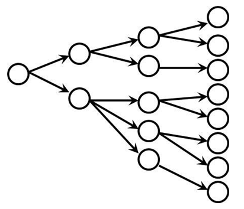
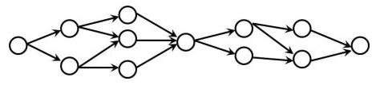
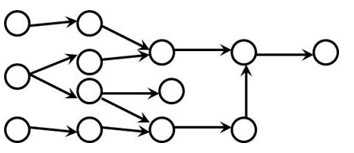
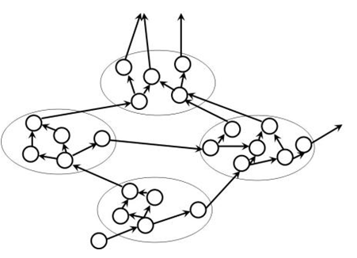
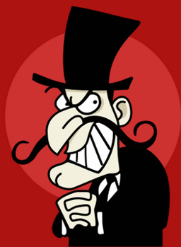
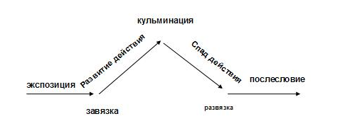

# Уровень 10: Нелинейное повествование

Данный пост — перевод десятой статьи из [курса лекций «Принципы гейм-дизайна»](http://gamedesignconcepts.wordpress.com/) за авторством профессионала и преподавателя [Яна Шрайбера](http://www.gamasutra.com/view/authors/916452/Ian_Schreiber.php). Переводы предыдущих лекций вы можете посмотреть по [ссылке](index.md).

В прошлый раз мы с вами познакомились с основами линейного повествования, в том виде, в котором его себе представляют люди, работающие с книгами, пьесами и кинофильмами. И это отлично подходит играм, имеющим линейный сюжет. Многие видеоигры устроены так, будто их сюжет – это фильм, разбитый на части, и чтобы увидеть следующую часть, игрок должен пройти кусочек игры. Я это вовсе не в уничижительном смысле, очень многие популярные игры используют этот приём, и очень многим игрокам это нравится. Даже у меня самого бывали случаи, когда я возился с характеристиками, улучшая свой отряд приключенцев, а моя жена подавала голос с другого конца комнаты: «Брось чепухой заниматься, иди и подерись с боссом что ли, интересно же, что дальше!»

Тем не менее, не все игры выглядят так. Как мы уже убедились, именно решения, которые принимает игрок, делают игру игрой. В некоторых играх повествование переплетается с геймплеем. В такого рода играх было бы логично, чтобы решения игрока влияли не только механически, на результат игры, но также и на повествование.

Для некоторых гейм-дизайнеров настоящий «интерактивный сюжет» — это что-то вроде квинтэссенции игр. На самом же деле, очень редко нам удаётся убедить игрока в том, что именно с него и с его решений начинается увлекательная история, которую он сам и создаёт. Как мы рассказывали интерактивные истории раньше, и как мы будем делать это в будущем? Это во многом нерешённая проблема, но мы можем хотя бы разобраться с тем малым, что нам уже известно, этим мы сегодня и займёмся.

Обратите внимание та то, что у большинства настольных игр нет ярко выраженного заложенного сюжета, поэтому сегодняшняя дискуссия будет касаться, главным образом, повествования в видеоиграх, а также настольных ролевых играх. Тем не менее, некоторые [современные](http://boardgamegeek.com/boardgame/39339/android) [настольные](http://www.boardgamegeek.com/boardgame/10547/betrayal-house-hill) [игры](http://www.boardgamegeek.com/boardgame/15987/arkham-horror) пытаются совместить игровой опыт настольной и ролевой игр, включая элементы сюжета, взаимодействие с которым является частью игрового процесса.

### Объявление

Всю следующую неделю я буду на конференции [SIGGRAPH](http://www.siggraph.org/s2009/). И хотя я приложу все усилия, чтобы записи в блоге появлялись вовремя, возможно, я не смогу оперативно отвечать на письма, подтверждать комментарии в блоге и новые регистрации на форуме, поэтому, прошу вас, наберитесь терпения. Само собой, если вы тоже будете там, не проходите мимо, поздоровайтесь лично – буду очень рад. Утром в понедельник я буду выступать с докладом о результатах проекта Global Game Jam.

### Чтение

Прочтите следующее:

— [Точка зрения](http://web.archive.org/web/20110611185019/http:/www.theinspiracy.com/ArPOV.htm) Ноа Фальштейна. Мы говорим о взгляде на сюжет «от первого лица» и «от третьего лица» — когда мы говорим о видеоиграх, мы используем похожие понятия (шутер от первого лица, стелс от третьего лица, и т. п.). Очень легко впасть в заблуждение, что они полностью соответствуют друг другу. Но это не так. В этой статье разница очень доходчиво объясняется.

— [Разнообразие повествования в играх](http://onlyagame.typepad.com/only_a_game/2005/08/diversity_in_ga.html) Криса Бейтмана. Это краткий обзор разных видов сюжетных структур, встречающихся в играх.

— _Challenges for Game Designers_, глава 13 (Создать игру, чтобы рассказать историю). Эта короткая глава охватывает нашу сегодняшнюю тему и подытоживает некоторые темы из прошлой лекции.

### Виды историй

Истории можно отнести к тому или иному классу по их общей структуре. Структуру формирует выбор, предоставленный игроку, насколько он ограничен и закрыт, какое действие оказывает этот выбор на текущую историю и конечный результат. Каждая структура имеет свои преимущества и недостатки, которые мы обсудим далее.

#### _Линейные_

Линейные сюжеты – это традиционное повествование с вкраплениями игрового процесса, который на сюжет никак не влияет. В этом случае сюжет и игровой процесс должны быть отделены друг от друга, так как в сюжете нет никакого выбора, а игровой процесс обязан включать принятие решений (иначе это просто рассказ, а никакая не игра). Они могут быть связаны тематически, и история может влиять на игровой процесс (например, когда происходят какие-либо заранее предусмотренные в сюжете события, в ход идёт новый элемент игрового процесса), но игровой процесс никак не может повлиять на сюжет, потому что сюжет есть только один.

У линейных историй есть одно важное преимущество перед другими сюжетными структурами: в них легче применять традиционные повествовательные приёмы, которые оттачивались тысячелетиями. Такие истории могут оказывать мощное эмоциональное воздействие – заметьте, мы _до сих пор_ обсуждаем смерть Флойда в _Planetfall’е_ и смерть Аэрит в _Final Fantasy 7,_ которые были поворотными моментами в истории игрового повествования… хотя ни то, ни другое событие никак не зависело от игрока.

Линейные истории имеют и очевидный недостаток, так как из-за отсутствия решений они не очень игровые сами по себе. Как я уже отмечал, между линейными сюжетами и игровыми механиками существует естественный барьер, который ограничивает потенциальное воздействие историй.

#### _Разветвлённые_

Естественно, первое средство для добавления решений в линейный сюжет, которое приходит на ум – это поместить в различных пунктах повествования точки с выбором. Когда игрок достигает определённого момента, он решает, что делать, и затем история продвигается по одному из нескольких путей, пока не достигает очередной точки решения. Примером служит классическая _Phantasy Star III_ для Sega Genesis; дважды за игру главному герою даётся выбор, на какой из двух девушек ему жениться (а затем история продолжается в следующем поколении персонажей), всего это даёт четыре ветки повествования, у каждой свой сюжет и своя концовка.

Разветвление историй имеет преимущество – оно даёт интерактивность. Если вы предоставите достаточное количество вариантов, из которых будет выбирать игрок, и если они охватят всё, что ему может захотеться сделать, игра будет убедительно отвечать на все его действия. На первый взгляд, это кажется окончательным выходом из ситуации, ответом на все вопросы.

Однако есть один существенный недостаток: это очень затратно! Всего с двумя вариантами выбора (немного, правда?) сценаристам _Phantasy Star III_ пришлось написать четыре истории. Если бы добавили третий вариант, им пришлось бы писать восемь историй, а если увеличить число вариантов всего до 10 – потребуется уже целых 1024 истории! Подумайте, сколько решений принимает игрок в ходе обычной стратегии, и вы поймёте, что написание разветвлённой истории может вдруг перерасти во что-то невообразимо огромное.

А теперь представьте ещё, что большинство людей, которые проходят игру лишь один раз, никогда не увидят подавляющей части готового контента. Для этого пришлось бы играть снова и снова, только для того, чтобы увидеть все пути, которыми можно двигаться по сюжету. И даже тогда игроку придется решать, какая из историй «настоящая», а какие – просто параллельные реальности, которые так и не произошли. С этой же проблемой столкнуться разработчики, если решат выпустить продолжение игры.

#### _Параллельные пути_

Это термин, предложенный Бейтманом для разветвлённой истории, которая сама собою сходится в одну линию; она предоставляет игроку выбор, но потом сводит все получившиеся линии в несколько обязательных событий. В _Silent Hill,_ например, есть несколько путей, которыми может пойти игрок, чтобы развить историю или открыть некоторые дополнительные элементы сюжета по пути, и это повлияет на концовку. Тем не менее, есть события, которые игрок обязан пережить, независимо от того, что он выбрал или не выбрал.

Параллельные пути решают проблему разветвлённого повествования, сохраняя преимущества свободы выбора для игрока, но при этом держа общее количество получившихся историй в разумных рамках. Итак, теперь может показаться, что _это_ как раз и есть окончательная сюжетная структура.

Как вы можете догадаться, всё равно остаётся проблема: раз игрок вынужден столкнуться с определёнными событиями, сюжет снова превращается в линейный. Мы лишили игрока ощущения, что это он направляет сюжет, ведь неважно, что он делает, в сюжете всё равно будут те же линии, неизменные несмотря ни на что.

Ещё одна возможность – дать решениям игрока влиять на концовку. Игроки проходят через одни и те же сюжетные перипетии, но исход определяется выбором игрока. К сожалению, это значит, что связь между причиной и следствием легко теряется – решения игрока (по определению) не видны до самого конца, и часто непонятно, что именно сделал игрок, что привело к такой концовке.

И опять у нас та же проблема: игрок должен пройти игру много раз только для того, чтобы увидеть различные варианты концовки.

#### _Переплетённый_

Этим словом Бейтман называет сюжеты, которые поделены на небольшие части, возможно, с несколькими сюжетными линиями, которые могут как пересекаться, так и не пересекаться. Игрок выбирает, какими путями следовать и в каком порядке. В пример можно привести _World of Warcraft,_ где игрок может взяться за любой из предложенных квестов, чтобы развивать любую из сюжетных линий.  Другим примером служит серия игр _Elder Scrolls (Morrowind_ и _Oblivion_), где игрок может следовать разными сюжетными линиями в зависимости от того, как он хочет развивать персонажа, и может находить новые квесты и сюжетные ответвления, которым он может последовать (либо нет), и эти ответвления могут как повлиять, так и не повлиять на основную сюжетную линию.

Преимущество переплетённого повествования в том, что оно крайне выразительно. У вас может получиться несколько сюжетных линий, которые происходят параллельно друг другу, как в нелинейных фильмах «Криминальное чтиво» или «Реальная любовь» (за тем исключением, что в отличие от фильмов, развитие сюжетных линий зависит от намерения игрока).

Кроме того, у сюжета может быть несколько начал, продолжений и концовок, но игрок имеет доступ ко всем сразу и может развивать любое их сочетание в любом порядке, так что мы, наконец, разобрались с проблемой вынужденных многократных прохождений игры. Игрок может увидеть всё, что предлагает игра, пройдя игру её всего раз, но достаточно тщательно.

Как вы уже, наверное, догадались, всё равно есть проблема. Во-первых, поскольку события могут влиять друг на друга, проверка всех возможных путей по вашей истории может быть ещё сложнее, чем тестирование разветвлённого повествования (для дотошных программистов: разветвлённый сюжет с двумя вариантами на каждый выбор даёт нам O(N^2), в то время как переплетённое повествование потенциально даст O(N!). Ага, _факториал_).

Написание разветвлённого повествования сильно усложняется тем, что события могут происходить в любом порядке. Из-за этого может получиться так, что игрок будет совершать действия в совершенно бессмысленной последовательности (например, ему даётся задание убить предводителя вражеского войска _до_ того, как война началась, или _после_ того, как она закончилась). Автор должен принять меры, чтобы доступ к определённым событиям давался игроку только тогда, когда в этом есть смысл. Отслеживать все переменные, определяющие активно ли событие в сюжете, очень быстро может стать сложной задачей.

Наконец, переплетённое повествование подвержено риску запутать игрока, если одновременно развивается слишком много параллельных сюжетов, и игрок не сразу видит связь между ними. С той же проблемой могут столкнуться книги и фильмы, пытающиеся рассказать несколько историй одновременно.

#### _Динамическое объектно-ориентированное повествование_

Эта последняя структура и термин, насколько мне известно, придуманы Бейтманом специально для того, чтобы описать игру [Façade](http://www.interactivestory.net/) (скачайте и поиграйте в неё обязательно, если ещё не видели её). Суть в том, что в ней несколько мини-сюжетов, у каждого есть несколько точек вхождения и точек выхода. Точка выхода каждого мини-сюжета ведёт либо к концовке, либо к другому мини-сюжету. Эти мини-сюжеты можно представить в виде глав в книге или актов в пьесе (за тем лишь исключением, что вы можете не читать все главы или можете читать их в произвольном порядке, в зависимости от вашего выбора и от того, каким образом вы завершаете главу).

Такой сюжет обладает преимуществами параллельных путей, но без линейности основной истории. Каждый мини-сюжет предоставляет свой набор решений и выборов, а все вместе они складываются в нечто похожее на большой разветвлённый сюжет или сюжет с параллельными путями. Каждый отдельно взятый мини-сюжет является самоценным и завершённым, что сокращает время на написание всей истории.

У таких сюжетов есть два недостатка. Первый состоит в том, что они не решают проблемы многократного прохождения: игрок вынужден проходить игру много раз, чтобы увидеть все сюжетные линии (наверное, именно поэтому _Façade_ должен длиться примерно 10-20 минут, а не 10-20 часов). Кроме того, это экспериментальная структура, поэтому у нас пока нет достаточного количества игр для анализа: мы не можем определённо сказать, что удаётся, а чего не удаётся этой форме. Создание самого _Façade_ потребовало пары ребят с докторской степенью по компьютерным технологиям, так что подобная сюжетная структура вряд ли может быть названа доступной любому автору.

### Точки зрения

Камера в видеоиграх обычно отображает взгляд от первого или от третьего лица.

#### _Точки зрения камеры_

Вид от первого лица, по сути, означает, что камера приклеена ко лбу главного героя, смотрящего перед собой. Игрок видит то, что видит главный герой. Это может привести к ощущению связи с героем, ведь игрок, так сказать, сидит у него в голове. Минус подобной перспективы в том, что это, не совсем вид от первого лица, потому что периферическое зрение человека шире, чем экран (а обычный человек, в среднем, поворачивает голову быстрее, чем камера в шутере). Всё это может помешать «слиянию» игрока с персонажем, особенно для тех, кто не привык к подобным ограничениям.

При виде от третьего лица игрок, вместо этого, смотрит _на_ главного героя, обычно как будто из-за плеча, при этом он видит героя со спины. Такой взгляд даёт более широкий обзор и более реалистично отражает ту визуальную информацию, которую воспринимал бы главный герой. Однако когда мы смотрим _на_ главного героя, это привносит некоторое отчуждение – ведь нельзя же смотреть на собственный затылок без помощи зеркал, так что этот вид напоминает нам о том, что мы и главный герой – не один и тот же человек.

Если мы сравним это со схематичным/реалистичным МакКлауда (из прошлой лекции), мы можем заметить, что вид от первого лица ближе к схематичному и больше подходит для схематичного же персонажа, на которого, как на чистый лист, игрок проецирует свою личность, в то время как вид от третьего лица реалистичен, и требует создания сильного характера для персонажа.

Вид от второго лица, если бы такой существовал, всегда показывал бы персонажа анфас. Не нужно говорить, что для большинства игр это выглядело бы, по меньшей мере, странно. Самое похожее я видел в запутанной игре для консоли _Robot_ _Alchemic_ _Drive,_ где вы управляете персонажем-человеком (от третьего лица), который, в свою очередь, контролирует гигантского робота через пульт дистанционного управления (от второго лица). Если воспринимать робота как главного героя, то можно сказать, что эта игра использует для управления вид от второго лица.

#### _Точки зрения на сюжет_

Мы также используем слова «от первого лица» и «от второго лица», когда обсуждаем литературу. Но там всё несколько иначе.

Рассказ от первого лица – это повествование, которое ведётся с точки зрения самого рассказчика. Главный герой напрямую обращается к читателю, повествуя о своих приключениях.

Рассказ от третьего лица (более распространенный) – это повествование, которое ведётся от имени стороннего наблюдателя (и имеет много общего с перспективой камеры в кино, где вид отражает взгляд «мухи на стене», а не какого-то конкретного персонажа). Это может быть «всеведущее третье лицо», которое знает обо всём, что происходит, и даже может слышать мысли некоторых персонажей, или «третье лицо с ограничениями», где часть информации (например, мысли персонажей) скрыта от читателя.

Редко в литературе можно встретить повествование от второго лица, где история рассказывается от имени _читателя._ Такие произведения редки потому, что их очень трудно написать убедительно.

Вы наверняка уже догадываетесь, что **почти во всех играх повествование ведётся от второго лица.** Этот происходит тогда, когда игрок контролирует главного героя, то есть, почти всё время.

И это ещё одна причина, по которой так трудно рассказывать истории в играх.

### Интерактивные персонажи

Иногда основная сюжетная канва линейна и предопределена, но есть некоторые персонажи (а именно «неигровые персонажи» или NPC), с которыми игрок может взаимодействовать. В видеоиграх, где межличностные отношения должны регламентироваться и иметь числовое выражение, есть два основных подхода к NPC и их отношениям с игроками.

#### _Флаги_

«Флаг» в данном контексте – это бинарный показатель (да или нет). Действие либо произошло, либо нет. Игрок поговорил, либо не поговорил с определённым неигровым персонажем, а если поговорил, то либо выбрал, либо не выбрал определённый ход беседы. В результате, те или иные диалоговые варианты у нового NPC могут появляться либо пропадать.

Преимущество флагов в том, что они просты в реализации. Всё либо происходит, либо нет, приводя к логике, которой очень легко следовать. К тому же, это легко воплощается в коде. Программисты знают толк в бинарной логике.

Недостаток в том, что такие персонажи не отличаются глубиной, есть только чёрное и белое, и никаких оттенков. Вы, конечно, _можете_ всё усложнить, сочетая бинарные показатели («Арагорн появляется только в том случае, _если_ Фродо идёт в трактир «Гарцующий пони» _и_ успешно избегает пленения Призраками Кольца _и_ при этом надевает Кольцо»). Но тогда уследить за всем становится трудно, что наносит сильный удар по простоте, которую мы упомянули ранее в качестве главного преимущества.

#### _Структурная близость_

Вместо дихотомии да/нет, мы используем числовые значения, чтобы измерить различные параметры, например, насколько сильно герой испытывает привязанность или ненависть к другому персонажу. Если вам надо решить, ведёт ли себя NPC определённым образом, проверьте, не перешли ли его показатели определённого порога (в настольных ролевых играх зачастую добавляют ещё и броски игральных костей, и тогда, случится событие или нет, зависит ещё и от случая).

Преимущество этой системы в том, что она по-прежнему относительно проста, может обеспечить большее разнообразие и сложность, чем флаговая система, к тому же, она гораздо более выразительна.

Тем не менее, её следует использовать с осторожностью. Есть риск создать очень неряшливую систему, где игроку непонятно, почему определённый персонаж повёл себя так, а не иначе), особенно если на результат влияют сразу несколько показателей или бросок кости. Если вкратце: сделать эту систему правдоподобной можно, только если _очень много раз_ её протестировать.

### Диалоги персонажей

В некоторых играх есть система диалогов, в которой игроку даются реплики на выбор, а затем NPC, с которым он разговаривает, ему отвечает.

Диалоговые системы представляют собой то же, что повествовательные системы игр. Диалоги могут быть:

— Линейные. Я подхожу к NPC и выбираю команду «говорить». Персонаж мне что-то отвечает. И всё.

— Разветвлённые. Я начинаю беседу. NPC что-то отвечает, мне даются ответные реплики на выбор. Основываясь на моих репликах, NPC может сказать что-то ещё, и мне снова будут предложены варианты ответов на выбор.

— Параллельные. Я начинаю разговор. NPC что-то отвечает, мне даются ответные реплики на выбор, неигровой персонаж снова отвечает и так далее. Тем не менее, есть несколько комбинаций ответных реплик, которые приведут меня к одному и тому же результату.

— Переплетённые. Я начинаю разговор, мне даются на выбор способы вступить в диалог. NPC отвечает на мои реплики, и каждое моё действие может повернуть разговор в новое русло и закрыть старую, не пригодившуюся ветвь дискуссии.

— Динамические. Я прохожу разветвлённый или переплетённый диалог. В зависимости от результата, я перехожу к новому разговору (или к новой теме внутри того же разговора).

Написание диалогов в каждой из этих систем пропорционально по сложности написанию историй в соответствующей форме.

### Создание хороших персонажей

Некоторые персонажи в историях «выпуклые» — они многогранны, у них глубокий, многоуровневый характер, они прорабатываются и развиваются на протяжении всей истории.

Другие персонажи «плоские» (или «поверхностные») – они очень просты, у них нет глубокого характера (по крайней мере, он не виден зрителям), они очень незначительно меняются и развиваются (если вообще меняются).

Обычно, когда мы говорим, что персонаж «плоский» это звучит пренебрежительно. Так плоские персонажи – это всегда плохо? Не думаю. Не всем персонажам нужно быть сложными, глубокими и прорисованными. Даже в пьесах Шекспира есть плоские второстепенные персонажи (камень в огород Розенкранца и Гильденштерна), но хотя бы главный протагонист и злодей должны быть выпуклыми.

Проверенное правило: по ходу истории персонаж должен развиваться со временем. Как следствие, второстепенные персонажи, у которых очень мало «экранного времени» могут быть плоскими, раз у них всё равно нет времени на развитие; персонажи, которых мы видим чаще всего (обычно это главные герои) обязательно должны развиваться. Плоский протагонист – не очень удачная мысль, если ваша цель – создание сильного персонажа.

#### _Архетипы и стереотипы_

Однажды на собеседовании мне задали такой вопрос: опишите, что такое «архетип» и «стереотип» и какая между ними разница.

МакКи говорит, что главное в истории – формы, а не формулы. Архетипы – это формы, стереотипы – формулы.

«Злодей» — это архетип. Похожий на Снайдли Уиплеша негодяй, покручивающий усы, в цилиндре и весь в чёрном, делающий пакости просто потому, что ему это нравится, – это стереотип.

Архетипы полезны. Они позволяют нам создавать истории с правдоподобными героями, которые укладываются в знакомые формы. Стереотипы заезжены, и, как правило, делают историю менее правдоподобной, потому что публика уже видела этих же персонажей в других историях, поэтому они не кажутся уникальными. Желательно избегать стереотипов, за исключением очень редких случаев (например, вы пишите пародию, которая высмеивает определённый стереотип).

#### _Классическая драматическая структура_

Она наверняка знакома вам ещё по школьным урокам литературы:

Суть в том, что сюжет начинается с короткой экспозиции, чтобы задать настроение, потом действие развивается со всё нарастающим напряжением, которое ведёт к кульминации (финальному сражению или противостоянию), а затем происходит спад действия и развязка, когда история приходит к своему завершению.

Обратите внимание, что это справедливо не только для историй, но и для игрового процесса. У игр есть экспозиция «вступительный ролик» или «обучение», развитие действия (большая часть игры), кульминация (битва с последним боссом), спад действия (какие-нибудь события после битвы –  успеть убежать из здания, которое вот-вот взорвётся и тому подобное), и развязка (заключительный ролик).

Драматическое воздействие будет сильнее, если сюжетные перипетии и игровой процесс параллельны и соответствуют друг другу. Добиться этого куда сложнее, чем кажется на первый взгляд; во множестве игр можно столкнуться с такой трудностью – самая сложная часть игрового процесса приходится на середину игры, где враги и задания всё труднее, но у вас ещё нет ни оружия, ни способностей для того, чтобы сравнять силы. По мере же того, как игрок становится сильнее и всё лучше играет, сложность игры для него падает, даже если напряжённость сюжета возрастает. Такое расхождение лучше всего видно в играх, где перед битвой с последним боссом нагнетается зловещая атмосфера и драматизм, а потом игрок побеждает, пару раз взмахнув мечом – это выглядит неправдоподобно и вовсе не кульминационно.

В двух словах – когда вы подстраиваете баланс своей игры, обратите внимание на то, насколько драматизм истории соответствует напряжённым моментам игрового процесса.

### И всё же это игра

Не забывайте, что будучи гейм-дизайнером, вы всё-таки делаете _игру_, а не _рассказ_. В большинстве случаев история не должна затмевать игровой процесс. В самом крайнем случае, вы должны быть  предельно осторожны, когда появляется соблазн немного поступиться игровым процессом в пользу истории, или когда вы собираетесь перегружать игрока неинтерактивными подробностями вашей истории.

Когда вы пишите повествование для своей игры, возвращайтесь как можно чаще к основной эстетике – общему впечатлению от игрового опыта, которого вы пытаетесь достичь – и каждый раз убеждайтесь, что история работает на создание этого впечатления.

### Чему мы научились

Есть множество способов сделать традиционное линейное повествование более интерактивным. У каждого из них есть свои преимущества и недостатки. Если идеал в виде полностью интерактивной истории и достижим, нам пока неизвестно, как именно его достичь.

Но мы должны не сдаваться и продолжать искать различные формы нелинейных историй, которые подходят для игр наилучшим образом.

### Чтение

Если у вас есть время, перед тем, как приступить к домашней забаве, приведённой ниже, пожалуйста, прочтите пять соответствующих вашему уровню опыта публикаций, посвященных заданию по игре _Pente_ из лекции 9 (опубликованных на форуме), а также, как минимум, пять других публикаций _более высокого_ уровня (если вы сами не публиковали в Чёрном ромбе). Сделайте это до понедельника включительно (3 августа, полдень по Гринвичу).

Когда будете читать, обращайте внимание на разнообразие реакций, которые вам встретятся. Встречаются ли вам повторяющиеся реакции или опыт каждого человека уникален? Как вы думаете, почему? Поразмыслите над этим.

### Семестровый обзор

На этих выходных отдохните – задания не будет. Если бы мы с вами встречались в классе, вы бы получили в качестве домашней работы семестровую контрольную. Но у меня нет ни времени, ни желания проверять и оценивать 1400 контрольных, да и составлять на всех индивидуальные варианты тоже неохота. Вместо этого я предлагаю вашему вниманию краткий обзор того, чему  мы научились за это время. В следующий понедельник мы с вами перейдём от почти полностью теоретических дискуссий о том, как делать увлекательные игры, к почти полностью практическим занятиям по созданию оригинальных нецифровых игр с нуля, и пройдём через весь процесс от идеи до полного воплощения.

Всего за пять недель мы с вами прошли долгий путь, и перед теми, кто всё это время не выбивался из ритма, я снимаю шляпу. Мы изучили почти все азы гейм-дизайна. В частности, мы обсудили:

— необходимость создания критического словаря для обсуждения игр, наряду с признанием, что развитого словаря у нас, увы, пока нет.

— у слова «игра» очень много определений… но обычно они либо слишком общие, либо слишком узкие, либо и то, и другое. В большинстве игр есть правила, цели, конфликт, принятие решений, «волшебный круг», отсутствие реальной материальной выгоды, неопределённый исход. Большинство игр – это деятельность, они добровольны, они воображаемы, представляют собой закрытые системы, а также симуляции чего-либо, кроме того, они – вид искусства.

— намеренность игрока (способность игрока стоить планы и воплощать их посредством игровых систем) требует ясной обратной связи и противостоит линейному повествованию.

— у игры есть множество формальных элементов: игроки, цели, правила, ресурсы и так далее. Каждый элемент должен быть сознательно разработан, кроме того, при анализе существующей игры полезно начинать именно с формальных элементов.

— игры – это системы. Чтобы полностью их понять, необходимо увидеть их в действии (то есть сыграть и испытать).

— всем играм необходимы правила подготовки, хода игры и завершения.

— механика – это правила игры. Приходя в движение, она приводит к возникновению динамики, то есть, собственно, игры. Динамика воздействует на разум и эмоции игроков, то есть приводит к эстетике игры. Дизайнеры создают только механику, идя изнутри вовне; игроки сначала испытывают воздействие эстетики, изучая игру снаружи вовнутрь.

— у большинства игр есть какая-то одна ключевая характеристика – игровой опыт, который либо интересен, либо приковывает внимание, либо наполнен каким-то смыслом, либо что-то ещё. Когда вы разрабатываете игру, периодически возвращайтесь к этой характеристике и задавайтесь вопросом, работает ли механика на создание нужного эффекта.

— возникающий геймплей – особый вид динамики, совокупность, возникающая из взаимодействия относительно простых динамик. Он может быть полезен, поскольку, разрабатывать (и программировать, в случае компьютерных игр) надо именно механику, его якобы можно использовать для создания более глубокого игрового опыта при относительно меньших затратах. На деле же большая часть сэкономленной стоимости просто перемещается из разработки в тестирование; так как возникающий геймплей не всегда приводит к положительному результату, его приходится особо тщательно тестировать.

— ещё один особый вид динамики – петли обратной связи. Положительная петля дестабилизирует игру, помогая побеждающим игрокам победить быстрее, а проигрывающим – быстрее проиграть, так как успехи и промахи нарастают как снежный ком. Отрицательная петля обратной связи стабилизирует игру, штрафуя победителей и помогая отстающим игрокам. Петли обратной связи не всегда желательны и не всегда создаются преднамеренно, но им можно найти применение; дизайнеры должны быть чуткими, чтобы обнаружить петли обратной связи и решить, полезны они или, напротив, вредят игре.

— существует много видов интересного. Кроме того есть множество систем, делящих игроков на типы. Дизайнеры создают интересное, они не создают игроков, поэтому «типажи игроков» полезны лишь в той степени, в которой они помогают нам понять, какие виды опыта мы должны создавать. Многое, что мы находим интересным сегодня, восходит к навыкам, которые требовались нашим древним предкам для выживания.

— в ходе игры мы принимаем множество разных решений. Бессмысленные решения не оказывают влияния на результат игры. Решения вслепую влияют на результат, но не дают игроку никакой информации о том, на чём можно основывать свой выбор, поэтому на стадии принятия все решения выглядят одинаково. Очевидные решения также влияют на результат, но дают слишком много информации, поэтому какое-то одно решение очевидно лучше, чем все другие. Самые интересные из решений включают в себя элемент обмена, где игрок получает что-то одно, но теряет что-то другое.

— когда люди на чём-либо сильно сосредоточиваются, это называется «потоковое состояние». Одним из способов вхождения в это состояние является трудное задание – не слишком лёгкое, но при этом не слишком сложное. Пребывание в потоковом состоянии приятно, а игры успешно погружают своих игроков в «поток». Такое состояние приятно потому, что в нём мы приобретаем новые навыки (или совершенствуем существующие).

— при написании линейных историй мы можем воспользоваться опытом прошедших веков. Аристотель учит нас тому, что сюжет должен быть правдоподобной цепью причин и следствий, источником которых является главный герой и тому, что у историй должны быть начало, середина и конец. МакКи учит нас, что в сюжете важны формы, что история должна содержать в себе перемены, что проявление характера в делах важнее, чем описание персонажа. Кэмпбелл делится с нами сюжетной формой «путешествие героя», которая полезна при написании героических историй.

— существует несколько нелинейных сюжетных структур, позволяющих игрокам влиять на сюжет. У всех есть свои преимущества и недостатки.

Хорошенько отдохните на выходных, увидимся снова в понедельник, 3 августа, в полдень по Гринвичу.

_Перевод — Ю. Сергеева._