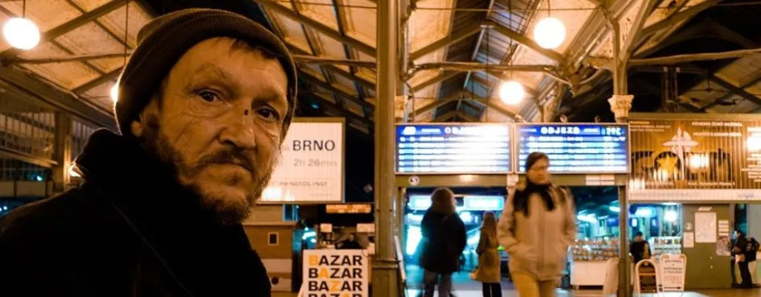

# Уровень 14: Игра с не-дизайнерами

Данный пост — перевод четырнадцатой статьи из [курса лекций «Принципы гейм-дизайна»](http://gamedesignconcepts.wordpress.com/) за авторством профессионала и преподавателя [Яна Шрайбера](http://www.gamasutra.com/view/authors/916452/Ian_Schreiber.php). Переводы предыдущих лекций вы можете посмотреть по [ссылке](index.md).

На конференции по гейм-дизайну 2006 года, разработчик игр и теоретик Джесс Шелл сказал, что самым важным навыком дизайнера является умение слушать:

— Слушайте ваших тестеров. Они не профессиональные дизайнеры и их предложения могут показаться бессмысленными. Но если они реагируют на вашу игру тем или иным образом – это уже ваша задача выяснить, почему.

— Слушайте свою игру. Очень часто игры начинают жить своей собственной жизнью, когда достигают определённой степени сложности; помните, что гораздо важнее сделать классную игру, а не такую, как вы _изначально задумали._

— Слушайте себя. Каждый раз, независимо от того, правильное решение вы приняли или нет, ваши инстинкты развиваются. (Именно поэтому, между прочим, гейм-дизайнер с двадцатилетним стажем всегда будет лучше, чем новичок только со школьной скамьи, и не важно какой «врождённый талант» есть у каждого из них. Тут нет коротких путей. Кстати, именно поэтому я заставляю вас делать столько игр этим летом – чтобы поднять ваш уровень как можно быстрее).

Сегодня мы займёмся первым пунктом: слушать плейтестеров. Когда вы дойдёте до определённого этапа в работе над вашей игрой, вам захочется протестировать её с другими людьми – желательно, из целевой группы, представителями тех, для кого игра и создаётся.

Тестирование с геймерами очень отличается от тестирования с гейм-дизайнерами. Если всё сделать правильно, то отзыв, полученный от игроков из вашей целевой аудитории будет ещё полезнее, чем отзыв полученный от гейм-дизайнеров, потому что вы непосредственно увидите реакцию людей, которые в конце концов будут играть в финальную версию вашей игры. Между тем, это совсем другой навык. Не-дизайнеры дадут вам информацию совсем иного рода, и чтобы найти корень проблемы, вам придётся приложить чуть больше усилий. Вам придётся быть гораздо наблюдательнее.

### Чтение

На сегодня никакого чтения. Как и в прошлый раз, если вам попадался материал, подходящий нам по теме, вы можете дать ссылку на него в комментариях к этому блогу или в Твиттере с тэгом #GDCU.

### Уличные артисты

Вы когда-нибудь видели уличных артистов? Музыкантов, иллюзионистов, жонглёров, мимов или других, которые выступают перед прохожими? Заработок этих людей зависит от пожертвований зрителей, у них нет другого жалованья, кроме того, что им решат оставить все эти незнакомцы. Именно поэтому они обычно очень хорошо умеют ублажать публику – ведь если не сумеют, останутся без ужина.

Во время представления внимание зрителей, конечно, приковано к исполнителю.  Но на что обращает внимание он сам? В следующий раз, когда вы увидите такого артиста, не смотрите представление, смотрите на него самого. В отличие от окружающей толпы он не сосредоточен на себе или на том, что делает (в конце концов, артист знает свой номер вдоль и поперёк). Вместо этого, он следит за _публикой._ Он ищет признаки заинтересованности и одобрения. В зависимости от того, положительно или отрицательно реагируют зрители, исполнитель подстраивается и меняет представление прямо на ходу. Может, конкретно этим зрителям больше по душе фокусы с монетами, а не с картами, или им больше нравится блюз, а не джаз, или им по вкусу, когда жонглёр подбрасывает булавы, а не шары. Самое важное умение исполнителя – способность читать публику.

Заметьте, они никогда не прерывают представление, чтобы спросить, нравится ли оно людям. Они и так видят. Им не нужно спрашивать.

### Какое отношение это имеет к гейм-дизайну?

Когда вы проводите тестирование с не-дизайнерами, ваша роль похожа на роль уличного артиста. Не спрашивайте своих тестеров, интересна ли ваша игра, возможно, они не смогут вам ответить, а если и смогут, их ответ не обязательно будет точным и верным. Вместо этого, _наблюдайте_ за своими тестерами и делайте заметки:

— Как они сидят? Наклоняются ли вперёд, с интересом? Или откинулись назад, скучающе? Может, они повставали с мест от волнения?

— Куда смотрят их глаза? Прикованы к игровому полю? Переглядываются друг с другом? Смотрят на вас? Или блуждают по комнате, или узоры на потолке рассматривают?

— Какие ходы они предпринимают? Наступают или защищаются? Кооперируются и ведут переговоры или строят друг другукозни?

— Они играют согласно правилам или «неправильно», нарушая запреты и забывая про ограничения? Запинаются ли они время от времени, подглядывают ли в правила, переспрашивают ли вас? Или игра идёт плавно, без перебоев?

— Как ваши наблюдения соотносятся с целями дизайна?Достигает ли игра этих целей или не справляется с ними?

Обратите внимание, что все эти вещи могут меняться в ходе одной и той же игровой сессии. Вы можете обнаружить, что отдельные этапы игры увлекают игроков больше, чем другие. Вашей целью является наблюдать за этими изменениями.

### Подготовка к тестированию с не-дизайнерами

Люди, которые не являются вашими товарищами по дизайну иногда (хоть и не всегда) склонны быть более щепетильными в отношении «сырых» прототипов. Обычный геймер, которому дадут колоду вручную нарисованных карт и скажут двигать монетки по полю, расчерченному на альбомном листе, может так сосредоточиться на низком качестве этих компонентов, что будет не в состоянии думать о механике. Вы услышите множество комментариев по поводу отсутствия картинок и оформления игрового поля, а это пустая трата вашего времени, в конце концов, на этой стадии вам нужна информация об игровом процессе, а не о художественном оформлении. У нас о внешнем виде игры пока даже разговор не заходил!

Если вам повезло, и к вам выстроились в очередь тестеры, готовые иметь дело с черновым прототипом, возможно, вам не придётся ничего делать. Для всех же остальных стоит, потратив немного дополнительного времени, создать компоненты, которые, если и не наивысшего качества, то, по крайней мере, могут его сымитировать.

С черновым прототипом вам, понятное дело, не стоит долго возиться, переделывая компоненты так и этак. Чем больше времени вы на него тратите, тем труднее вам будет (по крайней мере, эмоционально), вносить значительные изменения.

Как же сделать прототип, который выглядит лучше, чем что-то нарисованное от руки, но не отнимет слишком много времени. Вот несколько подсказок:

— [Google-поиск](https://images.google.com/?gws_rd=ssl) вам в помощь. Если вам нужны изображения для карт или игрового поля, просто введите в поиск по картинкам соответствующие ключевые слова. Скопируйте и вставьте. Это займёт пару минут. Свободно эксплуатируйте чужие изображения.

— Для простейших компонентов, таких как фишки и пешки, возьмите детали от уже выпушенных игр, которые у вас есть (если вы ещё не обзавелись специально заготовленным комплектом). Это придаст игре чуть более завершённый вид, чем крышечки от бутылок, монетки илоскуты.

— Вполне приличные карты можно без труда создать в специальной программе вроде PowerPoint или Visio. Размер стандартной карты 6,35 х 8,9 см. На стандартном листе бумаги может поместиться восемь карт 4 х 2 в альбомной ориентации или девять карт 3 х 3 в книжной ориентации. Распечатайте на стандартной бумаге и просто разрежьте ножницами.

— Чтобы вам было проще тасовать и держать карты, используйте пластиковые конверты для карт (которые продаются в магазинах игр и хобби для защиты коллекционных карт вроде _Magic: the Gathering_). Вставьте в конверты любые стандартные карты (хоть _Magic: the Gathering_, хоть обычные игральные), а распечатанную на листе бумаги вставьте спереди.

— Что касается игрового поля, пока будет достаточно, если вы распечатаете его на одном или нескольких листах бумаги. Вы можете создать макет в PowerPoint или даже в чем-то незатейливом, вроде MSPaint, используя стандартные фигуры, чтобы создать клетки, вставку текста для надписей и номеров, вставку рисунков из других источников, где это нужно.

— Возможно, вы найдёте другие инструменты. Делитесь секретами в комментариях!

### Проведение тестирования с не-дизайнерами

Раз вам придётся провести много времени, делая записи и наблюдая, вам будет проще, если сами вы _играть_ не будете_._ Вам удастся побыть игроком во время тестирования с другими дизайнерами, а во время тестирования в одиночку – вы вообще один за всех игроков, но при тестировании, о котором мы говорим сегодня, вам стоит воздержаться от игры и сконцентрировать внимание на том, как тестеры взаимодействуют с игрой и друг с другом.

Если вы этого ещё не сделали, составьте оформленный список правил. Вручите правила и компоненты своим тестерам, отойдите и не мешайте им. Дайте им понять, что вы здесь всего лишь наблюдатель, _не_ игрок и _не_ подсказчик. Скажите им, чтобы не обращали на вас внимания и играли так, как будто вас нет в комнате.

Наверняка ваши тестеры будут об этом забывать. Они наткнутся на неясное место в правилах и попросят вас объяснить. **Не отвечайте сразу же.** Сначала ответьте вопросом на вопрос: «Если бы меня не было здесь и вам нужно было самим додуматься, как бы вы решили?» Их ответ может быть правильным… или неправильным, но поучительным. В любом случае, он даст вам представление о том, как вашу игру воспримут игроки. После того, как игроки вам ответят, _только тогда_ вы можете ответить им. Но не упускайте возможность получать ценную информацию из таких эпизодов.

Иногда ваши тестеры не будут вас спрашивать, а просто начнут играть «не так». Может, каждому игроку полагается вытягивать по две карты на своём ходу, а они будут брать по одной. Или будут пропускать первый шаг, который каждый должен делать на своём ходу. Или забудут о действии какого-то компонента, введённого в игру, и не станут его учитывать. **Подавите в себе желание помешать им.** Вам это покажется мучительным. Немного есть вещей, на которые смотреть так же больно, как на игроков, играющих в вашу игру _не так, как вы её задумали._ А между тем, именно так, скорее всего, люди бы в неё и играли, выпусти вы игру в её нынешнем виде. А это очень важно увидеть, чтобы вы могли прояснить правила и компоненты на будущее.

Если позволить людям играть «неправильно», можно извлечь из этого и другую пользу. Иногда вы совершенно случайно будете обнаруживать, что так, как играют тестеры, на самом деле, _лучше,_ чем в правилах. У многих людей, не обязательно дизайнеров, очень развито чувство игры. Иногда люди нарушают правила, потому что где-то на интуитивном уровне чувствуют, что так игра будет для них интереснее.

### Как найти тестеров, не являющийся дизайнерами

Хорошая новость: найти тестеров, которые не являются дизайнерами, гораздо проще, чем найти других гейм-дизайнеров. Доля первых среди населения планеты гораздо выше, чем вторых.

Вот здесь-то вам и пригодятся друзья, семья, коллеги. Обычно их гораздо проще попросить об одолжении. Для многих из нас они всегда рядом и готовы помочь. Если вдруг вы никого не знаете (например, недавно переехали), считайте это дополнительным стимулом для того, чтобы выбраться из дому и найти новых знакомых – это если вам недостаточно мотивации.

Помните о том, что люди, которые знают вас близко, с гораздо меньшей вероятностью дадут вам резко негативную оценку. Они могут вам сказать, что это лучшая игра на свете, даже если это и не так, потому что на кону личные отношения, а это для них важнее, чем результат игрового проекта. Другими словами, ожидайте, что они будут вам нагло и бессовестно врать. Тут-то вам и придётся внимательно наблюдать; именно вам нужно будет вычислить, какие части игры им _действительно_ были интересны.

### Домашняя забава

Вашей домашней забавой в прошедший понедельник было устроить тестирование игры с другими дизайнерами. Возможно, вам уже удалось его провести, возможно, вы только запланировали игровую сессию на выходные, но помните, что она должна завершиться до следующего понедельника, 17 августа, полдень по Гринвичу.

Кроме того, на выходных вы должны **устроить так, чтобы тестирование игры с не-дизайнерами, прошло _после_ теста с дизайнерами.** Эта сессия может проходить в любое время до следующего четверга (20 августа) включительно, но _назначить_ её проведение (то есть, запланировать и договориться с конкретными людьми) необходимо до следующего понедельника (17 августа) включительно.

Если время будет позволять, вы можете проводить дополнительные тесты, как с дизайнерами, так и с не-дизайнерами.

### Обратная связь

Знаете ли вы какие-нибудь классные статьи о проведении тестирования? Есть ли у вас любимые инструменты и программы, чтобы быстро и легко создавать качественные компоненты? Публикуйте в комментариях к этому блогу или в Твиттере с тэгом #GDCU.

_Перевод — Ю. Сергеева._