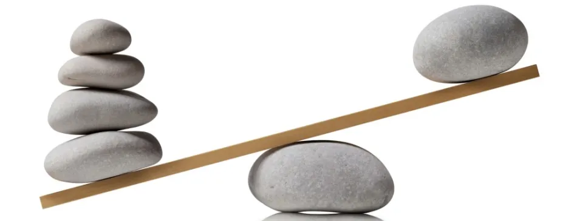

# Уровень 16: Баланс игры

Данный пост — перевод шестнадцатой статьи из [курса лекций «Принципы гейм-дизайна»](http://gamedesignconcepts.wordpress.com/) за авторством профессионала и преподавателя [Яна Шрайбера](http://www.gamasutra.com/view/authors/916452/Ian_Schreiber.php). Переводы предыдущих лекций вы можете посмотреть по [ссылке](index.md).

Когда матёрые геймеры или гейм-дизайнеры играют в игру, и у кого-то получается слишком хорошо или слишком плохо, от них часто можно услышать комментарии в адрес **баланса** игры. Это очень важное слово, но часто я слышу, как его употребляют неправильно. Как и у слова «интерес», у «баланса» есть много разных значений, и сегодня мы с вами разберёмся, что же такое баланс игры, и почему он важен.

Почему мы говорим об этом сейчас, а не раньше (ну, хотя бы _в начале_ обсуждения ваших проектов)? Как я уже упоминал ранее, приведение в порядок баланса – это вещь, которую лучше оставить на потом, когда у вас _уже готовы_ все основные механики. Уравновешивать игру, которая ещё не отвечает целям дизайна – пустая трата времени, ведь, когда вы меняете одну из базовых механик, баланс тоже приходится пересматривать. Таким образом, у нас на руках есть рабочий проект, который прошёл горнило многократного тестирования, и пришло время поднять его на новый уровень.

### Об интенсивности этого курса

На данном этапе из комментариев и некоторых публикаций на форумах я понял, что многие из вас начали отставать. Напоминаю, что темп этого курса довольно резвый, я понимаю, что далеко не у всех участников есть время, которое можно отдать занятиям безраздельно. С другой стороны, тестирование может идти как быстро, так и медленно; для ваших любительских проектов время не критично, поэтому просто продолжайте работать, как работается, в своём темпе.

Если вы всё ещё укладываетесь в график – отлично. Если же вы находите, что организация тестирования и внесение изменений в игру отнимает слишком много времени, я предлагаю вам справиться со всеми этими заданиями, как только у вас появится такая возможность, и продолжать прохождение этого курса с небольшим опозданием. Я не собираюсь ничего убирать из сети в ближайшее время, так что материалы будут доступны для вас. Оставшееся время курс будет сосредоточен на вашем проекте, поэтому я не буду задавать вам ничего на дом, чтобы вы не отвлекались.

Однако, если время будет вам позволять, я бы рекомендовал вам следить за публикациями в этом блоге. Так вы будете иметь представление о том, что вас ждёт впереди в работе над проектом, а кроме того, вы будете видеть мои объявления, которые я здесь даю.

### Чтение

На сегодня никакого дополнительного чтения. В этом посте будет множество материала.

### Что такое баланс игры?

В игре на двух игроков, мы говорим о «сбалансированности» когда у одного игрока нет несправедливого преимущества над другим. Но иногда это слово применяется и к однопользовательским играм, где нет противника, кроме самой игры, и любое «преимущество», которое есть у игры перед игроком, может рассматриваться как дополнительный уровень сложности. Кроме того, об отдельных картах в таких играх как _Magic: the Gathering_ мы можем говорить, что они сбалансированы, даже несмотря на то, что к этой карте имеют доступ все игроки, так что она никак не может дать индивидуального преимущества. Так в чём же дело?

Исходя из моего опыта, когда мы говорим «игровой баланс», мы имеем в виду одну из четырёх возможных вещей. Обычно из контекста понятно, о чём именно идёт речь:

1.  В однопользовательских играх, мы используем слово «баланс» для описания соответствия уровня сложности ожиданиям аудитории.
2.  В многопользовательских играх с **асимметрией** (то есть таких, где игроки стартуют с разных позиций и с разными ресурсами), мы используем слово «баланс», чтобы описать проще ли выиграть, начиная с какой-то конкретной стартовой позиции.
3.  Внутри самой игры, если есть множество стратегий и путей к победе, мы используем слово «баланс», чтобы описать, является ли какая-то одна стратегия более выигрышной, чем другая.
4.  Внутри игровой системы с несколькими похожими объектами (картами в коллекционной карточной игре, оружием в ролевых играх и так далее) мы используем слово «баланс» для описания самих объектов, особенно в отношении того, насколько у разных объектов выдержано одинаковое соотношение стоимости и получаемых преимуществ.

Давайте рассмотрим каждый вид подробнее, а потом перейдём к практическому подходу балансировки игры.

### Баланс в однопользовательских играх

В однопользовательских играх, мы используем слово «баланс» для описания соответствия уровня сложности ожиданиям аудитории.

Помните, что играя в вашу игру и набираясь опыта, аудитория в конце концов начинает играть всё искуснее. Это одна из причин, по которым последующие уровни видеоигр обычно труднее, чем начальные. (Не забывайте и то, что нарастающая трудность игрового процесса отражает драматическое напряжение повествования). Изменение сложности за единицу времени в отдельно взятой игре имеет название –«**продвижение**».

Здесь есть одна очевидная трудность для нас, гейм-дизайнеров: откуда нам знать, какой уровень является «адекватным»? Конечно, мы понимаем, что логическая игра/головоломка для взрослых будет сложнее, чем такая же игра для маленьких детей, но более конкретно… как нам определить, что слишком просто, а что слишком сложно? Очевидный ответ: тестировать!

Однако есть и другая проблема: не все игроки одинаковы. Даже в рамках одной узкой целевой аудитории, игроки распределяются по колоколообразной гауссиане, где некоторые будут обладать высоким уровнем навыка, а некоторые – наоборот. Когда вы тестируете игру, откуда вам знать, где на гауссовой кривой располагаются ваши тестеры? Если вы только начинаете, идеальным выходом будет тестировать снова и снова с разными тестерами. Когда десятки, а то и сотни людей дадут отзыв на вашу игру, у вас будет очень неплохое представление о том, каков общий разброс. По мере накопления дизайнерского опыта, вы научитесь лучше чувствовать свою аудиторию, и вам будет требоваться всё меньше и меньше тестеров, чтобы получить всё те же высокие результаты. (Если вы только начинаете, но у вас нет ни времени, ни ресурсов на то, чтобы проводить много-много тестов, иногда вы можете сымитировать результаты, если у вас есть представление о том, где примерно на гауссиане находятся ваши конкретные тестеры. Считают ли они свой уровень мастерства выше среднего или ниже среднего по сравнению с игроками, для которых вы разрабатываете игру?)

Даже если у вас есть чёткое представление о том, как менять уровень сложности и где находится ваша целевая аудитория на графике, что вы примете за базовый уровень, если аудитория разнообразна? Как бы вы ни старались, игра будет слишком сложной для одних и слишком простой для других, так что вы оказываетесь в безвыходной ситуации. Если вам нужно выбрать один-единственный уровень сложности, проверенный способ – ориентироваться на середину кривой, таким образом вы охватите большинство игроков, самую широкую возможную аудиторию. Ещё можно попытаться угодить игрокам на разных концах кривой, введя дополнительные уровни сложности, форы или альтернативные правила, которые упрощают или усложняют игровой процесс.

### Баланс в асимметричных играх

В многопользовательских играх с **асимметрией** (то есть таких, где игроки стартуют с разных позиций и с разными ресурсами), мы используем слово «баланс», чтобы описать проще ли выиграть, начиная с какой-то конкретной стартовой позиции.

По-настоящему асимметричные игры очень редки. Мы думаем о классических играх вроде Шахмат или Го как об асимметричных, раз оба игрока начитают с одним набором фигур и с одними и теми же правилами, но с одним отличием: один из игроков ходит первым! Если мы немного изменим Шахматы так, чтобы каждый из игроков тайно писал свой ход на бумаге, а затем ходы производились одновременно, игра становится полностью симметричной (и играется уже совсем иначе).

И тут возникает интересный вопрос: если ваша игра симметрична, нужно ли вообще переживать из-за баланса? В конце концов, оба игрока начинают с идентичного набора ресурсов, одной стартовой позиции и так далее, так что ни один из них по определению не может иметь несправедливого преимущества. Это правда, но дизайнер всё равно должен подумать о других видах баланса, особенно о том, есть ли в игре доминирующая стратегия. Просто уровняв всех игроков вы не отвертитесь.

Даже если ваша игра асимметрична, зачем её нужно балансировать? Самый простой ответ: потому что таковы ожидания игроков – игра, по их мнению, не должна давать автоматического преимущества или ставить кого-то в невыгодное положение при прочих равных условиях. (Но и с этим можно поиграть. Карточная игра _The Great_ Dalmutti, например, преднамеренно ставит игроков в неравные условия, показывая таким образом, что жизнь несправедлива; но это часть игры, и правила и механика настраивают игроков и ведут к этому пониманию. Однако если ваша игра не нарушает правил с какой-то определённой целью, лучше вам постараться над балансом и уравновесить игру как можно лучше).

Асимметричные игры, само собой, трудней сбалансировать. Чем больше асимметрии, тем внимательнее и пристальнее необходимо тестировать игру. Один из простейших способов сбалансировать такую игру – установить постоянные соотношения между ресурсами одного игрока и ресурсами другого игрока. Если в игровом процессе Яблоко всегда будет стоить два Апельсина, тогда игрок, который начинает игру с одним Яблоком, должен уравновешиваться игроком, начинающим игру с двумя Апельсинами.

Иногда игроки настолько разные, что прямые сравнения невозможны. Некоторые игры не только дают игрокам разные стартовые позиции, но и разные правила игры. У кого-то из игроков может быть эксклюзивный доступ к определённым ресурсам или способностям. Один из распространённых видов асимметрии в играх – давать игрокам разные, конфликтующие задачи (например, цель одной команды – выжить на протяжении нескольких раундов, а цель другой команды –выбить её из игры прежде, чем закончатся эти раунды). Чем труднее напрямую сравнить положение игроков, тем больше вы должны тестировать игру, чтобы компенсировать эту сложность.

### Баланс стратегий в игре

Внутри самой игры, если есть множество стратегий и путей к победе, мы используем слово «баланс», чтобы описать, является ли какая-то одна стратегия более выигрышной, чем другая.

Вы можете удивиться: зачем вообще на это обращать внимание? Если игра позволяет использование различных стратегий, и одна из них лучше остальных, разве следование одной и той же стратегии не уравнивает игроков, стремящихся к победе? Раз никто из конкретных игроков не имеет несправедливого преимущества, разве не может наша играть предоставить победу любому, кто первым додумается до победной стратегии?

Проблема здесь в том, что как только будет найдена доминирующая стратегия, догадливые игроки станут игнорировать все второстепенные. Всё остальное в игре, не являющееся частью победной стратегии, станет посторонним шумом. В том, чтобы была лишь одна победная стратегия, нет ничего в корне неправильного, но тогда надо исключить остальные, неоптимальные стратегии и упростить игру. Если вы оставляете игрокам эти неоптимальные варианты, вы даёте им ложные решения, тогда как правильным является лишь одно (следовать доминирующей стратегии).

Если же вам нужно включить несколько потенциальных выигрышных стратегий, тогда, конечно, интересней, когда они хорошо сбалансированы. И опять же, здесь главное – тестировать и ещё раз тестировать. В этом случае, наблюдая за игроками, отмечайте, выбирают ли они какие-то определённые стратегии чаще, чем остальные, и какие из них оказываются выигрышными. Если в игре можно приобрести несколько предметов на выбор, есть ли такой, который всегда покупают раньше других или такой, который покупают реже, если вообще покупают? Если игроки могут выбрать, что сделать на своём ходу, предпочитает ли победитель каждой из игровых сессий какое-то определённое действие чаще, чем остальныеигроки?

Сам по себе тест не докажет автоматически, что какая-то определённая стратегия не сбалансирована, но он может дать чёткие сигналы, что к игре стоит присмотреться повнимательней. Иногда игроки используют какую-то стратегию не потому, что она оптимальна, а потому, что она самая очевидная или самая простая. Некоторые игроки избегают всего, что кажется им слишком сложным и мудрёным, даже если оно приводит в итоге к лучшим результатам.

### Баланс между объектами в игре

Внутри игровой системы с несколькими похожими объектами (картами в коллекционной карточной игре, оружием в ролевых играх и так далее) мы используем слово «баланс» для описания самих объектов, особенно в отношении того, насколько у разных объектов выдержано одинаковое соотношение стоимости и получаемых преимуществ.

Такой вид баланса характерен для игр, которые дают игрокам на выбор разные игровые объекты. Вот несколько примеров:

— Карты в коллекционных играх. Игроки формируют колоду определённого размера, выбирая карты из своей коллекции. Какие именно карты выбрать – ответ на этот вопрос может стать решающим для исхода игры, поэтому дизайнеры стараются сбалансировать карты между собой.

— Юниты в военных играх и стратегиях реального времени. Игроки могут покупать юниты в ходе игры, а разные виды юнитов обладают разными способностями, скоростью передвижения и боевыми характеристиками. Дизайнер должен стремиться к балансу между юнитами.

— Оружие, предметы, магические заклинания и тому подобное в ролевых играх, как настольных, так и компьютерных. Игроки могут покупать и использовать всё это в битве, у всего разная стоимость, характеристики и способности. Дизайнер должен сбалансировать эти предметы между собой.

Во всех этих случаях целей две. Первая – избежать ситуации, когда предмет настолько слаб, что он бесполезен в сравнении с другими. Ведь тогда он становится для игроков ложным выбором: они могут выиграть или купить этот предмет, но очень быстро поймут, что его не стоит использовать; такой предмет – пустая трата времени, и дизайнера, и игрока.

Вторая цель – избежать того, чтобы предмет был слишком сильным. Любой объект, становясь доминантной стратегией, делает все остальные объекты в игре бесполезными в сравнении с собой. В общем, если перед вами стоит выбор: сделать объект слишком слабым или слишком сильным, меньшее из зол – сделать его слишком слабым.

Два объекта сбалансированы между собой если у них одинаковое **соотношение стоимости/ценности.** То есть то, чем вы платите за доступ к объекту (буквальные траты: игровая валюта, ресурсы, а также различные упущенные возможности, недостатки, ограничения, накладываемые на свойства предмета и т. д.) должны быть более или менее пропорциональны игровым выгодам, которые вы получите от этого объекта. Стоимость и получаемые преимущества не должны быть абсолютно идентичными (на самом деле, преимуществ обычно больше, иначе игроки просто игнорировали бы этот объект). Тем не менее, когда вы сравниваете два разных объекта, соотношение цены и преимущества должно быть примерно одинаковым.

### Три способа уравновесить объекты в игре: транзитивный, интранзитивный и фруктовый

Я встречал три основных метода уравновешивания игровых объектов. Первый технически называется **транзитивное соотношение.** В более неформальном (но всё равно узком) кругу его называют **кривая стоимости.** Это самый прямой и непосредственный способ баланса. Основной смысл – найти некое желаемое соотношение стоимости и преимуществ. Это может быть линейная пропорция (нечто в два раза более сильное должно стоить в два раза больше), или же график может быть непрямой (например, закон сокращающихся доходов, где каждое новое преимущество обходится вам всё дороже; или наоборот, возрастающих доходов, где вы, по сути, получаете «оптовую скидку» за то, что платите сразу много). Всё зависит от конкретной игры, но тестирование, эксперименты и чутьё помогут вам выяснить, какое именно соотношение нужно в каждом отдельном случае.

Следующим шагом будет сведение всех преимуществ и стоимостей к одной цифре, которую можно сравнивать с другими. Возьмите все стоимости разных свойств объекта и сложите их вместе; так же сложите все преимущества. Сравните получившиеся цифры и выясните, даёт ли объект нужное количество преимущества по отношению к стоимости.

Такой метод часто используют в коллекционных карточных играх. Если у игры есть чётко установленная кривая стоимости, создавать новые карты, сочетая существующие эффекты, делается гораздо проще. В Magic: The Gathering, если вы хотите создать новое существо с заданным цветом, силой, сопротивляемостью и набором стандартных способностей (скажем, Белый, 4/3, Летающий с Правом первого удара), это уже даёт нам несколько стоимостей, а дизайнеры, работающие над этой игрой (и достаточно опытные игроки) могут сказать вам точно, какова каждая из этих стоимостей. Добавляя больше способностей, вы увеличиваете стоимость карты, а снижение стоимости неизбежно влечёт за собой потерю характеристик или способностей.

Второй метод – **интранзитивное соотношение** между игровыми объектами, широко известное как **камень-ножницы-бумага.** В этом случае, может не быть прямого соотношения между стоимостью и преимуществами, но есть соотношение между игровыми объектами: определённые объекты по умолчанию сильнее одних, но при этом слабее других. Игра Камень-Ножницы-Бумага – каноничный пример. Ни один из трёх вариантов не является доминирующим, потому что он будет давать ничью с самим собой, выигрывать у одного из оставшихся вариантов и проигрывать другому. Во множестве стратегий в реальном времени такого рода соотношение существует между юнитами. Например, очень часто пехота сильна против лучников, лучники сильны против летающих юнитов, а летающие юниты сильны против пехоты. Частью игры является умение распоряжаться своими юнитами и правильно разместить их (в реальном времени) относительно юнитов противника.

Обратите внимание, что транзитивное и интранзитивное соотношения можно комбинировать, как в приведённом выше примере. В типичной стратегии реального времени у юнитов различная стоимость, поэтому слабый (и дешёвый) лучник всё же может быть побеждён сильным (и дорогим) летающим юнитом. Внутри одного класса юнитов могут быть транзитивные отношения, но разные классы соотносятся между собой интранзитивно.

Интранзитивные отношения решаются с использованием матриц и простой линейной алгебры. Например, ключом к партии в Камень-ножницы-бумагу является соотношение 1:1:1, то есть ожидаемое количество выбросов каждого элемента будет равным. А теперь давайте представим, что мы немного изменили игру и каждый выигрыш «камня» даёт 3 очка, выигрыш «бумаги» даёт два очка, а выигрыш «ножниц» даёт 1 очко. Каким тогда будет соотношение? Оказывается, соотношение будет вовсе не таким, как вы могли бы подумать: при оптимальной игре обоих противников вы увидите 1 «камень» на каждые 3 «бумаги» и 2 «ножниц». Какие при этом использовались расчёты здесь, пожалуй, излагать не буду. Если вам нужно, чтобы игроки использовали объекты в определённом соотношении (чтобы одни использовались чаще других), хорошо сбалансированное интранзитивное соотношение – неплохой способ это обеспечить.

Третий метод уравновесить игровые объекты – сделать их такими разными и непохожими друг на друга, что прямое сравнение просто невозможно. Я называю такой способ фруктовым, потому что дизайнеру, а впоследствии – игрокам, остаётся, как в пословице, сравнивать яблоки с апельсинами. Раз формальное, числовое сравнение между объектами невозможно, единственный способ сбалансировать их – тестировать и ещё раз тестировать.

С каждым из этих методов связаны свои трудности. Для транзитивных отношений всё зависит от умения дизайнера найти правильную кривую стоимости. Если ваши расчёты неверны, они будут одинаково неверны для каждого из игровых объектов, так что если вы найдёте один несбалансированный объект, скорее всего, вам придётся менять всё. Транзитивные соотношения гораздо проще создавать ретроспективно, уже после тестирования, чем разрабатывать их заранее. Так как тут тоже очень много зависит от правильных расчётов, этот способ требует многократных проб и ошибок, а значит – много времени.

Интранзитивные отношения, как я уже упоминал, требуют хитрых математических расчётов. Другой недостаток в том, что если не рассчитать всего очень тщательно, такие объекты сделают игру похожей на пресловутые Камень-ножницы-бумагу, что многим отобьёт охоту играть – ведь у большинства интранзитивные отношения связаны с игрой в угадайку, где решения основываются не на стратегии, но на удаче и случайности. Развёрнутую дискуссию по поводу того, насколько это мнение справедливо тоже приводить пока не буду.

«Фруктовые» отношения тоже трудно привести к балансу, так как один из ключевых инструментов – математику – здесь нельзя использовать.

### Три основных метода баланса в игре

В целом, существует три способа привести игру к балансу:

— Используйте вычисления. Создайте транзитивные и интранзитивные отношения в своей игре и убедитесь, что всё соответствует стоимости.

— Используйте своё чутьё гейм-дизайнера. Меняйте баланс в игре до тех пор, пока не почувствуете, что всё на своих местах.

— Используйте тестирование. Корректируйте игру, исходя из результатов испытаний, где тестерами являются опытные геймеры, получившие задание использовать лазейки в правилах и выиграть во что бы то ни стало.

Трудности есть в каждом из этих трёх способов:

— Вычисления сложны и могут оказаться неправильными. Если у вас неправильные формулы, всё в игре будет чуть-чуть не на месте, а это неудобно, особенно для быстрых прототипов. Некоторые уникальные игровые способности или объекты могут быть настолько особенными, что они просто не поддаются вычислению, а значит, к ним надо применять другие способы уравновешивания.

— Чутьё подвержено человеческому фактору и может быть ошибочным. Кроме того, оно не универсально – разные дизайнеры могут расходиться во взглядах на то, что будет лучше для игры. Особый риск существует при работе в больших командах, где один дизайнер уходит посреди проекта, а другой не может принять бразды (точнее, может, но у него не получится завершить игру так, как это задумал первый).

— Тестирование опирается на уровень ваших тестеров. Тестеры могут и не найти всех проблем в вашей игре; какие-то проблемы останутся необнаруженными целые месяцы и даже годы (даже после официального выпуска игры). Что ещё хуже: некоторые тестеры могут преднамеренно не рассказывать о найденных в правилах лазейках, потому что планируют использовать их после выхода игры!

Что же делать дизайнеру? Делайте всё от вас зависящее и не забывайте о сильных и слабых сторонах метода, который используете. А в качестве игрока, когда в следующий раз столкнётесь с игрой, которая кажется вам ужасно несбалансированной, не забывайте, как трудно довести игру до совершенства.

### Некоторые другие методы балансировки игры

Приведу здесь в произвольном порядке ещё несколько советов.

**Знайте все объекты и системы своей игры и то, как они взаимодействуют.** Само собой, вы должны были изучить их ещё на стадии первоначальной разработки, но когда сосредоточиваешь внимание на деталях, целая картина иногда ускользает. Есть две конкретные вещи, к которым следует возвращаться в первую очередь каждый раз, когда вы вносите в игру изменения:

1.  Какова основная эстетика вашей игры? Работает ли на неё вводимое новшество?
2.  Обратите внимание на взаимосвязи между системами. Если меняете что-то одно, вы должны знать, что ещё при этом изменится. Отдельные элементы игры почти никогда не существуют в изоляции, и изменения в чём-то одном обычно отражаются на всей игре в целом. Зная об отношениях между системами и объектами в игре, вы легче сможете предсказать косвенные изменения в механике.

**Меняйте что-то одно за раз.** Мы уже об этом говорили, но повторить не помешает. Если что-то пойдёт не так после одного внесённого изменения, вы точно будете знать из-за чего именно это произошло. Если что-то пойдёт не так после десяти внесённых изменений, вы не сможете разобраться какое из изменений (или их сочетание) стали тому причиной.

**Полюбите Excel.** Это может быть любая программа для работы с динамическими таблицами, но Microsoft Excel– самая популярная среди гейм-дизайнеров. Очень часто студенты смотрят на меня как на психа, когда я говорю, что динамические таблицы могут быть полезны в гейм-дизайне. (В смысле: эти штуки – они же только для всяких там финансистов?) Вот несколько примеров того, как можно использовать динамические таблицы:

— При помощи Excel можно вести учёт и организацию. Учёт всех игровых объектов и их характеристик. В ролевых играх – учёт всего оружия, предметов и монстров. В настольных военных играх – учёт всех юнитов и их характеристик. Всё, что вы видите в справочных картах, инструкциях или руководствах по стратегии, наверняка начинало свою жизнь в Excel’евской таблице дизайнера.

— Excel очень помогает следить за всеми заданиями и ходом их выполнения, что особенно пригождается при работе над сложными играми, в которых множество систем и компонентов. Если у вас таблица с парой сотен монстров и их характеристиками, к ним можно ещё добавить отметки о том, готово ли изображение монстра, и тестировались/балансировались ли его характеристики.

— Динамические таблицы хороши для сбора статистики вашей игры и всяческих манипуляций с ней. В спортивной игре, где у каждого из игроков есть список характеристик, все ли команды сбалансированы между собой? Сложите все характеристики членов команды (или найдете их среднее значение) – и у вас будет некоторое представление о сильных и слабых сторонах каждой из команд. В игре с транзитивными отношениями, сбалансирован ли каждый из игровых объектов? Добавьте в таблицу стоимость и преимущества.

— Вы можете использовать динамические таблицы, чтобы проводить статистические расчёты. Генерируя случайные числа (в Excel используйте функцию RAND() и нажимайте F9 чтобы обновлять значение), вы можете имитировать многократные броски игральной кости для таких параметров как урон в зоне поражения, чтобы увидеть разброс значений. (Если вдруг вам интересно, в статистике это называется монте-карловским методом симуляции).

— Динамические таблицы помогают вам увидеть причины и следствия изменений в игре. Создавая формулы, основанные на конкретных значениях, которые вы, возможно, захотите поменять, вы имеете возможность изменить одно из значений и увидеть, что произойдёт с другими значениями, которые зависят от первого. Например, вы работаете над MMORPG: вы можете использовать Excel для того, чтобы рассчитать урон в секунду для оружия, а затем тут же посмотреть, как он изменится, если вы поменяете базовый урон, точность и скорость атаки.

**Используйте правило двойки.** Допустим, у вас в игре есть число, которое определённо слишком большое, но вы не знаете, насколько оно больше, чем нужно. Может быть, оно чуть больше, чем надо, может быть оно совсем из ряда вон. Как бы то ни было, уменьшите его вдвое. Точно так же, если у вас есть число, которое слишком мало́, независимо от того, насколько оно мало́, удвойте его. Если вы не уверены на 100%, каково правильное значение, удваивайте или делите надвое. Это и есть «правило двойки».

В теории, звучит нелепо. Если стоимость самоцвета всего на 10-20% ниже, чем надо, чего мы добьёмся таким радикальным способом, удвоив стоимость? На деле же, это работает по нескольким причинам. Во-первых, вы можете предполагать, что значение лишь немного отклоняется от нужного, но вы можете при этом ошибаться; если вы станете производить незначительные изменения, когда значение на самом деле нужно удвоить, вам придётся прогонять всё снова и снова много раз, чтобы всё стало на свои места.

В правиле двойки скрыта и более мощная сила. Гейм-дизайн – это процесс открытия. На самом деле, вы не знаете, каковы правильные числа, которые приведут игру в состояние идеального баланса; если бы вы знали, игра бы уже была сбалансирована! Если какое-либо число в вашей игре неправильное, вам нужно открыть правильно число, и вы пытаетесь найти его методом проб. При проведении крупных изменений вы много узнаете о значении этой величины в игре. Может, ему действительно требовалась лишь небольшая корректировка, но если вы его удвоите или уменьшите вдвое, вы многое узнаете о своей игре.

Иногда вы будете обнаруживать, что такие большие изменения в игре меняют динамику так, как вы совсем не ожидали, но (совершенно неожиданно) делают её лучше, чем вы задумывали.

**Баланс преимущества первого хода.** В играх с очерёдностью ходов обычно первых ход связан с некоторыми незначительными преимуществами (или невыгодами). Так бывает не всегда, но если бывает, есть несколько способов компенсировать эту разницу:

— Передавать право хода по кругу. Например, в игре на четверых, после завершения каждого раунда (где каждый успел походить), передайте право первого хода игроку слева. Так игрок, ходивший первым в этом раунде, будет ходить последним в следующем. Когда я был ребёнком, мы с друзьями передавали по кругу карандаш, отмечая игрока, который будет ходить первым, поэтому называли этот способ «Карандаш Власти».

— Давайте игрокам, поставленным в невыгодные условия, дополнительные ресурсы. Например, если цель игры – набрать как можно больше очков в конце, дайте каждому игроку разное количество очков так, чтобы у последнего было чуть больше (компенсируя невыгоды последнего хода).

— Сократите преимущества первых ходов. Допустим, в карточной игре игроки на своём ходу тянут из колоды по четыре карты. Вы можете сделать так, чтобы первый игрок доставал всего одну карту, а следующий – две, и так далее, пока не дойдёте до четырёх.

— Для коротких игр, вы можете сыграть серию, где каждый игрок по одному разу ходит первым. Это обычная практика в карточных играх, где вся игра состоит из нескольких раундов.

**Записывайте собственные правила, когда их находите.** При разработке игры у вас будут успехи и ошибки. Они многому вас научат (в особенности, ошибки). Когда вы находите «закон» гейм-дизайна или новый приём балансировки игры, записывайте его и периодически просматривайте свои заметки. Как ни прискорбно, очень немногие дизайнеры так делают. В результате, они не могут передать свой опыт другим дизайнерам, а иногда повторяют одни и те же ошибки снова и снова в разных играх, потому что сами забыли, чему научились.

### Значение баланса

Когда я был начинающим дизайнером, я был одержим игровым балансом. «Интересная игра – это сбалансированная игра, а сбалансированная игра всегда интересна» — это было моей мантрой. Я уверен, что многим старшим коллегам сильно досаждали мои разглагольствования о дисбалансе в наших играх и о том, почему его необходимо сейчас же исправить. Юношеский максимализм простителен.

И хотя я до сих пор считаю, что баланс важен и умение наладить его – ключевой навык любого дизайнера, сейчас я придерживаюсь умеренной линии. Я видел много игр, которые были интересными, несмотря на несбалансированность. Я встречал игры, которые интересны именно потому, что в них преднамеренно нарушен баланс. Я видел игры, которые имели поразительный успех на рынке, несмотря на то, что были совершенно несбалансированными. Следует, однако, заметить, что это особые, редкие случаи. Но пусть они служат вам напоминанием о том, что принципы и методы, о которых мы сегодня говорили, не должны выходить на первый план и заслонять конечные цели дизайна вашей игры. Эти методы должны быть вашими инструментами, не позволяйте им диктовать условия.

### Домашняя забава

Вашим заданием в прошедший понедельник была организация тестирования вслепую, которое должно быть проведено до четверга (27-го августа). Завершите это задание, если ещё не успели этого сделать.

Следующее ваше задание на **понедельник (24-е августа)** – критически проанализировать свою игру **с точки зрения игрового баланса.** Протестируйте игру (самостоятельно или с другими игроками) с целью обнаружения проблем, связанных с балансом – дайте другим задание искать оптимальные стратегии и использовать их. Играйте чтобы победить. Будьте коварными.

Исходя из результатов, подумайте, какие системы и игровые объекты нуждаются в модификации (иногда это называется **подстройкой**). Подумайте, какие способы подойдут для вашей игры лучше всего. Транзитивные или интранзитивные в ней отношения? Как лучше всего подстраивать баланс: при помощи тестирования, вычислений или вашего чутья? Может быть, это сочетание всех трёх способов?

Наконец, решите, какая из проблем с балансом – самая значительная из тех, что вы обнаружили на ранних стадиях тестирования.**Внесите как минимум одно изменение** и снова протестируйте (возможно, вы сделаете это в ходе той же игровой сессии). Удалось ли вам исправить проблему или, по крайней мере, уменьшить её масштабы? Теперь подумайте о том, какие ещё изменения можно сделать, и что вам следует искать в последующих тестах.

_Перевод — Ю. Сергеева._