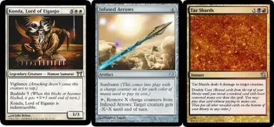
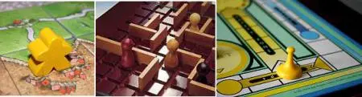

# Уровень 17: Пользовательский интерфейс

Данный пост — перевод семнадцатой статьи из [курса лекций «Принципы гейм-дизайна»](http://gamedesignconcepts.wordpress.com/) за авторством профессионала и преподавателя [Яна Шрайбера](http://www.gamasutra.com/view/authors/916452/Ian_Schreiber.php). Переводы предыдущих лекций вы можете посмотреть по [ссылке](index.md).

Если вы уже дошли до этого уровня, надеюсь, ваша игра получается, и вы благополучно движетесь к завершающей стадии разработки. Вы, наверняка, всё ещё боретесь с искушением повозиться с механикой, особенно учитывая то малое время, которое отведено на ваш проект, но сейчас я хочу, чтобы вы остановились на чём-нибудь, пусть не идеальном, но добротном, чтобы двигаться дальше.

Когда готова механика и игра в рабочем состоянии, сбалансирована и удовлетворяет целям дизайна, последнее, что осталось, – решить, как соорудить финальную версию. Этот вопрос не сводится к тому, чтобы нарисовать новые карты и игровое поле и отправить это всё на печать. Надо уделить внимание разработке пользовательского интерфейса вашей игры, и об этом мы сегодня будем с вами говорить.

### Чтение/Просмотр

Прочтите следующее:

— _Challenges for Game Designers, Глава 16 (Создание пользовательского интерфейса)_

_—_ [Cooperation and Engagement](http://www.youtube.com/watch?v=cdTVcFo2EQw), лекция гейм-дизайнера Мэтта Ликока из серии Google Tech Talks. Это видео связывает воедино многие понятия и принципы, которые обсуждались в этом курсе, от уровней сложности до потоковых состояний, от итерации до игрового повествования; она кристаллизует эти понятия, используя конкретный пример игры _Пандемия,_ одной из самых популярных игр прошлого года. Но я хочу, чтобы вы обратили особое внимание на то, как Мэтт рассказывает о своём процессе работы над дизайном самих компонентов игры, а именно, как он определяет форму, ориентацию и цвет карт. Этот фрагмент всего минут на тридцать, хотя есть ещё дополнительные двадцать минут ответов на вопросы аудитории в конце.

### Что такое «пользовательский интерфейс»?

Мы привыкли думать о пользовательском интерфейсе (UI) применительно к программному обеспечению и различным приложениям. Этот термин описывает те системы программ, которые напрямую взаимодействуют в человеком, включая такие вещи, как выбор, данный пользователю в любое время и то, как этот выбор представлен на экране компьютера и в физическом взаимодействии (мышь/клавиатура, джойстик и т.п.). В общем же, в видеоиграх интерфейс делится на две части: **ввод** (то есть то, как пользователь отдаёт команды игре) и **вывод** (как игра сообщает о результатах этих действий и других аспектах состояния игры пользователю).

А что если вы делаете нецифровую игру? Есть ли у неё пользовательский интерфейс? Конечно, есть, и сделать его правильно даже более важно, так как у игрока не будет компьютера, который будет автоматически навязывать правила игры. Если игрок не понимает правил нецифровой игры, часто единственный выход – бросить играть. Как гейм-дизайнер, последнее, чего вы хотите – чтобы ваша великолепная механика и тщательно разработанный игровой процесс пропали даром из-за проблем с интерфейсом.

В нецифровых играх в качестве пользовательского интерфейса выступают сами компоненты, так как именно через них вы и взаимодействуете с игрой (манипулируя ими), и получаете обратную связь (отслеживая состояние игры). Так что сегодня мы с вами поговорим о разработке заключительных компонентов.

### Дизайн пользовательского интерфейса

Что отличает хороший интерфейс от лучшего? Обычно внимание обращают на две вещи:

— Простота использования. Если вы уже знаете, что хотите сделать, как быстро и просто вы можете осуществить задуманное действие?

— Простота обучения. Если вы новичок в игре, как быстро вы разберётесь, какие действия допустимы и какая информация вам доступна?

На деле эти два пункта обычно связаны обратной зависимостью. Например, в компьютерах существуют особые «горячие клавиши» (комбинации с Shift/Alt/Ctrl/Cmd и подобные), которые экономят время и делают сохранение файлов и переключение между приложениями простыми и быстрыми. Но если это _единственный_ способ выполнить задание (как в случае старых программ, в которых не было меню), с этими приложениями очень трудно освоиться новичку.

В настольных играх тоже существует обратная зависимость между простотой и количеством доступной информации. Схемы, таблицы, ключевые слова, специальные символы и иконки – всё это очень помогает опытному игроку быстро получить общее представление о состоянии игры, но может запутать и смутить новичка, который не знает ничего об их значении. Напротив, если написать всё подробно, словами, новичку будет проще понять, что к чему… Но это замедляет игру для тех, кто уже выучил правила и не нуждается в постоянных повторениях, расписанных на каждой карте.

Иногда можно использовать и то, и другое. Современные цифровые приложения используют и горячие клавиши, и меню, а некоторые даже имеют режим «новичок», который скрывает продвинутый функционал, чтобы сделать меню проще, следовательно, программу легче освоить. Такие карточные игры как _Magic: the Gathering_ дают ключевые слова, а затем, в скобках, объясняют значение этих ключевых слов для начинающих игроков.

Взгляните на механику своей игры, на то, что игроки должны делать, чтобы следовать этой механике. Встречаются ли места, которые стоило бы объяснить подробнее для новичков? Есть ли ситуации, где опытные игроки в вашу игру могут почувствовать, что они выполняют лишнюю работу по отслеживанию счёта и различным записям, или производят множество автоматических действий там, где можно было бы оптимизировать для них игровой опыт?

### Две модели эргономичности

В эргономике компьютерных приложений есть два взаимосвязанных понятия: **пользовательская модель** и **программная модель**. Пользовательская модель – это то, как пользователь (т. е. игрок) представляет себе работу системы. Программная модель – это то, как система работает на самом деле. В нецифровых играх «программная модель» — это действительные правила игры, задуманные дизайнером, а пользовательская модель – это те правила, которые _представляет себе_ игрок.

И вот в чём проблема. **Программная модель всегда правильная.** Если модели игрока и программы совпадают, проблемы нет. Если же они отличаются друг от друга, то, когда игрок что-то делает, он ожидает одного, а происходит нечто совсем другое. В компьютерных играх это приводит к раздражению, и отзывы будут в один голос твердить, что у игры «плохо реализован контроль» (при этом авторы рецензий зачастую сами не будут понимать, почему именно возникли трудности).

В настольных играх, если пользовательская модель и «программная» модель отличаются друг от друга, игроки просто будут неправильно играть. Временами это будет приводить к недостаточно качественному игровому опыту, потому что отдельные моменты игры будут казаться несбалансированными. А иногда игроки будут чудесно проводить время, но потом, когда они сядут играть с другими людьми, которые играли «правильно», возникнут оживлённые дискуссии по поводу правил.

### Как изменить пользовательскую модель?

Обычное дело, когда во время тестирования пользовательская и программная модель не совпадают. Это выглядит так: в каждой тестовой группе, тестеры, приступая к игре, делают одну и ту же ошибку. Это значит, что есть проблема с простотой обучения.

Более серьёзный случай – если у вашего пользовательского интерфейса есть проблема с простотой использования. Выглядит это так: один или несколько игроков ненароком нарушают правила. Вы указываете им на это, и они поправляются. Но потом забывают и снова ошибаются на следующем ходу. И на следующем. И снова. И ваши игроки извиняются перед вами за то, что постоянно нарушают правила, и чувствуют себя полными идиотами.

В таких случаях в идеале надо менять пользовательскую модель. То есть, вам следует изменить ожидания игроков или их действия с тем, чтобы они соответствовали «правильной» модели самой игры. К сожалению, на практике это почти невозможно осуществить. Люди – существа привычки. Мы кропотливо создаём мысленные модели окружающей нас действительности, и мы очень полагаемся на них. Изменение модели не происходит в одночасье, и требует больших усилий со стороны индивида, а большинство людей не собирается так стараться ради вашей игры.

Чтобы проиллюстрировать это утверждение в классе, я обычно рассказываю историю о дизайне сверхзвукового истребителя. Однажды военные заметили, что из определённой модели самолёта гораздо чаще, чем из других, происходят случайные катапультирования пилота (то есть, кресло пилота катапультировалось в момент, когда он не собирался этого делать). Если учесть стоимость военного самолёта, такие случайности обходятся очень дорого, поэтому позвали множество всяких инженеров, которые стали изучать проблему и выяснять, почему кресло выбрасывалось, но так и не обнаружили никаких проблем с механикой или электроникой. В конце концов кому-то в голову пришла светлая мысль изучить модели самолётов, на которых учились летать катапультировавшиеся по ошибке пилоты. Во всех случаях оказалось, что пилоты учились на самолёте, где рычаг дросселя и запуск катапультирования были переставлены местами! Поэтому, когда пилоты попадали в этот новый самолёт, у них уже была готовая мысленная модель того, где располагаются все элементы управления, и никакое число тренировок на новом самолёте не могло эту модель изменить.

### Как определить пользовательскую модель?

Ну что же, мы не можем изменить пользовательскую модель. Это значит, что когда вы обнаруживаете несоответствие между пользовательской моделью и игрой, вам следует изменить игровой интерфейс так, чтобы он либо совпадал с этой пользовательской модель, либо переделать настолько, чтобы срабатывала другая пользовательская модель. Но для начала нам нужно определить, что эта модель из себя представляет. Как это сделать?

К счастью, сделать это довольно просто. Самый простой способ – спросить. Найдите людей, которые играют в игры, похожие на ту, что вы сейчас делаете. Опишите им заданную ситуацию и спросите, как, по их мнению, должна реагировать игра (или как бы они выполнили какое-либо задание, илио чём-то другом, в зависимости от того, что вам необходимо выяснить) – какова их догадка? Как только вы расспросите людей, очень быстро обнаружится некое общее мнение.

Другим простым способом определить пользовательскую модель является тестирование. Наблюдайте за тем, как люди играют, делайте заметки обо всех их ошибках.

И наконец, если у вас нетривиальная модель игры, скорее всего, она неправильная. При общих составляющих люди будут ожидать простоты.

### Так чья это обязанность?

Иногда вы можете задаваться вопросом, ваше ли дело как дизайнера думать о проблемах простоты использования. В конце концов, вы создаёте хорошую игру, вы прилагаете к ней исчерпывающее и верное описание правил, разве это уже не обязанность игроков: просто прочесть правила и следовать им? Если они играют неправильно, разве это ваша вина? Люди бывают глупыми и небрежными, и разумеется, блестящий дизайнер не должен отвечать за все их недостатки. Правда же?

Что ж, во-первых, не всегда виноваты игроки. Может быть, их так научили. Может, они играли в неспокойной обстановке и не могли уделить правилам должного внимания. У них могло и не быть правил: вдруг они купили подержанную игру, уже без инструкции? Язык, на котором они читали правила, не был для них родным. Есть множество причин, по которым сообразительные и вполне адекватные люди могут столкнуться с трудностями. Поэтому не стоит просто сбрасывать этих людей со счетов как не стоящих вашего времени.

Во-вторых, большинство проблем с использованием могут казаться виной пользователя (игрока), тогда как на самом деле они являются проблемой пользовательского интерфейса, которую можно исправить. Задумайтесь: ведь если бы ваша игра была проще в использовании, она бы просто не давала игрокам ошибиться. Будучи дизайнером, принимайте на себя ответственность за простоту использования вашей игры, и вы обнаружите, что игроки обучаются проще, делают меньше ошибок и вообще получают от процесса больше удовольствия.

### Как создать хороший интерфейс?

Теперь, когда мы ознакомились с признаками неудачного интерфейса, как же всё-таки сделать удачный? В целом, хороший интерфейс удовлетворяет двум условиям:

— Он работает так, как того ожидает пользователь, и

— Он предоставляет пользователю обратную связь, так что пользователь знает, что он сделал.

Если интерфейс работает не так, как предполагает пользователь, то пользовательская и игровая модели не совпали, это мы уже обсудили. Но есть ещё один аспект разработки интерфейса: предоставление пользователям немедленной обратной связи, чтобы они знали, что действие, которое произведено, допустимо и выполнено правильно (или, если оно всё-таки неправильно, они тут же увидят, что действие неверно и поймут, почему именно).

Вот ещё несколько признаков хорошего интерфейса:

— Поступать верно должно быть легко, и

— Поступать неверно должно быть трудно.

Вот пример: допустим, в вашей настольной игре есть несколько видов фишек. Скажем, при помощи одних на табло с краю поля отмечается количество очков, заработанное каждым из игроков. На самом поле изображена карта, разделённая на провинции, а у игроков есть боевые единицы, которые они размещают по провинциям. Ещё есть мировой рынок ресурсов, и отдельно – шкала, на которой отмечается текущая цена каждого ресурса.

Перепутать все эти фишки очень легко. Но что если они будут различаться размером и формой, а места на поле, куда эти фишки должны ставиться, будут полностью совпадать с их формой? И сразу же всё становится просто и понятно: маленькие квадратные фишки следует размещать на маленьких квадратах в табло с очками игроков, фишки-звёздочки надо поставить на звёздчатые места в шкале с ценой на ресурсы, и так далее.

Как игрокам запомнить, когда меняются цены на каждый из ресурсов? Краткая выдержка из правил рядом со шкалой цен прямо на игровом поле очень им поможет. Как разрешаются сражения? Сила, характеристики и способности юнитов можно написать на самих фишках, а оставшиеся правила – на доске, или на карточке-памятке, или других вспомогательных материалах, которые раздаются каждому игроку в начале игры.

Разрабатывая пользовательский интерфейс, сделайте следующее:

— Во-первых, создайте список заданий, с которыми должны справляться игроки в ходе игры. Сделайте так, чтобы выполнять их было просто.

— Во-вторых, обратите особое внимание на самые частые задания, которые игрокам приходится выполнять снова и снова. Чем сложнее задание и чем труднее его выполнить, тем реже оно должно встречаться.

— Прогоните несколько циклов тестирования.

### Используйте цвет

При правильном использовании, цвет – отличный способ передать информацию игрокам. Цвет очень эффективен: он не занимает дополнительного места и не требует новых компонентов для размещения – компоненты уже есть, их только надо окрасить соответствующим образом. Вот несколько простых советов, как можно использовать цвет в игре:

— Цвета, которые в норме лучше всего различает человеческий глаз – красный и зелёный, за ними следует синий. Эти цвета больше всего будут выделяться… Что хорошо для привлечения внимания, но при использовании ярких и насыщенных оттенков, может вызывать напряжение.

— Не полагайтесь только на цвет; некоторая часть вашей аудитории может иметь разной степени трудности с восприятием цвета. Варьируйте насыщенность (так, чтобы на чёрно-белом снимке всё равно была заметна разница), используйте разные формы. Если сделать элементы игры разными по нескольким показателям (форма, цвет, размер и т. д.) вы сделаете совершенно очевидным, что эти элементы отличаются друг от друга.

— Используйте цвет последовательно. Если вы используете один и тот же цвет для разных объектов в игре, эти объекты должны быть как-то связаны. Некоторые настольные игры, в которые я играл, содержали, к примеру, пять разных типов ресурсов, и у каждого из них был свой цвет; но у игроков тоже был свой цвет, и у некоторых игроков цвет совпадал с одним из ресурсов, хотя никакой связи между «зелёным» игроком и «зелёным» ресурсом не было. Такие вещи могут сбить с толку, игроки могут подумать, что ресурс, например, принадлежит их сопернику, хотя это не так.

### Ещё советы по оформлению интерфейса

В произвольном порядке:

— По возможности исключите или автоматизируйте задания, которые не содержат занимательных решений. Каждый щелчок по клавиатуре в видеоигре, каждый бросок костей или выбор карты в настольной игре должен быть чем-то интересен игроку. Если игроку нужно произвести множество рутинных действий, прежде чем ему дозволено будет принять интересное решение, подумайте, как можно оптимизировать ходы и сократить скучную возню.

— Используйте визуальные метафоры. Тогда объект ясно показывает, что он собой представляет. Если игрок манипулирует фишками, которые обозначают людей, пешки в форме человечков будут куда нагляднее, чем деревянные кубики. Сравните пешки, которые вы видите на картинках. Каждую из них игроки воспринимают очень по-разному.

— Таким же образом, если иконки в игре должны обозначать какие-то способности, выберите такие изображения, которые выглядят как понятия, которые они представляют (если это возможно).

— Соблюдайте сложившиеся в жанре традиции. В RPGкрасные сердечки наверняка будут обозначать жизни или очки здоровья, а голубые капли – ману или магическую силу. Почему? Потому что все так делают, а значит, ваши игроки по умолчанию решат, что и вы имеете в виду то же самое.

— **Никогда** не следует думать: «Это слишком запутанно, лучше я просто объясню это в правилах». Помните, у ваших игроков может не быть правил, или они могут их просто не читать. Постарайтесь сделать ваш интерфейс настолько интуитивно понятным, что вашей игре просто _не понадобится_ инструкция.

### Чему мы научились

Оснащение игры хорошим интерфейсом – навык стоящий особняком от дизайна базовых игровых систем, но тем не менее, очень важный. Не забывайте, что, как и большинство тем, которых мы касаемся в этом курсе, дизайн интерфейса – обширная область, и мы всего лишь знакомимся с азами. Существуют целые курсы (и даже специализации колледжа), полностью посвящённые пользовательскому интерфейсу, не говоря уже о сотнях книг, поэтому очень вам советую поискать дополнительные источники по завершении этого курса.

### Дальнейшее чтение

Есть много отличных книг по дизайну интерфейса. Если эта тема вас интересует, я рекомендую «_Дизайн привычных вещей»_ Дональда Нормана – эта книга подробно рассматривает, каким образом дизайн таких простых вещей как дверь или печь может стать просто катастрофическим… выводы напрямую можно приложить к созданию игр, причём как цифровых, так и нецифровых. Кроме того, чтобы научиться эффективно и оригинально подавать игрокам данные об игре, прочтите книги Эдварда Тафти «_Визуальное представление больших объемов информации», «Представление информации»_ и _«Визуальные объяснения»._

Если вас интересуют, в первую очередь, видеоигры, есть множество отличных источников по разработке компьютерного интерфейса, и было бы трудно даже перечислить их все. Если у вас есть какие-то любимые книги и статьи, пишите о них в комментариях к этому посту, или в _Твиттере_с хэштегом#GDCU.

### Домашняя забава

Ваше текущее задание с прошлой недели – организовать тестирование вслепую, которое должно завершиться до этого четверга включительно (27 августа). Продолжайте работать над ним, если ещё не выполнили всего.

Ещё одним заданием, также на четверг, будет критический анализ вашей игры **с точки зрения её пользовательского интерфейса.** Подумайте о тех плейтестах, которые вы уже провели, с какими правилами у игроков возникали проблемы? Какие компоненты можно ввести в помощь игроку, чтобы правила проще запоминались?

Разработайте план **пользовательского интерфейса** для окончательной версии своей игры. Он должен включать:

— Полный список всех компонентов игры, которые войдут в окончательный вариант.

— Для каждого компонента – подробное описание того, что вы собираетесь использовать. Например, если у вас «одна пешка для каждого игрока», сколько пешек входит в комплект? Какого они будут цвета? Какой формы? Будут они из металла, пластика, дерева или чего-то ещё?

— Если будут карты, опишите образец. Какая информация будет представлена на каждой карте? Какая у неё будет ориентация – альбомная или книжная? Как именно вы разместите информацию – где на карте будут помещаться конкретные значения? Каким образом они будут отображаться – каким цветом, какой формой, будете ли вы использовать ключевые слова (если да, то какие)? Если у вас несколько _видов_ карт, сделайте образец для каждого вида.

— Если у вас есть игровое поле, опишите его. Как и с картами, подумайте, какая информация будет отображена на доске, как и где она будет расположена, в каком виде она будет представлена.

— Если у вас есть другие компоненты, дайте им аналогичное приведённому описание.

Этот список предназначен, главным образом, для вас самих, чтобы вам было как можно легче собрать окончательную версию вашей игры (чем вы займётесь на следующей неделе). Кроме того, этот список – проверка на реалистичность: все ли необходимые компоненты у вас имеются? Если нет, подумайте, как вы собираетесь их создать или где купить.

**Опубликуйте план вашего интерфейса на форумах** не позднее этого четверга (27 августа), полдень по Гринвичу.

На следующий понедельник (31 августа) **прочтите и дайте отзыв на как минимум три других публикации того же уровня, что и ваш,** отдавая предпочтение тем, на которые ещё не было дано ни одного отзыва. Прочитав их, вы можете почерпнуть что-то для своего проекта. Кроме того, вы можете поделиться своими идеями с другими и помочь им усовершенствовать их проекты.

_Перевод — Ю. Сергеева._