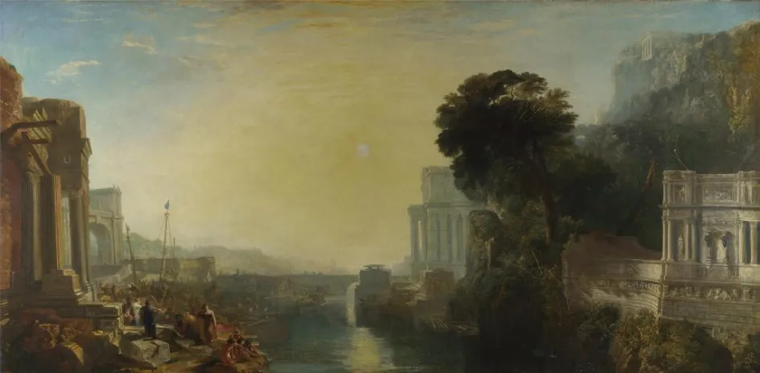

# Уровень 18: Финальная итерация

Данный пост — перевод восемнадцатой статьи из [курса лекций «Принципы гейм-дизайна»](http://gamedesignconcepts.wordpress.com/) за авторством профессионала и преподавателя [Яна Шрайбера](http://www.gamasutra.com/view/authors/916452/Ian_Schreiber.php). Переводы предыдущих лекций вы можете посмотреть по [ссылке](index.md).

Мы приближаемся к концу нашего путешествия, так что если вы всё ещё с нами, мои поздравления – вы их заслужили.

Вы создали игру. Вы много раз её тестировали, всякий раз с новой целью (интерес – баланс – эргономичность). У вас есть список материалов, которые нужно собрать воедино и список действий, которые надо выполнить, чтобы их собрать. Всё что осталось – завершить ваш проект.

### Чтение/Просмотр

Не будет.

### О мастерстве исполнения

Кто-то может спросить, зачем вообще нужно собирать игру из высококачественных компонентов? Ведь игра – это прежде всего механика, а компоненты игры – всего лишь физическое выражение этой механики. Следовательно, любые детали подойдут. Если оставить в стороне интерфейс, почему бы не использовать прототип, которым вы пользовались до сих пор и не назвать его своим итоговым проектом? Карты от руки и всё такое?

У меня на этот счёт несколько возражений.

Во-первых, если компоненты игры – это физическое воплощение правил, вы как дизайнер должны уделить им столько же внимания, чтобы внешняя красота вашей игры гармонировала с внутренней красотой её механики.

Во-вторых, вы должны гордиться своей игрой. Физические компоненты – такое же проявление дизайна, как и правила. Высококачественные компоненты говорят игроку о том, что дизайнер посчитал игру достойной такого качества. Используя аналогию, если вы повар и делаете простой бутерброд с маслом, вы можете положить его на одноразовую бумажную тарелку; но если вы создали изысканный обед из девяти блюд, вы найдёте что-нибудь получше для того, чтобы подать его надлежащим образом.

В-третьих, если вы планируете в конечном итоге издавать и продавать свою игру, качество компонентов – это первое, что увидят будущие покупатели. Многие игры европейского стиля помещают на обратную сторону коробки качественное изображение всех компонентов именно затем, чтобы повысить продаваемость. По сути, они этим они хотят сказать: «Если купите нашу игру, вы приобретёте вот такие замечательные компоненты». Даже если вы не планируете продавать игру, над которой работаете сейчас, знакомство с процессом создания компонентов станет для вас хорошей практикой на будущее.

И, наконец, не забывайте, что игра – это визитка дизайнера. Если вы игнорируете то, что потом увидит каждый игрок, что это говорит о вас самих? То, что вы небрежно относитесь к проекту и не захотели приложить чуть больше усилий? Что вы не гордитесь своей работой? Что вы не уверены в себе? Если вы собираетесь использовать это игру (или какую-либо другую) в своём профессиональной портфолио, подумайте о том, как она будет выглядеть в глазах ваших потенциальных учителей и работодателей. Точно так же, как сами вы наряжаетесь для собеседования, нарядите свою игру перед выходом в свет.

### Продуманная анти-эстетика

Можно пойти ещё дальше. Некоторые коммерческие игры специально сделаны из компонентов низкого качества. Первое издание игры [_KillDoctorLucky_](http://www.boardgamegeek.com/boardgame/257) (и других игр того же издателя) содержало монохромные карты, распечатанные на тонкой бумаге, без картинок, с одним лишь текстом. В игру не были включены даже такие привычные вещи, как кости или пешки, а продавалась она в плоском бумажном конверте, причём правила были напечатаны прямо на обороте – не было даже отдельной инструкции. В цифровом пространстве существует [_Kingdom of Loathing_](http://www.kingdomofloathing.com/) – браузерная онлайн-игра, весь арт которой – схематично нарисованные человечки-«скелетики». Как будто создатели даже не старались ни капли, а между тем, много людей увидело эти игры. Почему бы не поступить также и с вашей игрой?

На самом деле, эти игры обладают высокими эстетическими достоинствами. Каждая из них предлагает цельную визуальную эстетику и оказывает сильное впечатление, которое находится в гармонии с ценностями создателей и игровой механикой.

В случае с _KillDoctorLucky,_ вся суть целой серии игр сводилась к общей концепции деятельности, заявленной Джеймсом Эрнестом, о том, что игры становятся слишком дорогими из-за избыточных компонентов. Зачем платить лишний доллар за пару игральных костей, которых наверняка полно осталось от других игр? Да, карты, конечно, хлипкие… Зато если вы их случайно испортите – не беда! – пойдёте и купите игру ещё раз. Она стоит меньше, чем тот мокка-латте, который вы утром в _Starbucks_ заказывали.

А _Kingdom of Loathing –_ вообще пародия на игры этого жанра. И для пародии преднамеренно низкое качество – это продуманный выбор, чтобы подчеркнуть контраст между обычной для жанра детализацией и схематичным визуальным рядом пародийной игры. И всё время, которое не пошло на более детальную прорисовку, было потрачено на разработку игры, качество которой (откровенно говоря) выше, чем у многих игр с потрясающей графикой.

Итак, если в вашей игре уместно использование «низкого» качества компонентов – например, вы делаете игру о жизни в трущобах, или игру о сороках, где цель – построить гнездо из блестящего мусора, или что-то подобное, тогда, конечно же, создавайте игру соответствующим образом. Но даже в этом случае (или даже _особенно_ в этом случае) пусть качество и внешний вид компонентов будет вашим _сознательным_ дизайнерским решением. Вы обнаружите, что обставить всё так, чтобы небрежность выглядела естественно, может быть очень сложно и потребует большего мастерства, чем просто сделать игру из стандартных высококачественных компонентов.

### На заметку

При распечатке карт:

— Распечатывайте на плотном картоне, а не на бумаге для принтера.

— Если печатаете монохромно, то, возможно, стоит использовать цветной картон, который сочетается с цветом остальных компонентов вашей игры.

— После печати, убедитесь, что карты легко читаются: иногда в распечатанном виде они воспринимаются иначе, чем на экране компьютера.

— Для формы карт используйте прямоугольники со скруглёнными углами, а затем аккуратно вырежьте их по шаблону. Если у вас есть возможность, используйте специальный углорез – он продаётся в большинстве магазинов для хобби и рукоделия и сэкономит вам много времени и сил. Скруглённые края приятнее на ощупь, тогда как прямые углы неприятно упираются в руку.

— Если вам хочется навести лоск, заламинируйте карты (тогда срезать углы надо будет у ламинации, а не у самих карт). Это сделает ваши карты практически вечными и водонепроницаемыми, хотя может обойтись вам в приличную сумму. В качестве недорогой альтернативы многие магазины продают распыляемое пластиковое покрытие, с которым карты на ощупь становятся похожи на стандартные пластиковые. Постарайтесь распылять спрей равномерно, чтобы на картах не было комков и неровностей.

— Если есть возможность, сделайте карты двусторонними, со стандартной рубашкой. Обратите внимание, что оборотный лист будет зеркальным отражением лицевого, поэтому то, что вы поместите с левой стороны оборотного листа, будет расположено на задней стороне того, что находится справа на лицевом листе. Не забывайте, что при двусторонней печати малейшее отклонение в сторону может испортить весь лист, поэтому точно подгоните обе стороны относительно друг друга.

При распечатке поля:

— Просто распечатать на картоне недостаточно. Обычно это производит впечатление чего-то очень хлипкого по сравнению с игровыми полями, к которым мы привыкли. Попробуйте наклеить распечатку на гофрокартон или фанеру, или посадить её на подложку из поролона.

— Если вам нужно будет подрезать фанеру или поролон до нужного размера, сначала сделайте пробный надрез где-нибудь с краю. Некоторыми инструментами сделать это аккуратно просто невозможно – края будут рваные, кривые и неопрятные.

— Распечатывать большое поле на цельном листе бумаги дорого. Распечатывать его на виниловом баннере ещё дороже. Можно выйти из ситуации, разбив большое поле на несколько стандартных листов и наложив их на плотную подложку. Если же вам хочется навести лоск, вы можете распечатать поле на одном большом самоклеющемся листе. Тогда вы сможете наклеить его куда угодно и не возиться с клеем. Главное – сделать это аккуратно, чтобы не образовалось складок.

— Чтобы ваше поле складывалось, положите рядом его составные части и склейте их клейкой лентой (например, почтовым скотчем). Оставьте между ними небольшой промежуток, где нет ничего, кроме ленты (здесь будет линия сгиба). Когда вы наклеите на эту основу изображение поля, ленты почти не будет видно.

При создании игральных костей:

— Распечатайте нужные изображения на самоклеющийся бумаге, аккуратно вырежьте по размеру граней и наклейте на уже существующие кости.

— При использовании стандартных костей (белый фон, чёрные утопленные точки), чёрные точки могут просвечивать через наклейку. В этом случае предварительно закройте грани одними или двумя слоями чистой наклейки без рисунка, а уже на них клейте распечатанные новые грани. Это сгладит или вовсе сведёт на нет просвечивающие точки.

— Для тех, кому хочется навести лоск, некоторые производители предлагают пустые кубики с утопленными гранями, куда можно наклеивать свои изображения. Это идеальный вариант, ведь тогда грани не будут стираться от долгого использования, но такие кубики трудно найти.

При раскрашивании деталей:

— Если у вас много деревянных деталей (таких как кубики и пешки) которые вы хотите различать по цвету, самый простой способ – растворить в ёмкости с водой немного пищевого красителя, погрузить туда ваши детали, а затем высушить их. Я предлагаю делать это в два этапа. Сначала, проведите пробное окрашивание одной детали на каждый из цветов, чтобы увидеть, как они будут выглядеть (некоторые краски могут взяться хуже других, или вы обнаружите, что нужно сократить или увеличить время окрашивания; в любом случае, лучше сделать это прежде, чем вы испортите весь запас своих деревянных деталей). Затем, когда у вас получилось что-то, чем вы довольны, проделайте это же с остальными деталями.

— Деревянные детали можно раскрасить и вручную, но на это уходит больше времени и сил, да и денег, если уж на то пошло.

— Если вы используете пластиковые детали, самое простое – проверить, нет ли у вашего поставщика деталей сразу выполненных в разных цветах, потому что раскрашивать их вручную трудно. Если вам нужно как-то различать пластиковые детали, лучше наклеить на них самоклеющиеся кружки или полоски, вместо того, чтобы пытаться раскрасить сам пластик.

— Если у вас металлические детали и вам нужно, чтобы они были разного цвета, лучший вариант – краска. Те же магазины хобби и рукоделия, которые продают металлические детали, наверняка предлагают и краски по металлу, а также инструменты для работы с ними. Помните, что это может отнять у вас много времени и денег, но если вы решили использовать металлические детали, вряд ли вы вообще беспокоитесь о стоимости.

Для распечатки правил:

— Правила – это и есть игра, поэтому не пренебрегайте ими! Распечатайте хотя бы на бумаге хорошего качества.

— Подумайте, возможно стоит оформить ваши правила в соответствии с тематикой игры. Например, если игра о железной дороге, правила можно изложить в виде расписания поездов. Если тема игры – ресторан, правила можно вложить в пластиковую папку, как меню. Если игра о коллекционировании произведений искусства, на страницах правил можно поместить изображения шедевров.

— Убедитесь, что шрифт, которым набраны правила, легко читается. Не переигрывайте с разными забавными шрифтами – в заголовке это ещё ничего, но для основного текста правил не годится, помните, что правила игрокам _действительно нужно прочесть._

— И ради всего святого, дважды, нет – трижды перепроверьте своё правописание, грамматику и ясность изложения. Знаю, вы это уже сделали, но сейчас проверьте ещё раз – это очень важно.

— И ещё раз проверьте _актуальны_ ли правила. Наверняка в ходе работы над проектом вы вносили много изменений в механику игры, и последнее, чего вы хотите – вручить игрокам старый вариант правил до внесения ключевых изменений!

### Все решения – дизайнерские

Если вы просто свалите в кучу случайные компоненты – это ваше решение. Если вы вручную вырежете каждую деталь из веток дерева, которое растёт у вас под домом – это ваше сознательное решение. Одним словом, всё, что вы делаете с игрой – это решение, за которое вы как дизайнер отвечаете.

Поэтому принимайте решения осознанно. Обдумывайте каждый компонент и то, как он сочетается с общим визуальным и тактильным впечатлением от вашей игры.

А теперь вперёд – собирать финальную версию вашей игры.

### Домашняя забава

Обычно я даю своим очным студентам одни выходные на то, чтобы собрать игру. Они справляются, но приходят на занятия в понедельник уставшими и заявляют, что не спали до трёх утра или даже дольше, чтобы успеть всё закончить.

Они при этом умалчивают (хотя неохотно признаются, если их спросить) что не спали они только потому, что тянули время и до последнего не брались за работу. Вам наверняка кажется, что задание пустяковое и делать там особо нечего. Знайте: на то, чтобы смастерить игру, у вас наверняка уйдёт гораздо больше времени, чем вы предполагаете.

Но в выходные вы уложитесь.

На выходные лишь одно задание: **закончить ваш проект.**

Соберите окончательную версию из лучших компонентов, какие сможете достать.

В понедельник, если у вас есть такая возможность, **опубликуйте свою игру на вики-ресурсе курса.** Я рекомендую вики-ресурс, а не форумы, потому что форумы не поддерживают изображения и прикрепление файлов. Вот что вам следует опубликовать:

— Кратко представиться: кто вы, как называется ваша игра, о чём она (в двух словах).

— Небольшое заявление: почему вы решили создавать именно эту игру, откуда взялась идея, какими были источники вдохновения?

— Файл с окончательным вариантом правил, включая список необходимых компонентов.

— Если какие-либо компоненты имеют особый дизайн (индивидуально разработанные карты, кости или поле), приложите файлы, которые вы использовали для распечатки (если вы распечатывали их с компьютера) и приложите инструкцию для тех, кто захочет распечатать экземпляр вашей игры для себя.

— Если у вас есть возможность, сфотографируйте все компоненты игры (можно расставить их так, как будто они находятся в процессе игры, или просто выстроить в ряд на столе), и опубликуйте фото.

Не забывайте, вы почти добрались до финиша! Последнее усилие – и вы сможете любоваться замечательной игрой, которую сделали своими руками.

_Перевод — Ю. Сергеева._