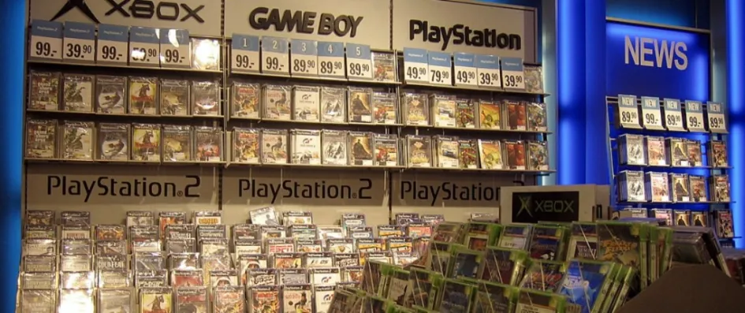

# Уровень 19: Критика и анализ игры

Данный пост — перевод девятнадцатой статьи из [курса лекций «Принципы гейм-дизайна»](http://gamedesignconcepts.wordpress.com/) за авторством профессионала и преподавателя [Яна Шрайбера](http://www.gamasutra.com/view/authors/916452/Ian_Schreiber.php). Переводы предыдущих лекций вы можете посмотреть по [ссылке](index.md).

Если вы дошли до этой лекции и поспевали за курсом в реальном времени, то у вас железная воля и много свободного времени.

А теперь постарайтесь взглянуть на то, что вам удалось, со стороны. И осознайте, что это не конец, а только самое начало.

Сегодня мы немного переключим своё внимание и займёмся критикой игр. Почему мы вообще обращаем внимание на отзывы, критику, игровую журналистику и прочие формы обсуждения игр? Да потому что без возможности проанализировать игру, мы бы делали игры и не могли их обсудить между собой, а значит – не имели бы возможности их усовершенствовать.

Гейм-дизайнер не обязательно должен быть профессиональным критиком (и наоборот), но понимание критического анализа игр – полезный навык. С этим умением, дизайнер может большему научиться, играя в чужие игры, разбираясь, что в них удалось, а что нет (и почему), и используя то, чему он научился, в создании новых игр. Гораздо выгоднее учиться на чужих ошибках, чем на своих.

### Чтение/Просмотр

Прочтите следующее:

Статья Грега Костикяна [_Game Criticism, Why We Need It, and Why Reviews Aren’t It_](http://playthisthing.com/game-criticism-why-we-need-it-and-why-reviews-arent-it). Я бы мог бесконечно рассуждать о разнице между «обзором игры» и «критикой игры», но Грег это уже сделал, причём гораздо более ёмко и ясно, чем это вышло бы у меня.

### Критический анализ

Я уже упоминал, что умение критически анализировать игры других – один из важных дизайнерских навыков. Должен сказать, что половиной своего профессионального прогресса я лично обязан своей способности сыграть в игру и предложить непосредственный конструктивный отзыв, который полезен для создателя этой игры. Моя полезность для других дизайнеров стала допуском в самые разнообразные круги, и я хочу, чтобы у вы тоже использовали эти возможности.

Считайте, что ваш проект, если не завершён, то по крайней мере сдан (как сдаются работы на обычных очных курсах). Отложите его и давайте посмотрим на другие проекты. Это хорошая практика, и не исключено, что она поможет вам найти друзей, которые останутся с вами и после окончания этого курса.

На этот раз мы подойдём к процессу немного с другой стороны. Сейчас мы с вами ненадолго перестанем быть дизайнерами и превратимся в игровых критиков.

### Обзор и критика

Мы редко слышим выражение «игровой критик». Особенно в сфере видеоигр. Гораздо чаще можно встретить слова «игровой обозреватель». Обозрение. Критика. Обозреватель. Критик. Синонимы ли эти слова? И в чём разница?

Как отмечает Костикян, разница в цели высказывания. Если коротко, то обозреватель помогает потребителю сделать выбор: купить или не купить. Критик пишет об игре и почему она важна или незначительна, или ценна, или что там ещё. Так как мы часто слышим ещё и выражение «игровая журналистика», я бы добавил, что _журналист_ пишет о новостях в рассматриваемой области. Таким образом, обозреватель, мог бы написать о _Settlers of Catan,_ что это отличная игра и вы должны купить её немедленно; критик мог бы написать об исторической важности вхождения европейских игр в США или проанализировать механику и то, как в игре минимизировано время бездействия игрока между ходами, как сбалансированы случайность и мастерство, чтобы сделать игру доступной для всех возрастов, и так далее; ну а журналист мог бы написать о выходе новой игры из той же серии или о том, что новый издатель покупает права на эту игру, или о том, что дизайнер игры собирается жениться на знаменитости, когда что-либо подобное произойдёт.

Для гейм-дизайнеров важнее всего критика, потому что именно критика напрямую сообщает что-то новое для наших нынешних и будущих проектов.

Не вся критика попадает в эту категорию. Критика _Шахмат_ как патриархальной игры, которая продвигает анти-феминистические идеи, вряд ли будет вам полезна, если вы хотите создать увлекательную стратегию без какого-либо социального подтекста. Но другая критическая заметка на эту же игру может содержать анализ механики и динамики, насколько они эффективны, и как они взаимодействуют и делают шахматы популярными на протяжении веков. А вот это было бы уже полезно, не правда ли?

### Критический анализ игры: процесс

Для начала, отправьтесь на наш курсовой вики-ресурс и выберите там любую игру (не свою). Не торопитесь, просматривайте опубликованные там проекты, краткие описания и прикреплённые фото и выбирайте то, что покажется вам самым интересным. **Сделайте это, даже если вы ещё не успели закончить свой собственный проект.**

Далее – скачайте компоненты. Их должно быть достаточно, чтобы собрать игру. Можете сделать черновой прототип со всей нужной информацией или просто распечатать на обычной бумаге. Можете даже полностью последовать приложенной инструкции и собрать высококачественную версию, хотя это может отнять больше времени и денег, чем вы готовы сейчас на это потратить.

Далее, прочтите правила и сыграйте в игру. Можете попробовать играть в одиночку (если механика позволяет) или с друзьями, если они согласны на ещё один, последний плейтест. Сыграйте как дизайнер, обращая внимание на механику, динамику и эстетику (в понимании [МДЭ](mde-formal_nyy-podhod-k-geym-dizaynu-i.md)).

И наконец, поразмыслите над своими впечатлениями. Какими были очевидные цели дизайна? Удалось ли игре их достичь? Почему? Какие были использованы механики? Каким был игровой опыт? Каковы отношения между ними? Нашли ли вы какие-то явно выигрышные стратегии? Или же игра была хорошо сбалансирована? Какие занимательные (или не занимательные) решения вы принимали в ходе игры? Как вам кажется, что было в игре главное?

Запишите всё это. Включите в свой анализ следующее:

— Название игры и имя дизайнера (отчасти для того, чтобы приучить себя отдавать дань уважения автору, отчасти для того, чтобы игру легко было отследить, если вы случайно разместите свой отзыв не там).

— Описание базовых механик игры. Вам не нужно пересказывать правила, но вы должны описать в общих чертах, как играется эта игра и какие решения принимают игроки, причём так, чтобы сразу было понятно человеку, который ни разу в неё не играл.

— Опишите динамику и эстетику в понимании МДЭ и покажите, как они проистекают из механики (попытайтесь догадаться, если не совсем уверены).

— Сформулируйте цели дизайна. Чего пытался добиться дизайнер? Затем, изложите, как по-вашему: были эти цели достигнуты или нет (и почему?)

— Если в игре было ещё что-то, достойное внимания (какая-то особая проблема с балансом или новаторское использование компонентов), – отметьте это.

— Наконец, если бы эту игру разрабатывали вы, что бы вы поменяли (если вообще поменяли бы)? Дайте конкретные рекомендации. Например, не просто: «Я бы добавил больше взаимодействия между игроками» или «Я бы исправил проблему, на которую ранее указал» – а _как именно_ вы бы всё это сделали. Какие бы правила поменяли и на что? Изменили бы вы какие-либо игровые объекты или цифры?

Помните, ваша аудитория – другие гейм-дизайнеры. Напишите такой анализ, который даст им возможность научиться чему-нибудь на ошибках или успехах этой игры. Ваша задача – дать новые знания, извлечь новые уроки о том, почему игры удаются или не удаются.  Не нужно присваивать игре «звёздочки» и рейтинг.

### Домашняя забава

Опубликуйте ваш критический анализ в виде комментария на вики-ресурсе. Перейдите на страницу игры, которую вы выбрали, и оставьте комментарий. Я очень советую вам написать свой анализ сначала в текстовом редакторе, а потом скопировать и вставить, когда всё будет готово. Сделайте это до окончания курса (воскресенье, 6 сентября). У вас не будет никакого задания в ближайший четверг, так что подойдите к сегодняшнему очень обстоятельно.

От вас требуется анализ только одной игры. Если вы _хотите,_ предоставить отзывы на большее количество игр, пожалуйста – это ваше право, но сначала закончите свой первый анализ, чтобы оценить, хватит ли оставшегося времени на другие.

_Перевод — Ю. Сергеева._