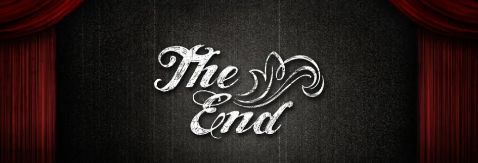

# Уровень 20: Итоги курса и дальнейшие шаги

Данный пост — перевод последней двадцатой статьи из [курса лекций «Принципы гейм-дизайна»](http://gamedesignconcepts.wordpress.com/) за авторством профессионала и преподавателя [Яна Шрайбера](http://www.gamasutra.com/view/authors/916452/Ian_Schreiber.php). Переводы предыдущих лекций вы можете посмотреть по [ссылке](index.md).

Вот мы и подошли к концу нашего курса. Если вы прошли его весь, от начала до конца, я благодарен вам за ваше время. Очень надеюсь, что вы получили от него больше, чем вложили.

Мы прошли множество тем. Начали с построения критического словаря, при помощи которого могли бы обсуждать игры и гейм-дизайн. Рассмотрели процесс создания игры, в частности, преимущества быстрого прототипирования и итерации. Разбили понятие «игра» на формальные элементы и научились анализировать каждый из элементов в отдельности. Говорили об общих принципах, существующих в гейм-дизайне: структуре [МДЭ](mde-formal_nyy-podhod-k-geym-dizaynu-i.md), петлях обратной связи, возникающем и задуманном в играх, теории потокового состояния, видах решений, видах интересного и типажах игроков. Мы рассмотрели повествование и различные роли, которые оно может выполнять в нелинейном игровом опыте. Мы рассматривали игры не только как развлечение, но и как вид искусства и образовательное средство.

И, разумеется, мы делали игры. Много игр. Несколько маленьких и одни большой проект (хотя я уверен, сейчас вам кажется, что времени было слишком мало, несмотря на то, что вы работали над ним целый месяц). Мы с места в карьер ринулись прилагать изученную теорию на практике. По ходу действия мы обсуждали различные виды тестирования (во всех его проявлениях), сведение баланса и разработку пользовательского интерфейса игры.

Сейчас вы, наверное, думаете: что же дальше? Когда этот курс закончится, какие следует предпринять шаги, чтобы стать лучше как гейм-дизайнер? И где конец пути?

### Путешествие длиной в жизнь

Так как никто не идеален, и никогда не будет таковым, _всегда_ можно будет как-то совершенствоваться. Если гейм-дизайн – ваша страсть, и вы хотите создавать игры всё лучше и лучше, вы будете совершенствоваться в этом снова и снова – это процесс, который продолжается, пока вы продолжаете создавать игры.

Нет, путь гейм-дизайнера не имеет конца. Но чем дальше вы по нему продвигаетесь, тем интереснее становится, потому что вы сможете оперировать понятиями высшего уровня с большей лёгкостью. То, на что раньше уходил месяц, в конце концов станет занимать лишь неделю, а оставшееся время вы сможете тратить на то, чтобы улучшить свои игры.

Тогда вы можете спросить, каков же следующий шаг на этом пути? Я создал [страничку на вики-ресурсе курса](http://gamedesignconcepts.pbworks.com/w/page/11829111/next%20steps), где изложил свои мысли на этот счёт, поэтому не премините зайти туда (и поделиться своими собственными мыслями), если вы закончили этот курс и хотите выйти на новый уровень.

### Другие вопросы, которые могут у вас возникнуть

В ходе этого курса мне задавали вопросы о том, что будет, когда он закончится. И вот мои ответы:

**_Я бы хотел поделиться кое-какими материалами этого блога со своими учениками/друзьями/коллегами. Могу ли просить разрешения это сделать? Можно дать ссылку сюда в моём блоге/курсе/и тому подобное?_**

Я получил ряд писем с просьбой о таком разрешении, поэтому я обновил блог, добавив в него открытую лицензию Творческого сообщества, что должно говорить само за себя. А именно: свободно используйте любые материалы, которые вы здесь видите. В конце концов, я создал этот блог, чтобы делиться информацией. И всё же, прошу вас ссылаться на меня как на оригинальный источник, когда вы используете эти материалы. Меня зовут Ян Шрайбер, а курс называется «Принципы гейм-дизайна».

**_Я поздно присоединился к курсу/ я отстал. Что произойдёт с этим курсом, когда он закончится?_**

Я намерен ничего с этим блогом не делать, пусть процветает. Любой, кто обнаружит его позднее, может спокойно присоединиться, проходя курс, когда ему захочется и с любой скоростью. Конечно, он уже не сможет взаимодействовать с другими студентами, но все материалы останутся доступными.

Курсовой вики-ресурс также останется там, где был, доступный широкой публике. По многочисленным просьбам форумы курса также останутся в доступе, позволяя всем подписавшимся поддерживать связь друг с другом.

**_Будете ли вы снова вести этот курс?_**

Пока что я не планирую вести _этот же_ летний курс снова. Тем не менее, вся информация здесь есть, так что любой желающий пройти курс «Принципов гейм-дизайна» может сделать это самостоятельно, в удобное для него время и с комфортной скоростью.

**_Планируете ли вы вести другие подобные классы?_**

ДА. Летом 2010-го я сделаю нечто похожее, но с новым материалом.

Тема следующего летнего курса – **игровой баланс.** Я хочу подробнее рассмотреть всевозможные способы превращения уже существующей игры в нечто более логичное и уравновешенное: обнаружение петель обратной связи и других взаимоотношений в игре, кривые стоимостей, количественные показатели, платёжные матрицы и тому подобное. Это сфера моего личного интереса и я рад возможности поделиться тем, чему научился сам в кругу дизайнеров-единомышленников: как профессионалов, так и любителей. Раз уж «Принципы гейм-дизайна»– экспериментальный проект, я пользуюсь случаем поднять экспериментальную тему: такую, которую мне, вероятнее всего, не довелось бы рассматривать с очными классами, так как она слишком специфична. По ней нет учебников (пока). Мне бы очень хотелось когда-нибудь написать свой собственный, но из опыта я знаю, что собираясь писать учебник по чему-нибудь, надо _сначала_ провести по этой дисциплине курс. Летом 2010 я буду вести этот класс, и я уже с нетерпением жду, когда смогу приступить к нему.

Блог курса «Принципы игрового баланса» находится здесь: [gamebalanceconcepts.wordpress.com](http://gamebalanceconcepts.wordpress.com/). Подробности о том, как на него зарегистрироваться, находятся на сайте.

### А теперь, немного беззастенчивой рекламы…

«Принципы гейм-дизайна» привлекли внимание многих людей. В дополнительной информации о блоге вы можете увидеть, что это около 1400 людей, которые официально и заранее зарегистрировались на курс через электронную почту, среди них представители почти всех штатов США и ещё 47 стран. Для интересующихся, вот ещё немного статистических данных:

— более 400 профессионалов из игровой индустрии (в том числе более 160 профессиональных гейм-дизайнеров);

— более 200 учителей и преподавателей (в том числе более 60 преподающих гейм-дизайн);

— более 400 студентов, от учеников средней школы до аспирантов и докторантов;

— более 350 зарегистрировавшихся с группой (то есть, не в одиночку), всего более 120 групп;

— И это только те, кто записался на курс заранее. Конечно, есть ещё множество людей, которые просто следили за блогом, не регистрируясь официально.

— Этот блог стартовал с более 6 000 уникальных посещений для каждого из первых двух уроков, всего 13 271 посещение за первую неделю.

— Сейчас у нас около 1 000 новых посещений в дни, когда выходит очередная публикация, и около 400 в промежуточные дни.

Так что, если вы это читаете, вы в хорошей компании.

В итоге, вот о чём я хочу спросить:

— Может быть, вы работаете в учебном заведении или компании, которая была бы заинтересована в спонсировании нового курса на следующий год? Со своей стороны, я предлагаю разместить ваш логотип и ссылку на главной странице блога, а также упоминания о вас и ваш текст в конце каждой публикации. Ваше послание прочтут тысячи постоянных посетителей. Свяжитесь со мной по электронной почте, чтобы получить всю информацию о спонсорском сотрудничестве.

— Если вы работаете в учебном заведении (учитель, преподаватель и т. д.), которое предлагает онлайн-курсы, возможно, вас заинтересует адаптация «Принципов гейм-дизайна» для вашего вуза? Я бы мог этим заняться. Возможно, вы ищите преподавателей гейм-дизайна для уже существующих онлайн-курсов? Это тоже мне интересно. Свяжитесь со мной по электронной почте, давайте это обсудим.

— Если вы работаете в компании-разработчике игр, возможно вы ищите гейм-дизайнера для удалённой работы или на ограниченный срок по контракту? Вышлите на мою электронную почту запрос, и я дам всю необходимую контактную информацию. Я готов предоставить резюме и рекомендации по требованию.

Кроме того, если вам понравился наш учебник, я и мой соавтор будем рады вашим отзывам на [Amazon](http://www.amazon.com/gp/product/158450580X?ie=UTF8&tag=gamedesiconc-20&linkCode=as2&camp=1789&creative=9325&creativeASIN=158450580X). Книгу заказало очень много людей, но отзывов пока мало, и нам было бы приятно, если бы их стало больше.

### Оценка курса

_Опрос уже закрыт, но вы всё равно можете отправлять мне письма, если хотите высказать своё мнение об этом курсе._

Когда заканчивается курс лекций в колледже, студентам обычно предлагают специальные бланки оценки курса со всевозможными вопросами о сильных и слабых сторонах самого курса и преподавателя. Их берут, заполняют и возвращают преподавателю. Я продолжу эту традицию и здесь.

Мне бы хотелось знать, что я сделал правильно, но ещё важнее – что я сделал неправильно.

Опросник находится здесь: [Start](http://survey.constantcontact.com/survey/a07e2kh03mmfz3laohv/start)

Если вы это читаете, я был бы рад узнать ваше мнение. В равной степени это касается всех: как зарегистрировавшихся заранее, так и присоединившихся к курсу позднее; как тех, кто успевал за курсом, так и тех, кто не смог; как тех, кому понравилось, так и тех, кто считает, что зря потратил время.

Перейдите по ссылке и заполните анкету. Я прошу об этом как о личном одолжении, взамен на время, которое я посвятил созданию этого курса. Ваши ответы помогут мне сделать следующий курс ещё лучше. Спасибо вам.

В заключение

Я хочу поблагодарить вас за проявленный интерес, за участие, за ваше время. Я желаю вам всего самого лучшего в играх и в жизни. Продолжайте играть, разрабатывать и учиться.

 _Ян Шрайбер_

_Перевод — Ю. Сергеева._