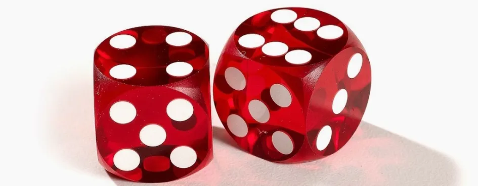

# Уровень 4: Вероятность и Случайность

Данный пост — перевод четвертой статьи из [курса лекций «Принципы игрового баланса»](https://gamebalanceconcepts.wordpress.com/) за авторством профессионала и преподавателя [Яна Шрайбера](http://www.gamasutra.com/view/authors/916452/Ian_Schreiber.php). Переводы предыдущих лекций вы можете посмотреть по [ссылке](index.md).

### **Чтения/игры**

[П](http://www.gamasutra.com/view/feature/1801/statistically_speaking_its_.php)[рочтите эту статью](http://www.gamasutra.com/view/feature/1801/statistically_speaking_its_.php), написанную дизайнером Тайлером Сигманом, на “Gamasutra”. Я нежно называю её статьей о “волосах в ноздрях орка”, но в ней довольно хорошо изложены основы вероятностей в играх.

### **Тема этой недели**

До сегодняшнего дня почти всё, о чем мы говорили, было детерминированным и на прошлой неделе мы внимательно изучили транзитивную механику и разобрали ее настолько подробно, насколько детально я могу ее объяснить. Но до сих пор мы не обращали внимание на огромный аспект многих игр, а именно на недетерминированные аспекты, другими словами — случайность. Понимание природы случайности очень важно для гейм-дизайнеров, потому что мы создаем системы, которые влияют на опыт игрока в той или иной игре, таким образом, нам нужно знать, как эти системы работают. Если в системе есть случайность, нужно понимать _природу_ этой случайности и как её изменить, чтобы получить нужные нам результаты.

### **Игральные кости**

Давайте начнем с чего-то простого: бросание игральных костей. Когда большинство людей думает об игральных костях, они представляют себе шестигранный кубик, известный как d6. Но большинство геймеров видели множество других игральных костей: четырёхгранные (d4), восьмигранные (d8), двенадцатигранные (d12), двадцатигранные (d20) … и если вы _настоящий_ гик, у вас, может быть, где-то найдутся 30-гранные или 100-гранные кости. Если вы не знакомы с данной терминологией, “d” означает игральную кость, а число, стоящее после неё, сколько у неё граней. Если _перед_ “d” стоит число, то оно обозначает _количество_ игральных костей при бросании. Например, в игре “Монополия” вы бросаете 2d6.

Итак, в данном случае словосочетание “игральная кость” — условное обозначение. Существует огромное количество других генераторов случайных чисел, которые не имеют форму пластиковой глыбы, но выполняют ту же функцию генерации случайного числа от 1 до n. Обычную монету можно также представить себе в виде двугранной игральной кости d2. Я видел два дизайна семигранной кости: одна из них выглядела как игральный кубик, а вторая была больше похожа на семигранный деревянный карандаш. Четырехгранный дрейдл (также известный как титотум) является аналогом четырехгранной кости. Игровое поле с крутящейся стрелкой в игре “Chutes & Ladders”, где результат может быть от 1 до 6, соответствует шестигранной кости. Генератор случайных чисел в компьютере может создать любое число от 1 до 19, если дизайнер задаст такую команду, хотя в компьютере нет 19-гранной игральной кости (вообще о вероятности выпадения чисел на компьютере я буду говорить подробнее на _следующей_ неделе). Хотя все эти предметы выглядят по-разному, на самом деле они равнозначны: у вас есть равные шансы выпадения одного из нескольких исходов.

У игральных костей есть некоторые интересные свойства, о которых нам нужно знать. Во-первых, вероятность выпадения любой из граней одинакова (я предполагаю, что вы бросаете правильную игральную кость, а не с неправильной геометрической формой). Таким образом, если вы хотите знать _среднее значение_ броска (также известное среди увлекающихся темой вероятности как “математическое ожидаемое”), суммируйте значения всех граней и эту сумму разделите на _количество_ граней. Среднее значение броска для стандартного шестигранного кубика равно 1+2+3+4+5+6 = 21, делим на количество граней (6) и получаем среднее значение 21/6 = 3,5. Это особый случай, потому что мы предполагаем, что все исходы равновероятны.

Что если у вас особенные игральные кости? Например, я видел игру с шестигранной игральной костью со специальными наклейками на гранях: 1, 1, 1, 2, 2, 3, поэтому она ведет себя как странная трехгранная игральная кость, с которой больше шансов, что выпадет число 1 чем 2, и 2 чем 3. Какое среднее значение броска для этой кости? Итак, 1+1+1+2+2+3 = 10, делим на 6, равно 5/3 или примерно 1,66. Таким образом, если у вас такая особенная игральная кость и игроки будут бросать три кости, а затем суммировать результаты, вы знаете, что примерная сумма их броска будет равна примерно 5, и вы можете балансировать игру основываясь на этом предположении.

#### _Игральные кости и независимость_

Как я уже говорил, мы исходим из предположения, что выпадение каждой грани равновероятно. Это не зависит от того, сколько игральных костей вы бросаете. Каждое бросание игральной кости _независимо_, это означает, что предыдущие броски не влияют на результаты последующих. При достаточном количестве испытаний вы обязательно _заметите_ “серию” чисел, как, например, выпадение в основном более крупных или меньших значений, или другие особенности, и позже мы поговорим об этом, но это не значит, что игральные кости “горячие” или “холодные”. Если вы бросаете стандартный шестигранный кубик и два раза подряд выпадает число 6, вероятность того, что результатом следующего броска будет 6, точно также равна 1/6. Вероятность не повышается от того, что кубик “нагрелся”. Вероятность не понижается, потому что уже два раза подряд выпадало число 6, а значит теперь выпадет другая грань. (Конечно, если вы бросаете кубик двадцать раз и каждый раз выпадает число 6, шанс того, что в двадцать первый раз выпадет число 6 довольно высок… потому что, возможно, это значит, что у вас неправильные кубик!) Но если у вас правильный кубик, вероятность выпадения каждой из граней одинакова, независимо от результатов других бросков. Вы можете также представить себе, что каждый раз мы заменяем игральную кость, так, если выпало два раза подряд число 6, уберите “горячую” игральную кость из игры и замените её на новую шестигранную кость. Я прошу прощения, если кто-то из вас уже знал об этом, но мне необходимо было это прояснить, прежде чем двигаться дальше.

#### _Как сделать выпадение игральных костей более или менее случайным_

Давайте поговорим о том, как получить разные результаты на разных игральных костях. Если вы бросаете игральную кость только один раз или несколько раз, игра будет казаться более случайной, в том случае если у игральной кости будет больше граней. Чем больше раз вы бросаете игральную кость или чем больше игральных костей вы бросаете, тем больше результаты приближаются к среднему значению. Например, если вы бросаете 1d6+4 (т.е. стандартную шестигранную игральную кость один раз и прибавляете к результату 4), средним значением будет число от 5 до 10. Если вы бросаете 5d2, средним значением также будет число от 5 до 10. Но при бросании шестигранной игральной кости, вероятность выпадения чисел 5, 8 или 10 одинакова. Результатом бросания 5к2 будут в основном числа 7 и 8, реже другие значения. Та же серия, даже то же среднее значение (7,5 в обоих случаях), но природа случайности разная.

Подождите минутку. Разве я только что не говорил, что игральные кости не нагреваются и не охлаждаются? А теперь я говорю, что если вы бросаете много игральных костей, результаты бросков приближаются к среднему значению? Почему?

Позвольте мне объяснить. Если вы бросаете _одну_ игральную кость, вероятность выпадения каждой из граней одинакова. Это значит, что если вы бросаете много игральных костей, на протяжении некоторого времени каждая грань будет выпадать примерно одинаковое количество раз. Чем больше костей вы бросаете, тем больше в совокупности результат будет приближаться к среднему значению. Это не потому что выпавшее число “заставляет” выпасть другое число, которое еще не выпадало. А потому что небольшая серия выпадения числа 6 (или 20, или другого числа) в итоге не будет иметь большого значения, если вы бросите игральные кости еще десять тысяч раз и в основном будет выпадать среднее значение… возможно, сейчас у вас выпадет несколько чисел с высоким значением, но, может быть, позже несколько чисел с низким значением и со временем они приблизятся к среднему значению. Не потому что предыдущие броски влияют на игральные кости (серьезно, игральная кость сделана из _пластика_, у неё нет мозгов, чтобы подумать: «ой, давно не выпадало 2»), а потому что это то, что обычно происходит при большом количестве бросков игральных костей. Небольшая серия повторяющихся чисел будет практически незаметна в большом количестве результатов.

Таким образом, произвести расчёты для одного случайного броска игральной кости довольно несложно, по крайней мере, что касается вычисления среднего значения броска. Есть также способы вычислить “насколько случайно” что-либо, способ сказать, что результаты бросания 1d6+4 будут “более случайными” чем 5d2, для 5d2 распределение выпадения результатов будет более равномерным, обычно для этого вы вычисляете среднеквадратическое отклонение, и чем больше будет значение, тем более случайными будут результаты, но для этого нужно сделать больше вычислений, чем мне бы хотелось приводить сегодня (эту темя я объясню позже). Единственное, что я прошу вас знать: как правило, чем меньше игральных костей бросается, тем больше случайность. И еще одно дополнение по этой теме: чем больше граней у игральной кости, тем больше случайность, так как у вас больше вариантов.

#### _Как вычислить вероятность при помощи подсчёта_

У вас, возможно, возник вопрос: как мы можем вычислить точную вероятность выпадения определенного результата? На самом деле это довольно важно для многих игр, потому что, если вы бросаете игральную кость, изначально, скорее всего, есть какой-то оптимальный результат. Ответ таков: нам нужно посчитать два значения. Во-первых, посчитайте максимальное число исходов при бросании игральной кости (независимо от того, какой будет исход). Затем посчитайте число благоприятных исходов. Разделив второе значение на первое, вы получите нужную вероятность. Чтобы получить процентное отношение, умножьте полученный результат на 100.

_Примеры:_

Вот очень простой пример. Вы хотите, чтобы выпало число 4 или выше и бросаете один раз шестигранную игральную кость. Максимальное число исходов составляет 6 (1, 2, 3, 4, 5, 6). Из них 3 исхода (4, 5, 6) являются благоприятными. Значит, чтобы посчитать вероятность, делим 3 на 6 и получаем 0,5 или 50%.

Вот пример немного сложнее. Вы хотите, чтобы выпало чётное число при бросании 2d6. Максимальное число исходов 36 (6 для каждой игральной кости, и так как одна игральная кость не влияет на другую, умножаем 6 результатов на 6 и получаем 36). Сложность вопроса данного типа заключается в том, что легко посчитать дважды. Например, на самом деле есть два варианта результата 3 при бросании 2к6: 1+2 и 2+1. Они выглядят одинаково, но разница в том, какое число отображено на первой игральной кости и какое на второй. Вы также можете представить себе, что игральные кости разных цветов, так, например, в данном случае одна игральная кость красного цвета, другая синего. Затем посчитайте количество вариантов выпадения чётного числа: 2 (1+1), 4 (1+3), 4 (2+2), 4 (3+1), 6 (1+5), 6 (2+4), 6 (3+3), 6 (4+2), 6 (5+1), 8 (2+6), 8 (3+5), 8 (4+4), 8 (5+3), 8 (6+2), 10 (4+6), 10 (5+5), 10 (6+4), 12 (6+6). Оказывается, что есть 18 вариантов для благоприятного исхода из 36, как и в предыдущем случае, вероятность будет равна 0,5 или 50%. Возможно, неожиданно, но довольно точно.

#### _Моделирование методом Монте-Карло_

Что если у вас для такого подсчёта слишком много игральных костей? Например, вы хотите знать какова вероятность того, что выпадет сумма равная 15 или больше при броске 8d6. Для восьми игральных костей существует МНОЖЕСТВО разных индивидуальных результатов и их подсчёт вручную займет очень много времени. Даже если мы найдем какое-нибудь хорошее решение, чтобы сгруппировать разные серии бросков игральных костей, всё равно на подсчёт понадобится очень много времени. В данном случае самым простым способом посчитать вероятность будет не считать вручную, а воспользоваться компьютером. Есть два способа подсчёта вероятности на компьютере.

С помощью первого способа можно получить точный ответ, но он включает в себя немного программирования или скриптинга. В сущности, компьютер будет просматривать каждую возможность, оценивать и подсчитывать общее количество итераций и количество итераций, которые соответствуют нужному результату, и затем предоставит ответы. Ваш код может выглядеть примерно следующим образом:

int wincount=0, totalcount=0;

for (int i=1; i<=6; i++) {

for (int j=1; j<=6; j++) {

for (int k=1; k<=6; k++) {

… // insert more loops here

if (i+j+k+… >= 15) {

wincount++;

}

totalcount++;

}

}

}

float probability = wincount/totalcount;

Если вы не разбираетесь в программировании и вам просто нужен неточный, а примерный ответ, вы можете смоделировать данную ситуацию в Excel, где вы подбросите 8d6 несколько тысяч раз и получите ответ. Чтобы бросить 1d6 в Excel, используйте следующую формулу:

\=FLOOR(RAND()\*6)+1

Существует название для ситуации, когда вы не знаете ответа и просто пробуете множество раз — _моделирование методом Монте-Карло_, и это отличное решение, к которому можно прибегнуть, когда вы пытаетесь посчитать вероятность, и это слишком сложно. Самое замечательное, что в данном случае нам не нужно понимать, как происходит математический расчёт, и мы знаем, что ответ будет “довольно хорошим”, потому что как мы уже знаем, чем больше количество бросков, тем больше результат приближается к среднему значению.

#### _Как объединить независимые испытания_

Если вы спросите о нескольких повторяющихся, но независимых испытаниях, то исход одного броска не влияет на исходы других бросков. Есть ещё одно более простое объяснение данной ситуации.

Как различить что-либо зависимое и независимое? В принципе, если вы можете выделить каждый бросок игральной кости (или серию бросков) как отдельное событие, то он независим. Например, мы хотим, чтобы выпала сумма равная 15, бросая 8к6, данный случай не может быть разделен на несколько независимых бросков игральных костей. Так как для результата вы считаете сумму значений всех игральных костей, результат, который выпал на одной игральной кости, влияет на результаты, которые должны выпасть на других игральных костях, потому что только суммируя все значения, вы получите требуемый результат.

Вот пример независимых бросков: перед вами игра с игральными костями, и вы несколько раз бросаете шестигранные кости. Чтобы остаться в игре, при первом броске вам должно выпасть число 2 или значение выше. Для второго броска — 3 или значение выше. Для третьего требуется 4 или выше, четвертого — 5 или выше, пятого — 6. Если все пять бросков успешные, вы выиграли. В данном случае все броски независимы. Да, если один бросок будет неудачным, он повлияет на результат всей игры, но один бросок не влияет на другой бросок. Например, если ваш второй бросок игральных костей очень удачный, это никак не влияет на вероятность того, что следующие броски будут такими же удачными. Поэтому мы можем рассматривать вероятность каждого броска игральных костей отдельно.

**Если у вас отдельные, независимые вероятности и вы хотите знать, какова вероятность того, что _все_ события наступят, вы определяете каждую индивидуальную вероятность и перемножаете их.** Другой способ: если вы используете союз “и”, чтобы описать несколько условий (например, какова вероятность наступления какого-то случайного события _и_ какого-то другого независимого случайного события?), посчитайте отдельные вероятности и перемножьте их.

Не важно, что вы считаете, _никогда_ не суммируйте независимые вероятности. Это распространённая ошибка. Чтобы понять, почему это неправильно, представьте себе ситуацию, когда вы подбрасываете монету 50/50, вы хотите знать, какова вероятность того, что два раза подряд выпадет “орёл”. Вероятность выпадения каждой из сторон 50%, поэтому если вы суммируете эти две вероятности, вы получите 100% шанс того, что выпадет “орёл”, но мы знаем, что это не правда, потому что два раза подряд могла бы выпасть “решка”. Если вместо этого вы умножите эти две вероятности, у вас получится 50%\*50% = 25%, и это правильный ответ для расчёта вероятности выпадения “орла” два раза подряд.

_Пример_

Давайте вернёмся к игре с шестигранной игральной костью, где нужно, чтобы сначала выпало число выше чем 2, затем выше чем 3 и т.д. до 6. Каковы шансы того, что в данной серии 5 бросаний все исходы будут благоприятными?

Как говорилось выше, это независимые испытания, и поэтому мы подсчитываем вероятность для каждого отдельного броска, а затем умножаем их. Вероятность того, что исход первого броска будет благоприятным, равна 5/6. Второго — 4/6. Третьего — 3/6. Четвертого — 2/6, пятого — 1/6. Умножаем все эти результаты и получаем примерно 1,5%… Таким образом, победа в данной игре бывает довольно редко, поэтому если вы добавите этот элемент в вашу игру, вам нужен будет довольно большой джекпот.

#### _Отрицание_

Вот еще одна полезная подсказка: иногда сложно посчитать вероятность того, что событие наступит, но легче определить каковы шансы того, что событие _не наступит_.

Например, предположим у нас есть еще одна игра и вы бросаете 6d6, и если _хотя бы раз_ выпадет 6, вы выиграете. Какова вероятность выигрыша?

В данном случае нужно посчитать много вариантов. Возможно, выпадет одно число 6, т.е. на одной из игральных костей выпадет число 6, а на других числа от 1 до 5, и есть 6 вариантов того, на какой из игральных костей выпадет число 6. Затем вам может выпасть число 6 на двух игральных костях, или на трёх, или на еще большем количестве, и каждый раз нам нужно сделать отдельный подсчёт, поэтому в этом легко запутаться.

Но есть другой способ решения этой задачи, давайте посмотрим на неё с другой стороны. Вы _проиграете_ если _ни на одной_ из игральных костей не выпадет число 6. В данном случае у нас есть шесть независимых испытаний, вероятность каждого из них равна 5/6 (на игральной кости может выпасть любое другое число кроме 6). Умножьте их и получите примерно 33%. Таким образом, вероятность проигрыша составляет 1 к 3.

Следовательно, вероятность выигрыша равна 67% (или 2 к 3).

Из этого примера очевидно, что **если вы считайте вероятность того, что событие не наступит, нужно вычесть результат из 100%.** Если вероятность выиграть равна 67%, то вероятность _проиграть_ — 100% _минус_ 67%, или 33%. И наоборот. Если сложно посчитать одну вероятность, но легко посчитать противоположную, посчитайте противоположную, а затем вычтите из 100%.

#### _Соединяем условия для одного независимого испытания_

Чуть выше я говорил, что вы никогда не должны суммировать вероятности при независимых испытаниях. Есть ли какие-либо случаи, когда _можно_ суммировать вероятности? — Да, в одной особенной ситуации.

**Если вы хотите вычислить вероятность для нескольких, не связанных между собой, благоприятных исходов одного испытания, суммируйте вероятности каждого благоприятного исхода.** Например, вероятность выпадения чисел 4, 5 или 6 на 1к6 равна _сумме_ вероятности выпадения числа 4, вероятности выпадения числа 5 и вероятности выпадения числа 6. Также данную ситуацию можно представить себе следующим образом: если вы используете союз “или” в вопросе о вероятности (например, какова вероятность того _или_ иного исхода одного случайного события?), подсчитайте отдельные вероятности и просуммируйте их.

Обратите внимание, что когда вы просуммируете _все возможные исходы_ игры, сумма всех вероятностей должна быть равна 100%. Если сумма не равна 100%, ваш расчёт был сделан неверно. Это хороший способ перепроверить свои вычисления. Например, вы проанализировали вероятность выпадения всех комбинаций в покере, если вы просуммируете все полученные результаты, у вас должно получится ровно 100% (или по крайней мере значение довольно близкое к 100%, если вы пользуетесь калькулятором, у вас может возникнуть маленькая ошибка при округлении, но если вы суммируете точные числа вручную, все должно сойтись). Если сумма не сходится, значит, скорее всего, вы не учли какие-то комбинации, или посчитали вероятности некоторых комбинаций неверно и тогда вам нужно перепроверить свои вычисления.

#### _Неравные вероятности_

До сих пор мы предполагали, что каждая грань игральной кости выпадает с одинаковой периодичностью, потому что таким представляется себе принцип работы игральной кости. Но иногда вы сталкиваетесь с ситуацией, когда возможны разные исходы и у них _разные_ шансы выпадения. Например, в одном из дополнений карточной игры “Nuclear War” есть игровое поле со стрелкой, от которого зависит результат запуска ракеты: в основном, она наносит обычный урон, более сильный или более слабый, но иногда урон усиливается в два или три раза, или ракета взрывается на стартовой площадке и причиняет вам вред, или происходит другое событие. В отличие от игрового поля со стрелкой в “Chutes & Ladders” или “A Game of Life” результаты игрового поля в “Nuclear War” неравновероятны. Некоторые секции игрового поля больше по размеру и стрелка останавливается на них гораздо чаще, в то время как другие секции очень маленькие и стрелка останавливается на них редко.

Итак, на первый взгляд кость выглядит примерно следующим образом: 1, 1, 1, 2, 2, 3; мы уже говорили о ней, она представляет собой что-то вроде утяжеленной 1d3, следовательно, нам нужно разделить все эти секции на равные части, найти самую маленькую единицу измерения, которой всё кратно и затем представить ситуацию в виде d522 (или какой-то другой), где множество граней игральной кости будет отображать ту же ситуацию, но с большим количеством исходов. И это один из способов решения задачи, и он технически выполним, но есть более простой способ.

Давайте вернемся к нашей стандартной шестигранной игральной кости. Мы говорили, что для того, чтобы посчитать среднее значение броска для нормальной игральной кости, нужно суммировать значения на всех гранях и разделить их на количество граней, но как _именно_ происходит расчёт? Можно выразить это иначе. Для шестигранной игральной кости вероятность выпадения каждой грани равна точно 1/6. Теперь мы умножаем _исход_ каждой грани на _вероятность_ этого исхода (в данном случае 1/6 для каждой грани), затем суммируем полученные значения. Таким образом, суммируя (1\*1/6) + (2\*1/6) + (3\*1/6) + (4\*1/6) + (5\*1/6) + (6\*1/6), получаем тот же результат (3,5), как и при расчёте выше. На самом деле мы считаем так каждый раз: умножаем каждый исход на вероятность этого исхода.

Можем ли мы произвести такой же расчёт для стрелки на игровом поле в игре “Nuclear War”? Конечно, можем. И если мы суммируем все найденные результаты, то получим среднее значение. Всё, что нам нужно сделать, это вычислить вероятность каждого исхода для стрелки на игровом поле и умножить на исход.

_Другой пример_

Этот метод расчёта среднего значения, путем умножения каждого результата на его индивидуальную вероятность, также подходит, если результаты равновероятны, но имеют разные преимущества, например, если вы бросаете игральную кость и выигрываете больше при выпадении одних граней, чем других. Например, возьмем игру, которая бывает в казино: вы делаете ставку и бросаете 2d6. Если выпадут три числа с наименьшим значением (2, 3, 4) или четыре числа с высоким значением (9, 10, 11, 12), вы выиграете сумму, равную вашей ставке. Особенными являются числа с самым низким и самым высоким значением: если выпадет 2 или 12, вы выиграете _в два раза больше_, чем ваша ставка. Если выпадет любое другое число (5, 6, 7, 8), вы проиграете вашу ставку. Это довольно простая игра. Но какова вероятность выигрыша?

Начнем с того, что посчитаем, сколько раз вы можете выиграть:

*   Максимальное число исходов при бросании 2к6 составляет 36. Каково количество благоприятных исходов?
*   Есть 1 вариант того, что выпадет два и 1 вариант того, что выпадет двенадцать.
*   Есть 2 варианта того, что выпадет три и одиннадцать.
*   Есть 3 варианта того, что выпадет четыре и 3 варианта того, что выпадет десять.
*   Есть 4 варианта того, что выпадет девять.
*   Просуммировав все варианты, получаем число благоприятных исходов 16 из 36.

Таким образом, при нормальных условиях вы выиграете 16 раз из 36 возможных… вероятность выигрыша немного меньше чем 50%.

Но в двух случаях из этих 16 вы выиграете в два раза больше, т.е. это как выиграть дважды! Если вы будете играть в эту игру 36 раз, делая ставку в $1 каждый раз, и каждый из всех возможных исходов выпадет один раз, вы выиграете в сумме $18 (на самом деле вы выиграете 16 раз, но два раза из них будут считаться как два выигрыша). Если вы играете 36 раз и выигрываете $18, не значит ли это, что это равная вероятность?

Не торопитесь. Если вы посчитаете количество раз, когда вы можете проиграть, то у вас получится 20, не 18. Если вы будете играть 36 раз, делая каждый раз ставку в $1, вы выиграете общую сумму в $18 при выпадении всех благоприятных исходов… но вы проиграете общую сумму в $20 при выпадении всех 20 неблагоприятных исходов! В результате, вы будете немного отставать: вы теряете в среднем $2 нетто за каждые 36 игр (вы также можете сказать, что вы теряете в среднем 1/18 доллара в день). Теперь вы видите, как легко в данном случае допустить ошибку и посчитать вероятность неправильно!

#### _Перестановка_

До сих пор мы предполагали, что порядок расположения чисел при бросании игральных костей не имеет значения. Выпадение 2+4 — это тоже самое, что и выпадение 4+2. В большинстве случаев мы вручную подсчитываем число благоприятных исходов, но иногда данный способ непрактичен и лучше использовать математическую формулу.

Пример данной ситуации из игры с игральными костями “Farkle”. Для каждого нового раунда вы бросаете 6d6. Если вам повезет и выпадут все возможные результаты 1-2-3-4-5-6 (“стрейт”), вы получите большой бонус. Какова вероятность того, что это произойдет? В данном случае есть множество вариантов выпадения данной комбинации!

Решение выглядит следующим образом: на одной из игральных костей (и только на одной) должно выпасть число 1! Сколько вариантов выпадения числа 1 на одной игральной кости? Шесть, так как есть 6 игральных костей и на любой из них может выпасть число 1. Соответственно, возьмите одну игральную кость и отложите ее в сторону. Теперь, на одной из оставшихся игральных костей должно выпасть число 2. Для этого есть пять вариантов. Возьмите еще одну игральную кость и отложите ее в сторону. Затем следует, на четырех из оставшихся игральных костей может выпасть число 3, на трёх из оставшихся игральных костей может выпасть число 4, на двух — число 5 и в итоге у вас остается одна игральная кость, на которой должно выпасть число 6 (в последнем случае игральная кость одна и выбора нет). Чтобы посчитать количество благоприятных исходов для выпадения комбинации “стрейт”, мы умножаем все разные, независимые варианты: 6x5x4x3x2x1 = 720 — похоже, что есть довольно большое количество вариантов того, что выпадет эта комбинация.

Чтобы посчитать вероятность выпадения комбинации “стрейт”, нам нужно разделить 720 на количество всех возможных исходов для бросания 6d6. Каково число всех возможных исходов? На каждой игральной кости может выпасть 6 граней, поэтому мы умножаем 6x6x6x6x6x6 = 46656 (число намного больше!). Делим 720/46656 и получаем вероятность равную примерно 1,5%. Если бы вы занимались дизайном этой игры, вам бы полезно было это знать, чтобы вы могли создать соответствующую систему подсчёта очков. Теперь мы понимаем, почему в игре “Farkle” вы получите такой большой бонус, если вам выпадет комбинация “стрейт”, потому что эта ситуация довольно редкая!

Результат также интересен и по другой причине. На примере видно насколько на самом деле редко за короткий период выпадает результат, соответствующий вероятности. Конечно, если бы мы бросали несколько тысяч игральных костей, разные грани игральных костей выпадали бы довольно часто. Но когда мы бросаем только шесть игральных костей, почти _никогда_ не случается так, чтобы выпала каждая из граней! Исходя из этого становится понятно, что глупо ожидать, что сейчас выпадет другая грань, которая еще не выпадала “потому что нам давно не выпадало число 6, а значит выпадет сейчас”.

### **Слушай, твой генератор случайных чисел сломался…**

Это приводит нас к распространённому заблуждению по поводу вероятности: предположение, что все исходы выпадают с одинаковой периодичностью _на протяжении небольшого периода времени_, что на самом деле не так. Если мы бросаем игральные кости несколько раз, периодичность выпадения каждой из граней не будет одинаковой.

Если вы когда-либо раньше работали над онлайн игрой с каким-нибудь генератором случайных чисел, вы, скорее всего, сталкивались с ситуацией, когда игрок пишет в службу технической поддержки, чтобы сказать, что ваш генератор случайных чисел сломан и не показывает случайные числа, и он пришёл к такому выводу, потому что только что убил 4 монстра подряд и получил 4 совершенно одинаковые награды, а эти награды должны выпадать только в 10% случаев, поэтому такое _почти никогда_ не должно _происходить_, а значит это _очевидно_, что ваш генератор случайных чисел сломался.

Вы делаете математический расчёт. 1/10\*1/10\*1/10\*1/10 равно 1 из 10 000, что значит, что это довольно редкий случай. И именно это пытается вам сказать игрок. Есть ли в данном случае проблема?

Всё зависит от обстоятельств. Сколько игроков сейчас на вашем сервере? Предположим, у вас достаточно популярная игра и каждый день в неё играет 100 000 человек. Сколько игроков убьют четыре монстра подряд? Возможно все, несколько раз за день, но давайте предположим, что половина из них просто обмениваются разными предметами на аукционах или переписываются на RP серверах, или выполняют другие игровые действия, таким образом, на самом деле на монстров охотится только половина из них. Какова вероятность того, что _кому-то_ выпадет одна и та же награда? При данной ситуации можно ожидать, что одна и та же награда может выпасть несколько раз за день, как минимум!

Кстати, поэтому кажется, что каждые несколько недель по крайней мере _кто-то_ выигрывает в лотерею, даже если этим кем-то _никогда_ не бываете вы или ваши знакомые. Если достаточное количество людей играет каждую неделю, есть вероятность того, что где-то найдется хотя бы _один_ счастливчик… но если _вы_ играете в лотерею, вероятность того, что вы выиграете меньше вероятности того, что вас пригласят на работу в “Infinity Ward”.

### **Карты и зависимость**

Мы обсудили независимые события, например, бросание игральной кости, и теперь знаем много мощных инструментов анализа случайности во многих играх. Расчёт вероятности немного сложнее, когда речь идёт о вынимании карт из колоды, потому что каждая карта, которую мы вынимаем, влияет на оставшиеся в колоде карты. Если у вас стандартная колода в 52 карты, и вы вынимаете, например, 10 червей и хотите знать вероятность того, что следующая карта будет той же масти, вероятность изменилась, потому что вы уже убрали одну карту масти черви из колоды. Каждая карта, которую вы убираете, изменяет вероятность следующей карты в колоде. Так как в данном случае предыдущее событие влияет на следующее, мы называем такую вероятность _зависимой_.

Обратите внимание, что когда я говорю “карты”, я имею в виду _любую_ игровую механику, в которой есть набор объектов и вы убираете один из объектов, не заменяя его, “колода карт” в данном случае аналог мешочку с фишками, из которого вы вынимаете одну фишку и не заменяете её, или урне, из которой вы вынимаете цветные шарики (на самом деле я никогда не видел игру, в которой бы была урна, из которой бы вынимали цветные шарики, но похоже, что преподаватели теории вероятности по какой-то причине предпочитают данный пример).

#### _Свойства зависимости_

Хотелось бы уточнить, что когда речь идет о картах, я предполагаю, что вы вынимаете карты, смотрите на них и убираете их из колоды. Каждое из этих действий — важное свойство.

Если бы у меня была колода, скажем, из шести карт с числами от 1 до 6, и я бы перетасовал их и вынул одну карту и затем перетасовал все шесть карт снова, это было бы аналогично бросанию шестигранной игральной кости; один результат не влияет на последующие. Только если я буду вынимать карты и не буду заменять их, результат того, что я вынул карту с числом 1, повысит вероятность того, что в следующий раз я выну карту с числом 6 (вероятность будет повышаться пока я в итоге не выну эту карту или пока не перетасую карты).

Факт того, что мы _смотрим_ на карты, также важен. Если я выну карту из колоды и не посмотрю на неё, у меня не будет дополнительной информации, и на самом деле вероятность не изменится. Это может прозвучать нелогично. Как простое переворачивание карты может волшебным образом изменить вероятность? Но это возможно, потому что вы можете посчитать вероятность для неизвестных предметов только исходя из того, что вы _знаете_. Например, если вы перетасуете стандартную колоду карт, откроете 51 карту и ни одна из них не будет трефовой дамой, вы будете знать со 100% уверенностью, что оставшаяся карта — это трефовая дама. Если же вы перетасуете стандартную колоду карт и вынете 51 карту, _несмотря_ на них, то вероятность того, что оставшаяся карта — трефовая дама, будет всё равно 1/52. Открывая каждую карту, вы получаете больше информации.

Подсчёт вероятности для зависимых событий выполняется по тем же принципам, как и для независимых, за исключением того, что это немного сложнее, так как вероятности меняются, когда вы открываете карты. Таким образом, вам нужно перемножить много разных значений, вместо умножения одного и того же значения. На самом деле это значит, что нам нужно соединить все расчёты, которые мы делали, в одну комбинацию.

_Пример_

Вы тасуете стандартную колоду в 52 карты и вынимаете две карты. Какова вероятность того, что вы вынете пару? Есть несколько способов вычислить эту вероятность, но, наверно, самый простой выглядит следующим образом: какова вероятность того, что вынув одну карту, вы не сможете вынуть пару? Эта вероятность равна нулю, поэтому не так важно какую первую карту вы вынули, при условии, что она совпадает со второй. Не важно какую именно карту мы вынем первой, у нас всё равно есть шанс вынуть пару, поэтому вероятность того, что мы можем вынуть пару, после того как вынули первую карту, равна 100%.

Какова вероятность того, что вторая карта совпадет с первой? В колоде остается 51 карта и 3 из них совпадают с первой картой (вообще-то их было бы 4 из 52, но вы уже убрали одну из совпадающих карт, когда вынули первую карту!), поэтому вероятность равна 1/17. (Поэтому, когда в следующий раз парень, сидящий за столом напротив вас за игрой в техасский холдем, скажет: “Круто, ещё одна пара? Мне сегодня везет”, вы будете знать, что есть довольно высокий шанс того, что он блефует.)

Что если мы добавим два джокера и теперь у нас в колоде 54 карты, и мы хотим знать какова вероятность вынуть пару? Первой картой может оказаться джокер и тогда в колоде будет только _одна_ карта, а не три, которая совпадёт. Как найти вероятность в данном случае? Мы разделим вероятности и перемножим каждую возможность.

Нашей первой картой может быть джокер или какая-нибудь другая карта. Вероятность вынуть джокер равна 2/54, вероятность вынуть какую-то другую карту равна 52/54.

Если первая карта — джокер (2/54), то вероятность того, что вторая карта совпадет с первой равна 1/53. Перемножаем значения (мы можем перемножить их, потому что это отдельные события, и мы хотим, чтобы _оба_ события произошли) и получаем 1/1431 — меньше чем одну десятую процента.

Если первой вы вынимаете какую-то другую карту (52/54), вероятность совпадения со второй картой равна 3/53. Перемножаем значения и получаем 78/1431 (немного больше чем 5,5%).

Что мы делаем с этими двумя результатами? Они не пересекаются, и мы хотим знать вероятность _каждого_ из них, поэтому мы суммируем значения! Получаем окончательный результат 79/1431 (всё равно примерно 5,5%).

Если бы мы хотели быть уверенными в точности ответа, мы могли бы посчитать вероятность всех остальных возможных результатов: вынимание джокера и несовпадение со второй картой или вынимание какой-то другой карты и несовпадение со второй картой и, просуммировав их все с вероятностью выигрыша, мы бы получили ровно 100%. Я не буду приводить здесь математический расчёт, но вы можете попробовать посчитать, чтобы перепроверить.

### **Парадокс Монти Холла**

Это приводит нас к довольно известному парадоксу, который часто приводит многих в замешательство — парадокс Монти Холла. Парадокс назван в честь ведущего телешоу “Let’s Make a Deal” Монти Холла. Если вы никогда не видели это шоу, оно было противоположностью телешоу “The Price Is Right”. В “The Price Is Right” ведущий (раньше ведущим был Боб Баркер, сейчас это… Дрю Кэри? В любом случае…) — ваш друг. Он _хочет_, чтобы вы выиграли деньги или классные призы. Он пытается предоставить вам каждую возможность для выигрыша, при условии, что вы сможете угадать сколько на самом деле стоят предметы, приобретенные спонсорами.

Монти Холл вел себя иначе. Он был как злой близнец Боба Баркера. Его цель была сделать так, чтобы вы выглядели как идиот на национальном телевидение. Если вы участвовали в шоу, он был вашим противником, вы играли против него, и шансы на выигрыш были в его пользу. Возможно, я слишком резко высказываюсь, но когда шанс того, что тебя выберут в качестве соперника кажется прямо пропорциональным тому, носите ли вы нелепый костюм, я прихожу к подобного рода выводам.

Но один из самых известных мемов шоу был следующим: перед вами было три двери, и они назывались Дверь номер 1, Дверь номер 2 и Дверь номер 3. Вы могли выбрать какую-то одну дверь… бесплатно! За одной из этих дверей, находился великолепный приз, например, новый легковой автомобиль. За остальными дверями не было никаких призов, эти две двери не представляли собой никакой ценности. Их целью было унизить вас и поэтому не то, чтобы за ними совсем ничего не было, за ними было что-то, что выглядело глупо, например, за ними стоял козёл или огромный тюбик зубной пасты, или что-то… что-то, что точно было _не_ новым легковым автомобилем.

Вы выбирали одну из дверей и Монти уже собирался открыть её, чтобы вы узнали выиграли вы или нет… но подождите, _перед тем как мы узнаем_, давайте посмотрим на одну из _тех_ дверей, которую вы _не выбрали_. Так как Монти знает, за какой дверью находится приз, а есть только один приз и _две_ двери, которые вы не выбрали, несмотря ни на что он всегда может открыть дверь, за которой нет приза. “Вы выбираете Дверь номер 3? Тогда, давайте откроем Дверь номер 1, чтобы показать, что за ней не было приза”. А теперь, из щедрости он предлагает вам шанс обменять выбранную Дверь номер 3 на то, что находится за Дверью номер 2. Именно в этот момент возникает вопрос о вероятности: возможность выбрать другую дверь повышает вашу вероятность выиграть или понижает, или она остаётся неизменной? Как вы думаете?

Верный ответ: возможность выбрать другую дверь _увеличивает_ вероятность выигрыша с 1/3 до 2/3. Это нелогично. Если раньше вы не сталкивались с данным парадоксом, скорее всего, вы думаете: подождите, открыв одну дверь, мы волшебным образом изменили вероятность? Но как мы уже видели на примере с картами выше, это _именно_ то, что происходит, когда мы получаем больше информации. Это очевидно, что вероятность выигрыша, когда вы выбираете в первый раз, равна 1/3, и я полагаю, что с этим все согласятся. Когда отрывается одна дверь, это совершенно не меняет вероятность выигрыша для первого выбора, всё равно вероятность равна 1/3, но это значит, что вероятность того, что _другая_ дверь правильная теперь равна 2/3.

Давайте посмотрим на этот пример с другой стороны. Вы выбираете дверь. Вероятность выигрыша равна 1/3. Я предлагаю вам поменять _две_ другие двери, что на самом деле и предлагает сделать Монти Холл. Конечно, он открывает одну из дверей, чтобы показать, что за ней нет приза, но он _всегда_ может поступить так, поэтому это на самом деле ничего не меняет. Конечно, вам захочется выбрать другую дверь!

Если вы не совсем разобрались с этим вопросом, и вам нужно более убедительное объяснение, нажмите [на эту ссылку](http://amath.colorado.edu/courses/DigitalCUrrents/2009Sum/Simulations/Goodin/MontyHall.swf), чтобы перейти к замечательному маленькому Flash приложению, которое позволит вам изучить этот парадокс более подробно. Вы можете играть, начиная с примерно 10 дверей и затем постепенно перейти к игре с тремя дверьми; есть также симулятор, где вы можете выбрать любое количество дверей от 3 до 50 и играть или запустить несколько тысяч симуляций и посмотреть сколько бы раз вы выиграли если бы играли.

## Ремарка от преподавателя высшей математики и специалиста по игровому балансу Максима Солдатова, которой, разумеется, не было у Шрайбера, но без которой понять это волшебное превращение достаточно трудно:
## 
## Выбираете дверь, одну из трех, вероятность «выиграть» 1/3. Теперь у вас есть 2 стратегии: поменять после открытия неверной двери выбор или нет. Если вы не меняете свой выбор, то вероятность так и останется 1/3, так как выбор идет только на первом этапе, и надо сразу угадать, если же меняеете, то выиграть вы можете, если выберете сперва неверную дверь (потом откроют другую неверную, останется верная, ты меняя решение как раз ее и берешь)  
## Вероятность выбрать в начале неверную дверь 2/3,  вот и получается, что поменяв свое решение вы вероятность выигрыша делаете в 2 раза больше

### **И снова о парадоксе Монти Холла**

Что касается самого шоу, Монти Холл знал это, потому что даже если его соперники не были сильны в математике, _он_ разбирается в ней хорошо. Вот что он делал, чтобы немного изменить игру. Если вы выбирали дверь, за которой находился приз, вероятность чего равна 1/3, он _всегда_ предлагал вам возможность выбрать другую дверь. Ведь вы выбрали легковой автомобиль и затем вы поменяете его на козла и будете выглядеть довольно глупо, а это именно то, что ему нужно, потому что он своего рода злой парень. Но если вы выберите дверь, за которой _не будет приза_, только _в половине_ таких случаев он предложит вам выбрать другую дверь, а в иных случаях он просто покажет вам вашего нового козла, и вы уйдете со сцены. Давайте проанализируем эту новую игру, в которой Монти Холл может _выбрать_ предлагать вам шанс выбрать другую дверь или нет.

Предположим, он следует данному алгоритму: если вы выбираете дверь с призом, он всегда предлагает вам возможность выбрать другую дверь, в ином случае вероятность того, что он предложит вам выбрать другую дверь или подарит козла равна 50/50. Какова вероятность вашего выигрыша?

В одном из трёх вариантов вы сразу выбираете дверь, за которой находится приз, и ведущий предлагает вам выбрать другую дверь.

Из оставшихся двух вариантов из трёх (вы изначально выбираете дверь без приза) в половине случаев ведущий предложит вам выбрать другую дверь, а в другой половине случаев — нет. Половина от 2/3 это 1/3, т.е. в одном случае из трёх вы получите козла, в одном случае из трёх вы выберите неправильную дверь и ведущий предложит вам выбрать другую и в одном случае из трёх вы выберите _правильную дверь,_ и он предложит вам выбрать другую дверь.

Если ведущий предлагает выбрать другую дверь, мы уже знаем, что тот один случай из трёх, когда он дарит нам козла, и мы уходим, не произошел. Это полезная информация, потому что это значит, что наши шансы на выигрыш изменились. В двух случаях из трёх, когда у нас есть возможность выбрать, в одном случае это значит, что мы угадали правильно, а в другом, что мы угадали неправильно, поэтому если нам вообще предложили возможность выбрать, это значит, что вероятность нашего выигрыша равна 50/50, и нет никакой _математической_ выгоды, оставаться при своём выборе или выбирать другую дверь.

Как и покер, теперь это игра психологическая, а не математическая. Монти предложил вам выбор, потому что он думает, что вы простофиля, который не знает, что выбрать другую дверь — это “правильное” решение, и что вы упорно будете держаться за свой выбор, потому что психологически ситуация, когда вы выбрали автомобиль, а затем потеряли его, сложнее? Или он думает, что вы умный и выберите другую дверь, и он предлагает вам этот шанс, потому что он знает, что вы угадали изначально правильно и что вы попадётесь на крючок и окажетесь в ловушке? Или может быть он нетипично добр для себя и подталкивает вас сделать что-то в вашем личном интересе, потому что он уже давно не дарил легковой автомобиль, и его продюсеры говорят ему, что зрителям становится скучно и лучше бы он подарил большой приз в скором времени, чтобы рейтинги не падали?

Таким образом, Монти удается предлагать выбор (иногда) и при этом общая вероятность выигрыша остается равной 1/3. Помните, что вероятность того, что вы проиграете сразу, равна 1/3. Вероятность того, что вы угадаете сразу правильно, равна 1/3, и в 50% этих случаев вы выиграете (1/3 x 1/2 = 1/6). Вероятность того, что вы угадаете сначала неправильно, но потом у вас будет шанс выбрать другую дверь, равна 1/3, и в 50% этих случаев вы выиграете (также 1/6). Суммируйте две независящие друг от друга возможности выигрыша, и вы получите вероятность равную 1/3, поэтому не важно останетесь вы при своём выборе или выберите другую дверь, общая вероятность вашего выигрыша на протяжении всей игры равна 1/3… вероятность не становится больше, чем в той ситуации, когда вы бы угадали дверь и ведущий бы вам показал, что находится за этой дверью, без возможности выбрать другую дверь! Поэтому смысл предлагать возможность выбрать другую дверь не в том, чтобы изменить вероятность, а в том, чтобы сделать процесс принятия решения более увлекательным для телевизионного просмотра.

Кстати, это одна из тех самых причин, почему покер может быть таким интересным: в большинстве форматов между раундами, когда делаются ставки (например, флоп, терн и ривер в техасском холдеме), постепенно открываются карты, и если в начале игры у вас одна вероятность выиграть, то после каждого раунда ставок, когда открыто больше карт, эта вероятность меняется.

### **Парадокс мальчика и девочки**

Это приводит нас к другому известному парадоксу, который, как правило, всех озадачивает — парадоксу мальчика и девочки. Единственное, о чём я пишу сегодня, и что не связано непосредственно с играми (хотя я предполагаю, что это просто значит, что я должен подтолкнуть вас на создание соответствующей игровой механики). Это скорее головоломка, но интересная, и чтобы решить её, нужно понимать условную вероятность, про которую мы говорили выше.

Задача: у меня есть друг с двумя детьми, _хотя бы один_ ребёнок — девочка. Какова вероятность того, что второй ребёнок _тоже_ девочка? Давайте предположим, что в любой семье шанс рождения девочки или мальчика 50/50 и это справедливо для каждого ребёнка (на самом деле в сперме некоторых мужчин больше сперматозоидов с X-хромосомой или Y-хромосомой, поэтому вероятность немного меняется, если вы знаете, что один ребёнок — девочка, вероятность рождения девочки немного выше, кроме того есть ещё другие условия, например, гермафродитизм, но для решения этой задачи, мы не будем принимать это во внимание и предположим, что рождение ребёнка — это независимое событие и вероятность рождения мальчика или девочки одинакова).

Так как речь идёт о шансе 1/2, интуитивно мы ожидаем, что ответ будет, скорее всего, 1/2 или 1/4, или какое-то другое круглое число, кратное двум. Но ответ: _1/3_. Подождите, почему?

Сложность в данном случае в том, что информация, которая у нас есть, сокращает количество возможностей. Предположим, родители — фанаты Улицы Сезам и независимо от того, родился мальчик или девочка, назвали своих детей A и B. При нормальных условиях есть четыре равновероятные возможности: A и B — два мальчика, A и B — две девочки, A — мальчик и B — девочка, A — девочка и B — мальчик. Так как мы знаем, что _хотя бы один_ ребёнок — девочка, мы можем исключить возможность, что A и B — два мальчика, таким образом, у нас остается три (всё ещё равновероятных) возможности. Если все возможности равновероятны и их три, мы знаем, что вероятность каждой из них равна 1/3. Только в одном из этих трёх вариантов оба ребёнка — две девочки, поэтому ответ 1/3.

### **И снова о парадоксе мальчика и девочки**

Решение задачи становится ещё более нелогичнее. Представьте, что я скажу вам, что у моего друга двое детей и один ребёнок — _девочка, которая родилась во вторник_. Предположим, что при нормальных условиях вероятность рождения ребёнка в один из семи дней недели одинакова. Какова вероятность того, что второй ребёнок тоже девочка? Вы можете подумать, что ответ всё равно будет 1/3; какое значение имеет вторник? Но и в этом случае интуиция подводит нас. Ответ: _13/27_, что не просто не интуитивно, это очень странно. В чём дело _в данном случае_?

На самом деле вторник меняет вероятность, потому что мы не знаем, _какой_ ребёнок родился во вторник или возможно _двое детей_ родились во вторник. В данном случае используем ту же логику, как и выше, мы считаем все возможные комбинации, когда хотя бы один ребёнок — девочка, которая родилась во вторник. Как и в предыдущем примере предположим, что детей зовут A и B, комбинации выглядят следующим образом:

*   A — девочка, которая родилась во вторник, B — мальчик (в данной ситуации есть 7 возможностей, по одной для каждого дня недели, когда мог родится мальчик).
*   В — девочка, которая родилась во вторник, А — мальчик (также 7 возможностей).
*   A — девочка, которая родилась во вторник, В — девочка, которая родилась в _другой_ день недели (6 возможностей).
*   В — девочка, которая родилась во вторник, А — девочка, которая родилась не во вторник (также 6 вероятностей).
*   А и В — две девочки, которые родились во вторник (1 возможность, нужно обратить на это внимание, чтобы не посчитать дважды).

Суммируем и получаем 27 разных равновозможных комбинаций рождения детей и дней с хотя бы одной возможностью рождения девочки во вторник. Из них 13 возможностей, когда рождаются две девочки. Также это выглядит совершенно нелогично, и похоже данная задача создана только для того, чтобы вызвать головную боль. Если вы до сих пор озадачены этим примером, у игрового теоретика Йеспера Юла есть хорошее объяснение этого вопроса [на его сайте](http://www.jesperjuul.net/ludologist/tuesday-changes-everything-a-mathematical-puzzle).

### **Если сейчас вы работаете над игрой…**

Если в игре, дизайном которой вы занимаетесь, есть случайность, это отличный повод проанализировать её. Выберите какой-нибудь элемент, который вы хотите проанализировать. Сначала спросите себя какова вероятность для данного элемента по вашим ожиданиям, какой она должна быть, по вашему мнению, в контексте игры. Например, если вы создаёте RPG и думаете, какой должна быть вероятность того, что игрок сможет победить монстра в битве, спросите себя какое процентное отношение побед кажется вам правильным. Обычно во время игры в консольные RPG, игроки очень расстраиваются при поражении, поэтому лучше, чтобы они проигрывали не часто… может в 10% случаев или меньше? Если вы дизайнер RPG, вы, наверно, знаете лучше, чем я, но нужно, чтобы у вас была базовая идея того, какой должна быть вероятность.

Затем спросите себя является ли это чем-то _зависимым_ (как карты) или _независимым_ (как игральные кости). Разберите все возможные результаты и их вероятности. Убедитесь в том, что сумма всех вероятностей равна 100%. И наконец, конечно, сравните полученные результаты с результатами ваших ожиданий. Происходит ли бросание игральных костей или вынимание карт таким образом, как вы задумали или вы видите, что вам нужно корректировать значения. И, конечно, если вы _найдете_, что нужно корректировать, вы можете использовать те же расчёты, чтобы определить насколько нужно что-то скорректировать!

### **Задание на дом**

Ваше “домашнее задание” на этой неделе поможет вам отточить ваши навыки работы с вероятностью. Вот две игры в кости и карточная игра, которые вам предстоит анализировать, используя вероятность, а также странная механика игры, которую я когда-то разрабатывал — на ее примере вы проверите метод Монте-Карло.

#### _Игра №1 — Драконьи кости_

Это игра в кости, которую мы как-то раз придумали с коллегами (спасибо Джебу Хэвенсу и Джесси Кингу!), и которая специально выносит мозг людям своими вероятностями. Это простая игра казино, которая называется “Драконьи кости”, и это азартное соревнование в кости между игроком и заведением. Вам дается обычный кубик 1d6. Цель игры — выбросить число больше, чем у заведения. Тому дается нестандартный 1d6 — такой же, как и у вас, но вместо единицы на одной грани — изображение Дракона (таким образом, у казино кубик Дракон-2-3-4-5-6). Если заведению выпадает Дракон, оно автоматически выигрывает, а вы — проигрываете. Если вам обоим выпадает одинаковое число, это ничья, и вы кидаете кости снова. Победит тот, кто выбросит большее число.

Разумеется, все складывается не совсем в пользу игрока, ведь у казино есть преимущество в виде грани Дракона. Но действительно ли это так? Вам и предстоит это вычислить. Но перед этим проверьте свою интуицию. Предположим, что выигрыш составляет 2 к 1. Таким образом, если вы побеждаете, вы сохраняете свою ставку и получаете ее удвоенную сумму. К примеру, если вы ставите 1 доллар и выигрываете, вы сохраняете этот доллар и получаете еще 2 сверху, итого — 3 доллара. Если проигрываете — теряете только свою ставку. Сыграли бы вы? Так вот, чувствуете ли вы интуитивно, что вероятность больше, чем к 2 к 1, или все же считаете, что меньше? Другими словами, в среднем за 3 игры вы рассчитываете выиграть более одного раза, или менее, или один раз?

Как только с интуицией разобрались, применяйте математику. Для обоих игральных костей существует лишь 36 возможных положений, так что вы без проблем можете просчитать их все. Если вы не уверены в этом предложении “2 к 1”, подумайте вот о чем: предположим, вы сыграли в игру 36 раз (каждый раз ставя по 1 доллару). Из-за каждой победы вы получаете 2 доллара, из-за проигрыша — теряете 1, а ничья ничего не меняет. Посчитайте все свои вероятные выигрыши и проигрыши и решите, потеряете ли вы некоторую сумму долларов, или же приобретете. Затем спросите себя, насколько права оказалась ваша интуиция. А затем — осознайте, какой же я злодей.

И, да, если вы уже задумались над этим вопросом — я намеренно сбиваю вас с толку, искажая настоящую механику игр в кости, но я уверен, вы сможете преодолеть это препятствие, всего лишь хорошенько подумав. Попробуйте решить эту задачу самостоятельно. Я опубликую все ответы здесь на следующей неделе.

#### _Игра №2 — Бросок на удачу_

Это азартная игра в кости, которая называется “Бросок на удачу” (также “Птичья клетка”, потому что иногда кости не бросают, а помещают в большую проволочную клетку, напоминающую клетку из “Бинго”). Эта простая игра, суть которой сводится примерно к этому: поставьте, скажем, 1 доллар на число от 1 до 6. Затем вы бросаете 3d6. За каждую кость, на которой выпадает ваше число, вы получаете 1 доллар (и сохраняете свою изначальную ставку). Если ни на одной кости ваше число не выпадает, казино получает ваш доллар, а вы — ничего. Таким образом, если вы ставите на 1, и вам трижды выпадает единица на гранях, вы получаете 3 доллара.

Интуитивно кажется, что в этой игре равные шансы. Каждая кость — это индивидуальный, 1 к 6, шанс выиграть, так что в сумме всех трех ваш шанс выиграть равен 3 к 6. Однако, разумеется, помните, что вы слагаете три отдельных кости, и вам разрешено складывать только при условии, что мы говорим об отдельных выигрышных комбинациях одной и той же кости. Что-то вам нужно будет умножить.

Как только вы вычислите все возможные результаты (вероятно, это будет легче сделать в Excel, чем от руки, ведь их 216), игра на первый взгляд все еще выглядит четно-нечетной. Но на самом деле, у казино все же больше шансов выиграть — насколько больше? В частности, сколько в среднем вы рассчитываете проиграть денег за каждый раунд игры? Все, что вам нужно сделать — суммировать выигрыши и проигрыши всех 216 результатов, а затем разделить на 216, что должно быть довольно просто… Но, как видите, тут есть несколько ловушек, в которые вы можете попасть, и именно поэтому я говорю вам: если вам кажется, что в этой игре равные шансы на выигрыш, вы все неправильно поняли.

#### _Игра №3 — 5-карточный стад покер_

Если вы уже размялись на предыдущих играх, давайте проверим, что мы знаем об условной вероятности, на примере данной карточной игры. В частности, давайте представим себе покер с колодой на 52 карты. Давайте также представим 5-карточный стад, где каждый игрок получает только по 5 карт. Нельзя сбросить карту, нельзя вытянуть новую, никакой общей колоды — вы получаете всего лишь 5 карт.

Роял-флеш — это 10-J-Q-K-A в одной комбинации, всего их четыре, таким образом, существует четыре возможных способа получить роял-флеш. Рассчитайте вероятность того, что вам выпадет одна такая комбинация.

Я должен предупредить вас об одном: помните, что вы можете вытянуть эти пять карт в любом порядке. То есть сначала вы можете вытянуть туза, или десятку, неважно. Так что, рассчитывая это, имейте в виду, что на самом деле существует более четырех способов получить роял-флэш, если предположить, что карты выдавались по порядку!

#### _Игра №4 — Лотерея IMF_

Четвертую задачу не получится так просто решить методами, о которых мы сегодня говорили, но вы легко сможете смоделировать ситуацию при помощи программирования или же Excel. Именно на примере этой задачи вы сможете отработать метод Монте-Карло.

Я уже упоминал ранее игру “Chron X”, над которой когда-то работал, и там была одна очень интересная карта — лотерея IMF. Вот как она работала: вы использовали ее в игре. После того, как раунд завершался, карты перераспределялись, и существовала возможность в 10%, что карта выйдет из игры, и что случайный игрок получит 5 единиц каждого типа ресурса, фишка которого присутствовала на этой карте. Карта вводилась в игру без единой фишки, но, каждый раз, оставаясь в игре в начале следующего раунда, она получала одну фишку. Таким образом, существовал 10% шанс того, что вы введете ее в игру, раунд закончится, карта покинет игру, и никто ничего не получит. Если этого не произойдет (с вероятностью 90%), появляется 10% шанс (вообще-то 9%, поскольку это 10% из 90%), что в следующем раунде она покинет игру, и кто-то получит 5 единиц ресурсов. Если карта покинет игру через один раунд (10% от имеющихся 81%, так что вероятность — 8,1%), кто-то получит 10 единиц, еще через раунд — 15, еще — 20, и так далее. Вопрос: каково вообще ожидаемое значение числа ресурсов, которые вы получите от этой карты, когда она наконец покинет игру?

Обычно мы бы попытались решить эту задачу, найдя возможность каждого исхода, и умножив на количество всех исходов. Таким образом, существует вероятность в 10%, что вы получите 0 (0.1\*0 = 0). 9%, что вы получите 5 единиц ресурсов (9%\*5 = 0.45 ресурсов). 8,1% того, что вы получите 10 (8.1%\*10 = 0.81 ресурсов в целом, ожидаемое значение). И так далее. А потом мы бы все это суммировали.

А теперь вам очевидна проблема: всегда есть шанс того, что карта _не_ покинет игру, так что она может остаться в игре _навсегда_, на бесконечное число раундов, так что возможности просчитать _всякую вероятность_ не существует. Методы, изученные нами сегодня, не дают нам возможности просчитать бесконечную рекурсию, так что нам придется создать ее искусственным путем.

Если вы достаточно хорошо разбираетесь в программировании, напишите программу, которая будет симулировать эту карту. У вас должна быть временная петля, которая приводит переменную в исходное положение нуля, показывает случайное число и с вероятностью 10% переменная выходит из петли. В противоположном случае она добавляет 5 к переменной, и цикл повторяется. Когда она наконец выйдет из петли, увеличьте общее число пробных пусков на 1 и общее число ресурсов (насколько — зависит от того, на каком значении остановилась переменная). Затем сбросьте переменную и начните заново. Запустите программу несколько тысяч раз. В конце концов разделите общее количество ресурсов на общее количество пробегов — это и будет ваше ожидаемое значение метода Монте-Карло. Запустите программу несколько раз, чтобы удостовериться, что числа, которые вы получили, примерно одинаковы; если разброс все еще велик, увеличьте число повторов во внешней петле, пока не начнете получать соответствия. Можете быть уверены, какие бы числа вы в итоге ни получили, они будут приблизительно верны.

Если же вы незнакомы с программированием (а хотя даже если и знакомы), вот вам небольшое упражнение на разминку ваших навыков работы с Excel. Если вы — гейм-дизайнер, навыки работы с Excel никогда лишними не бывают.

Сейчас вам очень пригодятся функции IF и RAND. RAND не требует значений, она всего лишь выдает случайное десятичное число от 0 до 1. Обычно мы совмещаем его с FLOOR и плюсами и минусами, чтобы симулировать бросок кости, о чем я уже упоминал ранее. Впрочем, в этом случае мы всего лишь оставляем вероятность в 10% того, что карта покинет игру, так что мы можем просто проверить, не составляет ли значение RAND меньше 0,1, и больше не забивать себе этим голову.

IF имеет три значения. По порядку: условие, которое либо верно, либо нет, затем значение, которое возвращается, если условие верно, и значение, которое возвращается, если условие неверно. Так что следующая функция будет возвращаться 5% времени, и 0 остальных 90% времени:  
\=IF(RAND()<0.1,5,0)

Существует много способов установить эту команду, но я бы использовал такую формулу для ячейки, которая представляет первый раунд, скажем, это ячейка A1:

\=IF(RAND()<0.1,0,-1)

Здесь я использую негативную переменную в значении “эта карта не покинула игру и пока не отдала никаких ресурсов”. Так что, если первый раунд завершился, и карта покинула игру, A1 — это 0; в противоположном случае это -1.

Для следующей ячейки, представляющей второй раунд:

\=IF(A1>-1, A1, IF(RAND()<0.1,5,-1))

Так что, если первый раунд завершился, и карта сразу покинула игру, A1 — это 0 (число ресурсов), и эта ячейка просто скопирует это значение. В противоположном случае A1 — -1 (карта еще не покинула игру), и эта ячейка продолжает случайное движение: 10% времени она будет возвращать 5 единиц ресурсов, в остальное время ее значение будет по-прежнему равняться -1. Если применять эту формулу к добавочным ячейкам, мы получим добавочные раунды, и, какая бы ячейка ни выпала вам в конце, вы получите конечный результат (или -1, если карта так и не покинула игру после всех разыгранных вами раундов).

Возьмите этот ряд ячеек, который представляет собой единственный раунд с этой картой, и копируйте и вставьте несколько сотен (или тысяч) рядов. Возможно, у нас и не получится сделать _бесконечный_ тест для Excel (существует ограниченное количество ячеек в таблице), но, по крайней мере, мы можем рассмотреть большинство случаев. Затем выделите одну ячейку, в которой вы поместите среднее значение результатов всех раундов (Excel любезно предоставляет функцию AVERAGE() для этого).

В Windows вы хотя бы можете нажать F9 для пересчета всех случайных чисел. Как и раньше, сделайте это несколько раз и посмотрите, одинаковы ли величины, которые вы получаете. Если разброс слишком велик, удвойте число пробегов и попробуйте снова.

**Нерешенные задачи**

Если вы совершенно случайно имеете научную степень в области Вероятности и вышеприведенные задачи кажутся вам слишком легкими, вот две задачи, над которыми я ломаю голову годами, но, увы, я не так хорош в математике, чтобы их решить. Если вы вдруг знаете решение, пожалуйста, опубликуйте его здесь в комментариях, я с удовольствием его прочту.

#### _Нерешенная задача №1: Лотерея IMF_

Первая нерешенная задача — предыдущее задание на дом. Я легко могу применить метод Монте-Карло (с помощью С++ или же Excel), и буду уверен в ответе на вопрос “сколько ресурсов получит игрок”, но я не знаю точно, как предоставить точный доказуемый ответ математически (это же бесконечная серия). Если вы знаете ответ, опубликуйте его здесь… после того, как проверите его методом Монте-Карло, разумеется.

#### _Нерешенная задача №2: Последовательности фигур_

Эту задачу (и снова она выходит далеко за пределы задач, решаемых в этом блоге) мне подкинул один знакомый геймер более 10 лет тому назад. Он заметил одну интересную особенность, играя в Вегасе в блэк-джек: вынимая карты из башмака на 8 колод, он видел _десять_ фигур подряд (фигура, или фигурная карта — 10, Джокер, Король или Королева, так что всего их 16 в стандартной колоде на 52 карты, таким образом, их 128 в башмаке на 416 карт). Какова вероятность того, что в этом башмаке _по меньшей мере_ одна последовательность десяти _или более_ фигур? Предположим, что их тасовали честно, в случайном порядке. (Или же, если вам так больше нравится, какова вероятность того, что _нигде не встречается_ последовательность из десяти или более фигур?)

Можем упростить задачу. Вот последовательность из 416 частей. Каждая часть — 0 или 1. Есть 128 единиц и 288 нулей, случайно разбросанных по всей последовательности. Сколько существует способов в случайном порядке перемежить 128 единиц 288 нулями, и сколько раз в этих способах встретится как минимум одна группа десяти или более единиц?

Всякий раз, как я только принимался за решение этой задачи, она казалась мне легкой и очевидной, но, стоило мне углубиться в детали, она внезапно разваливалась на части и казалась мне просто-таки невозможной. Так что не торопитесь выпаливать ответ: сядьте, хорошенько подумайте, изучите условия задачи, попробуйте подставить реальные числа, потому что все люди, с которым я говорил об этой задаче (в том числе и несколько аспирантов, работающих в этой сфере), реагировали примерно одинаково: “Это же совершенно очевидно… ой, нет, погоди, совсем не очевидно”. Это тот самый случай, на который у меня нет метода для просчитывания всех вариантов. Я безусловно мог бы прогнать задачу методом брутфорса через компьютерный алгоритм, но гораздо более любопытно было бы узнать математический способ решения этой задачи.

_Перевод — Ю. Ткаченко, И. Михеева_