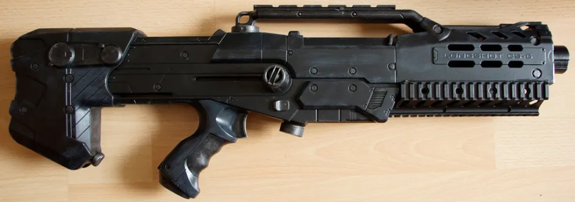

# Уровень 5: Механика и динамика

Данный пост — перевод пятой статьи из [курса лекций «Принципы гейм-дизайна»](http://gamedesignconcepts.wordpress.com/) за авторством профессионала и преподавателя [Яна Шрайбера](http://www.gamasutra.com/view/authors/916452/Ian_Schreiber.php). Переводы предыдущих лекций вы можете посмотреть по [ссылке](index.md).

До этого мы с вами придумывали много игр и правил игры, но мы не пытались выяснить, чем _хорошее_ правило отличается от _плохого_. И не рассматривали разные виды правил, из которых складывается палитра дизайнера. И не говорили о том, как связаны правила игры и впечатления от игры. Как раз это мы и рассмотрим сегодня.

_Объявление_

Никаких особо важных объявлений сегодня нет, но если вам любопытно, я собрал список твитов о прошлом задании (добавить или заменить правило _«Морского боя»,_ сделав игру интереснее):

— «обнаружение» было общей темой (например, вместо выстрела, узнать число попаданий в квадрат 3х3 – таким образом, мы превращаем игру из «какое число я задумал?» в «кто из нас двоих лучший сапёр?»).

— пропуск нескольких ходов для массированного удара (например, пропустить 5 ходов, чтобы поразить всё в поле 3х3). Оригинальное предложение было равноценным (пропуск 9 ходов, чтобы разбомбить поле 3х3), но обратите внимание, что функциональной разницы между таким выжиданием и просто одним выстрелом на одном ходу нет никакой.

— как в го: если окружаешь определённый сектор серией выстрелов, все корабли в этом секторе объявляются поражёнными (это добавляет элемент риска и противопоставляет быстрый и медленный подходы к игре: пытаться окружить большой участок, на что уйдёт много ходов, но что даст отличный результат попаданий, или сконцентрироваться на небольших участках и получать информацию сразу (хоть на её сбор и уходит, в итоге, больше времени).

— когда вы промахиваетесь, но попадаете в квадрат, смежный с вражеским кораблём, ваш противник должен объявить, что вы «почти попали» (без указания на то, в каком направлении искать ваш корабль). Это нововведение не затрагивает природу игры («игра в догадки»), но ускоряет её, давая дополнительную информацию. Кроме того, при любом промахе можно давать расстояние в клетках до ближайшего корабля (без указания направления), что позволит использовать дедукцию.

— пропустить (7 — х) ходов, чтобы восстановить потопленный корабль размера х. Если в место, где вы строите корабль, произошло попадание, восстановление отменяется (оригинальное предложение – пропустить х ходов, чтобы восстановить корабль размером с х, но маленькие корабли, на самом деле, опаснее, ведь их труднее обнаружить, так что я бы предложил сделать зависимость между стоимостью корабля и его размером обратной).

— каждый раз, когда вы топите вражеский корабль, вы можете восстановить свой корабль того же размера, который был потоплен ранее (это продлевает игру и предполагает альтернативные стратегии: например, делать выстрелы вразброс, чтобы не дать противнику места на восстановление).

— один раз за игру ваш корабль (4 клетки) может поразить область размером в 5 клеток (крестообразной формы) на одном ходу; использовав такой ход вы также засчитываете одно попадание в свой корабль (заметьте, это выдаёт расположение вашего корабля, так что такой ход подходит для «возмездия» за уже почти затопленный корабль).

Мы ещё вернёмся к некоторым из этих правил, когда будем говорить о решениях, которые мы принимаем во время игры.

_Чтение_

На этой неделе я решил попробовать что-то новенькое, поэтому одну вещь для чтения я предлагаю в начале занятия. Мне бы хотелось, чтобы вы сначала ознакомились с ней, а уже потом приступали к тексту моего поста.

[_MDA Framework_](http://www.cs.northwestern.edu/~hunicke/MDA.pdf) ЛеБланка, Ханика и Зейбека (перевод можно найти [здесь](mde-formal_nyy-podhod-k-geym-dizaynu-i.md)). Это одна из немногих научных работ, которая стала широко известна в гейм-индустрии (возможно, благодаря тому, что её авторы – опытные гейм-дизайнеры). В этой статье есть две вещи, которые объясняют её влияние и авторитетность. Первая – это разработка принципов механики/динамики/эстетики (МДЭ), которая предлагает взгляд на отношения между правилами и впечатлением от игры, а также на отношения между игроком и дизайнером. Второе, на что стоит обратить внимание это «8 видов интересного», к чему мы ещё вернёмся позже (в четверг на следующей неделе).

_А теперь про МДЭ-структуру_

ЛеБланк сотоварищи очерчивает понятие игры в рамках её механики, динамики и эстетики:

— Механика является синонимом «правил» игры. Это ограничения, в рамках которых функционирует игра. Как готовится к игре? Какие действия могут совершать игроки? Как эти действия отражаются на состоянии игры? Когда заканчивается игра, как определяется её исход? Всё это определяется механикой.

— Динамика описывает ход игры, когда правила начали действовать. Какие стратегии порождаются правилами? Как взаимодействуют  друг с другом игроки?

— Эстетика (в контексте этой системы) не относится к визуальным элементам игры, а скорее, к впечатлению от игры, эффекту, который игра оказывает на игроков. Интересна ли она? Угнетающая, скучная или увлекательная? Захватывает ли игра эмоционально или интеллектуально?

До того, как была написана МДЭ-структура, термины «механика» и «динамика» уже имели хождение среди дизайнеров. Термин «эстетика» в таком смысле не использовался, но в последние годы употребляется всё чаще.

_Процесс дизайна_

Теперь, когда определения даны, почему всё это так важно? Это один из ключевых моментов в статье об МДЭ. Гейм-дизайнер непосредственно создает только механику. Динамика возникает из механики, а эстетика – из динамики. Гейм-дизайнер может _хотеть_ создать впечатление от игры, или это может стать даже его конечной целью… но будучи дизайнерами, мы обречены на создание правил игры и надежду на то, что желанное впечатление от игры станет следствием этих правил.

Вот почему гейм-дизайн иногда называют задачей дизайна второго порядка: мы не разрабатываем решение, мы разрабатываем нечто, что создаёт что-то, что даст решение. **Вот почему гейм-дизайн это так трудно.** По крайней мере, это одна из причин. Дизайн – это не просто поиск «Потрясающей Идеи» для игры, это разработка правил, которые воплотят вашу идею, в ситуации, где на две трети конечного продукта (динамику и эстетику) вы даже не можете прямо повлиять.

_Ход игры_

Дизайнеры начинают с механики и следуют за её развитием в эстетику. Вы можете представить игру в виде сферы, где ядром является механика, вокруг неё располагается динамика, а эстетика находится на поверхности, и каждый уровень нарастает на предыдущем. Однако авторы МДЭ подчеркивают, что с точки зрения игрока игры выглядят _не так._

Сначала игрок видит поверхность – эстетику. Он может _знать о существовании_ механики и динамики, но непосредственное впечатление оказывает эстетика, к тому же, её проще понять. Вот почему _кто угодно_, совершенно не имеющий представления о гейм-дизайне, может сыграть в игру и сказать, интересно ли было. Возможно, этот кто-то не будет знать, как объяснить, _почему_ было интересно, и _что именно_ делает игру «хорошей» или «плохой»… но любой сможет сразу сказать вам, какое у него сложилось впечатление от игры.

Если игрок проведёт за игрой больше времени, он может оценить её динамику и теперь она будет оказывать на него впечатление. Он может понимать, что игра ему нравится или не нравится из-за каких-то конкретных взаимодействий с игрой и/или другими игроками. А если он проведёт за игрой ещё больше времени, в конце концов, он сможет разглядеть механику, которая порождает динамику.

То есть, если игра – это сфера, которая конструируется изнутри вовне, то играется она снаружи вовнутрь. И это, как мне кажется, и есть основная мысль МДЭ. Дизайнер создаёт механику, и из неё всё проистекает вовне. Игрок переживает впечатление, а затем его опыт стремиться вглубь. Как дизайнеры, мы должны помнить про **оба** этих вида взаимодействия с игрой. Иначе мы будем создавать игры, которые интересны для дизайнеров, но не для игроков.

**Пример МДЭ в действии**

Я уже говорил о «кемперстве» в одной из предыдущих лекций, для иллюстрации того, как игроки с разными подразумеваемыми правилами могут бросаться обвинениями в «читерстве» за что-то, что технически разрешено правилами игры. Давайте проанализируем явление в контексте МДЭ.

Шутеры от первого лица обычно имеют механику «точек респауна» — определённых мест на карте, где они появляются снова, после того, как были убиты. Точки реаспауна – это **механика.** Это приводит к **динамике**, когда игрок может устраивать засаду напротив точки респауна и тут же убивать любого, как только он возродится. И, наконец, **эстетикой** здесь, скорее всего, будет раздражение от перспективы вернуться в игру только для того, чтобы немедленно быть убитым снова.

Представим, что вы разрабатываете новый шутер от первого лица и замечаете эту раздражающую эстетику в своей игре, вы хотите её исправить, чтобы игра не раздражала. Вы не можете просто изменить эстетику игры «чтобы она стала интереснее» — это может быть вашей целью, но вы не можете контролировать это напрямую. Напрямую вы даже не можете взаимодействовать с динамикой кемперства; вы не можете диктовать игрокам, как им взаимодействовать с игрой – только через механику. То есть, вы должны изменить механику игры – возможно, попробовать возрождать игроков в случайных местах, а не в специальных точках – и надеяться, что нужная эстетика возникнет из этих изменений в механике.

Как узнать, что ваши исправления сработали? Конечно же, протестировать игру!

Как узнать, _что именно_ поменять, если изменения механики так непредсказуемы? К концу курса мы доберёмся до основных хитростей и уловок. А пока самая очевидная из них – дизайнерская интуиция. Чем больше практики, чем больше игр разработано, чем больше правил изменено и протестировано, чтобы увидеть их результаты, тем лучше у вас будет получаться вносить именно те изменения, которые нужны для решения проблемы… а иногда даже создавать правильную механику сразу. Мало что может заменить вам опыт… именно поэтому я так часто пытаюсь расшевелить вас и заставить делать игры.

**«Если компьютеру гейм-дизайнера веселее, чем игроку, вы совершили ужасную ошибку».**

Сейчас самое время процитировать гейм-дизайнера Сида Мейера. Его предупреждение совершенно очевидно адресовано дизайнерам видеоигр, но также относится и к нецифровым разработкам. Это напоминание, что мы создаём механику игры, и это интересно для нас. Но механика – _не то_, что интересно _игрокам._ Самая распространённая ошибка дизайнера – создание правил, которое интересно выдумывать, но которые совсем не обязательно приводят к интересному игровому сценарию. Всегда помните, что создаёте игры не для себя, а для игроков.

_Механика, динамика и сложность_

Обычно, добавление дополнительной механики, новых систем, дополнительных объектов, новых способов взаимодействия объектов друг с другом (или игроков с игрой) приводит к усложнению динамики игры. Сравните, к примеру, _шахматы_  и _шашки._ В шахматах шесть видов фигур (вместо всего двух) и гораздо больше возможных действий, которые может совершить одна фигура, поэтому стратегия сложнее и глубже.

Усложнение – это хорошо или плохо? Как посмотреть. _Тетрис –_ очень простая, но очень удачная игра. _Advanced Squad Leader_ – невероятно сложная игра, но всё равно её можно считать удачной. Некоторые игры так просты, что нравятся только до определённого возраста, как _Крестики-нолики._ Другие игры так сложны, что им только на пользу пошло бы, если бы их системы были немного упрощены и скруглены (мне приходилось так думать об игре _“Agricola”_; я уверен, вы можете привести примеры из собственного опыта).

Всегда ли усложнение механики приводит к сложной динамике? Нет – есть случаи, когда простая механика создаёт невероятную сложность (те же _шахматы_). А есть другие случаи, когда механика невероятно сложна, а динамика при этом проста (представьте модифицированную версию детской карточной игры  _«Война»_, в которой сравнивается не только старшинство карт, но и сложные таблицы с результатами всех «битв»). Самый лучший способ проверить сложность, как вы уже, наверное, догадались, сыграть.

_Петля обратной связи_

Есть вид динамики, который часто можно встретить в играх и который заслуживает особого внимания. Он известен под названием **петля обратной связи.** Существует два типа таких петель – **позитивная** и **негативная.** Эти термины позаимствованы из других сфер, таких, как системы управления и биология, но в играх они обозначают то же самое явление.

Позитивную петлю обратной связи можно рассматривать как взаимоукрепляющее отношение. Что-то случается, что вызывает повтор одного и того же события снова и снова, с возрастающим эффектом после каждого цикла. Как снежный ком, которой начинается с маленького комочка на вершине холма, а затем становится всё больше и набирает скорость, пока катится и подбирает всё больше снега.

Вот, например, относительно непримечательная «стрелялка» для «Nintendo» под названием _The Guardian Legend._ Если вы победите в игре один раз, у вас появляется доступ к особому режиму. В этом режиме в конце каждого уровня вы награждаетесь различными бонусами, зависящими от количества набранных очков: чем больше очков, тем больше бонусов на следующем уровне. Это позитивная петля обратной связи: зарабатываете больше очков, получаете больше бонусов, в результате вам проще набрать ещё больше очков на следующем уровне, что даёт вам ещё больше бонусов и так далее.

Обратите внимание, обратная ситуация работает так же: допустим, вы набрали мало очков. Тогда у вас меньше бонусов в конце уровня, и тогда вам труднее хорошо пройти следующий уровень, что значит – вы наберёте ещё меньше очков и так далее, пока вы не отстанете настолько, что продвижение вперёд станет почти невозможным.

Люди часто путаются в этом моменте, но _оба_ эти случая – примеры _позитивной_ петли. Это кажется нелогичным, ведь второй пример кажется очень негативным, ведь игроку всё плохо удаётся, и он получает мало наград. «Позитивность» здесь заключается в том, что эффект возрастает с каждым циклом.

У позитивных петель обратной связи есть три свойства, о которых должны знать дизайнеры:

1.  Они дестабилизируют игру, потому что один игрок становится всё успешнее и успешнее (или неуспешнее).
2.  Из-за них игры заканчиваются быстрей.
3.  Они выдвигают на первый план ранние стадии игры, так как эффект от решений, принятых тогда, всё увеличивается.

Обычно у позитивных петель две ступени (как в примере с _The Guardian Legend_), но может быть и больше. Например, в некоторых стратегиях в реальном времени существуют позитивные петли из четырёх ступеней: игроки исследуют карту, что даёт им доступ к большему количеству ресурсов, что позволяет им купить лучшие технологии, что позволяет им строить лучшие юниты, что позволяет исследовать эффективнее (что даёт им доступ к большему количеству ресурсов… и цикл повторяется). В таком виде обнаружить петлю не всегда просто.

Вот ещё несколько примеров позитивных петель обратной связи, которые могут быть вам знакомы:

— большинство глобальных стратегий, таких как _Civilization_ и _Master of Orion_, обычно построены вокруг позитивных петель обратной связи. Когда вы развиваете свою цивилизацию, это позволяет вам генерировать ресурсы быстрее, что позволяет развиваться быстрей. К тому времени, как вы всерьёз вступаете в конфликт со своими противниками, один из игроков уже, как правило, так далеко впереди, что меряться силами уже нет смысла, потому что если базовой движущей силой игры является позитивная петля, это значит, что тот, кому удалось вырваться вперёд на первом круге, будет _намного_ опережать своих соперников в дальнейшем.

\-настольные игры, механика которых включает построение, как _Settlers of Catan._ В этих играх игроки используют ресурсы, чтобы улучшить производство ресурсов, чтобы добывать ещё больше ресурсов.

— спортивная игра регби тоже имеет позитивную петлю – когда команда зарабатывает очко, мяч возвращается в игру в их руках, что чуть-чуть увеличивает вероятность того, что они снова забьют гол. Таким образом, преимущество в игре отдаётся команде, которая только что его и так получила. Это отличает регби от большинства других видов спорта, где после добытого очка мяч отдаётся команде-противнику.

Негативные петли обратной связи, совершенно предсказуемо, – почти полная противоположность позитивным. Негативная петля обратной связи имеет уравновешивающее действие. Когда в игре что-то происходит (например, один игрок получает преимущество над другими), действие негативной петли направлено на то, чтобы снизить вероятность повторения этого события. Если один игрок вырывается вперёд, негативная петля помогает соперникам догнать его (и мешает выигрывающему увеличить отрыв).

В качестве примера рассмотрим гоночную игру вроде _Mario Kart._ В гонках игра гораздо интереснее, если ты находишься в гуще машин, а не когда ты вырвался далеко вперёд или тащишься где-то в хвосте за остальными (ведь если соперники поблизости, с ними можно взаимодействовать). В результате, уже стало правилом добавлять в такие игры негативную петлю обратной связи: когда игрок уходит в отрыв от всех остальных, противникам даются читы, они находят лучшие бонусы и получают невероятные ускорения, чтобы догнать лидера. Это мешает игроку увеличивать или удерживать преимущество. Такой вид петли иногда называют «связкой на резине», потому что машины ведут себя так, будто связаны резиновыми лентами, которые тянут и отстающих, и лидеров в гущу машин.

Как и в предыдущем примере, обратная ситуация также существует. Если игрок отстаёт, он будет находить лучшие бонусы, чем его соперники, а они будут замедляться, чтобы он мог их догнать. Так, игроку, который отстал, трудно отставать ещё больше. И снова оба примера – негативные петли; «негативные» в смысле динамики, которая становится слабее с каждым циклом, что не имеет никакого отношения к тому, позитивно или негативно она сказывается на положении игрока в игре.

У негативных петель обратной связи также есть три важных качества:

1.  Они стабилизируют игру, выравнивая игроков.
2.  Они удлиняют игру.
3.  Они выдвигают на первый план финальные стадии игры, так как последствия ранее принятых решений сходят на нет в ходе игры.

Вот несколько примеров негативных петель:

— большинство спортивных игр, например, футбол или баскетбол: когда команда забивает мяч, он отдаётся команде-противнику, и у них возрастают шансы забить на этот раз. Вероятность того, что одна команда будет забивать гол снова и снова уменьшается.

— настольная игра _Starfarers of Catan,_также имеет негативную петлю: каждый игрок, с количеством очков ниже определённого числа, получает бесплатный ресурс на своем ходу. В самом начале ресурс даётся всем игрокам, и это ускоряет ход игры. Позднее, когда некоторые игроки вырываются вперёд и пересекают определённый порог очков, отстающие игроки продолжают получать бонусные ресурсы. Так отстающим легче догнать лидеров.

— мой дед неплохо играл в шахматы – определённо лучше, чем его дети, которых он учил играть. Чтобы было интереснее, он выдумал правило: если он побеждал, в следующий раз его противник мог убрать с доски одну из его фигур в начале партии (сначала пешку, потом две пешки, затем коня или слона и так далее, если дети продолжали проигрывать). Каждый раз, когда мой дед побеждал, следующая игра становилась для него сложнее, повышая вероятность того, что он, наконец, проиграет.

_Использование петель обратной связи_

Хорошо это или плохо? Нам надо стремиться к тому, чтобы их использовать или надо их избегать? Как и с большинством аспектов в гейм-дизайне, всё зависит от ситуации. Иногда дизайнер сознательно добавляет механику, которая вызывает петлю обратной связи. А бывает, когда петля обнаруживается в ходе тестирования, и тогда дизайнер должен решить, что с ней делать (и делать ли что-то вообще).

Позитивные петли могут быть очень полезными. Они быстро завершают игру, когда намечается победитель, и окончание игры не затянуто. С другой стороны, иногда позитивные петли могут угнетать других игроков, которые стараются догнать лидера, но чувствуют, что у них больше нет шансов.

Негативные петли также могут быть полезными, например, чтобы предотвратить описанную выше ситуацию и внушить игрокам, что у них всегда есть шанс на победу. С другой стороны, они тоже могут угнетать: игрокам, преуспевшим в начале игры, может казаться, что их наказывают за успех, в то время, как игроки, которые плелись в хвосте, вознаграждаются за плохую игру.

Так что же делает каждую отдельно взятую петлю «хорошей» или «плохой» с точки зрения игрока? Это спорный вопрос, но я думаю, что в большой мере это зависит от того, как игрок понимает справедливость. Если кажется, что в игру искусственно вмешиваются и помогают игроку победить, когда он этого не заслуживает, это может восприниматься игроками негативно. Как узнать, как игроки воспринимают игру? Протестировать, конечно.

_Устранение петель обратной связи_

Допустим, вы обнаружили петлю обратной связи в своей игре и вы хотите её убрать. Как это сделать? Есть два способа.

Во-первых, можно просто отключить саму петлю. У всех петель (и позитивных, и негативных) есть три компонента:

— «сенсор», отслеживающий состояние игры;

— «компаратор», который решает, предпринять ли действие, основываясь на данных, собранных сенсором;

— «активатор», который вносит изменения в состояние игры, когда компаратор решает, что это надо сделать.

Например, в приведённом выше примере негативной петли в гоночной игре, «сенсор» — это расстояние, на которое игрок вырвался вперёд или отстал от основной массы участников; «компаратор» — проверяет, превысило ли это расстояние некое пороговое значение; «активатор» заставляет остальные машины соответственно ускориться или притормозить, если игрок слишком преуспел или отстал. Все они могут быть частью одной механики («Если игрок оторвался от соперников больше, чем на 300 метров, умножить скорость всех остальных игроков на 150%»). В других случаях сенсор, активатор и компаратор могут быть частью трёх или более различных механик, которые вызывают петлю, и если изменить любую из них, изменятся и свойства петли.

Зная, какая механика вызывает петлю обратной связи, вы можете прервать её либо убрав сенсор, либо изменив или убрав компаратор, либо преобразовав или устранив действие активатора. Возвращаясь к нашему примеру с _The Guardian Legend_ (больше очков = больше бонусов на следующем уровне), вы можете деактивировать позитивную петлю обратной связи либо модифицировав сенсор (измерять что-то другое вместо очков… какой-то параметр, который не увеличивается пропорционально «подпитке» персонажа бонусами), или изменив компаратор (изменив необходимое количество очков, чтобы дальше бонусы стоили всё дороже и дороже, вы обеспечивает, что , в конце концов, даже лучшие игроки не поспеют за петлей, что приведёт к более трудной финальной битве), или изменив активатор (возможно, игрок будет получить бонусы совершенно другим способом, например, получая какой-то определённый набор бонусов в конце уровня, или находя их во время прохождения уровня).

Если вы не хотите устранять из игры петлю обратной связи, но хотите уменьшить её эффект, можно добавить другую петлю противоположного типа. Снова возвращаясь к примеру с гонкой, если вы хотите оставить негативную петлю «связки на резине», вы можете добавить позитивную петлю, которая её уравновесит. Например, если машины соперников получают ускорение, когда один игрок их опережает, возможно, лидер тоже будет ускоряться, следовательно, появление лидера ускоряет всю гонку (но никому не добавляет ни преимущества, ни помехи). Или, возможно, лидирующий игрок может находить лучшие бонусы, чтобы компенсировать ускорение своих соперников.

_Возникающие компоненты_

Другая разновидность динамики, о которой стоит знать гейм-дизайнерам называется **возникающим сценарием** (или **возникающей сложностью**, или просто **возникающими компонентами**). Мне было сложно объяснить эту вещь студентам в аудитории, так что я буду благодарен за помощь и подсказки. Обычно слова «возникающие компоненты» применяют к играм с простой механикой, но сложной динамикой.  Выражение «возникающая сложность» может быть использовано применительно к любой системе, не обязательно игровой.

Некоторые примеры возникающих компонентов из неигрового мира:

— в природе колонии насекомых (пчёл и муравьёв) обнаруживают такое сложное поведение, что оно может показаться разумным, и тогда мы говорим о «коллективном разуме» (в основном, благодаря многочисленным писателям-фантастам, использующим это выражение). В действительности же, каждая отдельная особь просто следует своему очень нехитрому набору правил, и только взятая вместе колония обладает видимостью сложного поведения.

—  [игра «Жизнь» Джона Конвея](https://ru.wikipedia.org/wiki/%D0%96%D0%B8%D0%B7%D0%BD%D1%8C_(%D0%B8%D0%B3%D1%80%D0%B0)), хоть и не совсем подходит под определения «игры», которое дают большинство авторов, упомянутых в нашем курсе, представляет собой простой набор последовательных правил для симуляции клеточной жизни на сетке из квадратов. Каждая клетка является «живой» или «мёртвой» в заданный момент времени («поколение»). Чтобы перейти к следующему поколению, все живые клетки, которые соседствуют с нулем или с одной другой живой клеткой погибают (от изоляции), а живые клетки, смежные с четырьмя или более, также погибают (от перенаселения); все мёртвые клетки, смежные с тремя живыми клетками «рождаются» и превращаются в живые клетки в следующем «поколении», а каждая клетка, смежная с двумя другими остаётся без изменений. Вот и все правила. Вы начинаете с какого-то начального набора, на ваш выбор, а затем меняете поле, чтобы посмотреть, что выйдет. И всё же, у вас может получиться очень сложное поведение: структуры могут двигаться, мутировать, порождать новые структуры, и ещё много всего.

— [алгоритм бойдов](http://www.red3d.com/cwr/boids/) – способ симуляции толпы или стадного поведения, который используется в фильмах с компьютерной графикой, а также в играх. Есть всего три простых правила, которых должна придерживаться каждая особь в стаде. Во-первых, если с одной стороны от тебя много твоих товарищей, а с другой – мало, вероятно, ты находишься на краю стада; двигайся к своим товарищам. Во-вторых, если вы близко к своим товарищам, не напирайте на них, дайте им немного свободного пространства. В-третьих, подстраивайте свою скорость и направление, чтобы быть вровень со своими ближайшими товарищами. Из этих простых правил может выйти очень сложное, детализированное и реалистичное движение толпы.

Вот несколько примеров возникающего игрового сценария:

— в играх о рукопашном бое, таких как _Street Fighter_ или _Tekken,_ существует так называемый эффект «комбо», который возникает из сочетания нескольких простых правил: определённые атаки оглушают противника, так что он не может ответить, поэтому последующие атаки выполняются быстро одна за другой, пока противник не опомнился. Дизайнеры могут добавлять эффект комбо в свою игру сознательно, либо нет (самые первые примеры такого рода действительно открылись уже после того, как игры были выпущены и игроки успели поиграть в них некоторое время), но именно механики оглушения и скорости атаки создают сложную серию ударов, от которых невозможно защититься, после того, как первый удар нанесён.

— в правилах баскетбола изначально не была прописана характерная техника ведения мяча. Задуманная автором, игра выглядела очень похожей на нынешний алтимат (с диском-фрисби): игроку с мячом не разрешалось двигаться, он должен либо бросить мяч в сторону корзины (пытаясь забить), либо передать мяч товарищу по команде (по воздуху или бросив так, чтобы мяч отскочил от земли). Просто не было правила, запрещающего игроку, передавать мяч самому себе.

— дебюты в шахматах. Правила игры весьма просты: шесть видов фигур и несколько ходов для особых случаев, но набор стандартных дебютов возник из многократного повторения.

Что даёт нам возникающая динамика? Очень часто она желательна по практическим причинам, особенно в видеоиграх, ведь тогда можно получить разнообразный и глубокий сценарий из относительно простой механики. В видеоиграх (и в меньшей степени – в настольных) именно механику нужно воплощать. Когда вы программируете видеоигру, возникающий сценарий даёт вам отличное соотношение часов сценария к строкам кода. Из-за этой очевидной экономии, «возникающие компоненты» были модным выражением несколько лет назад, и я всё ещё слышу упоминания о них время от времени.

Важно помнить, что возникающие компоненты не всегда запланированы, и по этой причине не всегда желательны. Вот два примера возникающих компонентов, оба из серии игр _Grand Theft Auto,_ где возникающий сценарий приводит к спорным результатам:

— рассмотрим такие два правила. Во-первых, если переехать пешехода транспортным средством, из него «выпадут» деньги, которые он имел при себе. Во-вторых, если нанять проститутку, здоровье игрока восполняется, но это стоит игроку денег. Из этих двух не связанных правил появилась стратегия, названная мягко – «эксплуатация»: переспать с проституткой, а потом переехать её и, таким образом, вернуть потраченные деньги. Это вызвало большой скандал в прессе: люди восприняли эту динамику как преднамеренно сконструированную, чтобы пропагандировать насилие против работниц секс-индустрии. Просто сказать: «Это возникающий сценарий!» недостаточно, чтобы успокоить непрофессионалов, которые считают, что это было сделано умышленно.

— пожалуй, более забавно сочетание двух других правил. Во-первых, если игрок причинит вред ни в чём не повинному прохожему, тот (совершенно предсказуемо), станет защищаться и нападёт на игрока. Во-вторых, если транспортное средство сильно повредить, в результате оно взорвётся, нанося повреждения всему, что находится поблизости (включая водителя, разумеется). Это привело к следующему совершенно неправдоподобному сценарию: игрок на побитой машине врезается во что-либо недалеко от группы прохожих. Машина взрывается. Игрок выползает из-под обломков, чуть живой… и тут толпа «добрых самаритян» решает, что взрыв причинил им вред, собирается в кучу и добивает игрока!

Как вы видите, возникающие компоненты – это не всегда хорошо. Что ещё важнее: разрабатывать игру с возникающими компонентами далеко не всегда дешевле. Из-за своей сложной динамики они требуют гораздо больше тестирований и прогонов, чем игры с прямой связью между механикой и динамикой. Возможно, игру с возникающим сценарием проще программировать, но её гораздо сложнее придумать. Она не экономит деньги: она просто обходится дешевле программистам, но дороже – дизайнерам.

_От возникающего – к преднамеренному_

Намерения игрока – понятие из [_Formal Abstract Design Tools_](formal_nye-abstraktnye-instrumenty.md) Чёрча, которое я уже приводил в ходе этого курса, в некотором роде связано с возникающими компонентами. В основном, возникающие компоненты появляются из множества простых, не связанных друг с другом систем. Если игрок может обнаружить эти системы и использовать, чтобы преднамеренно создать сложную цепь событий – это один из способов добиться от игрока большего уровня сознательности и мотивированности.

_Ещё для чтения_

[_Designing to Promote Intentional Play_](http://clicknothing.typepad.com/Design/hockingc_GDC06_Intentionality.zip) Клинта Хокинга. Это лекция, которую он прочёл в 2006 году на конференции гейм-дизайнеров, и любезно предоставил слайды презентации и тезисы доклада в доступ для скачивания в своём блоге. Там он объясняет понятие «намерений игрока» и их взаимосвязь с возникающими компонентами гораздо лучше, чем я могу сделать это здесь. Ссылка ведёт на архив, содержащий несколько файлов. Начните с PowerPoint презентации и сопутствующего документа Word с заметками, и тогда вы будете подготовлены к информации, которую даёт видео и другие файлы. Я предупреждаю вас, что, как свойственно многим гейм-дизайнерам, Клинт склонен к нецензурным выражениям; кроме того презентация начинается с шутки про Иисуса и Моисея. Может быть, лучше пропустить этот слайд, если рядом с вами люди, которые находят такие вещи оскорбительными.

_Чему мы научились?_

Самое важное, что следует вынести из сегодняшней лекции: гейм-дизайн — непростое занятие. Это сложно, в основном, из-за природы МДЭ. Дизайнер создаёт правила, которые формируют игру, которая производит впечатление на игрока. Каждое созданное правило оказывает непрямое, дважды преломлённое действие на игрока, а это трудно предсказать и контролировать. Также это объясняет, почему одно маленькое изменение в правилах может создать эффект кругов на воде и разительно изменить всю игру. При этом, главным заданием дизайнера остаётся создание приятного впечатления у игрока.

Вот почему так важно тестировать игру. Это самый эффективный способ определить, в какой степени изменение правил повлияло на игру, если вы не уверены в этом.

_Домашняя забава_

Сегодня мы с вами потренируемся в прогоне готового дизайна, а не будем начинать всё с нуля. Я хочу, чтобы вы на собственном опыте убедились, как меняется игра, если внести изменения в механику.

Вот правила упрощённого варианта игры в кости под названием «Блеф» (также известной как «Лжец», но которая для большинства людей – «та странная игра с кубиками, в которую играли во вторых «Пиратах Карибского моря»):

— Игроки: 2 или более, лучше всего 4-6.

— Задача: стать последним игроком, у которого останутся игральные кости.

\-Подготовка к игре: все игроки берут по 5 шестигранных костей. Хорошо, если у каждого игрока будет что-то, чем можно эти кости прикрыть, например, непрозрачная чашка, но игроки могут просто заслонять кости рукой. Все игроки бросают кости так, что каждый видит только свои, но не видит кости других игроков. Выбирают игрока, который ходит первым. Этот игрок должен сделать ставку:

— Ставки: «ставка» — это догадка игрока, о том, какие значения кости показывают _у всех игроков._ Кость, показывающая 1, считается «дикой» и может быть любым другим номером. Вы не можете делать ставку на единицы, только на двойки и выше до шести. Например, три «четвёрки» значит, что среди костей, выпавших у всех игроков, по крайней мере, три показывают 4 (или единицу).

— Повышение ставки: чтобы поднять ставку, новая должна быть выше предыдущей. Повышение числа костей всегда большая ставка, независимо от выпавшего числа (девять «двоек» — ставка большая, чем восемь «шестёрок»). Повышение выпавшего числа – большая ставка, при условии, что число костей остаётся прежним, либо больше прежней ставки (восемь «шестёрок» — ставка большая, чем восемь «пятёрок», обе выше, чем восемь «четвёрок»).

— Ход игры: на своём ходу игрок может поднять текущую ставку, или, если он думает, что предыдущая неправильная, он может поставить её под сомнение. Если он поднимает ставку, ход переходит к следующему игроку по часовой стрелке. Если ставка под сомнением, тур заканчивается, все игроки отрывают свои кости, определяется результат.

— Окончание тура: если в ставке засомневались, а она оказалась верной (например, если ставка – девять «пятёрок», а у игроков одиннадцать единиц и пятёрок в общей сложности, их действительно, есть хотя бы девять), игрок, поставивший ставку под сомнение, проигрывает и теряет одну из игральных костей. В последующих турах он будет бросать меньше костей. Если в ставке засомневались справедливо (например, если ставка была – девять «пятёрок», а на самом деле есть только восемь пятёрок с единицами), игрок, сделавший неверную ставку, проигрывает и лишается одной из своих игральных костей. Затем все игроки снова бросают свои кости, и игра продолжается с новой ставкой, начиная с игрока, выигравшего предыдущий раунд.

— Завершение игры: когда игрок проигрывает все кости, он выбывает из игры. Когда все игроки (кроме одного) проигрывают все кости, последний оставшийся – победитель.

Если у вас нет кубиков, чтобы играть в эту игру, вы можете сыграть в вариацию: доставать карты из колоды, тянуть бумажки с написанными на них номерами от 1 до 6 из коробочки со множеством таких бумажек.

Если у вас не хватает для игры друзей – постарайтесь их найти. Если у вас будут люди, которые станут охотно играть с вами, вы гораздо проще справитесь с заданиями по тестированию игр в ходе этого курса.

Так или иначе, ваша первостепенная задача **поиграть в эту игру.** Обратите особое внимание на динамику и на то, как она вытекает из механики. Вы видите, как игроки блефуют, делают неправдоподобно высокие ставки, пытаясь убедить противников, что у них выпало больше каких-то чисел, чем на самом деле? Они не решаются поставить ставку под сомнение, зная, что это рискованно и оттягивают этот момент до тех пор, пока не засомневаются в их собственной ставке? Кто-нибудь из игроков пытается просчитать вероятности и использовать эти результаты, чтобы сделать ставку? Замечаете ли вы какие-либо петли обратной связи в игре – то есть, например, если игрок совершает ошибку и теряет кость, увеличивается или уменьшается вероятность того, что он снова проиграет в следующем раунде, учитывая то, что у него остаётся меньше костей, а, следовательно, меньше информации, на которую можно опираться, делая ставку?

Ну ладно, последний вопрос уже содержал ответ – да, в этой игре есть позитивная петля обратной связи. Эффект невелик, и заметен обычно только к концу игры, когда у одного игрока три или больше игральных кости, а у его противников – по одной. Всё равно, у нас, как у дизайнеров, есть возможность с этим повозиться.

Следующим вашим шагом будет **добавить, убрать или изменить одно правило, чтобы убрать эффект позитивной петли обратной связи.** Почему вы выбрали то, что выбрали? Чего вы хотели добиться – как должна поменяться динамика в ответ на изменение правил? Запишите свой прогноз.

А потом **снова сыграйте в игру** уже с изменёнными правилами. Сработало ли? Возникли ли какие-то побочные эффекты, которых вы не ждали? Как _на самом деле_ поменялась динамика? Будьте честными, не бойтесь, если ваш прогноз оказался неточным. Весь смысл процесса в том, чтобы вы увидели, насколько трудно предсказать перемены в игровом сценарии, вытекающие из простой замены одного правила, если не проверять всё живой игрой.

Затем **поделитесь своим наблюдением** с товарищами. Я создал [новую страницу](http://gamedesignconcepts.pbworks.com/w/page/11829075/L5%20Homeplay) курса на вики-ресурсе. На этой страницы запишите следующее:

1.  Как вы поменяли правила?
2.  Какой перемены вы ожидали от динамики?
3.  Как она _на самом деле_ поменялась?

Совсем не обязательно вдаваться в детали; пары предложений на каждый пункт будет достаточно.

И наконец, ваше последнее задание (оно обязательно!): **прочесть, по крайней мере, три других ответа.**  Сначала прочтите правила. Не читая дальше, спросите себя: как, по-вашему, должен измениться игровой сценарий? Теперь прочтите прогноз автора и посмотрите, совпал ли он с вашим. Наконец, прочтите, что случилось на самом деле, и оцените, насколько близка к правде была ваша догадка.

Вы можете подписаться или опубликовать информацию анонимно.

_Мини-задание_

Возьмите вашу любимую спортивную игру. Найдите в ней позитивную или негативную петлю обратной связи. Большинство видов спорта имеют хотя бы одну. Предложите изменение в правилах, которое бы устранило петлю. Постарайтесь описать всё, уложившись в 135 символов и опубликуйте в Твиттере в хэштегом #GDCU. Времени – до четверга. Один вид спорта на человека, пожалуйста!

 _Перевод — Ю. Сергеева_