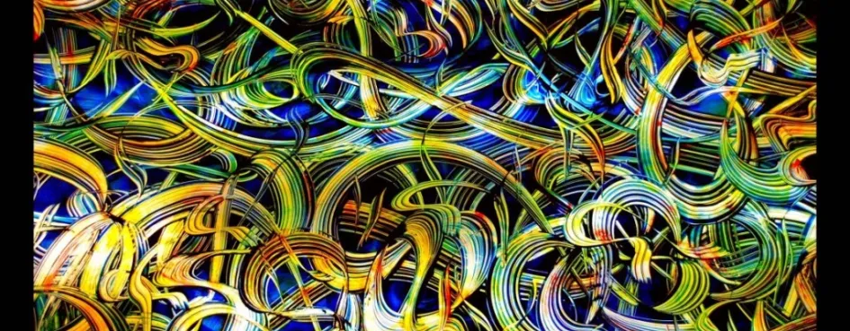

# Уровень 5: Вероятности и случайность в полнейшем беспорядке

Данный пост — перевод пятой статьи из [курса лекций «Принципы игрового баланса»](https://gamebalanceconcepts.wordpress.com/) за авторством профессионала и преподавателя [Яна Шрайбера](http://www.gamasutra.com/view/authors/916452/Ian_Schreiber.php). Переводы предыдущих лекций вы можете посмотреть по [ссылке](index.md).

###  Чтение/Игры

На этой неделе никаких (кроме этой публикации).

### Ответы на вопросы прошлой недели

Если вы хотели сверить ответы на задачи прошлой недели:

#### _Драконьи кости_

Во-первых, обратите внимание, что так называемая «драконья кость» всего лишь замаскированная 1d6+1. Если вы представите, что Дракон – это 7, раз он всегда побеждает, то грани, соответственно будут выглядеть как 2-3-4-5-6-7, так что по сути, вопрос сводится к тому, насколько бонус +1 может повлиять на ваш шанс выбросить больше на кости 1d6. Как оказалось, гораздо сильнее, чем кажется большинству людей!

Если вы выпишите все 36 вероятностей выпадения для 2-7 и 1-6, вы обнаружите, что вы можете проиграть казино 21 одним способом (7-1, 7-2, 7-3, 7-4, 7-5, 7-6, 6-1, 6-2, 6-3, 6-4, 6-5, 5-1, 5-2, 5-3, 5-4, 4-1, 4-2, 4-3, 3-1, 3-2, 2-1), сыграть вничью 5 способами (6-6, 5-5, 4-4, 3-3, 2-2) и победить 10 способами (5-6, 4-5, 4-6, 3-4, 3-5, 3-6, 2-3, 2-4, 2-5, 2-6). Мы не обращаем внимания на ничью, раз она означает переброс, пока кто-нибудь не одержит верх, так что лишь 31 случай завершается победой или поражением. Из них 21 раз вы проигрываете и 10 раз побеждаете, так что эта игра даёт шанс на победу 10 из 31. Другими словами, вы выигрываете чуть реже, чем 1 раз из 3.

#### _Чак-э-лак_

Раз на трёх костях d6 результат может выпасть 216 разными способами, проще будет всё проверить в Excel, а не от руки. Если вы всё рассчитали, вы обнаружили, что если поставить на 1, существует 75 вариантов, при которых выпадает одна победная кость (1-Х-Х, где «Х» — любой из оставшихся проигрышных результатов и таких вариантов может выпасть 25, и ещё Х-1-Х и Х-Х-1 с победой на двух других костях – вместе 75). Аналогично, существует 15 вариантов выбросить две победные кости (1-1-Х, 1-Х-1, Х-1-1, по пять вариантов каждая из трёх = 15), и лишь один вариант тройной победы (1-1-1). Так как все цифры от 1 до 6 имеют равный шанс выпадения, ваши шансы на победу всегда будут такими же, независимо от того, на какую цифру вы поставили.

Чтобы получить предполагаемую цифру, мы умножаем каждый из 216 вариантов на вероятность его выпадения, раз все 216 результатов одинаково вероятны, мы просто сложим их все и разделим на 216, чтобы получить предполагаемый процент выигрыша и проигрыша.

(75 выигрышных вариантов \* $1 выигрыша) + (15 двойных выигрышей \* $2) + (1 тройной выигрыш \* $3) = $108 выигрыша. Раз мы сыграли 216 раз, а 108 – это как раз половина, на первый взгляд, шансы равные, 50/50.

Но не торопитесь! Нам всё ещё осталось подсчитать убытки в случае _проигрыша,_ а проигрываем мы чаще, чем 108 раз. Из 216 вариантов, которые могут выпасть на костях, выигрышными являются только 91, а 125 раз мы проигрываем (разница возникает из-за того, что хотя двойной и тройной выигрыш гораздо ценнее, когда он выпадает на вашу цифру, вариантов выбросить двойную и тройную цифру, _на которую_ _вы не поставили, гораздо больше_). И каждый из этих 125 проигрышей стоит вам $1 убытка.

Сложив всё это, вы получаете $17 предполагаемого _проигрыша_ на 216 бросков. Или предположительный убыток в 7,9 цента, каждый раз, когда вы делаете ставку в $1. Пусть это и не много (7,9 – в буквальном смысле гроши), но не забывайте, что это за каждый доллар! Так что у казино 7,9 % гарантированной прибыли с этой игры – один из худших раскладов для игрока из всех игр, которые предлагает казино.

#### _Роял-флэш_

В этой игре вы тянете 5 карт из 52-карточной колоды, одну за другой. Эти карты должны быть обязательно 10-В-Д-К-Т, но в любой последовательности. Первая карта может быть любой из этих пяти, любой масти, так что когда вы тянете первый раз, есть 20 карт, благодаря которым вы можете в итоге собрать роял-флэш (20 из 52). Второй карте уже необходимо совпасть с первой по масти, так что среди оставшейся в колоде 51 карты уже только 4 вам подходят (4 из 51). Для третьего захода остаются лишь 3 подходящие для роял-флэша карты из 50 оставшихся в колоде (3 из 50). На четвёртый раз остается 2 карты из 49, а последняя карта должна выпасть 1 из 48. Перемножив всё это мы получаем 480 из 311 875 200 или 1 из 649 740. Если вам нужна десятичная дробь, то это 0,0000010 (или, если умножить на 100, чтобы получить проценты, 0,00015% — чуть больше одной десятитысячной процента). Для большинства из нас это значит увидеть «неподдельный» роял-флэш из 5 карт один раз за всю жизнь, если вообще увидеть.

#### _Лотерея IMF_

Если вы заглянете в комментарии за прошлую неделю, то вы увидите, что несколько ребят нашли решение не используя симуляцию «Монте-Карло». Ответ – 45 единиц ресурса, т. е. карта будет оставаться в игре в среднем 10 кругов. Так как у неё 10% шанс покинуть игру на каждом ходу, кажется, что ответ находится интуитивно… но, как мы видим из вероятностей, в большинстве случаев интуиция нас подводит. Так что тот факт, что эта игра решается интуитивно, сам по себе противоречит интуиции.

### Тема этой недели

На прошлой неделе я сделал небольшой перерыв и отошёл от темы баланса в играх, чтобы дать вам ту основу теории вероятности, которую каждый гейм-дизайнер должен знать, чтобы уметь рассчитать основные шансы в игре. Сегодня всё это полетит кувырком, так как я собираюсь показать вам две сферы, где реальные шансы могут невероятно исказиться: человеческая психология и компьютеры.

#### _Человеческая психология_

Когда я говорю «психология», я имею в виду то, что уже вскользь затронул на прошлой неделе: у большинства людей совершенно отсутствует чутьё на подлинные шансы. Так что даже если мы сделаем случайные элементы наших игр абсолютно справедливыми, что, как мы увидим дальше, — не всегда простая задача, пугающее количество игроков будет _воспринимать_ игру как _несправедливую._ Поэтому мы, как гейм-дизайнеры, должны внимательно вникать не только в истинные вероятности, но и в то, как игроки будут воспринимать эти вероятности в наших играх, и насколько это восприятие будет отличаться от истины – чтобы мы могли учитывать это при конструировании нужного нам игрового опыта.

#### _Компьютеры_

Большинство компьютеров – детерминированные машины; сумма единиц и нулей, следующая детерминированным алгоритмам с целью конвертировать один набор единиц и нулей в другой набор единиц и нулей. И тем не менее каким-то чудом мы должны получить _недетерминированное_ значение («случайное число») от детерминированной системы. Для этого нам нужна математическая «ловкость рук», при помощи которой мы получаем так называемые **псевдослучайные** числа: числа, которые вроде как выглядят случайными, даже если на самом деле таковыми не являются. Понимание разницы между случайным и псевдослучайным имеет большое значение для дизайнеров видеоигр, и даже для дизайнеров настольных игр, если они планируют когда-либо создать видеоверсию своей игры (что часто случается с «хитовыми» настольными играми), или если они планируют включить цифровые компоненты в свои настольные игры, в которых присутствует хоть какой-то элемент случайности.

### Но сначала… Везение против мастерства

Прежде чем мы углубимся в психологию и информатику, существует некое подразумеваемое допущение, которое мы по большей части игнорировали на прошлой неделе, но которое тем не менее заслуживает того, чтобы его обсудили и подвергли сомнению. Это допущение о том, что добавив _немного_ случайности мы сделаем игру лучше, но _слишком много_ случайности всегда плохо… и возможно у нас есть некое представление о том, что все игры располагаются на отрезке между двух крайностей «100% мастерства» (такие как шахматы и го) и «100% везения» (_Chutes & Ladders_ или _Candyland_).

Если мы будем рассматривать только эти игры, мы можем даже задуматься о поисках подобного водораздела между казуальными играми и хардкором: чем больше в игре везения, тем более казуальна аудитория; чем больше исход игры зависит от мастерства, тем скорее мы назовём игру «хардкорной».

Однако это справедливо далеко не всегда. Например, в крестиках-ноликах нет никакой случайности, но обычно мы не думаем об этой игре как о требующей большого мастерства. В то же время, каждая раздача в покере в высшей степени случайна, но мы считаем покер игрой, в которой преобладает мастерство. Между тем, игра в блэк-джек тоже случайна, но несмотря на возможность считать карты, мы видим, что это игра больше зависит от везения, чем покер.

Потом есть ещё физический контекст, как в профессиональном спорте. С одной стороны, мы рассматриваем эти игры как состязание в мастерстве. И всё же фанаты отслеживают самую разнообразную статистику игр и игроков, мы говорим о шансах игрока забить гол или пропустить бросок – что угодно, спортивные болельщики _делают денежные_ _ставки_ на исходы игр, как будто это не состязание в мастерстве, а игра случая.

Так в чём же тут дело? Есть несколько объяснений.

#### _Покер и блэк-джек_

Откуда эта разница в восприятии покера и блэк-джека? Разница заключается в том, _когда_ игрок делает ставку, и какое влияние оказывает выбор игрока на исход игры.

В покере успешный игрок просчитывает свои шансы при помощи вычисления вероятности того, что на руках у него выигрышная комбинация, и он учитывает это при совершении ставки, равно как и наблюдает реакцию своих оппонентов. По мере открытия карт игрок подстраивает свою стратегию. Понимание игроком своих шансов и его умение реагировать на их изменение имеет прямое отношение к его успеху в игре.

В блэк-джеке, напротив, вы делаете ставку в самом начале раздачи, прежде, чем узнаете, что за карты вам достались, и как правило, у вас нет возможности «поднимать» ставку или пасовать по мере раскрытия карт.

В блэк-джеке всё же требуется некоторый навык, но он сильно отличается от мастерства игры в покер. Понимание, когда попросить ещё карту или остановиться, когда разбиться на две руки (сплит), когда удвоить ставку, основанное на сумме ваших карт, на картах дилера, на проценте оставшихся в колоде «высоких» карт… всё это «мастерство» в том же смысле, что и в игре «Пакмэн». Вы запоминаете и следуете детерминированной последовательности, но вы не делаете никаких особенно занимательных решений. Вы просто делаете ставку следуя алгоритму и ожидаете, что со временем, вам повезёт, насколько это возможно, учитывая перетасовку колоды. По этой же самой причине, мы не думаем, что казино «умеет» играть в крэпс или рулетку, только потому, что оно выигрывает чаще, чем проигрывает.

#### _Профессиональный спорт_

Как насчёт той проблемы со спортом, когда игра, где всё совершенно очевидно зависит от навыка, каким-то образом якобы имеет элемент случайности? Причина этого парадокса кроется в точке зрения. Если вы зритель, то вы по определению не имеете никакого влияния на исход игры; _относительно вас_ результат – случайное событие. Если вы игрок одной из команд, то будет игра выиграна или проиграна зависит отчасти и от вашего личного уровня мастерства. Именно поэтому спортсменам платят, основываясь на количестве их побед (_для них_ в этом нет случайности и азарта), но болельщики всё равно могут делать ставки на случайный (со их точки зрения) исход игры.

#### _Игры в стиле «экшн»_

Случайность работает несколько иначе в различных видеоиграх в стиле «экшн» (например, типичные шутеры от первого лица), где игроки используют свои навыки уклонения и прицельной стрельбы, чтобы попадать во врагов, а самим избежать поражения. О таких играх мы обычно думаем, что они основаны на мастерстве, и действительно, на первый взгляд кажется, что они ничего общего со случайностью не имеют и иметь не могут. В системе и так достаточно хаоса, безо всяких игральных костей: я стреляю по движущейся цели, я могу попасть или промахнуться в зависимости от целого ряда факторов, за которыми очень трудно уследить. А теперь давайте представим, что дизайнер решил схитрить и добавил небольшое смещение к пуле, выпущенной из дешёвого пистолета, чтобы сделать его не таким точным. Вы наводите прицел на кого-то, вы спускаете курок… и промахиваетесь, просто потому что пуля случайным образом решила забрать правее или левее. Как бы игроку такое понравилось?

Допустим, игрок мог и не заметить. Игра так динамична: вы бежите, цель бежит, вы палите несколько раз, промахиваетесь, думаете, что, видимо, не так хорошо прицелились, как вам казалось (или цель хорошо увернулась). Или, если вы стоите спокойно, подкрадываетесь к жертве со спины, и вы уверены, что прицелились безупречно, и всё равно не попали, вы чувствуете, что игра вас обманула; это вам вряд ли понравится и точно не сделает игру интереснее, вам просто кажется, что вас наказывают за то, что вы меткий стрелок.

Значит ли это, что удача не имеет места в играх в стиле «экш»? Я думаю, вы _могли бы_ увеличить фактор везения, чтобы сравнять шансы, но вам надо делать это с большой осторожностью. Вот обычный пример того, как многие шутеры добавляют в игру больше везения: выстрел в голову. Идея в том, что если вы попадаете кому-либо в голову, а не в туловище, это означает мгновенную смерть (или что-то в этом роде).

Тут вы можете подумать: погодите, это разве не _мастерство_? Вас же вознаграждают за меткость, за то, что вы попали по маленькой цели, вы получаете бонус к урону просто за то, что вы хорошо стреляете… разве нет? В некоторых играх всё так и есть, но во множестве других (особенно тех, что постарше) такая точность в большинстве ситуаций просто невозможна: вы движетесь, цель движется, в голове есть малюсенькая зона поражения, ружье не даёт вам достаточного приближения, чтобы понять, что вы не промажете на пару пикселей… так что по крайней мере с расстояния, попадание в голову – это не то, что большинство игроков могут запланировать. Иногда это происходит случайно, просто потому что вы стреляли в нужную сторону… так что иногда, почти без участия со стороны игрока, происходит попадание в голову. Это немного выравнивает шансы в игре: без выстрела в голову, если в игре требуется много выстрелов на то, чтобы добить врага, более опытные игроки всегда будут выигрывать, потому что они лучше уклоняются, кружат вокруг жертвы и используют другие приёмы, которые позволяют им обойти и обыграть более слабого игрока. Если же в игре существует механика попадания в голову, слабый игрок иногда будет случайно убивать врагов на месте, что повышает вероятность _хоть какого-то_ успеха даже у самого слабого – а вы как дизайнер обычно к этому и стремитесь.

#### _Подстройка везения и мастерства_

Как мы только что убедились, добавить фактор везения в игры в стиле «экшн» – задача хлопотная, но возможная, путём создания всяких маловероятных (но всё же возможных по чистой случайности) событий.

С менее динамичными, более стратегическими играми, добавить везение (или навык) можно более прямо и непосредственно. Если вы хотите увеличить значимость везения в игре:

— Замените некоторые из решений игрока случайными событиями.

— Сократите число случайных событий в игре (таким образом вы ослабите действие закона больших чисел, и случайности не будут распределять всё равномерно).

— Увеличьте _диапазон_ случайных событий, например, замените один бросок шестигранной кости на один бросок двадцатигранной.

— Если хотите увеличить значимость мастерства в игре, просто выполните обратные указанным выше действия.

Каково же «наилучшее» сочетание везения и мастерства в отдельно взятой игре? Это зависит, по большей части от целевой аудитории. Маленькие дети могут не справиться с большим количеством ситуаций выбора между риском и вознаграждением или краткосрочным и долгосрочным компромиссом, но они смогут бросать кубик, вращать вертушку и двигать пешку в нужном направлении. Взрослые, которые любят посоревноваться, и хардкорные геймеры часто предпочитают игры, которые склоняются в сторону мастерства, что даём им возможность показать своё превосходство, но (кроме крайних случаев), склоняются не настолько, чтобы сильного противника _вообще_ невозможно было победить. Люди, играющие время от времени, могут рассматривать игру больше как некое социальное взаимодействие, чем упражнение в стратегическом мышлении, поэтому они предпочитают меньше думать и принимать меньше решений, чтобы посвятить больше своих небезграничных мыслительных способностей беседе с друзьями. Нет единственного правильного ответа, который подходить всем играм; просто поймите, что некое сочетание везения и мастерства подходит именно вашей _конкретной_ игре, и вы, как гейм-дизайнер, должны прислушиваться к своей игре и распределять их там, где они требуются. Иногда это значит, что надо добавить случайности, иногда – что надо её убрать, а иногда – что надо оставить случайность, но поменять её сущность. Инструменты, которые мы освоили на прошлой неделе, должны дать вам достаточно умения, чтобы выявить природу случайности в своей игре, хотя бы в какой-то её части, и внести необходимые изменения.

### А теперь… Человеческая психология

Как мы убедились на прошлой неделе, обычно интуиция подводит людей, когда дело касается расчёта шансов. Вы могли заметить это по _Драконьим костям и Чак-э-лаку_: на интуитивном уровне кажется, что игры дают больше шансов на победу, чем на самом деле. Кроме того, у многих людей просто неправильное представление о том, как работают вероятности, как мы поняли на прошлой неделе, рассмотрев ложный вывод Монте-Карло (ожидание, что предыдущие независимые события, например, броски игральных костей, имеют влияние на вероятность будущих событий). Давайте рассмотрим подробнее все эти ошибки мышления и то, какие последствия они имеют для игры и для гейм-дизайнеров.

#### _Погрешность выборки_

Когда нас просят интуитивно оценить шансы, откуда мы берём эту интуицию? Первым эвристическим методом, к которому прибегнет большинство людей будет попытка вспомнить: легко ли нам удаётся найти в памяти те или иные события? Чем проще нам найти примеры, тем вероятнее, по-нашему, событие. Обычно это даёт неплохие результаты: если вы бросите кость со смещённым центром тяжести несколько сотен раз, и припомните, что номер 4 выпадал чаще остальных, у вас наверняка будет довольно точное представление о том, какова вероятность выпадения четвёрки. Как вы можете догадаться, такая интуиция подводит в случаях, когда редкое событие вспомнить легче, чем обычное.

Почему бывает проще вспомнить редкое событие, а не часто повторяющееся? Для начала, достаточно сильные редкие события обычно производят больше впечатления (я уверен, вы можете _точно_ сказать, где вы были, когда самолёты врезались в небоскрёбы 11 сентября). Иногда мы видим редкие события чаще, чем обычные, из-за медиа. Например, многие люди больше бояться погибнуть в крушении самолёта, чем в автомобильной аварии, даже несмотря на то, что автокатастрофа _гораздо_ более вероятна. Тому есть несколько причин, но одна из них в том, что каждый раз, когда где-то падает самолёт, об этом говорят в новостях по всему миру; автоаварии, напротив, так обычны, что о них никто не сообщает… Поэтому нам проще вспомнить много крушений, чем много автокатастроф. Другой пример – лотерея. Победители лотерей всегда на виду, а миллионы проигравших всегда остаются в тени, что приводит нас к выводу о том, что шанс выиграть в лотерею гораздо выше, чем он есть на самом деле.

Как всё вышесказанное относится к играм? Для начала, мы больше склонны помнить свои триумфальные победы, чем свои унизительные поражения (ещё одна хитрость нашего мозга, чтобы сделать жизнь более сносной). Людям, как правило, кажется, что они выше среднего уровня во многих вещах, так что не имея под рукой твёрдых статистических данных, игроки обычно склонны переоценивать процент своих побед и своё мастерство. Это опасно для игр, где игроки сами устанавливают уровень сложности или выбирают себе противников. Как правило, мы хотим, чтобы определённый процент времени игрок побеждал и соответствующим образом подстраиваем сложность наших игр; если игрок выбирает слишком высокую сложность, ему приходится тяжелее, и он может впасть в уныние. Зная об этом, мы можем попытаться (к примеру) заставить игроков играть с теми, кто соответствует их уровню – через автоматический поиск противника, динамическую подстройку сложности и прочие хитрости.

#### _Погрешность эгоизма_

Есть определённые обстоятельства, когда событие маловероятно, но всё же возможно, и тогда игрок полагает, что оно _гораздо_ более вероятно, чем на самом деле. В докладе Сида Мейера на конференции по гейм-дизайну (GDC) этого года, он по опыту определил нахождение этой точки где-то между 3:1 и 4:1… То есть, если игрок знает, что вероятность возможного выигрыша приблизительно 75-80% или выше, _и они действительно будут выигрывать_ именно в таком проценте случаев, им будет казаться, что это не так, как будто они проигрывают чаще, чем надо. Его тестеры рассчитывали побеждать _практически всегда,_ я бы сказал в 95% случаев, если экран предсказывал им 75-80% вероятность.

В рассуждениях игроков очень часто встречается эта эгоистичная погрешность, которая, вероятно, связана с тем, что я говорил выше о склонности игроков думать, что они лучше других. Поэтому хотя игрокам кажется неправильным, когда они четверть времени проигрывают при предсказанном 75% преимуществе, они _совершенно нормально_ воспринимают ситуацию, когда четверть времени _выигрывают,_ тогда как предсказанная вероятность проигрыша 3:1.

#### _Погрешность отнесения_

В целом игроки гораздо спокойнее воспринимают случайное вознаграждение, чем случайное ограничение или наказание. Что интересно, они очень по-разному интерпретируют эти события.

Когда дело касается случайно полученной награды, игроки склонны относить это на счёт своих заслуг, им кажется, что награда – это плоды их удачных решений и выбранной стратегии игры. Конечно, может, просто так удачно на костях выпало, но ведь кто-то же _решил_ сделать тот или иной выбор, приведший к этому броску, и этот _рассчитанный риск окупился,_ так что совершенно ясно, с их стороны это было правильным решением.

Что же до случайного наказания, игрокам всегда кажется, что причина внешняя – они винят кости, винят карты, они говорят, что им просто не повезло. Если такое происходит слишком часто, они могут даже дойти до заявлений, что им не нравится игра, потому что она _нечестная._ Если они достаточно сильно вовлечены игру на эмоциональном уровне, например, они играют в азартную игру на высокие ставки, они могут даже обвинить других игроков в шулерстве! В видеоиграх логика генерации случайных чисел скрыта, поэтому мы можем наблюдать ещё более странную реакцию игроков. Некоторые на самом деле верят, что ИИ подглядывает в игровые данные, тайком от них меняет цифры и специально жульничает, ведь это же компьютер, теоретически, он может всё это делать.

И вообще, люди очень по-разному справляются с поражениями и победами, как в игре, так и в жизни.

#### _Фиксация_

Ещё один феномен, связанный с искажённым восприятием шансов называется «фиксация». Суть в том, что какое бы число человек ни увидел первым, он на нём зацикливается и переоценивает его значение. Вот к примеру, когда вы заходите в казино и смотрите на первый попавшийся игровой автомат, наверняка самым большим, самым бросающимся в глаза будет число монет, которое вы можете выиграть, если сорвёте джек-пот. И оттого, что люди смотрят на него и концентрируются на нём, оно внушает им мысль, что их шансы на победу выше, чем на самом деле.

Сид Мейер упомянул забавный аспект этого феномена в своём докладе. Тестеры, те самые, которые были довольны, когда проигрывали треть раз при предсказанном преимуществе 2:1 – так как им и было положено, считали, что игра несправедлива, когда им предсказывали преимущество 20:10. Почему? Потому что первым числом, которое они видели, было 20, довольно большое, поэтому им казалось, что у них больше преимущества… и потом оно кажется значительно больше 10, поэтому им казалось, что превосходство подавляющее. (Само собой, если им показать вероятность 10:20 что они проиграют, то они будут довольны одним выигрышем из трёх).

Кроме прочего, это значит, что игрок, у которого, допустим, небольшой базовый урон с кучей бонусов, может недооценивать свои силы.

#### _Ложный вывод Монте-Карло_

Вот мы и вернулись к ложному выводу Монте-Карло, состоящему в том, что люди ожидают от случайных чисел, чтобы они непременно _выглядели_ случайными. Череда одинаковых результатов заставляет игроков переживать и сомневаться, действительно ли номера случайны?

В одной книге мне попалась любопытная статистика: если человека попросить представить себе в уме череду «случайных» результатов орлянки, они окажутся не такими уж и случайными. А именно: если человек перед этим представил себе решку, то с 60% вероятностью он выберет орла для следующего броска, и наоборот (это если вы просто попросите испытуемого _говорить_ «орёл» или «решка» наобум каждый раз, когда вы просите его выдать вам «случайный» результат, а не когда он подбрасывает настоящую монетку). Если вы подбросите монетку всего 10 раз, на самом деле довольно высока вероятность того, что орёл или решка выпадут вам 4 раза подряд (так как вероятность 4 совпадений подряд 1 из 8), но если вы попросите кого-то выдать вам «случайным» образом 0 или 1, вам вряд ли назовут хотя бы 3 одинаковых результата подряд.

Это заблуждение может обмануть игроков и более неявным образом. Вот пример всё из того же доклада Мейера. Помните, как игрокам кажется, что при преимуществе 3:1 они должны почти всегда выигрывать, но считают, что всё в порядке, когда они проигрывают в трети случаев при раскладе 2:1? Оказывается, если при прогнозе 2:1 они проиграют дважды _подряд,_ многим покажется, что что-то не так; они просто не ожидают, что маловероятные события могут происходить несколько раз подряд, даже если это происходит согласно всем законами вероятности.

Вот ещё один пример, почему мы как гейм-дизайнеры непременно должны за этим следить. Например, вы разрабатываете видеоигру, которая в качестве одной из базовых механик требует честно подбрасывать монетку (чтобы определить, кто ходит первым на каждом кругу или ещё что-то в этом роде). Вероятность говорит нам, что 1 раз из каждых 32 розыгрышей, _первые шесть бросков_ дадут _совершенно одинаковый_ результат. Если игрок увидит это во время своего первого знакомства с игрой, ему такой результат покажется настолько невероятным, что будет уверен: генератор случайных чисел в игре кто-то взломал. Если монетки будут падать так, как выгодно игроку, он жаловаться не станет… Но когда вдруг начнётся полоса невезения, и он будет проигрывать половину времени, как и положено, ему начнёт казаться, что игра его обманывает, и пройдёт время, прежде чем развеется ложное представление о том, что он должен почти всегда выигрывать. Хуже, когда игрок видит шесть проигрышей подряд с самого начала, бьюсь об заклад: игрок будет уверен, что игра к нему несправедлива. Чтобы увидеть масштабы проблемы, которую это может породить, представьте, что ваша игра – скромный хит с продажами 3,2 миллиона копий. В этом случае _сто тысяч_ игроков увидят последовательность из 6 одинаковых результатов во время первой же игры. Целые толпы игроков будут считать, что ваша игра – нечестная.

Игроки могут также использовать ложный вывод Монте-Карло себе на пользу. Люди полагают, что долгие последовательности одинаковых результатов не могут быть случайными, поэтому, когда они стараются «играть наобум», они будут чаще менять значения, чем оставлять одни и те же. Если вы играете против «непрофессионала» в камень-ножницы-бумагу, зная эту хитрость вы можете выигрывать чаще, чем в половине случаев. Скажите, что играете до 3 побед из 5, или до 4 из семи, и т. п. Так как ваш оппонент вряд ли повторит свой последний бросок, в следующем раунде просто выбрасывайте то, что проиграло бы вашему оппоненту _на прошлом ходу_, потому что он вряд ли повторит свой бросок дважды, следовательно – вы не проиграете (худшее, что может быть – это ничья).

#### _Ложный вывод «горячей руки»_

Это вариант ложного вывода Монте-Карло, который больше, чем к другим играм, относится к спорту. Ложный вывод _«горячей руки»_ назван так потому, что в частности, среди баскетбольных болельщиков распространилось поверье, что если игрок забросит мяч в корзину два или три раза подряд, он «разогревается» и гораздо вероятнее забросит следующий мяч и не промахнётся. (Это даже отражено в спортивных играх вроде _NBA Jam,_ где вхождение в раж (когда игрок «жжёт») – существующая механика, которая даёт игроку преимущества в скорости и меткости… а также имеет зрелищные эффекты, например, превращение мяча в огненный шар.

Когда этот заблуждение стали изучать специалисты по теории вероятности, они сразу же стали рассматривать каждый бросок как независимое событие – как бросок игральных костей, поэтому решили, что нет никаких оснований считать, что предыдущие броски влияют на последующие. Вероятность того, что игрок забросит мяч в корзину _была абсолютно такая же независимо_ от того, какими были предыдущие попытки.

Погодите-ка, скажут баскетбольные болельщики. Кто сказал, что это абсолютно независимые события? Психология играет свою роль в спортивных показателях. Может быть, у игрока появляется больше уверенности в себе после нескольких удачных бросков, и из-за этого он играет действительно лучше? Может быть, восторженная поддержка болельщиков даёт спортсмену дополнительный стимул? Может быть, предыдущие удачные броски – это знак того, что игрок направил на игру все свои силы и вошёл в состояние потока, а значит велика и вероятность того, что он продолжит в том же духе. Как знать?

«Всё может быть», — сказали исследователи и стали просматривать статистику множества игр, чтобы проверить, имели ли предыдущие броски какое-либо предсказуемое воздействие на последующие успехи.

Как оказалось, и болельщики, и специалисты были неправы. Если игрок забрасывал несколько мячей подряд, это немного повышало его шансы _промахнуться_ в следующий раз – чем дольше череда удач, чем больше вероятность промаха (соотносимо с тем, как «должен выглядеть» случайный порядок). Почему? Не думаю, что мы можем сказать с полной уверенностью, но предположительно, здесь имеет место некий отрицательный психологический эффект. Может быть, игрок устаёт. Может быть, команда-соперник начинает видеть в нём угрозу и защищается агрессивнее, если мячом завладевает именно этот игрок. Может быть, ликование толпы отвлекает игрока от состояния потока, а может быть, игрок становится слишком самоуверен и начинает неоправданно рисковать.

Как бы то ни было, когда игроки могут выстроить череду побед в нашей игре – а особенно побед, связанных с поощрениями в виде достижений, трофеев или местах в рейтинге, которые привлекают к таким игрокам всеобщее внимание – это работает против нас. Почему это опасно? Потому что в самом лучшем случае, _даже если каждая игра будет действительно независимым случайным событием,_ мы знаем, что череда побед – вещь аномальная. Если общие показатели игрока укладываются в некую кривую (обычно это гауссиана), а ему удаётся достичь какого-то необыкновенного успеха в какой-то игре, игровой сессии и т. д., есть шанс что в следующей игре его показатели будут ниже кривой. Игрок наверняка ошибочно посчитал, что его навык сильно улучшился; когда он снова начинает проигрывать, он раздосадован, ведь он _знает,_ что он может играть гораздо лучше. Таким образом, когда череда успехов подходит к концу, в голове у игрока совершенно искажённая картина. Как будто дизайнер специально разработал систему, которая автоматически наказывает игрока после каждого достижения.

### Хьюстон, у нас проблемы…

Итак, вот итоговый список проблем, с которыми мы как гейм-дизайнеры имеем дело, когда игрок сталкивается с нашими вероятностными системами:

— Погрешность выборки: маловероятные, но запоминающиеся события воспринимаются как более вероятные, чем есть на самом деле.

— Погрешность эгоизма: «маловероятное поражение» воспринимается как «почти невозможное поражение», когда шансы в пользу игрока. Между тем, «маловероятная победа» воспринимается корректно, как «маловероятная, но всё же возможная победа», когда шансы не в пользу игрока.

— Погрешность отнесения: случайный положительный результат относится на счёт мастерства игрока; случайный отрицательный результат относится на счёт невезения (или ещё хуже – нечестной игры).

— Фиксация: игроки переоценивают значение первого (или бо́льшего) числа из тех, что видят.

— Ложный вывод Монте-Карло: предположение, что череда одинаковых результатов _сокращает_ вероятность продолжения этой последовательности.

— Ложный вывод «горячей руки»: предположение, что череда одинаковых результатов _увеличивает_ вероятность продолжения этой последовательности.

Урок, который можно извлечь из всего этого, следующий: если вы показываете своим игрокам _настоящие_ шансы в вашей игре, а игра честно генерирует случайные числа, _игроки будут жаловаться_, потому что из-за их искажённого восприятия вероятности, им кажется, что «_в игре что-то не так_».

Как дизайнеры, что мы можем с этим сделать? Мы можем жаловаться друг другу на то, как наши глупые игроки ничего не понимают в математике. Но можем ли мы каким-то образом обратить это знание себе на пользу, чтобы сделать наши игры лучше?

### Когда дизайнеры становятся коварны

Один из путей применения этого знания – зарабатывать на людях большие деньги. Гейм-дизайнеры, перешедшие на Тёмную сторону Силы, обычно уходят в индустрию азартных игр, маркетинг и рекламу, или даже в политику. (Я приношу свои извинения всем честным дизайнерам, работающим в этих сферах).

#### _Азартные игры_

Лотереи и казино регулярно пользуются погрешностью выборки, широко рекламируя своих победителей, чтобы заставить людей поверить, будто выиграть проще, чем кажется. Ещё они могут поступить и вовсе нечестно – подкрутить свои автоматы, чтобы они выдавали _почти такой как надо_ результат чаще, чем это предсказывает теория вероятности: например, два совпадения + несовпадающее окошко в слот-машине, или четыре из пяти карт роял-флэша в видео-покере. Это даёт игрокам ложное чувство, что они близки к победе чаще, чем на самом деле, подхлёстывает их азарт и предвкушение джек-пота – и заставляет их продолжать игру снова и снова.

#### _Маркетинг и реклама_

Маркетологи постоянно используют принцип фиксации, чтобы изменить наше представление о цене. Например, в местной бакалейной лавочке выставляют напоказ огромные ценники со скидками, чтобы привлечь ваше внимание к сниженным ценам на некоторые продукты, но наш мозг сразу же предполагает, что другие продукты в этом магазине _тоже_ дешевле, чем везде… даже если это не так.

Другой пример использования фиксации – автосалоны, которые ставят рядом две почти идентичные модели, на одной – очень большая цена, на другой – поменьше, но всё равно большая. Покупатели видят первую большую цену, фиксируются на ней, затем видят меньшую цену, и _в сравнении_ им кажется, что они сейчас купят дёшево… даже если их обдирают как липку.

#### _Политика_

Есть тонна всяких хитростей, помогающих выиграть выборы. Самый распространённый в наши дни способ – это сыграть на страхе людей, которые боятся маловероятных, но постоянно муссирующихся событий, таких как теракты и стихийные бедствия, а кампания обещает, что тот или политик защит вас и вашу семью. Есть шансы, что они говорят правду, ведь события, о которых они говорят, настолько маловероятны, что _могут никогда и не произойти._

#### _Аферисты_

Самые коварные гейм-дизайнеры используют своё знание психологии, чтобы творить дела поистине великие и беззаконные. Одна афера, о которой я слышал, работает так: вы пишете большому количеству людей, предлагая им свои «консультации по инвестированию» и предлагая им следить за курсом каких-нибудь дешёвых акций сегодня и завтра. В половине писем вы говорите, что акции вырастут, в другой половине – что они упадут в цене. Затем, в зависимости от того, что происходит на самом деле, вы берёте ту половину, которым вы предсказали правильно, и делаете следующий прогноз. Когда вы повторите это четыре-пять раз, у вас останется горстка людей, кому вы предсказывали правильно всякий раз. И этим людям кажется, что _таких_ совпадений не бывает, у вас должна быть какая-то система, и они дают вам кучу денег, а вы уезжаете на Фиджи или ещё куда-нибудь.

### А как насчёт хороших гейм-дизайнеров?

Всё это было полезно и информативно для тех, кто хочет стать аферистом (или для тех, кто не хочет попасться на такую удочку). Но что же делать тем, кто всё-таки хочет делать игры и приносить людям радость?

Мы должны помнить, что мы создаём игровое впечатление. Если мы хотим, чтобы оно было хорошим, мы должны учитывать, что наши игроки на интуитивном уровне не понимают вероятностей, представленных в нашей игре, и должны подстраивать свой дизайн в соответствии с этим.

#### _Подгонка шансов_

Например, мы можем сказать нашим игрокам одно, а сделать что-то совершенно другое. Если мы скажем нашим игрокам, что у них 75% шанс на победу, на самом деле мы можем устроить 95% шанс. Если игрок терпит поражение, мы можем делать последующие поражения всё _менее_ вероятными; это снижает возможность длинной череды поражений, а слишком длинную делает просто невозможной.

#### _Случайные события_

Мы можем с предельной аккуратностью использовать случайные события, особенно такие, которые имеют большое влияние на игру, и _особенно_ такие, которые не на руку игроку. В целом же, мы можем избегать слишком большого влияния одного случайного события на игрока; иначе он может подумать, что сделал что-то не так (и безуспешно пытаться выяснить, что же именно), или он может испытать раздражение, оттого что вся их стратегия пошла насмарку из-за одного-единственного случая, и больше не захочет играть. Если игрок точно знает _почему_ случилось плохое событие (и как такое можно предотвратить в будущем), он чувствует себя хозяином положения.

#### _Нейтрализация «горячей руки»_

Чтобы противодействовать проблеме «горячей руки» (когда полоса побед делает очередной проигрыш более вероятным), мы можем снизить важность «полосы успехов» в нашей игре, чтобы игрок не замечал, что он у него вообще пошла какая-то полоса (а, следовательно, не замечал и не расстраивался, когда эта полоса заканчивается).

Если мы всё-таки включаем механизм «череды удач» в свою игру, мы можем сделать его частью петли обратной связи, давая игроку преимущество, чтобы оно противодействовало растущим шансам проиграть после череды побед. Например, в _Modern Warfare 2_ игроки получают определённые бонусы, если они убивают несколько врагов подряд, не будучи при этом убиты сами – лучшее оружие, поддержку с воздуха или даже ядерный удар. С каждым таким бонусом повышается вероятность того, что полоса удач продолжится, ведь игрок становится сильнее.

#### _Итоги_

Если вкратце: мы знаем, что у игроков искажённое понимание вероятностей. Если мы понимаем сущность этого искажения, мы можем изменить поведение своей игры, чтобы оно соответствовало ожиданиям игроков. По сути, это было самым важным из того, что можно было вынести из доклада Сида Мейера на конференции по гейм-дизайну этого года.

### Вопрос профессиональной этики

Многим это может показаться неправильным. После конференции по крайней мере несколько человек сказали: погодите, разве это честно? Мы, гейм-дизайнеры, через разработанные нами же системы игр учим своих игроков. Если мы будем подгонять законы вероятности, чтобы они потакали искажённым представлениям игроков, не оказываем ли мы им медвежью услугу? Не учим ли мы игроков тому, что заведомо _неправильное – правильно_?

На это можно возразить, что если игроку не интересно (неважно, что тому причиной – наш плохой дизайн или его плохое знание математики), тогда дизайнер должен действовать в угоду игроку – особенно если он подотчётен разработчику или издателю, который ожидает больших продаж. Но имеет ли этот аргумент силу? Вот, к примеру, покер – невероятно популярная и выгодная игра… даже несмотря на то, что она беспощадно наказывает игрока за малейшие отклонения от ясных представлений о вероятностях.

До сих пор для меня этот вопрос остаётся открытым, каждый дизайнер должен решать его сам для себя, основываясь на личных ценностях и особенностях создаваемой игры. Подумайте сами над такими вопросами:

— Входят ли вопросы вероятности в наших играх в круг вопросов профессиональной этики?

— Как нам сбалансировать необходимость доставить игроку удовольствие от игры (особенно, если он за это _платит_) и необходимость давать ему правильное представление о реальном положении вещей?

— Что важнее: то, как игра _на самом деле_ работает, или то, как игроки _воспринимают_ её работу?

### Ещё одно решение

Могу предложить ещё одно решение, которое работает для некоторых особых ситуаций: показывать игроку не только вероятность выигрыша, но и _статистику реальных результатов._ Например, когда вы попросите игроков дать свой приблизительный процент выигрышей – если он не отслеживается игрой, они наверняка дадут завышенный результат. Если же их победы, поражения и вся статистика будет им представлена каждый раз при включении игры, у них будет гораздо более точное представление о действительном уровне их мастерства.

Что если у вас в игре генератор случайных чисел? Посмотрим, знакома ли вам такая ситуация: вы играете в _Тетрис,_ и в какой-то момент понимаете, что игра решила вас добить во что бы то ни стало. Вам всё никак не попадается «палочка», а когда она, наконец, попадется – она уже не нужна. Моя любимая версия _Тетриса_ на все времена, аркадная, имела чудесную деталь: в игре на одного, ваше поле размещалось по левую сторону экрана, а справа велась статистика того, сколько и каких деталей уже выпало. Так что если вам казалось, что игра вас «давит», вы могли посмотреть и проверить, _действительно ли_ она вас давит, или это лишь плод вашего воображения. И если следить за процессом достаточно долго, то можно заметить – да, иногда вам может выпадать чуть больше одних деталей, чем других, на каком-то уровне, но со временем это соотношение выравнивается, и как правило, вам всего достаётся поровну. Игра была честная, и она могла вам это доказать, приводя упрямые факты в режиме реального времени.

Как можно применить это к другим играм? В видео-покере с ИИ-генерированными противниками, можно после каждой раздачи показывать игроку, у кого на самом деле была выигрышная комбинация, а также вести статистику выигрышных комбинаций на руках игрока, чтобы он убедился в честном тасовании колоды. (Когда противники – живые люди, этот подход спорен, ведь такая статистика помогает разгадать их стратегии блефа). Если вы работаете над видеоверсией настольной игры _Риск,_ в которой симулируются броски костей – ведите статистику выпавших комбинаций и пусть игрок имеет к ней доступ в любое время. И так далее.

Такие вещи убеждают и успокаивают игрока, который никогда не знает наверняка, насколько честны случайные числа внутри компьютера.

### Когда случайность неслучайна

И тут мы приходим к разнице между числами _случайными_ и _псевдослучайными._ Псевдослучайный буквально значит «ложно случайный». И это значит, что число не совсем случайное, а лишь выглядит как случайное.

Для начала, то, что вы привыкли считать случайным даже в физическом мире игр не совсем случайно. Шарики с нанесёнными на них номерами, выпрыгивающие из автомата в лото, имеют неравные шансы попасть наружу из-за того, что разное количество краски для разных цифр придаёт им несколько различный вес. Шестигранная кость с утопленными точками может иметь незначительный перевес на одну сторону, ведь с разных сторон отсутствует разное количество материи, следовательно, центр тяжести несколько смещён. Кроме того, у многих шестигранных костей скруглённые рёбра, и если они чуть-чуть отличаются, то есть небольшая вероятность того, что кость, упав на определённую грань, продолжит катиться, а значит, определённые цифры имеют больший или меньший шанс на выпадение. Двадцатигранные кости в зависимости от того, как их изготовили, могут быть продолговатыми, вместо того, чтобы стремиться к идеальной окружности, а значит, у расположенных «по краям» номеров чуть меньшая вероятность выпадения. И всё это – не учитывая случаев, когда в костях специально подстроенный перевес или человек, который бросает их, практиковался, чтобы выбрасывать так, как ему нужно.

Что же в картах? Всевозможные исследования показали: то, _как_ мы тасуем колоду, как правило, неслучайно, и действительно, если перетасовать колоду определённым способом какое-то количество раз (точного числа не помню, но оно не такое уж большое), колода вернётся почти в то же состояние, в котором находилась до этого; карточные фокусники пользуются этим трюком для того, чтобы сделать вид, будто они тасуют, когда на самом деле, они выкладывают карты нужным им образом. Даже если тасовать совершенно честно, результат не всегда случаен. Подумайте: в зависимости от того, как вы тасуете, верхняя или нижняя карта может оставаться на своём месте после одного переброса, так что вам приходится тасовать ещё несколько раз, прежде чем порядок карт в колоде станет достаточно случайным. Суть здесь в том, что даже без преднамеренного расположения карт нужным образом, не все расклады одинаково вероятны.

В Лас-Вегасе ко всему этому необходимо относиться _предельно_ осторожно, поэтому вы можете заметить, что кости в казино сильно отличаются от тех обычных чёрно-белых шестигранных кубиков с точками, которыми мы пользуемся дома. Одна чуточку неслучайная кость может стоить казино его лицензии (или огромной суммы, выигранной достаточно опытным игроком, который знает, как бросать нечестно), а это миллиарды их кровных долларов, которые долго наживались путём честного преимущества в пользу казино, так что обычно они _очень_ заинтересованы в том, чтобы на их костях выпадал результат, который так близок к случайному, как это только возможно.

С тасованием карт казино тоже приходится быть крайне осторожными. Если тасовать их вручную, могут возникнуть проблемы со случайностью (не говоря уже о жалобах крупье на боль в запястьях). Крупье, который тасует недостаточно тщательно – потому что хочет успеть сделать больше раздач или просто обленился – может использовать игрок, который примечает, что есть чуть больший шанс у некоторых карт в этой последовательности идти сразу же за другими. И это не считая тех крупье, которые сговариваются с игроками делать так специально.

По большей части казино перешли к автоматизированному тасованию, чтобы исключить все эти проблемы, но и у этого подхода есть и свои собственные: например, автомат может тасовать не так случайно, как человек – ведь он предсказуем. Внимательный игрок может использовать скрытую камеру, чтобы проанализировать машину и выяснить, какие карты вероятнее всего будут в колоде рядом друг с другом, и таким образом получить преимущество. Нынешние автоматы не перетасовывают карты физически – они складывают их следуя случайному компьютерному алгоритму, но как мы скоро убедимся, даже с этими алгоритмами могут возникнуть трудности, а эти трудности могут стоить казино большие суммы, если они не будут достаточно осторожны.

Всё это говорит об одном: даже события в физическом мире игр, которые мы воспринимаем как «случайные», на самом деле не всегда так случайны, как мы думаем. Заметьте, это вовсе не означает, что мы можем как-то _повлиять_ на создавшийся порядок вещей_,_ если не считать огромных затрат на сверхкачественные компоненты. Платить втридорога за идеальную, проверенную электроникой игральную кость – это слишком для тех из нас, кто просто хочет иногда поиграть в _Settlers of Catan,_ так что все мы должны просто смириться с тем, что игры, в которые мы играем, не всегда абсолютно случайны и справедливы… Но они _достаточно к этому близки,_ они равно относятся ко всем игрокам, так что погрешностями можно пренебречь.

### Псевдослучайные числа

С компьютерами похожие проблемы, ведь, как я уже упоминал во вступлении, в устройстве компьютера вообще не бывает случайностей. Только нули и единицы, только высокое и низкое напряжение, бегущее по проводам и хранимое электромагнитным способом где-то на диске памяти – всё это детерминировано. И если вы не собираетесь устанавливать какой-либо прибор, который измеряет некий произвольно меняющийся параметр некоего физического явления – счётчик Гейгера, отслеживающий радиационное излучение или что-то подобное (а большинство из нас не собирается ничего такого предпринимать) – у вас неразрешимая проблема: как заставить детерминированную машину разыгрывать недетерминированные шансы в игре.

Выкрутиться можно при помощи несложной математики, которую я здесь приводить не буду (если вам интересно, достаточно загуглить «алгоритмы псевдослучайных чисел»). Всё, что вам нужно знать – это то, что существуют некоторые математические функции, которые ведут себя достаточно беспорядочно, без какой-либо заметной закономерности, так что можно просто взять один из результатов этой функции с назвать его случайным числом.

Как знать _какой_ результат функции нам взять? Да любой случайный. Шучу, конечно. Как я и сказал, этого сделать невозможно. Так что вместо этого, вы _говорите компьютеру_, какой результат ему взять, а потом, когда начало будет положено, если вам ещё раз потребуется случайное число, он просто возьмёт следующее в последовательности, а потом следующее, и следующее, и так далее. Но так как мы сказали ему, с чего начать, всё это уже неслучайно, даже если игроку со стороны так кажется. То число, с которого вы сказали своему компьютеру начать, называется «**зерном**», и как только вы задали компьютеру одно инициирующее зерно, с него он начинает выбирать числа из последовательности. Достаточно сделать это лишь однажды. Но… и это важно… если вы зададите то же зерно ещё раз, результаты будут точно такими же. Помните, здесь всё детерминировано!

Обычно мы выкручиваемся выбирая в качестве зерна число, которое игроку будет сложно повторить, например, число миллисекунд, которые истекли с момента наступления полночи или что-то подобное. Но выбирать надо очень осторожно. Например, если вы выберете зерном дробное значение миллисекунды из часов системы (от 0 до 999), то в вашей игре будет лишь 1000 вариантов «перетасовки», и этого достаточно для того, чтобы при многократной игре ваш пользователь ощутил дежа-вю от двух подозрительно похожих друг на друга игровых сессий. Если ваша игра соревновательная, достаточно мотивированный игрок может изучить вашу игру настолько, что будет уметь предсказывать, какое число когда выпадет и использовать это для получения нечестного преимущества. Так что при создании подобных систем надо быть очень осторожными.

### Псевдослучайные числа в онлайн играх: синхронизация клиентов

В онлайн играх со случайными числами надо быть ещё осторожнее, если компьютеры ваших игроков генерируют свои собственные случайные числа. Я работал над играми _двух_ компаний, которые, к худу ли, к добру ли, были спроектированы таким образом. Могло произойти вот что: один игрок (или сервер) мог сгенерировать «зерно», и то же самое зерно использовалось для обоих соперников в игре один на один. Тогда, если кому-либо из игроков требовалось случайное число, _обе машины_ должны были сгенерировать это число, чтобы их случайные числа были идентичны. Иногда из-за какого-то сбоя, один из игроков генерировал случайное число и забывал сказать об этом сопернику, и тогда их генераторы случайных числе оказывались рассинхронизированы. Игра продолжалась какое-то время, пока внезапно один из игроков не предпринимал действия, требующего элемента случайности, его машина выдаёт «успех», машина оппонента (с другим случайным числом) – «неудача», оба клиента сравнивают контрольные суммы, которые не сходятся, потому что у них теперь разное состояние игры, и каждый из игроков уверен, что другой пытался сжульничать. Упс. (Для компьютерных игр лучше всего в таких случаях всю игровую логику поместить на сервере и использовать тонкие клиенты. Для сетевых игр на консолях или телефонах, где нет сервера, а устройства соединяются друг с другом напрямую, поручите устройству одного из игроков управлять всеми этими вещами и просто передавать необходимую информацию другим игрокам).

### Псевдослучайность в однопользовательских играх: сохранение и загрузка

Кроме того, необходимо быть осторожным с псевдослучайными числами в однопользовательских играх, чтобы предотвратить эксплойты. В гейм-дизайне эта проблема вообще повсеместная. Победить тут нельзя, но по крайней мере, вы можете выбрать из нескольких зол.

#### _Сохранение в любом месте_

Допустим, у вас есть игра, где можно сохраниться где угодно, в любой момент. Многие игры так устроены, потому что так удобнее для игрока. Между тем, ничто не мешает игроку сохраниться непосредственно перед значимым событием, содержащим случайный элемент – возможно, таким, где успех очень маловероятен, но и награда за него значительная – и перезагружаться с сохранения пока ему не повезёт. Если вы будете заново генерировать инициирующее «зерно», рано или поздно, игрок своего добьётся, и тут уже нельзя сказать, что он играет в ту игру, которую вы задумали… но с другой стороны, он использует разработанные вами системы, так что нельзя сказать, что он жульничает. Ваши тщательно сбалансированные вероятности внезапно становятся несбалансированными потому что игрок продолжает делать попытку за попыткой, пока не победит.

#### _Сохранение в любом месте с сохранением «зерна»_

Ладно, говорите вы, давайте всё исправим: что если мы сохраним инициирующее зерно в игровом файле? Тогда, когда вы попытаетесь сохраниться и перезайти, вы будете получать один и тот же результат. Во-первых, это не решает проблему, а лишь немного усложняет задачу игроку. Теперь перед решающим событием ему нужно просто произвести любое действие с непостоянным результатом (например, выпить зелье, восстанавливающее случайное количество очков здоровья, или выбрать другую последовательность действий в бою и т.п.) и повторять эту комбинацию действий, пока это не сработает. Во-вторых, вы только что создали ещё одну проблему: после того, как игрок сохраняется, он _точно знает,_ что́ вражеский ИИ будет делать на каждом своём ходу, потому что как только вы начинаете загружать одно и то же инициирующее зерно для генерации случайных чисел, игра становится полностью детерминированной! Порой, если игрок заранее знает точную последовательность действий врага, это даёт ему большее преимущество, чем возможность «перебросить кости».

#### _Точки сохранения_

Хорошо, говорите вы, давайте сделаем так, чтобы игрок мог сохраняться только в определённые моменты игры, чтобы между сохранениями он должен был пройти значительные фрагменты игрового процесса. Теперь _теоретически_ он может злоупотреблять системой, но в действительности ему приходится переделывать слишком многое, чтобы каждый раз полностью оптимизировать последнее действие. И тут мы сталкиваемся с проблемой противоположного типа игрока: хоть такой механизм и борется с жульничеством, честные игроки жалуются, что система сохранения не даёт им выйти из игры тогда, когда им хочется и держит в заложниках до следующей точки сохранения.

#### _Быстрое сохранение_

А давайте, думаете вы, попробуем систему сохранения, в которой игрок может сохраняться, когда угодно, но система _стирает сохранение,_ как только игрок продолжает с этого места, так что он не может провернуть этот трюк с сохранением и перезаходом. И вроде работает… пока честный игрок не доходит до последнего босса – и тут ему внезапно рубят электричество, и наш честный игрок должен проходить всю игру заново с нуля. И он нанимает киллера убить вас в вашей собственной кровати, потому что вы это заслужили, коварный, злющий дизайнер.

#### _Сохранение в любом месте ограниченное количество раз_

Вы даёте игроку возможность сохраняться где угодно, но ограничиваете _количество_ возможных сохранений. Оригинальная «Расхитительница гробниц» была так устроена. _Некоторые_ эксплойты всё же возможны, но по крайней мере не _каждый раз, когда надо бросить кости._ Чем не компромисс?

Да, кстати, надеюсь, вы дали игроку карту и предупредили его, как часто можно сохраняться в среднем, и указали на карте ОГРОМНЫМИ СТРЕЛКАМИ места, где должны случится ключевые битвы, чтобы игроку не приходилось перепроходить большие участки карты просто потому, что он не знал заранее, где лучше всего сохраниться. Но тогда ваши игроки будут жаловаться, что игра слишком простая, потому что выдаёт всю информацию о том, где именно будет сложно.

#### _Выбирайте из множества зол_

Как я уже говорил, поиск идеальной системы сохранения – это одна из больших нерешённых проблем гейм-дизайна, просто с точки зрения того, какую именно систему выбрать, чтобы игра была интересной и приятной для игрока – и это только для детерминированных игр! Как только вы добавляете ещё и псевдослучайные числа, вы сразу же видите, как тернии на вашем пути тоже преумножились, так что вам, как дизайнеру, необходимо продумать это при работе над системой сохранения и загрузки… Потому что, если вы об этом не позаботитесь, это должен будет решить кто-то из, упаси боже, _программистов,_ а его решение наверняка будет основано на том, какой код проще, а не на том, что лучше для игры и игрока.

### Когда псевдослучайные числа подводят

Даже когда вы тщательно выбираете инициирующее зерно для псевдослучайной последовательности, даже если вы закрываете глаза на баги и эксплойты игрока, всё равно случайность может пойти насмарку из-за плохо подобранных алгоритмов. Допустим, у вас есть колода карт и вам надо их перетасовать. Вот наивный алгоритм, который приходил в голову большинству начинающих программистов:

1.  Начать с нетасованной колоды.
2.  Сгенерировать псевдослучайное число, которое соответствует какой-либо карте в колоде (то есть, если колода из 52, нужно сгенерировать число от 1 до 52… или от 0 до 51, в зависимости от языка, который вы используете). Назовём это число А.
3.  Сгенерируйте второе псевдослучайное число, таким же образом. Назовём его числом Б.
4.  Поменяйте карты под номерами А и Б местами.
5.  Повторяйте шаги 2-4 много-много раз.

Проблема тут в том, что, во-первых, чтобы получить нечто, похожее на случайный порядок, у вас уйдёт неприлично много времени. Во-вторых, из-за того, что стартовые позиции карт фиксированы, и вы просто меняете местами случайные пары по одной за раз, неважно сколько раз вы это повторите – шанс получить тот же порядок, что и при старте, всегда будет выше. Представьте это так: если карта меняет своё место, она занимает случайную позицию, так что все позиции одинаково вероятны для каждой карты, если её вообще перемещали. Многократная перемена мест не меняет сути дела: карта перемещается с одного случайного места в другое, так что в конце концов, любая позиция карты равновероятна. То есть, каждая перемещённая карта с равной вероятностью может оказаться где угодно, с равной базовой частотой (и это хорошо). Однако есть некоторый ненулевой шанс, что карта не будет перемещена, и в этом случае она останется на своём изначальном месте, таким образом суммарный шанс того, что она останется там, где была, гораздо выше. Чем больше раз вы произвели замены, тем ниже шанс, что карта останется на своём месте, но сколько бы вы ни меняли карты местами, вы никогда не снизите эту вероятность до 0. Как это ни странно, но это значит, что самый вероятный расклад в этом алгоритме – это увидеть все карты на тех же местах, с которых они начинали!

Таким образом вы видите, что даже если псевдослучайные числа, сгенерированные для этого расклада совершенно случайные (или близки к этому), сам расклад всё равно не случаен.

### Достаточно ли псевдослучайны ваши псевдослучайные числа?

Кроме того, существует вопрос, действительно ли сама функция вашего генератора псевдослучайных чисел производит достаточно случайные числа, или на самом деле есть числа, которые менее вероятны, чем другие, либо из-за погрешности в округлении, либо из-за плохого алгоритма. Проверить это можно самым простым способом: заставить ваш генератор произвести несколько тысяч пар случайных координат для двумерного графика и построить этот график, чтобы увидеть, не принимает ли он какой-либо заметной формы (вроде ячеистой структуры или с видимыми скоплениями результатов и пустым пространством между ними). Конечно, вероятно, что вы увидите некоторые скопления, потому что, как мы выяснили, это характерно для случайных чисел. Но если вы повторяете эксперимент несколько раз, эти скопления должны появляться в разных местах. Это один из способов использования симуляции Монте-Карло, чтобы быстро и наглядно проверить, действительно ли случайны ваши псевдослучайные числа. Существуют и более математические способы вычислить действительный уровень случайности вашего генератора, но тут требуется основательное знание математики. Этот же способ проще – дёшево и сердито, как раз годится для целей гейм-дизайна.

Как правило, вам всё это даже не потребуется. Большинство языков программирования и игровых библиотек имеют свои, встроенные функции генерации псевдослучайных чисел, дающие достаточно случайные числа, при этом они используют устоявшиеся, испытанные алгоритмы – именно такими, как правило, пользуется большинство программистов. Но если ваш программист по какой-то причине решил, что необходимо внедрение своей собственной функции для генерации случайных цифр, её вам следует протестировать очень внимательно!

### Домашняя работа

На прошлых неделях я давал вам материал, который вы могли сразу же использовать для улучшения баланса своей игры, а также задание для дальнейшей практики. В этот раз я сделаю всё в обратном порядке. Давайте сперва попрактикуемся, а уже потом приложим изученное к вашему проекту, когда вы освоитесь с идеей.

Для «домашнего задания» этой недели я собираюсь рассмотреть два алгоритма тасования карт. Я видел оба алгоритма в некоторых вариациях в составе рабочих кодов изданных игр (не скажу каких, дабы защитить невиновных). В обоих случаях мы сталкивались с нескончаемым потоком жалоб от игроков, что механизм тасования неисправен, что есть некие «горячие точки» — места в колоде, куда можно поместить карту с наибольшей вероятностью, что она окажется наверху колоды и будет сдана вам на первом круге. Я хочу, чтобы вы пустили в ход своё логическое мышление, подумали над обоими алгоритмами и выяснили, эффективны ли они в действительности. Дам вам подсказку: один эффективен, другой нет. Собственно, я дам вам их исходный код, но и объясню их работу тем из вас, кто не умеет программировать. Обратите внимание: всё может выглядеть так, как будто это ошибка программирования, но на самом деле ошибка здесь в расчёте вероятностей: сколькими способами можно посчитать различные варианты тасования и как они распределяются по возможным положениям карт в колоде.

### Алгоритм №1

Первый алгоритм выглядит следующим образом:

1.  Начните с нетасованной колоды.
2.  Выберите случайную карту из тех, что у вас есть (если колода из 60 карт, выберите псевдослучайное число от 1 до 60). Возьмите карту под этим номером и поменяйте местами с картой № 60. По сути, это значит взять любую карту из колоды и положить её на дно «тасуемой» колоды, закрепив там.
3.  Теперь возьмет случайную карту из оставшихся (от 1 до 59), и поменяйте местами с картой №59, положив поверх предыдущей.
4.  Затем возьмите ещё одну случайную карту из оставшихся (от 1 до 58), поменяйте её местами с картой №58, и так далее.
5.  Продолжайте, пока не дойдёте до карты №1, которая меняется местами сама с собой (то есть не делает ничего), и всё готово.

Этот способ очевидно отличается от всех нормальных способов, которыми люди тасуют карты, но помните, цель – не эмулировать тасование живым человеком, а получить случайный расклад, то есть, случайный порядок карт.

### Алгоритм №2

Второй алгоритм похож на первый, но есть два небольших изменения.

1.  Начните с нетасованной колоды.
2.  Выберите случайную карту из тех, что у вас есть (если колода из 60 карт, выберите псевдослучайное число от 1 до 60). Возьмите карту под этим номером и поменяйте местами с картой №60, положив её на дно колоды.
3.  Выберите случайную карту из всех карт, включая те, что уже были выбраны (то есть, выберите ещё одну случайную карту от 1 до 60). Поменяйте местами с картой №59.
4.  Выберите ещё одну случайную карту от 1 до 60 и поменяйте местами с картой №58.
5.  Продолжайте повторять, пока в конце концов не выберете случайную карту от 1 до 60 для обмена с картой №1. Готово.
6.  Ах да, и вот ещё что. Повторите весь процесс (шаги 2-5) пятьдесят раз. Так мы сделаем расклад ещё случайнее.

### Подсказки

Как взяться за это, когда в колоде из 60 карт так много различных раскладов, что и не пересчитаешь? Ответ в том, что можно сделать гораздо проще. Представьте колоду всего из трёх карт (все три карты разные, назовите их А, Б, В, если хотите).

Во-первых, вычислите сколькими способами можно расположить колоду из 3 карт. Для этого есть математические хитрости, о которых мы ещё не говорили, но вы должны дойти до этого методом проб и ошибок.

Далее, взгляните на оба алгоритма и вычислите, сколькими способами каждый из алгоритмов может сформировать расклад. То есть, в первом случае выбираете из трёх карт, потому из двух, потом из одной. Во втором случае выбираете из трёх, потом из трёх, потом снова из трёх. Сравните список всех действительно возможных вариантов расклада колоды, то есть уникальных способов расположения карт… и список всех способов, какими можно перетасовать колоду при помощи этих алгоритмов. Вы обнаружите, что один из них даёт случайный порядок (по крайней мере настолько, насколько вообще может быть случайным генератор псевдослучайных чисел), а другой «предпочитает» одни расклады другим. И если это работает для колоды из 3 карт, предположите, что такими же случайными (или неслучайными) будут и бо́льшие колоды. Если хотите проверить математикой большие колоды – на здоровье, но вам не обязательно этого делать.

### Если вы сейчас работаете над игрой…

#### _Видеоигры_

Когда вы закончите разбираться с приведёнными выше алгоритмами, если вы работаете над игрой, связанной с компьютерами, взгляните на её псевдослучайные числа и на то, как программа их использует. В частности, если вы используете последовательности псевдослучайных чисел для того, чтобы изобразить нечто похожее на тасование колоды, проверьте действительно ли случайным получается результат; если вы используете нестандартный способ генерации псевдослучайных чисел, проверьте его построением графика из множества сгенерированных пар координат на наличие нежелательных закономерностей. И наконец, посмотрите, как инициирующее зерно хранится в состоянии игры; если это многопользовательская игра, хранится ли оно в различных клиентах или на единственном сервере? Если игра однопользовательская, работает ли ваша система сохранения так, что игрок может сохраниться, попытать счастья в ситуации с высоким риском, и продолжить свои попытки с сохранённого места до тех пор, пока ему не повезёт?

#### _Все игры, цифровые и нецифровые_

Ещё одна вещь, которую необходимо сделать независимо от того, настольную игру вы разрабатываете или видеоигру – это рассмотреть случайные механики в вашей игре (если есть такие) и задать себе некоторые вопросы:

— Доминирует в игре мастерство или удача? или они смешаны в равных пропорциях?

— Соответствует ли сочетание мастерства и удачи целевой аудитории игры, или игре стоит склониться немного в одну или в другую сторону?

— Какие погрешности восприятия вероятностей могут обнаружиться у ваших игроков в ходе игры? Можете ли вы устроить свою игру иначе, чтобы изменить мнение ваших игроков о том, насколько справедлива игра? Стоит ли это делать?

_Перевод — Ю. Сергеева_