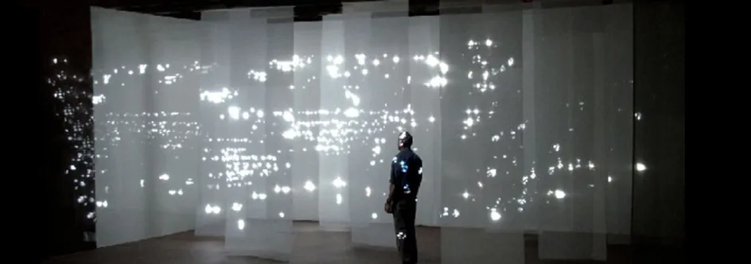

# Уровень 6: Игры и искусство

Данный пост — перевод шестой статьи из [курса лекций «Принципы гейм-дизайна»](http://gamedesignconcepts.wordpress.com/) за авторством профессионала и преподавателя [Яна Шрайбера](http://www.gamasutra.com/view/authors/916452/Ian_Schreiber.php). Переводы предыдущих лекций вы можете посмотреть по [ссылке](index.md).

Здесь я хотел бы сделать небольшое отступление по поводу извечного вопроса «могут ли игры быть искусством?» Может показаться, что это странная тема для обсуждения по сравнению с более солидными принципами дизайна, которые мы здесь обсуждаем. К тому же эта дискуссия тянется уже много лет и всем надоела, так зачем нам снова толочь воду в ступе и тратить своё время? У меня есть несколько причин, по которым я хотел бы включить её в нашу программу, но вы вольны выразить своё мнение о плюсах и минусах её включения в этот курс.

Первая причина для включения этой темы состоит в том, что в течение следующих нескольких недель мы будем разговаривать о том, что такое «интересно» и как нам сделать игры приятнее для игроков. Для большинства профессиональных гейм-дизайнеров это главная установка: возьми эту игру и сделай её интересной. Прежде, чем мы в это углубимся, я хотел бы пояснить, что занятность – не единственная цель гейм-дизайна, на самом деле некоторые игры могут быть успешными и достичь всех целей, заложенных в их дизайне, не будучи при этом особо «интересными» в том смысле, в каком интересны большинство других игр.

Во-вторых, так как дискуссия эта имеет длинную историю, я бы хотел, чтобы новенькие тоже получили о ней хоть какое-нибудь представление. Это она из тех вещей, которые нет-нет, да и всплывают в разговоре между дизайнерами, поэтому мне бы хотелось, чтобы новички среди вас тоже могли поддержать беседу. Те из вас, кто уже знаком с этой дискуссией, я надеюсь, почерпнут что-то новое и смогут продолжать обсуждение на качественно ином уровне.

В-третьих, количество так называемых «артхаузных игр», то есть игр, которые создаются в первую очередь для художественного выражения, а не для развлечения – близится к критической массе. В этой сфере множество талантливых людей делают очень любопытные вещи. Многие арт-игры малы, незатейливы и сделаны одним человеком за относительно короткое время. Есть множество потенциальных путей развития. Поэтому артхаузные игры предоставляют отличную возможность для тех, кто ищет своё место в мире гейм-дизайна.

И наконец, я знаю достаточно об истории искусства и его критике, чтобы быть опасным. Таким образом, я хочу поговорить о том, что, в некотором роде, относится к сфере личного интереса… Даже понимая, что  так я непременно ввяжусь в неприятности.

_Объявление_

Для тех, кто замечает подобные вещи: недавно я сменил своё имя в Твиттере с @ai864 на @IanSchreiber, после того, как меня к этому побудила Бренда Бресуэйт (@bbrathwaite), мой соавтор. Она считает, что моё настоящее имя легче запомнить… при условии, что люди смогут его правильно написать. Прошу учесть это тех, кто регулярно пишет о нашем курсе в Твиттер.

_Результаты мини-задания_

Вот небольшая подборка ответов на мини-задание с прошлого занятия (найти вид спорта с петлёй обратной связи и предложить правило, которое бы её устранило):

— пул-8 (вид бильярда): негативная петля обратной связи состоит в том, что чем больше ваших шаров попали в лузы, тем меньше у вас есть целей. Изменение в правилах: все забитые в лузы шары возвращаются на стол, тот, кто первым загнал в лузы семь своих шаров, может попытаться загнать и восьмой – тогда он победил. Другой вариант: если шар загнать не удалось, противник автоматически получает очко.

— боевые искусства, бокс и тому подобное: позитивная петля обратной связи – чем больше ты травмируешь своего противника, тем меньше вероятность, что он ответит на удар. Изменение правил: делать однодневный перерыв между раундами (возможно, это и непрактично, но зато уменьшило бы количество серьёзных травм).

— футбол, баскетбол и большинство других командных видов спорта: негативная петля обратной связи состоит в том, что после гола мяч оказывается в руках команды-противника. Изменение правил: после гола использовать «спорный бросок» или другой способ ввода мяча в игру, который даст командам равные шансы им завладеть.

— крокет: позитивная петля обратной связи в том, что за каждое попадание по воротцам у вас есть дополнительный удар. Изменение правил: сделать дополнительный удар необязательным, записывать общее число ударов за игру, у кого их было меньше – выиграл.

— большинство профессиональных видов спорта: позитивная петля обратной связи состоит в том, что чем больше побед одерживает команда, тем больше денег она получает (от фанатов или спонсоров), что позволяет им покупать лучших игроков, что повышает вероятность их новых побед. Изменения в правилах: не предложены. (На самом деле, это настоящая беда многих профессиональных видов спорта, потому что смотреть игру гораздо интереснее, когда обе команды имеют равные шансы на победу. В реальном мире, чтобы поправить ситуацию, предлагаются штрафы и лимиты на заработки. Виды спорта, которые ничего не делают, чтобы что-то изменить, теряют популярность. Да-да, тебе намёк, американский бейсбол).

— велогонки, автогонки и тому подобное: негативная петля обратной связи состоит в возможности ехать за тем, кто впереди тебя, что позволяет сохранить энергию для будущего обгона. Изменение правил: гонять в вакууме (ха-ха, очень умно).

_Чтение_

Так как понедельничное нововведение вам понравилось, я продолжаю ставить чтение в начале лекции. Теперь предлагаю вам эти вещи:

— _Challenges for Game Designers,_ глава 17 (Игры как искусство)

— _A Theory of Fun for Game Design,_ глава 12 (На законное место) – если вы желаете приобрести эту книгу.

— _Understanding Comics,_ глава 7 (Шесть шагов), если вы желаете приобрести эту книгу.

_Что есть искусство?_

_Understanding Comics_, как вы могли заметить, комикс о комиксах как виде искусства. Если вы прочли главу 7, вам наверняка бросились в глаза некоторые параллели между искусством комикса и гейм-дизайном… помимо проблемы с образом в общественном сознании, где и то, и другое воспринимается как «несерьёзное» и «для детей».

МаКлауд сразу начинает с того, что даёт своё определение искусству: **всё, что делается не с целью выживания и размножения.** Большинство студентов, с которыми я общался, считают, что это определение слишком широкое, но, конечно же, немногие могут предложить что-то лучшее. Если вы примете это определение, со всеми его недостатками, то от него очень легко прийти к утверждению, что «игры – это искусство». В конце концов, когда вы сосредоточены на том, чтобы разобраться в следующем уровне _Left 4 Dead_ или размышляете над своим ходом в шахматах, вы не очень-то способствуете своему выживанию в реальном мире или воспроизводству (только если вы не играете в шахматы как-то по-особому эротически, в таком случае, мне не следует об этом знать).

Я слышал определения искусства как чего-то **коммуникативного** и **преображающего.** Это тоже слишком широко, но определённо также включает игры.

Dictionary.com определяет искусство как **качество, производство, выражение или сферу, соответствующую эстетическим принципам прекрасного, привлекательного или выдающегося.**  Согласно этому определению, игра с привлекательной графикой или игра, которая «больше, чем просто игра» по какой бы то ни было причине, может рассматриваться как искусство.

Википедия определяет искусство как **процесс или продукт намеренного сочетания элементов таким образом, чтобы вызвать чувственный или эмоциональный отклик.** У игр есть формальные элементы, которые создаются намеренно. Игры вызывают чувственный отклик, хотя бы своими визуальными компонентами. Игры также вызывают и эмоциональный отклик. Два самых часто цитируемых эпизода из компьютерных игр – смерть Флойда в _Planetfall_ и смерть Аэрит в _Final Fantasy VII,_ хотя обратите внимание, как эмоционально могут реагировать люди даже на спортивную игру, которую они смотрят по телевидению, или на то, сколько друзей и влюблённых рассорилось из-за игры в _Дипломатию._

Моя цель вовсе не в том, чтобы дать определение термину «искусство»; это задание столь же трудное и неблагодарное, как давать определение слову «игра». Скорее, я хочу показать, что какое бы определение «искусства» мы ни выбирали, не так уж трудно включить в него и игры.

_Так в чём же тогда проблема?_

Раз игры подходят под любое адекватное определение «искусства», которое мы можем придумать, вы можете поинтересоваться: почему вообще возникли споры на эту тему? К чему все аргументы, обоснованные или надуманные, что «игры не могут быть искусством»?

Здесь будет полезно провести границу между просто старым добрым искусством и более высоколобым «изящным искусством» или «высоким искусством» — тем искусством вне времени, которое схватывает и передаёт суть человеческого опыта. Шекспир. Да Винчи. Моне. Вот это всё. И тогда спор, возможно, будет не о том, что игры не «искусство» в том смысле, что они могут быть преднамеренно и с определённой целью созданы, но скорее о том, что игры не могут достичь статуса «высокого искусства» из-за чего-то, присущего играм как выразительному средству.

Я не буду много распространяться на эту тему, потому что об этом и так много сказано в эссе «Об авторстве в играх» Клинта Хокинга, которое он любезно разрешил поместить в тексте _Challenges._

В любом случае, если вы обращаете внимание на то, какие тексты я вам подбираю, вы можете догадаться, в какую сторону я сам склоняюсь в этом споре. Возможно, ещё не создана игра, которая была бы равна «_Моне Лизе»_ или «_Гражданину Кейну»,_ но у нас есть такая возможность. Так что, давайте с этим закончим. Давайте на минуту допустим, что игры _могут быть_ подходящей средой для художественного выражения, и начнём говорить о том _как_ мы можем это сделать.

_Шесть шагов_

Я бы хотел обратить внимание на два ключевых момента в отношении текста _Understanding Comics._ Во-первых, определение искусства МакКлауда, приведённое выше. Во-вторых, шесть слоёв искусства:

— Идея/цель. Какой посыл нужно передать, каково зерно той истории, которую надо рассказать? Зачем вообще вы создаёте произведение искусства?

— Форма. Какие средства вы выберете, чтобы передать вашу идею? Масляные краски? Скульптура? Выразительный танец? Комиксы? Игры?

— Манера. То, что МакКлауд называет манерой, обычно называется жанром, когда относится к играм. Шутер от первого лица, стратегия в реальном времени, гоночный симулятор, многопользовательская ролевая игра и так далее (или для настольных игр: игры, где распоряжаются ресурсами, где бросают кубики и передвигаются вперёд, викторины, кости, стратегия с выкладыванием игрового поля, азартные игры…).

— Структура. В рассказах – это основной остов сюжета, герои и другие элементы. В играх мы можем назвать это «базовой механикой». Каковы структурные компоненты, которые формируют переживание пользователя/зрителя/игрока?

— Мастерство. В комиксах под этим понимается то, насколько искусно рассказана история. В играх – это способность сделать правила и игровой процесс гибкими и естественными, так чтобы игроки не боролись с правилами, а наслаждались игрой.

— Поверхность. Это впечатление от внешнего слоя – цвета, звуки, образы, красота, внимание к деталям – всё, что воспринимается  сразу же. «Пир для глаз».

МакКлауд замечает, что типичный читатель комикса воспринимает его снаружи и затем двигается внутрь. Первое, что он видит – поверхность; потом, всмотревшись, — наслаждается сюжетом. Если смотреть глубже – можно разглядеть идеи, скрытые в истории и, возможно, оценить авангардного художника, даже если его техника не так хороша, как хотелось бы. Если рассматривать комиксы подробно, то вы сможете увидеть границы между жанрами и разными стилями и даже понять, почему определенные сюжетные элементы и другие конвенциональные вещи встречаются в том или ином жанре. Перейдя на уровень глубже, вы, в конце концов, научитесь ценить форму комикса, поймёте, почему они являются уникальным видом искусства; и увидите идеи, стоящие за произведениями, главную цель того, что по сути своей является бессмертной литературой.

Вы наверняка заметили, что всё это можно сказать и об играх.

МакКлауд также отмечает, что хоть с произведением и взаимодействуют от поверхности вовнутрь, создаются они всё равно изнутри – создатель произведения должен выбрать идею и форму, затем выбрать манеру в рамках заданной формы, ещё до того, как его карандаш коснётся  бумаги. Выбор этот может быть обдуманным, или же поспешным, сделанным под влиянием настроения, но его необходимо сделать _прежде всего_. Затем надо задать структуру, после, при помощи мастерства, воплотить детали, и наконец, создать поверхность.

Звучит знакомо? Конечно. Всё это, большей частью, пересказ [структуры МДЭ](mde-formal_nyy-podhod-k-geym-dizaynu-i.md).

Лично мне кажется, что шесть шагов МакКлауда – это расширение [МДЭ](mde-formal_nyy-podhod-k-geym-dizaynu-i.md). Механика приблизительно соотносится со структурой МакКлауда, динамика аналогична мастерству, эстетика сходна с поверхностью. Это не прямое соответствие, но достаточно близкое. В обоих случаях потребителю важна поверхность, в то время как подлинный художник вглядывается в самую сердцевину творческого процесса.

_К творческому процессу_

Если [МДЭ](mde-formal_nyy-podhod-k-geym-dizaynu-i.md) представляют собой три внешних слоя произведения искусства, то что же тогда представляют собой три внутренних слоя? Чтобы ответить на этот вопрос, обратимся снова к модели МакКлауда.

МакКлауд сделал на один очень важный шаг больше, чем ЛеБланк и его соавторы. Он утверждает, что хоть произведения и воспринимаются снаружи внутрь, а создаются изнутри наружу, всё же художники и другие творцы _учатся_ этому процессу _снаружи вовнутрь._

Подумайте об этом. Какой была ваша первая «потрясающая идея» для новой игры? Наверняка она концентрировалась на поверхностных характеристиках игры, которая вам понравилась. _«Это будет как Пакмен Против Пришельцев Из Космоса. Только ещё лучше!»_ Многие люди начитают с того, что изменяют понравившуюся им игру, берут существующий игровой сценарий и просто изменяют некоторые поверхностные характеристики – внешность героев игры, или проводят полную переделку, так что вместо морпехов, стреляющих пришельцев в космосе, игрок видит магов, сражающихся с драконами в горах. Та же механика, та же динамика – разная поверхность.

А что же потом? Возможно, вы сыграли во множество игр и начали различать скрытое за поверхностью, заметили, что некоторые игры с драконами, фаерболами и магами интересны, а другие – с ними же – не очень. И что разница заключается не в сюжете и даже не в жанре, а в игровом процессе. И вы видите разные типы игры, и разбираете, какие типы интереснее других. Чем больше опыта вы накапливаете, тем лучше понимаете, какая механика создаёт захватывающий игровой процесс. И это, возможно, всё чего вы хотите и что вам необходимо, чтобы стать успешным дизайнером, который известен тем, что создаёт интересные игры в популярных жанрах.

Но если заглянуть чуть глубже, вы начнёте задаваться вопросом: а откуда берутся жанры? Кто решает, что определённый набор базовых механик можно копировать  от игры к игре с разными вариациями и что этот конкретный набор механик даёт хороший игровой сценарий? И как создаются _новые_ жанры? Есть ли какая-то последовательность действий для создания того, чего ещё никто раньше не создавал, поиск неуловимого набора захватывающих механик, который ещё не был открыт? И вы могли бы стать известны тем, что создали новый игровой жанр. Необязательно вы сможете довести этот жанр до совершенства, но вы создадите что-то, чем могут воспользоваться другие, те, кто пока работает недалеко от поверхности, кто сможет работать с вашими базовыми идеями и совершенствовать их.

Это всё, на что вы способны? Возможно, это большее, чего каждый из нас может достичь за всю свою жизнь. И всё же, вы можете задаться вопросом, возможно ли что-то большее? И тут у вас есть два пути: Идея и Форма.

Если вы станете изучать форму, вы сможете расширить её рамки. На что способны игры? Могут ли они вызывать в игроке определённые эмоции (кроме выброса адреналина и усиленной работы фантазии?) Какие вещи можно выразить играми лучше, чем любой другой формой искусства? Можно ли использовать игры так, как они ещё никогда не использовались – не просто новые стили игрового процесса, не просто новые способы развлечься, но как выразительное средство, как средство воздействие на игрока, способное изменить его? Можете ли вы изменить чьё-то сознание? Чью-то жизнь? Можете ли вы тронуть игроков так, как не затрагивают картины или фильмы? Как именно? И вот вы создаёте экспериментальные, возможно, очень небольшие игры, которые помогают вам понять, что игры как выразительное средство могут и чего не могут. Эти игры, возможно, не заинтересуют широкую аудиторию, но они дадут множество идей тем, кто работает в этой отрасли, кто может использовать ваши игры и изменять их, чтобы выражать свои собственные важные идеи.

Если вы станете изучать идею/цель, значит, у вас есть нечто, что вы хотите сообщить миру, и вы выбрали игры как выразительное средство для этого. И здесь трудность в том, чтобы передать свою мысль в среде, где процессом руководит игрок, а не дизайнер. Вам придётся пуститься на все хитрости, которые вам известны, чтобы передать смысл посредством игрового сценария. Какие идеи вы хотите выразить? Каков глубокий смысл вашей жизни, которым вы хотите поделиться?

_Много вопросов, мало ответов…_

Вы можете сейчас спросить, знаю ли я как сделать хоть что-то из всего перечисленного. Нет, не знаю, но такова природа искусства.

Этот курс посвящён, главным образом, трём внешним слоям искусства гейм-дизайна: Механике, Динамике и Эстетике (или, если пожелаете – Структуре, Мастерству и Поверхности). Научить делать привлекательные игры, придумывая для них правила – само по себе неслабое задание для десятинедельного курса; научить вас создавать новые жанры и раздвигать границы видов искусства – это уже чересчур.

Но даже не в этом дело. Как говорит МакКлауд – три внутренних слоя нельзя изучить в классе или по книге. Чтобы добраться до самого сердца формы искусства вы должны посвятить ему всю свою карьеру, 20, даже 30 лет _самостоятельной работы._ Возможно, вы в этом не заинтересованы, и это нормально. Миру, может, и нужны люди, раздвигающие рамки игры как вида искусства… но ведь ему нужны и просто хорошие игры. Только вы знаете, как далеко вы можете и хотите продвинуться в своём искусстве. Не мне решать это за вас, моя задача – показать вам карту и дать возможность самим выбрать дорогу.

_А теперь немного истории искусства._

И здесь мы подошли к довольно сложной части, ведь многие люди относятся к современному искусству недоверчиво и даже цинично. Кто-то взял и испражнился в консервную банку, продал это художественной галерее за 20 000 евро, а остальные пытаются понять, как бы и им получить такие же деньги за свои экскременты. Это искусство? И если так, то неужели _это –_ то, к чему стремятся игры? Здесь будет полезно вернуться на шаг назад и понять, как именно мы пришли к этому, ведь игры отлично вписываются в современное искусство, и нам действительно необходимо понять, почему.

Давайте вернёмся в эпоху Возрождения, когда рисование поднялось до уровня искусства. В то время искусство должно было верно отображать мир; рама картины воспринималась как окно, через которое зритель смотрел в другую реальность. Чем реалистичнее произведение искусства передавало этот вид, тем лучше был художник. Чтобы судить об искусстве, нужно было лишь увидеть, насколько оно правдоподобно – всё просто! А затем где-то в 1890-х изобрели фотокамеру и всё испортили.

Теперь, когда фотографии могли воспроизвести всё со стопроцентной точностью, старая форма искусства вдруг умерла. Художники, должно быть, задались вопросом: и что теперь?

Художник Василий Кандинский и многие его последователи начали с вопроса: а может ли искусство быть целью само в себе, а не просто изображением чего-то? Что, если холст – это экран, а не окно или зеркало? И так появилось то, что теперь известно как _абстрактное искусство,_ которое не представляет собой и не символизирует ничего, кроме себя самого.

Как судить о таком виде искусства? Как отличить художника, который подлинно одарён и искренен, от позёра, который просто, как попало, шлёпает краски на холст и ждёт незаслуженных почестей?

Влиятельный критик Клемент Гринберг предложил выход: судить искусство исключительно по его эстетической ценности. Главное – техническое исполнение. Художник – это творец, и хорошее произведение искусства должно одинаково воздействовать эстетически на любого зрителя. Гринберг формализовал то, что ныне называется «искусством модерна» (под _модерном_ понимается определённый период времени приблизительно от 1910 и до 1950, и его не следует путать с современным искусством, которое мы наблюдаем здесь и сейчас).

В последующие десятилетия искусство боролось с формализмом Гринберга, настаивая на том, что искусство не пассивно, но _интерактивно,_ между художником и зрителем должен вестись _диалог_, искусству позволено иметь _множественность интерпретаций,_ искусство должно передавать _смысл._ Эта эра названа «искусством постмодерна».

В ходе 1960-х, и особенно в 70-е, искусство столкнулось с потенциальной проблемой: оно стало пользоваться большим спросом и внезапно именитые художники стали стоить много денег. (Я слышу, как вы говорите: ну да, нам бы всем такие «проблемы»). И всё же, многие художники стали чувствовать, как их работы обесцениваются. В том смысле, что создавались они с какой-то целью, и тут вдруг сделались товаром. Само произведение не так важно, как подпись на нём. И хотя для некоторых это было славным способом подзаработать, но всё же ценой «продажности»… А это вещь, с которой не каждый художник может смириться.

А теперь посмотрите на игры. Разве всё это не звучит знакомо?

Как мы судим игры? Рейтинги в отзывах. Техническое исполнение. Оценка звука и графики. Отзывы на игры дают оценку «интересно» и баллы от 1 до 5, подразумевая, что то, что было интересно критику, будет также интересно каждому, кто это читает. Современное состояние игровой критики соответствует формализму Гринберга. Все мы, по-видимому, застряли в странной временной петле, которая возвращает нас в 1930-е.

Игры – это модерн или постмодерн? Они пассивны или интерактивны? Создают ли они разные переживания игрового процесса у разных людей или одно и то же – для всех? Представляют ли собой игры просто визуальный ряд или они могут передавать более глубокое значение, заложенное в механике? Вы можете не согласиться, но мне игры видятся весьма посмодернистской формой искусства. Я очень надеюсь, что однажды критики игр начнут рассматривать игры именно в этом свете.

А что же деньги? Игры определённо страдают от той же проблемы – их воспринимают как товар. Индустрия видеоигр сегодня превышает 20 миллиардов долларов в год. У меня нет цифр, описывающих, как обстоят дела у настольных игр, но зная, сколько копий «Скрэббла» и «Монополии» продаётся ежегодно, я могу сказать, что они тоже весьма солидные. Большинство крупных студий живёт за счёт того, что делает игры, приносящие деньги, и иногда дизайнерам приходится идти на компромисс между своим стремлением создать нечто _уникальное_ и чем-то, что _будет хорошо продаваться._

К чему я всё это веду? Просто к тому, что если вам эта сфера интересна, стоит потратить своё время на изучение истории искусства. Искусствоведы и историки уже выяснили, как отличить «искусство» от «не-искусства» когда в далёком 1917 году Дюшан подписал псевдонимом писсуар и назвал это искусством. На самом деле, все опасения девелоперов, что мир искусства будет высокомерно считать игры недостойными внимания – всего лишь фантазия. В действительности, игры уже давно попали в поле зрения искусствоведов. Порывшись в литературе, лично я нашёл статьи, датированные ещё 1994 годом (а это было, на минуточку, за год до того, как выпустили первый _PlayStation_). Во всех обнаруженных мной источниках – а я говорю о рецензируемых журналах, посвящённых академическому искусству – видеоигры не только подвергались анализу, но при этом совершенно определённо подразумевалось, что игры – это искусство. Я не нашёл ни одной статьи, отстаивающей право игр быть художественным выразительным средством – это было _априори_ понятно. Так давайте расстанемся с нашими иллюзиями о гонениях на игры и займёмся искусством.

_Что такое атрхаузные игры?_

С чего начать создание игры, которая имеет художественную ценность и не предназначена исключительно для развлечения? Всё зависит от того, что мы считаем «искусством», ведь уже существует много игр, которые в первую очередь создавались как форма выражения. Как вы убедитесь, все они делятся на несколько категорий. Возможно, есть ещё категории, которые я упустил. Отчасти потому, что наверняка существуют игры, которые можно назвать «искусством», но которых я ещё не видел, а отчасти потому, что это очень малоисследованная область. Но это даст вам хоть какие-то ориентиры.

Я представлю вам несколько игр. Сперва просто поиграйте в них, если есть возможность. А затем продолжайте чтение. Каждая из этих игр займёт всего несколько минут, обычно пять или даже меньше. Те, что длятся дольше, всё равно с первых же минут дают вам представление о своём игровом процессе, так что вы можете играть в них дольше, а можете остановиться. Поиграйте во всё понемногу, насколько позволяет время.

_Игры_

— [_Passage_](http://hcsoftware.sourceforge.net/passage/) и/или [_Gravitation_](http://hcsoftware.sourceforge.net/gravitation/) _от Джейсона Рорера (5 и 8 минут соответственно)._

_—_ [_The Marriage_](http://rodvik.com/rodgames/marriage.html) _от Рода Хамбла (играется за пару минут)._

_—_ [_Stars_ _Over_ _Half—Moon_ _Bay_](http://www.rodvik.com/rodgames/SOHMB.html) _от Рода Хамбла (играется за пару минут)._

— [_September 12_](http://www.newsgaming.com/games/index12.htm) _от Гонзало Фраски (играть можно сколько угодно, но механика проста и очевидна сразу же, после одной-двух минут)._

_—_ [_Samorost_](http://amanita-design.net/samorost-1/) _от Armanita_ _Design_ _(чтобы сыграть до конца потребуется больше времени)._

_—_ [_Cloud_](http://www.jenovachen.com/flowingames/cloud.htm) _от Йенувы Чена (займёт некоторое время, чтобы сыграть до конца, но основная механика понятна уже на первом уровне, за несколько минут)._

_Чему мы научились?_

Я думаю, что вопрос «могут ли игры быть искусством» некоторое время ещё будет оставаться спорным. Но для нас с вами это спор бессмысленный; если вы хотите использовать игры как художественное средство, просто действуйте.

Изучать искусство и художественный процесс полезно для гейм-дизайнера. Если вы не знаете, чем заняться, когда курс закончится – это один из множества возможных путей для углубления вашего понимания дизайна.

Даже если вы не собираетесь быть _художником,_ вы всё равно будете творить, своего рода, искусство, поэтому было бы хорошо понимать, что такое искусство, и что делают художники. Как сказал Костер в _Theory_ _of_ _Fun_ для сегодняшнего чтения:

_«Самое главное, что нужно играм и их дизайнерам – признать, что нет разницы между искусством и развлечением… и искусство, и развлечение ставят перед аудиторией проблему. И искусство, и развлечение побуждают нас более глубокому пониманию хаотических сценариев, которые вихрятся вокруг нас. Искусство и развлечение – это не вопрос **типа,** а вопрос **интенсивности**»._

_А теперь об этих играх…_

Рассмотрев некоторые из игр, к которым мы довольно часто обращались в нашей дискуссии об искусстве, мы можем получить кое-какие зацепки, которые помогут разъяснить ситуацию: как мы можем выражать свои воззрения посредством игрового процесса. Здесь я сразу оговорюсь, что все представленные ниже утверждения являются моими личными интерпретациями этих работ, а ваше видение (как и намерение художника) может быть совсем иным. Мне это не кажется проблемой; искусство постмодерна допускает и множественность интерпретаций и множество смыслов.

_Samorost_ является искусством, по большей части, в визуальном плане. Это как интерактивная картина – очень приятная графика, отличная форма исследования. Создатели стремились вызвать определённое визуальное переживание у игроков.

_Cloud_ делает на один шаг дальше, намеренно пытаясь вызвать у зрителя эмоциональный отклик (а особенно, чувство по-детски наивного удивления, когда мы смотрим на облака). Некоторые из моих студентов, находили, что получилось это несколько неуклюже, но я напоминал им, что это была экспериментальная работа, целью которой было ответить на вопрос: могут ли игры _вообще_ вызывать эмоции, так что некоторая неопределённость игры вполне предсказуема.

_Passage_ и _Gravitation_ обе выражают особую идею чувства (смерти и отцовства, соответственно). Рорер взял за основу свои собственные эмоции и постарался перевести их на язык игрового сценария. Разница между этими играми и игрой _Cloud_ состоит в том, что цель _Cloud_ создать эмоцию; в то время как _Passage_ и _Gravitation_ передают эмоции своего создателя.

_The Marriage_ похожа на работы Рорера, но _The Marriage_ выражает скорее идею, а не чувство (в частности, Хамбл делает попытку представить в деталях механику долгосрочных отношений, отсюда и название).

_September 12_ также выражает идею (главным образом, о том, что война с насилием – ущербное понятие), но делает ещё один шаг вперёд. В то время, как работы Хамбла и Рорера просто выражают идеи и эмоции художника, _September 12_ предпринимает попытку переубедить аудиторию. Это не исследование, это риторика, что несколько отличает её цель от цели остальных игр.

_Stars Over Half-Moon Bay_  похожа на _The Marriage_ тем, что тоже выражает идею (в данном случае – идею творческого процесса, когда начинаешь с чистого неба возможностей, а потом тучи набегают, когда ты приступаешь к таинственному процессу творчества и инноваций, и под конец всё проясняется и сходится в одну картину. Так как гейм-дизайнеры и другие художники испытывают трудности с творческим процессом, _Stars_ более рекурсивна, чем _The Marriage_. В то время как _The Marriage_ теоретически может затронуть тех, кто хочет понять серьёзные отношения, _Stars_ говорят напрямую с гейм-дизайнерами о трудностях, с которыми они сталкиваются в своей среде.

Если посмотреть на всё это в контексте шести шагов МакКлауда, мы видим, как вырисовываются некоторые образцы того, что может побудить к созданию арт-игр:

— использование игры как среды для самовыражения («Идея/Цель»). Вы можете выразить чувство, идею, идеологию. Вы можете просто выразить своё видение или попытаться убедить в нём аудиторию. Для эмоционального выражения, начните с эстетики (в понимании [МДЭ](mde-formal_nyy-podhod-k-geym-dizaynu-i.md)) и работайте в обратном направлении: какие эмоции вы хотите вызвать у игрока, какая динамика вызовет эти эмоции, и, наконец, какая механика может создать такую игру? Для выражения идей помните, что игры – это системы; найдите систему в идеях, которые вы хотите выразить, и подберите игровой процесс, свойственный этой системе. (Здесь мне следует упомянуть серию игр моего соавтора, в их числе – _Train,_ которая исследует системы, стоящие за человеческой жестокостью. К сожалению, это нецифровые игры, поэтому я не могу просто дать вам ссылку на них. Но я просто хотел их упомянуть, чтобы никто не подумал, будто только видеоигры могут быть художественными).

— использование игр для исследования ограничений игры как выразительного средства («Форма»). В этом случае начните с вопроса: могут ли игры Х (чтобы Х ни значил)? Затем, попытайтесь найти ответ на этот вопрос, создав игру, которая пытается сделать Х.

— создание традиционного произведения искусства с интерактивными, похожими на игру элементами («Поверхность»). В этом случае ваш творческий процесс может несколько отличаться от процесса гейм-дизайна.

Есть ли среди игр другие произведения, которые создаются иначе? Думаю, что есть, но мы их ещё не исследовали.

_Домашняя забава_

Сегодня я предлагаю вам несколько вариантов, основываясь не на уровне вашего опыта (должен признать, что в этой сфере все мы новички, даже если мы опытные гейм-дизайнеры), а на сфере интересов. Вот четыре варианта, все основанные на «быстрых нецифровых заданиях», приведённых в конце главы в _Challenges:_

Вариант 1 (Создание эмоций): Разработайте нецифровую игру, которая знакомит детей с идеей горя. Опубликуйте правила и необходимые компоненты. Если есть желание, можно также прикрепить комментарии о том, как вы решили эту проблему и почему, как вам кажется, ваша игра удалась (или не удалась).

Вариант 2 (Убеждение): Измените настольную игру _«Риск»,_ чтобы она ратовала за мир во всём мире. Опубликуйте ваши изменения в оригинальных [правилах](http://www.centralconnector.com/GAMES/RISK.htm). Если желаете, можете включить комментарии о том, чего вы хотели добиться, удалось ли вам это, и почему.

Вариант 3 (Исследование границ выразительности игр): Придумайте игру, у которой будут преднамеренно неполные правила, требующие соавторства игрока в ходе игры, чтобы игра могла продолжаться. Опубликуйте свои (неполные) правила.

Вариант 4 (Исследование природы игры): Выберите цифровую игру, которая кажется вам художественной и вдохновляющей. Создайте правила для нецифровой версии. Обратите внимание на то, как разница в среде влияет на игровой опыт; подумайте, какие художественные идеи лучше всего могут быть выражены в цифровой и нецифровой форме. Опубликуйте ваши правила, плюс комментарии.

Выберите любой вариант, который интересует вас больше всего, и опубликуйте пост на [соответствующем форуме](http://ww2.gamedesignconcepts.aceboard.com/). Я создал по одной площадке для обсуждения для каждого из вариантов. Опубликуйте свой пост до того, как выйдет следующий урок: до полудня понедельника 20 июля или раньше. Затем, предложите **конструктивный отзыв**, как минимум на три другие публикации в том же форуме (то есть, в той же сфере интересов, что и ваша). Сделайте это до полудня четверга, 23 июля.

_Просьба о контенте_

Вы знаете «артхаузную игру» в которую играли, но не увидели её ни в этом уроке, ни в тексте _Challenges?_ Опубликуйте её, приложив ссылку и краткую аннотацию, на нашем вики-ресурсе в разделе “[Art Game](http://gamedesignconcepts.pbworks.com/Art-Games)”. Если вы не зарегистрированы на этом курсе, но всё равно хотите сделать свой вклад, оставляйте свои комментарии здесь или публикуйте в Твиттере с тегом #GDCU, и я или кто-нибудь ещё добавит их на вики.

_Мини-задание_

Придумайте ключевой концепт любой арт-игры, который можно выразить в 135 символах или менее. Опубликуйте в Твиттере с тегом #GDCU. Один концепт на человека, будьте добры! Публикуйте до полудня 20 июля.

 _Перевод — Ю. Сергеева_