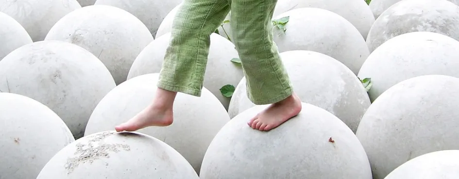

# Уровень 6: Ситуационный баланс

Данный пост — перевод шестой статьи из [курса лекций «Принципы игрового баланса»](https://gamebalanceconcepts.wordpress.com/) за авторством профессионала и преподавателя [Яна Шрайбера](http://www.gamasutra.com/view/authors/916452/Ian_Schreiber.php). Переводы предыдущих лекций вы можете посмотреть по [ссылке](index.md).

### Чтение/Игры

Никаких на этой неделе (кроме данной публикации).

###  Ответы к вопросу прошлой недели

Если хотите свериться с ответами за прошлую неделю:

#### _Анализ перетасовки карт_

Для колоды из трёх карт существует шесть различных вариантов расположения карт, все равновероятные. Если данные нам карты А, Б и В, то выглядят расклады так: АБВ, АВБ, БАВ, БВА, ВАБ, ВБА. Следовательно, если алгоритм тасования действительно даёт случайный результат, мы ожидаем увидеть шесть результатов (или количество, кратное шести), каждый из которых имеет одинаковую вероятность.

##### _Анализ алгоритма №1_

Сначала вы выбираете одну из трёх карт на дно колоды (А, Б или В). Затем вы выбираете одну из двух оставшихся карт, которая идёт в середину (если вы уже выбрали А на дно, тогда вам надо выбирать между Б и В). Наконец, оставшаяся карта кладётся наверх (никакого выбора у вас уже нет). Это отдельные, (псевдо)случайные, независимые опыты, поэтому для того, чтобы их посчитать, мы их перемножаем: 3х2х1=6. Если вы действительно проделаете эти шаги, чтобы перечислить все шесть возможных комбинаций, вы увидите, что они соответствуют шести результатам, приведённым выше. Этот алгоритм правильный, и на самом деле является одним из двух «стандартных» способов тасования карточной колоды. (Другой алгоритм – сгенерировать псевдослучайное число для каждой из карт, а затем разложить карты, следуя этим порядковым номерам. Этот второй метод – самый простой для того, чтобы расположить список в произвольном порядке в Excel, используя RAND (), RANK () и VLOOKUP ().)

##### _Анализ алгоритма №2_

Во-первых, если перетасовка действительно случайная, пятидесятикратное повторение не сделает её более случайной, это просто бесцельная трата вычислительных мощностей. А если перетасовка _не случайная_, то повторение _не обязательно_ поможет, так что вам лучше просто исправить базовый алгоритм, а не надстраивать на него что-то ещё.

Так что же с этим внутренним циклом? Сначала мы выбираем одну из трёх карт на дно, затем одну из этих же трёх – в середину, а затем одну из трёх – наверх. Как и раньше, это отдельные, независимые опыты, поэтому мы умножаем их 3х3х3=27.

И мы сразу же понимаем, что где-то здесь кроется проблема, раз 27 не делится на 6 без остатка. Поэтому, даже не проверяя ничего дальше, мы _знаем_, что одни расклады будут более вероятны, чем другие. Так что мы с полным правом могли бы здесь остановиться и официально объявить алгоритм забагованным. Если вы достаточно настойчивы, вы можете отследить все 27 результатов и увидеть, _какие_ раздачи более или менее вероятны и насколько. Достаточно азартный игрок, изучая алгоритм, мог бы действительно произвести эту симуляцию для большой колоды, чтобы получить небольшое соревновательное преимущество.

### На этой неделе

Это особая неделя. Ближе к началу курса мы две недели обсуждали баланс транзитивных игр, а затем ещё две недели говорили о вероятности. На этой неделе мы свяжем две изученные темы воедино крепким узлом и красивым бантом.

Эта неделя посвящена ситуационному балансу. Что такое ситуационный баланс? Я имею в виду, что иногда мы имеем дело с транзитивными вещами, или что-то вроде того, но их значения меняются во времени и зависят от ситуации.

Один из примеров – эффект зоны поражения. Казалось бы, что-то, что наносит 500 очков урона нескольким врагам сразу должно быть ценнее, чем то, что наносит 500 очков урона лишь одной цели при прочих равных условиях. На _насколько_ оно ценнее? По-разному бывает. Если вы боретесь с врагом один на один, оно _ни на сколько_ не ценнее. А если на вас одной большой толпой налетели пятьдесят врагов, то такая вещь будет в 50 раз ценнее. А бывает, что вы сражаетесь с одним-единственным боссом. Как тогда привести к балансу такую вещь?

Или представьте себе эффект, который зависит от того, что делает ваш противник. Например, есть в _Magic: The Gathering_ карта под названием «Карма», которая на каждом ходу наносит 1 очко урона вашему противнику за каждое его болото, находящееся в игре. Игрока, у которого в колоде 24 болота, такая карта может убить, прямо скажем, насмерть, быстро, и без посторонней помощи. Против игрока совсем без болот такая карта абсолютно бесполезна. (Ну, на самом деле она бесполезна _если только_ у вас нет _других_ карт в колоде, которые могут превратить земли врага в болота, в таком случае ценность _Кармы_ зависит от вашего умения сочетать её с эффектами других карт, которые вы можете вытянуть, а можете и не вытянуть). В любом случае, способность карты наносить урон варьируется от хода к ходу и от игры к игре.

Или вот эффект исцеления, который в большинстве игр совершенно бесполезен, если вы уже полностью исцелены, но который может стать решающим для победы или поражения, когда вы сражаетесь с еле живым противником, и сами уже еле живы, и вам нужно одно последнее усилие, чтобы добить его, пока он не добил вас.

В каждом из этих случаев поиск правильной цены на вашей ценовой кривой зависит от внутриигровой ситуации, именно поэтому я называю это _ситуационным_ балансом. Итак, вещь может быть сбалансированной, маломощной или сверхмощной – все зависит от контекста. Как нам сводить к балансу что-то, у чего фиксированная стоимость, несмотря на то, что польза его непостоянная? Если вкратце: мы используем вероятности, чтобы вычислить _предполагаемую ценность_ вещи, именно поэтому мы целых две недели закладывали основу для нынешней работы. Если подробнее: всё сложно, именно поэтому я посвящаю этой теме целую десятую часть курса.

### Тестирование: лучшее решение?

Вообще-то существует множество разных методов сведения ситуационного баланса. К сожалению, так как на вопрос «какова ценность»? ответ всегда «по-разному бывает!», лучше всего подойти к этой проблеме через тестирование, чтобы выяснить, где на графике стоимости будут располагаться разные ситуации. Но здесь, в реальном мире, по-прежнему есть ограниченный бюджет, а если бы он и был _неограниченный_, нам всё равно надо знать, с чего начать, так что нам, как минимум, надо попытаться как можно точнее угадать, и сделать это можно несколькими способами. Поэтому «тестировать, тестировать и ещё раз тестировать» — хороший совет и простой ответ, но этот ответ неполный.

#### Простой пример: D20

Давайте начнём с простейшей ситуации. На самом деле, однажды этот вопрос мне задали на собеседовании (и да, я получил работу), так что должно же оно где-то быть полезным.

Сейчас я приведу очень, ну очень упрощённое описание системы боя на основе d20, которая используется в _D&D_ 3.0 и выше. Вот как она работает: у каждого персонажа есть две характеристики, базовый бонус атаки (или БАБ, который по умолчанию равняется 0) и класс брони (или КБ, по умолчанию равен 10). В каждом раунде каждый игрок должен осуществить одну атаку на противника. Чтобы атаковать, он бросает 1d20, складывает выпавшее со своим БАБ и сравнивает с КБ своей мишени. Если общее значение атаки больше или равно КД, то атакующий пробивает броню и наносит урон; в противном случае – он промахивается и ничего не происходит. Выходит, что по умолчанию, без дополнительных бонусов, вы должны наносить урон приблизительно в 55% случаев.

А вопрос такой: сбалансированы ли БАБ и КБ? То есть, если я дам вам +1 к атаке, будет ли это эквивалентно +1 к КБ? Или один из показателей более мощный, чем другой? Если бы я сейчас собеседовал вас на работу, чтобы вы мне ответили? Подумайте об этом минутку, прежде чем читать дальше.

##### _Какой здесь центральный ресурс?_

Вот моё решение (ваше может быть другим). Во-первых, я понял, что не знаю, как много урона можно наносить и как много здоровья есть у игрока (то есть, сколько попаданий можно пережить или сколько попаданий требуется, чтобы убить противника). Но допустим, эти значения равны (или равнозначны) – это неважно. Должны ли вы попасть во врага один раз, или пять, или десять – если вы точно так же уязвимы, вы всё равно будете попадать во врага в определённом проценте случаев. И враг будет попадать в вас в определённом проценте случаев. Всё сводится к тому, что ваш процент попаданий должен быть выше, чем у противника. Процент попадания – и есть центральный ресурс, вокруг которого должен строиться весь баланс.

Если у обоих – и у меня, и у противника пятипроцентный шанс попасть друг в друга, в среднем мы будем попадать очень нечасто. Если о обоих девяностопроцентный шанс попасть друг в друга, мы будем попадать почти что на каждом ходу. Но так или иначе, наносить удары или промахиваться мы будем одинаково часто или одинаково редко, поэтому никакого преимущества друг перед другом не имеем.

##### _Нахождение баланса через центральный ресурс_

Итак, в балансе ли друг с другом КБ и БАБ? +1 БАБ даёт мне +5% к моим шансам на попадание, а +1 КБ даёт -5% к шансу противника попасть в меня, получается, когда я сражаюсь против врага-одиночки один на один, эти две характеристики действительно равнозначны. Так или иначе, наш _относительный_ процент попадания меняется одинаково в количественном отношении. (Одно исключение: если процент делается выше 100% или ниже 0% — тогда никакие дополнительные бонусы уже никак на вас не влияют. Видимо поэтому БАБ по умолчанию +0, а КБ +10 – чтобы достижение такого уровня было всё менее и менее вероятно и требовало _очень_ много бонусов. Пока что мы с вами пренебрежём этими крайностями).

А что если битва _не_ один на один? Что если мой персонаж один, а его окружили _четверо_ врагов? Теперь я могу атаковать только один раз на каждые четыре вражеских атаки, так что +1 КБ здесь гораздо мощнее, потому что бросок, к которому плюсуется КБ случается в четыре раза чаще, чем бросок, к которому плюсуется БАБ.

Или, если всё наоборот, у меня в отряде четверо спутников, и мы наступаем на одного великана? Здесь, при условии, что великан может атаковать только одного из нас за ход, +1 БАБ гораздо мощнее, потому что каждый из нас атакует по разу за круг, но лишь один из нас при этом сам подвергается атаке.

На деле же, в большинстве _D&D_ мастера любят ставить группы, которые они водят, в положение меньшинства, когда численный перевес на стороне противника – так оно эпичнее (по крайней мере, исходя из моего опыта). Это значит, что в практическом применении, КБ мощнее, чем БАБ; две эти характеристики _не_ равноценны на графике стоимости, даже при том, что игра функционирует так, как должна.

Но, как я и сказал, это упрощение; оно совсем не отражает _действительный_ баланс _D&D._ Но даже из такой упрощённой системы мы можем сделать интересные выводы: ценность атаки выше, если вас больше, чем врагов. И если бы мы добавили числовые показатели цены и пользы к проценту попаданий, мы бы могли вычислить, _насколько_ эти показатели более значимы, через функцию численного перевеса – вашего или вражеского.

### Какое это значение имеет для гейм-дизайна

Если вы создаёте игру, где вы знаете заранее, что ждёт игрока впереди – например, шутер от первого лица или ролевая игра с уровнями, разработанными вручную – вы можете использовать это знание предстоящих испытаний, чтобы сбалансировать все характеристики. Например, в нашей упрощённой системе d20, если вы знаете, что игроку предстоит сражаться с численно превосходящим его противником, мы можете изменить КБ на вашем графике стоимости в сторону большей ценности, а значит и большей цены.

Ещё один способ сбалансировать КБ и БАБ и сделать их равнозначными – изменить энкаунтеры в вашей игре так, чтобы примерно в половине случаев враг был многочисленнее, а в половине – малочисленнее отряда игрока. Кроме того, что это уравновесит характеристики, в вашу игру будет интереснее играть повторно: прохождение игры с высоким БАБ будет совершенно отличаться от прохождения той же игры с высоким КБ; в любом случае, некоторые встречи с врагами будут гораздо труднее других, и игрок сможет взглянуть на сложность каждого энкаунтера с другой стороны.

### Цена переключения

А что если бы в _D&D_ вы могли свободно переводить КБ в БАБ и наоборот перед каждой новой битвой? Теперь, совершенно внезапно, они стали равнозначны друг другу и бонус +1 к _любой из характеристик_ становится гораздо мощнее и универсальнее, чем остальные бонусы в игре.

Ну что ж, может, в _D&D_ этого и нельзя сделать, зато существует множество игр, где вы можете поменять одну ситуационную вещь на другую. Шутеры от первого лица – классический пример: вы можете носить с собой одновременно несколько видов вооружения. Например, гранатомёт против медленно движущихся мишеней или больших скоплений врагов, снайперскую винтовку против расположенных далеко одиночных целей, и нож для рукопашного боя. Каждое из этих оружий иногда _ситуационно_ полезно, но если вы можете без задержки переключаться с одного вида вооружения на другое, вы уже имеете дело с _суммой возможностей_ всего оружия, а не с _ограничениями_ одного-единственного.

Раз так, допустим, что мы поднимем цену переключения с одного оружия на другое: пусть на то, чтобы положить одно оружие в рюкзак и взять другое, игрок тратит 10 секунд (и если подумать, так оно будет правдоподобнее, ведь и правда, если вы с собой таскаете 10 единиц огнестрела и можете моментально с одной на другую переключаться, где и как вы их носите?). И тут внезапно ограничения каждого вида вооружения становятся значительными, и одно универсальное оружие может стать мощнее целого ассортимента ситуационного оружия. Но если вы, наоборот, можете мгновенно переключаться с одного на другое, то куча всевозможного вооружения, где каждое идеально подходит для определённой ситуации, становится гораздо лучше, чем оружие, которое умеет всё, но понемногу.

Что мы можем почерпнуть отсюда? Мы можем влиять на ситуационный баланс просто меняя стоимость переключения между инструментами, оружием, распределением пунктов характеристик или вообще стратегиями.

Всё это, конечно, хорошо в теории, но как обстоят дела с конкретными цифрами?

Давайте посмотрим.

#### Пример: Невозможно переключиться

Давайте возьмём один крайний случай, где вы _вообще_ не можете переключаться между стратегиями. Например, ролевая игра, где вы можете иметь при себе лишь одно оружие и надевать лишь один доспех, а когда вы приобретаете новый, вы автоматически избавляетесь от старого. Здесь расчёт очень простой – выбора нет, поэтому можно легко рассмотреть все ситуации. Очень похоже на расчёт предполагаемой ценности.

Итак, вы спросите: в каких ситуациях ценность того или иного объекта будет выше или ниже и насколько? Как часто вы сталкиваетесь с подобными ситуациями? Перемножьте всё и сложите.

Вот простой вымышленный пример, чтобы наглядно показать все вычисления: допустим, у вас есть меч, который наносит двойной урон драконам. Допустим, 10% значимых сражений в вашей игре – против драконов. Предположим также, что в вашей игре урон находится в линейном соотношении с кривой стоимости, так что удвоив урон, наносимый чем-либо, вы делаете эту вещь в два раз лучше.

Итак, 90% времени меч обычный, 10% времени он в два раза лучше. 90%\*1.0 + 10%\*2.0 = 110% цены. В таком случае «двойной урон против драконов» это +10% к базовой стоимости.

Вот другой пример: у вас есть меч, который в полтора раза мощнее всех других мечей своего класса, но троллям он наносит лишь половинный урон. И давайте также предположим, что половинный урон – это существенный недостаток, он отнимает у вас ваш основной способ наносить урон, поэтому вам приходится полагаться на другие, менее эффективные источники, и это сильно повышает ваши шансы быть на месте убитым, если вы вдруг встретите тролля в недобрый час. Так что в этом случае «половинный урон» на самом деле делает меч _изначально отрицательным_. Но давайте ещё добавим, что тролли в вашей игре очень редки, допустим всего 5% энкаунтеров.

Так что если обычный меч в вашей игре имеет пользу 100 (в соответствии с вашей кривой стоимости), меч, наносящий полуторный урон будет иметь пользу 150, а то, что ваш меч _не работает_ в определённых ситуация _стоит_ 250, просто потому, что тогда вам с вашим мечом просто крышка. Тогда математика такая: 95%\*150 + 5%(-250) = 130. Таким образом, ваш меч имеет пользу 130 или на 30% больше, чем обычный меч.

Опять же, существует много способов это изменить, много рычагов, которыми дизайнер может воспользоваться, чтобы вмешаться в баланс. Конечно, вы можете изменить цену и пользу объекта либо увеличивая/уменьшая урон в тех редких случаях, когда он отличается от базового, либо регулируя другие способности для всех остальных случаев – так как вы бы сделали с транзитивной механикой. Но в ситуационном балансе вы можете изменить ещё и частоту ситуаций, например, увеличив количество троллей или драконов в игре – либо во всей игре, либо только в зоне, прилегающей к тому месту, где игроку достаётся этот особый меч. Ведь если игрок собирается использовать меч, уступающий троллям, в той области игры, где троллей вообще нет, пусть даже оставшееся игровое пространство ими кишит – не такой уж это и недостаток, не правда ли?

#### Другой пример: Переключение без цены

Теперь позвольте привести другой пример, где вы можете носить с собой сколько угодно ситуационных объектов и переключаться с одного на другой абсолютно свободно. В этом случае ограничения _и близко_ не дотягивают до силы объекта, потому что получение новой способности не имеет цены упущенной возможности. В таких случаях мы смотрим на пользу всех объектов, которые удалось собрать игроку и вычисляем, что _нового_ будет уметь этот объект, чего пока не может ни один другой из имеющихся у игрока. Умножьте эту дополнительную пользу на процент времени, когда она будет использоваться – это и будет ваша дополнительная польза от нового объекта. Так что расчёт здесь очень похож, за исключением того, что мы не обращаем внимания на случаи, когда предмет слаб, – раз мы всегда можем без труда переключиться на другой.

Но на практике не всегда всё так просто. Во множестве игр игрок может использовать неоптимальные стратегии, потому что он ещё не успел приобрести нужного для данной ситуации предмета (на самом деле, для большинства игр было бы даже лучше, если бы так и было устроено). Кроме того, игрок может находить новые объекты в другом порядке на каждом прохождении. А в итоге вы _не знаете_ точно, как часто будет использоваться тот или иной предмет, потому что он будет использоваться чаще или реже в зависимости от того, какие инструменты уже есть у игрока, а также от желания игрока пусть в ход новоприобретённую игрушку даже там, где она не _оптимальна_ (а оптимальную вещицу под эту ситуацию он ещё не нашёл), но по крайней мере лучше, чем остальные, что у него есть.

Вот пример. Допустим, у вас есть разные мечи, каждый из которых наносит много дополнительного урона определённому типу монстров, чуть больше, чем обычно – второму типу, а против третьего типа совершенно бесполезен. Предположим, что таких мечей у вас десять, монстров в игре тоже десять типов, и каждый тип одинаково силён и встречается с одинаковой частотой. Не нужно быть математиком, чтобы догадаться, что все эти мечи должны стоить одинаково.

Между тем, мы столкнулись с проблемой. Играя в игру, мы быстро понимаем, что все эти мечи на самом деле не имеют одинаковой _ценности_ для игрока в определённый момент времени.

Вот, скажем, я купил меч, который наносит двойной урон драконам и полуторный – троллям. Значит, где-то в игре есть меч, который наносит двойной урон троллям, но он уже совсем не так ценен для меня, как раньше. Я повышаю коэффициент урона с 1,5 до 2, а не с 1 до 2, так что выгода меньше. Для полной оптимизации я могу приобрести около половины всех мечей в игре и получу хоть _какой-то_ коэффициент повышения урона против большинства монстров и игре, так что каждый новый меч будет иметь всё меньшую ценность для меня.

Как сбалансировать такую систему? Мне приходят в голову несколько способов, и, пожалуй, существует ещё несколько, до которых я не додумался. Всё зависит от того, что подходит конкретной игре.

— **Предложите скидку:** Один из способов – менять цену на ходу. Обыграйте это в повествовании: чем больше мечей вы покупаете у этого торговца, тем больше скидка на следующие для такого замечательного покупателя (можете даже дать игроку «карту постоянного клиента» и пусть торговец ставит на ней печати – некоторым игрокам такие вещи очень нравятся).

— **Пусть решает игрок:** Или вы можете привести всё к балансу исходя из того, что у игрока нет _ничего,_ это значит, что в игре будет действовать закон уменьшающейся выгоды, и тогда сам игрок решает, сколько ему нужно и когда остановиться – считайте, что это часть игровой стратегии.

— **Пусть растущая денежная кривая сделает «скидку» за вас:** Если игрок будет добывать всё больше денег за единицу времени, всё что нужно сделать для «уменьшения» стоимости – это просто держать цены на старом уровне, ведь у игрока будет уходить всё меньше времени на то, чтобы накопить на следующий. Хитроумно!

— **Мечи со скидкой попадаются позже:** Или вы можете так распределить мечи по локациям, что будете точно знать, где какой игроку попадётся, и что он скорее всего купит одни мечи раньше, а другие – позже. Вы можете назначить им разные цены, зная, что определённые мечи уже доступны игроку, когда он находит новый, а значит, вы можете в соответствии с этим снизить его стоимость.

Само собой, для игр, где _можно_ переключаться с объекта на объект, но переключение имеет _некоторую_ цену (время, деньги – что угодно), следует использовать метод, который находится где-то между двумя крайними методами «вообще нельзя менять» и «можно моментально менять когда угодно».

### Цена универсальности

Мы затронули тему универсальности с точки зрения игрока, когда он покупает множество предметов в игре и делает своего персонажа универсальным и способным справиться с разными ситуациями. А что если сам _предмет_ универсален? Так часто бывает, например, в поочерёдных стратегиях реального времени, где отдельные юниты могут быть многофункциональными. Итак, может, лучники сильны против летунов и уступают пехотинцам (обычная схема для стратегии), но допустим, вы хотите создать новый тип юнитов, который силён _и_ против летунов, _и_ против пехотинцев, но не превосходит лучников. Так что, допустим, лучник одолеет летуна и почти не получит при этом урона, а этот новый юнит потеряет в противостоянии в летуном половину очков здоровья (он победит, но дорогой ценой). Этот новый юнит не так хорош против летунов, но он хорош для _других_ целей, так что он более универсален.

Если брать другой пример, то в шутерах от первого лица обычно, когда вы стоите вплотную к противнику, лучшее оружие –  ножи и мечи, тогда как снайперские винтовки хороши на расстоянии, а вот пулемёт более или менее полезен почти на всех расстояниях (но _не так_ хорош, как всё остальное). Таким образом, вас никогда не застигнут врасплох с абсолютно бесполезным оружием, если у вас есть пулемёт, но в то же время, у вас не будет _идеального_ оружия, если вы часто сталкиваетесь с близким и дальними целями.

#### _Сколько стоит такого рода универсальность?_

Вот ключ: ценность универсальности прямо пропорциональна неуверенности. Если вы заранее знаете, что будете играть на малой карте с узкими коридорами, кучей поворотов и перекрёстков, ножи точно будут полезнее снайперских винтовок. На карте с большими открытыми пространствами всё совсем наоборот. Если же у вас на одной карте есть и замкнутые пространства, и открытые, то универсальное оружие, которое может служить двум целям (пусть даже и посредственно) будет гораздо ценнее.

Допустим, у вас вместо этого случайная карта, и шанс получения карты, оптимизированной под ближний бой, и карты, оптимизированной под дистанционное оружие, 50/50. Какая стратегия будет лучше? Универсальное оружие будет умеренно полезно в любом случае, но не идеально, а значит, вы победите тех, кто совсем не угадал, но проиграете тем, кто угадал с оружием. Лучшего выбора здесь _нет,_ это всё случайная догадка. Такой выбор обычно не очень занимателен: игрок должен выбирать заранее, вслепую, и тогда вся суть игры сводится к тому, кто правильно угадал. Если только вы не введёте механизм смены оружия во время игры, чтобы приспособиться к карте, или разрешите игрокам носить с собой несколько видов оружия, или ещё что-нибудь – и вот мы снова вернулись к тому, что универсальность бывает двух мастей:

— Способность отдельного игрового объекта быть полезным в различных ситуациях;

— Способность игрока переключаться с одного игрового объекта не другой.

Чем проще игроку переключиться между объектами, тем менее ценной становится универсальность отдельного предмета.

### Теневая стоимость

А теперь, прежде чем мы с вами углубимся в подробные примеры, я хотел бы написать немного о различных видах цен, которые может иметь игровой объект. Строго говоря, я должен был рассказать об этом, когда мы обсуждали кривую стоимости, но на деле с ними приходится сталкиваться чаще как раз в ситуационном балансе, поэтому я говорю об этом сейчас.

Грубо говоря, мы можем разделить все цены объекта на две категории: цена в ресурсах и всё остальное. Если вы вспомните, когда мы говорили о построении кривых стоимости, я упомянул, что любой недостаток и любое ограничение – это тоже цена, так вот именно об этом я сейчас и говорю. Экономисты называют это **теневой ценой,** то есть, это цена, _скрытая_ за денежной ценой. Если вы купите дешёвый радио-будильник за 10 долларов, есть ещё дополнительная цена времени и транспортировки (вам надо выйти из дома, чтобы купить эту вещь), а если однажды утром, когда вам это будет особенно важно, он не сработает, потому что интерфейс разработан плохо, и вы поставили его на 7 вечера вместо 7 утра, и поэтому пропустили важную встречу, то плохой дизайн будет стоить вам дополнительных денег и времени. Если из-за дешёвых компонентов он сломается через пару месяцев, вам придётся идти и возвращать его или менять на новый, что будет стоить дополнительного времени, и так далее… поэтому _на первый взгляд,_ он стоит 10 долларов, но _истинная_ цена выше из-за _теневой цены_, которой может не быть у более качественных часов.

В играх существует два вида теневых цен, которые чаще всего всплывают в ситуационном балансе: **невозвратные издержки** и **упущенные выгоды**.

#### _Невозвратные издержки_

Под _невозвратными_ издержками я понимаю некие вложения, которые необходимо сделать для того, чтобы получить доступ к вещам, которые вам, собственно, и нужны. Обычно их можно увидеть в древах технологий в RTS, MMO и RPG. Например, в стратегиях реального времени, чтобы создать определённый тип юнитов, вам необходимо сперва построить некую структуру, которая будет их обеспечивать. Эта структура может не давать вам никакой пользы, _кроме_ возможности создавать этот тип юнитов. Например, каждый драгун в _StarCraft_ стоит 125 минералов и 50 единиц газа (это явная цена), но помимо этого вам необходимо построить Кибернетическое ядро, чтобы иметь возможность создавать драгунов, а это стоит 200 минералов – что увеличивает стоимость каждого отдельного драгуна. Ах да, кстати, вы не можете построить Кибернетическое ядро, если ещё не построили Врата за 150 минералов – это тоже входит в цену. Так что вы строите здания, _не используете их ни для чего кроме этого,_ создаёте одного драгуна, и этот красавец стоит вам в общей сложности 475 минералов и 50 единиц газа, а это огромная цена в сравнении с заявленной ценой самого юнита!

Конечно, если вы затем создадите _десять_ драгунов, тогда цена каждого из них сокращается до 160 минералов и 50 единиц газа за штуку, что уже гораздо ближе к заявленной цене, потому что за здания вы платите один раз (ну, по крайней мере, в большинстве случаев). И если вы получаете дополнительную пользу от этих зданий, тогда часть цена этих зданий расходится на другие вещи, так что можно уже и не рассматривать её как часть цены драгунов.

Но всё же, как вы видите, вам нужно заплатить некую цену _просто для того_, чтобы иметь _возможность_ заплатить _дополнительную_ цену, и вы должны внимательно учитывать это при своём анализе. Когда цена может быть «амортизирована» (распределена) на насколько покупок, изначальная невозвратная издержка должна быть сбалансирована исходя из ожидаемой стоимости: _сколько_ драгунов предположительно создаст среднестатистический игрок? Задавая стоимость драгунов, необходимо учитывать и эти предварительные вложения.

Вы также можете посмотреть на это с другой стороны, когда вы задаёте цену предварительным условиям (таким как здания, необходимые для создания юнитов): не просто «что это даст мне сейчас?», но и «какие возможности это даст мне в последствии?» Вы часто встречаетесь с этим, когда имеете дело в древом технологий. Например, в некоторых ролевых или массово-многопользовательских играх с древами технологий встречаются способности, которые можно купить при получении нового уровня и которые не так уж полезны сами по себе, возможно, они и _вовсе_ бесполезны… но они являются необходимым условием для очень мощных способностей, которые вы получите позже.

Невозвратные издержки можно увидеть и в других играх. Мне встречались ролевые игры, где игрок выбирал между _одноразовыми_ и _многоразовыми_ предметами. Конечно же, одноразовые были гораздо дешевле, но их можно пустить в ход лишь однажды. Так, например, вы можете купить зелье за 50 золотых или зельеварную машину за 500 золотых. В таком случае, вы купите машину, если рассчитываете создать больше 10 зелий. Или вы можете купить билет в один конец за 10 золотых, или проездной за 50 золотых и спросить себя, собираетесь ли вы прокатиться больше пяти раз. Или вы раздумываете, покупать ли дисконтную карту, которая даст 10% скидки на все последующие покупки, но её покупка будет стоить вам 1000 золотых единовременно, так что вам придётся подумать, собираетесь ли вы потратить в этом магазине столько, чтобы карта себя окупила (раз уж на то пошло, то принятие решения о покупке дисконтной карты в реальном мире требует похожих расчётов). Подобные решения не всегда так уж интересны, потому что, по сути, вы просите игрока прикинуть, как часто он будет пользоваться той или иной вещью… но при этом _не говорите_ ему, как долго продлится игра или как часто ему придётся применять многоразовую вещь, так что это решение – разновидность решения вслепую. И всё равно, как дизайнеры, _мы_ знаем ответ, поэтому должны сделать свои собственные расчёты ожидаемой стоимости и в соответствии с этим всё сбалансировать. Если мы всё сделаем правильно, ко времени принятия решения о покупке, наши игроки поверят, что в нашей игре стоимость адекватно соотносится с ценностью.

#### _Цена упущенных возможностей_

Второй тип скрытой цены – то, что я называю _ценой упущенных возможностей,_ – это когда вы должны отказаться от чего-либо, уменьшить свою универсальность. Примером, опять же из игр с древами технологий, является ситуация, когда вы достигаете некой «развилки» и должны выбрать, какой навык развивать дальше; если вы выбираете определённое умение или изучаете определённую технологию, вы ограничиваете себя и уже не можете изучать что-то другое. Если вы изучаете магию Огня, вам тут же становятся недоступны все заклинания Льда и наоборот. Такое случается и в системе квестов: если вы не взорвали Мегатон, вы не получите квест на Тенпенни-Тауэр. Это может произойти в настольных играх: одна из коллекционных карточных игр, над которой я работал, в основном, содержала нейтральные карты и очень мало таких, которые были «хорошими» или «плохими». Если вы разыгрывали карту «хорошего» персонажа, вы уже не могли играть «плохими» до самого конца игры (и наоборот), так что каждая отдельная взятая колода могла использовать либо хороших, либо плохих, но не тех и других одновременно. По сути, любая игровая ситуация, где совершив какое-либо действие, вы лишаетесь возможности совершать другие действия в дальнейшем, является ценой упущенной возможности.

В таком случае ваше действие будет иметь особую теневую стоимость: вдобавок к цене за совершение действия прямо сейчас, вы также платите уменьшением универсальности в дальнейшем (а не только ресурсами). Это дополнительное ограничение для игрока. Сколько стоит это ограничение? А вот это уже ваша задача – рассчитать всё для вашей конкретной игровой ситуации. Но помните, если цена ненулевая, не забудьте учесть её в анализе графика стоимости.

### Пример универсальности

Как на деле ведут себя числовые значения универсальности? Всё зависит от природы универсальности, а также цены и сложности переключения.

Вот вымышленный пример: вы собираетесь выйти в бой против реального игрока, и вы знаете, что ваш противник имеет в своём распоряжении либо атаку Льда, либо атаку Огня, но точно не обе, и одна из них точно есть (он не безоружен). Можно купить заклинание, защищающее от Льда, или заклинание, защищающее от Огня (или оба, чтобы уж наверняка, но это дороговато). Допустим, оба заклинания стоят по 10 золотых каждое.

А теперь предположим, что мы предлагаем новый предмет, Защита от Стихий, который даёт _оба_ заклинания в качестве пакетного предложения. Сколько он будет стоить? От чего именно зависит его цена?

Если вы были внимательны, вы знаете правильный ответ: цена зависит от того, что вам известно о планах противника, а также от цены переключения между заклинаниями, если вы потом передумаете.

Если вы знаете наперёд, что противник применит, скажем, атаку Огня, тогда пак будет стоить столько же, сколько Защита от Огня, то есть 10 золотых. «Универсальность» здесь не даёт никакой дополнительной ценности, потому что правильный выбор вам уже известен.

Если же узнать тип атаки вашего противника невозможно до тех пор, пока не будет уже слишком поздно что-то решать, и вы не можете переключаться с защиты на защиту, когда поединок уже начат, то Защита от Стихий должна стоить 20 золотых, так же, как и оба зелья сразу. Здесь универсальность даёт вам ту же добавочную стоимость, что и покупка обоих предметов по отдельности. В рамках игры нет никакой разницы – покупаете вы их по отдельности или вместе.

А вот ещё: что если у вас будет возможность купить одно заклинание перед битвой, а затем, если после начала битвы оказывается, что вы не угадали, вы можете тут же объявить тайм-аут и купить ещё одно? В таком случае вы бы обычно тратили 10 золотых сразу с 50% шансов на то, что угадали и ваши траты ограничиваются 10 золотыми, и с теми же 50%, что промахнулись, и тогда вам придётся тратить дополнительные 10 золотых (итого 20), чтобы купить ещё одно. Тогда ожидаемая ценность здесь (50%\*10)+(50%\*20) = 15 золотых, именно столько и должен стоить совмещённый пак в такой ситуации.

А что, если игра частично предсказуема? Предположим, что у вас могут быть _кое-какие_ соображения насчёт того, использует ваш противник атаку Огня или Льда, но вы не совсем уверены. Тогда оптимальная цена пака должна лежать где-то между этими крайними значениями, в зависимости от того, _насколько_ вы уверены.

Хорошо, эта последняя ситуация звучит довольно странно с точки зрения дизайна. Где в _настоящей_ игре вы можете иметь некое неполное представление о том, что ваш противник собирается использовать против вас? Во-первых, в стратегиях реального времени я могу увидеть, какие-то из частей армии, разворачиваемой моим противников, что даёт мне частичное (но не полное) представление о том, что меня ждёт, и исходя из этого я могу создавать соответствующие юниты. Здесь универсальные юниты ценны (у моего оппонента в рукаве может быть припрятана пара тузов, о которых я ещё не догадываюсь), но их ценность частична (ведь _кое-что_ об армии противника я знаю, следовательно, имеет смысл создавать юниты, которые сильны против существующих частей вражеской армии).

### Рассмотрение ситуационного баланса на примерах

Теперь, когда мы всё это обсудили, давайте приступим к изучению конкретных примеров.

#### _Прицельный огонь и зона поражения (серия игр Age of Empires)_

Для того, что наносит урон сразу многим целям, а не только одной, _при прочих равных условиях,_ насколько более полезно массовое поражение?

Обычно ответ такой: возьмите ожидаемое количество поражённых целей и умножьте. Таким образом, если враги идут равно распределёнными группами от 1 до 3, тогда в среднем вы будете поражать 2 врага за одну атаку, нанося двойной урон в сравнении с обычной атакой, и тогда массовое поражение имеет двойное преимущество.

Небольшое предостережение: «при прочих равных условиях» — очень хитрая вещь, ведь обычно прочие условия как раз _не_ равны. Например, в большинстве игр, враги не теряют способности к нападению, пока они не уничтожены полностью, поэтому нанесение _частичного_ урона не так важно, как нанесение _смертельного_ урона. В таком случае медленное и равномерное распространение урона может быть менее эффективным, чем прицельное поражение выбранного врага мощными ударами, ведь так вы с каждым выстрелом уменьшаете наступательную мощь врагов, тогда как с массовым поражением это происходит не сразу. Кроме того, враги, по которым мы ведёте огонь, могут иметь различное количество очков здоровья, и массовое поражение может убить некоторых из них, но не всех, сокращая отряд противника до нескольких трупов и меньшей группы (или одного врага), что впоследствии сокращает мощь вашей массовой атаки – то есть, делает ваши атаки всё слабее с каждым разом! Так что с этим вам тоже стоит быть осторожными: обязательно рассмотрите, как часто враги будут собираться в группы при типичном столкновении, и как долго они будут держаться вместе.

#### _Атаки, которые эффективны (или неэффективны) против определённого типа врагов_

Мы уже рассматривали это на примере с драконами и троллями. Необходимо умножить дополнительную пользу (или невыгоду) как если бы она имела место при каждом столкновении с врагами, на предполагаемый процент времени, когда это будет действительно иметь значение (то есть как часто вы будете встречать этот тип врагов).

Как мы видели в предыдущем примере, хитрость здесь в том, чтобы точно рассчитать действительную пользу или ущерб от вещи, ведь что-то с «двойным уроном» или «половинным уроном» на деле редко имеет двойную или половинную ценность.

#### _Метаигровые объекты, которыми вы можете воспользоваться или пренебречь_

Иногда бывает, что есть предмет, который иногда полезен, а иногда нет – но использовать его или нет решает игрок, поэтому, если обстоятельства к тому не вынуждают, он не тратить ресурсы впустую.

Примерами служат ситуационное оружие в шутерах, которое носят с собой в качестве «смены», специализированные юниты в стратегиях, которые можно создать, по мере необходимости и игнорировать в других случаях, или ситуационные карты в коллекционных играх, которые могут дожидаться своих противников в запасной колоде. Обратите внимание, в таком случае на них влияют силы, не зависящие от игрока: случайная карта местности, на которой вы играете, юниты, которых создаёт противник, карты, находящиеся в колоде соперника.

В таких случаях велик соблазн оценить их в соответствии с вероятностью их востребованности. Например, если у меня есть карта, которая наносит 10 очков урона против красных существ в _Magic_, и я знаю, что в большинстве колод 2-3 цвета, так что у меня 40—50% вероятность сыграть в открытой игре против красного, и тогда такая карта должна стоить столько же, сколько карта, наносящая 4 или 5 очков урона любым противникам. Если игрок должен выбрать, использовать эту карту или нет, перед началом игры, не зная, играет ли его противник красным – это хороший метод.

Но в некоторых случаях вы _знаете,_ что делает ваш противник. На турнире по _Magic_, после того, как разыгрывается первый тур из трёх раундов, вам разрешается поменять несколько карт из основной колоды на карты из дополнительной колоды. Вы можете отложить свою карту, наносящую 10 урона красным, и не играть ею первую игру, и взять _только в том случае, когда_ ваш противник играет красным. Таким образом вы обеспечиваете 100% эффективность своей карты; единственной ценой становится место в запасной колоде, а это _метаигровая_ цена. Как мы узнали несколько недель назад, пытаться оценить что-либо в игре, основываясь на метаигре – штука непростая. Всё что вы можете сказать, так это то, что она должна стоить _немного_ меньше, чтобы компенсировать метаигровую стоимость, но не вполовину меньше, как стоила бы, если бы игрок вынужден был пользоваться ею в любом случае… Если только мы не хотим _преднамеренно_ её недооценить, чтобы поощрить её использование в запасной колоде.

Так же дела обстоят и со специализированным юнитом в стратегии, если предположить, что вам ничего не стоит сама _возможность_ создать его. Если большую часть времени он бесполезен, вы ничего не теряете, если не создаёте его. Но когда он _понадобится,_ вы его _создадите,_ и вы будете _точно знать,_ что он будет полезен. Опять же, тогда он должен оцениваться, исходя из предположения, что ситуация, для которой он создаётся, происходит в 100% случаев. (Если же вы должны заплатить дополнительную цену за универсальность самой возможности создания юнита, _то эту цену_ вам следует регулировать основываясь на реальном проценте времени, когда такая ситуация случается в игре).

Со сменным оружием в шутерах многое зависит от того, как структурирована игра. Если всё оружие бесплатное (не имеет никакой «ресурсной» стоимости), но выбрать можно только одно основное и одно на смену, вы должны очень внимательно сбалансировать единицы сменного оружия между собой, так, чтобы каждое оружие было полезно в одинаково вероятных ситуациях, или, по крайней мере, соотношение ситуационного преимущества к ожидаемой вероятность получения этого преимущества – _оно-то_ уж точно должно быть одинаковым у всего оружия (таким образом, в игре может быть оружие, которое мощнее всего другого, но только в очень редких ситуациях, и оружие, которое весьма посредственно, но пригодно почти всегда и везде – и они сбалансированы, если это соотношение у них сошлось).

#### _Метаигровые «комбо»_

Итак, мы только что обсудили ситуации, над которыми игрок не властен. Но если что-то всё же _зависит_ от игрока… То есть, если что-то само по себе не особо полезно, но в сочетании с чем-то другим даёт мощный эффект? Примером может быть стрельба с двух рук в шутерах, классы второстепенных (т.н. «поддерживающих») персонажей в массово-многопользовательских играх, ситуационные карты, вокруг которых строится колода в коллекционных карточных играх, дополнительные башни в играх типа «защита башни», которые улучшают характеристики находящихся рядом башен, и так далее. Их ситуационность имеет несколько аспектов: ведь они _определённым образом_ вознаграждают игрока за удачный метаигровой выбор.

Чтобы разобраться, как приводить к балансу такие вещи, нам надо вернутся к рассмотренному ранее понятию цены упущенной возможности. В этом случае мы имеем дело с ценой упущенной метаигровой возможности: вероятно, вам придётся совершить в игре изменения, _которые совершенно не связаны с тем, что вы пытаетесь сбалансировать,_ чтобы сделать ту или иную вещь полезной. В зависимости от ситуации, есть несколько способов подступиться к балансу таких объектов.

Один из них – взять всё «комбо» целиком и сбалансировать его, а затем разделить на элементы и сбалансировать их, основываясь на том, насколько все они полезны по отдельности. Например, в _Magic_ было две карты – Lich и Mirror Universe:

— Lich сокращал очки жизни до нуля, но добавлял новые правила, которые помогали эффективно конвертировать ваши карты в жизни – сама по себе карта была очень рискованной, потому что когда она покидала игру, жизней у вас всё равно не оставалось, и вы моментально проигрывали! Даже без этого риска ценность карты была сомнительная, так как по сути она выручала вас, только если вы уже проигрывали, а иметь в колоде карты, полезные, когда вы проигрываете – это значит готовиться к поражению, что само по себе невыигрышная стратегия.

— Mirror Universe была картой для обмена очками жизни с противником – не такая рискованная, как Lich, раз вам выбирать, когда ею воспользоваться, но всё равно полезная только тогда, когда вы проигрываете, и эффективно её использовать было не так-то просто.

— Но вместе эти две карты могли обеспечить моментальную победу: вы обнуляете свои жизни, а затем меняетесь жизнями с противником – у него ноль, мгновенная победа!

Как такое оценить? Это, конечно, большая крайность: две карты сами по себе почти бесполезны, в других условиях дают не так уж много, но если их соединить – они всесильны. В такой ситуации, лучшее, что можно сделать – это перекос в сторону их бо́льшей _совместной_ стоимости, чтобы она была сопоставима с похожим мощным выигрышным объектом, разве что чуть меньше, ведь тут требуются две карты (а две карты сложнее вытянуть из колоды, чем одну). Но как поделить стоимость надвое: одну сделать дешёвой, а другую дорогой? или сделать цену одинаковой для обеих? Уравновесьте их в соответствии с их полезностью. Lich даёт некоторые дополнительные преимущества (например, добор карт из колоды, когда вы получаете жизни), но при этом есть и очень неприятные последствия. Mirror Universe таких последствий не имеет, а также даёт некое психологическое преимущество – ваш противник может сдерживать свои атаки, ведь он не хочет, чтобы вы, _почти_ убитый, пустили в ход эту карты и добили уже его. Их сложно сбалансировать относительно друг друга, но исходя из того, что происходило в игре на самом деле, их стоимость соотносима.

А если не впадать в крайности? Класс персонажей поддержки в ММО дает много бонусов к возможностям и исцелению других персонажей, принося пользу всем остальным в команде. Сами по себе они имеют _некоторую_ ненулевую ценность (если возникнет такая надобность, они всегда могут атаковать врага, если они при этом могут исцелять и баффить самих себя, у них даже неплохо получится, да и вообще – они свежая кровь, на которую отвлекаются враги). Но их истинная ценность раскрывается только в группе, где они могут сделать лучших участников отряда ещё лучше. Как сбалансировать такое?

Давайте возьмём простой пример. Допустим, ваш поддерживающий персонаж может увеличивать силу атаки одного из союзников на 10%, но только одного за раз – так прописано в древе технологий; вам нужно рассчитать предположительную ценность этой способности, чтобы иметь возможность назначить ей адекватную цену. Чтобы вычислить, сколько же она стоит, давайте представим отряд игроков примерно одного уровня, найдём среди них класс с самым высоким показателем атаки и вычислим предположительную ценность атаки для этого персонажа. В группе искомая способность «бафнуть атаку» будет стоить 10% от этой величины. Само собой, эта способность будет не так полезна, если персонаж подвизается в одиночку или в составе группы, где нет сильных атакующих, так что вам нужно высчитать процент времени, когда этот персонаж будет путешествовать с группой, где такой бафф будет полезен, и учесть его в последующих вычислениях. Таким образом, цена упущенных возможностей при включении атакующего в ваш отряд очень низкая (большинство групп так или иначе включают хотя бы одного), так что эта поддерживающая способность будет почти всегда высокоэффективна, исходя из этого вы её и будете балансировать.

Что общего есть у примеров с картами Lich/Mirror Universe и классами персонажей поддержки? Когда вы сталкиваетесь с ситуационными эффектами, на которые игрок может повлиять, первое правило – это найти _цену упущенных возможностей,_ которую платит игрок за создание этой ситуации, и учесть эту цену в качестве «стоимости» в противовес ситуационному преимуществу. Помимо этого, стоимость необходимо рассчитывать исходя из _лучшего случая,_ а не из некой «усреднённой» ситуации: если игроки сами решают, когда им использовать каждый из элементов комбо, мы можем полагать, что они станут использовать их при оптимальных условиях.

#### _Мультиклассовые персонажи_

Раз уж мы заговорили о классах персонажей, как насчёт «мультиклассовых», которые встречаются во многих настольных ролевых играх? Обычно схема такая: вы делаетесь универсальным, получая доступ к уникальным способностях нескольких классов… но зато вы обычно имеете более низкий уровень всех этих умений, чем моноклассовые персонажи. Насколько ниже должен быть уровень умений, чтобы мультиклассовость была жизнеспособной стратегией (не слишком слабой), но в то же время не настолько сверхмощной, чтобы выбирать монокласс не имело смысла?

Это проблема универсальности. Игрок обычно не знает заранее, в какие ситуации попадёт его персонаж, так что он старается приготовиться ко всему понемногу. В конце концов, если бы он точно знал, чего ожидать, он бы просто выбрал самый эффективный монокласс, отбросив всё остальное! Между тем, наверняка он _хотя бы примерно_ представляет себе, что его ждёт, или, по крайней мере, какие способности, которых ещё нет в его распоряжении, понадобятся его отряду, так что Воин/Вор пятого уровня, наверное, не так хорош, как Воин десятого уровня или Вор десятого уровня. Так как игрок должен выбирать заранее и, как правило, не может менять свой класс в ходе игры, ограничение довольно большое, так что вы вряд ли ошибётесь, предположив для начала, что моноклассовый персонаж должен быть в полтора раза сильнее мультиклассового, а затем подстраивать это значение, если будет необходимо. Таким образом, монокласс 10 уровня обычно так же силён, как дуал-класс 7 или 8 уровня.

#### _Двупредельный выбор (исключающее или) в единственном игровом объекте_

Иногда у вас есть один объект, который может _либо_ одно, _либо_ другое по выбору игрока, но не оба варианта сразу (объект либо исчезает по использовании, либо необратимо меняется). Например, в коллекционной карточной игре у вас есть карта, которая или вводит в игру новое существо, или увеличивает существо, уже имеющееся у вас. Или, может быть, в ролевой игре у вас есть кусок металла, из которого можно выковать либо замечательную броню, либо мощное оружие. Или в шутере вам даётся возможность улучшить _одно_ оружие, из нескольких имеющихся у вас. В такого рода ситуациях, если игрок знает цену того, что он может получить (но выбрать должен только что-то одно), настоящая польза должна быть больше, чем каждый из вариантов сам по себе, но меньше, чем всё вместе взятое, в зависимости от ситуации. От чего же всё зависит? Это проблема универсальности, так что всё зависит от исходной пользы каждого из вариантов, цены/сложности смены стратегии в ходе игры и осведомлённости игрока о задачах, которые встанут перед ним далее в ходе игры.

#### Разница между PvE и PvP

Разработка игр PvE (Player versus Environment – «игрок против среды», где один или несколько игроков кооперируются против компьютера, системы, ИИ и т.д.) отличается от разработки игр PvP (Player versus Player – «игрок против игрока», где игроки непосредственно противостоят друг другу) с точки зрения ситуационного баланса.

Игры PvE гораздо проще. Вы как гейм-дизайнер разрабатываете окружающую среду, уровни, ИИ. Вы уже знаете, что будет «характерно» и «в среднем» для энкаунтеров игрока. Но даже в играх, где контент генерируется согласно установленным правилам, вы не знаете _точно_, с чем столкнётся персонаж, вы знаете только алгоритмы, которые за это отвечают (в конце концов, это вы их разработали), так что вы знаете ожидаемую вероятность того, что генератор контента выдаст определённые типы энкаунтеров, и в каких пределах.

На основании этого вам довольно просто рассчитать ожидаемые значения для PvE-игр, по крайней мере на основании достаточно точного предположения о ценах и пользах, когда речь заходит о ситуационных областях игры.

PvP посложнее, потому что игроки могут менять свои стратегии. «Ожидаемое значение» становится пустым звуком, ведь вы не знаете, чего ждать от противника. В таких случаях лучшие методы, которыми мы располагаем для определения типичного в игре, — это тестирование и анализ количественных показателей – их мы будем рассматривать подробнее на следующих неделях.

### Если вы сейчас работаете над игрой…

Выберите проблемный объект в своей игре, который кажется вам слишком слабым или слишком сильным, и эти его качества зависят от условий или ситуации. (Так как ситуационный эффекты – самые сложные для баланса, если у вас есть проблемы, то они наверняка из этого разряда).

Для начала тщательно поищите, нет ли у объекта теневых стоимостей. Какими возможностями или универсальными свойствами вам приходится жертвовать, чтобы заполучить способности этого объекта? Какие _другие_ свойства вам необходимо приобрести для начала, прежде чем вы получите _возможность_ выбрать этот объект? Спросите себя, какова величина этих дополнительных стоимостей, и учтены ли они в ресурсной стоимости объекта.

Далее, рассмотрите универсальность самого объекта. Полезен ли он в разнообразных ситуациях или только изредка? Насколько эти ситуации зависят от игрока – то есть, если объект полезен только в некоторых случаях, может ли игрок сделать что-либо, чтобы эти случаи стали более вероятными, увеличивая таким образом ожидаемую ценность объекта?

Просто ли игроку поменять своё решение (универсальность игрока против универсальности объекта, раз бо́льшая универсальность игрока уменьшает ценность объектной универсальности) – если игрок выбирает объект, а затем решает сменить его на что-то другое, или при необходимости использует другие объекты или стратегии, когда это возможно… и если да, то насколько просто и есть ли у таких действий ощутимая цена? Каков ущерб, если игрок попал в ситуацию, где объект бесполезен? А теперь подумайте, как универсальность игровых систем и универсальность отдельных объектов должна влиять на пользы и стоимости.

Помог ли новый взгляд на объект выяснить, почему он казался слишком слабым или слишком сильным? Дал ли он вам более глубокое понимание других объектов в вашей игре, всей игровой системы в целом?

### Домашнее задание

В качестве «домашнего задания» мы с вами рассмотрим игру [Desktop Tower Defense 1.5](http://armorgames.com/play/1128/desktop-tower-defense-15), одну из тех, что сделала жанр «tower defense» популярным. (Полагаю, что вы в них _не играете,_ если только в этом нет крайней необходимости, так как они чудовищно затягивают, и вы можете потратить на возню с ними кучу времени, которое можно было бы посвятить более продуктивным занятиям).

DTD 1.5 – отличная игра для анализа ситуационного игрового баланса, потому что _почти всё_ в этой игре ситуационно! Вы покупаете башню и помещаете её где-нибудь на карте, и когда в поле зрения появляются враги, башня отстреливается. Покупать и улучшать башни надо за деньги, а деньги вы получаете убивая врагов башнями. Так как в любой момент игры у вас ограниченное количество денег, ваша цель – максимизировать среднее количество урона за доллар, наносимое вашей башней по врагам, так что с точки зрения игрока – это проблема эффективного распределения.

#### _Ситуационная природа DTD_

Итак, на первый взгляд, всё, что нужно сделать – выяснить, сколько урона может нанести одна башня, разделить на стоимость и взять башню с лучшим соотношением цены и урона. Просто, да?

За исключением того, что количество урона, которое нанесёт ваша башня – вещь исключительно ситуационная! У каждой башни есть радиус действия; _как долго_ враги будут оставаться в радиусе действия под обстрелом полностью зависит от того, где вы поместили ваши башни. Если вы просто разместите башню в чистом поле, враги будут просто подходить к ней, не подвергая себя длительной опасности; если вы построите огромный лабиринт, где им придётся ходить то вперёд, то назад, оставаясь в зоне действия вышеупомянутой башни, она нанесёт гораздо больше урона.

Дальше больше: большинство башен могут стрелять лишь в одного врага одновременно, так что если мимо идёт группа врагов, общий урон, приходящийся _на одного врага_ получается очень небольшим (один враг был поражён, остальные нет). Другие башни наносят урон по всей зоне поражения (ударная волна), что эффективно против больших скоплений врагов, но почти не работает против врагов-одиночек, особенно тех, что сильно разбросаны и быстро передвигаются. Один из типов башни почти не наносит урона, но замедляет врагов, в которых стреляет, задерживая их в радиусе поражения _других_ башен, так что польза от них зависит от того, что ещё есть поблизости. Некоторые башни эффективны только против определённого типа врагов, или наоборот – неэффективны против определённых врагов, так что против некоторых набегов ваши башни будут совершенно бесполезны, даже если обычно они дают урон выше среднего. И есть ещё такие башни, которые совершенно ничего сами по себе не делают, но они увеличивают урон смежных с ними башен… так что их соотношение цена/польза очень варьируется в зависимости от того, какие башни размещены вокруг. Что ещё интереснее, размещение башен огромным блоком (чтобы эта башня увеличивала урон как можно большего числа башен) имеет скрытую цену в том, что такое размещение менее эффективно использует место на поле, так как врагам необходимо просто обойти одно большое препятствие, вместо того, чтобы пробираться сквозь длинный лабиринт. Так что балансировать такую игру очень сложно, ведь всё зависит от всего!

#### _Ваша задача, если вы за неё возьметесь…_

Так как эту игру неожиданно сложно анализировать, я ограничусь только одной небольшой игровой областью. В частности, я хочу, чтобы вы рассмотрели две башни: Роевую башню (Swarm Tower), которая действенна только против летающих врагов, но наносит им большой урон, и Вспомогательную башню (Boost Tower) – это та самая, что увеличивает урон окружающих её башен. Итак, лучшее место для их размещения – прямо в центре карты, в прямоугольном блоке 4х3. Давайте предположим, что вы решили все двенадцать мест в нём занять только Роевыми и Вспомогательными башнями, чтобы извести всех летающих врагов, надвигающихся на вас. Учитывая, что вы хотите минимизировать цену и максимизировать урон, каково оптимальное размещение этих башен?

Вот вам цифры, на которые можно опираться. Полностью прокачанная Роевая башня наносит 480 единиц урона за одно попадание, а в игре стоит $650. Полностью прокачанная Вспомогательная башня стоит $500 и не наносит урона, но улучшает смежные башни (которых касается углом или стороной) на +50%, так что на практике наносит 240 единиц урона за каждую смежную с ней Роевую. Обратите внимание: две смежные Вспомогательные башни _никак друг на друга не действуют –_ они увеличивают нулевой урон друг друга на +50%, а это всё тот же ноль.

Предположим, что все башни прокачаны до предела (самые дорогие версии каждой башни имеют самое эффективное соотношение урона к цене).

Самым верным способом справиться с этой задачей (если вы умеете работать со скриптами или программировать) является написание программы, которая просто-напросто грубо просчитает все 3^12 варианта (нет башни, Роевая или Вспомогательная в каждом из 12 квадратов). Для каждого квадрата рассчитайте урон 480 для Роевой башни, 240\*(количество смежных Роевых) для Вспомогательной башни или 0 для пустого квадрата. Добавьте общее количество урона и общую цену для каждого из сценариев, и проследите, каким будет лучшее соотношение урона и цены (то есть, разделите общий урон на общую стоимость и найдите самое большое значение).

Если у вас нет времени или вы не умеете писать такие программы, альтернативой может стать создание таблицы в Excel для расчёта урона и стоимости для каждого отдельного сценария. Создайте блок 4х3 ячейки, которые могут быть В (Вспомогательными), Р (Роевыми) или пустыми.

Под этим блоком создайте ещё один, чтобы рассчитывать индивидуальную стоимость каждой ячейки. Формула может выглядеть примерно так:

\=IF(B2=”P”,640,IF(B2=”B”,500,0))

Наконец, создайте третий блок ячеек, чтобы рассчитывать урон для каждой из них:

\=IF(B2=”Р”,480,IF(B2=”B”,IF(A1=”Р”,240,0)+IF(A2=”Р”,240,0)+IF(A3=”Р”,240,0)+IF(B1=”Р”,240,0)+IF(B3=”Р”,240,0)+IF(C1=”Р”,240,0)+IF(C2=”Р”,240,0)+IF(C3=”Р”,240,0),0))

Давайте возьмём сумму всех ячеек с уроном и поделим на сумму всех ячеек с ценой. Отобразите это в отдельной ячейке. Теперь всё, что вам надо сделать – это поиграть с первоначальными блоками ячеек, меняя их вручную с Р на В и обратно, чтобы оптимизировать итоговое соотношение урона и цены.

#### _Итоговый результат_

Когда вы найдёте то, что по вашему мнению является оптимальным расположением Роевых и Вспомогательных башен по соотношению урона к цене, вычислите общий урон и пользу только для Роевых башен, а также пользу и урон отдельно Вспомогательных. Если предположить, что игра оптимальна и что мы рассматриваем только эту одну, очень ограниченную ситуацию, какая из этих башен сильнее? – то есть основываясь на соотношении потраченных денег и принесённой пользы, какой тип башен (Роевые или Вспомогательные) делают бо́льший вклад в победу за каждый потраченный на них доллар?

Это всё, что вам нужно сделать, но если вы хотите большего, вы можете углубиться в этот анализ, как только пожелаете – я уже говорил, эта игра полна ситуационных тонкостей для баланса. Летающие враги попадаются только каждый седьмой раунд, так что если вы захотите рассчитать _истинную_ эффективность нашего комплекса из Роевых и Вспомогательных башен, всё надо разделить на 7. Затем сравнить с другими типами башен и выяснить, дают ли какие-либо комбинации наземных типов башен (для 6 волн других, нелетающих врагов) и противовоздушных башен лучшие итоговые результаты, чем использование таких башен, которые атакуют врагов _и_ в воздухе, _и_ на земле. Ну и, конечно, вы можете проверить свои теории в игре, если у вас есть время. Я буду рад увидеть ваши имена в списке рекордсменов.