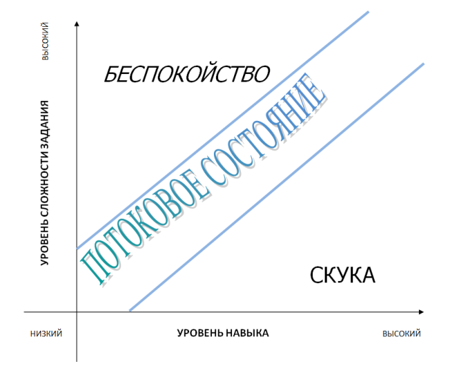

# Уровень 7: Процесс принятия решений и теория потокового состояния

Данный пост — перевод седьмой статьи из [курса лекций «Принципы гейм-дизайна»](http://gamedesignconcepts.wordpress.com/) за авторством профессионала и преподавателя [Яна Шрайбера](http://www.gamasutra.com/view/authors/916452/Ian_Schreiber.php). Переводы предыдущих лекций вы можете посмотреть по [ссылке](index.md).

Я с нетерпением предвкушаю эту неделю, ведь именно сейчас мы действительно добрались до самой сути гейм-дизайна, начиная с принятия решений сегодня и продолжая в четверг сущностью интересного. Это одни из моих самых любимых тем для обсуждения, потому что именно во взаимодействии между игроками и системами заключается главное отличие игры от других выразительных средств. Именно здесь творится волшебство игры, и скажу как дизайнер систем – это как раз и есть самое сердце того, чем я занимаюсь, когда я создаю игры.

### Объявление

Я понимаю, что у 1400 с лишним людей разброс в свободном времени очень большой. Кто-то из вас – студенты на каникулах, поэтому вы можете полностью погрузиться в этот курс и все связанные с ним задания. Другие весь день заняты на работе, и концентрируются в первую очередь на том, чтобы обеспечить себя и свою семью. Кто-то справляется с трудностями в личной жизни – переезд в новый город, потеря близкого человека. Всё это понятно и предсказуемо.

Поэтому я хотел бы прояснить, чего я от вас жду. Я жду, что каждый из вас отдаст столько сил и времени, сколько он может, чтобы чему-то научиться. Я надеюсь, что вы получите от этого курса больше, чем вложили. Вот и всё.

Если у вас выдалась такая неделя, что вы не можете ничего – только прочесть этот блог, значит, просто прочтите. Конечно же, вы научитесь большему, если будете выполнять задания, но если не можете – лучше сделать хоть что-то, чем совсем всё забросить. Я не хочу, чтобы этот курс становился подвигом – «всё или ничего», и никогда не хотел.

Если вам приходится выбирать, я предлагаю такие приоритеты:

1.  Во-первых, читайте блог. Это краеугольный камень курса, поэтому, даже если ни на что больше времени нет – прочтите. Это также относится к материалам из других источников, упомянутых в курсе. (Если вы отстали, вы можете нагнать курс позже. Я оставлю этот блог в сети по окончании курса).
2.  Если после чтения у вас останется время, но не достаточно, чтобы успеть всё – пожалуйста, оставьте отзывы на работы коллег, опубликованные на [форумах](http://ww2.gamedesignconcepts.aceboard.com/), в разделе «Публикация проектов». Мне кажется, что люди, потратившие время на выполнение задания и на его публикацию, заслуживают отзыва, но время не позволяет мне сделать это самому, так что отзывы должны исходить от участников и быть взаимными. Сделайте одолжение своим товарищам, если у вас есть возможность.
3.  Если вы располагаете временем в достаточном количестве – выполните задание и опубликуйте его.

### Результаты мини-задания

Вот небольшая подборка  ответов на мини-задание с прошлого раза (предложить идею арт-игры):

— Игра, в которой у каждого игрока есть своя секретная цель, и они пытаются отгадать цели других игроков – как метафора осознания своей нетрадиционной ориентации.

— Игра, подобная _The Sims,_ но с течением времени производить разные действия становится всё трудней – чтобы передать ощущение человека, которого поражает болезнь Альцгеймера.

— Шутер от первого лица, где игроку в качестве его перспективы демонстрируется лишь одна линия, для передачи видения двухмерного героя из мира Флатландии.

— Игра о колдовстве, где эффекты заклинаний разрабатываются в ходе игры.

### Чтение

Прочтите следующее:

— _Challenges for Game Designers,_ главы 5 и 6 (Случайность/Стратегия/Навык)

— _A Theory of Fun for Game Design,_ главы 1, 2 и 3 (Зачем написана эта книга/Как работает мозг/Что такое игры), если захотите приобрести эту книгу. В более ранних комментариях кто-то предложил сначала читать только комиксы на каждой странице, а потом вернуться назад и прочесть весь текст.

_Building a Princess Saving App_ ([PDF](http://lunar.lostgarden.com/Mixing_Games_and_Applications.pdf)) Дэна Кука. Вообще-то эта статья написана для дизайнеров по проектированию взаимодействия, чтобы показать, какие приложения, повышающие продуктивность работы, можно почерпнуть из игр. Но тем не менее, в ходе статьи затрагиваются и некоторые центральные принципы гейм-дизайна и природа «интересного», то есть как раз то, о чём мы сегодня поведём речь.

### Решения

Как указывал Костикян в [_I Have No Words_](u-menya-ne-hvataet-slov-ya-dolzhen-dizayn.md), мы часто используем модное словцо «интерактивность», при описании игр, хотя на самом деле мы имеем в виду процесс принятия решений. Решения, по сути своей, это как раз то, что _делают_ игроки. Уберите решения и вы получите кино, или какую-нибудь линейную деятельность, а не игру. Но, как справедливо подмечено в _Challenges,_ есть два важных исключения – игры, где нет никаких решений: некоторые детские игры и азартные игры. В азартных играх понятно, почему решения не обязательны. «Интерес» в игре представлен волнением от возможности выигрыша или проигрыша большой суммы. Уберите деньги – и большинство азартных игр, где не принимается никаких решений, сразу же потеряет всю свою привлекательность. Дома, когда вы играете только на фишки, вы выберете игры вроде блэкджека или покера, где надо принимать решения, вряд ли вы играете в Крэпс или слот-машины не на деньги.

Вы можете задать вопрос, что же позволяет детским играм обходиться совсем без решений? Скоро мы до этого доберёмся.

Кроме этих двух исключений, в большинстве игр существуют принятие решений в том или ином виде, и именно это позволяет сделать игру более или менее занятной. Есть такая фраза у Сида Мейера: «Хорошая игра – это цепь занимательных решений» (или что-то вроде того). Но что делает решения «занимательными»? _Морской бой –_ игра, в которой много решений, но она не так уж занимательна для взрослых. Почему? Что делает решения в _Settlers of Catan_ занимательнее, чем решения в _Монополии_? А самое главное, как создавать свои игры так, чтобы решения в них были действительно захватывающими?

### Чего делать не надо

Перед тем, как перейти к хорошим решениям, стоит объяснить некоторые распространённые типы **неинтересных** решений, которые часто встречаются в играх. Помните, что предложенная терминология – моя, а не из «официального» жаргона гейм-индустрии. По крайней мере, пока.

— **Бессмысленные решения** – наверно, эти хуже всех: надо сделать выбор, но он никак не влияет на ход игры. Если вам нужно пойти с одной из двух карт, а они одинаковые – это, вроде, и не выбор.

— **Очевидные решения –** по крайней мере, они влияют на ход игры, но существует всего один правильный ответ, и он очевиден. Поэтому здесь тоже выбор – вовсе не выбор. Почти всегда решение о том, сколько костей бросить в игре _Риск_ – как раз из этой категории. Если вы атакуете тремя армиями, у вас есть «выбор»: бросать одну, две или три игральных кости… Но шансы всегда лучше, если бросать все три, так что это тоже не совсем решение, разве что в нескольких исключительных случаях. Более неочевидным примером могут служить игры-викторины. Каждый раз, когда наступает ваша очередь, вам задают вопрос на эрудицию, и если вы знаете ответ, можно сказать, что вы можете принять решение: ответить или нет. Вот только, причин, для того, чтобы _не отвечать,_ когда вы знаете ответ, обычно нет никаких.  Весь интерес игры в том, чтобы показать свои знания, а не в том, чтобы принимать блестящие стратегические решения. Именно по этой причине телевикторины вроде _Jeopardy!_ гораздо интереснее для зрителей, чем для участников.

— **Решения вслепую –** влияют на игру, и ответ неочевиден, но есть одна проблема: у игроков недостаточно знаний для принятия обоснованного решения, так что в основе своей, выбор случаен. Игра в _Камень-Ножницы-Бумага_ с действительно случайно выбирающим противником подходит в качестве примера – ваш выбор влияет на исход игры, но вы понятия не имеете, что именно надо выбрать.

Такие решения, в большинстве своём, не особо интересны. Они вовсе не занимательны.  Все три представленных вида – пустая трата времени. Бессмысленные решения можно убрать, очевидные – сделать автоматическими, решения вслепую – рандомизировать, без какого-либо эффекта на исход игры.

Или, к примеру, всё тот же _Морской бой_. Почти каждое решение в этой игре делается вслепую. У вас нет информации, основываясь на которой вы принимаете решении стрелять по той или иной клетке. Когда вы попадаете во вражеский корабль, у вас есть кое-какая информация, но всё равно – вы не знаете, как расположен корабль: вертикально или горизонтально, или где он заканчивается, поэтому хоть выбор и имеет ограничения, он всё равно делается наобум.

Или, скажем, _Крестики-нолики,_ в которых есть занятные стратегические решения до тех пор, пока вы не вырастаете и не понимаете, что есть возможность всегда побеждать или сводить игру к ничьей, тогда все ходы становятся очевидными.

### Что такое хорошие решения?

Теперь, когда мы знаем, что такое _слабые_ решения, самый простой ответ на этот вопрос – какие угодно, но не эти. Но можно пойти дальше. Как правило, _занимательные_ решения несут в себе элемент **обмена.** То есть, вы отказываетесь от чего-то, чтобы получить что-то взамен. Обмен может принимать самые разнообразные формы. Вот несколько примеров (я снова использую свою собственную «доморощенную» терминологию):

— **Обмен ресурсами.** Вы отдаёте одну вещь в обмен на другую, но обе ценны. Какая из них _ценнее_? Исход игры определяет умение игрока правильно судить и предвидеть ценность.

— **Риск за вознаграждение.** Один выбор безопасен. Другой предположительно лучше окупится, но и риск неудачи выше. Выберете вы риск или безопасность отчасти зависит от того, насколько отчаянна ситуация, в которой вы находитесь, отчасти от того _насколько_ опасно или безопасно решение. Результат обусловлен вашим выбором, плюс везением. Но если выбор делается достаточно часто, шансы выравниваются, и побеждает наиболее искусный игрок. (Следовательно: если вы хотите больше случайности в вашей игре, уменьшите количество решений).

— **Выбор действия.** У вас есть несколько потенциальных возможностей, но всё сделать не получится. Игрок должен выбрать то действие, которое, по его мнению, самое важное на данный момент.

— **Сразу или потом.** Вы можете получить что-то прямо сейчас или что-то лучшее – позже. Игрок должен уравновешивать насущные потребности с долгосрочными целями.

— **Социальная информация.** В играх, где разрешены блеф, сговоры и вероломство, игроки должны выбирать, играть им честно или нечестно. Нечестная игра позволяет получить больше от текущей сделки, но тогда другим игрокам вряд ли захочется иметь с вами дело в дальнейшем. Кроме того в подходящей (или неподходящей) игре, подлости в отношении ваших соперников могут обернуться очень неприятными последствиями в реальном мире.

— **Дилеммы**. Вам надо отказаться от одной из нескольких вещей. С какой вам будет легче всего расстаться?

Обратите внимание на одну общую черту. Все эти решения включают в себя суждение о ценности чего-либо, причём эта ценность меняется – необязательно и неочевидно.

В следующий раз, когда вы будете играть в игру, которая вам действительно нравится, задумайтесь над тем, какие решения вы принимаете. Если есть игра, которая вам _очень не нравится,_ тоже подумайте над принимаемыми в ней решениями. Может быть, вы узнаете что-то о себе – какие решения вам нравится и не нравится принимать.

### А как же игры в жанре «экшн»?

Здесь видеогеймеры могут задуматься, как всё сказанное относится к какому-нибудь новейшему шутеру от первого лица. Ведь вы вряд ли разрабатываете стратегию обмена ресурсами в разгар боя, когда вокруг рвутся бомбы и свистят пули.

Если вкратце – да, вы тоже принимаете занимательные решения в таких играх, и принимаете их куда чаще и быстрее, чем обычно – иногда несколько полноценных решений в секунду. Чтобы компенсировать напряжённость и ограниченное время, решения должны быть намного проще: выстрелить или уклониться? Прицелиться или побежать? Пригнуться или отпрыгнуть?

На самом деле, временные рамки могут быть использованы для превращения очевидных решений в полноценные. Мне нравится ещё такая формулировка: **когда думать надо быстро, мы глупеем.** Для более основательного обсуждения игр в стиле «экшн» и как в них проявляются навыки, отсылаю вас к главе 7 (_Скорость реакции_) в _Challenges for Game Designers_.

### Эмоциональные решения

Есть один класс решений, которые тоже полезно учитывать: решения, оказывающие эмоциональное воздействие на игрока. Решение спасти товарища (пожертвовав бесценными ресурсами) или оставить его умирать (возможно, лишившись помощи от игры, которая может потребоваться в дальнейшем вам самому) в _Far Cry –_ это решение о распоряжении ресурсами, но оно также эмоционально – и уж конечно, подобное решение на настоящем поле боя не ограничивается анализом доступных ресурсов и вероятностей. Точно также  большинство игроков не могут играть в игру с моральным выбором (такую как  _Knights of the Old Republic_ или _Fable_) за абсолютное зло – не только потому, что быть «злом» невыгодно, но и потому что даже в выдуманном, воображаемом мире не могут вынести мысли о том, чтобы истязать и убивать не в чём не повинных прохожих.

Или, например, обычное решение, которое делается в самом начале почти любой настольной игры: каким цветом играть? Обычно цвет – всего лишь способ отличат игрока и всего его фишки на поле от других игроков, никакого влияния на ход игры это не имеет. Однако у многих людей есть любимый цвет, которым они всегда играют, и они могут очень привязываться к «своему» цвету. Забавно порой наблюдать, как два игрока, которые «всегда» играют зелёным, в первый раз садятся за игру вместе и начинают спорить о том, кому достанется этот цвет. Если цвет игрока не влияет на игру, то это решение бессмысленно. То есть, это _должно быть_ скучно, однако, как ни парадоксально, некоторые игроки придают этому большое значение. А причина в том, что они эмоционально заинтересованы в исходе спора. Это не к тому, что вы можете замаскировать плохую игру, искусственно добавив эмоции, но просто, как дизайнеры, вы должны знать о том, на какие решения ваши игроки могут реагировать эмоционально.

### Теория потокового состояния

А теперь давайте поговорим об этом неуловимом понятии «интересное». Говорят, игры должны быть интересными. Роль гейм-дизайнера чаще всего заключается в том, чтобы взять игру и сделать её интересной. Я часто употреблял в ходе курса слово «интересное», так и не дав ему определения, и многие из вас наверняка чувствовали некоторую растерянность в связи с этим. Обратите внимание, что обычно я беру слово «интересное» в кавычки, и это неспроста. Причина в том, что «интересное» — слово не особенно полезное для гейм-дизайнера. Интуитивно мы догадываемся, что оно значит, но само слово не говорит нам ничего о том, как это «интересное» _создавать_. Что такое «интерес»? Откуда он берётся? Что делает игры интересными? Мы продолжим разговор об этом в четверг, но сегодня я хочу его начать. Давно пора – и я уверен, что вы со мной согласны.

Значит, интерес вызывают занятные решения. И это всё, что требуется? Не совсем, потому что снова у нас нет ответа на вопрос, _почему_ такие решения интересны. Или почему решения, которые не занимательны, всё-таки интересны детям? Чтобы выяснить это, обратимся к Ральфу Костеру.

Всё исследование Костера _Theory of Fun_ можно свести к следующему: **насколько игра интересна, зависит от уровня мастерства.** Это довольно радикальное заявление, ведь оно ставит знак равенства между «интересом» и «обучением»… но когда я был ребёнком, мы обычно ассоциировали «обучение» со школой, что было _не интересно_ настолько, насколько вообще может быть. Так что стоит остановиться на этом моменте и объяснить подробнее.

_Theory of Fun_ опирается на работу физиолога Михая Чиксентмихайи (читается, как пишется, если вдруг вы сомневались), который изучал ментальное состояние, названное им «потоком» (иногда мы называем это _куражом_ или описываем словами «_быть в ударе_»). Это состояние невероятной концентрации внимания, когда мы отфильтровываем всё, кроме задания, на котором мы сейчас сосредоточены, наша производительность повышается, а мозг выбрасывает в кровь порцию нейростимуляторов, которые вызывают чувство удовлетворения: потоковое состояние, это изобретённый самой природой «кайф».

Чиксентмихайи выделил три основных условия существования потокового состояния:

— Вы должны выполнять **трудное, но увлекательное** задание, которое требует **умения.**

— Задание должно ставить **чёткие цели** и обеспечивать **обратную связь.**

— Итог **неясен**, но **зависит** от ваших действий. (Чиксентмихайи называет это «парадоксом контроля»: вы контролируете свои действия, что даёт вас опосредованный контроль над результатом, но вы не можете _напрямую_ контролировать результат).

Если задуматься, эти условия очень логичны. Для начала, зачем вашему мозгу входить в потоковое состояние, блокируя все внешние раздражители и гиперфокусируя ваше внимание на одном виде деятельности? Только для того, чтобы преуспеть в выполнении задания. Какие условия требуются потоковому состоянию, чтобы отличить успех от поражения? Смотри выше – вам необходимо иметь возможность влиять на процесс своим умением и двигаться к известной цели.

Чиксентмихайи приводит также пять эффектов этого состояния:

— Слияние действий  и осознания: непроизвольные, автоматические действия и реакции. Другими словами, вы действуете на автопилоте, делая что-то не задумываясь. (На самом же деле, ваш мозг работает быстрее скорости мысли – вспомните, как вы играли, например, в _Тетрис_ и вошли в потоковое состояние, а затем, в какой-то момент вы задумались над тем, что у вас очень хорошо получается и как это вам удаётся справляться с деталями, которые падают на такой скорости, и как только вы задумались над этим – детали _действительно стали_ падать слишком быстро, и вы проиграли. А может, у меня одного такое случалось).

— Концентрация на текущих заданиях: полнейшая сосредоточенность, никаких побочных мыслей. Вы не думаете о каких-то долгосрочных обменах и прочих вещах; ваше сознание здесь и сейчас, потому что _так надо_;

— Растворение самосознания, потеря своего «я». Когда вы в состоянии потока, вы сливаетесь с тем, что вас окружает (видимо, как в Дзэне).

— Ощущение времени искажается. Как ни странно, это явление двояко. В некоторых случаях, как в примере с _Тетрисом,_ время как будто течёт медленней и всё происходит как в замедленной съёмке. (На самом деле, ваш мозг просто действует так эффективно, что ускоряется; а всё остальное происходит с обычной скоростью, но вам с вашей точки зрения всё видится иначе). В других случаях время может ускоряться. Самый простой пример: вы садитесь поиграть «всего на пять минут»… А шесть часов спустя понимаете, что пропал весь вечер.

— Переживание этого занятия самоценно, деятельность ради деятельности – никакого внешнего вознаграждения. И снова, это проистекает из вашего состояния «здесь и сейчас», ведь вы всё равно не можете думать наперёд.

В этом есть определённая ирония, когда ребёнок находится в этом типичном состоянии «погоди, я играю», а родители говорят, что он совсем «отключился от реальности». На самом деле, игрок находится в потоковом состоянии, то есть он «подключился к игре».

### Потоковое состояние в играх

Если немного упростить всё, что мы узнали, то для того, чтобы ввести нас в потоковое состояние, задание должны быть увлекательным, но трудным. Если задание слишком простое, мозгу просто нет необходимости работать на повышенных оборотах почём зря, ведь положительный исход и так обеспечен. Если задание слишком сложное, у мозга _всё равно нет причин_ слишком стараться, потому что он знает – и так, и так ничего не получится. Цель – попасть в ту золотую середину, где игрока ждёт успех… но только если он сильно постарается. Вам часто придётся встречать график, который выглядит примерно так:

Всё что он демонстрирует, так это то, что если у вас высокий уровень навыка, а задание у вас простое, вам скучно; если у вас низкий уровень умений, а задание вам дали сложное – вы нервничаете; но если уровень сложности задания сравним с уровнем вашего навыка… потоковое состояние! И для игр это очень хорошо, потому что именно от этого многие игры становятся интересными.

Обратите внимание «поток» и «интерес» — не синонимы,  хоть они и взаимосвязаны. Вы можете находиться в потоковом состоянии и не играя в игру (и вам не обязательно будет особо интересно). Например, офисный сотрудник может войти в состояние потока, оформляя подряд множество бланков. Он может действовать на пределе своих возможностей и выполнять задание с повышенной эффективностью, но он может при этом не учиться ничему новому, да и сам процесс вряд ли кажется ему интересным, всего лишь поглощающим. (Спасибо Ральфу за то, что прояснил это для меня).

### Одна проблемка

Когда вы сталкиваетесь со сложным заданием, вы в нём совершенствуетесь. И это интересно, потому что вы _учитесь,_ помните? Итак, большинство людей приступают к какой-либо деятельности (к игре, например) с низким уровнем умений, и если игра даёт лёгкие задания, значит всё идёт отлично. Но что происходит, когда игрок приобретает какой-то навык? Если он получает всё те же простые задания, игра становится скучной. Именно это и происходит с игрой _Крестики-нолики_ когда ребёнок приходит к пониманию стратегии игры.

Кстати, теперь мы можем ответить на вопрос, с которым столкнулись ранее: почему детским играм удаётся существовать и без принятия существенных решений? А дело в том, что дети всё равно учатся и приобретают в ходе этих игр важные навыки: как бросать игральную кость, двигать фишку по полю, вертеть вертушку, соблюдать очерёдность, читать правила и придерживаться их, определять, когда заканчивается игра и кто победил, и так далее. Эти навыки не врождённые, их надо приобретать, им надо учиться снова и снова играя в игру. Когда ребёнок овладевает этими умениями, игры без решений перестают быть интересными.

В идеале, как гейм-дизайнеры, вы бы хотели, чтобы ваши игры игрались чуть дольше, чем _Крестики-нолики._ Что можно сделать? Игры предлагают целый ряд решений. Среди них:

— Повышающаяся сложность в ходе игры (иногда мы называем это «продвижением» игры). Когда игрок начинает играть лучше, он получает доступ к более сложным уровням или областям игры. Это характерно для видеоигр.

— Уровни сложности и форы, когда искушённые игроки могут выбрать более трудные задания.

— Подстройка уровня сложности (“DDA” — dynamic difficulty adjustment) – особый вид негативной петли обратной связи, когда игра подстраивает свой уровень сложности в процессе, основываясь на том, как игрок проявил себя.

— Реальные соперники. Конечно, вы можете совершенствоваться в игре. Но ваш соперник тоже учится, поэтому игра продолжает быть интересной и достаточно сложной. (Но затея провалится, если уровни игроков перестанут совпадать. Мне нравится играть со своей женой, и обычно мы начинаем с ней приблизительно на одном уровне умения, и игра нам обоим очень нравится. Но бывает,  что один из нас играет в игру больше другого, и становится в ней настолько лучше, чем другой, что нам обоим уже неинтересно. Это уже недостаточно сложно, или недостаточно увлекательно).

—  Создаваемые самим игроком задачи: например, уровни, конструируемые игроками при помощи специальных инструментов.

— Многослойность (то самое «за минуту научиться – всю жизнь совершенствоваться», к которому стремится большинство стратегий). Шахматам можно научиться за минуту – всего шесть видов фигур… но как только вы с ними освоитесь, вы начинаете обращать внимание на то, какие фигуры сильнее и лучше подходят для разных ситуаций, а потом вы начинаете видеть связь между фигурами, время, сферу влияния, а потом вы принимаетесь изучать дебюты и известные партии, и дальше вниз по кроличьей норе.

—  _[flOw](http://www.jenovachen.com/flowingames/implementations/flowing/core.html)_ от Йенувы Чена предлагает новое решение: позволить игроку самому менять уровень сложности прямо во время игры, основываясь на своих действиях. Вам скучно? Нырните на пару уровней глубже и всё быстро наладится. Ошеломлены? Отбегите немного назад, на более лёгкие уровни (или, если будет нужно, игра отбросит вас сама).

Вы заметите, что когда мы читаем в рецензии на игру, что она «обеспечивает многочасовой игровой процесс» или «в неё можно играть снова и снова», _на самом деле_ имеется в виду, что у этой игры хорошо получается погружать нас в потоковое состояние, подстраивая сложность к нашему прогрессу, чтобы продолжать заинтересовывать нас.

### Почему игры?

Вы, наверное, думаете: если потоковые состояния так приятны и являются источником всего этого неуловимого «интересного и увлекательного», зачем мы придумываем игры, почему не какие-то другие вещи? Почему бы не разработать полезные задания, чтобы, например, вовлечь несколько миллионов людей в работу над поиском лекарства от рака вместо игры в _World_ _of_ _Warcraft?_ Почему бы нам не оборудовать классы и аудитории так, чтобы вызывать потоковые состояния, чтобы студенты могли усваивать программу пятидесятичасового курса за неделю (так же, как они играют по 50 часов в неделю в какую-нибудь RPG на своём _PlayStation’е_) вместо того, чтобы растягивать этот курс на 10 и 15 недель?

Просто так уж сложилось, что игры очень хорошо погружают в потоковое состояние, поэтому гораздо проще придумать интересную игру, а не интересный курс по основам анализа. Как подчёркивает Костер в своей _Theory of Fun,_ наш мозг – великолепная машина для понимания и сличения сценариев и образцов, а это как раз и происходит в потоковом состоянии. Мне кажется, что у игр отлично получается предоставлять нам различные образцы, потому что у вас есть целых три уровня: чувство Эстетики, различение Динамики, и наконец, овладение Механикой (в понимании [МДЭ](mde-formal_nyy-podhod-k-geym-dizaynu-i.md)). Так как каждая из игр включает в себя эти три уровня сценариев, игры втрое интереснее любой другой деятельности.

### «Образвлекательные» игры

Вы можете решить, что раз игры так замечательно обучают, и раз учиться у них так приятно, то образовательные игры должны быть вообще невероятно интересными. На самом деле «образовательно-развлекательные» — ругательное слово, которое мы употребляем только тогда, когда нас вынуждают, а подавляющее большинство игр, которые обещают быть «интересными… и познавательными!» на самом деле, ни то, ни другое. Так в чём же дело?

Множество «образвлекательных» игр действуют так: сначала вы берёте игру, играете, и вам вроде бы интересно. А потом игра останавливается и пытается скормить вам гадкую, отвратительную, несъедобную порцию _образования._ И в награду за то, что вы поучились, вам позволяют ещё немного поиграть. Игровой процесс представляет собой _награду за неизбежно неприятный_ процесс усвоения знаний. Для этого даже название есть: **брокколи в шоколаде.**

Мне кажется, такой подход к дизайну содержит ошибку в суждении, делающую разработку подобных игр ущербной на самых ранних этапах, из-за чего все они получаются неполноценными. Ошибка в разделении «познавательного» и «интересного», потому что, как вы знаете, это не разные понятия, а идентичные (по крайней мере, тесно связанные). Предположение, что обучение не может быть интересным, а интересное в основе своей не может ничему учить, подрывает всю игру… и, кстати, укрепляет опасное мнение, что образование – тяжёлая обязанность, а не удовольствие.

Было бы здорово, если бы мы прекратили убеждать наших детей в том, что «учиться неинтересно». Моя жизнь, как преподавателя, сделалась бы намного проще, если бы мне не нужно было сначала убеждать своих студентов, что для преуспевания в моём предмете им необходимо быть внутренне мотивированными.

Что же делать, если вы хотите разработать игру, основная цель которой – научить чему-либо? Это вопрос, заслуживающий отдельного курса. Короткий ответ: начните с поиска того, что само по себе интересно в тех навыках, которым необходимо обучить, а затем, сделайте это вашей базовой механикой. Надо слить воедино обучение и игровой процесс, вместо того, чтобы разделять их как разные виды деятельности, тогда вы сделаете большой шаг к тому, что достойно называться «интересным и познавательным».

### Памятка учителям

Если вам понятно то, что я здесь излагал, вы наверняка заметили параллели с преподаванием. Если учиться – само по себе интересное занятие, представьте, что вы можете сделать для своего предмета.

— Много ли занимательных решений принимают ваши ученики? Я как-то видел данные, что среднестатистический старшеклассник поднимает в классе руку раз в десять недель – это три полноценных решения за год! Разве нельзя как-то улучшить результат? Попробуйте предоставить выбор заданий (содержащих обмен: например, простое, но скучное домашнее задание или трудное, но интересное). Задавайте в классе много вопросов, которые заинтересуют учеников. Устраивайте дискуссии и дебаты.

— Обратите внимание, возможно, многие ученики скучают или находятся в ступоре из-за того, что уровень сложности вашего курса слишком низкий или слишком высокий? Игры тоже сталкиваются с этой проблемой; обычно она решается при помощи множества разных по сложности уровней. Попробуйте создать многоярусную систему оценивания, где отстающие ученики могут сдать экзамен хотя бы приложив усилия, чтобы освоить азы, а успевающим будет предложено дополнительное интересное задание. Излагайте материал вашего курса слоями – начиная от самого простого, преподанного «для чайников», чтобы понял любой, затем добавьте самые главные детали, которые действительно важны, и, наконец, дайте продвинутый материал, который смогут понять лишь некоторые ученики, но который достаточно интересен, чтобы стимулировать остальных постараться хоть немного.

— Большинство интересных игр создаются таким образом, что игрок находится в центре внимания, всё направлено на то, чтобы обеспечить игроку качественный игровой опыт. Вы можете сразу же узнать игру, которую дизайнер создал потому, что _он хотел бы_ играть в такую, и весь её тираж (целых пять копий) разошёлся по ближайшим друзьям дизайнера и был подарен его маме. Вы сразу же узнаете и такую игру, где начали с содержания, а не с игрового процесса; у этих игр продуманные, захватывающие сюжеты, невероятная глубина содержания, но они никогда не выходят в свет, потому что их игровой процесс скучен, и люди бросают их через пять минут. Как бы мог измениться ваш курс, если бы вы начинали планирование урока с мыслей о переживаниях и опыте ученика, а не с создания урока, который _вам_ кажется интересным (ведь ваши ученики могут и не разделять ваших научных интересов)?  Или, может, вы построите свой курс вокруг содержания (что не особо интересно, пока _вы_ его не оживите)?

### Чему мы научились?

Решения – это суть игры. Когда вы критически оцениваете игру (свою или чью-то ещё), обращайте внимание на решения, которые принимаются игроками, насколько они значимы и _почему._ Чем больше вы узнаете о том, что делает одни решения более интересными, чем другие, тем лучшим гейм-дизайнером вы станете.

Игры невероятно эффективно обучают игроков новым навыкам (полезны эти навыки или нет – зависит от игры). Изучение чего-то нового через задачу, которая заставляет постараться и повысить свой уровень умения – одно из необходимых условий для достижения потокового состояния. Потоковые состояния очень приятны для мозга, и «интересность» игр во многом обязана пребыванию игрока в потоковом состоянии.

Вот оно что! Вот и разгадка. Теперь вы знаете всё о том, откуда берётся «интерес» и как его создать. Ну, ладно – не всё так просто. Но начало уже есть, и в этот четверг мы с вами будем углубляться в природу «интересного» ещё дальше.

### Обратная связь

Если у вас есть время, перед тем, как приступить к выполнению сегодняшней домашней забавы, пожалуйста, предложите **конструктивные отзывы** хотя бы на три других публикации об арт-играх из Уровня 6 (опубликованных на форуме). Если вы и сами опубликовали игру, дайте отзыв на игры, опубликованные в той же теме, что и ваша. Если вы не успели опубликовать игру в прошлый раз, выберите любую тематику, которая вас интересует (подробности вы найдёте в конце [Уровня 6](http://gamedesignconcepts.wordpress.com/2009/07/16/level-6-games-and-art/)).

Постарайтесь закончить свои отзывы до полудня четверга, 23 июля.

### Домашняя забава

На этот раз давайте потренируемся в создании значимых решений для наших игроков. Будем делать модификацию игры (это домашняя забава основана на заданиях 6-1 из текста _Challenges_).

Вот базовые правила детской карточной игры «Война»:

— Игроков: 2

— Материалы: одна стандартная колода на 52 карты (без Джокеров)

— Подготовка к игре: перетасовать колоду карт и раздать каждому игроку поровну. Игроки берут свои карты одной стопкой, лицевой стороной вниз.

— Ход игры: Одновременно игроки переворачивают верхнюю карту своей колоды. Если карты не равны, «бой» выигрывает старшая карта, победивший игрок забирает обе и откладывает их в отбой (тузы – самые старшие, далее идут короли, дамы, валеты, десятки и далее до двоек). Когда у игрока заканчиваются карты, он берёт свой «отбой» и делает его новой колодой.

— «Войны»: Если игроки выбросили карты одного ранга, начинается «война». Каждый игрок выкладывает по три карты лицевой стороной вниз, а затем кладёт ещё одну карту лицом вверх, тогда старшая карта, выложенная лицом, выигрывает все карты, лежащие на столе и лицом вниз, и лицом вверх. Процедура повторяется, если на стол снова будут выложены карты, совпадающие по старшинству; «войны» продолжаются до тех пор, пока один из игроков не выиграет.

— Завершение игры: Игра заканчивается, когда у одного из игроков заканчиваются карты, _или_ когда один из игроков должен выложить карты для «войны», а у него их недостаточно (как в колоде, так и в отбое). Тогда игрок проигрывает, а его соперник побеждает.

В этой игре нет никаких решений. Игра сама себя играет, а игроки выступают в ней как инструменты, приводя её к предопределённому завершению.

Измените правила так, чтобы результат игры зависел, главным образом, от **мастерства** игрока, а чтобы игра имела **занимательные, значимые решения**.

Поместите публикацию на форуме, который наиболее точно соответствует вашему умению и опыту в сфере гейм-дизайн:

  Начинающий, мало или совсем нет опыта дизайна до этого курса.

Средний, исполнение заданий в ходе курса и небольшой опыт гейм-дизайна, но мало или совсем нет опыта профессионального дизайна.

Продвинутый, по крайней мере, небольшой опыт профессионального дизайна (есть изданные работы).

Опубликуйте свою запись до полудня четверга, 23 июля. Затем **сделайте конструктивный отзыв** на, по крайней мере, два других поста того же форума и, как минимум, три поста уровнем «ниже» вашего, если вы разместили свой в «синем квадрате» или «чёрном ромбе».

### Мини-задание

Добавьте правило, которое привносит занимательные решения в викторины типа _Trivial Pursuit,_ и которое можно выразить 135 символами или меньше. Опубликуйте его в Твиттере с тэгом #GDCU. Одно правило на человека, пожалуйста! Публикуйте до полудня четверга, 23 июля.

### На посошок

Если вам интересно, Чиксентмихайи в оригинале пишется как Csikszentmihalyi. Серьёзно, я не выдумываю. Просто он венгр.

 _Перевод — Ю. Сергеева_