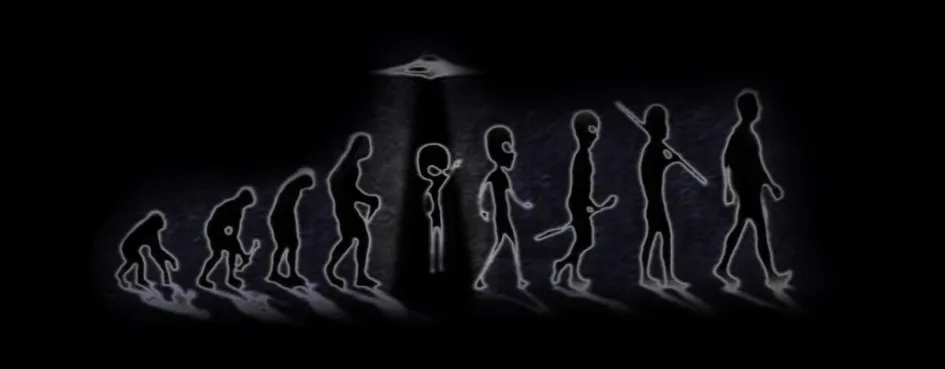

# Уровень 7: Развитие, продвижение и темпы прохождения

Данный пост — перевод седьмой статьи из [курса лекций «Принципы игрового баланса»](https://gamebalanceconcepts.wordpress.com/) за авторством профессионала и преподавателя [Яна Шрайбера](http://www.gamasutra.com/view/authors/916452/Ian_Schreiber.php). Переводы предыдущих лекций вы можете посмотреть по [ссылке](index.md).

### Чтение/Игры

На этой неделе никаких (кроме данной публикации).

### Ответы на вопросы прошлой недели

Если хотите сверить свои ответы за прошедшую неделю:

На самом деле, должен сознаться: я не знаю _наверняка,_ правильный ли это ответ. В теории, я бы мог написать программу, которая бы просто просчитала все варианты по двенадцати башням – если каждая из них либо Роевая, либо Вспомогательная, либо отсутствует (вы просто не построили башни в этом квадрате), тогда есть «всего» 3^12 вариантов – но сделать этого у меня сейчас нет времени. Если кто-то нашёл лучшее решение – не стесняйтесь опубликовать его здесь!

Лучшее, до чего я доигрался вручную с динамическими таблицами, были крайние ряды, состоящие как из Вспомогательных, так и из Роевых башен, с центральным рядом из Вспомогательных, коэффициент урона/цены при этом был 1,21.

Две Вспомогательные башни в центре давали +50% к урону шести Роевым башням вокруг них, таким образом давая каждая суммарный бонус 1440 очков, в то время как две Вспомогательных башни по бокам поддерживали четыре Роевые башни с бонусом к урону по 960 очков каждая. В среднем же, Вспомогательные башни давали урон в 1200 при цене в 500, то есть соотношение урона к цене было 2,4.

Каждая Роевая башня давала урон 480 очков (х8 = 3840 урона всего). Каждая башня стоит 640, таким образом коэффициент урона/цены 0,75 для каждой. И хотя это гораздо худший показатель, чем у Вспомогательных башен, Роевые башни всё же стоит иметь; если мы уберем хоть одну, это снизит эффективность окружающих Вспомогательных башен, так что в комбинации Роевые башни всё равно более эффективная трата средств, чем просто пустое место.

Тем не менее, Вспомогательные башни – всё же _гораздо_ более эффективное вложение средств (и если вы рассмотрите другие типы башен, вы увидите, что Вспомогательные башни – самый эффективный тип башен в игре, безусловно, только если они окружены полностью прокачанными башнями других типов). Единственное по моему мнению, что не даёт этим башням занять доминирующие позиции на высоких уровнях – это их высокая цена, так что вряд ли у вас будет достаточно наличности на то, чтобы полностью раскрыть их потенциал. Среднестатистическая игра продолжается 40 уровней и может принести вам несколько сотен долларов и около того, а этого просто недостаточно для того, чтобы выстроить боевые порядки из прокачанных до предела башен. Или, возможно, вы найдёте новые доминирующие стратегии, которые до сих пор никому не удавалось открыть…

### На этой неделе

В расписании на сегодня стоит тема «развитие, продвижение и темпы прохождения в однопользовательских играх», но я передумал. Многие игры включают элемент продвижения и развития, даже многопользовательские. Есть многопользовательские кооперационные игры, вроде настольных ролевых _Dungeons&Dragons,_ или экшн-RPG для консолей, такие как _Baldur’s_ _Gate: Dark_ _Alliance,_ или игры для ПК как _Left 4 Dead._ Даже среди многопользовательских соревновательных игр, есть много таких, где игрок развивается и становится сильнее в процессе игры: игроки приобретают новые земли и используют более мощные заклинания по мере развития игры _Magic: the_ _Gathering,_ тогда как в _Starcraft_ к концу сессии игроки выставляют всё более мощные юниты. Потом есть ещё ММО, такие как _World_ _of_ _Warcraft,_ в которых продвижение встроено в игру в качестве базовой механики, даже на PvP-серверах. Так что в добавок к однопользовательскому опыту вроде типичного прохождения _Final_ _Fantasy,_ мы поговорим и о других вещах: а именно, как балансировать механику продвижения?

### Погодите-ка, так что такое баланс?

Во-первых, стоит вспомнить, что вообще значит «баланс» в этом контексте. Как я сказал во вступлении к этому курсу, с точки зрения продвижения есть три вещи, на которые необходимо обращать внимание:

1.  Соответствует ли уровень сложности игры требованиям аудитории, или же игра в целом слишком трудная или слишком простая?
2.  По мере продвижения игрока в игре, мы ожидаем, что игра будет становиться труднее, чтобы компенсировать растущие навыки игрока, ведь он учиться и играет всё лучше; возрастает ли сложность планомерно, или же игра слишком быстро становится сложной (что ведёт к раздражению), или сложность растёт слишком медленно (приводя к тому, что скучающий игрок ждёт, когда же игра вновь станет интересной)?
3.  Когда ваш игровой персонаж становится сильнее, оттого, что ему попадаются всё более мощные объекты, такие как новое оружие, инструменты и прочие примочки, дающие особые способности, или он просто получает прибавку к характеристикам, таким как очки здоровья или атаки, хорошо ли его прогресс соотносится с ростом вражеской силы? Или же вы наращиваете мощность слишком быстро (когда в определённый момент игра становится слишком простой), или слишком медленно (из-за чего вам приходится медленно пробираться через игру, проходя по нескольку раз то, что вам уже давно известно, только затем, чтобы набрать нужные очки)?

Всё это мы рассмотрим по очереди.

### Теория потока

Если вы ещё не знакомы с понятием «потока», прочтите [эту лекцию из прошлогоднего курса](uroven-7-protsess-prinyatiya-resheniy-i-te.md). По сути, там говорится, что если игра слишком трудна для вашего уровня мастерства, вы чувствуете себя бессильным, если она слишком проста – вам быстро становится скучно, но если уровень сложности – на пределе ваших способностей, тогда игра вас затягивает и кажется вам интереснее, и одной из главных задач для гейм-дизайнеров как раз и является обеспечение подходящего уровня сложности для наших игроков.

Здесь есть две проблемы. Во-первых, не все игроки начинают играть с одинаковым уровнем навыка, и то, что одному легко, другому трудно. Как создать для игроков одинаковый опыт, если они такие разные? Как сбалансировать игру под каждого из них?

Во-вторых, по мере продвижения игрока по игре, он осваивает её, и даже если сложность остаётся на прежнем уровне, игроку она кажется _легче._

Как решать такие проблемы? Как раз об этом мы и будем говорить на этой неделе.

### Зачем нужна механика продвижения?

Прежде чем идти дальше, стоит задаться вопросом, а какова вообще цель механики продвижения? Если мы собираемся десятую часть курса посвятить продвижению в игре, механика продвижения должна быть полезным инструментом дизайна, который достоин обсуждения. Так чем же он полезен?

#### Заканчивает игру

В большинстве случаев целью продвижения является завершение игры. Особенно это касается коротких игр: продвижение нужно затем, чтобы игра уложилась в разумные временны́е рамки. Поэтому независимо от того, делаете ли вы трехминутную игру (вроде аркад начала 80-х), игру на полчаса-час (семейная настольная), игру на 3-6 часов (военная стратегия) или 30-100 часов (консольная ролевая) – смысл в том, что у некоторых игр есть желательная продолжительность, и если вы знаете, какова эта продолжительность, принудительное продвижение задаёт игре темп и гарантирует, что она действительно закончиться за нужный промежуток времени. Далее в этой публикации мы ещё поговорим об оптимальной продолжительности игр.

#### Поощряет и тренирует для зрелой игры

В некоторый особых случаях, у игр нет конца (ММО, симуляторы, настольные RPG, игры для Facebook), так что продвижение служит как система поощрения и тренировки для дальнейшего игрового процесса, а не для того, чтобы завершить игру. В такой схеме есть одна очевидная проблема, общая для всех игр такого типа: наступает момент, когда дальнейшее продвижение бессмысленно. Игрок видел весь игровой контент, достиг «потолка» развития, открыл все особые способности в древе навыков, прокачал характеристики и т.п. Почти во всех случаях, когда игрок приходит к этому моменту, он вынужден искать, чем бы ещё себя занять, и тут происходит резкий переход в то, что иногда называют «зрелой игрой», когда цель игры переключается с продвижения на что-то другое. У игроков, которые привыкли видеть цель в продвижении, так как именно к этому игра их приучала, такой переход может вызвать неприятие. Люди, которым нравится развиваться на ранних стадиях игры, могут найти зрелую игру недостаточно увлекательной, ведь действия в ней сильно отличаются от ранней игры (и наоборот, люди, которые были бы в восторге от зрелой игры, так до неё и не доходят, потому что у них не хватает терпения возиться с продвижением).

#### Что происходит в зрелой игре?

В играх-симуляторах, таких как FarmVille, зрелая игра – это творческое самовыражение: вы делаете свою ферму красивой, чтобы было что показать друзьям, или же вы разыгрываете истории и сценки со своими симсами.

В ММО зрелая игра – это рейды высокого уровня, требующие чёткой координации внутри больших групп, или PvP-зоны, где вы сражаетесь с реальными противниками одни на один или в командах, или же исследуете социальные аспекты игр, такие как управление и роль лидера Гильдии.

В настольных ролевых играх зрелая игра – это, как правило, поиск изящного способа отправить своего персонажа на покой и удовлетворительным образом завершить игру, что само по себе интересно, ведь в этих играх «зрелая игра» — это, по сути, квест на её завершение!

#### Что происходит с играми, которые заканчиваются?

В играх, где продвижение всё же завершает игру, тоже существует проблема: как правило, если вы набираете силу в ходе игры, и это служит вам наградой, игра заканчивается как раз тогда, когда вы достигаете пика своей мощи. Это значит, что наслаждаться своей всесильностью вам приходится совсем недолго. Если же вы теряете силу в ходе игры, что может происходить в таких играх, как шахматы, вы будете чувствовать себя так, будто вас всю игру усердно втаптывали в грязь – а это немногим лучше.

Питер Молиньё отметил этот недостаток, когда говорил о приближающемся выходе Fable 3, где как он утверждает, вы сначала достигаете пика своей мощи, успешно правите миром, а затем вынуждены проводить остаток игры, выполняя обещания, которые вы раздавали, чтобы добиться власти. И это отличный слоган, но автор имеет в виду, что он взял стандартную модель продвижения из консольных ролевых игр, сократил её и добавил зрелую игру, а значит, успех или провал Fable 3 полностью зависит от того, насколько ей удастся предоставить качественный игровой опыт на стадии зрелой игры, который будет в равной степени интересен тем, кому игра нравилась и тогда, когда он был только на пути к этой стадии. Я не говорю, что это невозможно, но он поставил себе трудную задачу. В интервью, которое я видел, эта фраза прозвучала как простое решение вековой проблемы, но как мы видим, это лишь замена одной сложной дизайнерской проблемы на другую. Я очень надеюсь, что он её решит… Ведь если ему это удастся, решение найдёт широкое применение и для ММО, и для игр вроде FarmVille, и для всего, где есть стадия зрелой игры.

### Два типа продвижения

Продвижение в PvP и PvE-играх обычно происходит по-разному. В PvP (включая и многопользовательские PvP «бои насмерть», и однопользовательские игры против оппонента-ИИ), вы пытаетесь выиграть у другого игрока, человека или ИИ, так что вы продвигаетесь относительно продвижения вашего оппонента. В играх PvE (включая и однопользовательские, и многопользовательские кооперационные) вы продвигаетесь вперёд, чтобы справиться с задачами и преодолеть трудности, а также прийти к некому конечному состоянию, так что в большинстве таких игр ваш прогресс не относительная, но абсолютная величина. Поэтому самое базовое ключевое отличие, которое я хочу подчеркнуть, это то, что фокус здесь либо на силе соперников относительно друг друга, либо на абсолютной силе, которая соотносится только с базовыми системами игры. Я использую термины «PvP» и «PvE» для краткости, так что если я вдруг оговорюсь и назову PvP «многопользовательской» а PvE – однопользовательской игрой это просто потому, что таковы самые распространённые схемы в данных типах игр.

### Уровень сложности в PvE

Когда вы преодолеваете множество препятствий и трудностей в игре, как отследить уровень сложности, который испытывает на себе игрок, чтобы знать, увеличивается ли он слишком быстро, слишком медленно или же общий уровень сложности в самый раз подходящий?

На самом деле, это очень хитрый вопрос, потому что «сложность», которую ощущает игрок, состоит из множества разных вещей, а именно, четырёх, но игрок воспринимает это как одно ощущение: «а по плечу ли мне это?» Когда мы пытаемся измерить восприятие сложности игроком, это похоже на то, как если бы приборная панель вашего автомобиля брала наполненность бензобака, текущую скорость, обороты двигателя, перемножала бы их, получив таким образом единый показатель «счастья», и на основании этой цифры вы бы пытались выяснить что не так и почему показатель растёт или падает.

#### Четыре компонента воспринимаемой сложности

Во-первых, существует уровень мастерства игрока. Чем более игрок опытен в этой игре, тем легче кажутся ему испытания, несмотря ни на что.

Во-вторых, существует уровень силы игрока в игре. Даже если игрок не так уж искушен в игровом процессе, если удвоить ему очки здоровья, он продержится дольше, если увеличить показатели его атаки, он будет лучше расправляться с врагами, если вы дадите ему абордажный крюк, он будет залезать туда, куда раньше добраться не мог и так далее.

Третий и четвёртый компоненты – это изнанка первых двух, а именно, способы, которыми игра создаёт задачи для игроков. Игра может создавать сложности, основанные на мастерстве, требующие от игрока набраться опыта в игре, например, вводя новых врагов с лучшим ИИ, в которых из-за этого труднее попасть. Или это могут быть силовые задачи, связанные с увеличением очков здоровья или атаки врагов в игре (или просто с увеличением количества врагов), при этом враги не делаются более умелыми.

#### Навык и сила взаимозаменяемы

До какой-то степени, навык и сила могут заменять друг друга, причем это справедливо как для игрока, так и для задач перед ним стоящих. Мы постоянно так поступаем, особенно с уровнем сложности: добавляем очки здоровья или производство ресурса, или ещё каким-то образом используем всё тот же ИИ просто раздувая цифры, и ждём, что игроку придётся либо самому улучшить свои характеристики, либо искуснее распоряжаться тем, что есть, чтобы компенсировать растущую сложность. Или же игрок, которому игра кажется слишком простой, может усложнить её сам себе, игнорируя всякие бонусы, ослабляя себя и полагаясь на своё мастерство (я уверен, что хоть кто-нибудь из вас пытался выиграть в оригинальной Zelda с деревянным мечом наперевес, просто чтобы посмотреть, возможно ли это). Создание более изощрённого ИИ для создания более сложных препятствий игроку гораздо сложнее и дороже, такое очень нечасто встречается в играх (хотя результаты обычно поражают: думаю, Gunstar Heroes – хрестоматийный тому пример).

В любом случае, мы можем представить себе уровень сложности в виде суммы силы и мастерства игрока, вычтенной из суммы игровых задач, основанных на силе и мастерстве. Разница даёт нам уровень сложности, ощущаемый игроком. Итак, когда один из этих параметров меняется, игрок чувствует, что игра стала проще или сложнее. Можно выразить это математически в виде такого уравнения:

Ощущаемая сложность = (Задачи на мастерство + Силовые задачи) – (Мастерство игрока + Сила игрока)

#### Пример: ощущаемая сложность снижается сама собой

Как нам использовать эти данные? Давайте возьмём навык игрока, который, как правило, увеличивается со временем. Это очень существенно, потому что это значит, что при прочих равных условиях, то есть при том же уровне силы игрока, и при игровых задачах той же сложности, со временем игра будет казаться игроку всё проще, и в конце концов станет слишком простой. Чтобы удержать внимание игрока по мере его обучения, игра должна каким-то образом становиться сложнее. (По крайней мере такая игра, где навык игрока может улучшиться. Существуют игры, где начисто отсутствует элемент мастерства – на такие игры это правило не распространяется).

#### _Изменение навыков игрока_

Вы можете подумать, что кривая навыка игрока вне нашего влияния. В конце концов, игроки приходят к нам уже с разным уровнем мастерства, да ещё и учатся с разной скоростью. Между тем, мы как дизайнеры всё же _можем_ повлиять на ситуацию через нашу механику:

— Если мы разрабатываем продуманные сложные механики, взаимодействующие различным образом, многоуровневые стратегии и т. д., так чтобы освоение базовых навыков в игре лишь открывало новый взгляд на игру на более абстрактном мета-уровне, кривая навыка игрока будет расти очень долго, возможно, с некоторыми явными скачками, когда игрок будет находить новые подходы, как, например, когда шахматист начинает изучать хрестоматийные дебюты, или когда он начинает понимать соотношение преимущества по времени, контроля над доской и общим количеством фигур.

— Если ваша игра незамысловата или в ней присутствует значительная доля случайности, мы ожидаем увидеть быстрый и недолгий рост навыка, когда игрок осваивает доступный ему минимум, а затем застой. Существует множество причин, сделать это преднамеренно с точки зрения дизайна. Например, это распространено в образовательных играх, где одной из предпосылок является задача научить игрока чему-то новому, а затем вам нужно, чтобы игрок _перестал играть_ и переключился на изучение чего-нибудь ещё. Или это может быть компромиссом, на который необходимо пойти, чтобы сделать вашу игру доступной: «За минуту научишься, за минуту освоишь».

— Вы также можете контролировать скорость обучения вашего игрока в зависимости от количества туториалов и обучающих областей в вашей игре. Один из самых распространённых приёмов, популяризированных _Valve,_ — дать игроку новое оружие, инструмент или другую примочку в безопасной зоне, чтобы он поиграл с ней и освоился, а затем сразу же ввести его в простую область игры, где перед ним будет поставлено несколько несложных задач, позволяющих применить эту новую штуку и увидеть все её крутые свойства, а уже потом давать задачу потруднее, где от него потребуется совместить новую вещь с уже имеющимися и интегрировать её в свои игровые стратегии. Разрабатывая уровни таким образом, чтобы обучить игрока определённым навыкам в определённых областях, вы можете быстрее развивать навыки игрока, чтобы быстрее росло его мастерство.

— А что если вам не нужно, чтобы игрок быстро обучался, что если вам нужно продлить игру? Если вы хотите, чтобы игрок обучался дольше, вы можете использовать то, что, как я слышал, иногда называют «шлюзованием». То есть, вам совсем необязательно _обучать_ своей игре или вести игрока за руку. Вместо этого вы можете просто ставить перед ним задачи растущей сложности, так что по выполнении одной задачи игрок будет гарантированно готов к следующей: каждая задача, по сути, представляет собой указатель, который говорит «чтобы пройти ты должен хотя бы ЭТО УМЕТЬ».

#### _Измерение компонентов ощущаемой сложности_

Сам по себе навык игрока сложно измерить математически, потому что, как я уже говорил, он работает в паре с _силой_ игрока в любой игре, где играет роль и то, и другое. Пока что, могу вам сказать, что лучшим способом справиться с этой задачей является тестирование и сбор показателей, например, рассмотрение того, с какой частотой игроки «погибают» или терпят поражения, когда именно это случается, сколько игроку нужно времени на то, чтобы пройти уровень в первый раз, и так далее. Мы остановимся на этом подробнее на следующей неделе.

Силу игрока и силовые задачи гораздо проще балансировать математически: просто сравните кривую силы игрока с кривой силы игрового оппонента. Оба эти показателя полностью зависят от вас; вы решаете, когда игрок набирает силу и когда становятся сильнее его враги. Как должны выглядеть эти кривые? Отчасти это зависит от того, какими вы хотите их видеть, раз мы можете использовать силу как компенсационный механизм, который действует в обоих направлениях. В качестве общего руководства, самый распространённый механизм из тех, что я видел, выглядит так: в пределах определённой области (отдельного зала или уровня), вы начинаете с внезапного скачка сложности, раз игрок вступает в новое пространство, уже освоив старое. Со временем сила игрока начинает расти, либо благодаря прокачке, либо благодаря выпадению предметов, до тех пор, пока он не достигает конца уровня, где его может ждать очередной скачок сложности в виде босса, а далее, как правило, ещё один скачок – на этот раз в силе игрока, когда он получает выпавший из босса лут, или достигает того предела, где можно повысить уровень персонажа.

Некоторые залы разбиты на несколько частей, с простым началом, средней сложности боссом, трудной частью, а затем главным боссом, но на самом деле это тот же самый сценарий, который повторяется несколько раз без смены декораций. Нанижите несколько таких один за другим – вот вам и увеличение сложности в игре: сложность изначально подскакивает в новой области игры, некоторое время остаётся неизменной, делает резкий скачок в конце (босс), а затем возвращается на прежний уровень; в то же время сила игрока резко возрастает в конце игровой области, с постепенным приростом от найденных предметов и прокачки уровней.

Это, однако, не _единственный_ сценарий прироста силы, и даже не обязательно лучший для вашей игры! Всё будет зависеть от жанра и целевой аудитории. В _Space_ _Invaders_ в ходе отдельной игровой сессии, уровень сложности, уровень силы и мастерства игрока остаются неизменными; единственное, что увеличивается – это требования игры к мастерству игрока (пришельцы нападают быстрее и начинают делать это ближе к земле с каждой последующей волной) пока в конце концов они не обеспечивают такой уровень сложности, с которым игрок уже не в силах справиться.

### Награды в PvE

В PvE-играх особенно сильно то, что иногда называется «графиком наград» или циклом «риск/вознаграждение». Основная мысль здесь в том, чтобы игрок не просто продвигался, но и чувствовал, что его _награждают_ за хорошую игру. В этом смысле само продвижение можно считать наградой: игрок продолжает игру и показывает своё мастерство, способность к продвижению в игре показывает игроку, что у него получается и поощряет играть хорошо. Отсюда следует одна важная вещь: вам необходимо сделать так, чтобы игрок заметил эти поощрения (на практике это, как правило, не проблема). Ещё одна вещь, которая следует отсюда: для вознаграждения очень важно правильное время:

— Если вы награждаете слишком мало или слишком редко, когда игрок проходит длинные участки пути без положительного подкрепления – это, как правило, плохо. Игрок может быть деморализован, ему начинает казаться, что он совсем не продвигается или играет неправильно (даже если играет он замечательно).

— Как ни странно, давать _слишком много_ наград тоже рискованно. Все мы знаем из психологии, что ощущение счастья дают какие-либо улучшения или приобретения, поэтому много маленьких наград дают больше счастья, чем одна большая, даже если в сумме то на то и выходит. Давая слишком много больших наград за короткий промежуток времени, вы уменьшаете их ценность.

— Ещё один факт из психологии: случайный график наград оказывает гораздо большее воздействие, чем фиксированный график. Это _не значит,_ что сами награды должны даваться _невпопад_; они должны быть связаны с успехами игрока в игре, являясь прямым следствием действий игрока, так чтобы вызвать у него чувство достижения. Гораздо эффективнее награждать игрока за его осмысленные действия в игре, а не за что-то, что он сделал даже не пытаясь и не подозревая об этом.

Вот несколько примеров:

— Случалось ли, что вы начинали новую игру на Facebook и тут же получали кубок или бонус за «открытое достижение» просто за то, что зарегистрировались? Думаю, это ошибка, которую совершают очень многие социальные игры: награда кажется необоснованной, и это обесценивает последующие достижения в игре. Создаётся впечатление, что игра слишком простая. Для некоторых игр так и _задумано_ – если целевая аудитория крайне казуальна, но всё равно существует опасность уменьшить важность позднейших _настоящих_ достижений.

— «Скрытые достижения» в играх на Xbox 360, или их эквивалентах на других платформах. Если достижения – это награда за мастерство, то как игроку знать, чего он достиг, когда достижение скрыто? Хуже того, множество достижений даются за вещи, которые даже не зависят от игрока и кажутся надуманными, вроде «нанести точно 123 очка урона за одну атаку», когда урон рассчитывается случайным образом. Что именно должен чувствовать игрок, которого награждают за такое?

— Положительным примером может быть случайное выпадение лута в обычной ролевой игре или игре в стиле экшн. Хотя они и случайны, и игрок лишь иногда получает что-то действительно классное, всё же эти награды связаны с осознанными действиями игрока, направленными на поражение врага, так что это действительно награда, просто по случайному графику. (Обратите внимание, что здесь вы можете вмешиваться в «случайность», например, отслеживать время, прошедшее между выпадением редких предметов и заставлять систему выдавать игроку награду, если ему уже давно ничего не попадалось. Некоторые игры различают случайные награды и фиксированные – за особые квесты и боссов, так что игрок время от времени получает _хоть какие-то_ классные вещицы).

— Ещё один классический пример: игрока балуют сценой-вставкой каждый раз, когда он достигает определённого места в подземелье. Вы, конечно, можете сказать, что это не случайно – раз происходит каждый раз в определённый момент, потому что дизайнер уровней задал в скрипте, чтобы событие происходило строго в этом месте! И если рассматривать многократные прохождения – вы будете правы… Но когда человек играет впервые, он ещё не знает, где именно расположены эти награды, так что с точки зрения игрока, это что-то непредсказуемое – то же самое, что и случайное.

А теперь я хотел бы поговорить о трёх типах наград, связанных с продвижением: увеличение силы игрока, переход с уровня на уровень и развитие сюжета.

#### _Поощрение игрока увеличивающейся силой_

Продвижение посредством получения новой примочки/предмета/способности, которые увеличивают возможности игрока – это ещё одна веха. Как мы уже говорили, желательно, чтобы они отстояли друг от друга во времени. И всё же мне часто приходилось видеть, как игрок получал всё самое классное в первой трети или половине игры, а затем проводил оставшуюся её часть в поисках новых интересных способов использовать все эти вещи. Это может быть вполне оправданно дизайном; если самую интересную вещь в игре находят только когда 2/3 уже пройдено, выходит, что игрок довольно долго не видит ничего интересного; известный пример такой ситуации – гравитационная пушка из _Half_ _Life 2_ от _Valve:_ изначально они задумывали давать эту пушку игроку ближе к концу игры, но игрокам она так понравилась, что они перестроили уровни и стали давать её гораздо раньше.  И всё же, если вы дадите игроку доступ ко всему на свете слишком рано, вам придётся использовать другие виды наград, чтобы удерживать его интерес на финальных стадиях игры, где плюшки уже на дороге не валяются. Как это сделать? Вот несколько способов:

— Если у вас глубокая механика, вы можете предоставить уникальные комбинации предметов, чтобы занять и заинтересовать игрока. (На практике это очень трудно осуществить).

— Когда прекратят попадаться предметы, свободнее используйте другие виды наград: больше сюжета, больше прокачки, больше встреч с боссами и переходов между уровнями. Кроме того, можно предложить прокачку этих предметов, хотя тут спорный момент, считать это прокачкой или просто «новой плюшкой».

— Или вы просто-напросто можете сократить свою игру. К счастью, в наши дни в этом нет ничего зазорного. _Portal_ и _Braid_ обе хорошо известны двумя вещами: это замечательные и короткие игры. Из высокобюджетных игр одной из лучших за прошлый год признана _Batman: Arkham Asylum_ (причем как по продажам, так и по отзывам критиков), даже несмотря на то, что длится она, как я слышал, всего около десяти часов.

#### _Поощрение игрока переходами с уровня на уровень_

Продвижение по уровням – то есть продвижение в новую область игры – это особый вид поощрения, потому что он даёт игроку ощущение прогресса (это и есть прогресс!). Обычно стоит выдерживать между такими переходами временны́е промежутки, чтобы не перегружать игрока переменами и не вызвать ощущения, что игра летит вперёд сама по себе. Проверенное правило: предлагайте новые уровни и зоны по чуть увеличивающейся кривой, где каждый новый уровень длится чуть дольше, чем предыдущий. Так игрок чувствует, что продвигается вперёд чуть быстрее поначалу, когда он ещё не вовлёкся эмоционально; а вот ближе к концу игры он уже может потерпеть подольше от одного перехода к другому, особенно если это имеет смысл в рамках сюжета. Как ни странно, многого в этой области можно достичь используя только визуальное оформление уровней, что, нельзя не признать, выходит за рамки гейм-дизайна и вторгается в сферу графики: например, если игрок проходит очень длинное подземелье, вы можете добавить каких-то деталей, которые будут отличать разные зоны подземелья друг от друга: например, пусть по мере продвижения игрока вглубь, цвет или текстура стен меняется – тогда он будет чувствовать, что не стоит на месте.

#### _Поощрение игрока развитием сюжета_

Продвижение посредством развития сюжета интересно для анализа, так как во многом сюжет всё-таки отделён от игрового процесса: в большинстве игр осведомлённость о мотивах персонажей или их чувствах друг к другу не имеет никакого влияния на механику боя. И между тем, во многих играх (изначально их круг ограничивался только ролевыми, но сейчас сюжет появляется в самых разных жанрах) развитие сюжета действительно встроено в систему наград.

Вдобавок, история имеет свои собственные трудности (мы называем их «драматическое напряжение»), так что надо учитывать, накладывается ли драматическое напряжение сюжета на повышение уровня сложности игры. Во многих играх такого не случается: кульминация происходит в конце, а самая сложная часть игры – где-то в середине, до того, как вы обнаруживаете всесильное оружие, сильно упрощающее остаток игры. В целом же желательно, чтобы растущее напряжение вашего сюжета совпадало с растущей сложностью игры, драматические кульминации накладывались на пики сложности и так далее – так ваш сюжет будет теснее связан с механиками игры, благодаря игровому балансу и вычислениям. То, что улучшить сюжет вам поможет математика, звучит довольно странно, но так и есть. (Это можно сделать и по-другому: заставить ваших сценаристов добавить в историю драматизма там, где этого требует кривая сложности, но думается мне, что проще заменить пару цифр, чем переписывать сюжет).

### Уровень сложности в PvP

В PvE-играх центральное место занимают награды и продвижение, тогда как в PvP главное – это то, сколько вы потеряли или приобрели по сравнению со своим соперником. Прямо или косвенно, но цель состоит в том, чтобы набрать достаточно силы для победы в игре, и между игроками происходит в некотором роде перетягивание каната, ведь каждый хочет набрать побольше раньше, чем соперник. Напомню, когда я говорю «сила» в контексте продвижения, я имею в виду сумму всех аспектов положения игрока в игре, так что сюда относится обладание большим количеством карт или фишек в игре, большим количеством ресурсов, лучшей позицией на доске, совершение большего количества ходов или действий, или _что угодно другое,_ если оно воздействует на положение игрока (кроме мастерства игрока). Условием победы иногда является достижение непосредственно определённого уровня; иногда условие опосредованное и абстрактное, например, некие «очки победы», и вся сила игрока лишь _даёт ему возможность_ получения этих очков. В некоторых случаях игроки _не наращивают_ силу, а _теряю_ её, и целью является исчерпать силу оппонента как можно быстрее. Как бы то ни было, получить больше силы _относительно_ противника – обычно важная задача в игре.

Отслеживание силы игрока по мере продвижения игры (то есть наблюдение за изменениями в силах за единицу времени или за ход в зависимости от типа игры – в реальном времени или очерёдность) в PvP-играх может производиться разными способами. В PvE вы почти всегда наблюдаете увеличение абсолютной силы игрока с течением времени (даже несмотря на то, что уровень его силы относительно сложности игры может расти или падать). В PvP существует больше вариантов, так как всё оценивается относительно ваших соперников, а не сравнивается с неким абсолютным мерилом «чтобы победить нужно быть ВОТ ТАКИМ».

#### _Игры с положительной, отрицательной и нулевой суммой_

Сейчас самое время поговорить об очень важном аспекте продвижения, основанного на силе, эту характеристику мы позаимствовали из теории игр: является ли игра игрой с положительной, отрицательной или нулевой суммой. Если раньше вы не слышали этих терминов, вот пояснения:

— Игра с **положительной суммой**: это значит, что общая сила растёт во времени. _Settlers_ _of_ _Catan –_ пример игры с положительной суммой: с каждым броском костей для игроков генерируются новые ресурсы, и все игроки одновременно могут получить прирост в силе, даже если противники ничего не потеряли. _Монополия_ также служит примером игры с положительной суммой, так как в среднем каждый полный круг по игровому полю даёт игроку $200 (и эти деньги поступают из банка, а не от других игроков). И хотя есть несколько клеток, которые изымают деньги из игры, а значит сумма при этом отрицательная (Налог на прибыль, Налог на роскошь, некоторые карточки Шанса и Общественной казны, выкуп заложенной собственности, иногда – Тюрьма), _в среднем_, эти убытки покрываются теми двумя сотнями долларов, которые даются за тур, так что _в среднем,_ в игру поступает больше богатства, чем из неё уходит, некоторые игроки добавляют свои «домашние» правила, позволяющие им получить дополнительные джек-поты, когда их пешка становится чётко на клеточку Старт или просто на бесплатное место, что делает сумму игры ещё более положительной. И несмотря на то, что вы можете потерять большие суммы, уплатив их другим игрокам за остановку на принадлежащих им клетках, само это действие имеет нулевую сумму (один игрок теряет деньги, другой ту же самую сумму получает). Этим объясняется, почему многим кажется, будто _Монополия_ просто бесконечна: это игра с положительной суммой, так что в среднем богатство игроков растёт во времени, но цель игры – привести противников к банкротству, а сделано это может быть только методами с нулевой суммой. К тому же домашние правила, используемые большинством людей, лишь усиливают положительную сумму игры и усугубляют проблему!

— Игра с **нулевой суммой:** значит, что сумма всей силы в игре постоянна, и не может быть ни создана, ни уничтожена игроками. Другими словами, единственный способ получить силу – отобрать её у другого игрока, при этому вы получаете ровно столько, сколько он теряет. Примером игры с нулевой суммой является покер, так как единственный способ выиграть деньги – это забрать их у других игроков, поэтому вы получаете ровно столько, сколько проигрывают все другие в сумме. (Если вы играете онлайн или в казино, заведение забирает себе определённый процент от каждого «банка», а значит для игроков игра получается уже с отрицательной суммой).

— Игра с **отрицательной суммой:** это значит, что с течением времени игроки теряют больше силы, чем получают; действия игрока выводят силу из игры, ничем её не возмещая. Шахматы – хороший пример игры с отрицательной суммой; как правило, с течением времени ваши силы убывают. Когда вы захватываете фигуры противника, вы не делаете их своими, вы просто убираете их с доски. В шахматах нет действий с нулевой суммой, где захваченная вами фигура противника становится вашей (хотя родственная шахматам игра _сёги_ действует как раз по такому принципу – и в результате обладает совершенно другой динамикой). В шахматах есть лишь один элемент с положительной суммой – превращение пешки в фигуру, но как правило, это случается редко и только в конце игры, что служит важной цели: добавляя в игру позитивную петлю обратной связи, ускоряет её завершение… об этом мы с вами поговорим совсем скоро.

Интересное свойство здесь в том, что и при нулевой, и при положительной, и при отрицательной сумме, изменения в силе игрока являются _главной наградой_ в PvP-играх. Игрок чувствует себя поощрённым, так как он получил преимущество в силе относительно своих соперников, а значит после удачного хода увеличились и его шансы на победу.

#### _Позитивные и негативные петли обратной связи_

Также я должен здесь упомянуть о том, как со всем этим соотносятся позитивные и негативные петли обратной связи, потому что у вас может быть любая из них в игре и с нулевой, и с отрицательной, и с положительной суммой, но действуют они по-разному. Если эти термины вам не знакомы: «позитивная петля обратной связи» означает, что при получении награды, получение следующей становится _более вероятным,_ другими словами, вас поощряют за хорошую игру и наказывают за плохую; «негативная петля обратной связи» действует обратным образом – когда вы получаете награду, получение следующей становится _менее вероятным,_ так что вас наказывают за хорошую игру и поощряют за плохую. Я [очень подробно останавливался на этом в прошлом году](uroven-5-mehanika-i-dinamika.md), поэтому не буду повторяться.

Одним из интересных свойств петель обратной связи является их воздействие на кривую силы игрока. С негативной петлёй обратной связи сила одного игрока обычно зависит от силы другого: она будет расти, когда игрок отстаёт от других, и уменьшаться, когда игрок опережает других, поэтому кривая силы конкретного игрока может выглядеть очень по-разному в зависимости от его позиции относительно оппонентов и от конкретной игры.

С позитивной петлёй обратной связи кривая, как правило, растёт или падает резче, с большими перепадами ближе к концу игры; в отличие от негативной петли, позитивная далеко не всегда учитывает позиции оппонентов… вы можете просто награждать игрока за абсолютные успехи.

Это не значит, что данные правила непоколебимы… негативная петля обратной связи _может_ быть абсолютной – в таком случае она замедляет всех ближе к концу игры; а позитивная петля обратной связи может быть относительной – в таком случае вы обретаете большую силу, когда вырываетесь вперёд. Несмотря на это, если мы понимаем, каким целям дизайна служат петли обратной связи, мы видим, почему позитивные петли обычно не зависят от оппонентов игрока, а негативные – как правило, зависят.

#### _Назначение петель обратной связи в гейм-дизайне_

Главная цель позитивной петли обратной связи – ускорить окончание игры. Как только появляется побеждающий игрок, который оставляет соперников далеко позади, вам не нужно тянуть резину и тратить время зря. Именно поэтому все игроки ближе к концу игры выходят на ускоренную кривую. На самом деле, даже не важно, _кто именно_ вырвался вперёд; цель – приблизить _конец_ игры, и раз все прибавляют в силе, конец приближается быстрее.

И наоборот, главная цель негативной петли обратной связи – дать отстающим игрокам возможность догнать остальных, так что никто никогда не будет чувствовать, что победа уже недостижима. Если все замедляются ближе к концу игры примерно одинаково – этого недостаточно, ведь если кто-то с самого начала отставал, он и в конце игры может оставаться последним, и несмотря на то, что разрыв между игроками _как будто_ сокращается, отстающие замедляются вместе со всеми остальными. Чтобы действительно позволить отстающим нагнать упущенное, игра должна уметь различать отстающих и лидирующих.

#### _Кривые сил_

Итак, как выглядит кривая силы игрока в игре PvP? Вот несколько способов отслеживать прирост (или потери) силы игрока с течением времени:

— В типичной игре с положительной суммой, каждый игрок каким-либо образом наращивает силу. Кривая в этом случае может быть растущей, линейной или убывающей.

— В игре с положительной суммой и позитивной обратной связью, игроки обретают больше силы, и чем больше они её получают, тем больше её становится, так что это растущая кривая (трёхпараметрический или экспоненциальный прирост в силе за единицу времени) для каждого игрока. Если вы вычтете кривую одного игрока из кривой другого игрока (что покажет вам, кто побеждает, кто проигрывает, и как часто меняется лидер), вы увидите, что обычно кто-либо из игроков вырывается вперёд довольно рано и продолжает лидировать до победного конца, если только он не совершит ошибку. Такая игра, как правило, не очень интересна тем, кто проигрывает.

— В игре с положительной суммой и негативной обратной связью, игроки также находятся на возрастающей кривой, но она меняется в зависимости от положения других игроков, сокращая прирост силы у лидера и продолжая увеличивать прирост для тех, кто отстаёт, так что если вы посмотрите на кривые всех игроков одновременно, вы увидите что-то вроде запутанной косы, где игроки поочерёдно опережают друг друга. Если вычесть прирост силы за единицу времени одного игрока из прироста другого, вы увидите, что относительная сила всё время колеблется – именно так и должна действовать _любая_ негативная петля обратной связи.

— В типичной игре с нулевой суммой игроки выигрывают силу друг у друга, при этом сумма силы остаётся неизменной. В игре с двумя соперниками это значит, что вы можете вывести кривую силы одного игрока из кривой другого.

— В игре с нулевой суммой и позитивной обратной связью, партия может закончиться очень быстро, так как один из игроков получает раннее преимущество и продолжает получать всё больше преимуществ, быстро отбирая силу у своих противников. Обычно в играх такого типа существует ещё и негативная петля обратной связи, действующая на ранних этапах и не дающая игре закончиться преждевременно, если, конечно, она изначально не задумана очень короткой.

— В игре с нулевой суммой и негативной обратной связью, мы как правило видим колебания в силе, которые тянут лидирующего игрока обратно к центру. Все игроки удерживаются рядом, и отдельному игроку становится очень трудно победить; если негативная отдача слишком сильна, вы запросто можете зайти в безвыходную ситуацию, где ни один из игроков не может победить, а это обычно не нравится никому. Как правило, для игр с нулевой суммой существует такая модель дизайна: на ранних стадиях игры существует сильный механизм негативной отдачи, который сходит на нет к концу игры, тогда как позитивная отдача к концу увеличивается. Таким образом можно создать очень увлекательные партии, где каждый из игроков по очереди лидирует, пока, наконец, один последний, зрелищный и неотвратимый триумф не приводит игру к завершению.

— В типичной игре с отрицательной суммой, основная суть сводится к тому, что игроку необходимо не набирать достаточное количество силы для победы, а терять _как можно меньше_ силы относительно своих противников. В играх с отрицательной суммой игроки выходят из игры тогда, когда теряют наибольшее количество или всю свою силу, и цель здесь либо быть последним выбывшим, либо находится в наиболее выигрышном положении, когда будет выбывать первый из игроков. Кривая силы игрока может быть как растущей, так убывающей или постоянной – что-то вроде отражения игры с положительной суммой, да и вообще почти всё здесь выглядит так же, как перевёрнутая игра с положительной суммой.

— В игре с отрицательной суммой и позитивной обратной связью отстающие игроки будут проигрывать ещё быстрее. Чем больше силы осталось у игрока, тем медленнее он будет её терять, но как только он ступил на эту скользкую дорожку, он катится по наклонной всё быстрее.

— В игре с отрицательной суммой и негативной обратной связью, отстающие игроки проигрывают медленнее, а игроки, обладающие большой силой, обычно теряют её быстрее, так что вы снова наблюдаете «косу» из переплетённых кривых силы игроков, которые вместе опускаясь вниз, попеременно обгоняют друг друга.

#### _Применение кривых силы_

Ну что ж, возможно теперь вы представляете себе, как в теории выглядит кривая силы, показывающая как сила игрока изменяется во времени… но как построить такую для существующей игры?

Самый простой способ построения графика силы – на основании результатов тестирования. Даже приблизительные цифры помогут вам с лёгкостью создать подобный график. Самое сложное здесь – придумать некую числовую формулу для выражения «силы» в игре: насколько хорошо у игрока обстоят дела с абсолютной точки зрения. С некоторыми играми это сделать проще, чем с другими. В играх с миниатюрами, такими как _HeroClix_ или _Warhammer 40K,_ каждая подконтрольная вам фигурка имеет определённую цену в очках, так что нетрудно сложить все ваши очки на каждом из ходов и получить примерное представление о том, как обстоят дела у каждого из игроков. В стратегиях реального времени, таких как _Starcraft,_ можно получить вполне приемлемое представление об изменении силы во времени, если сложить текущие ресурсы игрока, ресурсную стоимость его юнитов и строений. Для шахмат, где необходимо измерить и оставшиеся фигуры, и положение на доске, и выигрыш по времени, всё немного сложнее. Но как только у вас появляется «формула силы», вы можете отслеживать изменения силы для всех игроков в ходе всех тестирований и проследить, какие будут появляться закономерности.

#### _Окончание игры_

Одна из важнейших вещей, на которую вы должны обратить внимание при построении кривых – это время, за которое игра приходит к определённому состоянию. Вам нужно так масштабировать игру, чтобы она заканчивалась тогда, когда это нужно вам.

Самым очевидным способом это сделать является жёсткое ограничение времени или ходов, которое гарантирует установленную продолжительность игры («игра заканчивается после 4 раундов»); иногда это необходимо и даже увлекательно, но в большинстве случаев – это ленивое дизайнерское решение, говорящее, по сути: «мы недостаточно всё это протестировали, и не смогли вычислить, сколько нужно времени, чтобы доиграть до логического завершения».

Альтернативный способ сбалансировать вашу механику продвижения – сделать так, чтобы игра завершилась в пределах нужных вам рамок. Вы можете повлиять на это, изменив степень положительности или отрицательности суммы вашей игры (то есть, основной уровень силы, который все игроки вместе взятые обретают или теряют), или добавив/убрав/усилив/ослабив петли обратной связи. Здесь всё очень просто и понятно, если у вас на руках все нужные цифры для анализа. Например, вы берёте существующую позитивную петлю обратной связи и усиливаете её действие, тогда игра будет заканчиваться раньше – вот вам и способ её сократить.

#### _Фазы игры_

Следует отметить, что в некоторых PvP-играх бывают явные переходы между фазами игры. Самый распространённый сценарий – трёхфазная структура с ранней игрой, серединой и поздней игрой, знаменитый благодаря шахматам, множество книг о которых бывают посвящены лишь какой-то одной фазе игры. Как только вы обнаруживаете эти фазы (или разрабатываете их специально), вам следует не просто обращать внимание на то, как ведёт себя кривая силы игрока на _протяжении_ игры, но и на то, как она меняется в каждой фазе, а также на относительную _продолжительность_ каждой фазы.

Например, часто в работе над прототипом выясняется, что конечная стадия не очень интересна, и зачастую, сводится к механическому выполнению правил для достижения логического завершения, которое стало ясно ещё в середине игры. Чтобы это исправить вы можете добавить некоторые механики, которые начинают действовать в конце игры и делают эту фазу интереснее. Как вариант вы можете попытаться продлить среднюю фазу или сократить конечную, подстраивая петли обратной связи и положительную, отрицательную или нулевую природу вашей игры в каждой отдельно взятой фазе.

Ещё одна распространённая проблема: игра замечательная, когда игроки ускоряются в середине игры, но начинается она медленно и скучно. Один из способов с этим справиться – добавить временную положительную сумму на ранних стадиях игры, чтобы игроки быстрее наращивали силу и переходили в среднюю фазу.

Некоторые игры явно делят игровой процесс на фазы ещё на уровне базового дизайна. Примером может служить настольная игра _Shear_ _Panic,_ где дорожка разделена на четыре области, и в каждой из них меняются правила набора очков, привнося новые ощущения от игры в каждой игровой фазе. В этой игре переход между фазами основывается на количестве ходов, сделанных каждым игроком. Здесь вы можете легко продлить каждую фазу, увеличив количество ходов, которые выполняются в её границах.

В других играх переходы между фазами не такие выраженные, и они могут не сразу стать очевидными, как могут и не быть разработаны преднамеренно. Например, я уже упоминал шахматы. Ещё есть _Netrunner,_ асимметричная коллекционная карточная игра, где один игрок (Корпорация) пытается ввести карты в игру, а затем тратит действия на то, чтобы конвертировать эти карты в очки, а другой игрок (Курьер) пытается похитить эти очки. После того, как игра вышла в свет, игроки на турнирах довольно быстро поняли, что игра разделяется на три явные стадии: ранняя стадия, когда Курьер находится в относительной безопасности и может похищать столько, сколько только возможно; средняя стадия, когда Корпорация начинает разворачивать защиту и временно делает похищение очков практически невозможным (это слишком дорого обходится); и, наконец, финальная стадия, где Курьер, собравшись силами и ресурсами, пробивает защитный барьер Корпорации и может похитить недостающие ему для победы очки. Если рассматривать игру с этой точки зрения, Корпорация пытается как можно быстрее перейти из первой стадии игры во вторую и растянуть её как можно дольше, а Курьер пытается, как только возможно, продлить первую стадию, и если победить сразу не получается – пытается ускорить переход из второй фазы в третью, пока Корпорация не набрала необходимого для победы количества очков.

Как сбалансировать механику продвижения в такой игре? Например, можно сделать так, как и поступили в _Netrunner’_е_:_ отдать продвижение игры под частичный контроль игроков, так что они совместными усилиями пытаются продвинуть игру вперёд, либо задержать её. Таким образом создаётся интересное метауровневое стратегическое противостояние.

Ещё можно было бы ввести некоторые механики, которые помогают точно определить, в какой фазе вы находитесь или, по крайней мере, лучше работают в какой-то одной фазе, чем в остальных. В _Netrunner’_е такие тоже есть. Например, Курьер имеет в своём распоряжении несколько очень дорогих карт атаки, которые не особо полезны в начале игры, когда ресурсов ещё немного, но которые очень помогают в конце игры, на финальной стадии. Таким образом, когда игроки используют новые стратегии на каждом из этапов, игра начинает ощущаться совсем иначе, по мере её продвижения динамика сильно меняется. А затем, разумеется, вы можете использовать эти механики для того, чтобы подгонять длину каждой фазы, чтобы заставить игру продвигаться нужными вам темпами. В _Netrunner’_е у Корпорации есть несколько недорогих карт защиты, которые она может быстро выбросить в игру, чтобы поскорее перейди в среднюю стадию, а также есть карты подороже, которые можно использовать, чтобы завысить Курьеру планку, до которой ему необходимо дотянуть для перехода в конечную стадию игры. Подстраивая абсолютную и относительную длину каждой фазы вы можете обеспечить игре такую продолжительность, которая нужна вам, а также разбить её на фазы, которые хорошо соотносятся друг с другом по времени.

### _Идеальная продолжительность игры_

Всё это подразумевает, что вы знаете, какая продолжительность игры (и каждой её фазы) вам нужна, но как с этим определиться? Отчасти это зависит от целевой аудитории: детям младшего возраста нужны короткие игры под стать их способности к концентрации внимания. Занятые взрослые любят игры, в которые можно играть урывками, понемногу. Другой важный фактор, как мне кажется, уровень и глубина мастерства: более казуальные игры, с большим уровнем случайности, как правило, короче, тогда как глубокие стратегические игры обычно дольше. Другой вещью, на которую следует обратить внимание является то, насколько вперёд необходимо вырваться игроку, чтобы он считался состоявшимся победителем: вам следует максимально сблизить этот момент с фактическим завершением игры, чтобы не затягивать её понапрасну.

Для бесконечных игр, таких как ММО или игры на Facebook, можно считать стадию «зрелой игры» финальной бесконечной «фазой», так что вам нужно изменить продолжительность фазы продвижения так, чтобы переход происходил тогда, когда он вам нужен. Как долго она будет длиться, зависит от того, на что именно вы хотите сделать акцент: на фазе продвижения или на зрелой игре. Например, если фаза продвижения сильно отличается от зрелой игры, и вы видите большую текучку, то есть, множество людей покидают игру, когда она переходит в зрелую стадию, а вы при этом используете бизнес-модель с платной подпиской, поэтому заинтересованы в том, чтобы люди оставались в игре как можно дольше, то вам, пожалуй, следует сделать две вещи: поработать над смягчением перехода к зрелой игре, чтобы минимизировать потери в аудитории, а также найти способы продления ранней стадии (например, выпустить наборы расширений, которые поднимают потолок развития или позволяют игроку создавать нескольких персонажей с разными сочетаниями рас/классов, чтобы им было интересно проходить стадию продвижения несколько раз).

Ещё один интересный случай – RPG, построенные на повествовании, где история подчас длиннее, чем предусматривается механикой. Мы постоянно наблюдаем это в консольных RPG, где прямо на коробке написано «100 часов игры». Звучит это так, будто игра действительно наполнена смыслом, хотя на самом деле, если вы многократно проходите всё ту же затёртую до дыр механику, бессмысленно бродя по кругу 95 часов из 100, то игра просто тратит ваше время. В идеале вы должны сделать так, чтобы игрок продвигался и в изучении новых механик, и в развитии сюжета параллельно; вялотекущий игровой процесс вам совершенно не нужен, как не нужен и затянутый сюжет. Такие игры очень трудно создавать, потому что вы должны подогнать продолжительность игры и под историю, и под игровой процесс, а это также значит, что вам приходится продлевать историю или добавлять больше геймплея – и то, и другое, как правило довольно дорого обходится. (Кроме того, вы можете _сократить_ сюжет или _убрать_ глубину из игрового процесса, но если у вас был блестящий сценарий или новаторская механика, то оторвать их от сердца, чтобы немного сэкономить, будет непросто; кроме того, в рассматриваемом случае потребитель ожидает, что игра будет довольно продолжительной, дающей ощущение «эпичности», так что обычно механики или сюжет всё-таки добавляют).

### Возвращаясь к теории потока

Теперь, когда мы с этим разобрались, давайте вернёмся к потоку. В начале этой публикации я говорил, что есть две проблемы, требующие решения. Одна – навык игрока растёт по мере продвижения в игре, а значит, игрок выходит из состояния потока и начинает скучать. Обычно эта проблема характерна для длинных PvE, где у игрока достаточно времени и опыта, чтобы действительно лучше овладеть механиками.

Как мы уже говорили, когда обсуждали PvE-игры, решением здесь будет постепенное увеличение сложности, чтобы игра казалась труднее – это и есть суть того, что гейм-дизайнеры называют «темпом» игры. Для игр PvP, это не проблема, так как мы хотим, чтобы победил сильнейший; между тем, для игр, где менее искусный игрок всё же должен иметь шанс на победу, а более искусный – преодолевать сложности, мы можем ввести негативные петли обратной связи и случайность, чтобы дать дополнительное преимущество отстающему игроку.

Была ещё одна проблема с потоком: вы можете разрабатывать игру, ориентируясь на один уровень сложности, но игроки приходят к вам с разными стартовыми уровнями, и то, что для одного игрока – просто, для другого – сложно.

Для PvE, как вы можете догадаться, существующая практика – предоставить различные уровни сложности, где ИИ получает больше усилений или игрок их получает меньше, потому что это относительно дёшево и просто разработать и воплотить. Тем не менее, позвольте вас предостеречь:

1.  Если вы обращаетесь к одним и тем же тестерам, они постепенно становятся экспертами в вашей игре, а значит, они неспособны адекватно оценить сложность «простого уровня»; простое должно быть действительно простым, поэтому лучше ошибиться в сторону излишней простоты, чем усложнить игру так, что некоторые решат, что вообще не могут играть в такое. Лучший выход – периодически набирать новых тестеров на стадии тестирования (иногда их называют «клинексами» — потому что они одноразовые, как и одноимённые бумажные салфетки). Если у вас нет возможности использовать так много тестеров, приберегите хотя бы несколько новичков на потом, когда вы начнёте подстраивать сложность «простого» уровня.
2.  Заранее поставьте игрока в известность обо всех превратностях сложного уровня, особенно если ваш ИИ жульничает. Если игра с виду прикидывается честным противником, которого сложно победить из-за его высокого уровня мастерства, а позже игрок выясняет, что _на самом деле_ она подглядывает в данные, которые должны быть скрыты, это может очень огорчить игрока. Если вы честно признаётесь, что ИИ жульничает, и игрок сознательно выбирает этот уровень сложности, никто не будет в обиде: игрок _ожидает_ нечестной игры, весь смысл сводится к тому, чтобы победить _несмотря ни на что._ Иногда нужного эффекта можно добиться, творчески подойдя к названию уровня сложности, например, «Сумасшедший».

Существуют, конечно, другие способы справиться с разницей в подготовке игроков. Высшие уровни сложности в игре могут бросать вызов прежде всего _мастерству_, а не быть трудными с _силовой_ точки зрения. Наделять врагов более развитым ИИ, как я уже отмечал, — дорогое удовольствие, но это даёт впечатляющие результаты, если реализовать всё как надо. В некоторых играх есть способ сделать это дешевле: изменить дизайн уровней, блокируя простые альтернативные пути, и вынуждая игрока идти к той же цели по наиболее сложному маршруту, если выбран повышенный уровень сложности.

Кроме того, есть ещё динамическая подстройка сложности (DDA), которая представляет собой частный случай негативной петли обратной связи, где игра пытается выяснить, каковы успехи игрока, и подстроить уровень сложности на ходу. С этим подходом надо быть очень осторожным, как и со всеми негативными петлями обратной связи, потому что они _наказывают_ игрока за хорошую игру, и многим это может не понравиться, если изначально их ожидания были иными.

Ещё можно пойти на компромисс, предложив игроку самому управлять динамической подстройкой. То есть, DDA-то следит за успехами игрока… но потом предлагает _игроку самому_ поменять уровень сложности вручную. Одним из примеров служит игра _flOw,_ где игрок сам может перейти на новый, более сложный уровень, или предыдущий, более простой, почти в любой момент, основываясь на собственной оценке своего навыка. Другой пример: в _God_ _of_ _War,_ и, наверное, некоторых других играх, если вы некоторое количество раз гибнете на уровне, игра на экране перезагрузки предложит вам снизить сложность (что некоторым игрокам может показаться снисходительным, но с другой стороны, если игрок погибнет ещё раз – сам будет виноват). Игра _Sid Meier’s Pirates_ вообще предлагает игроку _увеличить_ сложность, когда вы заходите в порт после удачной миссии, давая дополнительный стимул: более высокий процент добычи при успешном выполнении будущих миссий.

Эквивалентом в PvP-играх является система гандикапа, где один игрок может начинать игру с более выгодной стартовой позицией или набирать больше силы за то же время, чтобы компенсировать свой невысокий уровень мастерства. В большинстве случаев такая фора должна быть добровольной: когда игроки начинают состязание один на один, они ожидают, что по умолчанию игра справедлива, и все равны.

### Разбор примеров

А теперь давайте рассмотрим несколько примеров, чтобы увидеть, как всё сказанное можно использовать на практике при анализе игр.

#### _Space_ _Invaders (и другие ретро-аркады)_

Эта игра ставит перед вами одну и ту же задачу на навык, и волна за волной углубляет эту задачу, по мере того, как пришельцы движутся и стреляют всё быстрей и появляются всё ниже. У игрока нет абсолютно никаких способов наращивать силу; когда вы начинаете, у вас есть три жизни – и это всё, никакого улучшения. С другой стороны, нельзя сказать, что вы _теряете_ силу в игре, в том смысле, что три у вас жизни или одна – это никак не влияет на ваши способности к защите и нападению. Цель игрока – не победить, а выжить как можно дольше, пока растущая кривая сложности его не захлестнёт. Что интересно, кривая сложности меняется в ходе каждой волны: сначала пришельцев много, и они движутся медленно, поэтому попасть в цель просто. Позже целей уже меньше, и движутся они быстрее, что делает игру труднее, и, разумеется, если хоть одна цель достигнет земли, вы теряете _все_ жизни, а значит, каждый противник – реальная угроза. Затем приходит следующая волна, и она чуть труднее предыдущей, но изначально сложность всё равно ниже. Можно подумать, что чем меньше пришельцев, тем меньше в вас стреляют, но на самом деле, мне кажется, что в игре общая огневая мощь постоянна, она лишь меняет плотность, поэтому и не меняется сильно по ходу каждого раунда).

#### _Шахматы (и другие военные игры с отрядом)_

Да, если бы мне пришлось классифицировать шахматы по жанру, я бы называл их военной игрой с отрядом… что несколько непривычно, ведь обычно мы представляем себе фигуры как _целую армию,_ а не как отряд. Я использую этот термин в том смысле, что вы начинаете с ограниченными боевыми ресурсами и, как правило, не получаете никаких подкреплений, у вас нет механики ресурсов, производства, поставок и логистики, какие бывают в более детализированных играх с войсками.

Здесь мы имеем дело с игрой с отрицательной суммой, в которую встроена небольшая положительная петля обратной связи: если вы обгоняете по фигурам, то размен, при прочих равных условиях, идёт вам на руку, а когда вы достигаете эндшпиля, на некоторых позициях вы автоматически становитесь победителем, если достаточно оторвались от противника. Это может лишить боевого духа того, кто проигрывает, особенно если у противников очень разный уровень мастерства, ведь более слабый игрок сразу же начнёт проигрывать, и его положение будет только ухудшаться по мере игры.

Единственная причина, оправдывающая эту петлю, состоит в том, что два равно искусных игрока будут по очереди перетягивать преимущество на свою сторону, разменивая фигуры для получения более сильной позиции на доске или для опережения по времени, поэтому игрок, который _кажется_ отстающим, имеет множество возможностей для возврата преимущества до эндшпиля. Когда противники – ровня друг другу, вы можете наблюдать самые различные сдвиги в силе во время размена фигур, зависящие от уровня их игры, и если они играют на равных, исход будет неясен до самого эндшпиля (и даже тогда, если игроки действительно _равны_ в своём мастерстве, мы увидим пат).

#### _Settlers_ _of_ _Catan (и другие игры с продвижением)_

Это игра с продвижением в силе, следовательно, — игра с положительной суммой. Существуют очень особые редкие случаи, когда игроки теряют мощь; но как правило, если вы что-то построили, то надёжно прибавили в силе. В _Catan_ существуют очень мощные положительные петли обратной связи, где постройка поселений и городов даёт вам ресурсы, позволяющие больше строить, а значит – выполнять главное условие для победы. Поначалу может показаться, что первый, кто получит раннее преимущество в игре, автоматически побеждает, и если бы игроки не могли вести между собой торговлю, так бы оно и было. Но возможность свободно обмениваться друг с другом уравновешивает эту особенность, так как обмен может быть взаимно выгодным для обоих сторон; если отстающие игроки честно меняются между собой, и либо совсем не меняются с теми, кто вырвался вперёд, либо меняются с ними по непомерно высоким ставкам, они могут довольно быстро догнать успешных игроков. Если бы мне нужно было в чём-то упрекнуть эту игру, я бы вменил ей в вину то, что на ранних этапах игры не заметно быстрого продвижения, потому что игроки не производят много ресурсов – другие игры справляются с этой бедой, предоставляя игрокам некоторое количество дополнительных ресурсов на старте.

#### _Mario_ _Cart (и другие гонки)_

Гоночные игры – интересный случай, потому что игроки всегда продвигаются к своей цели – финишной черте. Большинство гоночных видеоигр имеют сильную негативную петлю обратной связи, которая обеспечивает всем шанс на победу до самого конца – обычно посредством так называемой техники «резиновой стяжки», которая, контролируя машины через компьютер, либо ускоряет их, либо притормаживает, в зависимости от успехов игрока. Игры вроде _Mario_ _Cart_ на этом не останавливаются, предлагая игрокам подбирать различные бонусы, которые так распределены, что находясь позади всех вы вероятнее всего получите ценную вещь, тогда как находясь впереди, вы скорее всего получите нечто не такое ценное, и удерживать лидерство вам будет сложнее. С одной стороны, так обеспечивается увлекательная интрига: лидирующие игроки знают, что им нужно продержаться на первых местах ещё чуть-чуть, тогда как отстающие игроки понимают, что время поджимает, и надо во что бы то ни стало сократить разрыв. С другой стороны, такие ощущения в большинстве гоночных игр кажутся искусственными, потому что позиция игрока постоянно находится под влиянием каких-то внешних, не зависящих от него факторов. Так как время игры обычно ограничено количеством заездов, все игроки стараются занять лидирующие позиции к концу гонки, так что это даёт интересную кривую продвижения, когда все участники движутся к финалу примерно одинаковыми темпами.

Обратите внимание, что это почти такая же схема продвижения, как и в _Catan:_ обе игры – с положительной суммой и негативной петлёй обратной связи. И всё же для игрока разница ощутимая. Думаю, это обусловлено тем, что в _Catan_ негативная отдача контролируется игроками, тогда как в _Mario_ _Kart_ _–_ многое зависит от компьютера.

Любопытно, что та же схема существует и в гонках на серийных автомобилях в реальной жизни. В автогонках _всегда_ существует негативная петля обратной связи, но она кажется гораздо справедливей: лидирующий автомобиль испытывает сильное сопротивление воздуха, поэтому сжигает дополнительное количество топлива для поддержания скорости, а значит, требует более частых пит-стопов; тем временем, автомобили, которые едут следом за ним следом, гораздо эффективнее расходуют топливо и могут впоследствии перехватить лидерство. Это не произвол, это механика, которая равно касается всех, водитель взвешивает риск и принимает решение – отбиваться ли ему от стаи. Опять же, это кажется более справедливым, ведь негативная отдача находится под контролем игрока.

#### _Final_ _Fantasy (и другие RPG для ПК и консолей)_

В этих играх продвижение обычно представляет собой наращивание уровня силы, а не мастерства. Игры старшего поколения консолей, таких как NES, _ещё больше_ основывались на прокачке характеристик, и _ещё меньше_ уделяли внимания мастерству, чем современные (то есть они предполагали гораздо больше бесконечных повторов, чем мы готовы терпеть сейчас). Большинство нынешних игр дают игрокам больше способностей по мере их продвижения по уровням, предоставляя больше возможностей и позволяя продвигаться ещё дальше и осваивать новые области. Обычно эти игры продвигаются по слегка растущей кривой, где каждая новая область игры длится чуть дольше, чем предыдущая. Как мы уже обсуждали на предыдущей неделе – обычно в такой игре присутствует позитивная петля обратной связи, где выходя победителем из сражений, игрок прокачивает свой уровень, что в свою очередь облегчает ему _будущие победы,_ и всему этому противодействует негативная петля обратной связи, где враги тоже становятся сильней, и если вы остаётесь в одной и той же области игры слишком долго, вам нужно всё больше побед, чтобы прокачаться, а следовательно, реальный выигрыш стремиться к линейному.

#### _World of Warcraft (и_ _другие MMORPG)_

В массово многопользовательских онлайн-играх продвижение очень сходно с другими ролевыми видеоиграми, за тем лишь исключением, что в них в конце концов происходит переход в состояние зрелой игры, и в этот момент само понятие «продвижение» теряет смысл. Так что наш анализ выглядел бы точно так же, как и для других, более традиционных компьютерных RPG, до этого момента перехода.

#### _Nethack_ _(и другие игры в стиле «рогалики»)_

Есть ещё так называемые «рогалики» (игры в стиле «роуглайк»), которые являют собой странное смешение прокачки и продвижения, основанного на характеристиках, из RPG и беспощадности ретро-аркад. Отдельное удачное прохождение _Nethack_ очень похоже на RPG: игрок набирает силу, чтобы справиться с усложняющейся игрой, но на самом деле, чтобы _достичь уровня мастерства, требуемого для завершения игры,_ надо потратить много, очень много времени. Если вы никогда не играли в такие игры, главное, что вам надо знать – эти игры без жалости и раздумий прикончат вас при малейшей ошибке с вашей стороны. И когда я говорю «прикончат», я имею в виду, что они самым буквальным образом удалят ваш файл с сохранением навсегда, и вам придётся всё начинать с нуля, с новым персонажем. Итак, как и в аркадных играх, цель игрока – выживать как можно дольше и продвигаться как можно дальше, таким образом прогресс игрока – это и награда, и показатель его мастерства. И хотя условия для победы в игре существуют, большинство игроков никогда не доходит до конца. Не забывайте: чтобы провести одного персонажа от начала до самого конца игры, могут потребоваться десятки часов (как и в современных ролевых играх), но добавьте к этому ещё и время, потраченное на трудные, незавершённые прохождения, которые смертью персонажа учат игрока, как _не умирать_ в будущем, и вообще повышают его навык игры.

Итак, _Nethack_ увеличивает силу игрока и уровень сложности игры в ходе отдельного взятого прохождения… но если взять в качестве координаты времени реальную жизнь игрока, вы увидите повторяющиеся пики, обрывающиеся на перезагрузках, с медленно растущей во времени кривой мастерства игрока, позволяющей ему выживать дольше в каждой следующей игре.

#### _FarmVille (и другие игры для соцсетей)_

Если «рогалики» — это жестокие садисты от гейм-дизайна, то милыми пушистыми зайками игрового мира будут основанные на продвижении «социальные» игры вроде _FarmVille._ Это игры с положительной суммой, где чтобы продвинуться вы просто щёлкаете нужные кнопки, потерять же прогресс практически невозможно, и вы всегда хоть что-нибудь да приобретаете. Лучший навык в игре означает только, что вы продвигаетесь быстрее. В конце концов вы переходите в зрелую игру, но, если судить по большинству игр, в которые мне приходилось играть, переход здесь происходит незаметнее, чем в ММО. В _FarmVille_ отсутствует ограничение по уровням, насколько мне известно (если и есть некий «потолок», то он так заоблачно высок, что большинство людей его так никогда и не увидят), игра просто позволит вам радостно зарабатывать опыт и прокачиваться… хотя в какой-то момент вы перестаёте получать за это сколько-нибудь интересные награды. Через какое-то время петля наград начинает вознаграждает вас всё реже и реже, вы перестаёте получать медальки, кубки, достижения, или что там вы получаете, так что дело не в том, что вы не можете продвигаться дальше, но в том, что игра больше _не вознаграждает_ вас как раньше, так что в какой-то момент игрок решает, что дальнейшее продвижение просто не стоит его усилий, и он либо бросает играть, либо начинает играть по-другому. И если он начинает играть по-другому, тут-то и вступает в права зрелая игра. Любопытно, что и в зрелой стадии действия игрока приводят к продвижению.

### Если вы сейчас работаете над игрой…

Если вы сейчас работаете над игрой, и в этой игре есть механика продвижения, я хочу, чтобы вы как дизайнер задали себе некоторые вопросы о природе этого продвижения:

— Какова желаемая продолжительность игры? _И почему?_ Всерьёз задумайтесь над этим – можете ли вы обосновать увеличение продолжительности вдвое, или наоборот, сокращение игры вдвое? Если бы ваш издатель (или кто-либо другой) всё равно потребовал от вас сделать это, что бы вам пришлось изменить в природе вашей игры, чтобы компенсировать эти изменения?

— Действительно ли игра проходится за это количество времени? Как вы узнали?

— Если игра разбита на фазы, области, локации и тому подобное, какова продолжительность этих отрезков? Удлиняются ли они со временем? или есть какие-то отрезки, которые гораздо длиннее (или короче) тех, что идут непосредственно перед ними или после них? Так ли было задумано? Оправдано ли это?

— У вас игра с положительной, отрицательной или нулевой суммой? Включают ли какие-либо из фаз игры позитивные или негативные петли обратной связи? Как они влияют на общее время игры?

### Домашнее задание

На [второй неделе](uroven-2-chislovye-sootnosheniya.md) вашим «домашним заданием» был анализ механики продвижения в игре. Особое внимание вы уделяли росту силы игрока в сравнении с ростом сложности игровых задач во времени, с целью определить слабые места, где игрок либо проходит какую-то область игры слишком быстро, потому что он уже «перерос» её, пока туда добрался, или же застревает где-то, потому что отстал от кривой роста силы, и теперь ему необходимо подтянуться.

Время снова обратиться к этому анализу, уже зная кое-что о темпе прохождения. На этой неделе я бы хотел, чтобы вы проанализировали структуру поощрения в игре. Рассмотрите все возможные виды поощрения: прибавка к силе, продвижение по уровням, развитие сюжета, и вообще всё, что найдёте в своей игре:

— Что из найденного действительно случайно (например, случайно выпадающий лут), а что только _кажется_ случайным игроку, проходящему игру впервые (награды помещены дизайнером в определённом месте, но игрок не знает заранее о том, что и когда он найдёт)… есть ли ещё какие-либо награды, которые игрок получает по известному ему расписанию?

— Как часто происходят поощрения? Случаются ли они чаще в начале игры? Есть ли в игре периоды, где игрок относительно долго остаётся без наград? Попадаются ли определённые _виды_ наград чаще, чем другие или только в определённых условиях?

А теперь посмотрите на свой прогноз: туда, где, как вам казалось, игра летит слишком быстро, или наоборот – тянется бесконечно (основываясь на вашем чутье и памяти). Совпадают ли эти моменты с меньшим или большим количеством наград в игре? А теперь спросите себя, может ли эта проблема быть решена добавлением новых бонусов в определённых местах вместо того, чтобы менять кривую продвижения или прокачку по уровням.