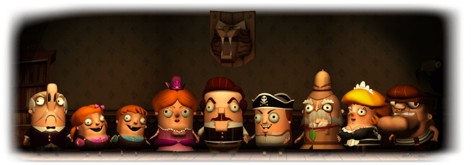

# Уровень 9: Игры и сюжеты

Данный пост — перевод девятой статьи из [курса лекций «Принципы гейм-дизайна»](http://gamedesignconcepts.wordpress.com/) за авторством профессионала и преподавателя [Яна Шрайбера](http://www.gamasutra.com/view/authors/916452/Ian_Schreiber.php). Переводы предыдущих лекций вы можете посмотреть по [ссылке](index.md).

До этого момента мы с вами говорили об играх исключительно с _людологической_ точки зрения. То есть, мы смотрели на игры как на систему правил, подразумевая, что правила – это и есть игра, а повествование любого рода – всего лишь украшение. (Слова с корнем _люд_— или _людо_— относятся к играм; это от латинского _ludus_ – «игра». Мы используем слова _людология,  людография_ и _людический_ потому что латинские слова звучат солиднее).

Но это не совсем так. Как я уже говорил, когда мы рассматривали разные виды решений, некоторые решения игроков могут не иметь абсолютно никакого значения в рамках игровой системы, но они всё равно значимы для игроков, потому что они эмоциональны.

Те из вас, кто играл в настольные ролевые игры, пожалуй, лучше других прочувствовали это. Вспомните самую интересную игру, которую вам приходилось сыграть. Наверняка вы вспоминаете не то, как бросали кости, и не то, как принимали интересные стратегические решения, которые игроки принимали во время боя. Вы вспоминаете что-то драматическое, эмоциональное. Вы вспоминаете историю, а не ходы.

От чего зависит хорошая история? Гейм-дизайнеры часто упоминают в этой связи три работы, которые рассказывают нам, как создавать полезные сюжеты, применимые к играм. Если вам интересно, то вот они:

— «Поэтика» Аристотеля

— «Герой с тысячей лиц» Джозефа Кэмбелла

— «Сюжет: суть, структура, стиль и принципы написания сценариев» Роберта МакКи

Сегодня мы рассмотрим эти работы и их влияние на гейм-дизайн. А также расставим ориентиры, позволяющие нам создать хороший сюжет внутри игры. А затем, в самом конце, разрушим всё до основания.

### Объявление

С самой пятницы меня не было ни в сети, ни в городе, у меня не было времени подтвердить аккаунты новых участников на форуме, прочесть письма, модерировать комментарии в этом блоге и тому подобное.

Сегодня, самое позднее – завтра утром, я надеюсь со всем этим разобраться, когда отойду от бессонных (в хорошем смысле) выходных. Вот что я вам скажу: тестировать свои игры с опытными дизайнерами – совсем не то, что тестировать их с обычными игроками.

### Результаты мини-задания

Вот некоторые новые виды интересного, которые вы предложили:

— служение: противоположность гриферства, служитель – это тот, кто получает удовольствие от того, что способствует развлечению других (я бы, конечно, назвал этот тип как-то иначе, вроде «затейника»… и да, это логично, ведь это было бы полезно для охотника-собирателя. Такой человек был бы ценен для племени. Думается мне, что Дисней определил это как архетип покупателя, обычно ассоциируемый и с матерью в семье).

— создание: создатель радуется созиданию, возведению, строительству. В примерах приводился создаваемый пользователями контент в видеоиграх, однако иногда это можно увидеть и в отдельных настольных играх, таких как _Settlers of Catan._ Конечно же, строительство и возведение полезны для выживания, даже если вы создаёте всего лишь примитивный инструмент или неказистый шалаш.

### Чтение

Прочтите следующее:

_—_ [_Into the Woods: a Practical Guide to the Hero’s Journey_](http://www.gamasutra.com/features/20050617/bates_01.shtml) Боба Бейтса. Эта статья подытоживает работу Джозефа Кэмбелла с точки зрения её приложения к гейм-дизайну.

— [_What Every Game Developer Needs to Know about Story_](http://www.gamasutra.com/features/20050727/sutherland_01.shtml) Джона Сазерленда. Эта статья подытоживает книгу «Сюжет» Роберта МакКи (которая сама по себе является введением в «Поэтику» Аристотеля), и замыкает триаду книг об историях для гейм-дизайнеров.

— _Understanding Comics_, главы 2 и 3, если у вас есть экземпляр этой книги.  Когда будете читать, обратите особое внимание на то, как всё сказанное можно применить к играм. Скотт МакКлауд не будет вам это растолковывать, придётся самостоятельно сложить 2+2.

### Аристотель

Многие слова во времена Аристотеля значили не то, что сегодня. «Поэтика» — это не о поэзии, а о том, как писать трагедии. «Трагедия» же в понимании Аристотеля это не «история с печальным финалом», а скорее история, которая серьёзна и правдоподобна, история, в которой нет ничего сверхъестественного или фантастического (в отличие от _комедии_).

Однако кое-что не изменилось с того времени – в наши дни тоже очень много плохих писателей.

Возможно, Аристотель не первым это заметил, но он первым решил с этим бороться. Он написал о том, как писать истории на достойном уровне. И если многим из вас эти советы покажутся знакомыми – это потому, что их часто повторяют, когда учат вас писать сочинения (даже в начальной школе) – хотя самого Аристотеля при этом не обязательно упоминают.

Например, вы слышали когда-нибудь, что у истории должны быть начало, середина и конец? Это из «Поэтики». Это напоминание о том, что история состоит из определённых частей, а писатель должен знать, как их правильно соединить.

«Поэтика» также задала трёхактную структуру – по сути, разделение сюжета на три части. Первая часть – что-то происходит, приводя в движение события. Во второй части (она обычно самая длинная), протагонист пытается справиться с этими событиями. В финальной части всё приходит к разрешению и итогу. (Я слышал такое описание: в первом акте загони героя на дерево; во втором акте швыряй в него камнями; в третьем – сбей его вниз).

Аристотель настаивал на одной действительно важной вещи: каждая сцена должна быть связана с предыдущей логичными причинно-следственными отношениями. Плохой сюжет выглядит так: «Случился Х, потом случился Y, потом случился Z». А хороший примерно так: «Случился X, а потом из-за этого произошёл Y, а из-за этого случился Z».

Это правило причины и следствия ещё строже применяется к протагонисту. Если с главным героем происходит что-то плохое, это не должно быть случайно, это должно быть следствием понятного человеческого поступка и быть правдоподобным и неизбежным результатом этого поступка. Это заставляет публику жалеть героя и сопереживать ему, потому что мы видим человеческую слабость, мы понимаем, _почему_ герой так поступил и видим также, что это привело к его гибели. Это объясняет, почему Аристотель не жаловал так называемого «бога из машины» (то есть, концовку, где всё внезапно делается хорошо без какого-либо участия главного героя, например: «…и вот как раз, когда герой был на волосок от гибели, он проснулся и понял, что это был просто дурной сон. Конец»). Когда в игру вступает «бог из машины» герой уже не является причиной развязки. Он вообще не влияет на ход событий.

Если применить всё сказанное к играм, нам станет понятно, почему так раздражает, когда герой видеоигры умирает в видеовставке. Именно тогда, когда у игрока нет выбора, именно тогда, когда главный герой не может повлиять на ход событий – сюжет продвигается.

И наконец, стоит отметить, что Аристотель определяет сценическую постановку как состоящую из шести элементов:

— **Сюжет**: повествование, которое описывает, что произошло.

— **Тема:** что всё это значит? _Почему_ всё это произошло?

— **Персонаж:** участник истории.

—**Выбор слов:** диалоги, а также то, как автор их преподносит.

— **Ритм:** здесь действительно имеется в виду ритм в музыкальном смысле, но также и естественная размеренность человеческой речи.

—**Действо:** так Аристотель говорил о «зрелищности» или «спецэффектах» своего времени. И часто жаловался, что слишком многие пьесы представляют собой одно сплошное зрелище и ничего больше. Ничего не напоминает?

### МакКи

Я не знаю, написал ли Роберт МакКи хоть один сценарий, ставший фильмом. По большей части он _обучает_ написанию сценариев. Если вы когда-нибудь выходили из кино со словами: «Да, сюжет лихо закрутили»  — то наверняка сценарий был написан одним из учеников МакКи (я был бы очень рад, если бы когда-нибудь меня назвали «МакКи игрового мира». Отступление для моих бывших студентов: ну-ка встали с дивана и сделали так, чтоб я собой гордился!)

«Сюжет» МакКи по сути является пересказом «Поэтики», но в применении к сценаристике. А ещё «Сюжет» гораздо лучше воспринимается читателем: книга написана лёгким языком (не говоря уже о том, что язык этот – современный английский, а не древнегреческий). Если перефразировать некоторые уроки из преподанных в книге МакКи, можно сказать: сюжет – это не формулы, это формы. Вы не создаёте истории по лекалам. Однако различая общие черты в разных историях, вы сможете создать такую, которая будет уникальной. (И я бы здесь добавил, что то же самое относится ко всему, о чем говорится в этом курсе).

У всех историй подобная форма:

— У протагониста есть  цель, которая создаётся побуждающей причиной.

— Протагонист пытается достичь цели, но разверзается пропасть (то есть, некое препятствие, не обязательно настоящая пропасть), отделяющая его от немедленного достижения цели.

— Протагонист пытается преодолеть пропасть. Либо пропасть слишком широка, и её невозможно преодолеть, либо герой преодолевает пропасть, но разверзается новая.

— Цикл преодолений продолжается до тех пор, пока протагонист не достигает цели, или путь к ней не перекрывается окончательно и бесповоротно.

— В типичной трёхактной структуре обычно есть два повтора (новых препятствия), происходящие между актами.

В самой сути своей, истории – о переменах. Каждая сцена должна что-то менять или содержать неожиданное событие. Если персонажи в конце сцены находятся в том же состоянии, что и в начале, это признак того, что вам следует сцену убрать. Представьте себе ситуацию: вам надо превратить свою жизнь в двухчасовой фильм. Станете ли вы тратить экранное время на рутинные действия, которые совершаете ежедневно? Или покажете времена больших перемен в вашей жизни, позволив зрителям самим предполагать, что между этими событиями жизнь шла своим чередом?

Видите, как замечательно это подходит к играм? Ведь суть игры в принятии решений, которые провоцируют изменения в её состоянии. Игры опираются на неясный исход, и только в самом конце понятно, достигнута цель или упущена бесповоротно. Поэтому нет ничего удивительного в том, что некоторые игры содержат сюжеты, возникающие из конкретного игрового опыта.

Ещё одна интересная вещь, о которой говорит МакКи, это различие между характером и характеристикой персонажа. Вещи, о которых мы думаем в первую очередь, когда нам надо описать персонажа – это поверхностные данные: любимое блюдо, группа крови, цвет волос и тому подобное. МакКи называет это «характеристикой». Характер же – это то, что определяет человека (в том же смысле, что и во фразах «эта деятельность закаляет характер» или «у неё сильный характер»).  МакКи имеет в виду, что узнать _характер_ можно только противопоставив человека чему-либо. Например, мы можем говорить, что кто-то «самоотвержен», но пока этот человек не окажется в горящем здании перед выбором: спасать незнакомца или самому спасаться – это всё пустые разговоры.

Как характер и характеристика проявляются в играх? Во-первых, в линейных повествованиях лучше всего показать характер в сценах-вставках, а не через игровой процесс. Трудно заставить игрока принимать морально-этические решения за главного героя, ведь подобные решения не всегда имеют реальные последствия. Из-за того, что это игра («всего лишь игра», «понарошку») – игрок находится в безопасности, ему не грозят настоящие потери. Следовательно, игрок не делает выбора, который отражал бы его подлинный характер – ведь он не противопоставлен настоящим испытаниям. Заслонить друга от пули в реальном мире – это не совсем одно и то же, что выбрать в меню вариант «получить Очки Светлой Силы». Это не значит, что заложить в сюжет игры моральные дилеммы вовсе невозможно, просто очень сложно дать игроку почувствовать последствия своего выбора в полную силу, потому что решения принимает игрок, а не протагонист. Таким образом, показать сильный характер проще тогда, когда игрок не контролирует ход событий.

Но в то же время, это отнимает у игры присущую ей интерактивность. Это одна из причин, по которым так сложно рассказывать истории в играх.

### Джозеф Кэмбелл

Джозеф Кэмбелл посвятил много времени изучению мифов, легенд и повествованиях о героях, находя сходства и различия. Он обнаружил, что большинство мифов имеют общую структуру, которую он назвал _мономифом_ или _путешествием героя._ Это особый вид сюжета, а потому более специфичный, чем описание МакКи. Так как многие игры ставят игрока на место героя, это определённо полезно знать.

Путешествие героя обычно протекает так:

— Герой начинает как простой смертный в обычном мире, этот мир определённый и устоявшийся.

— Герой призывается в путешествие.

— Герой может послушаться или проигнорировать этот призыв, но тогда произойдут новые события, которые всё-таки вынудят героя откликнуться.

— Герой отправляется в путь и сталкивается с первым препятствием. Часто надо одолеть какого-то стража, чтобы идти дальше.

— Затем герой пересекает границу и попадает в новый, более мрачный мир, где его ждёт череда испытаний, каждое труднее предыдущего. Проходя через эти испытания, герой растёт – не только в смысле «очков опыта» и «уровней», а в смысле «мужает», он становится лучше. Становится, как бы это сказать… _действительно героем._

— В конце концов, герой сталкивается  с абсолютным злом и преодолевает его.

— Герой получает награду

— Герой начинает обратный путь домой. По дороге он сталкивается с последним препятствием.

— Наконец, герой возвращается в свой обычный мир, который, возможно, и остался прежним. Но сам герой вернулся преображённым.

Вы можете найти эту структуру во многих героических повествованиях, а книга Кэмпбелла подробно описывает, _почему_ каждое из этих событий происходит, что оно символизирует, что оно говорит о наших ценностях и о нас, как обществе. Если вкратце, героические сказания повествуют о том, что данная культура считает сводом этических правил и ценностей, а характер героя воплощает и демонстрирует эти идеалы.

Теперь у вас есть искушение использовать это как формулу. Взять список архетипов, поставить галочку напротив каждого и – вуаля! – у вас есть подходящий сюжет. К сожалению, не всё так просто. Как говорит МакКи, сюжет (в  том числе и сюжет героический) – это не формулы, это формы. Цель не в том, чтобы слепо следовать мономифу.

Так зачем он нам, если мы не можем им воспользоваться, чтобы создавать сюжеты? Думаю, самое важное, что нужно почерпнуть отсюда – знание того, каковы общие черты историй, чтобы вы могли придерживаться установленного порядка или нарушать его. Но важно, чтобы вы делали это _сознательно_, а не просто «потому что Кэмпбелл так сказал». Обратите внимание, что не все игры следуют этой структуре – особенно игры, где вы выступаете в роли антигероя.

Боб Бейтс в своей статье комментирует эту структуру:

— Когда вы пишите, начните с замысла, с постулата. Выберите героя или злодея, воплощающего ваш замысел.

— Изобразите обычный мир героя, а затем нарушьте обычных порядок вещей побуждающей причиной. Именно это, как правило, и происходит в начале игры.

— Войдите в «сумрачный лес» — саму игру.

— «Встреча со злом» — по сути, это битва с боссом. Вероятно, именно поэтому мы видим в играх столько боссов!

— «Вознаграждение» может быть представлено в виде достижения героем цели вашей истории, заложенной в предпосылках. Вознаграждение не обязательно должно быть материальным, вроде мешка с золотом, принцессы или древнего магического артефакта.

— В ходе игры характер героя должен развиваться. И здесь дизайнерам снова очень легко угодить в ловушку и сделать это «развитие» исключительно ростом, который измеряется в уровнях (ведь это так удобно: _игрок_ же всё время повышает свой уровень владения игрой). И всё же, сюжету пойдёт на пользу, если _персонаж_ игрока тоже будет развиваться. Не стоит сходу делать его богом – интереснее будет, если он начнёт с простолюдина и _станет_ богом. Помните, _герой_ тоже должен развиваться, не только сам _игрок_.

### Скотт МакКлауд

_Understanding Comics_ в главах 2 и 3 не очень много внимания уделяет тому, как рассказывать истории, но всё же, даёт полезные советы по созданию сильных характеров и драматических моментов.

На страницах 44-45 МакКлауд замечает, что изобразительных стилей множество – от схематичного (смайлик-колобок) до фотореалистичного, со всевозможными вариациями между ними. Он отмечает, что чем  схематичнее изображение, тем сильнее мы проецируем на него себя; чем более оно детализировано и реалистично, тем скорее мы будем рассматривать его как нечто не связанное с нами, самостоятельное. (Возвращаясь на минуту к Костеру, можно сказать, что это происходит благодаря тому, что наш мозг – чудесная машина по распознанию образцов, и всё недостающее мы восполняем тем, что берём из обширной библиотеки знаний и образцов, которую накапливаем в ходе жизни).

Как это можно применить в играх?

— Вспомните главных героев различных видеоигр — Мастер Чифа из _Halo,_ Самус Аран из _Metroid,_ Гордона Фримена из _Half-life,_ Челл из _Portal_. Обычно вы нечасто можете видеть своего персонажа и также нечасто слышите его голос. Это не случайно. Это сделано специально для того, чтобы игроку было проще проецировать свою собственную личность на персонажа. Персонаж становится продолжением вас как игрока, и вы чувствуете эмоциональную привязанность к нему как раз потому, что он не выведен подробно.

— С другой стороны, можно создать сильный характер, который выведен очень подробно – возьмете Дюка Нюкема или Лару Крофт. В этом случае мы сразу же видим, что персонаж – это _не мы._ Чтобы компенсировать это, персонаж должен обладать сильным характером.

— В целом же я могу посоветовать вам два пути создания главного героя. Либо сделать его схематичным и дать игроку возможность «дорисовать» его самостоятельно, или сделать его реалистичным и правдоподобным, наделив сильными чертами характера. Любая другая комбинация обычно не обеспечивает сильной эмоциональной связи игрока со своим аватаром.

— Также стоит внимательно отнестись к врагам и противникам в вашей игре. Раз реалистичное изображение привносит отчуждение, детализированные враги будут выглядеть очень чужеродно, в то время как враги, набросанные схематично будут выглядеть знакомо. В видеоигре _Doom_  монстры изображены реалистично, что делает их инородными и опасными. А в _Pokemon_ монстры, напротив, очень схематичны и карикатурны, что делает их более дружелюбными, а это как раз подходит для игры, где вы привлекаете врагов на свою сторону и превращаете их в союзников. В настольных играх, соответственно: игры со схематичными атрибутами (цветные фишки, например) превращают фишку в продолжение игрока (вроде фамильяра), да и фишки других игроков производят схожее впечатление – это способствует кооперации. И напротив, игры с очень детализированными атрибутами (реалистичные фигурки, прорисованные изображения или фотографии персонажей, подробное их описание) привносит чувство отчужденности между игроком и персонажем, а также приводит к тому, что игроки отчётливей чувствуют друг в друге противников.

— Это относится и к окружающей среде. Если среда (неважно, на трёхмерном компьютерном уровне или двухмерном игровом поле) фотореалистична – это напоминание о том, что это _другой_ мир. Это очень подходить для игр, которые стремятся создать ощущение чуждого и необычайного. Игры-триллеры и ужастики только выиграют, если вы добавите фотореалистичное окружение.

Ещё одна вещь, на которую МакКлауд обращает внимание (на странице 38): мы созданы для того, чтобы мастерить и применять инструменты, и мы воспринимаем их как продолжение самих себя. Наше восприятие самих себя распространяется не только на тело, но и на всё, что находится под нашим непосредственным контролем. Как он отмечает, когда мы попадаем в аварию, мы обычно говорим «это он в меня врезался» а не «это его машина врезалась в мою машину». Мы воспринимаем такие вещи как нечто личное.

И как же это относится к играм?

— В видеоиграх джойстики (или мышь/клавиатура) становятся продолжением человеческого тела. Игрок думает об устройстве-манипуляторе как о части себя. Именно поэтому контроль над игрой и хороший пользовательский интерфейс так важны – если вы не можете понять, как пользоваться контроллером, это так же раздражает, как если вы пытаетесь что-то взять, а ваши руки вас не слушаются.

— И в видеоиграх, и в настольных играх аватар (то есть образ игрока в игре) также действует как продолжение игрока. Как и в случае с аварией, если ваш противник встал на одно поле с вашей фишкой и вернул вас на старт, вы наверняка скажете: «эй, он меня назад отправил!» Как дизайнер вы должны знать об этой эмоциональной связи игрока с его игровым аватаром.

Последнее, на что я бы хотел обратить ваше внимание – это понятие, введённое МакКлаудом, «кровь за кадром» (стр. 66-69). В книге две картинки, одна с убийцей, который заносит топор над жертвой, а следующая изображает только крик. Когда этот парень умер? Между картинками… Это вы, читатель, убили его в своём воображении. Ничего, на самом деле, показано не было.

Многие другие виды искусства используют этот приём. Альфред Хичкок был мастером _ничего_ не показывания. Например, в знаменитой сцене в душе из _«Психо»_ вы, на самом деле, так ничего и не видели. Есть кадр, где некто размахивает ножом (но мы не видим жертву), соседствующий с кадром кричащей женщины (но мы не видим, как ей наносят раны), они сменяют друг друга снова и снова, а затем мы видим кадр с фальшивой кровью, стекающей в слив (не показывающий ни убийцы, ни жертвы).

Как это можно использовать для повествования в играх?

— Некоторые рассказчики стремятся представить историю во всех подробностях: как всё случилось, как всё устроено в их воображаемом мире. Но ведь это не обязательно. Игроки могут сами заполнять пробелы. Не следует всё им растолковывать.

— На самом деле, иногда гораздо полезнее ничего не рассказывать! Воображение игроков куда ярче любой графики.

— Воспринимайте игрока как активного участника вашей истории. Себя-то он именно так и будет воспринимать. Напишите историю, которая подстёгивает воображение.

— У такого подхода есть и экономическая выгода. Обычно мы стремимся вложить деньги в детализированную графику и долгие, проработанные видеовставки, но если мы сэкономим и покажем меньше, суммарный эффект может быть даже сильнее, если, конечно, всё правильно рассчитать.

— Иными словами: иногда меньше – значит больше. Поиск золотой середины между «достаточно информации, чтобы понять, что происходит» и «не так много информации, что воображению ничего не осталось» — одна из самых сложных задач рассказчика и одна из причин, по которой рассказывать истории в играх так тяжело.

— Вспомните  примеры историй (из игр или нет) где было слишком мало информации, или слишком много, и история от этого пострадала. Вспомните другие примеры, где вам не рассказали всего, но это было здорово и слушателям всё равно было интересно.

### Эрнест Адамс

Гейм-дизайнер Эрнест Адамс произнёс воодушевляющую речь на конференции гейм-дизайнеров 2006 года «Новый взгляд на интерактивные истории». Сначала он кратко изложил всё то, о чём я вам только что рассказал, а затем стал разбирать и ставить под сомнение каждый пункт, пытаясь выйти на новый уровень. Ниже я привожу свои конспекты и заметки по поводу его речи:

— ­_«Поэтика»_ Аристотеля – вещь замечательная, но не забывайте, что она писалась для театра, не для игр. У историй, конечно, есть и начало, и середина, и конец…  Но и в играх зачастую _множество_ начал, продолжений и возможных финалов. Трёхактная структура отлично работает для двух- , трёхчасовой пьесы или фильма, но не обязательно подходит для получасовой настольной игры, RPG-кампании, длиной в месяц, или сточасовой игры для консоли.

— _«Путешествие героя»_ Кэмбелла ограничивается историями о героях. А если ваш рассказ вовсе не о герое? Также, как отмечает сам Кэмбелл, _Мономиф_ – не готовый шаблон, так что его можно использовать в качестве инструмента для создания наших собственных историй.

— _«Сюжет»_ МакКи сосредоточен на сценариях, так что он может и подходить, и не подходить играм. Игры отличаются от кино как выразительное средство. Хоть есть и общие черты, не стоит забывать о различиях, поэтому всякий совет по написанию сценариев следует очень осторожно применять в играх.

Так что же, раз ничего из этого всё равно нельзя применить, мы только впустую потратили время? Не думаю. Всё равно надо с чего-то начинать, а изучение способов создания хороших историй при помощи других выразительных средств – это замечательное начало.

Адамс приводит три утверждения, из которых мы очень часто исходим, приступая к созданию историй в играх:

1.  То, к чему должен стремиться всякий интерактивный сюжет – это полностью изолированная среда, некая «Голопалуба» (как в _Стар Треке_), идеальная симуляция мира, которая правдоподобно отвечает на любые действия игрока.
2.  Интерактивные истории – это не игры.
3.  Когда игрок вовлечён в интерактивное повествование, он должен думать об истории, а не о механике.

Затем он ставит их под сомнение.

Во-первых, чем может быть плоха идеальная симуляция мира? Начнём с практической стороны: это невероятно дорого. Приведём и аргумент Костера: у нас уже есть такая, она называется «настоящая жизнь», и она далеко не всегда нам нравится. Но главное в том, что даже в самых «открытых» играх, игроки получают удовольствие не от полной свободы, а, скорее, от свободы действовать в заданных рамках.

Эрнест предложила правило другого дизайнера, которое она описала как «Закон Кена Перлина»: **цена любого события в интерактивной истории должна быть прямо пропорциональна его невероятности**. Что здесь имеется в виду под ценой? Она объясняет это так: у каждого писателя есть «бюджет правдоподобия» — если случается слишком много невероятных вещей, вы рискуете вызвать недоверие. Суммарное количество невероятных событий в ходе вашей истории не должно превышать определённого уровня, иначе игрок посчитает это нечестным. Само собой, у некоторых игр бюджет правдоподобия выше, чем у других, в соответствии с сеттингом, – куры, появляющиеся из неоткуда, может быть, обычное дело в мире, где существует магия, но они будут неуместными в реалистичном современном сеттинге.

Вы, как дизайнер, создающий интерактивный сюжет, по сути, заключаете договор с игроком: если ты (игрок) будешь поступать правдоподобно, то получишь правдоподобную историю. Это важно: бюджет правдоподобия у дизайнера с игроком один на двоих. Игрок должен принять условия сюжета, вступая в «магический круг» игры. Если поступки игрока противоречат закономерностям выбранного мира, он создаёт непоследовательную и противоречивую историю, и в этом нет авторской вины – виноват сам игрок. А раз так, то целью автора _не является_ создание стопроцентно правдоподобной истории во всех её подробностях; история всего лишь должна отзываться правдоподобными последствиями на правдоподобные действия игрока.

Как мы знаем из «Формальных абстрактных инструментов дизайна» Дуга Чёрча, существует баланс между намерением игрока и повествованием – они ограничивают друг друга. Но мы можем раздвинуть эти рамки через сотрудничество между игроком и дизайнером, ролевую игру (имеется в виду действительное принятие на себя своей роли, а не ползание по подземельям).

Само собой, для того, чтобы игрок мог принять условия договора, он должен знать правила игры и согласиться играть по этим правилам. В этом отношение правила – действительно важный компонент игры; но интерактивный сюжет и игра связаны друг с другом таким образом, что игровой опыт – это и игра, и история.

Это и есть способ связать воедино игры и сюжеты. Это как раз то, чего многие из нас пытаются добиться, правда?

### Чему мы научились

Аристотель, Кэмпбелл и МакКи дают нам  самые широко применяемые советы по написанию историй как таковых, поэтому, само собой разумеется, мы применяем эти советы и в играх. Для тех из вас, кто в первую очередь интересуется этим аспектом игр, я очень рекомендую прочесть на досуге книги этих авторов (по завершении курса, конечно же). Вы можете найти их здесь: [Аристотель](http://www.amazon.com/gp/product/0140446362?ie=UTF8&tag=gamedesiconc-20&linkCode=as2&camp=1789&creative=9325&creativeASIN=0140446362), [Кэмбелл,](http://www.amazon.com/gp/product/1577315936?ie=UTF8&tag=gamedesiconc-20&linkCode=as2&camp=1789&creative=9325&creativeASIN=1577315936) [МакКи.](http://www.amazon.com/gp/product/0060391685?ie=UTF8&tag=gamedesiconc-20&linkCode=as2&camp=1789&creative=9325&creativeASIN=0060391685) **Я даю эти ссылки просто для вашего удобства. Это необязательное чтение.**

В играх связь игрока с его персонажем, аватаром, фишками и так далее – распространённый способ вызвать у него эмоциональную реакцию на события игры. Когда вы разрабатываете игру, подумайте над этим, и вообще над тем, как можно добиться от игрока, чтобы он эмоционально «вкладывался» в игру.

Помните о разнице между заложенным повествованием, которое создаётся автором и возникающим повествованием, которое создаётся игровым процессом. Думайте над тем, какое из них важнее для каждой из ваших игр, и как его можно усилить.

### Обратная связь

Если у вас есть возможность, перед тем, как приступать к сегодняшней домашней забаве, пожалуйста, потратьте немного времени на то, чтобы составить **конструктивный отзыв** хотя бы на две других публикации из вашего уровня сложности задания о гриферстве (из лекции 8), и хотя бы на три других публикации из уровня на один ниже вашего (если вы выполняете задание не с зелёным кругом). Постарайтесь закончить свои отзывы до полудня четверга, 30 июля.

### Домашняя забава

Цель этой домашней забавы – дать вам представление о взаимосвязи сюжета и игровой механики, а также о том, что происходит, если они не совпадают.

Мы начнём с упрощённой версии абстрактной игры _Pente_:

— Игроков: 2

— Задача: разместить пять своих камешков в ряд либо окружить пять пар камешков противника.

— Подготовка к игре: поместите клетчатую доску (можно использовать поле для _Го_ или для _Pente_, или расчертить поле самому – попробуйте 19х19) на столе между игроками. Выберите, кто будет ходить первым.

— Ход игры: на своём ходу выберите пустую клетку и отметьте её своим камешком (можно использовать цветные шарики, или просто ставить О или Х, как в _Крестиках-ноликах._ Если на доске _два_ камешка противника, стоящие подряд (по прямой или диагонально) и они смежны с клеткой, которую вы только что отметили, _и при этом_  с другой стороны от двух камешков противника в той же линии стоит ещё один ваш камешек, тогда эти два камешка вашего оппонента считаются пойманными. Уберите их с доски (сотрите, если вы используете для игры бумагу и карандаш) и отложите в сторону, чтобы показать, что вы их захватили. На одном ходу разрешено захватывать несколько пар, если от места, куда вы поставили камешек, расходятся несколько «лучей» с последовательностью два вражеских – один ваш камешек.

Ограничения на захват: захват происходит только в тот момент, когда фишка ставится на доску. Разрешается ставить фишки в середину последовательности «Х-О-О-Х» или «О-Х-Х-О». В этом случае фишки, оказавшиеся в середине, не считаются захваченными.

— Завершение игры: Если игрок выставляет пять своих камешков подряд в одну линию (по прямой или по диагонали), он побеждает. Если он производит в общей сложности пять захватов, он также становится победителем.

Если вы ещё не играли в эту игру, возможно, вам понадобиться сыграть пару раз (с товарищем или с самим собой) чтобы понять её и прочувствовать.

Когда вы ознакомитесь с игрой, **придумайте сюжет** для неё. Каковы декорации? Что собой представляют камешки? Зачем вы их расставляете? Попробуйте придумать историю, которая подошла бы механике. **Не меняйте при этом правил.**

Затем **сыграйте снова** с реальным оппонентом (не меняя правил, но уже со своим повествованием). Обратите внимание на реакцию вашего товарища.

Опубликуйте на форуме:

— Ваш сюжет.

— Ваши впечатления от игры с повествованием. Изменил ли сюжет что-нибудь? Повлиял ли на ваше восприятие игры? Или всё осталось таким же, как и без истории?

— Как вы думаете, почему ваша реакция была именно такой? Как, по-вашему: если бы вы выбрали другую историю, всё было бы иначе?

Опубликуйте на форуме, который лучше всего описывает ваш опыт в гейм-дизайне:

Начинающий, мало или совсем нет опыта до этого курса.

Средний, работа над заданиями курса или опыт в гейм-дизайне, но мало или никакого профессионального опыта.

Продвинутый, по крайней мере, немного профессионального опыта (есть изданные работы).

Публикуйте свои записи до полудня четверга, 30 июля. Затем прочтите, **по крайней мере, пять других постов** вашего форума и пять других, уровнем **выше вашего** (если вы публиковали не в «чёрном ромбе»). Мне важно, чтобы вы увидели разнообразные реакции людей. Прочтите всё это до понедельника, 3 августа.

_Перевод — Ю. Сергеева_