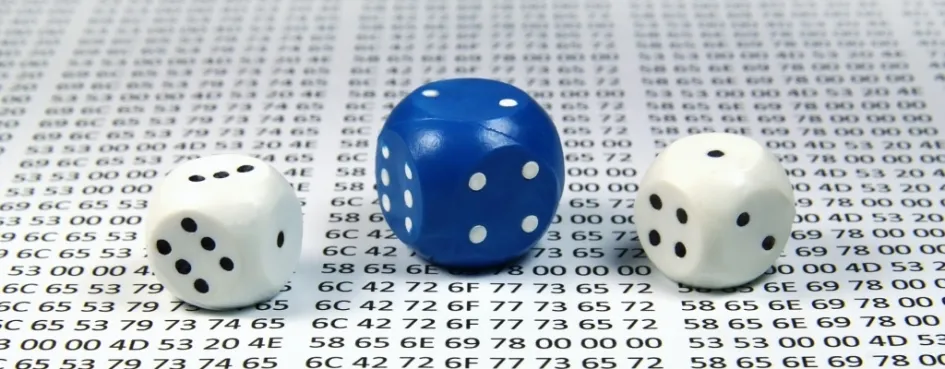

# Уровень 9: Интранзитивные механики

Данный пост — перевод девятой статьи из [курса лекций «Принципы игрового баланса»](https://gamebalanceconcepts.wordpress.com/) за авторством профессионала и преподавателя [Яна Шрайбера](http://www.gamasutra.com/view/authors/916452/Ian_Schreiber.php). Переводы предыдущих лекций вы можете посмотреть по [ссылке](index.md).

### **Чтение/Игры**

Если вы хотите ознакомиться с дополнительной литературой по теме, см. «дополнительные ресурсы» в конце статьи.

### **Тема этой недели**

И снова здравствуйте! Сегодня мы будем учиться балансировать интранзитивные механики. Напоминаю: словом «интранзитивные” (непереходные) гики называют такие игры, как «Камень-Ножницы-Бумага» — то есть такие игры, в которых нет единственной доминирующей стратегии, потому что все бьется буквально всем.

Мы все время наблюдаем непереходные механики в играх. В файтингах, например, типичная схема такова: обычные атаки проигрывают блокам, блоки проигрывают броскам, броски проигрывают атакам. В стратегиях в реальном времени обычно так: у вас есть летающие бойцы, способные уничтожать пехоту, пехота, которая хороша против лучников, и лучники, которые на ура сбивают летающих бойцов. В играх со сменой хода обычно имеются одни юниты, которые хорошо применимы против других, к примеру, тяжелые танки проигрывают противотанковой пехоте, которая, в свою очередь, проигрывает обычной пехоте, которая же проигрывает танкам. В шутерах от первого лица иногда встречаются непереходные взаимоотношения между оружием или транспортом, к примеру, ракетные пусковые установки хороши против танков (поскольку они медленные и по ним легко попасть), а танки хороши против легких транспортных средств (которые уничтожаются быстрыми залпами из танков, как только попадают в их поле видимости). Эти легкие транспортные средства же отлично применимы против ракетных пусковых установок (потому что они могут уклоняться и кружить вокруг медленных ракет, посланных установками). В ММО и настольных РПГ зачастую имеются определенные классы персонажей, которые особенно успешно сражаются с другими классами, и так далее. Так что, как видите, интранзитивные механики применяются буквально повсюду.

Некоторые эти взаимоотношения становятся очевидными далеко не сразу. Например, представьте себе игру, в котором один юнит может сражаться дальнобойными атаками, которые бесполезны против атакующего вблизи, но умеющего становиться невидимым, юнита. Этот юнит, в свою очередь, проигрывает атакующему на среднюю дальность юниту, обладающему радаром для обнаружения невидимок; и, разумеется, этот юнит бессилен против юнита с дальнобойными атаками.

Иногда это все – чистая математика. В _Magic: the Gathering_ существо 1/3 проиграет существу 3/2, которое проиграет существу 2/1 с первым ударом, которое, наконец, проиграет изначальному существу 1/3.

В метаигре ККИ у вас обычно три или четыре доминирующие колоды, каждая из которых собрана с тем расчетом, чтобы она смогла побить одну или несколько остальных. Такое обычно случается не потому, что необходимо было создать что-то непереходное – это просто случается.

### **Решения непереходных механик**

Сегодня мы запачкаем руки самой что ни на есть математичной математикой, с которой мы до этого сталкивались, по мере необходимости одалживая некоторые инструменты то у алгебры, то у линейной алгебры, а то и теории игр. В процессе мы поймем, как находить решения непереходных механик, чтобы узнать, как они работают в наших играх и что мы можем ожидать от игрока-эксперта.

Что в данном случае подразумевается под «решением»? Это не может быть кривая стоимости, потому что каждый вариант иногда выигрывает, а иногда – проигрывает. Вместо этого это _соотношение_ того, насколько часто вы выбираете каждый доступный вариант, и того, насколько часто вы ожидаете, что противник выберет каждый из _своих_ вариантов. К примеру, сбор армии, на 30% состоящей из лучников, на 50% — из пехоты, и на 20% — из летающих бойцов (или 3:5:2) может быть решением к непереходной игре с этими юнитами (при определенных условиях).

Возможно, вы, как гейм-дизайнер, захотите, чтобы некоторые игровые объекты использовались чаще или реже других, и, изменяя относительную стоимость и доступность каждого из этих объектов, вы можете изменить оптимальный набор объектов, используемых игроком. Разрабатывая игру специально с таким расчетом, чтобы больше всего использовались те или иные стратегии, вы, конечно, заранее будете знать, как приблизительно будет развиваться игра. К примеру, вы можете захотеть, чтобы определенные вещи происходили редко во время обычной игры, но чтобы, если уж они происходят, пусть это будет крайне примечательно (можно даже сказать, зрелищно). И, если вы понимаете, как ваши расходы влияют на относительные частоты, вы можете намеренно создать игру именно такой (или, если уже на стадии тестирования игроки используют что-то одно чаще, чем другое, такой анализ может пролить свет на причины такого поведения).

### **Да какая разница?**

Стоит спросить: если все игры с непереходной механикой всего лишь продвинутые версии «Камень-Ножницы-Бумага», в чем их привлекательность? Немногие играют в «Камень-Ножницы-Бумага» для удовольствия, так зачем им играть в игру, которая использует такую же механику, лишь немного ее маскируя?

Во-первых, непереходная игра как минимум более интересна, чем игра с единственной доминирующей стратегией («Камень-Камень-Камень»), потому что там хотя бы есть разнообразие. Во-вторых, непереходная _механика_, примененная в большой игре, может позволять игрокам изменять или модифицировать их стратегии в миттельшпиле. Наблюдая за тем, что в данный момент (в реальном времени) делают другие игроки, пользователи могут делать определенные выборы, особенно в экшн-играх, где нужно реагировать на реакцию противника на вашу реакцию на его действия в течение нескольких миллисекунд.

В играх с блефом игроки могут принимать решения, основанные на том, что, по их наблюдениям, ранее делали другие игроки, и пытаться предсказать дальнейшие шаги других, что особенно интересно в играх, где информация дается не вся и не сразу (к примеру, в покере). Так что, надеюсь, вы понимаете, что, если в игре присутствует непереходная механика, эта игра вовсе не обязательно такая же скучная, как «Камень-Ножницы-Бумага».

К тому же, непереходные механики служат своего рода стоп-краном для вышедших из-под контроля доминантных стратегий. Даже если вы точно не знаете, какую стратегию лучше всего выбрать для своей игры, если во всех стратегиях есть непереходные взаимоотношения, вы, как минимум, будете знать, что единственной доминантной стратегии, которая сведет на нет все остальные, не будет. А все потому, что эта стратегия будет проигрывать как минимум одной контр-стратегии. Даже если сама игра несбалансирована, непереходные механики допускают поправку в метаигре – хотя это и не лучшее, на что можно полагаться, забыв о прочих факторах (если вы так и поступили, значит, вы очень ленивый дизайнер). Но лучше уж иметь подстраховку, выпуская игру, где крупные изменения в игровом балансе крайне сложно внести после релиза.

Так что, если я смог убедить вас, что непереходные механики стоит включить хотя бы в _некоторые_ игры, приготовьтесь учиться решать их!

### **Решение стандартной КНБ**

Давайте начнем с того, что решим стандартную игру КНБ (камень-ножницы-бумага), чтобы посмотреть на принцип ее работы. Поскольку любая фигура теоретически хороша, мы можем _ожидать_, что соотношение будет 1:1:1, что означает, что вы одинаково часто будете выбирать каждую фигуру. И так оно и получится, но важно понимать, как мы дошли до этого, чтобы мы смогли решать более сложные задачи в дальнейшем.

Для начала давайте взглянем на результаты. Давайте обозначим фигуры противника буквами «к», «н», «б», а наши – «К», «Н», «Б» (нам достались прописные буквы, потому что они клевые). Поскольку выигрыш и проигрыш одинаково вероятны и противоположны друг другу (таким образом, один выигрыш и один проигрыш взаимонейтрализуются), а ничья – где-то посередине, давайте обозначим выигрыш «+1», проигрыш — «-1», а ничью – «0» очков. Математический подход был бы применим здесь к _любым_ числам, но так будет проще. Теперь сконструируем таблицу результатов:

|   | **к** | **н** | **б** |
| --- | --- | --- | --- |
| **К** | 0 |  -1 | +1 |
| **Н** | +1 | 0 | \-1 |
| **Б** | \-1 | +1 | 0 |

Конечно, это с _нашей_ точки зрения – например, если мы выбросим (к)амень, а противник – (н)ожницы, мы выиграем и добавим +1 к нашему счету. У противника же таблица будет выглядеть ровно противоположным образом.

А теперь давайте немного переиграем это все и назовем «к», «н» и «б» _вероятностями_, которые будет создавать противник при каждой соответствующей фигуре. К примеру, предположим, что вы заранее знаете, что ваш противник использует стратегию, где «к» равен 0,5, «б» равна «н», которые равны 0,25 (то есть на каждые Ножницы или Бумагу он два раза выбрасывает Камень). Какова наилучшая контр-стратегия?

Чтобы ответить на этот вопрос, мы можем вывести систему из трех уравнений, которая укажет ваши выигрыши для каждой из трех фигур:

\>> Выигрыш для К = 0к + (-1)б + 1н = н-б

\>> Выигрыш для Б = 1к + 0б + (-1)н = к-н

\>>Выигрыш для Н = (-1)к + 1б + 0н = б-к

Так что, основываясь на вероятностях, вы можете просчитать выигрыши. В случае нашего упрямого противника выигрыши будут следующие: К=0, Б=0,25, Н=-0,25. Поскольку из всех троих именно при Б лучший выигрыш, предположим, что противник вообще не меняет свою стратегию, и что лучше всего в качестве контр-стратегии нам выбрасывать Бумагу каждый раз. Мы ожидаем, что она будет набирать 0,25 за бросок – таким образом, мы победим на один раз больше, чем проиграем, в течение четырех раундов. По сути, мы обнаружим, что, если наш противник просто выбрасывает камень _чуть-чуть чаще_, чем все остальные фигуры, чистый выигрыш при Б будет лучше, чем при других фигурах, и нашей лучшей стратегией _все еще_ остается выбрасывание Бумаги 100% времени, пока наш противник не изменит тактику. Это важно, поскольку этот факт говорит нам о том, что интранзитивная механика – штука очень хрупкая, и что даже самый незначительный дисбаланс со стороны игрока может привести к доминантной стратегии его противника.

Конечно, если мы играем с человеком, который заметит, что мы всегда выбрасываем Б, он может начать выбрасывать больше н, что, в свою очередь, заставит нас выбрасывать больше К, а его – больше б, из-за чего мы начнем выбрасывать Н, а противник начнет в ответ выбрасывать к, и так далее, и так далее… Если мы оба постоянно подстраиваем свои стратегии под действия друг друга, дойдем ли мы когда-либо до момента, где мы просто делаем все, что в наших силах? Будем ли мы со временем стремиться к некоему стабильному состоянию?

### **Немного математических теорем**

Прежде чем ответить на этот вопрос, я попрошу вас довериться мне в некоторых вопросах; люди, намного меня умнее, доказали эти некоторые вопросы математически, но в данном случае курс математики бесполезен, так что я просто отмахнусь кое от чего. Надеюсь, вы мне это простите.

Итак, во-первых, если игровые механики симметричны (то есть у обоих игроков – одинаковый набор вариантов и все эти варианты работают одинаково), исход будет для обоих игроков одинаковым. Вероятность того, что противник выберет Камень, такая же, как и вероятность того, что Камень выберем мы.

Во-вторых, каждый выигрыш должен быть таким же, как и остальные; таким образом, К = Б = Н. Если какую-либо стратегию _вообще_ стоит выбирать, она будет предоставлять такой же выигрыш, как и все остальные, потому что, если бы выигрыш был меньше, чем в других таких же стратегиях, ее уже не стоило бы выбирать (вы бы просто взяли какую-нибудь стратегию с большим выигрышем). Если бы выигрыш в ней был больше, чем в других, вы бы выбирали только ее и игнорировали остальные стратегии. Таким образом, _все_ потенциальные ходы, которые можно выбрать, имеют одинаковый выигрыш.

И, наконец, в-третьих: выигрыш для всего должен равняться нулю. Особенно это применимо к симметричным _играм с нулевой суммой_ (потому что выигрыши из-за симметрии будут одинаковыми для обоих игроков, и единственный вариант, при котором возможно то, что оба выигрыша будут в сумме давать ноль и при этом быть равными, это тот, при котором они оба будут равны нулю).

Подытожим:

\>> Все выигрыши, которые в принципе стоит рассматривать, дают равный выигрыш по отношению друг к другу.

\>> В симметричных играх с нулевой суммой все выигрыши равны нулю.

\>> В симметричных играх для всех игроков исход одинаков.

### **Заканчиваем решение КНБ**

Давайте вернемся к нашим уравнениям. _Камень-Ножницы-Бумага_ – это симметричная игра с нулевой суммой, так что:

\>> К = Б = Н = 0.

Поскольку наш противник _должен_ выбрать ровно одну фигуру, мы также знаем, что вероятности его фигур составляют 100%:  
\>> к + б + н= 1

С этого момента мы можем решить систему уравнений методом замены:

\>> К = 0 = н-б, таким образом, б=н

\>>Б = 0 = к-н, таким образом, к=н

\>>Н = 0 = б-к, таким образом, б=к

\>>к+б+н = к+к+к = 1, таким образом, **к=1/3**

\>>Поскольку к=б=н, **б=1/3**, **н=1/3**

Так, наше решение задачи будет состоять в том, что наш противник будет выбрасывать к, б и н – каждую фигуру с вероятностью в 1/3. Из этого можно сделать вывод, что, если мы играем против совершенно случайного противника, _абсолютно неважно_, что мы выберем, наши шансы на победу остаются прежними в любом случае. Конечно, противник это тоже знает, так что, если мы выберем несбалансированную стратегию, он может изменить соотношение своих фигур, чтобы победить нас; лучшая стратегия здесь – выбирать каждую фигуру с вероятностью в 1/3.

Заметьте, что в настоящей игре это вовсе не означает, что лучшая стратегия – это просто играть случайным образом (скажем, втайне кидать кубик перед каждой фигурой)! Как я и говорил ранее, когда люди _пытаются_ играть случайно, у них обычно получается не очень хорошо, так что в реальном мире по-прежнему самой лучшей стратегией остается выбрасывание каждой фигуры примерно с такой же частотой, как и остальных, но, с другой стороны, _каждая_ выбираемая вами фигура зависит от вашей способности обнаруживать и отслеживать типичные схемы в игре вашего противника и в то же время маскировать такие же схемы в вашей игре. Так что наше решение 1:1:1 не указывает вам, какую фигуру выбрать в любое данное время (и именно отсюда, по сути, растут ноги у навыка игры), но со временем мы ожидаем, что соотношение в оптимальной стратегии будет 1:1:1 (поскольку любое отклонение от этого передает вашему противнику более выигрышную стратегию, пока вы снова не вернетесь к 1:1:1).

### **Решаем КНБ с неравным счетом**

Предыдущий пример отлично подходит к Камню-Ножницам-Бумаге, но как бы нам применить его к чему-то более интересному? В качестве следующего шага давайте изменим механизм счета. Например, в файтингах существует типичная транзитивная система, в которой атаки проигрывают броскам, броски – блокам, а блоки – атакам, но все они наносят разный ущерб, так что у них у всех разные результаты в том смысле, что каждый выбор ставит на кон разный процент ущерба. Как изменится КНБ, если мы поэкспериментируем со стоимостью?  
Вот вам пример. Предположим, что я ввел в игру новое правило: если игрок побеждает, показав Камень, это засчитывается, как два выигрыша. Так же легко вы можете вообразить это: в файтинге атаки наносят обычный ущерб, а блоки наносят столько же ущерба (давайте предположим, что успешный блок допускает контратаку), но при этом броски наносят _вдвое_ больше ущерба, чем атака или блок. Но давайте все упростим и скажем, что «каждая победа с Камнем засчитывается как две». Как же это повлияет на наши вероятности?

И снова начнем с таблицы выигрышей:

|   | **к** | **б** | **н** |
| --- | --- | --- | --- |
| **К** | 0 |  -1 | +2 |
| **Б** | +1 | 0 | \-1 |
| **Н** | \-2 | +1 | 0 |

Затем используем ее, чтобы составить наши три уравнения выигрышей:

\>>К = 2н-б

\>>Б = к-н

\>>Н = б-2к

И снова наша игра симметрична и с нулевой суммой, и мы с противником должны выбрать только по одной фигуре, так что у нас по-прежнему:

\>>К = Б = Н = 0

\>>к+б+н = 1

Опять решаем:

\>> К = 0 = 2н-б, таким образом, 2н = б

\>> Б = 0 = к-н, таким образом, к = н

\>> Н = 0 = б-2к, таким образом, 2к = б

\>> к+б+н = к+2к+к = 1, таким образом, **к=1/4**

\>> к=н, таким образом, **н=1/4**

\>> 2к=б, таким образом, **б=1/2**

Таким образом получим удивительный результат: если мы удвоим выигрыши для _Камня_, в итоге мы придем к тому, что _Бумагу_ будут выбирать половину времени, а Камень и Бумагу будут выбирать всего лишь по четверти раз! К этому ответу вы вряд ли бы пришли самостоятельно, не используя математику, но, если оглянуться назад, в этом появляется смысл: поскольку Ножницы выбирать – рискованная затея, игроки будут склонны их игнорировать. Если вы знаете, что ваш противник скорее всего не выбросит Ножницы, Бумага, скорее всего, приведет к ничьей или выигрышу, так что именно Бумагой (а не Камнем) играют чаще всего.  
Так что, если у вас файтинг, в котором успешный бросок причиняет в два раза больше ущерба, чем успешная атака или блок, но игрок может причинить столько же ущерба блоком или атакой, вам стоит ожидать по меньшей мере вдвое увеличившихся попыток применить _атаки_, а не броски или блоки!

### **Решаем КНБ с неполными победами**

Предположим, что мы учтем со всем вышеперечисленным расходы на ресурсы. В файтингах обычно нет «расходов», ассоциирующихся с выполнением какого-то движения (в отличие от времени, возможно), но в стратегиях в реальном времени обычно действительно имеются настоящие расходы на ресурсы для производства юнитов.  
Давайте возьмем простую стратегию, где у вас есть рыцари, которые побеждают лучников, лучники, которые побеждают летающих бойцов и летающие бойцы, побеждающие рыцарей. Более того, предположим, что, если вы пошлете юнита одного типа на юнита того же типа, они уничтожат друг друга и не будет ни чистого выигрыша, ни чистого проигрыша, но с победителями ситуация немного иная. Допустим, что, когда рыцари атакуют лучников, они побеждают, но они все еще теряют 20% здоровья из-за того, что не успели сомкнуть шеренги до того, как на них посыпался град стрел. И, к примеру, лучники, выступив против летающих бойцов, теряют 40% здоровья при контратаках. Но летающие бойцы вообще не получают урона от рыцарей, потому что последние только и могут, что стоять и «отхватывать» (их мечи не очень-то годятся против бойцов, которые парят на высоте сотни футов над ними, прицельно кидаясь камнями). И, наконец, предположим, что рыцарь стоит 50 единиц золота, лучник – 75, а летающий боец – 100. И как _теперь_ это все будет работать?

Начнем с таблицы выигрышей:

|   | **р** | **лучн** | **лет** |
| --- | --- | --- | --- |
| **Р** | 50-50=0 |  (-50\*0.2)+75=+65 | \-50 |
| **Лучн** | \-75+(0.2\*50)= -65 | 75-75=0 | (-75\*0.4)+100=+70 |
| **Лет** | +50 | \-100+(75\*0.4)= -70 | 100-100=0 |

Объясню: если мы с противником возьмем одного и того же юнита, мы оба получим ноль, как подсказывает здравый смысл, но что происходит на самом деле: мы оба играем одним и тем же количеством юнитов и оба их теряем. Так что у нас обоих, по сути, чистый _проигрыш_, но по отношению друг к другу это все еще игра с нулевой суммой (например, по результатам боя Рыцарь против Рыцаря мы получаем 50 единиц золота, так как Рыцарь противника защищается, но в то же время теряем эти же 50 единиц, поскольку наш Рыцарь тоже умирает; суммируя эти результаты, мы получим чистый ноль).

А что насчет ситуации, в которой наш Рыцарь встречает вражеского Лучника? Итак, мы убиваем Лучника, что дает нам 75 единиц золота, но это также уменьшает здоровье нашего Рыцаря на 20%, так что, можно сказать, мы теряем 20% от стоимости нашего Рыцаря (которая составляет 50 единиц золота, напомню), то есть в переводе на золото мы теряем 10 единиц. В итоге получаем 65 единиц золота.

Когда наш Рыцарь встречает вражеского летающего бойца, мы теряем Рыцаря – минус 50 единиц золота. На противнике эта битва вообще никак не сказывается. Куда же девается стоимость Бойца (100 единиц)? В данном случае – никуда, так как у противника после битвы все еще остается Боец, так что он сохраняет свои 100 единиц и ничего не теряет… по крайней мере, пока!

Так что в случае различной стоимости или неполных побед трудность состоит только в том, что нужно подправить вашу таблицу выигрышей. А сам процесс неизменен:

\>>Р = 0р + 65лучн + (-50)лет = 65лучн-50лет

\>>Лучн = (-65)р + 0лучн + 70лет = 70лет-65р

\>>Лет = 50р + (-70)лучн + 0лет = 50р-70лучн

\>>Р = Лучн = Лет = 0

\>>р+лучн+лет = 1

Решив это, мы получим:

\>>Р= 0 = 65лучн-50лет, таким образом, 65лучн = 50лет

\>>Лучн = 0 = 70лет-65р, таким образом, 70лет = 65р, таким образом, лет = (13/14)р

\>>Лет = 0 = 50р-70лучн, таким образом, 50Р= 70лучн, таким образом, лучн = (10/14)р

\>>р+лучн+лет = Р+ (10/14)Р+ (13/14)Р= (37/14)Р= 1, таким образом, **Р= 14/37**

\>>лет = (13/14)Р= (13/14)(14/37), таким образом, **лет = 13/37**

\>>лучн = (10/14)Р= (10/14)(14/37), таким образом, **лучн = 10/37**

В данном случае мы наблюдаем ту еще смесь юнитов, где рыцари встречаются чуть чаще, а лучники – чуть реже. Если вы хотите, чтобы летающие бойцы были более редкими, можно поэкспериментировать с их ценами, или позволить рыцарям наносить им чуть больше ущерба, на что фантазии хватит.

### **Решаем КНБ с неравным соотношением**

До настоящего момента мы по умолчанию считали, что игра симметрична: и у игрока, и у противника одинаковое количество ходов, и мы оба выигрываем или теряем одинаковое количество очков или единиц чего-либо, и всё это подчиняется единому своду правил. Но не все интранзитивные игры одинаково симметричны. Например, давайте представим, что я создал вариант КНБ, в котором в каждом раунде я открываю новую карту, которая меняет выигрыши. В этом раунде, согласно моей карте,мой противник получаетдва очка за победу, выкинув Камень, а я – нет (я бы набрал обычное количество очков). Как это все меняет?  
Вообще-то это здорово усложняет ситуацию, поскольку теперь _оба_ игрока должны просчитывать вероятности фигур противника, а эти вероятности уже могут измениться! Скажем, игрок А получает бонус в виде двух очков за победу с Камнем, а игрок Б – нет. Какова оптимальная стратегия для обоих игроков? И какое преимущество у игрока А, и есть ли оно вообще? Давайте выясним это, составив две таблицы выигрышей.

Таблица игрока А будет выглядеть так:

|   | **кБ** | **бБ** | **нБ** |
| --- | --- | --- | --- |
| **КА** | 0 | \-1 | +2 |
| **БА** | +1 | 0 | \-1 |
| **НА** | \-1 | +1 | 0 |

Таблица игрока Б будет выглядеть так:

|   | **кА** | **бА** | **нА** |
| --- | --- | --- | --- |
| **КБ** | 0 | \-1 | +1 |
| **ББ** | +1 | 0 | \-1 |
| **НБ** | \-2 | +1 | 0 |

Здесь мы _можем_ предположить, что КА=БА=НА и КБ=ББ=НБ, а также, что кА+БА+нА = кБ+бБ+нБ = 1. Тем не менее, мы не можем предположить, что КA=БA=НA=КБ=ББ=НБ=0, потому что мы на самом деле не знаем, равны ли выигрыши для игрока А и игрока Б. Более того, интуиция подсказывает нам, что они скорее всего неравны! И вот мы получили устрашающую систему уравнений:

КA = 2нБ – бБ

БA = кБ – нБ

НA = бБ – кБ

КБ = нA – бA

ББ = кA – нA

НБ = бA – 2кA

КA = БA = НA

КБ = ББ = НБ

кA + бA + нA = 1

кБ + бБ + нБ = 1

Можно пойти сложным путем и использовать метод замены, но куда проще применить матрицы. Вот как мы поступим: перепишем таблицы выигрышей как матрицы. Вот первая:

КА      0          -1         +2

\[           БА       +1        0          -1         \]

НА       -1         +1        0

Столбец представляет левую сторону первых трех уравнений выше, строка – это кА, третий – бА, а четвертый – нА. Давайте для того, чтобы было более понятно, внесем два изменения: во-первых, сместим столбец вправо, что облегчить работу с ним; во-вторых, поскольку КА=БА=НА, давайте просто заменим их все одной переменной Х, которая будет представлять чистый выигрыш игрока А:

0          -1         +2        X

\[           +1        0          -1         X         \]

\-1         +1        0          X

Это упрощенный метод записи всех трех уравнений, при котором мы опускаем имена переменных, но при этом выстраиваем их в одинаковом порядке, так что каждая колонка представляет отдельную переменную:

0кБ      -1бБ    +2нБ    = X

1кБ      +0бБ   -1нБ     = X

\-1кБ     +1бБ   +0нБ    = X

Алгебра говорит нам, что мы можем умножать все в уравнении на константу, и значения останутся прежними (что означает, что мы можем умножить любой столбец матрицы на любую величину, и он останется верным, если мы умножаем все четыре пункта в столбце на одну и ту же величину). Также алгебра говорит нам, что мы можем сложить обе стороны уравнения, и результат будет верным, что означает, что мы можем сложить все элементы двух строк, и получившаяся строка будет верным (и мы можем использовать ее, чтобы приплюсовать к тем строкам, которые уже у нас имеются, или даже заменить существующую строку новым результатом). Также мы можем поменять строки местами, потому что их значения все равно останутся верными вне зависимости от порядка. Нам нужно поместить эту матрицу в так называемую _треугольную форму_, то есть форму, в которой все, что под диагональю, равняется нулю, а сами диагонали (отмеченные здесь звездочкой) должны нулю не равняться:

\*          ?          ?          ?

\[           0          \*          ?          ?          \]

0          0          \*          ?

Итак, сначала мы перестроим их, поменяв местами верхнюю и среднюю строки:  
\-1         +1        0          X

\[           0          -1         +2        X         \]

+1        0          -1         X

Чтобы избавиться от +1 в нижнем ряду, мы сложим верхнюю и среднюю строкии заменим результатом

\-1         +1        0          X

+          +1        0          -1         X

0          +1        -1         2\*X

Теперь наша матрица выглядит так:  
\-1         +1        0          X

\[           0          -1         +2        X         \]

0          +1        -1         2\*X

Теперь нам нужно избавиться от +1 в нижнем ряду, так что мы складываем среднюю и нижнюю строки и заменяем нижнюю строку результатом:  
\-1         +1        0          X

\[           0          -1         +2        X         \]

0          0          +1        3\*X

Теперь мы можем записать все в виде стандартных уравнений и решить, начиная снизу вверх, с помощью метода замены:

\>>+1(нБ) = 3\*X, таким образом, нБ = 3\*X

\>>-1(бБ) +2(нБ) = X, таким образом, -1(бБ)+2(3\*X) = X, таким образом, бБ = 5\*X

\>>-1(кБ) + 1(бБ) = X, таким образом, кБ = 4\*X

На данном этапе нам необязательно знать значение Х, но что мы _знаем_, так то, что соотношение для игрока Б таково: 3 Ножниц к 5 Бумаги к 4 Камням. Поскольку нБ+бБ+кБ = 1, это означает:

**кБ = 4/12         бБ = 5/12        нБ = 3/12**

Мы можем использовать такую же технику для второй серии уравнений, чтобы вычислить оптимальное соотношение для игрока А. Таблица выигрышей будет выглядеть так:

|   | **кА** | **бА** | **нА** |
| --- | --- | --- | --- |
| **КВ** | 0 | \-1 | +1 |
| **БВ** | +1 | 0 | \-1 |
| **НВ** | \-2 | +1 | 0 |

Матрица будет выглядеть следующим образом:  
0          -1         +1        КБ

\[           +1        0          -1         ББ       \]

\-2         +1        0          НБ

Мы снова перестраиваем все, и, поскольку КБ=ББ=НБ, давайте введем для них новую переменную Y (X не будем использовать, чтобы избежать путаницы с предыдущим случаем; помните, что в этом случае выигрыш для одного и другого игроков может различаться). Давайте на этот раз поменяем местами верхнюю и нижнюю строки, а также заменим выигрыши Y:

\-2         +1        0          Y

\[           +1        0          -1         Y         \]

0          -1         +1        Y

Чтобы избавиться от +1 в центральной строке, перед тем, как складывать центральную строку с верхней, мы должны умножить этустроку на 2 (или же умножить верхнююстроку на ½, но мне кажется, что умножать на целые числа легче, чем на дроби):

\-2         +1        0          Y

+          +1\*2    0\*2      -1\*2     Y\*2

0          +1        -2         Y\*3

Теперь наша матрица выглядит так:

\-2         +1        0          Y

\[           0          +1        -2         Y\*3     \]

0          -1         +1        Y

Сложив вторую и третью строки, чтобы избавиться от -1 в нижней, мы получим:

\-2         +1        0          Y

\[           0          +1        -2         Y\*3     \]

0          0          -1         Y\*4

Опять пойдем снизу вверх и используем замену:  
\>>нA = -Y\*4

\>>бA – 2нA = Y\*3, таким образом, бA = -Y\*5

\>>-2кA + бA = Y, таким образом, -2кA = 6Y, таким образом, кA = -Y\*3

Итак, может показаться немного странным, что у нас тут сплошные отрицательные числа вместо положительных в прошлом случае. Возможно, это всего лишь побочный эффект того факта, что средний выигрыш для игрока А скорее всего положителен, тогда как выигрыш игрока Б скорее всего отрицателен. Так или иначе, это все выносится за скобки, так как все, что нас интересует, это относительное соотношение Камня к Ножницам к Бумаге. Для игрока А это соотношение – 3 Камня к 4 Ножницам к 5 Бумаги.

**кA = 3/12         бA = 5/12        нA = 4/12**

Это слегка отличается от оптимального варианта для игрока Б:  
**кБ = 4/12         бБ = 5/12        нБ = 3/12**

Итак, мы можем использовать эти данные для того, чтобы вычислить конкретное преимущество для игрока А. Мы могли бы сделать это, нарисовав таблицу 12х12 и проверив все 144 комбинации, высчитав их все при помощи вероятности, или мы могли бы применить метод Монте-Карло, или просто вставить эти величины в существующие уравнения. Мне представляется наиболее легким последний метод, поскольку у нас уже есть пара уравнений из более ранних примеров, которые прямо относятся к этим:  
нA = -Y\*4, таким образом, Y = -1/12

кБ = X\*4, таким образом, X = +1/12

Мы знаем, что КA = БA = НA и что КБ = ББ = НБ, значит, выигрыш для игрока А равен +1/12, а для игрока Б — -1/12. Это весьма логично и действует как дополнительная проверка: поскольку это все еще игра с нулевой суммой, мы знаем, что выигрыш А должен быть равен отрицательному результату Б. В симметричной игре у них обоих бы получился 0, но эта игра _несимметрична_. Таким образом, если оба игрока играют оптимально, преимущество удивительно мало: всего лишь один лишний выигрыш из 12 раундов!

**Решаем КНБ с дополнениями**

До настоящего момента во всех взаимоотношениях, которые мы анализировали, было только три варианта. А можем ли мы использовать такую же технику с бОльшим выбором? Да. Это просто означает, что мы будем делать то же самое, только в бОльших количествах.

Давайте проанализируем игру Камень-Ножницы-Бумага-Ящерица-Спок.  В этой игре ножницы режут бумагу. Бумага заворачивает камень. Камень давит ящерицу, а ящерица травит Спока, в то время как Спок ломает ножницы, которые, в свою очередь, отрезают голову ящерице, которая ест бумагу, на которой улики против Спока. Спок испаряет камень, а камень, разумеется, затупляет ножницы. Наша таблица выигрышей (С – Спок, Я – ящерица) будет выглядеть следующим образом:

|   | **к** | **б** | **н** | **я** | **с** |
| --- | --- | --- | --- | --- | --- |
| **К** | 0 | \-1 | +1 | +1 | \-1 |
| **Б** | +1 | 0 | \-1 | \-1 | +1 |
| **Н** | \-1 | +1 | 0 | +1 | \-1 |
| **Я** | \-1 | +1 | \-1 | 0 | +1 |
| **С** | +1 | \-1 | +1 | \-1 | 0 |

Также нам известно, что к+б+н+я+с=1, и К=Б=Н=Я=С=0. Можно посчитать это вручную, как и в предыдущих примерах, но есть и другой способ – использовать Excel, который иногда здорово облегчает жизнь.

Сначала нужно ввести вышеуказанную матрицу в сетку 5х5. Также вам понадобится добавить справа от этой сетки колонку 1х5, заполненную единицами (или любыми другими числами, не равняющимися нулю), представляющую собой переменную Х (выигрыш). Затем выберите новую пустую колонку 1х5, и введите следующую формулу в строке формул:

\=MMULT(MINVERSE(A1:E5),F1:F5)

Для параметра MINVERSE используйте область ячеек от верхней левой до нижней правой (я, к примеру, использую область A1:E5, если моя таблица начинается в самом начале листа). Для итоговых значений (я в данном случае использую F1:F5) выделите отдельный столбец на пять строк. Наконец — и это важно — нажмите Ctrl+Shift+Enter, когда закончите вписывать формулу (а не просто Enter). Это скопирует формулу во все выделенные вами пять ячеек и будет работать с ними, как с единым массивом, что для нас важно.

Считаю необходимым предупредить, что этот метод срабатывает не всегда; в частности, если решений нет или они бесконечны, Excel в результате выдаст вам #NUM! вместо собственно числа. По сути, если вы введете вышеупомянутую таблицу выигрышей, он выдаст вам эту ошибку; лишь слегка подправив одну из ячеек (скажем, заменив одну +1s на +0.999999), вы создадите уникальное решение, которое отличается всего лишь на небольшую дробную часть, так что округлите несколько знаков после запятой под «настоящий» ответ. Еще одно предупреждение: любой, кто действительно разбирается в математике, содрогнется, когда вы поступите подобным образом, потому что это в некотором роде жульничество, и вообще-то так матрицу решать нельзя.

Excel дает нам решение для 0,2 каждой из пяти переменных, это означает, что в равной степени вероятно, что противник выберет любую из пяти вариантов. Мы можем убедиться, что да, в самом деле, К = Б = Н = Я = С = 0, так что не имеет значения, какую фигуру мы выбираем, в данном случае они все годятся, если противник играет случайно и шансы выбрасывания каждой фигуры равны.

### **Решаем КНБ с дополнениями и неравными взаимоотношениями**

Не все непереходные механики сбалансированы в равной степени. В некоторых случаях, даже если нет разницы в цене, некоторые фигуры просто лучше других. Давайте рассмотрим в качестве примера несбалансированную игру “Камень-ножницы-бумага-динамит”. Идея заключается в том, что при наличии четвёртой фигуры, динамит побеждает камень (взрывает), а ножницы побеждают динамит (отрезают фитиль).Можно поспорить, что должно победить: бумага или динамит, но для данного случая давайте просто решим, что динамит побеждает бумагу.Теоретически динамит или ножницы — довольно хороший вариант, потому что они побеждают по две из трех других фигур.В то же время камень и бумага выглядят как не самые удачные варианты, потому что проигрывают двум из трех других фигур. Теперь перейдём к математическому расчёту.

Наша таблица выигрышей выглядит следующим образом:

|   | **к** | **б** | **н** | **д** |
| --- | --- | --- | --- | --- |
| **К** | 0 | \-1 | +1 | \-1 |
| **Б** | +1 | 0 | \-1 | \-1 |
| **Н** | \-1 | +1 | 0 | +1 |
| **Д** | +1 | +1 | \-1 | 0 |

Прежде чем перейти непосредственно к расчёту, мы сталкиваемся со следующей проблемой: если внимательно проанализировать таблицу, можно заметить, что динамит лучше или равен бумаге _в каждой из ситуаций_. Иначе говоря, значения в строке Б равны или меньше соответствующих значений в строке Д (аналогично для столбцов б и д, значения в столбце б меньше или равны соответствующим значениям в столбце д). Бумага и динамит проигрывают ножницам, побеждают камень, но при выпадении друг против друга побеждает динамит. Другими словами, нет логической причины всегда выбирать бумагу, потому что, поразмыслив, вы каждый раз будете выбирать динамит!

Используя термины теории игр, мы можем сказать, что динамит _доминирует_ над бумагой.Если бы мы попытались решить эту матрицу при помощи математики, как в примерах выше, мы бы получили очень странные ответы и практически сразу же бы поняли, что для этой матрицы нет решения (или что в ответах нет смысла, как в ситуации, когда вероятность для к, б, н и д была меньше 0 или больше 1).

Этот вариант не сработал бы, потому что на каком-то из этапов мы бы предположили, что К=Б=Н=Д, но в данной ситуации это неверно — выигрыш для бумаги должен быть меньше, чем выигрыш для динамита, поэтому это предположение будет неверным. Прежде чем продолжить с расчётами, нам нужно решить эту проблему — исключить все варианты, над которыми доминируют другие. Иначе говоря, нам нужно убрать из вариантов бумагу.

Таким образом, наша матрица выглядит следующим образом:

|   | **к** | **н** | **д** |
| --- | --- | --- | --- |
| **К** | 0 | +1 | \-1 |
| **Н** | \-1 | 0 | +1 |
| **Д** | +1 | \-1 | 0 |

Анализируем полученную матрицу и проверяем, доминируют ли теперь одни стратегии над другими, после того как мы исключили некоторые варианты (одна строка или столбец доминирует над другой строкой или столбцом только _после того_, как вычеркнуты другие доминирующие варианты, поэтому матрицу нужно будет проанализировать несколько раз, чтобы в итоге исключить подобные случаи).Чтобы проверить наличие доминирующих стратегий, нужно сравнить все строки и столбцы _попарно_. Конечно, если у каждого игрока в распоряжении 10 или 12 вариантов, нужно будет сравнить довольно много величин!

В данном примере нам нужно было исключить только бумагу, и, по сути, мы вернулись к той же таблице выигрышей, как для игры Камень-Ножницы-Бумага, за исключением того, что бумагу “переименовали” в динамит. Теперь вы понимаете, почему с математической точки зрения вообще не имело смысла добавлять динамит в качестве четвертой фигуры.

### **Еще одни неравные взаимоотношения**

Что если мы создадим новую фигуру, над которой не будут сильно доминировать другие фигуры, но роль которой будет немного иной? Например, фигуру — эквивалент ножниц, но с обратным действием: она будет побеждает камень, но проигрывать бумаге? Ну-ка… Строительная машина (С), которая разбивает (побеждает) камень и проигрывает бумаге; при выпадении с ножницами — ничья, потому что обе фигуры особо невзаимодействуют. Теперь наша матрица выигрышей выглядит следующим образом:

|   | **к** | **б** | **н** | **с** |
| --- | --- | --- | --- | --- |
| **К** | 0 | \-1 | +1 | \-1 |
| **Б** | +1 | 0 | \-1 | +1 |
| **Н** | \-1 | +1 | 0 | 0 |
| **С** | +1 | \-1 | 0 | 0 |

В данном примерени у одной фигуры нет какого-то особого преимущества перед другой, так что давайте перейдём к решению. Мы знаем, что к+б+н+с=1, а выигрыши К=Б=Н=С=0.

Итак, наша матрица будет выглядеть следующим образом:

0             -1            +1           -1            0

+1           0             -1            +1           0

\[              -1            +1           0             0             0             \]

+1           -1            0             0             0

Меняем последовательность строк, чтобы показатели, неравные нулю, находились по диагонали, для этого меняем порядок строк:

+1           -1            0             0             0

\-1            +1           0             0             0

\[              +1           0             -1            +1           0             \]

0             -1            +1           -1            0

Суммируем две первые строки и получаем в первой строке показатели, равные 0, вычитаем третью строку из первой и получаем следующие результаты:

+1           -1            0             0             0

0             0             0             0             0

\[              0             -1            +1           -1            0             \]

0             -1            +1           -1            0

Интересно, что все показатели во второй сроке равны 0 (в этом нет никакой полезной информации, это всего лишь означает, что 0 равен 0), и две последние строки совершенно одинаковые (что значит, что последняя строка лишняя и не сообщает нам никакой дополнительной информации).Таким образом, у нас остаётся только две строки полезной информации. Иначе говоря, у нас есть два уравнения (три, если посчитать к+б+н+с=1) и четыре неизвестные величины.

Это значит, что на самом деле решений для данного примера несколько, возможно, их бесконечно много.

Запишем решения:

*   к-б=0, поэтому к=б
*   \-б+н-с=0, поэтому с=н-б

Заменяем величины в уравнении к+б+н+с=1 и получаем:

*   б+б+н+(н-б)=1, поэтому б+2н=1, поэтому б=1-2н (и поэтому к=1-2н).

Заменяем величины в с=н-б и получаем с=н-1+2н, поэтому с=3н-1.

Таким образом, при помощи н мы можем вывести три другие переменные:

*   б=1-2н
*   к=1-2н
*   с=3н-1

На первый взгляд может показаться, что для данного примера существует бесконечное количество решений: выберите любую величину для н и сможете посчитать соответствующие значения для б, к и с. Но можно сузить диапазон.

Каким образом? Давайте вспомним, что все эти переменные — это _вероятности_, то есть диапазон их значений должен быть от 0 (если событие никогда не происходит) до 1 (если событие происходит всегда).Вероятности никогда не могут быть меньше нуля или больше 1. С помощью этого правила мы можем ограничить диапазон для н. Начнем с того, что диапазон значения должен быть от 0 до 1.

Из уравнения с=3н-1 мы знаем, что н должно равняться минимум 1/3 (иначе с будет отрицательным) и максимально значение н может быть 2/3 (иначе с будет больше 100%). Если же мы посмотрим на б и к, мы узнаем, что диапазон значения н от 0 до 1/2. При совмещении двух величин диапазон н должен быть от 1/3 до 1/2. Это интересно: мы видим, что Ножницы в любом случае остаются незаменимым элементом любой стратегии, и их используют постоянно – от трети всего времени до доброй половины.

При условии, что нижняя граница (н=1/3), мы обнаруживаем следующее: б=1/3, к=1/3, с=0, и это тоже верная стратегия. При нижней границе (н=1/2) мы находим это: б=0, к=0, с=1/2. Мы также можем выбрать любую стратегию между этими значениями, скажем, н=2/5, б=1/5, к=1/5, с=1/5.

Есть ли среди этих стратегий какая-нибудь одна, которая лучше прочих, та, которая приносила бы победу чаще, чем остальные? К сожалению, для ответа на этот вопрос нужно поговорить о теории игр чуть больше, чем я сегодня рассчитывал, но, если вкратце, «это зависит от разных обстоятельств», и этот ответ основан на определенных предположениях о том, насколько рациональны ваши противники; могут ли игроки иногда ошибаться в своей стратегии; что игрокам известно о методах противников, и от многого другого. Давайте просто скажем, что все причины хороши, хотя, я уверен, профессионалы в области теории игр могут поспорить о том, что важнее чего.

Также мы можем сказать, что Строительная машина, вероятно, не самое лучшее дополнение к КНБ, поскольку ее присутствие допускает одну стратегию победы, где эту фигуру можно вообще игнорировать, и еще одну – где можно пренебречь и Б, и К. Это заставит задуматься, а зачем вообще тратить ресурсы разработки на ввод двух из трех фигур, которые могут вообще не использоваться, когда игроки набьют руку!

### **Решаем «GameofMalkav»**

До настоящего момента мы постепенно разбирались с каждым нашим предположением: что в игре симметричен выигрыш, что это игра с нулевой суммой, что есть всего три фигуры. Но есть один момент, который мы не прояснили в варианте игры с двумя игроками – что случится, если у игроков будут разные варианты фигур. Будет уже не просто несимметричный выигрыш, а несимметричная игра. Если мы будем опираться на предположение, что у одного игрока столько же фигур, сколько и у другого, что случится, если, скажем, у одного игрока шесть фигур, а у его противника – всего лишь пять? Казалось бы, такого рода задача нерешаема для уникального уравнения (ведь неизвестных шесть, а уравнений всего пять, верно?), но, по сути, получается, что мы в некоторых случаях можем использовать более мощную технику для решения этой задачи в уникальном порядке.

Давайте рассмотрим карту под названием «GameofMalkav» из странной ККИ, о которой большинство из вас, наверное, и не слышало. Она применяется следующим образом: все игроки втайне друг от друга одновременно загадывают число. Игрок, у которого эта карта, выбирает число в диапазоне от 1 до 6, а все остальные – от 1 до 5. Каждый игрок получает количество очков жизни, равное выбранному номеру… _если только_ другой игрок не выбрал число, меньшее на 1 – в этом случае игрок _теряет_ столько очков жизни. Например, если вы выбрали 5, вы получаете 5 очков жизни, если только кто-то другой не выбрал 4. В таком случае вы _теряете_ 5 очков жизни, а противник получает 4, если только кто-то не выбрал 3… и так далее. Чем больше игроков, тем сложнее, так что давайте рассмотрим вариант, где их только двое. Давайте также сделаем упрощающее допущение, что игра – с нулевой суммой, и, если вы получаете 1 очко жизни, противник его теряет (я понимаю, что это не всегда верно, и это будет варьироваться в зависимости от относительных итогов, но так мы, по крайней мере, начнем понимать, что это вообще за карта).

Мы можем задуматься, а какой вообще ожидаемый выигрыш от этой карты? Помогает ли то, что у вас 6 ходов, а у вашего противника – всего 5? Какова лучшая стратегия, и к какому результату мы ожидаем прийти? Короче говоря, имеет ли смысл использовать эту карту… и, если да, как вы решите, используя ее, какое число загадать?

Как обычно, начнем с таблицы выигрышей. Давайте назовем столбцы И1-И6 (игрок), а строки – П1-П5 (противник):

|   | **П1** | **П2** | **П3** | **П4** | **П5** |
| --- | --- | --- | --- | --- | --- |
| **И1** | 0 | +3 | \-2 | \-3 | \-4 |
| **И2** | \-3 | 0 | +5 | \-2 | \-3 |
| **И3** | +2 | \-5 | 0 | +7 | \-2 |
| **И4** | +3 | +2 | \-7 | 0 | +9 |
| **И5** | +4 | +3 | +2 | \-9 | 0 |
| **И6** | +5 | +4 | +3 | +2 | \-11 |

Мы могли бы попытаться решить ее, и, _кажется_, ни для одного, ни для второго игрока нет вариантов, над которыми доминируют другие, но мы бы быстро обнаружили, что в цифрах куча знаков после запятой… а еще то, что решения, оказывается, нет – и причину вы бы обнаружили, как только принялись за решение. По сути, 6 уравнений и 5 переменных создают избыточность… только вот в этом случае мы не можем откинуть строки, и в конце концов вы получите как минимум два противоречащих друг другу уравнения. Так что здесь _не может не быть_ стратегий, над которыми доминируют другие стратегии… дело просто в том, что они очевидны не сразу, потому что у нас здесь несколько строк или столбцов, _над всеми которыми сразу_ доминируют другие несколько строк, и это нельзя заметить невооруженным взглядом. Как же нам тогда их найти?

Мы начнем с того, что найдем лучшие варианты для каждого игрока, как _если бы_ игрок знал, что сделает его противник, заранее. К примеру, если противник знает, что мы выбросим И1, их лучшим вариантом стал бы П5 (тогда у него было бы чистые +4, а у нас – чистые -4). Но затем мы бы продолжили реагировать на их реакцию: если игрок знает, что противник выберет П5, лучшим ходом станет И4. Но лучший ход против И4 – П3. Лучший ход против П3 – И2. Лучших ходом против И2 два – П1 и П5, так что рассмотрим оба варианта:

\>>Лучший ответ на П5 – это И4, как и ранее (и мы можем продолжать непереходную последовательность П5->И4->П3->И2->П5 бесконечно).

\>> Лучший ответ на П1 – И6. Лучший ход против И6 – П5, что снова приводит нас к непереходной последовательности П5->И4->П3->И2->П1->И6->П5.

А что, если мы начнем не оттуда, скажем, первым нашим ходом станет И3? Тогда противнику следует будет выбрать П2, мы ответим на это И6, что в итоге приведет нас к петле П5->И4->П3->И2->П1->И6->П5. Если мы начнем с П5, противник выберет П4, на что получит И3 в ответ, а мы только что рассмотрели этот случай. Почему бы нам не начать с П1, П2, П3, П4, П5, P2, И4 или И6? Мы уже обсуждали эти варианты, анализировать больше нечего.

Таким образом, неважно, откуда мы начинаем, в конце концов, после того, как мы совсем немного поиграем, поймем, что только небольшая фиксированная последовательность ходов на самом деле является частью непереходной натуры этой игры, потому что эти ходы создают две непереходные петли: П5/И4/П3/И2 и П5/И4/П3/И2/П1/И6. Если мы посмотрим на эти последовательности, то увидим, что игроки всегда выбирают либо П1, П3, П5, либо И2, И4, И6. Любой другой вариант невыгоден: например, в любом моменте, где кажется, что использовать И6 – _выгодно_(то есть вы ожидаете, что выиграете), на самом деле нет никакой причины использовать И5 (даже если вы ожидаете, что ваш противник сделает ход П5, вам лучше использовать не И5, а И4).

Если вы используете эту технику для того, чтобы находить непереходные петли, часто можно уменьшить более широкий спектр вариантов до маленького, в котором будут только подходящие варианты… или, на худой конец, вы докажете, что _все_ эти варианты имеют право на существование. Время от времени вам будут встречаться игры (Prisoner’s Dilemma – довольно-таки известный пример, если вы о нем слышали), где для обоих игроков существуют одинаково дающие преимущество зоны в игровом пространстве, так что при последующих раундах можно ожидать, что все игроки будут оказываться в этих зонах; специалисты в теории игр называют такие случаи равновесием Нэша в честь математика, который первым их описал (можете на этом не заморачиваться).

В данном случае мы можем сократить таблицу до нескольких переменных, которые нам интересны:

|   | **П1** | **П3**   | **П5**  |
| --- | --- | --- | --- |
| **И2** | \-3 | +5 | \-3 |
| **И4** | +3 | \-7 | +9 |
| **И6** | +5 | +3 | \-11 |

Запомните, что эти переменные _несимметричны_. Таким образом, мы знаем, что П1=П3=П5 и И2=И4=И6, но мы _не_ знаем, равны ли они все нулю, или одна отрицательна по отношению к другой (предполагается, что И1 – положительна, а П1 – отрицательна, раз уж мы ожидаем, что у игрока с этой картой есть преимущество, но… посмотрим).

Мы составляем матрицу, используя Х, который обозначает выигрыш для И2, И4 и И6:

\-3         +5        -3         X

\[           +3        -7         +9        X         \]

+5        +3        -11       X

Ее можно сократить до треугольной формы и решить так же, как мы делали раньше. Попробуйте сделать это самостоятельно! Ответ я приведу ниже.

Итак, решив эту матрицу, вы получите вероятности П1, П3 и П5, но, чтобы узнать вероятности выбора И2, И4 и И6, вам нужно повернуть матрицу по диагонали, так, чтобы все П оказались слева, а И – наверху (иными словами, вы ее _транспонируете_). В данном случае нам также потребуется сделать все числа отрицательными, потому что это матрица с точки зрения противника, и, следовательно, выигрыши противоположны:

+3        -3         -5         Y

\[           -5         +7        -3         Y         \]

+3        -9         +11      Y

Ее тоже можно решить, как обычно. Если вам интересно, ответы будут приблизительно такими:

И2:И4:И6 = 49% : 37% : 14%

П1:П3:П5 = 35% : 41% : 24%

Ожидаемый выигрыш для игрока И (выше он обозначен как Х) — 0.31; выигрыш для игрока П (Y) отрицателен по отношению к Х — -0.31.

Иными словами, если в эту игру играют двое и играют оптимально, игрок с этой картой в среднем получает преимуществов одну треть очка жизни – так что, пока мы доказывали, что использование этой карты и возможность выбора числа 6 – это преимущество, оказалось, что это не совсем так. С другой стороны, вероятность внезапных крупных изменений может сделать эту карту стоящей в настоящей игре (или нет) – все зависит от вашей колоды. И, разумеется, игра заметно усложняется, если игроков трое или больше – эти случаи мы здесь не рассматриваем.

### **Решаем КНБ для трех игроков**

Пока что мы рассматривали только случаи с двумя игроками, и вы можете комбинировать эти методы как вам угодно для решения каких-либо задач; но можем ли мы применить их для решения задач, где игроков несколько? Все-таки в этих играх очень часто не просто два противника, а могут встречаться целые команды и даже соревнования, где может принять участие любой желающий.

Если команды всего две, решить задачу просто: всего-то и нужно, что посчитать каждую команду как отдельного игрока. В случае соревнований со свободным входом все немного сложнее, поскольку нужно будет принимать во внимание тот факт, что противников несколько; позже мы убедимся в том, что сложность возрастает с каждым последующим игроком. Решить КНБ для трех игроков сложно и неприятно, но все-таки возможно. Четыре игрока – вероятно, максимальное количество участников, с которыми я бы рискнул решать задачи одним из тех методов, которые мы сегодня рассмотрели. Если у вас интранзитивная игра с шестью участниками, где у каждого – свои варианты фигур, и огромная матрица выигрышей для каждого игрока с его комбинациями… ну, скажем так, решение все-таки возможно, но не без помощи компьютера и профессионального игрового теоретика, но сейчас не забивайте себе этим голову. Теоретики усвоили одно: чем сложнее игра, тем сложнее игрокам сойтись на оптимальных стратегиях… что означает, что при невероятно сложных условиях игры тестирование даст вам представление о том, как игра работает, что называется, «в поле», и это намного лучше, чем проводить бесконечные математические расчеты в надежде найти оптимальные решения, потому что игроки, скорее всего, не придут к единому мнению по поводу этих самых решений. Таким образом, для подобной сложной системы вам лучше использовать тестирование в игровом процессе… или, что более вероятно, вам придется упростить игровую механику!

Давайте рассмотрим простой случай: КНБ с тремя игроками. Определим правила следующим образом: если все игроки выбрасывают одну и ту же фигуру или три разных – это ничья. Если фигура одинакова у двух игроков, а третий – «третий лишний» — то тот, кто выбросил фигуру, которая принесла победу, получает по 1 очку от каждого проигравшего.Например, если у двоих –Камень, а у третьего – Ножницы, каждый игрок с Камнем получает +1 очка, а неудачник с ножницами теряет 2 очка. Или наоборот: у одного игрока Камень, а у двух других – Бумага, игрок с Камнем получает +2 очка, а двое других по одному теряют (вся идея в том, чтобы для простоты сохранить нулевую сумму игры, но можете использовать этот метод для решения других задач с механизмом счета).

Конечно, благодаря симметрии мы знаем, что ответ – 1:1:1, как и в версии с двумя игроками. Так что давайте воспользуемся той же схемой, что и раньше: победа при помощи Камня засчитывается как двойная (и из-за нулевой суммы это также значит, что проигрыш с Ножницами – двойной). В случае с двумя игроками мы обнаружили, что решение Камень=Ножницы=1/4, Бумага=1/2. Изменит ли положение ситуация с тремя игроками, ведь сейчас у нас _два_ противника, из-за которых выбрасывать Ножницы – еще опаснее (и, возможно, еще выгоднее выбрасывать Камень)?

Что нам нужно для того, чтобы задача стала решаемой, так это посмотреть на нее с точки зрения одного игрока и считать двух противников – одним. В данном случае таблица выигрышей у нас получится такая:

|   | **кк** | **кб**         | **кн**         | **бб**        | **бн**         | **нн** |
| --- | --- | --- | --- | --- | --- | --- |
| **К**  | 0 | \-1 | +2 | \-2 | 0 | +4 |
| **Б** | +2 | +1 | 0 | 0 | \-1 | \-2 |
| **Н** | \-4 | 0 | \-2 | +2 | +1 | 0 |

Вы можете сказать: «Погодите-ка, тут же три переменные и четыре неизвестные величины (по две к, н и б на каждого игрока), это же невозможно решить»! Но хорошая новость в том, что игра симметрична, так что мы _можем_ решить эту задачу, потому что вероятности противника взяты вместе и умножены (вспомните, что мы умножаем вероятности, когда нам нужно, чтобы два независимых друг от друга события произошли одновременно). Нужно держать в уме одно: вообще-то вероятностей _девять_, а не шесть, просто некоторые из них дублируются. Настоящая таблица будет выглядеть так:

|   | **кк** | **кб**         | **бк**         | **кн**         | **нк**         | **бб**   | **бн**       | **нб**       | **нн** |
| --- | --- | --- | --- | --- | --- | --- | --- | --- | --- |
| **К** | 0 | \-1 | \-1 | +2 | +2 | \-2 | 0 | 0 | +4 |
| **Н**   | +2 | +1 | +1 | 0 | 0 | 0 | \-1 | \-1 | \-2 |
| **Б** | \-4 | 0 | 0 | \-2 | \-2 | +2 | +1 | +1 | 0 |

Все это означает, что, когда мы используем оригинальную матрицу и записываем ее в обычном виде, нужно помнить о том, что кб, кн и бн нужно умножать на 2, поскольку они представлены в двух вариантах (кб и бк, например). Заметьте, что я не упомянул, кто из двух противников кто; я уже говорил раньше, что это не имеет значения, потому что игра симметрична, так что вероятность того, что один игрок выбросит Камень или Ножницы, такая же, как и у других двоих.

Эту таблицу выигрышей не так легко представить в виде матрицы, поскольку у нас две переменные, а не одна. Один из вариантов: разделить таблицу на три мини-матрицы (каждая будет представлять первый выбор противника), а затем сравнить каждую со вторым выбором… а затем решить каждую матрицу отдельно и в конце концов совместить три решения в одно. Это огромная работа, так что давайте вместо всего этого попробуем использовать алгебру, выпишем все данные и посмотрим, сможем ли мы отделить что-то, совместив похожие величины:

\>> Выигрыш для К= -2кб+4кн-2бб+4нн = 0

\>>Выигрыш для Б= 2кк+2кб-2нб-2нн = 0

\>>Выигрыш для Н= -4кк-4кн+2бб+2бн = 0

\>> к+н+б=1 (как обычно)

В конце «=0», поскольку мы знаем, что это симметричная игра с нулевой суммой.

С чего начинать, имея на руках подобные расчеты? Обычно полезно начать с к+н+б=1, чтобы убрать одну из переменных, совместив ее с другими слагаемыми, и затем подставить результат в три вышеприведенных уравнения выигрыша. Избавившись от Камня (к=1-н-б) и подставляя результат, после умножения и сложения, мы получим:

\>> -4бб+2бн-2б+4н = 0

\>> -2б-4н+2 = 0

\>> 2бб-6бн+8б+4н-4 = 0

Мы могли изолировать либо б, либо н в первом или последнем уравнении, используя квадратичную формулу (ну, знаете, «минус б плюс или минус квадратный корень из 4ас и разделить все на 2а»). Это дало бы нам два возможных решения, хотя в большинстве случаев вы обнаружите, что можете одно исключить, так как оно выбивается за границы от 0 до 1 (в которых должны оставаться к, б и н, поскольку они все – вероятности).

Тем не менее, среднее из вышеприведенных уравнений упрощает нашу жизнь, потому что мы можем найти б или н с помощью друг друга:

\>> б=1-2н

Мы получим тот же результат, подставив это в два других уравнения, и, значит, вероятнее всего, мы на верном пути, поскольку результаты друг другу не противоречат:

\>> 20нн-26н+6 = 0

Здесь нам все-таки придется использовать ту квадратичную формулу, которой мы так боялись. Умножив все, мы получим: н=(26+/-14)/40… таким образом, н=100% или н=30%.  
Оба ли эти решения верны? Чтобы убедиться в этом, нам нужно найти численное значение б=1-2н и любого другого уравнения с к.

Если н=30%, мы высчитываем, что б=40%, а к=30%, так что решение верно.

Если н=100%, мы высчитываем, что б= -100%, а к=100%, и это неверно (значение б не может быть ниже нуля), так что у нас остается всего один правильный ответ: к:б:н = 3:4:3.

Оказывается, случай с несколькими игроками _влияет_ на задачу «победы с Камнем засчитываются как двойные», но мы, может быть, ожидали не такого результата; с тремя игроками ответ ближе к 1:1:1, чем с двумя! Возможно, это из-за того, что вероятность исхода с ничьей повышается, если один игрок выберет Камень, другой – Ножницы, а третий – Бумагу. И выбирать Бумагу здесь не так рискованно, как в варианте с двумя игроками, ведь, даже если один противник выберет Камень, другой может тоже выбрать Бумагу, и это превратит двойной проигрыш в ничью.

### **Подведем итоги**

На этой неделе мы учились рассчитывать интранзитивные механики с помощью математики. Наверное, это самое сложное из того, что мы с вами вообще делали, поскольку сводит воедино кривые стоимости транзитивных механик, вероятность и статистику, и именно поэтому я рассмотрел этот вопрос только после предыдущих лекций! Для решения подобных задач вам нужно следовать такому алгоритму:

— Составьте таблицу выигрышей.

— Избавьтесь от всех выборов, над которыми доминируют другие, у обоих игроков (сравнив комбинации строк и столбцов и проверив, не содержит ли какая-нибудь из пар столбец или строку, которые больше подходят или равны другим). Продолжайте делать это, пока не останутся только жизнеспособные варианты.

— Найдите все непереходные «петли», найдя лучший ответный ход на первый ход каждого игрока.

— Рассчитайте выигрыши для каждого выбора одного из игроков, приравняв выигрыши к одной переменной Х. В игре с нулевой суммой Х одного игрока будет отрицательным Х другого игрока. В симметричной игре Х равен нулю, так что просто приравняйте все выигрыши к нулю.

— Добавьте еще одно уравнение, которое сведет сумму вероятностей всех выборов к 1.

— Используя алгебраическую замену, треугольные матрицы, Excel или любые другие имеющиеся в вашем распоряжении средства, решите так много переменных, сколько сможете. Если вам удастся найти значение Х, вы найдете ожидаемый выигрыш (или проигрыш) игрока. Сложив значения Х всех игроков, вы поймете, какая у вас игра: с нулевой суммой (X1+X2+…=0), с положительной (>0) или отрицательной (<0), и насколько она такова.

— Если вы найдете уникальное значение каждого выбора в диапазоне от 0 до 1, вы найдете оптимальные вероятности выбора каждой фигуры. Для асимметричных игр вам нужно будет сделать это отдельно для каждого игрока. Это и будет вашим решением.

— Для игр, в которых более двоих игроков делают одинаковый выбор, выберите одного игрока и делайте расчеты с его точки зрения. Считайте всех противников одним игроком. С каждым игроком, которого вы добавляете к двоим первоначальным, расчеты будут все сложнее. В конце концов, когда у вас всего лишь два игрока, уравнения линейны; если игроков трое – уравнения будут квадратными, четверо – кубические, если у вас пятеро игроков, вы будете решать уравнения четвертой степени и так далее.

Также стоит отметить, что игровая теория весьма обширна, и очень многие виды игр, рассматриваемые в ее рамках, я здесь не упоминал. В частности, также возможно анализировать игры, где игроки делают выбор поочередно, а не одновременно, а также игры, где участники заранее договариваются о чем-то, просят или угрожают, координируют ходы и так далее (пример – игры с позитивной суммой, где два игрока могут обменяться предметами или скооперироваться против других игроков). Это в пределы данного курса не входит, но, если вам интересно, я приведу несколько ссылок в конце статьи.

### **Если вы сейчас работаете над игрой…**

Подумайте о вашей игре и о том, есть ли в ней непереходные механики. Если их нет, спросите себя, есть ли какая-нибудь возможность или необходимость взять некоторые транзитивные механики и сделать их интранзитивными (к примеру, если вы работаете над РПГ, может, вместо того, чтобы просто сделать серию оружия, где каждый предмет лучше предыдущего, стоит в какой-то момент дать игроку на выбор несколько предметов вооружения, которые одинаково хороши, но их особые преимущества проявляются в разных ситуациях).

Если же у вас в игре есть непереходные механики, возьмите наиболее яркий пример и проанализируйте его так, как мы сегодня. Есть ли среди вариантов, которые вы даете игроку, доминирующие или те, над которыми доминируют? Если предположить, что игра проходится оптимально, насколько часто ожидается выбор игроком именно того или иного варианта? Этого вы и ожидали? Этого ли результата вы добивались?

### **Домашнее задание**

Не стесняйтесь выполнять расчеты вручную, если вы хотите подтвердить решения всех приведенных мной задач, — практика никогда не помешает. Когда почувствуете себя уверенно, вот вам небольшая задачка, основанная на мини-игре, которую я однажды видел в серии РПГ _Suikoden_ (не помню, в какой именно игре). В настоящей игре было 13 карт, но я упрощу задачу: здесь будет колода из 5 карт. Вот правила:

*   Игроков двое.
*   Начало игры: каждый игрок берет 5 карт, пронумерованных от 1 до 5. Третья такая колода тасуется и кладется рубашкой вверх на стол.
*   Игровой процесс: в начале каждого раунда карта из колоды переворачивается рисунком вверх; очки по итогам раунда присуждаются в зависимости от цифры на карте. Оба игрока одновременно выбирают одну из своих карт. Побеждает тот, у кого цифра больше; если карты одинаковы – ничья. Оба игрока откладывают эти карты в сторону, их больше использовать нельзя.
*   Итог: игра оканчивается либо после 5 раундов, либо тогда, когда кто-то набирает 8 очков и побеждает.

Как видите, здесь нет определенной доминирующей стратегии. Если противник играет совершенно случайным образом (20% — шанс вытаскивания любой карты), вы можете просто брать ту карту, цифра на которой совпадает с количеством очков, присуждаемых в этом раунде (ходите картой с 3, если выпадает карта с 3, бейте 4 карту с 4 и так далее). Это можно продемонстрировать в Excel, смешав карты противника так, чтобы они выпадали в случайном порядке и, сравнив эту стратегию с описанной выше стратегией «совпадающих цифр», и вы быстро обнаружите, что совпадение цифр приносит победу в большинстве случаев (также, если хотите, можете вычислить все возможные шансы, поскольку существует всего 120 способов перестроить 5 карт).

Означает ли это, что стратегия с совпадением очков – доминантна? Конечно, нет. Если я знаю, что мой противник использует эту стратегию, я смогу победить, играя картой, на которой цифра на 1 больше, чем очков в этом раунде, а в раунде с 5 очками я просто использую карту с 1. Я потеряю 5 очков, но получу другие 10 для победы. Доминирует ли стратегия «больше на 1»? Нет, она проигрывает стратегии «больше на 2»… и так далее, а «больше на 4» проигрывает стратегии «совпадающих цифр» — это непереходные взаимоотношения. Суть этой игры в том, чтобы угадать, какой картой пойдет ваш противник и пойти той, на которой цифра больше на 1 (если у противника 5 – берите 1).

Поскольку все эти стратегии одинаково хороши, вы можете подумать, что можно выбирать любую… но, как мы только что увидели, «совпадающие очки» побьют вашу стратегию! Так что, возможно, оптимальное соотношение _не_ 1:1:1:1:1, а какое-то другое. Можете попробовать его найти.

Если вы не уверены, с чего начать, посмотрите на ситуацию так: в любом случае, стратегий всего 5: совпадающие цифры, больше на одну, больше на две, больше на три и больше на 4.  Рассчитайте таблицу выигрышей для каждой, учитывая все пять карт. Можете менять стратегии каждый раунд, как в КНБ, но, как бы то ни было, в первом раунде у вас всего пять вариантов, и каждый может как помочь вам выиграть, так и привести к поражению – в зависимости от стратегии противника. Таким образом, хотя бы для первой игры вам нужна будет эта таблица выигрышей (в конце концов, у вас всего пять карт и пять стратегий в первом раунде):

|   | **сопадающие**  | **больше на 1**  | **на 2** | **на 3** | **на 4** |
| --- | --- | --- | --- | --- | --- |
| **С**   | 0 | \-5 | +3 | +9 | +13 |
| **+1** | +5 | 0 | \-7 | \-1 | +3 |
| **+2** | \-3 | +7 | 0 | \-9 | \-10 |
| **+3** | \-9 | +1 | +9 | 0 | \-11 |
| **+4** | \-13 | \-3 | +10 | +11 | 0 |

### **Ссылки**

Вот несколько ссылок, которые показались мне полезными, когда я писал эту статью:

“Game Architecture and Design” (Rollings& Morris), главы 3 и 5.

Именно здесь я впервые столкнулся с идеей решения непереходных игр при помощи системы уравнений. Сегодня я попытался немного больше, чем авторы книги, развить тему, но, разумеется, это значит, что книга чуть проще и, вероятно, излагает материал более доступно, чем я. Вся остальная книга посвящена другим темам. Я все еще ее читаю и не могу точно одобрить ее, но точно так же я не могу сказать ничего плохого, так что читайте и формируйте собственное мнение.

“Game Theory: a Critical Text” (Heap &Varoufakis). Книга показалась мне удобным и в меру доступным введением в теорию игр. Должен предупредить, что в целях краткости авторы часто используют собственные акронимы.  То есть просто пролистать некоторые места не получится, ведь из-за этого можно пропустить ключевые понятия, а еще иногда там встречаются предложения, в которых больше нераспознаваемых акронимов, чем нормальных слов!

_Перевод – И. Михеева, Ю. Ткаченко_